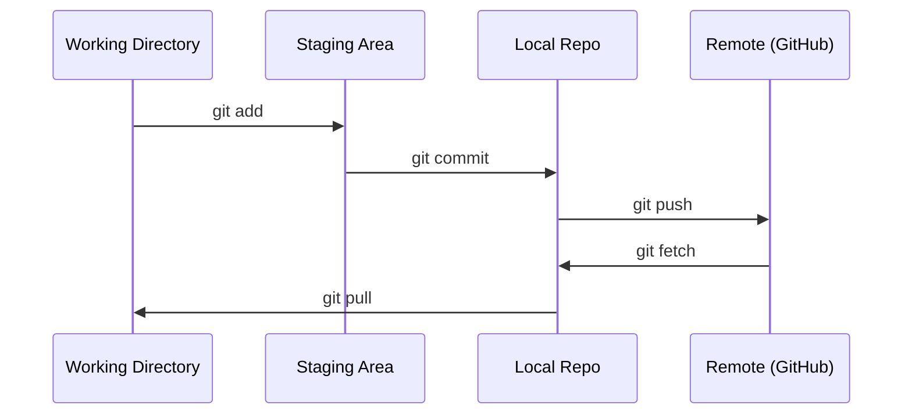

# Git 与协作

> 版本控制必不可少。你在这里开展的每一次实验、构建的每一个模型、完成的每一节课，都要纳入版本管理。

**Type:** Learn
**Languages:** --
**Prerequisites:** Phase 0, Lesson 01
**Time:** ~30 分钟

## 学习目标

- 配置 git 身份信息，掌握 add、commit、push 的日常工作流程
- 创建并合并分支，通过分支隔离实验，避免破坏 main 分支
- 编写一个 `.gitignore`，排除模型检查点和大体积二进制文件
- 使用 `git log` 浏览提交历史，理解项目的演进过程

## 问题所在

你将在 20 个阶段中编写数百个代码文件。没有版本控制，你就会丢失工作成果、引入无法撤销的改动，也无法与他人协作。

Git 是版本控制工具，GitHub 是托管代码的地方。本课只介绍学习本课程所需的内容。

## 核心概念


```mermaid
sequenceDiagram
    participant WD as Working Directory
    participant SA as Staging Area
    participant LR as Local Repo
    participant R as Remote (GitHub)
    WD->>SA: git add
    SA->>LR: git commit
    LR->>R: git push
    R->>LR: git fetch
    LR->>WD: git pull
```

记住三件事：
1. 经常保存（`git commit`）
2. 推送到远程仓库（`git push`）
3. 用分支做实验（`git checkout -b experiment`）

```figure
s0-commit-dag
```

## 动手构建

### 第 1 步：配置 git

```bash
git config --global user.name "Your Name"
git config --global user.email "you@example.com"
```

### 第 2 步：日常工作流程

```bash
git status
git add file.py
git commit -m "Add perceptron implementation"
git push origin main
```

### 第 3 步：用分支做实验

```bash
git checkout -b experiment/new-optimizer

# ... make changes, commit ...

git checkout main
git merge experiment/new-optimizer
```

### 第 4 步：使用本课程仓库

你不能直接向课程仓库推送——只有维护者才有写权限。请先在 GitHub 上创建分叉（fork），点击右上角的 Fork 按钮，这样 `origin` 就会指向你自己的仓库副本：

```bash
git clone https://github.com/YOUR-USERNAME/ai-engineering-from-scratch.git
cd ai-engineering-from-scratch

git checkout -b my-progress
# work through lessons, commit your code
git push origin my-progress
```

## 实际使用

对于这门课，你只需要这几个命令：

| 命令 | 用途 |
|---------|------|
| `git clone` | 获取课程仓库 |
| `git add` + `git commit` | 保存你的工作 |
| `git push` | 备份到 GitHub |
| `git checkout -b` | 在不破坏 main 的情况下尝试新东西 |
| `git log --oneline` | 查看你做过什么 |

就这样。本课程不需要用到变基（rebase）、拣选（cherry-pick）或子模块（submodule）。

## 练习

1. 为本仓库创建分叉，克隆你的分叉仓库，创建名为 `my-progress` 的分支，新建一个文件，将它提交并推送
2. 创建一个 `.gitignore`，排除模型检查点文件（`.pt`、`.pth`、`.safetensors`）
3. 用 `git log --oneline` 查看这个仓库的提交历史，了解各课是如何添加的

## 关键术语

| 术语 | 人们怎么说 | 实际含义 |
|------|----------------|----------------------|
| 提交（Commit） | “保存” | 整个项目在某一时刻的快照 |
| 分支（Branch） | “一个副本” | 指向某次提交的指针，会随着新提交向前移动 |
| 合并（Merge） | “把代码合在一起” | 将一个分支的改动应用到另一个分支 |
| 远程仓库（Remote） | “云端” | 托管在其他位置（GitHub、GitLab）的仓库副本 |
