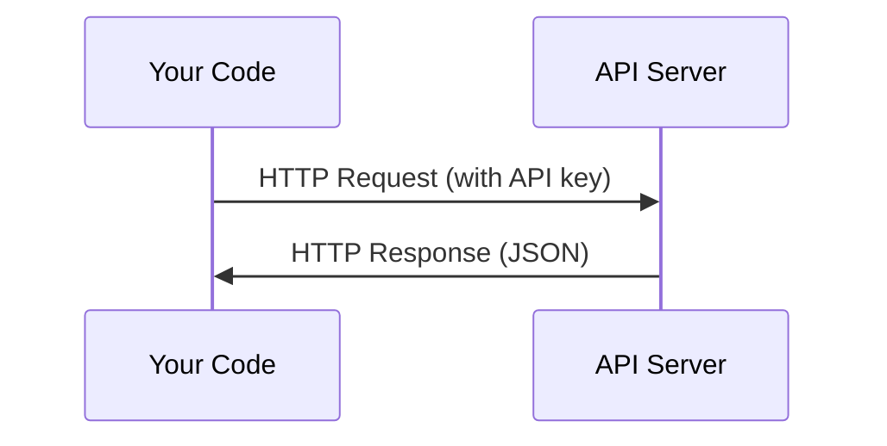

# API 与密钥

> 每个 AI API 的工作方式都一样:发送请求,获得响应。细节会变,模式不会。

**Type:** Build
**Languages:** Python, TypeScript
**Prerequisites:** Phase 0, Lesson 01
**Time:** 约 30 分钟

## 学习目标

- 使用环境变量和 `.env` 文件安全地存储 API 密钥
- 使用 Anthropic Python SDK 和原生 HTTP 各发起一次 LLM API 调用
- 比较 SDK 方式与原生 HTTP 请求/响应格式,以便调试
- 识别并处理常见的 API 错误,包括身份验证错误和速率限制

## 问题

从 Phase 11 开始,你将调用 LLM API(Anthropic、OpenAI、Google)。在 Phase 13-16 中,你将构建在循环中使用这些 API 的 agent。你需要了解 API 密钥的工作原理、如何安全存储它们,以及如何发起你的第一次 API 调用。

## 概念



每次 API 调用都包含:
1. 一个端点(URL)
2. 一个 API 密钥(身份验证)
3. 一个请求体(你想要什么)
4. 一个响应体(你得到什么)

```figure
s0-secret-inject
```

## 动手构建

### 步骤 1:安全存储 API 密钥

绝不要把 API 密钥写进代码。使用环境变量。

```bash
export ANTHROPIC_API_KEY="sk-ant-..."
export OPENAI_API_KEY="sk-..."
```

或者使用 `.env` 文件(并将其加入 `.gitignore`):

```
ANTHROPIC_API_KEY=sk-ant-...
OPENAI_API_KEY=sk-...
```

### 步骤 2:第一次 API 调用(Python)

```python
import os

import anthropic

client = anthropic.Anthropic()

MODEL = os.environ.get("LLM_MODEL", "claude-sonnet-5")

response = client.messages.create(
    model=MODEL,
    max_tokens=256,
    messages=[{"role": "user", "content": "What is a neural network in one sentence?"}]
)

print(response.content[0].text)
```

`LLM_MODEL` 用于选择 Anthropic 的 model id,默认值是不带日期的 Sonnet 别名。其他提供商(OpenAI、Google 等)都遵循"密钥加 model id"的相同模式,但每个提供商都有自己独立的 SDK、端点和请求/响应 schema。

### 步骤 3:第一次 API 调用(TypeScript)

```typescript
import Anthropic from "@anthropic-ai/sdk";

const client = new Anthropic();

const MODEL = process.env.LLM_MODEL ?? "claude-sonnet-5";

const response = await client.messages.create({
  model: MODEL,
  max_tokens: 256,
  messages: [{ role: "user", content: "What is a neural network in one sentence?" }],
});

console.log(response.content[0].text);
```

### 步骤 4:原生 HTTP(不用 SDK)

```python
import os
import urllib.request
import json

url = "https://api.anthropic.com/v1/messages"
headers = {
    "Content-Type": "application/json",
    "x-api-key": os.environ["ANTHROPIC_API_KEY"],
    "anthropic-version": "2023-06-01",
}
body = json.dumps({
    "model": os.environ.get("LLM_MODEL", "claude-sonnet-5"),
    "max_tokens": 256,
    "messages": [{"role": "user", "content": "What is a neural network in one sentence?"}],
}).encode()

req = urllib.request.Request(url, data=body, headers=headers, method="POST")
with urllib.request.urlopen(req) as resp:
    result = json.loads(resp.read())
    print(result["content"][0]["text"])
```

这就是各种 SDK 在底层实际做的事情。理解原生 HTTP 调用在调试时很有帮助。

## 使用

本课程中:

| API | 什么时候需要 | 免费额度 |
|-----|-----------------|-----------|
| Anthropic (Claude) | Phase 11-16(agent、工具) | 注册赠送 $5 额度 |
| OpenAI | Phase 11(对比) | 注册赠送 $5 额度 |
| Hugging Face | Phase 4-10(模型、数据集) | 免费 |

你现在不需要全部配好。在哪一课需要时再设置即可。

## 交付

本课产出:
- `outputs/prompt-api-troubleshooter.md` - 诊断常见 API 错误

## 练习

1. 获取一个 Anthropic API 密钥,并发起你的第一次 API 调用
2. 尝试原生 HTTP 版本,并将其响应格式与 SDK 版本进行对比
3. 故意使用错误的 API 密钥,并阅读错误信息

## 关键术语

| 术语 | 人们常说的 | 实际含义 |
|------|----------------|----------------------|
| API key | "API 的密码" | 一个唯一字符串,用于标识你的账户并授权请求 |
| Rate limit | "他们在限流" | 每分钟/每小时的最大请求数,用于防止滥用并保证公平使用 |
| Token | "一个词"(在 API 语境中) | 一个计费单位:输入和输出 token 分别计数和计费 |
| Streaming | "实时响应" | 逐词接收响应,而不是等待完整响应 |