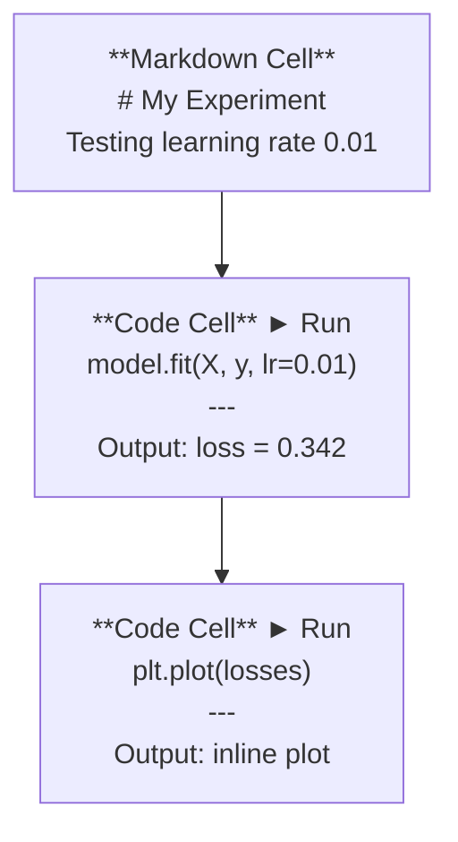
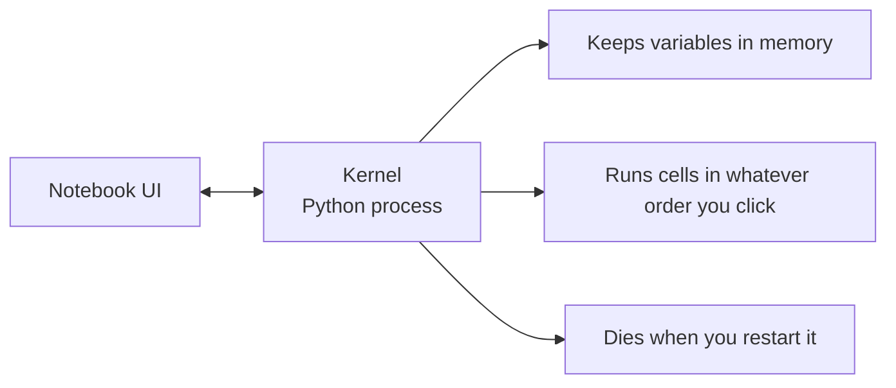

# Jupyter Notebooks

> Notebook 是 AI 工程的实验台。你在这里做原型验证，然后把可行的部分迁移到生产环境。

**Type:** Build
**Languages:** Python
**Prerequisites:** Phase 0, Lesson 01
**Time:** ~30 分钟

## 学习目标

- 安装并启动 JupyterLab、Jupyter Notebook，或带有 Jupyter 扩展的 VS Code
- 使用魔法命令（`%timeit`、`%%time`、`%matplotlib inline`）进行内联的性能测试和可视化
- 区分何时使用 notebook、何时使用脚本，并应用“在 notebook 中探索，在脚本中交付”的工作流程
- 识别并避免常见的 notebook 陷阱：乱序执行、隐藏状态和内存泄漏

## 问题所在

每一篇 AI 论文、教程和 Kaggle 比赛都在使用 Jupyter notebook。它让你可以分段运行代码、内联查看输出、将代码与解释混排，并快速迭代。如果脱离 notebook 学习 AI，就像做数学作业没有草稿纸。

但 notebook 也有真实的陷阱。人们把它用于所有事情，包括它极不擅长的场景。知道何时该用 notebook、何时该用脚本，能让你日后免于调试噩梦。

## 核心概念

Notebook 是一个单元格列表。每个单元格要么是代码，要么是文本。



内核（kernel）是在后台运行的 Python 进程。当你运行一个单元格时，代码会被发送到内核，内核执行后把结果返回。所有单元格共享同一个内核，因此变量在单元格之间是持久存在的。



“按你点击的任意顺序运行”这一点既是超能力，也是自伤利器。

```figure
s0-cell-order
```

## 动手构建

### 第 1 步：选择你的界面

三种选项，一种格式：

| 界面 | 安装 | 最适合 |
|-----------|---------|----------|
| JupyterLab | `pip install jupyterlab` 然后 `jupyter lab` | 完整 IDE 体验、多标签页、文件浏览器、终端 |
| Jupyter Notebook | `pip install notebook` 然后 `jupyter notebook` | 简单、轻量，一次一个 notebook |
| VS Code | 安装 "Jupyter" 扩展 | 已集成在你的编辑器中、git 集成、调试 |

三者读写的是同一种 `.ipynb` 文件。选你喜欢的即可。JupyterLab 在 AI 工作中最常见。

```bash
pip install jupyterlab
jupyter lab
```

### 第 2 步：重要的键盘快捷键

你在两种模式下操作。按 `Escape` 进入命令模式（左侧蓝色竖条），按 `Enter` 进入编辑模式（绿色竖条）。

**命令模式（最常用）：**

| 按键 | 操作 |
|-----|--------|
| `Shift+Enter` | 运行单元格，移动到下一个 |
| `A` | 在上方插入单元格 |
| `B` | 在下方插入单元格 |
| `DD` | 删除单元格 |
| `M` | 转换为 markdown |
| `Y` | 转换为代码 |
| `Z` | 撤销单元格操作 |
| `Ctrl+Shift+H` | 显示所有快捷键 |

**编辑模式：**

| 按键 | 操作 |
|-----|--------|
| `Tab` | 自动补全 |
| `Shift+Tab` | 显示函数签名 |
| `Ctrl+/` | 切换注释 |

`Shift+Enter` 是你每天要用一千次的快捷键。先学会它。

### 第 3 步：单元格类型

**代码单元格**运行 Python 并显示输出：

```python
import numpy as np
data = np.random.randn(1000)
data.mean(), data.std()
```

输出：`(0.0032, 0.9987)`

**Markdown 单元格**渲染格式化文本。用它们记录你在做什么以及为什么。支持标题、粗体、斜体、LaTeX 数学公式（`$E = mc^2$`）、表格和图片。

### 第 4 步：魔法命令

这些不是 Python。它们是以 `%`（行魔法）或 `%%`（单元格魔法）开头的 Jupyter 专用命令。

**给代码计时：**

```python
%timeit np.random.randn(10000)
```

输出：`45.2 us +/- 1.3 us per loop`

```python
%%time
model.fit(X_train, y_train, epochs=10)
```

输出：`Wall time: 2.34 s`

`%timeit` 会多次运行代码并取平均值。`%%time` 只运行一次。微基准测试用 `%timeit`，训练任务用 `%%time`。

**启用内联绘图：**

```python
%matplotlib inline
```

此后每个 `plt.plot()` 或 `plt.show()` 都会直接渲染在 notebook 中。

**无需离开 notebook 即可安装包：**

```python
!pip install scikit-learn
```

`!` 前缀可以运行任意 shell 命令。

**查看环境变量：**

```python
%env CUDA_VISIBLE_DEVICES
```

### 第 5 步：内联显示富输出

Notebook 会自动显示单元格中最后一个表达式。但你也可以主动控制它：

```python
import pandas as pd

df = pd.DataFrame({
    "model": ["Linear", "Random Forest", "Neural Net"],
    "accuracy": [0.72, 0.89, 0.94],
    "training_time": [0.1, 2.3, 45.6]
})
df
```

这会渲染出一个格式化的 HTML 表格，而不是纯文本输出。绘图同理：

```python
import matplotlib.pyplot as plt

plt.figure(figsize=(8, 4))
plt.plot([1, 2, 3, 4], [1, 4, 2, 3])
plt.title("Inline Plot")
plt.show()
```

图表直接出现在单元格下方。这就是 notebook 主导 AI 工作的原因：数据、图表和代码同时呈现在你眼前。

对于图片：

```python
from IPython.display import Image, display
display(Image(filename="architecture.png"))
```

### 第 6 步：Google Colab

Colab 是云端免费的 Jupyter notebook。它提供 GPU、预装的库以及 Google Drive 集成。无需任何配置。

1. 访问 [colab.research.google.com](https://colab.research.google.com)
2. 上传本课程中的任意 `.ipynb` 文件
3. Runtime > Change runtime type > T4 GPU（免费）

Colab 与本地 Jupyter 的区别：
- 文件不会在会话之间持久保存（需保存到 Drive 或下载）
- 预装库：numpy、pandas、matplotlib、torch、tensorflow、sklearn
- 用 `from google.colab import files` 上传/下载文件
- 用 `from google.colab import drive; drive.mount('/content/drive')` 进行持久化存储
- 免费版会话在闲置 90 分钟后超时

## 应用实践

### Notebook vs 脚本：何时用哪个

| 用 notebook 做 | 用脚本做 |
|-------------------|-----------------|
| 探索数据集 | 训练流水线 |
| 原型验证模型 | 可复用的工具函数 |
| 可视化结果 | 涉及 `if __name__` 的任何任务 |
| 讲解你的工作 | 定时运行的代码 |
| 快速实验 | 生产代码 |
| 课程练习 | 包和库 |

原则：**在 notebook 中探索，在脚本中交付**。

AI 领域的常见工作流程：
1. 在 notebook 中探索数据
2. 在 notebook 中构建模型原型
3. 验证可行后，将代码迁移到 `.py` 文件
4. 再把这些 `.py` 文件导入回 notebook，继续实验

### 常见陷阱

**乱序执行。** 你先运行单元格 5，再运行单元格 2，然后是单元格 7。Notebook 在你的机器上运行正常，但别人从头到尾运行时就会出错。解决办法：分享前执行 Kernel > Restart & Run All。

**隐藏状态。** 你删除了一个单元格，但它创建的变量仍留在内存中。Notebook 看起来很干净，实际却依赖着一个“幽灵单元格”。解决办法：定期重启内核。

**内存泄漏。** 加载 4GB 数据集、训练模型、再加载另一个数据集。内存完全没有释放。解决办法：使用 `del variable_name` 和 `gc.collect()`，或重启内核。

## 交付成果

本课产出：
- `outputs/prompt-notebook-helper.md` 用于调试 notebook 问题

## 练习

1. 打开 JupyterLab，创建一个 notebook，用 `%timeit` 比较列表推导式与 numpy 生成 100,000 个随机数数组的性能
2. 创建一个同时包含 markdown 和代码单元格的 notebook，加载 CSV、显示 dataframe 并绘制图表。然后执行 Kernel > Restart & Run All，验证它能从头到尾正常运行
3. 把 `code/notebook_tips.py` 中的代码粘贴到 Colab notebook 中，用免费 GPU 运行

## 关键术语

| 术语 | 人们怎么说 | 实际含义 |
|------|----------------|----------------------|
| Kernel | “运行我代码的那个东西” | 一个独立的 Python 进程，负责执行单元格并在内存中保存变量 |
| Cell | “一段代码块” | notebook 中可独立运行的单元，可以是代码或 markdown |
| Magic command | “Jupyter 技巧” | 以 `%` 或 `%%` 为前缀的特殊命令，用于控制 notebook 环境 |
| `.ipynb` | “Notebook 文件” | 一个 JSON 文件，包含单元格、输出和元数据。是 IPython Notebook 的缩写 |

## 延伸阅读

- [JupyterLab 文档](https://jupyterlab.readthedocs.io/) 了解完整功能集
- [Google Colab FAQ](https://research.google.com/colaboratory/faq.html) 了解 Colab 特有的限制和功能
- [28 个 Jupyter Notebook 技巧](https://www.dataquest.io/blog/jupyter-notebook-tips-tricks-shortcuts/) 面向高级用户的快捷操作