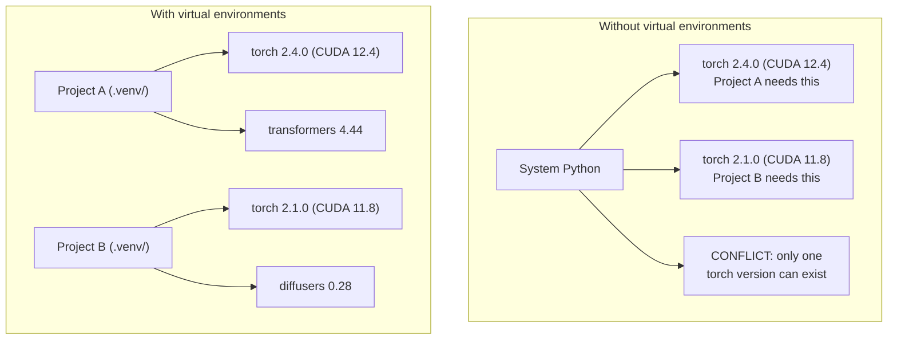

# Python 环境

> 依赖地狱（dependency hell）确实存在。虚拟环境（virtual environment）就是解决之道。

**Type:** Build
**Languages:** Shell
**Prerequisites:** 第 0 阶段，第 01 课
**Time:** ~30 分钟

## 学习目标

- 使用 `uv`、`venv` 或 `conda` 创建相互隔离的虚拟环境
- 编写包含可选依赖项（dependency）分组的 `pyproject.toml`，并生成锁文件（lockfile），确保环境可复现
- 诊断并解决常见问题：全局安装、混用 pip/conda、CUDA 版本不匹配
- 采用按课程阶段划分环境的策略，处理项目之间的依赖项冲突

## 要解决的问题

你为一个微调（fine-tuning）项目安装了 PyTorch 2.4。到了下一周，另一个项目却需要 PyTorch 2.1，因为它所用的 CUDA 构建版本已被锁定。你执行全局升级，第一个项目就无法正常运行；你再降级，第二个项目又出了问题。

这就是依赖地狱。它在 AI/ML 工作中屡见不鲜，原因如下：

- PyTorch、JAX 和 TensorFlow 各自附带自己的 CUDA 绑定
- 模型库会锁定特定的框架版本
- 全局执行 `pip install` 会覆盖原先安装的内容
- CUDA 11.8 构建版本无法与 CUDA 12.x 驱动程序配合使用，反过来也一样

解决办法是：为每个项目建立独立、隔离的环境，让各个项目使用各自的包。

## 核心概念



```figure
s0-env-isolation
```

## 动手实现

### 方案 1：uv venv（推荐）

`uv` 是速度最快的 Python 包管理器（package manager），比 pip 快 10-100x。它将虚拟环境、Python 版本和依赖解析整合在同一个工具中。

```bash
curl -LsSf https://astral.sh/uv/install.sh | sh

uv python install 3.12

cd your-project
uv venv
source .venv/bin/activate
```

安装包：

```bash
uv pip install torch numpy
```

一步创建带有 `pyproject.toml` 的项目：

```bash
uv init my-ai-project
cd my-ai-project
uv add torch numpy matplotlib
```

### 方案 2：venv（内置）

如果无法安装 `uv`，可以使用 Python 自带的 `venv`：

```bash
python3 -m venv .venv
source .venv/bin/activate  # Linux/macOS
.venv\Scripts\activate     # Windows

pip install torch numpy
```

它比 `uv` 慢，但只要安装了 Python 就能使用。

### 方案 3：conda（按需使用）

Conda 可以管理 CUDA 工具包、cuDNN 和 C 库等非 Python 依赖项。以下情况适合使用它：

- 你需要特定版本的 CUDA 工具包，但不想在系统范围内安装
- 你使用的是共享集群，无法安装系统软件包
- 某个库的安装说明明确要求“使用 conda”

```bash
# Install miniconda (not the full Anaconda)
curl -LsSf https://repo.anaconda.com/miniconda/Miniconda3-latest-Linux-x86_64.sh -o miniconda.sh
bash miniconda.sh -b

conda create -n myproject python=3.12
conda activate myproject

conda install pytorch torchvision torchaudio pytorch-cuda=12.4 -c pytorch -c nvidia
```

记住一条规则：如果某个环境由 conda 管理，就用 conda 管理这个环境中的所有包。在 conda 环境中混用 `pip install` 会造成依赖项冲突，排查起来十分棘手。

### 本课程的做法：按阶段划分环境

你可以为整门课程只创建一个环境，但不建议这样做。不同阶段需要的依赖项各不相同，有时还会互相冲突。

策略如下：

```text
ai-engineering-from-scratch/
├── .venv/                    <-- shared lightweight env for phases 0-3
├── phases/
│   ├── 04-neural-networks/
│   │   └── .venv/            <-- PyTorch env
│   ├── 05-cnns/
│   │   └── .venv/            <-- same PyTorch env (symlink or shared)
│   ├── 08-transformers/
│   │   └── .venv/            <-- might need different transformer versions
│   └── 11-llm-apis/
│       └── .venv/            <-- API SDKs, no torch needed
```

`code/env_setup.sh` 中的脚本会为本课程创建基础环境。

## pyproject.toml 基础

每个 Python 项目都应该有一个 `pyproject.toml`。它用一个文件取代 `setup.py`、`setup.cfg` 和 `requirements.txt`。

```toml
[project]
name = "ai-engineering-from-scratch"
version = "0.1.0"
requires-python = ">=3.11"
dependencies = [
    "numpy>=1.26",
    "matplotlib>=3.8",
    "jupyter>=1.0",
    "scikit-learn>=1.4",
]

[project.optional-dependencies]
torch = ["torch>=2.3", "torchvision>=0.18"]
llm = ["anthropic>=0.39", "openai>=1.50"]
```

然后执行安装：

```bash
uv pip install -e ".[torch]"    # base + PyTorch
uv pip install -e ".[llm]"     # base + LLM SDKs
uv pip install -e ".[torch,llm]" # everything
```

## 锁文件

锁文件将每个依赖项，包括传递依赖项（transitive dependency），都锁定到确切的版本。这就保证了可复现性：任何人根据该锁文件安装，得到的包都完全相同。

```bash
# uv generates uv.lock automatically when using uv add
uv add numpy

# pip-tools approach
uv pip compile pyproject.toml -o requirements.lock
uv pip install -r requirements.lock
```

将锁文件提交（commit）到 git。其他人克隆仓库后，根据锁文件安装，就能获得完全相同的版本。

## 常见错误

### 1. 全局安装

```bash
pip install torch  # BAD: installs to system Python

source .venv/bin/activate
pip install torch  # GOOD: installs to virtual environment
```

检查包的安装位置：

```bash
which python       # should show .venv/bin/python, not /usr/bin/python
which pip           # should show .venv/bin/pip
```

### 2. 混用 pip 和 conda

```bash
conda create -n myenv python=3.12
conda activate myenv
conda install pytorch -c pytorch
pip install some-other-package   # BAD: can break conda's dependency tracking
conda install some-other-package # GOOD: let conda manage everything
```

如果必须在 conda 环境内使用 pip，例如某些包只能通过 pip 安装，那么先安装所有 conda 包，最后再安装 pip 包。

### 3. 忘记激活环境

```bash
python train.py           # uses system Python, missing packages
source .venv/bin/activate
python train.py           # uses project Python, packages found
```

Shell（命令解释器）的提示符中应该显示环境名称：

```text
(.venv) $ python train.py
```

### 4. 将 .venv 提交到 git

```bash
echo ".venv/" >> .gitignore
```

虚拟环境的体积为 200MB-2GB。它们是本机环境，无法直接迁移到其他机器。应该提交的是 `pyproject.toml` 和锁文件。

### 5. CUDA 版本不匹配

```bash
nvidia-smi                # shows driver CUDA version (e.g., 12.4)
python -c "import torch; print(torch.version.cuda)"  # shows PyTorch CUDA version

# These must be compatible.
# PyTorch CUDA version must be <= driver CUDA version.
```

## 实际使用

运行设置脚本，创建课程环境：

```bash
bash phases/00-setup-and-tooling/06-python-environments/code/env_setup.sh
```

这会在仓库根目录下创建 `.venv`，安装核心依赖项并验证安装结果。

## 练习

1. 运行 `env_setup.sh`，确认所有检查均通过
2. 创建第二个虚拟环境，在其中安装另一个版本的 numpy，并确认两个环境相互隔离
3. 为同时需要 PyTorch 和 Anthropic SDK（软件开发工具包）的项目编写 `pyproject.toml`
4. 有意将一个包安装到全局环境中，也就是不激活 venv；观察它的安装位置，然后卸载该包

## 关键术语

| 术语 | 常见说法 | 实际含义 |
|------|----------------|----------------------|
| 虚拟环境 | “一个 venv” | 一个独立的目录，包含 Python 解释器和包，与系统 Python 相互隔离 |
| 锁文件 | “锁定的依赖项” | 列出每个包及其确切版本的文件，确保不同机器上的安装结果一致 |
| pyproject.toml | “新版 setup.py” | 标准的 Python 项目配置文件，用于取代 setup.py/setup.cfg/requirements.txt |
| 传递依赖项 | “依赖项的依赖项” | 包 B 依赖 C；如果安装的 A 依赖 B，那么 C 就是 A 的传递依赖项 |
| CUDA 不匹配 | “我的 GPU 用不了” | 编译 PyTorch 时使用的 CUDA 版本与 GPU 驱动程序支持的版本不一致 |
