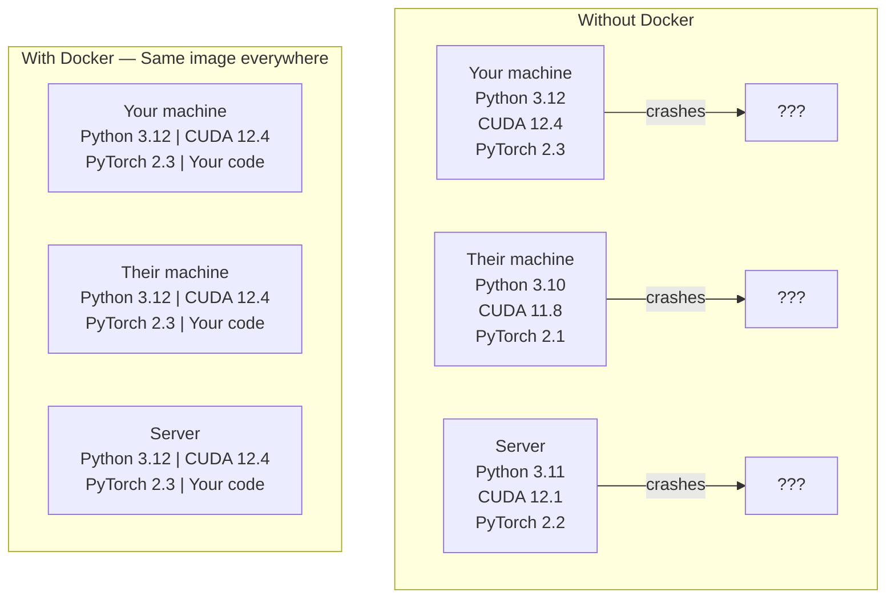

# AI 方向的 Docker

> 容器让“在我机器上能跑”成为过去。

**Type:** Build
**Languages:** Docker
**Prerequisites:** Phase 0, 第 01 和 03 课
**Time:** 约 60 分钟

## 学习目标

- 从 Dockerfile 构建一个包含 CUDA、PyTorch 和 AI 库的启用 GPU 的 Docker 镜像
- 将宿主机目录挂载为卷，以便在容器重建之间持久保存模型、数据集和代码
- 配置 NVIDIA Container Toolkit 以便在容器内暴露 GPU
- 使用 Docker Compose 编排多服务 AI 应用（推理服务器 + 向量数据库）

## 问题所在

你在自己的笔记本上用 PyTorch 2.3、CUDA 12.4 和 Python 3.12 训练了一个模型。你的同事用的是 PyTorch 2.1、CUDA 11.8 和 Python 3.10。你的模型在他们的机器上崩溃了。而你的 Dockerfile 在两边都能正常工作。

AI 项目是依赖关系的噩梦。一个典型的技术栈包括 Python、PyTorch、CUDA 驱动、cuDNN、系统级 C 库，以及像 flash-attn 这样需要特定编译器版本的专业软件包。Docker 将所有这些打包成一个在所有地方都以相同方式运行的单一镜像。

## 概念

Docker 将你的代码、运行时、库和系统工具封装成一个称为容器的隔离单元。可以把它看作一个轻量级虚拟机，不同的是它共享宿主机的操作系统内核，而不是运行自己的内核，因此它能在几秒内而不是几分钟内启动。



### 为什么 AI 项目比大多数项目更需要 Docker

1. **GPU 驱动很脆弱。** CUDA 12.4 的代码无法在 CUDA 11.8 上运行。Docker 将 CUDA 工具包隔离在容器内部，同时通过 NVIDIA Container Toolkit 共享宿主机的 GPU 驱动。

2. **模型权重很大。** 一个 7B 参数的模型以 fp16 存储为 14 GB。你不会希望每次重建时都重新下载它。Docker 卷允许你从宿主机挂载一个模型目录。

3. **多服务架构很常见。** 真实的 AI 应用不只是一个 Python 脚本。它是一个推理服务器、一个用于 RAG 的向量数据库，也许还有一个 Web 前端。Docker Compose 用一条命令编排所有这些服务。

### 关键词汇

| 术语 | 含义 |
|------|---------------|
| Image（镜像） | 只读模板。你的配方。由 Dockerfile 构建而来。 |
| Container（容器） | 镜像的一个运行实例。你的厨房。 |
| Dockerfile | 构建镜像的指令。一层一层地。 |
| Volume（卷） | 在容器重启后仍然存在的持久化存储。 |
| docker-compose | 用于在 YAML 中定义多容器应用的工具。 |

### AI 中常见的容器模式

```
Dev Container
  Full toolkit. Editor support. Jupyter. Debugging tools.
  Used during development and experimentation.

Training Container
  Minimal. Just the training script and dependencies.
  Runs on GPU clusters. No editor, no Jupyter.

Inference Container
  Optimized for serving. Small image. Fast cold start.
  Runs behind a load balancer in production.
```

```figure
s0-image-layers
```

## 动手构建

### 步骤 1：安装 Docker

```bash
# macOS
brew install --cask docker
open /Applications/Docker.app

# Ubuntu
curl -fsSL https://get.docker.com | sh
sudo usermod -aG docker $USER
# Log out and back in for group change to take effect
```

验证：

```bash
docker --version
docker run hello-world
```

### 步骤 2：安装 NVIDIA Container Toolkit（带有 NVIDIA GPU 的 Linux）

这允许 Docker 容器访问你的 GPU。macOS 和 Windows (WSL2) 用户可以跳过这一步；Docker Desktop 在这些平台上以不同方式处理 GPU 直通。

```bash
distribution=$(. /etc/os-release;echo $ID$VERSION_ID)
curl -fsSL https://nvidia.github.io/libnvidia-container/gpgkey | sudo gpg --dearmor -o /usr/share/keyrings/nvidia-container-toolkit-keyring.gpg
curl -s -L https://nvidia.github.io/libnvidia-container/$distribution/libnvidia-container.list | \
    sed 's#deb https://#deb [signed-by=/usr/share/keyrings/nvidia-container-toolkit-keyring.gpg] https://#g' | \
    sudo tee /etc/apt/sources.list.d/nvidia-container-toolkit.list

sudo apt-get update
sudo apt-get install -y nvidia-container-toolkit
sudo nvidia-ctk runtime configure --runtime=docker
sudo systemctl restart docker
```

在容器内测试 GPU 访问：

```bash
docker run --rm --gpus all nvidia/cuda:12.4.1-base-ubuntu22.04 nvidia-smi
```

如果你看到了自己的 GPU 信息，说明该工具包工作正常。

### 步骤 3：理解基础镜像

选择正确的基础镜像可以节省数小时的调试时间。

```
nvidia/cuda:12.4.1-devel-ubuntu22.04
  Full CUDA toolkit. Compilers included.
  Use for: building packages that need nvcc (flash-attn, bitsandbytes)
  Size: ~4 GB

nvidia/cuda:12.4.1-runtime-ubuntu22.04
  CUDA runtime only. No compilers.
  Use for: running pre-built code
  Size: ~1.5 GB

pytorch/pytorch:2.6.0-cuda12.4-cudnn9-runtime
  PyTorch pre-installed on top of CUDA.
  Use for: skipping the PyTorch install step
  Size: ~6 GB

python:3.12-slim
  No CUDA. CPU only.
  Use for: inference on CPU, lightweight tools
  Size: ~150 MB
```

### 步骤 4：编写用于 AI 开发的 Dockerfile

下面是 `code/Dockerfile` 中的 Dockerfile。逐步讲解：

```dockerfile
FROM --platform=linux/amd64 nvidia/cuda:12.4.1-devel-ubuntu22.04

ENV DEBIAN_FRONTEND=noninteractive
ENV PYTHONUNBUFFERED=1

RUN apt-get update && apt-get install -y --no-install-recommends \
    software-properties-common \
    git \
    curl \
    build-essential \
    && add-apt-repository -y ppa:deadsnakes/ppa \
    && apt-get update && apt-get install -y --no-install-recommends \
    python3.12 \
    python3.12-venv \
    python3.12-dev \
    && rm -rf /var/lib/apt/lists/*

RUN update-alternatives --install /usr/bin/python python /usr/bin/python3.12 1

RUN curl -sSL https://raw.githubusercontent.com/pypa/get-pip/3b73145063be545b649ad9ca83ea8da5fc915a4f/public/get-pip.py -o /tmp/get-pip.py \
    && echo "a341e1a43e38001c551a1508a73ff23636a11970b61d901d9a1cad2a18f57055  /tmp/get-pip.py" | sha256sum -c - \
    && python /tmp/get-pip.py \
    && rm /tmp/get-pip.py \
    && update-alternatives --install /usr/bin/pip pip /usr/local/bin/pip3.12 1

RUN python -m pip install --no-cache-dir --upgrade pip setuptools wheel

RUN python -m pip install --no-cache-dir \
    torch==2.6.0+cu124 \
    torchvision==0.21.0+cu124 \
    torchaudio==2.6.0+cu124 \
    --index-url https://download.pytorch.org/whl/cu124

RUN python -m pip install --no-cache-dir \
    numpy \
    pandas \
    scikit-learn \
    matplotlib \
    jupyter \
    transformers \
    datasets \
    accelerate \
    safetensors

WORKDIR /workspace

VOLUME ["/workspace", "/models"]

EXPOSE 8888

CMD ["python"]
```

构建它：

```bash
docker build -t ai-dev -f phases/00-setup-and-tooling/07-docker-for-ai/code/Dockerfile .
```

第一次构建需要一段时间（下载 CUDA 基础镜像 + PyTorch）。后续构建会使用缓存的层。

**macOS / Apple Silicon (M1/M2/M3/M4)：** Dockerfile 的 `FROM` 行使用 `--platform=linux/amd64`，这是让构建在 Mac 上成功的关键。CUDA 基础镜像也提供 arm64 版本，Docker Desktop 在 Apple Silicon 上会自动选用它；但 PyTorch 的 `cu124` wheel 只提供 x86_64 版本，导致 `pip install torch==2.6.0+cu124` 报错 `No matching distribution found for torch==2.6.0+cu124`。指定平台后，Docker 会拉取 x86_64 镜像并通过模拟运行，因此构建较慢，容器也没有 GPU（Mac 本身不支持 CUDA）。在 Mac 上运行下面的 `docker run` 命令时去掉 `--gpus all`。如需在 Apple Silicon 上使用 GPU，请按第 01 课的方法在本机使用 MPS 版本；这个镜像适合配备 NVIDIA GPU 的 x86_64 Linux 主机。

运行它：

```bash
docker run --rm -it --gpus all \
    -v $(pwd):/workspace \
    -v ~/models:/models \
    ai-dev python -c "import torch; print(f'PyTorch {torch.__version__}, CUDA: {torch.cuda.is_available()}')"
```

在容器内运行 Jupyter：

```bash
docker run --rm -it --gpus all \
    -v $(pwd):/workspace \
    -v ~/models:/models \
    -p 8888:8888 \
    ai-dev jupyter notebook --ip=0.0.0.0 --port=8888 --no-browser --allow-root
```

### 步骤 5：为数据和模型挂载卷

卷挂载对 AI 工作至关重要。没有它们，你的 14 GB 模型下载会在容器停止时消失。

```bash
# Mount your code
-v $(pwd):/workspace

# Mount a shared models directory
-v ~/models:/models

# Mount datasets
-v ~/datasets:/data
```

在你的训练脚本中，从挂载的路径加载：

```python
from transformers import AutoModel

model = AutoModel.from_pretrained("/models/llama-7b")
```

模型存放在宿主机的文件系统上。你可以随心所欲地重建容器，而无需重新下载。

### 步骤 6：使用 Docker Compose 构建多服务 AI 应用

一个真实的 RAG 应用需要一个推理服务器和一个向量数据库。Docker Compose 用一条命令同时运行两者。

参见 `code/docker-compose.yml`：

```yaml
services:
  ai-dev:
    build:
      context: .
      dockerfile: Dockerfile
    deploy:
      resources:
        reservations:
          devices:
            - driver: nvidia
              count: all
              capabilities: [gpu]
    volumes:
      - ../../../:/workspace
      - ~/models:/models
      - ~/datasets:/data
    ports:
      - "8888:8888"
    stdin_open: true
    tty: true
    command: jupyter notebook --ip=0.0.0.0 --port=8888 --no-browser --allow-root

  qdrant:
    image: qdrant/qdrant:v1.12.5
    ports:
      - "6333:6333"
      - "6334:6334"
    volumes:
      - qdrant_data:/qdrant/storage

volumes:
  qdrant_data:
```

启动一切：

```bash
cd phases/00-setup-and-tooling/07-docker-for-ai/code
docker compose up -d
```

现在你的 AI 开发容器可以通过服务名访问位于 `http://qdrant:6333` 的向量数据库。Docker Compose 会自动创建一个共享网络。

从 AI 容器内部测试连接：

```python
from qdrant_client import QdrantClient

client = QdrantClient(host="qdrant", port=6333)
print(client.get_collections())
```

停止一切：

```bash
docker compose down
```

添加 `-v` 以同时删除 qdrant 卷：

```bash
docker compose down -v
```

### 步骤 7：AI 工作中常用的 Docker 命令

```bash
# List running containers
docker ps

# List all images and their sizes
docker images

# Remove unused images (reclaim disk space)
docker system prune -a

# Check GPU usage inside a running container
docker exec -it <container_id> nvidia-smi

# Copy a file from container to host
docker cp <container_id>:/workspace/results.csv ./results.csv

# View container logs
docker logs -f <container_id>
```

## 使用它

你现在已经拥有一个可复现的 AI 开发环境。在本课程的其余部分：

- 使用 `docker compose up` 同时启动你的开发环境和向量数据库
- 将你的代码、模型和数据挂载为卷，以免在重建之间丢失任何内容
- 当某一课需要新的 Python 包时，把它添加到 Dockerfile 中并重新构建
- 与队友分享你的 Dockerfile。他们将获得完全相同的环境。

### 没有 GPU？

移除 `--gpus all` 标志和 NVIDIA deploy 代码块。该容器仍然可用于基于 CPU 的课程。PyTorch 会自动检测 CUDA 是否缺失并回退到 CPU。

## 练习

1. 构建 Dockerfile 并在容器内运行 `python -c "import torch; print(torch.__version__)"`
2. 启动 docker-compose 堆栈，并验证可以从 AI 容器访问位于 `http://qdrant:6333/collections` 的 Qdrant
3. 将 `flask` 添加到 Dockerfile 中，重新构建，并在端口 5000 上运行一个简单的 API 服务器。使用 `-p 5000:5000` 映射该端口
4. 使用 `docker images` 测量镜像大小。尝试将基础镜像从 `devel` 切换到 `runtime` 并比较大小

## 关键术语

| 术语 | 人们的说法 | 实际含义 |
|------|----------------|----------------------|
| Container（容器） | “轻量级虚拟机” | 一个使用宿主机内核的隔离进程，拥有自己的文件系统和网络 |
| Image layer（镜像层） | “缓存步骤” | 每条 Dockerfile 指令都会创建一层。未更改的层会被缓存，因此重建很快。 |
| NVIDIA Container Toolkit | “Docker 中的 GPU” | 一个运行时钩子，通过 `--gpus` 标志将宿主机 GPU 暴露给容器 |
| Volume mount（卷挂载） | “共享文件夹” | 一个映射到容器中的宿主机目录。在容器停止后更改仍然保留。 |
| Base image（基础镜像） | “起点” | 你的 Dockerfile 所基于的 `FROM` 镜像。它决定了哪些内容已预先安装。 |