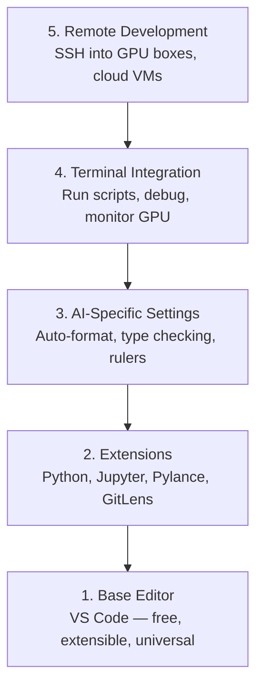

# 编辑器配置

> 编辑器是你的副驾驶。配置一次，让它不打扰你，并真正开始分担工作。

**Type:** Build
**Languages:** --
**Prerequisites:** Phase 0, Lesson 01
**Time:** ~20 分钟

## 学习目标

- 安装 VS Code 以及 Python、Jupyter、linting 和远程 SSH 所需的必备扩展
- 针对 AI 工作流配置保存时格式化、类型检查和 notebook 输出滚动
- 设置 Remote SSH，像操作本地机器一样在远程 GPU 机器上编辑和调试代码
- 评估编辑器替代方案(Cursor、Windsurf、Neovim)及其在 AI 工作中的权衡

## 问题所在

你将在编辑器中花费数千小时：编写 Python、运行 notebook、调试训练循环、SSH 到 GPU 机器。配置不当的编辑器会让每次会话都充满摩擦：没有自动补全、没有类型提示、没有内联错误、需要手动格式化，以及笨拙的终端工作流。

正确的配置只需 20 分钟。跳过它则会让你每天损失 20 分钟。

## 核心概念

一个 AI 工程编辑器配置需要五样东西：



```figure
s0-lsp-roundtrip
```

## 动手构建

### 第 1 步：安装 VS Code

VS Code 是推荐的编辑器。它免费、跨所有操作系统运行、对 Jupyter notebook 有一流支持，并且其扩展生态涵盖了 AI 工作所需的一切。

从 [code.visualstudio.com](https://code.visualstudio.com/) 下载。

在终端中验证：

```bash
code --version
```

如果在 macOS 上找不到 `code`，打开 VS Code，按 `Cmd+Shift+P`，输入 "Shell Command",然后选择 "Install 'code' command in PATH"。

### 第 2 步：安装必备扩展

打开 VS Code 的集成终端(所有平台上均为 ` Ctrl+`),安装对 AI 工作重要的扩展：

```bash
code --install-extension ms-python.python
code --install-extension ms-python.vscode-pylance
code --install-extension ms-toolsai.jupyter
code --install-extension eamodio.gitlens
code --install-extension ms-vscode-remote.remote-ssh
code --install-extension ms-python.debugpy
code --install-extension ms-python.black-formatter
code --install-extension charliermarsh.ruff
```

各扩展的作用：

| 扩展 | 原因 |
|-----------|-----|
| Python | 语言支持、虚拟环境检测、运行/调试 |
| Pylance | 快速类型检查、自动补全、导入解析 |
| Jupyter | 在 VS Code 内运行 notebook、变量浏览器 |
| GitLens | 查看谁改了什么、内联 git blame |
| Remote SSH | 像本地一样打开远程 GPU 机器上的文件夹 |
| Debugpy | Python 逐步调试 |
| Black Formatter | 保存时自动格式化、风格一致 |
| Ruff | 快速 linting、捕获常见错误 |

本课中的文件 `code/.vscode/extensions.json` 包含完整的推荐列表。当你打开项目文件夹时，VS Code 会提示你安装它们。

### 第 3 步：配置设置

复制本课 `code/.vscode/settings.json` 中的设置，或通过 `Settings > Open Settings (JSON)` 手动应用。

对 AI 工作至关重要的设置：

```jsonc
{
    "python.analysis.typeCheckingMode": "basic",
    "editor.formatOnSave": true,
    "editor.rulers": [88, 120],
    "notebook.output.scrolling": true,
    "files.autoSave": "afterDelay"
}
```

这些设置为什么重要：

- **类型检查设为 basic**:在运行之前捕获错误的参数类型。节省调试张量形状不匹配和错误 API 参数的时间。
- **保存时格式化**：再也不用考虑格式问题。Black 会处理它。
- **标尺设在 88 和 120**:Black 在 88 处换行。120 的标记提示 docstring 和注释何时过长。
- **Notebook 输出滚动**：训练循环会打印数千行。没有滚动功能，输出面板会爆炸。
- **自动保存**：你会忘记保存，训练脚本会运行过时的代码。自动保存可以避免这种情况。

### 第 4 步：终端集成

VS Code 的集成终端是你运行训练脚本、监控 GPU 和管理环境的地方。

正确配置它：

```jsonc
{
    "terminal.integrated.defaultProfile.osx": "zsh",
    "terminal.integrated.defaultProfile.linux": "bash",
    "terminal.integrated.fontSize": 13,
    "terminal.integrated.scrollback": 10000
}
```

实用快捷键：

| 操作 | macOS | Linux/Windows |
|--------|-------|---------------|
| 切换终端 | `` Ctrl+` `` | `` Ctrl+` `` |
| 新建终端 | `` Ctrl+Shift+` `` | `` Ctrl+Shift+` `` |
| 拆分终端 | `Cmd+\` | `Ctrl+Shift+5` |

拆分终端很有用：一个运行脚本，一个用 `nvidia-smi -l 1` 或 `watch -n 1 nvidia-smi` 监控 GPU。

### 第 5 步：远程开发(SSH 到 GPU 机器)

这是对 AI 工作最重要的扩展。你将在远程机器上运行训练(云 VM、实验室服务器、Lambda、Vast.ai)。Remote SSH 让你打开远程文件系统、编辑文件、运行终端和调试，就像一切都在本地一样。

设置：

1. 安装 Remote SSH 扩展(已在第 2 步完成)。
2. 按 `Ctrl+Shift+P`(或 `Cmd+Shift+P`),输入 "Remote-SSH: Connect to Host"。
3. 输入 `user@your-gpu-box-ip`。
4. VS Code 会自动在远程机器上安装其服务器组件。

要实现免密码访问，请设置 SSH 密钥：

```bash
ssh-keygen -t ed25519 -C "your-email@example.com"
ssh-copy-id user@your-gpu-box-ip
```

为了方便，将主机添加到 `~/.ssh/config`:

```
Host gpu-box
    HostName 203.0.113.50
    User ubuntu
    IdentityFile ~/.ssh/id_ed25519
    ForwardAgent yes
```

现在 `Remote-SSH: Connect to Host > gpu-box` 可以立即连接。

## 替代方案

### Cursor

[cursor.com](https://cursor.com) 是一个内置 AI 代码生成功能的 VS Code 分支。它使用相同的扩展生态和设置格式。如果你使用 Cursor,本课的所有内容仍然适用。导入相同的 `settings.json` 和 `extensions.json`。

### Windsurf

[windsurf.com](https://windsurf.com) 是另一个 AI 优先的 VS Code 分支。情况相同：相同的扩展、相同的设置格式、相同的 Remote SSH 支持。

### Vim/Neovim

如果你已经在使用 Vim 或 Neovim 并且用得很顺手，那就继续用。AI Python 工作的最低配置：

- **pyright** 或 **pylsp** 用于类型检查(通过 Mason 或手动安装)
- **nvim-lspconfig** 用于语言服务器集成
- **jupyter-vim** 或 **molten-nvim** 用于类似 notebook 的执行
- **telescope.nvim** 用于文件/符号搜索
- **none-ls.nvim** 配合 black 和 ruff 用于格式化/linting

如果你还没有使用 Vim,现在不要开始。学习曲线会与学习 AI 工程相冲突。使用 VS Code。

## 使用它

有了这套配置，你的日常工作流如下：

1. 在 VS Code 中打开项目文件夹(或通过 Remote SSH 连接到 GPU 机器)。
2. 在编辑器中编写 Python,享受自动补全、类型提示和内联错误提示。
3. 使用 Jupyter 扩展内联运行 Jupyter notebook。
4. 使用集成终端运行训练脚本、`uv pip install` 和监控 GPU。
5. 提交前用 GitLens 审查更改。

## 练习

1. 安装 VS Code 以及第 2 步中列出的所有扩展
2. 将本课的 `settings.json` 复制到你的 VS Code 配置中
3. 打开一个 Python 文件，验证 Pylance 显示类型提示、Black 在保存时格式化
4. 如果你有远程机器的访问权限，设置 Remote SSH 并在其上打开一个文件夹

## 关键术语

| 术语 | 人们的说法 | 实际含义 |
|------|----------------|----------------------|
| LSP | “自动补全引擎” | Language Server Protocol:一种标准，让编辑器从特定语言的服务器获取类型信息、补全和诊断 |
| Pylance | “Python 插件” | Microsoft 的 Python 语言服务器，使用 Pyright 进行类型检查和 IntelliSense |
| Remote SSH | “在服务器上工作” | VS Code 扩展，在远程机器上运行轻量级服务器，并将 UI 流式传输到你的本地编辑器 |
| Format on save | “自动 prettier” | 编辑器在每次保存时运行格式化工具(Black、Ruff),使代码风格始终一致 |