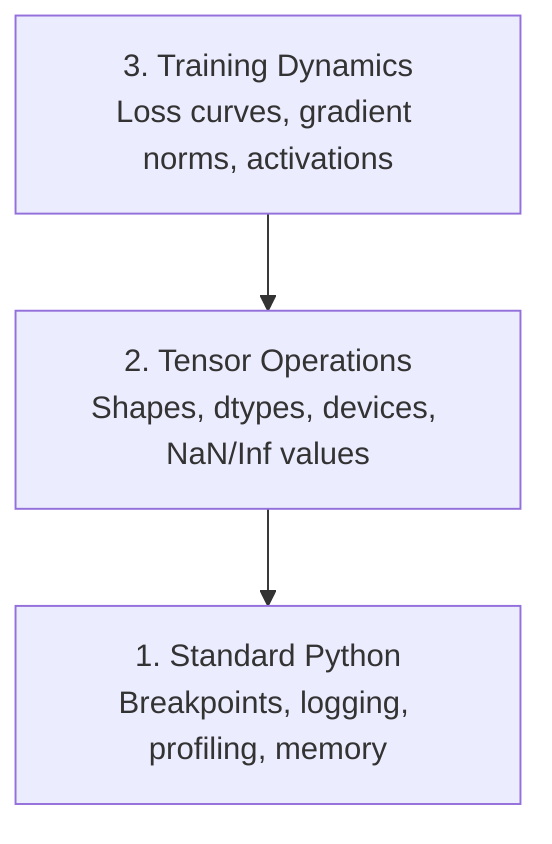

# 调试与性能分析

> 最糟糕的 AI bug 不会让程序崩溃。它们在垃圾数据上悄无声息地训练，并呈现一条漂亮的损失曲线。

**Type:** Build
**Language:** Python
**Prerequisites:** 第 1 课（开发环境）、基本的 PyTorch 使用经验
**Time:** 约 60 分钟

## 学习目标

- 使用条件断点 `breakpoint()` 和 `debug_print` 在训练中途检查张量的形状、数据类型和 NaN 值
- 使用 `cProfile`、`line_profiler` 和 `tracemalloc` 对训练循环进行性能分析，找出瓶颈
- 检测常见 AI bug：形状不匹配、NaN 损失、数据泄露以及张量位于错误设备
- 搭建 TensorBoard，以可视化损失曲线、权重直方图和梯度分布

## 问题所在

AI 代码的失败方式与普通代码不同。Web 应用崩溃时会给出堆栈跟踪。而一个配置错误的训练循环会运行 8 小时，烧掉 200 美元的 GPU 时间，最后产出一个对每个输入都预测均值的模型。代码从未报错。这个 bug 可能是张量放在了错误的设备上、漏掉了 `.detach()`，或者是标签泄露进了特征中。

你需要能在这些静默失败浪费你的时间和算力之前就把它们捕获的调试工具。

## 核心概念

AI 调试在三个层次上进行：



大多数人直接跳到第 3 层（盯着 TensorBoard 看）。但 80% 的 AI bug 都存在于第 1 层和第 2 层。

```figure
s0-flame-hot
```

## 动手实现

### 第 1 部分：打印调试（是的，它有用）

打印调试常被轻视。其实不该如此。对于张量代码，一条有针对性的打印语句胜过在调试器中单步执行，因为你需要同时看到形状、数据类型和取值范围。

```python
def debug_print(name, tensor):
    print(f"{name}: shape={tensor.shape}, dtype={tensor.dtype}, "
          f"device={tensor.device}, "
          f"min={tensor.min().item():.4f}, max={tensor.max().item():.4f}, "
          f"mean={tensor.mean().item():.4f}, "
          f"has_nan={tensor.isnan().any().item()}")
```

在每个可疑操作之后调用它。找到 bug 后，删掉这些打印语句。就这么简单。

### 第 2 部分：Python 调试器（pdb 和 breakpoint）

内置调试器在 AI 工作中被低估了。在你的训练循环里插入 `breakpoint()`，即可交互式地检查张量。

```python
def training_step(model, batch, criterion, optimizer):
    inputs, labels = batch
    outputs = model(inputs)
    loss = criterion(outputs, labels)

    if loss.item() > 100 or torch.isnan(loss):
        breakpoint()

    loss.backward()
    optimizer.step()
```

当调试器停下来时，常用的命令：

- `p outputs.shape` 查看形状
- `p loss.item()` 查看损失值
- `p torch.isnan(outputs).sum()` 统计 NaN 的数量
- `p model.fc1.weight.grad` 检查梯度
- `c` 继续，`q` 退出

这就是条件调试。只在看起来有问题时才停下来。对于 10,000 步的训练运行来说，这很重要。

### 第 3 部分：Python 日志

当调试超出快速检查的范畴时，用日志替代打印语句。

```python
import logging

logging.basicConfig(
    level=logging.INFO,
    format="%(asctime)s [%(levelname)s] %(message)s",
    handlers=[
        logging.FileHandler("training.log"),
        logging.StreamHandler()
    ]
)
logger = logging.getLogger(__name__)

logger.info("Starting training: lr=%.4f, batch_size=%d", lr, batch_size)
logger.warning("Loss spike detected: %.4f at step %d", loss.item(), step)
logger.error("NaN loss at step %d, stopping", step)
```

日志提供了时间戳、严重级别和文件输出。当一次训练在凌晨 3 点失败时，你需要的是一个日志文件，而不是早已滚出屏幕的终端输出。

### 第 4 部分：代码计时

弄清时间花在哪里是优化的第一步。

```python
import time

class Timer:
    def __init__(self, name=""):
        self.name = name

    def __enter__(self):
        self.start = time.perf_counter()
        return self

    def __exit__(self, *args):
        elapsed = time.perf_counter() - self.start
        print(f"[{self.name}] {elapsed:.4f}s")

with Timer("data loading"):
    batch = next(dataloader_iter)

with Timer("forward pass"):
    outputs = model(batch)

with Timer("backward pass"):
    loss.backward()
```

常见的发现：数据加载占了训练时间的 60%。解决办法是在 DataLoader 中设置 `num_workers > 0`，而不是换一块更快的 GPU。

### 第 5 部分：cProfile 和 line_profiler

当你需要比手动计时器更多的信息时：

```bash
python -m cProfile -s cumtime train.py
```

这会按累计时间排序显示每一个函数调用。若要进行逐行分析：

```bash
pip install line_profiler
```

```python
@profile
def train_step(model, data, target):
    output = model(data)
    loss = F.cross_entropy(output, target)
    loss.backward()
    return loss

# Run with: kernprof -l -v train.py
```

### 第 6 部分：内存分析

#### 使用 tracemalloc 分析 CPU 内存

```python
import tracemalloc

tracemalloc.start()

# your code here
model = build_model()
data = load_dataset()

snapshot = tracemalloc.take_snapshot()
top_stats = snapshot.statistics("lineno")
for stat in top_stats[:10]:
    print(stat)
```

#### 使用 memory_profiler 分析 CPU 内存

```bash
pip install memory_profiler
```

```python
from memory_profiler import profile

@profile
def load_data():
    raw = read_csv("data.csv")       # watch memory jump here
    processed = preprocess(raw)       # and here
    return processed
```

用 `python -m memory_profiler your_script.py` 运行，即可看到逐行的内存使用情况。

#### 使用 PyTorch 分析 GPU 内存

```python
import torch

if torch.cuda.is_available():
    print(torch.cuda.memory_summary())

    print(f"Allocated: {torch.cuda.memory_allocated() / 1e9:.2f} GB")
    print(f"Cached: {torch.cuda.memory_reserved() / 1e9:.2f} GB")
```

当你遇到 OOM（内存不足）时：

1. 减小 batch size（永远最先尝试的办法）
2. 使用 `torch.cuda.empty_cache()` 释放缓存内存
3. 对大型中间结果使用 `del tensor`，随后再使用 `torch.cuda.empty_cache()`
4. 使用混合精度（`torch.cuda.amp`）将内存占用减半
5. 对非常深的模型使用梯度检查点（gradient checkpointing）

### 第 7 部分：常见 AI bug 及捕获方法

#### 形状不匹配

最常见的 bug。张量的形状是 `[batch, features]`，而模型期望的是 `[batch, channels, height, width]`。

```python
def check_shapes(model, sample_input):
    print(f"Input: {sample_input.shape}")
    hooks = []

    def make_hook(name):
        def hook(module, inp, out):
            in_shape = inp[0].shape if isinstance(inp, tuple) else inp.shape
            out_shape = out.shape if hasattr(out, "shape") else type(out)
            print(f"  {name}: {in_shape} -> {out_shape}")
        return hook

    for name, module in model.named_modules():
        hooks.append(module.register_forward_hook(make_hook(name)))

    with torch.no_grad():
        model(sample_input)

    for h in hooks:
        h.remove()
```

用一个样本 batch 运行一次。它会映射出模型中的每一次形状变换。

#### NaN 损失

NaN 损失意味着有东西爆炸了。常见原因：

- 学习率过高
- 自定义损失中出现除以零
- 对零或负数取对数
- RNN 中的梯度爆炸

```python
def detect_nan(model, loss, step):
    if torch.isnan(loss):
        print(f"NaN loss at step {step}")
        for name, param in model.named_parameters():
            if param.grad is not None:
                if torch.isnan(param.grad).any():
                    print(f"  NaN gradient in {name}")
                if torch.isinf(param.grad).any():
                    print(f"  Inf gradient in {name}")
        return True
    return False
```

#### 数据泄露

你的模型在测试集上达到 99% 的准确率。听起来很棒。其实是个 bug。

```python
def check_data_leakage(train_set, test_set, id_column="id"):
    train_ids = set(train_set[id_column].tolist())
    test_ids = set(test_set[id_column].tolist())
    overlap = train_ids & test_ids
    if overlap:
        print(f"DATA LEAKAGE: {len(overlap)} samples in both train and test")
        return True
    return False
```

还要检查时间泄露：用未来的数据预测过去。在划分数据前先按时间戳排序。

#### 错误的设备

位于不同设备（CPU 与 GPU）上的张量会导致运行时错误。但有时某个张量静默地留在 CPU 上，而其他所有张量都在 GPU 上，训练只是变慢了而已。

```python
def check_devices(model, *tensors):
    model_device = next(model.parameters()).device
    print(f"Model device: {model_device}")
    for i, t in enumerate(tensors):
        if t.device != model_device:
            print(f"  WARNING: tensor {i} on {t.device}, model on {model_device}")
```

### 第 8 部分：TensorBoard 基础

TensorBoard 向你展示训练内部随时间发生的变化。

```bash
pip install tensorboard
```

```python
from torch.utils.tensorboard import SummaryWriter

writer = SummaryWriter("runs/experiment_1")

for step in range(num_steps):
    loss = train_step(model, batch)

    writer.add_scalar("loss/train", loss.item(), step)
    writer.add_scalar("lr", optimizer.param_groups[0]["lr"], step)

    if step % 100 == 0:
        for name, param in model.named_parameters():
            writer.add_histogram(f"weights/{name}", param, step)
            if param.grad is not None:
                writer.add_histogram(f"grads/{name}", param.grad, step)

writer.close()
```

启动它：

```bash
tensorboard --logdir=runs
```

需要关注的现象：

- **损失不下降**：学习率过低，或模型架构有问题
- **损失剧烈震荡**：学习率过高
- **损失变为 NaN**：数值不稳定（参见上面的 NaN 部分）
- **训练损失下降、验证损失上升**：过拟合
- **权重直方图坍缩为零**：梯度消失
- **梯度直方图爆炸**：需要梯度裁剪

### 第 9 部分：VS Code 调试器

若要交互式调试，在 VS Code 中配置一个 `launch.json`：

```json
{
    "version": "0.2.0",
    "configurations": [
        {
            "name": "Debug Training",
            "type": "debugpy",
            "request": "launch",
            "program": "${file}",
            "console": "integratedTerminal",
            "justMyCode": false
        }
    ]
}
```

点击行号旁边的空白处设置断点。使用 Variables 面板检查张量属性。Debug Console 允许你在执行过程中运行任意的 Python 表达式。

这对于单步调试数据预处理流水线很有用，可以逐个查看每次变换的结果。

## 实践应用

以下是能捕获大多数 AI bug 的调试工作流程：

1. **训练之前**：用样本 batch 运行 `check_shapes`。验证输入和输出的维度符合预期。
2. **前 10 步**：对损失、输出和梯度使用 `debug_print`。确认没有 NaN，且数值处于合理范围。
3. **训练过程中**：记录损失、学习率和梯度范数。使用 TensorBoard 进行可视化。
4. **出问题时**：在故障点插入 `breakpoint()`。交互式地检查张量。
5. **针对性能**：分别对数据加载、前向传播和反向传播计时。如果接近 OOM，就进行内存分析。

## 交付使用

运行调试工具脚本：

```bash
python phases/00-setup-and-tooling/12-debugging-and-profiling/code/debug_tools.py
```

参见 `outputs/prompt-debug-ai-code.md`，其中提供了一个帮助诊断 AI 特有 bug 的提示词。

## 练习

1. 运行 `debug_tools.py`，通读每一部分的输出。修改这个示例模型，故意引入一个 NaN（提示：在前向传播中除以零），然后观察检测器将其捕获。
2. 用 `cProfile` 对训练循环进行性能分析，找出最慢的函数。
3. 使用 `tracemalloc` 找出数据加载流水线中分配内存最多的那一行。
4. 为一次简单的训练运行搭建 TensorBoard，并判断模型是否过拟合。
5. 在训练循环中使用 `breakpoint()`。练习在调试器提示符下检查张量的形状、设备和梯度值。