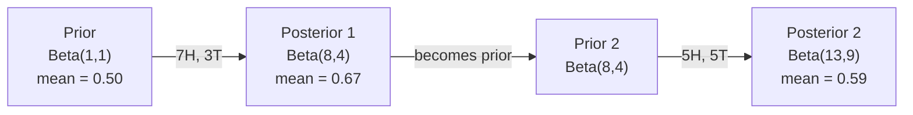

# 贝叶斯定理

> 概率是关于你所期望的。贝叶斯定理是关于你所学到的。

**Type:** Build
**Language:** Python
**Prerequisites:** 阶段 1，第 06 课（概率基础）
**Time:** 约 75 分钟

## 学习目标

- 运用贝叶斯定理，从先验、似然和证据计算后验概率
- 从零构建一个朴素贝叶斯文本分类器，包含拉普拉斯平滑和对数空间计算
- 比较 MLE 与 MAP 估计，并解释 MAP 如何对应 L2 正则化
- 使用 Beta-Binomial 共轭先验实现序列化贝叶斯更新，用于 A/B 测试

## 问题

一项医学检测的准确率是 99%。你检测呈阳性。你真正患病的概率是多少？

大多数人会说 99%。真正的答案取决于这种疾病有多罕见。如果每 10,000 人中只有 1 人患病，那么阳性结果只意味着你约有 1% 的患病概率。其余 99% 的阳性结果都来自健康人的误报。

这不是一道脑筋急转弯。这就是贝叶斯定理。每一个垃圾邮件过滤器、每一个医学诊断系统、每一个量化不确定性的机器学习模型，都在使用这种推理。你从一个信念出发。你观察到证据。你更新信念。

如果你在不理解这一点的情况下构建机器学习系统，你会误读模型输出、设置糟糕的阈值，并上线过度自信的预测。

## 概念

### 从联合概率到贝叶斯

你已经从第 06 课知道，条件概率是：

```
P(A|B) = P(A and B) / P(B)
```

对称地：

```
P(B|A) = P(A and B) / P(A)
```

两个表达式共享同一个分子：P(A and B)。令它们相等并重新整理：

```
P(A and B) = P(A|B) * P(B) = P(B|A) * P(A)

Therefore:

P(A|B) = P(B|A) * P(A) / P(B)
```

这就是贝叶斯定理。四个量，一个方程。

### 四个部分

| 部分 | 名称 | 含义 |
|------|------|---------------|
| P(A\|B) | 后验 | 看到证据 B 后，你对 A 的更新信念 |
| P(B\|A) | 似然 | 若 A 为真，证据 B 出现的概率 |
| P(A) | 先验 | 看到任何证据之前，你对 A 的信念 |
| P(B) | 证据 | 在所有可能情况下看到 B 的总概率 |

证据项 P(B) 起归一化因子的作用。你可以用全概率公式将其展开：

```
P(B) = P(B|A) * P(A) + P(B|not A) * P(not A)
```

### 医学检测示例

某种疾病影响每 10,000 人中的 1 人。检测准确率为 99%（能查出 99% 的病人，假阳性率为 1%）。

```
P(sick)          = 0.0001     (prior: disease is rare)
P(positive|sick) = 0.99       (likelihood: test catches it)
P(positive|healthy) = 0.01    (false positive rate)

P(positive) = P(positive|sick) * P(sick) + P(positive|healthy) * P(healthy)
            = 0.99 * 0.0001 + 0.01 * 0.9999
            = 0.000099 + 0.009999
            = 0.010098

P(sick|positive) = P(positive|sick) * P(sick) / P(positive)
                 = 0.99 * 0.0001 / 0.010098
                 = 0.0098
                 = 0.98%
```

不到 1%。先验占据主导。当某个条件很罕见时，即使准确的检测也会产生大量假阳性。这就是医生要求做复查检测的原因。

### 垃圾邮件过滤器示例

你收到一封包含"lottery"一词的邮件。它是垃圾邮件吗？

```
P(spam)                = 0.3      (30% of email is spam)
P("lottery"|spam)      = 0.05     (5% of spam emails contain "lottery")
P("lottery"|not spam)  = 0.001    (0.1% of legitimate emails contain "lottery")

P("lottery") = 0.05 * 0.3 + 0.001 * 0.7
             = 0.015 + 0.0007
             = 0.0157

P(spam|"lottery") = 0.05 * 0.3 / 0.0157
                  = 0.955
                  = 95.5%
```

一个词就把概率从 30% 推到 95.5%。真正的垃圾邮件过滤器会同时对数百个词应用贝叶斯推理。

### 朴素贝叶斯：独立性假设

朴素贝叶斯将其扩展到多个特征，假设在给定类别时所有特征条件独立：

```
P(class | feature_1, feature_2, ..., feature_n)
  = P(class) * P(feature_1|class) * P(feature_2|class) * ... * P(feature_n|class)
    / P(feature_1, feature_2, ..., feature_n)
```

"朴素"指的就是这个独立性假设。在文本中，词的出现并非独立（"New"和"York"是相关的）。但这个假设在实践中效果出奇地好，因为分类器只需要对类别排序，而不需要产生经过校准的概率。

由于分母对所有类别都相同，你可以跳过它，只比较分子：

```
score(class) = P(class) * product of P(feature_i | class)
```

选择得分最高的类别。

### 最大似然估计（MLE）

如何从训练数据得到 P(feature|class)？靠计数。

```
P("free"|spam) = (number of spam emails containing "free") / (total spam emails)
```

这就是 MLE：选择使观测数据最有可能出现的参数值。你在最大化似然函数，对于离散计数，它简化为相对频率。

问题：如果某个词在训练时的垃圾邮件中从未出现，MLE 会给它零概率。一个未见过的词就会摧毁整个乘积。用拉普拉斯平滑来修复：

```
P(word|class) = (count(word, class) + 1) / (total_words_in_class + vocabulary_size)
```

给每个计数加 1，确保任何概率都不为零。

### 最大后验估计（MAP）

MLE 问：哪些参数使 P(data|parameters) 最大？

MAP 问：哪些参数使 P(parameters|data) 最大？

根据贝叶斯定理：

```
P(parameters|data) proportional to P(data|parameters) * P(parameters)
```

MAP 在参数本身之上增加了一个先验。如果你认为参数应该偏小，就把这一点编码为惩罚大值的先验。这在机器学习中与 L2 正则化完全等价。岭回归中的"ridge"惩罚本质上就是权重上的高斯先验。

| 估计方法 | 优化目标 | 机器学习等价物 |
|------------|-----------|---------------|
| MLE | P(data\|params) | 无正则化的训练 |
| MAP | P(data\|params) * P(params) | L2 / L1 正则化 |

### 贝叶斯学派 vs 频率学派：实践上的差异

频率学派把参数视为固定的未知量。他们问："如果我重复这个实验很多次，会发生什么？"

贝叶斯学派把参数视为分布。他们问："鉴于我已观测到的数据，我对参数的信念是什么？"

对于构建机器学习系统，实践上的差异在于：

| 方面 | 频率学派 | 贝叶斯学派 |
|--------|-------------|----------|
| 输出 | 点估计 | 值的分布 |
| 不确定性 | 置信区间（关于流程） | 可信区间（关于参数） |
| 小数据 | 可能过拟合 | 先验起到正则化作用 |
| 计算 | 通常更快 | 常常需要采样（MCMC） |

大多数生产环境的机器学习是频率学派的（SGD、点估计）。贝叶斯方法在你需要校准的不确定性（医疗决策、安全关键系统）或数据稀缺（少样本学习、冷启动）时大放异彩。

### 为什么贝叶斯思维对机器学习重要

这种联系不止于类比：

**先验即正则化。** 权重上的高斯先验就是 L2 正则化。拉普拉斯先验就是 L1。每当你添加一个正则化项，你其实就在做一个关于你期望的参数值的贝叶斯陈述。

**后验即不确定性。** 单个预测概率无法告诉你模型对该估计有多自信。贝叶斯方法给你一个分布："我认为 P(spam) 在 0.8 到 0.95 之间。"

**贝叶斯更新即在线学习。** 今天的后验成为明天的先验。当模型看到新数据时，它增量地更新信念，而不是从头重新训练。

**模型比较是贝叶斯的。** 贝叶斯信息准则（BIC）、边际似然和贝叶斯因子都使用贝叶斯推理来在模型之间做选择，同时避免过拟合。

```figure
bayes-update
```

## 动手构建

### 步骤 1：贝叶斯定理函数

```python
def bayes(prior, likelihood, false_positive_rate):
    evidence = likelihood * prior + false_positive_rate * (1 - prior)
    posterior = likelihood * prior / evidence
    return posterior

result = bayes(prior=0.0001, likelihood=0.99, false_positive_rate=0.01)
print(f"P(sick|positive) = {result:.4f}")
```

### 步骤 2：朴素贝叶斯分类器

```python
import math
from collections import defaultdict

class NaiveBayes:
    def __init__(self, smoothing=1.0):
        self.smoothing = smoothing
        self.class_counts = defaultdict(int)
        self.word_counts = defaultdict(lambda: defaultdict(int))
        self.class_word_totals = defaultdict(int)
        self.vocab = set()

    def train(self, documents, labels):
        for doc, label in zip(documents, labels):
            self.class_counts[label] += 1
            words = doc.lower().split()
            for word in words:
                self.word_counts[label][word] += 1
                self.class_word_totals[label] += 1
                self.vocab.add(word)

    def predict(self, document):
        words = document.lower().split()
        total_docs = sum(self.class_counts.values())
        vocab_size = len(self.vocab)
        best_class = None
        best_score = float("-inf")
        for cls in self.class_counts:
            score = math.log(self.class_counts[cls] / total_docs)
            for word in words:
                count = self.word_counts[cls].get(word, 0)
                total = self.class_word_totals[cls]
                score += math.log((count + self.smoothing) / (total + self.smoothing * vocab_size))
            if score > best_score:
                best_score = score
                best_class = cls
        return best_class
```

对数概率可以防止下溢。把许多小概率相乘会得到对浮点数来说过于微小的数值。对对数概率求和在数值上是稳定的，且在数学上等价。

### 步骤 3：在垃圾邮件数据上训练

```python
train_docs = [
    "win free money now",
    "free lottery ticket winner",
    "claim your prize today free",
    "urgent offer free cash",
    "congratulations you won free",
    "meeting tomorrow at noon",
    "project update attached",
    "can we schedule a call",
    "quarterly report review",
    "lunch on thursday sounds good",
    "team standup notes attached",
    "please review the pull request",
]

train_labels = [
    "spam", "spam", "spam", "spam", "spam",
    "ham", "ham", "ham", "ham", "ham", "ham", "ham",
]

classifier = NaiveBayes()
classifier.train(train_docs, train_labels)

test_messages = [
    "free money waiting for you",
    "meeting rescheduled to friday",
    "you won a free prize",
    "please review the attached report",
]

for msg in test_messages:
    print(f"  '{msg}' -> {classifier.predict(msg)}")
```

### 步骤 4：检查学习到的概率

```python
def show_top_words(classifier, cls, n=5):
    vocab_size = len(classifier.vocab)
    total = classifier.class_word_totals[cls]
    probs = {}
    for word in classifier.vocab:
        count = classifier.word_counts[cls].get(word, 0)
        probs[word] = (count + classifier.smoothing) / (total + classifier.smoothing * vocab_size)
    sorted_words = sorted(probs.items(), key=lambda x: x[1], reverse=True)
    for word, prob in sorted_words[:n]:
        print(f"    {word}: {prob:.4f}")

print("\nTop spam words:")
show_top_words(classifier, "spam")
print("\nTop ham words:")
show_top_words(classifier, "ham")
```

## 使用它

Scikit-learn 提供了生产级的朴素贝叶斯实现：

```python
from sklearn.feature_extraction.text import CountVectorizer
from sklearn.naive_bayes import MultinomialNB
from sklearn.metrics import classification_report

vectorizer = CountVectorizer()
X_train = vectorizer.fit_transform(train_docs)
clf = MultinomialNB()
clf.fit(X_train, train_labels)

X_test = vectorizer.transform(test_messages)
predictions = clf.predict(X_test)
for msg, pred in zip(test_messages, predictions):
    print(f"  '{msg}' -> {pred}")
```

同样的算法。CountVectorizer 处理分词和词表构建。MultinomialNB 在内部处理平滑和对数概率。你从零构建的版本用 40 行代码做了同样的事情。

## 上线它

这里构建的 NaiveBayes 类演示了完整的流水线：分词、带拉普拉斯平滑的概率估计、对数空间预测。`code/bayes.py` 中的代码可以端到端运行，仅依赖 Python 标准库，没有任何其他依赖。

### 共轭先验

当先验和后验属于同一分布族时，该先验被称为"共轭"的。这使得贝叶斯更新在代数上非常简洁——无需数值积分即可得到闭式后验。

| 似然 | 共轭先验 | 后验 | 示例 |
|-----------|----------------|-----------|---------|
| Bernoulli | Beta(a, b) | Beta(a + successes, b + failures) | 硬币偏置估计 |
| Normal（方差已知） | Normal(mu_0, sigma_0) | Normal(加权均值, 更小的方差) | 传感器校准 |
| Poisson | Gamma(a, b) | Gamma(a + 计数之和, b + n) | 到达率建模 |
| Multinomial | Dirichlet(alpha) | Dirichlet(alpha + counts) | 主题建模、语言模型 |

为什么这很重要：没有共轭先验时，你需要蒙特卡洛采样或变分推断来近似后验。有了共轭先验，你只需更新两个数。

Beta 分布是实践中最常见的共轭先验。Beta(a, b) 表示你对一个概率参数的信念。均值是 a/(a+b)。a+b 越大，分布越集中（越自信）。

Beta 先验的几种特例：
- Beta(1, 1) = 均匀分布。你对这个参数没有倾向。
- Beta(10, 10) = 在 0.5 处达到峰值。你强烈相信参数接近 0.5。
- Beta(1, 10) = 偏向 0。你认为参数很小。

更新规则极其简单：

```
Prior:     Beta(a, b)
Data:      s successes, f failures
Posterior: Beta(a + s, b + f)
```

没有积分。没有采样。只有加法。

### 序列化贝叶斯更新

贝叶斯推断天然是序列化的。今天的后验成为明天的先验。这就是真实系统在不重新处理全部历史数据的情况下进行增量学习的方式。

具体例子：估计一枚硬币是否均匀。

**第 1 天：还没有数据。**
从 Beta(1, 1) 开始——一个均匀先验。你没有倾向。
- 先验均值：0.5
- 先验在 [0, 1] 上是平坦的

**第 2 天：观察到 7 次正面，3 次反面。**
后验 = Beta(1 + 7, 1 + 3) = Beta(8, 4)
- 后验均值：8/12 = 0.667
- 证据表明硬币偏向正面

**第 3 天：又观察到 5 次正面，5 次反面。**
把昨天的后验作为今天的先验。
后验 = Beta(8 + 5, 4 + 5) = Beta(13, 9)
- 后验均值：13/22 = 0.591
- 新的均衡数据把估计拉回 0.5 附近



观测顺序无关紧要。Beta(1,1) 一次性用全部 12 次正面和 8 次反面更新，得到的也是 Beta(13, 9)——结果相同。序列更新和批量更新在数学上等价。但序列更新让你在每一步都能做决策，而无需存储原始数据。

这是生产级机器学习系统中在线学习的基础。用于老虎机的 Thompson 采样、增量推荐系统和流式异常检测器都使用这种模式。

### 与 A/B 测试的联系

A/B 测试是披着外衣的贝叶斯推断。

场景设定：你在测试两种按钮颜色。变体 A（蓝色）和变体 B（绿色）。你想知道哪个获得的点击更多。

贝叶斯 A/B 测试：

1. **先验。** 两个变体都从 Beta(1, 1) 开始。没有先验偏好。
2. **数据。** 变体 A：1000 次展示中 50 次点击。变体 B：1000 次展示中 65 次点击。
3. **后验。**
   - A：Beta(1 + 50, 1 + 950) = Beta(51, 951)。均值 = 0.051
   - B：Beta(1 + 65, 1 + 935) = Beta(66, 936)。均值 = 0.066
4. **决策。** 计算 P(B > A)——即 B 的真实转化率高于 A 的概率。

解析地计算 P(B > A) 很难。但蒙特卡洛让它变得轻而易举：

```
1. Draw 100,000 samples from Beta(51, 951)  -> samples_A
2. Draw 100,000 samples from Beta(66, 936)  -> samples_B
3. P(B > A) = fraction of samples where B > A
```

如果 P(B > A) > 0.95，你就上线变体 B。如果在 0.05 到 0.95 之间，就继续收集数据。如果 P(B > A) < 0.05，就上线变体 A。

相比频率学派 A/B 测试的优势：
- 你可以直接得到概率陈述："B 更好的概率是 97%"
- 没有 p 值的困惑。没有"未能拒绝原假设"式的含糊其辞。
- 你可以随时查看结果，而不会抬高假阳性率（没有"偷看问题"）
- 你可以融入先验知识（例如，以往的测试表明转化率通常在 3-8% 之间）

| 方面 | 频率学派 A/B | 贝叶斯 A/B |
|--------|----------------|--------------|
| 输出 | p 值 | P(B > A) |
| 解读 | "若 A=B，这个数据有多令人意外？" | "B 比 A 好的可能性有多大？" |
| 提前停止 | 会抬高假阳性 | 任意时点都安全（前提是先验选择得当且模型设定正确） |
| 先验知识 | 不使用 | 编码为 Beta 先验 |
| 决策规则 | p < 0.05 | P(B > A) > 阈值 |

## 练习

1. **多次检测。** 一位患者在两个独立检测上都呈阳性（两个检测准确率都是 99%，疾病流行率为万分之一）。两次检测之后 P(sick) 是多少？把第一次检测的后验作为第二次检测的先验。

2. **平滑的影响。** 用平滑值 0.01、0.1、1.0 和 10.0 分别运行垃圾邮件分类器。排名靠前的词概率如何变化？当 smoothing=0 且某个词只出现在正常邮件（ham）中时会发生什么？

3. **添加特征。** 扩展 NaiveBayes 类，在词频之外增加消息长度（短/长）作为特征。从训练数据估计 P(short|spam) 和 P(short|ham)，并将其纳入预测得分。

4. **手算 MAP。** 给定观测数据（10 次抛硬币出现 7 次正面），使用 Beta(2,2) 先验计算偏置的 MAP 估计。将其与 MLE 估计（7/10）进行比较。

## 关键术语

| 术语 | 人们怎么说 | 实际含义 |
|------|----------------|----------------------|
| Prior | "我的初始猜测" | 观测证据前的 P(hypothesis)。在机器学习中：正则化项。 |
| Likelihood | "数据拟合得有多好" | P(evidence\|hypothesis)。在特定假设下观测数据出现的概率。 |
| Posterior | "我更新后的信念" | P(hypothesis\|evidence)。先验乘以似然，再归一化。 |
| Evidence | "归一化常数" | 所有假设下的 P(data)。确保后验和为 1。 |
| Naive Bayes | "那个简单的文本分类器" | 一个假设特征在给定类别时相互独立的分类器。尽管假设不成立，效果却很好。 |
| Laplace smoothing | "加一平滑" | 给每个特征加一个小计数，防止未见过的数据导致零概率。 |
| MLE | "直接用频率就行" | 选择使 P(data\|parameters) 最大的参数。无先验。小数据时可能过拟合。 |
| MAP | "带先验的 MLE" | 选择使 P(data\|parameters) * P(parameters) 最大的参数。等价于正则化的 MLE。 |
| Log-probability | "在对数空间中运算" | 使用 log(P) 而不是 P，以避免相乘许多小数时出现浮点下溢。 |
| False positive | "一次误报" | 检测结果为阳性，但真实状态为阴性。是基础比率谬误的根源。 |

## 延伸阅读

- [3Blue1Brown: 贝叶斯定理](https://www.youtube.com/watch?v=HZGCoVF3YvM) - 用医学检测示例进行的可视化讲解
- [Stanford CS229: 生成式学习算法](https://cs229.stanford.edu/notes2022fall/cs229-notes2.pdf) - 朴素贝叶斯及其与判别式模型的联系
- [Think Bayes](https://greenteapress.com/wp/think-bayes/) - 免费书籍，用 Python 代码讲解贝叶斯统计
- [scikit-learn Naive Bayes](https://scikit-learn.org/stable/modules/naive_bayes.html) - 生产级实现以及各变体的适用场景