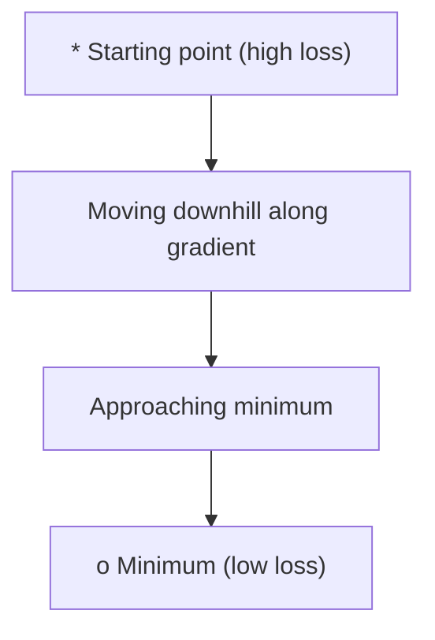
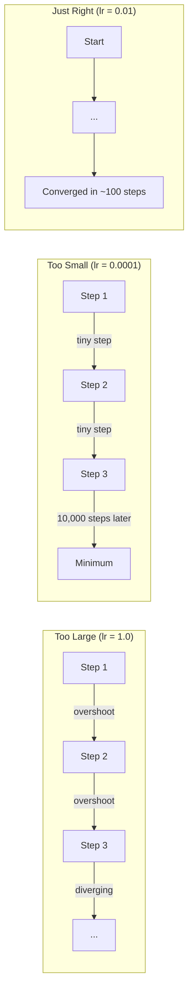
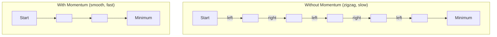
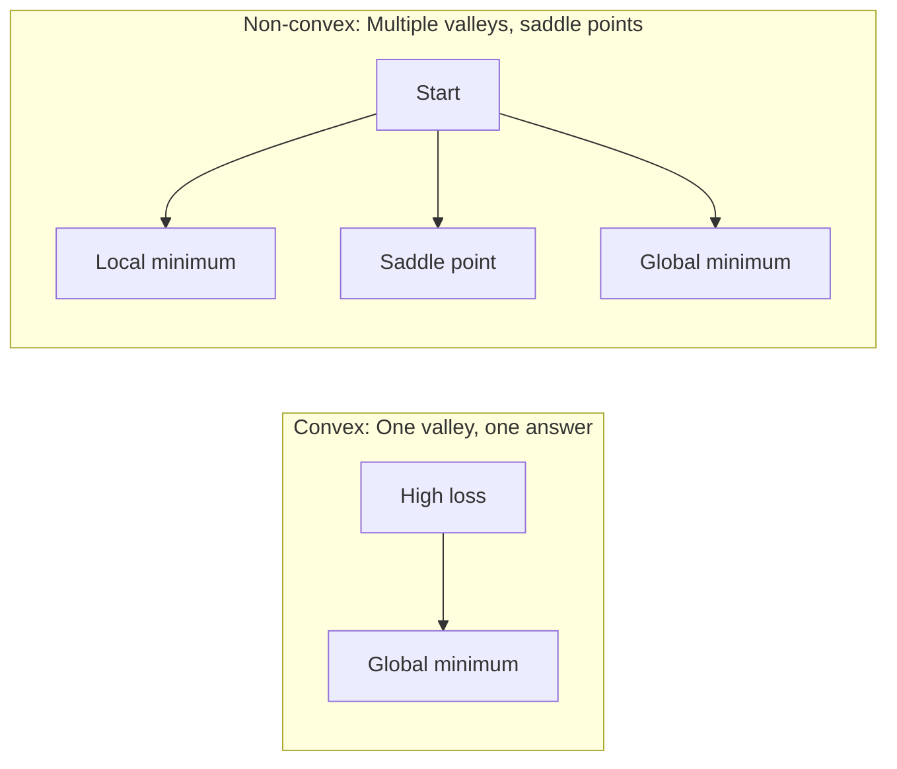
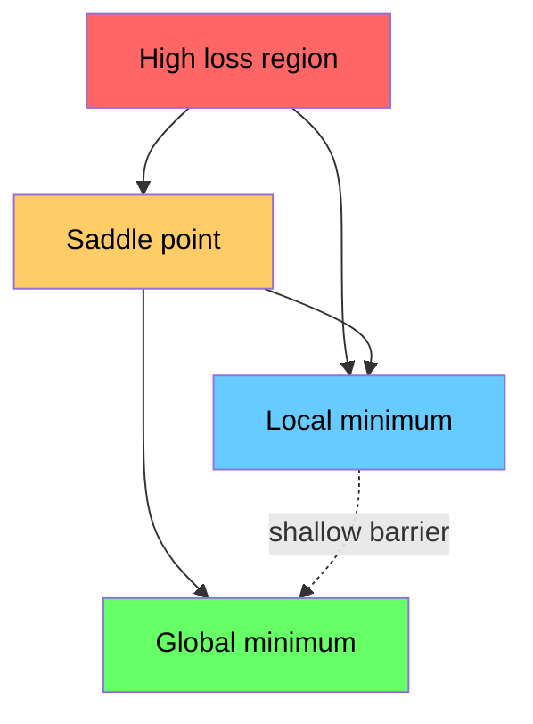

# 优化

> 训练神经网络不过是找到山谷的底部。

**Type:** Build
**Language:** Python
**Prerequisites:** Phase 1, 第 04-05 课（导数、梯度）
**Time:** 约 75 分钟

## 学习目标

- 从零实现普通梯度下降、带动量的 SGD 以及 Adam
- 在 Rosenbrock 函数上比较各优化器的收敛情况，并解释 Adam 为何能为每个权重自适应调整学习率
- 区分凸与非凸损失面，并解释鞍点在高维空间中的作用
- 配置学习率调度（阶梯衰减、余弦退火、预热）以稳定训练

## 问题

你有一个损失函数，它告诉你模型有多离谱。你有梯度，它们告诉你哪个方向会让损失变得更糟。现在你需要一个往山下走的策略。

最朴素的方法很简单：朝梯度的反方向移动，用某个称为学习率的数来缩放步长，然后重复。这就是梯度下降，它确实有效。但“有效”是有条件的。学习率太大，你会完全冲过谷底，在两侧谷壁之间来回弹跳。学习率太小，你要爬行数千个多余的步子才能接近答案。碰上鞍点，你会停止移动，即使你还没找到最小值。

深度学习中的每个优化器都在回答同一个问题：如何更快、更可靠地到达谷底？

## 概念

### 优化是什么意思

优化就是找到使函数最小化（或最大化）的输入值。在机器学习中，这个函数是损失，输入是模型的权重。训练就是优化。

```
minimize L(w) where:
  L = loss function
  w = model weights (could be millions of parameters)
```

### 梯度下降（普通版）

最简单的优化器。计算损失对每个权重的梯度，让每个权重沿其梯度的反方向移动，并用学习率缩放步长。

```
w = w - lr * gradient
```

这就是全部算法，一行而已。



### 学习率：最重要的超参数

学习率控制步长，它决定收敛的一切。



没有计算正确学习率的公式，只能靠实验找到。常见的起点：Adam 用 0.001，带动量的 SGD 用 0.01。

### SGD vs batch vs mini-batch

普通梯度下降在整个数据集上计算梯度后才走一步，这叫批量梯度下降（batch gradient descent）。它稳定但慢。

随机梯度下降（SGD）在单个随机样本上计算梯度并立即走一步。它噪声大但快。

小批量梯度下降（mini-batch）取两者折中：在一个小批量（32、64、128、256 个样本）上计算梯度，然后走一步。这是所有人实际使用的方法。

| 变体 | 批大小 | 梯度质量 | 每步速度 | 噪声 |
|---------|-----------|-----------------|---------------|-------|
| Batch GD | 整个数据集 | 精确 | 慢 | 无 |
| SGD | 1 个样本 | 噪声极大 | 快 | 高 |
| Mini-batch | 32-256 | 良好估计 | 均衡 | 中等 |

SGD 和 mini-batch 中的噪声不是缺陷。它帮助逃离浅层局部最小值和鞍点。

### 动量：滚下山的球

普通梯度下降只看当前梯度。如果梯度来回锯齿状摆动（在狭窄山谷中很常见），进展就会很慢。动量通过把历史梯度累积成一个速度项来解决这个问题。

```
v = beta * v + gradient
w = w - lr * v
```

类比：一个滚下山的球。它不会在每个小凸起处停下重启，而是在方向一致时积累速度，并抑制振荡。



`beta`（通常为 0.9）控制保留多少历史。beta 越高，动量越大，路径越平滑，但对方向变化的响应越慢。

### Adam：自适应学习率

不同的权重需要不同的学习率。一个很少收到大梯度的权重，在终于收到时应该迈更大的步子；一个持续收到巨大梯度的权重应该迈更小的步子。

Adam（Adaptive Moment Estimation）为每个权重跟踪两个量：

1. 一阶矩（m）：梯度的滑动平均（类似动量）
2. 二阶矩（v）：梯度平方的滑动平均（梯度幅度）

```
m = beta1 * m + (1 - beta1) * gradient
v = beta2 * v + (1 - beta2) * gradient^2

m_hat = m / (1 - beta1^t)    bias correction
v_hat = v / (1 - beta2^t)    bias correction

w = w - lr * m_hat / (sqrt(v_hat) + epsilon)
```

除以 `sqrt(v_hat)` 是关键所在。梯度大的权重被一个大数除（有效步长小）；梯度小的权重被一个小数除（有效步长大）。每个权重得到自己的自适应学习率。

默认超参数：`lr=0.001, beta1=0.9, beta2=0.999, epsilon=1e-8`。这些默认值对大多数问题都很有效。

### 学习率调度

固定学习率是一种妥协。训练早期你想要大步子快速前进；训练后期你想要小步子在最小值附近精细调整。

常见调度：

| 调度 | 公式 | 适用场景 |
|----------|---------|----------|
| 阶梯衰减 | lr = lr * factor，每 N 个 epoch | 简单，手动控制 |
| 指数衰减 | lr = lr_0 * decay^t | 平滑下降 |
| 余弦退火 | lr = lr_min + 0.5 * (lr_max - lr_min) * (1 + cos(pi * t / T)) | Transformer、现代训练 |
| 预热 + 衰减 | 先线性上升，再衰减 | 大模型，防止早期不稳定 |

### 凸与非凸

凸函数只有一个最小值，梯度下降总能找到它。像 `f(x) = x^2` 这样的二次函数是凸的。

神经网络的损失函数是非凸的。它们有许多局部最小值、鞍点和平坦区域。



实践中，高维神经网络中的局部最小值很少成为问题。大多数局部最小值的损失值都接近全局最小值。真正的障碍是鞍点（在某些方向上平坦，在其他方向上弯曲）。动量和 mini-batch 的噪声有助于逃离它们。

### 损失面可视化

损失是所有权重的函数。对于一个有 100 万个权重的模型，损失面生活在 1,000,001 维空间中。我们通过在权重空间中选取两个随机方向并沿这些方向绘制损失来将其可视化，得到一个二维曲面。



尖锐的最小值泛化能力差；平坦的最小值泛化能力好。这也是带动量的 SGD 在最终测试准确率上常常优于 Adam 的原因之一：它的噪声避免了陷入尖锐最小值。

```figure
gradient-descent
```

## 动手实现

### 第 1 步：定义测试函数

Rosenbrock 函数是经典的优化基准。它的最小值位于 (1, 1)，处在一个狭窄弯曲的山谷中——容易找到，却难以沿着走。

```
f(x, y) = (1 - x)^2 + 100 * (y - x^2)^2
```

```python
def rosenbrock(params):
    x, y = params
    return (1 - x) ** 2 + 100 * (y - x ** 2) ** 2

def rosenbrock_gradient(params):
    x, y = params
    df_dx = -2 * (1 - x) + 200 * (y - x ** 2) * (-2 * x)
    df_dy = 200 * (y - x ** 2)
    return [df_dx, df_dy]
```

### 第 2 步：普通梯度下降

```python
class GradientDescent:
    def __init__(self, lr=0.001):
        self.lr = lr

    def step(self, params, grads):
        return [p - self.lr * g for p, g in zip(params, grads)]
```

### 第 3 步：带动量的 SGD

```python
class SGDMomentum:
    def __init__(self, lr=0.001, momentum=0.9):
        self.lr = lr
        self.momentum = momentum
        self.velocity = None

    def step(self, params, grads):
        if self.velocity is None:
            self.velocity = [0.0] * len(params)
        self.velocity = [
            self.momentum * v + g
            for v, g in zip(self.velocity, grads)
        ]
        return [p - self.lr * v for p, v in zip(params, self.velocity)]
```

### 第 4 步：Adam

```python
class Adam:
    def __init__(self, lr=0.001, beta1=0.9, beta2=0.999, epsilon=1e-8):
        self.lr = lr
        self.beta1 = beta1
        self.beta2 = beta2
        self.epsilon = epsilon
        self.m = None
        self.v = None
        self.t = 0

    def step(self, params, grads):
        if self.m is None:
            self.m = [0.0] * len(params)
            self.v = [0.0] * len(params)

        self.t += 1

        self.m = [
            self.beta1 * m + (1 - self.beta1) * g
            for m, g in zip(self.m, grads)
        ]
        self.v = [
            self.beta2 * v + (1 - self.beta2) * g ** 2
            for v, g in zip(self.v, grads)
        ]

        m_hat = [m / (1 - self.beta1 ** self.t) for m in self.m]
        v_hat = [v / (1 - self.beta2 ** self.t) for v in self.v]

        return [
            p - self.lr * mh / (vh ** 0.5 + self.epsilon)
            for p, mh, vh in zip(params, m_hat, v_hat)
        ]
```

### 第 5 步：运行并比较

```python
def optimize(optimizer, func, grad_func, start, steps=5000):
    params = list(start)
    history = [params[:]]
    for _ in range(steps):
        grads = grad_func(params)
        params = optimizer.step(params, grads)
        history.append(params[:])
    return history

start = [-1.0, 1.0]

gd_history = optimize(GradientDescent(lr=0.0005), rosenbrock, rosenbrock_gradient, start)
sgd_history = optimize(SGDMomentum(lr=0.0001, momentum=0.9), rosenbrock, rosenbrock_gradient, start)
adam_history = optimize(Adam(lr=0.01), rosenbrock, rosenbrock_gradient, start)

for name, history in [("GD", gd_history), ("SGD+M", sgd_history), ("Adam", adam_history)]:
    final = history[-1]
    loss = rosenbrock(final)
    print(f"{name:6s} -> x={final[0]:.6f}, y={final[1]:.6f}, loss={loss:.8f}")
```

预期输出：Adam 收敛最快。带动量的 SGD 路径更平滑。普通 GD 在狭窄山谷中进展缓慢。

## 实际使用

实践中，请使用 PyTorch 或 JAX 的优化器。它们能处理参数组、权重衰减、梯度裁剪和 GPU 加速。

```python
import torch

model = torch.nn.Linear(784, 10)

sgd = torch.optim.SGD(model.parameters(), lr=0.01, momentum=0.9)
adam = torch.optim.Adam(model.parameters(), lr=0.001)
adamw = torch.optim.AdamW(model.parameters(), lr=0.001, weight_decay=0.01)

scheduler = torch.optim.lr_scheduler.CosineAnnealingLR(adam, T_max=100)
```

经验法则：

- 从 Adam（lr=0.001）开始。对大多数问题无需调参即可工作。
- 当你需要最佳最终准确率并能承受更多调参时，切换到带动量的 SGD（lr=0.01，momentum=0.9）。
- 对 Transformer 使用 AdamW（权重衰减解耦的 Adam）。
- 训练超过几个 epoch 时，务必使用学习率调度。
- 如果训练不稳定，降低学习率。如果训练太慢，提高它。

## 交付

本课产出一个用于选择合适优化器的 prompt。参见 `outputs/prompt-optimizer-guide.md`。

这里构建的优化器类将在 Phase 3 中我们从零训练神经网络时再次使用。

## 练习

1. **学习率扫描。** 用学习率 [0.0001, 0.0005, 0.001, 0.005, 0.01] 在 Rosenbrock 函数上运行普通梯度下降。绘制或打印每种设置在 5000 步后的最终损失。找出仍能收敛的最大学习率。

2. **动量比较。** 用动量值 [0.0, 0.5, 0.9, 0.99] 在 Rosenbrock 函数上运行 SGD。跟踪每一步的损失。哪个动量值收敛最快？哪个会过冲？

3. **逃离鞍点。** 定义函数 `f(x, y) = x^2 - y^2`（原点处有一个鞍点）。从 (0.01, 0.01) 出发。比较普通 GD、带动量的 SGD 和 Adam 的行为。哪个能逃离鞍点？

4. **实现学习率衰减。** 为 GradientDescent 类添加指数衰减调度：`lr = lr_0 * 0.999^step`。比较在 Rosenbrock 函数上有衰减与无衰减时的收敛情况。

## 关键术语

| 术语 | 人们怎么说 | 实际含义 |
|------|----------------|----------------------|
| 梯度下降 | "往山下走" | 用学习率缩放梯度后从权重中减去它来更新权重。最基本的优化器。 |
| 学习率 | "步长" | 控制每次更新移动权重多远的标量。太大会导致发散，太小浪费算力。 |
| 动量 | "继续滚动" | 把历史梯度累积成速度向量。抑制振荡，并加速沿一致方向的运动。 |
| SGD | "随机采样" | 随机梯度下降。在随机子集而非整个数据集上计算梯度。实践中几乎总是指 mini-batch SGD。 |
| Mini-batch | "一小块数据" | 用于估计梯度的小规模训练数据子集（32-256 个样本）。在速度与梯度准确性之间取得平衡。 |
| Adam | "默认优化器" | Adaptive Moment Estimation。跟踪每个权重的梯度与梯度平方的滑动平均，为每个权重提供自己的学习率。 |
| 偏差修正 | "修复冷启动" | Adam 的一阶矩和二阶矩初始化为零。偏差修正通过除以 (1 - beta^t) 在早期步数中进行补偿。 |
| 学习率调度 | "随时间改变 lr" | 训练过程中调整学习率的函数。早期大步，后期小步。 |
| 凸函数 | "只有一个山谷" | 任何局部最小值都是全局最小值的函数。梯度下降总能找到它。神经网络损失不是凸的。 |
| 鞍点 | "平坦但不是最小值" | 梯度为零，但在某些方向上是最小值、在另一些方向上是最大值的点。在高维空间中很常见。 |
| 损失面 | "地形" | 损失函数在权重空间上的图像。通过沿两个随机方向切片来可视化。 |
| 收敛 | "到达目的地" | 优化器已到达一个继续走步也不会显著降低损失的点。 |

## 延伸阅读

- [Sebastian Ruder：梯度下降优化算法综述](https://ruder.io/optimizing-gradient-descent/) - 对所有主流优化器的全面调研
- [Why Momentum Really Works (Distill)](https://distill.pub/2017/momentum/) - 动量机制的交互式可视化
- [Adam: A Method for Stochastic Optimization (Kingma & Ba, 2014)](https://arxiv.org/abs/1412.6980) - Adam 原始论文，可读性强且篇幅短
- [Visualizing the Loss Landscape of Neural Nets (Li et al., 2018)](https://arxiv.org/abs/1712.09913) - 展示尖锐最小值与平坦最小值对比的论文