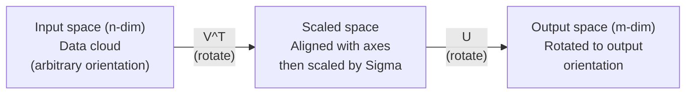
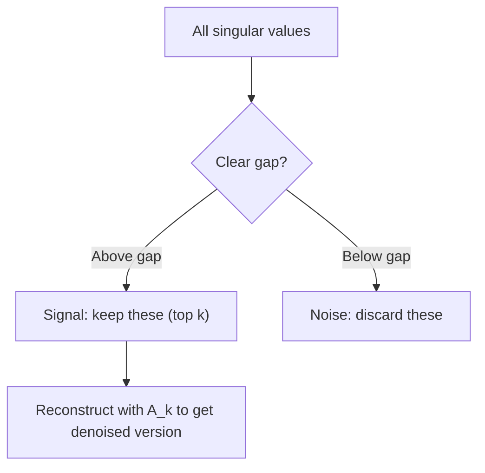

# 奇异值分解

> SVD 是线性代数中的瑞士军刀。每个矩阵都有 SVD。每个数据科学家都需要 SVD。

**Type:** Build
**Languages:** Python, Julia
**Prerequisites:** Phase 1, Lessons 01（线性代数直觉）、02（向量与矩阵运算）、03（矩阵变换）
**Time:** ~120 分钟

## 学习目标

- 通过幂迭代实现 SVD，并解释 U、Sigma 和 V^T 的几何意义
- 应用截断 SVD 进行图像压缩，并衡量压缩比与重建误差之间的权衡
- 通过 SVD 计算 Moore-Penrose 伪逆，求解超定最小二乘系统
- 将 SVD 与 PCA、推荐系统（潜在因子）以及 NLP 中的潜在语义分析联系起来

## 问题

你有一个 1000x2000 的矩阵。它可能是用户-电影评分矩阵，可能是文档-词频表，也可能是图像的像素值。你需要压缩它、去噪、发现其中的隐藏结构，或用它求解最小二乘系统。特征分解只适用于方阵。即便如此，它还要求矩阵拥有一组完整的线性无关特征向量。

SVD 适用于任何矩阵。任何形状。任何秩。没有任何前提条件。它将矩阵分解为三个因子，揭示矩阵对空间所做变换的几何本质。它是整个线性代数中最通用、最有用的分解方法。

## 核心概念

### SVD 的几何含义

任何矩阵，无论形状如何，都依次执行三个操作：旋转、缩放、旋转。SVD 将这一分解显式地呈现出来。

```
A = U * Sigma * V^T

      m x n     m x m    m x n    n x n
     (any)    (rotate)  (scale)  (rotate)
```

给定任意矩阵 A，SVD 将其分解为：
- V^T 在输入空间（n 维）中旋转向量
- Sigma 沿每个轴进行缩放（拉伸或压缩）
- U 将结果旋转到输出空间（m 维）



可以这样理解：你交给 SVD 一个矩阵，它告诉你：“这个矩阵对一组输入球体，先通过 V^T 旋转，然后通过 Sigma 将其拉伸成椭球体，再通过 U 旋转这个椭球体。”奇异值就是椭球体各轴的长度。

### 完整分解

对于形状为 m x n 的矩阵 A：

```
A = U * Sigma * V^T

where:
  U     is m x m, orthogonal (U^T U = I)
  Sigma is m x n, diagonal (singular values on the diagonal)
  V     is n x n, orthogonal (V^T V = I)

The singular values sigma_1 >= sigma_2 >= ... >= sigma_r > 0
where r = rank(A)
```

U 的列称为左奇异向量。V 的列称为右奇异向量。Sigma 的对角元素称为奇异值。它们总是非负的，并按惯例以递减顺序排列。

### 左奇异向量、奇异值、右奇异向量

SVD 的每个组成部分都有其独特的几何意义。

**右奇异向量（V 的列）：**它们构成输入空间（R^n）的一组标准正交基。它们是输入空间中被矩阵映射到输出空间中正交方向的那些方向。可以把它们看作定义域的自然坐标系。

**奇异值（Sigma 的对角线）：**它们是缩放因子。第 i 个奇异值告诉你矩阵沿第 i 个右奇异向量方向拉伸向量的程度。奇异值为零意味着矩阵完全压扁了该方向。

**左奇异向量（U 的列）：**它们构成输出空间（R^m）的一组标准正交基。第 i 个左奇异向量是第 i 个右奇异向量（经过缩放后）在输出空间中落到的方向。

它们之间的关系：

```
A * v_i = sigma_i * u_i

The matrix A takes the i-th right singular vector v_i,
scales it by sigma_i, and maps it to the i-th left singular vector u_i.
```

这为你提供了任何矩阵逐坐标行为的完整图景。

### 外积形式

SVD 可以写成秩 1 矩阵之和：

```
A = sigma_1 * u_1 * v_1^T + sigma_2 * u_2 * v_2^T + ... + sigma_r * u_r * v_r^T

Each term sigma_i * u_i * v_i^T is a rank-1 matrix (an outer product).
The full matrix is the sum of r such matrices, where r is the rank.
```

这种形式是低秩近似的基础。每一项增加一层结构。第一项捕获最重要的单一模式，第二项捕获次重要的，依此类推。对该求和进行截断，即可在任意给定秩下得到最佳可能近似。

```
Rank-1 approx:    A_1 = sigma_1 * u_1 * v_1^T
                  (captures the dominant pattern)

Rank-2 approx:    A_2 = sigma_1 * u_1 * v_1^T + sigma_2 * u_2 * v_2^T
                  (captures the two most important patterns)

Rank-k approx:    A_k = sum of top k terms
                  (optimal by the Eckart-Young theorem)
```

### 与特征分解的关系

SVD 与特征分解密切相关。A 的奇异值和奇异向量直接来自 A^T A 和 A A^T 的特征值和特征向量。

```
A^T A = V * Sigma^T * U^T * U * Sigma * V^T
      = V * Sigma^T * Sigma * V^T
      = V * D * V^T

where D = Sigma^T * Sigma is a diagonal matrix with sigma_i^2 on the diagonal.

So:
- The right singular vectors (V) are eigenvectors of A^T A
- The singular values squared (sigma_i^2) are eigenvalues of A^T A

Similarly:
A A^T = U * Sigma * V^T * V * Sigma^T * U^T
      = U * Sigma * Sigma^T * U^T

So:
- The left singular vectors (U) are eigenvectors of A A^T
- The eigenvalues of A A^T are also sigma_i^2
```

这种联系告诉你三件事：
1. 奇异值总是实数且非负（它们是半正定矩阵特征值的平方根）。
2. 你可以通过 A^T A 的特征分解来计算 SVD，但这会使条件数平方化并损失数值精度。专用的 SVD 算法可以避免这一点。
3. 当 A 是对称半正定方阵时，SVD 和特征分解是同一回事。

### 截断 SVD：低秩近似

Eckart-Young-Mirsky 定理指出，A 的最佳秩 k 近似（在 Frobenius 范数和谱范数下）通过仅保留前 k 个奇异值及其对应的向量得到：

```
A_k = U_k * Sigma_k * V_k^T

where:
  U_k     is m x k  (first k columns of U)
  Sigma_k is k x k  (top-left k x k block of Sigma)
  V_k     is n x k  (first k columns of V)

Approximation error = sigma_{k+1}  (in spectral norm)
                    = sqrt(sigma_{k+1}^2 + ... + sigma_r^2)  (in Frobenius norm)
```

这不仅仅是“一个不错的”近似。它可以被证明是秩 k 的最佳可能近似。没有其他秩 k 矩阵能比它更接近 A。

| 分量 | 相对大小 | 是否保留在秩 3 近似中？ |
|-----------|-------------------|------------------------|
| sigma_1 | 最大 | 是 |
| sigma_2 | 大 | 是 |
| sigma_3 | 中偏大 | 是 |
| sigma_4 | 中等 | 否（误差） |
| sigma_5 | 中偏小 | 否（误差） |
| sigma_6 | 小 | 否（误差） |
| sigma_7 | 非常小 | 否（误差） |
| sigma_8 | 极小 | 否（误差） |

保留前 3 个：A_3 捕获了三个最大的奇异值。误差 = 其余的值（sigma_4 到 sigma_8）。

如果奇异值快速衰减，较小的 k 就能捕获矩阵的大部分信息。如果衰减缓慢，则该矩阵没有低秩结构。

### 用 SVD 进行图像压缩

灰度图像是一个像素强度矩阵。一张 800x600 的图像有 480,000 个值。SVD 让你用少得多的数据来近似它。

```
Original image: 800 x 600 = 480,000 values

SVD with rank k:
  U_k:      800 x k values
  Sigma_k:  k values
  V_k:      600 x k values
  Total:    k * (800 + 600 + 1) = k * 1401 values

  k=10:   14,010 values   (2.9% of original)
  k=50:   70,050 values  (14.6% of original)
  k=100: 140,100 values  (29.2% of original)

  The compression ratio improves as k gets smaller,
  but visual quality degrades.
```

关键洞察：自然图像的奇异值衰减很快。前几个奇异值捕获粗略结构（形状、梯度），后面的奇异值捕获细节和噪声。在秩 50 处截断，往往能产生与原图看起来几乎相同的图像，同时节省 85% 的存储空间。

### 用于推荐系统的 SVD

Netflix Prize 使这一应用闻名于世。你有一个用户-电影评分矩阵，其中大部分条目缺失。

```
             Movie1  Movie2  Movie3  Movie4  Movie5
  User1      [  5      ?       3       ?       1  ]
  User2      [  ?      4       ?       2       ?  ]
  User3      [  3      ?       5       ?       ?  ]
  User4      [  ?      ?       ?       4       3  ]

  ? = unknown rating
```

核心思想：这个评分矩阵是低秩的。用户的品味并非完全独立。存在少数潜在因子（动作 vs. 剧情、老片 vs. 新片、理性 vs. 感官），它们能解释大部分偏好。

对（填充后的）评分矩阵进行 SVD，将其分解为：
- U：潜在因子空间中的用户画像
- Sigma：每个潜在因子的重要性
- V^T：潜在因子空间中的电影画像

用户对某部电影的预测评分是其用户画像与电影画像的点积（由奇异值加权）。低秩近似填补了缺失的条目。

在实践中，你会使用像 Simon Funk 的增量式 SVD 或 ALS（交替最小二乘法）这样能直接处理缺失数据的变体。但核心思想是一样的：通过 SVD 进行潜在因子分解。

### NLP 中的 SVD：潜在语义分析

潜在语义分析（LSA），也称潜在语义索引（LSI），将 SVD 应用于词项-文档矩阵。

```
             Doc1   Doc2   Doc3   Doc4
  "cat"      [  3      0      1      0  ]
  "dog"      [  2      0      0      1  ]
  "fish"     [  0      4      1      0  ]
  "pet"      [  1      1      1      1  ]
  "ocean"    [  0      3      0      0  ]

After SVD with rank k=2:

  Each document becomes a point in 2D "concept space."
  Each term becomes a point in the same 2D space.
  Documents about similar topics cluster together.
  Terms with similar meanings cluster together.

  "cat" and "dog" end up near each other (land pets).
  "fish" and "ocean" end up near each other (water concepts).
  Doc1 and Doc3 cluster if they share similar topics.
```

LSA 是最早成功从原始文本中捕获语义相似性的方法之一。它之所以有效，是因为同义词往往出现在相似的文档中，因此 SVD 将它们归入相同的潜在维度。现代词嵌入（Word2Vec、GloVe）可以被视为这一思想的后裔。

### 用 SVD 降低噪声

含噪数据的信号集中在前几个奇异值上，而噪声则分布在所有奇异值上。截断操作去除了噪声底。

**干净信号的奇异值：**

| 分量 | 大小 | 类型 |
|-----------|-----------|------|
| sigma_1 | 非常大 | 信号 |
| sigma_2 | 大 | 信号 |
| sigma_3 | 中等 | 信号 |
| sigma_4 | 接近零 | 可忽略 |
| sigma_5 | 接近零 | 可忽略 |

**含噪信号的奇异值（噪声叠加在所有分量上）：**

| 分量 | 大小 | 类型 |
|-----------|-----------|------|
| sigma_1 | 非常大 | 信号 |
| sigma_2 | 大 | 信号 |
| sigma_3 | 中等 | 信号 |
| sigma_4 | 小 | 噪声 |
| sigma_5 | 小 | 噪声 |
| sigma_6 | 小 | 噪声 |
| sigma_7 | 小 | 噪声 |



这被用于信号处理、科学测量和数据清洗。任何时候，只要你的矩阵被加性噪声污染，截断 SVD 都是一种有理论依据的信号与噪声分离方法。

### 通过 SVD 计算伪逆

Moore-Penrose 伪逆 A+ 将矩阵求逆推广到非方阵和奇异矩阵。SVD 使计算它变得轻而易举。

```
If A = U * Sigma * V^T, then:

A+ = V * Sigma+ * U^T

where Sigma+ is formed by:
  1. Transpose Sigma (swap rows and columns)
  2. Replace each non-zero diagonal entry sigma_i with 1/sigma_i
  3. Leave zeros as zeros

For A (m x n):      A+ is (n x m)
For Sigma (m x n):  Sigma+ is (n x m)
```

伪逆用于求解最小二乘问题。如果 Ax = b 没有精确解（超定系统），那么 x = A+ b 就是最小二乘解（最小化 ||Ax - b||）。

```
Overdetermined system (more equations than unknowns):

  [1  1]         [3]
  [2  1] x   =   [5]       No exact solution exists.
  [3  1]         [6]

  x_ls = A+ b = V * Sigma+ * U^T * b

  This gives the x that minimizes the sum of squared residuals.
  Same result as the normal equations (A^T A)^(-1) A^T b,
  but numerically more stable.
```

### 数值稳定性优势

计算 A^T A 的特征分解会使奇异值平方化（A^T A 的特征值为 sigma_i^2）。这会使条件数平方化，从而放大数值误差。

```
Example:
  A has singular values [1000, 1, 0.001]
  Condition number of A: 1000 / 0.001 = 10^6

  A^T A has eigenvalues [10^6, 1, 10^{-6}]
  Condition number of A^T A: 10^6 / 10^{-6} = 10^{12}

  Computing SVD directly: works with condition number 10^6
  Computing via A^T A:     works with condition number 10^{12}
                           (6 extra digits of precision lost)
```

现代 SVD 算法（Golub-Kahan 双对角化）直接作用于 A，从不显式构造 A^T A。这就是为什么你应该总是优先使用 `np.linalg.svd(A)` 而非 `np.linalg.eig(A.T @ A)`。

### 与 PCA 的联系

PCA 就是在中心化数据上的 SVD。这不是类比。它们在字面上就是同一种计算。

```
Given data matrix X (n_samples x n_features), centered (mean subtracted):

Covariance matrix: C = (1/(n-1)) * X^T X

PCA finds eigenvectors of C. But:

  X = U * Sigma * V^T    (SVD of X)

  X^T X = V * Sigma^2 * V^T

  C = (1/(n-1)) * V * Sigma^2 * V^T

So the principal components are exactly the right singular vectors V.
The explained variance for each component is sigma_i^2 / (n-1).

In sklearn, PCA is implemented using SVD, not eigendecomposition.
It is faster and more numerically stable.
```

这意味着你在第 10 课学到的关于降维的一切，其底层都是 SVD。PCA 是 SVD 在机器学习中最常见的应用。

```figure
svd-rank-reconstruction
```

## 动手实现

### 步骤 1：使用幂迭代从零实现 SVD

核心思想：为了找到最大的奇异值及其向量，对 A^T A（或 A A^T）使用幂迭代。然后对矩阵进行降阶（deflation），重复此过程求下一个奇异值。

```python
import numpy as np

def power_iteration(M, num_iters=100):
    n = M.shape[1]
    v = np.random.randn(n)
    v = v / np.linalg.norm(v)

    for _ in range(num_iters):
        Mv = M @ v
        v = Mv / np.linalg.norm(Mv)

    eigenvalue = v @ M @ v
    return eigenvalue, v

def svd_from_scratch(A, k=None):
    m, n = A.shape
    if k is None:
        k = min(m, n)

    sigmas = []
    us = []
    vs = []

    A_residual = A.copy().astype(float)

    for _ in range(k):
        AtA = A_residual.T @ A_residual
        eigenvalue, v = power_iteration(AtA, num_iters=200)

        if eigenvalue < 1e-10:
            break

        sigma = np.sqrt(eigenvalue)
        u = A_residual @ v / sigma

        sigmas.append(sigma)
        us.append(u)
        vs.append(v)

        A_residual = A_residual - sigma * np.outer(u, v)

    U = np.column_stack(us) if us else np.empty((m, 0))
    S = np.array(sigmas)
    V = np.column_stack(vs) if vs else np.empty((n, 0))

    return U, S, V
```

### 步骤 2：测试并与 NumPy 比较

```python
np.random.seed(42)
A = np.random.randn(5, 4)

U_ours, S_ours, V_ours = svd_from_scratch(A)
U_np, S_np, Vt_np = np.linalg.svd(A, full_matrices=False)

print("Our singular values:", np.round(S_ours, 4))
print("NumPy singular values:", np.round(S_np, 4))

A_reconstructed = U_ours @ np.diag(S_ours) @ V_ours.T
print(f"Reconstruction error: {np.linalg.norm(A - A_reconstructed):.8f}")
```

### 步骤 3：图像压缩演示

```python
def compress_image_svd(image_matrix, k):
    U, S, Vt = np.linalg.svd(image_matrix, full_matrices=False)
    compressed = U[:, :k] @ np.diag(S[:k]) @ Vt[:k, :]
    return compressed

image = np.random.seed(42)
rows, cols = 200, 300
image = np.random.randn(rows, cols)

for k in [1, 5, 10, 20, 50]:
    compressed = compress_image_svd(image, k)
    error = np.linalg.norm(image - compressed) / np.linalg.norm(image)
    original_size = rows * cols
    compressed_size = k * (rows + cols + 1)
    ratio = compressed_size / original_size
    print(f"k={k:>3d}  error={error:.4f}  storage={ratio:.1%}")
```

### 步骤 4：降噪

```python
np.random.seed(42)
clean = np.outer(np.sin(np.linspace(0, 4*np.pi, 100)),
                 np.cos(np.linspace(0, 2*np.pi, 80)))
noise = 0.3 * np.random.randn(100, 80)
noisy = clean + noise

U, S, Vt = np.linalg.svd(noisy, full_matrices=False)
denoised = U[:, :5] @ np.diag(S[:5]) @ Vt[:5, :]

print(f"Noisy error:    {np.linalg.norm(noisy - clean):.4f}")
print(f"Denoised error: {np.linalg.norm(denoised - clean):.4f}")
print(f"Improvement:    {(1 - np.linalg.norm(denoised - clean) / np.linalg.norm(noisy - clean)):.1%}")
```

### 步骤 5：伪逆

```python
A = np.array([[1, 1], [2, 1], [3, 1]], dtype=float)
b = np.array([3, 5, 6], dtype=float)

U, S, Vt = np.linalg.svd(A, full_matrices=False)
S_inv = np.diag(1.0 / S)
A_pinv = Vt.T @ S_inv @ U.T

x_svd = A_pinv @ b
x_lstsq = np.linalg.lstsq(A, b, rcond=None)[0]
x_pinv = np.linalg.pinv(A) @ b

print(f"SVD pseudoinverse solution:  {x_svd}")
print(f"np.linalg.lstsq solution:   {x_lstsq}")
print(f"np.linalg.pinv solution:    {x_pinv}")
```

## 使用它

完整可运行的演示在 `code/svd.py` 中。运行它以查看 SVD 在图像压缩、推荐系统、潜在语义分析和降噪中的应用。

```bash
python svd.py
```

`code/svd.jl` 中的 Julia 版本使用 Julia 原生的 `svd()` 函数和 `LinearAlgebra` 包演示了相同的概念。

```bash
julia svd.jl
```

## 交付它

本课程产出：
- `outputs/skill-svd.md` - 一项技能，用于了解在真实项目中何时以及如何应用 SVD

## 练习

1. 不使用幂迭代，从零实现完整的 SVD。改为计算 A^T A 的特征分解以得到 V 和奇异值，然后计算 U = A V Sigma^{-1}。将数值精度与你的幂迭代版本以及 NumPy 进行比较。

2. 加载一张真实的灰度图像（或将一张图像转换为灰度图）。在秩 1、5、10、25、50、100 下对其进行压缩。对每个秩，计算压缩比和相对误差。找出图像在视觉上可接受的秩。

3. 构建一个小型推荐系统。创建一个 10x8 的用户-电影评分矩阵，其中包含一些已知条目。用行均值填充缺失条目。计算 SVD 并重建秩 3 近似。使用重建的矩阵预测缺失的评分。验证预测是否合理。

4. 创建一个包含 3 个合成主题的 100x50 词项-文档矩阵。每个主题有 5 个相关词项。添加噪声。应用 SVD 并验证前 3 个奇异值远大于其余值。将文档投影到 3 维潜在空间中，并检查来自同一主题的文档是否聚集在一起。

5. 生成一个干净的低秩矩阵（秩 3，大小 50x40），并添加不同级别的高斯噪声（sigma = 0.1、0.5、1.0、2.0）。对每个噪声级别，通过将 k 从 1 扫描到 40 并针对干净矩阵测量重建误差，找到最优截断秩。绘制最优 k 如何随噪声级别变化。

## 关键术语

| 术语 | 人们怎么说 | 实际含义 |
|------|----------------|----------------------|
| SVD | “分解任何矩阵” | 将 A 分解为 U Sigma V^T，其中 U 和 V 是正交的，Sigma 是非负对角矩阵。适用于任何形状的任何矩阵。 |
| 奇异值 | “这个分量有多重要” | Sigma 的第 i 个对角元素。衡量矩阵沿第 i 个主方向拉伸的程度。总是非负，按递减顺序排列。 |
| 左奇异向量 | “输出方向” | U 的一列。输出空间中第 i 个右奇异向量（经 sigma_i 缩放后）映射到的方向。 |
| 右奇异向量 | “输入方向” | V 的一列。输入空间中被矩阵映射到第 i 个左奇异向量（经 sigma_i 缩放后）的方向。 |
| 截断 SVD | “低秩近似” | 仅保留前 k 个奇异值及其向量。产生可证明的最佳秩 k 近似（Eckart-Young 定理）。 |
| 秩 | “真实维度” | 非零奇异值的个数。告诉你矩阵实际使用了多少个独立方向。 |
| 伪逆 | “广义逆” | V Sigma+ U^T。对非零奇异值求逆，零保持为零。为非方阵或奇异矩阵求解最小二乘问题。 |
| 条件数 | “对误差有多敏感” | sigma_max / sigma_min。大的条件数意味着微小的输入变化会导致大的输出变化。SVD 直接揭示这一点。 |
| 潜在因子 | “隐藏变量” | SVD 发现的低秩空间中的一个维度。在推荐系统中，潜在因子可能对应于类型偏好。在 NLP 中，它可能对应于一个主题。 |
| Frobenius 范数 | “矩阵总大小” | 元素平方和的平方根。等于奇异值平方和的平方根。用于衡量近似误差。 |
| Eckart-Young 定理 | “SVD 给出最佳压缩” | 对于任何目标秩 k，截断 SVD 在所有可能的秩 k 矩阵中最小化近似误差。 |
| 幂迭代 | “找到最大的特征向量” | 将随机向量反复乘以矩阵并归一化。收敛到具有最大特征值的特征向量。许多 SVD 算法的基础构件。 |

## 延伸阅读

- [Gilbert Strang: Linear Algebra and Its Applications, Chapter 7](https://math.mit.edu/~gs/linearalgebra/) - 对 SVD 及其应用的详尽论述
- [3Blue1Brown: But what is the SVD?](https://www.youtube.com/watch?v=vSczTbgc8Rc) - SVD 的几何直觉
- [We Recommend a Singular Value Decomposition](https://www.ams.org/publicoutreach/feature-column/fcarc-svd) - 美国数学学会提供的通俗易懂的概述
- [Netflix Prize and Matrix Factorization](https://sifter.org/~simon/journal/20061211.html) - Simon Funk 关于 SVD 用于推荐的原始博客文章
- [Latent Semantic Analysis](https://en.wikipedia.org/wiki/Latent_semantic_analysis) - SVD 在 NLP 中的原始应用
- [Numerical Linear Algebra by Trefethen and Bau](https://people.maths.ox.ac.uk/trefethen/text.html) - 理解 SVD 算法及其数值特性的黄金标准