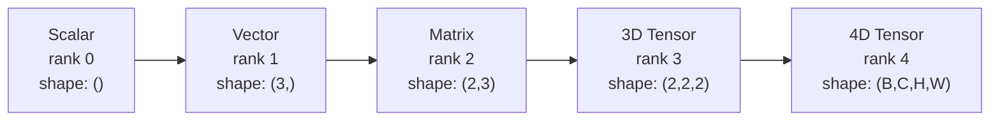
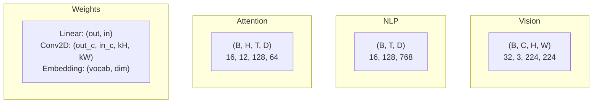
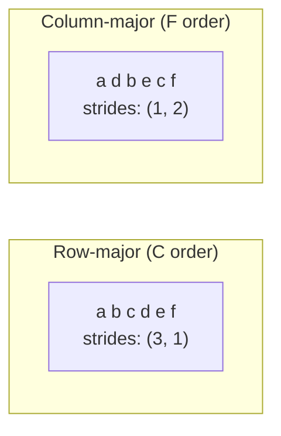
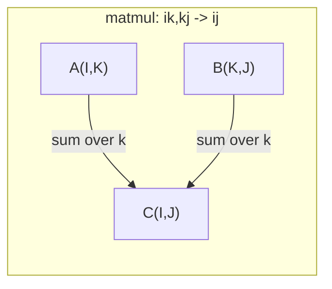

# 张量运算

> 张量是数据与深度学习之间的共同语言。每一张图像、每一句话、每一个梯度都经由它们流动。

**类型：** 构建
**语言：** Python
**前置知识：** Phase 1, Lessons 01 (Linear Algebra Intuition), 02 (Vectors, Matrices & Operations)
**时间：** 约 90 分钟

## 学习目标

- 从零实现一个张量类，包含 shape、strides、reshape、transpose 以及逐元素运算
- 应用广播规则，在不复制数据的情况下对不同 shape 的张量进行运算
- 编写 einsum 表达式，实现点积、矩阵乘法、外积和批处理运算
- 逐步追踪多头注意力（multi-head attention）中每一步的精确张量 shape

## 问题所在

你构建了一个 Transformer。前向传播看起来很干净。运行后却得到：`RuntimeError: mat1 and mat2 shapes cannot be multiplied (32x768 and 512x768)`。你盯着那些 shape 看，试了一次 transpose。现在报错变成 `Expected 4D input (got 3D input)`。你加了一个 unsqueeze，别的地方又坏了。

shape 错误是深度学习代码中最常见的 bug。它们在概念上并不难——每个运算都有 shape 约定——但错误会迅速叠加。一个 Transformer 中有几十个 reshape、transpose 和 broadcast 串联在一起。错一个轴，错误就会级联扩散。更糟的是，有些 shape 错误根本不抛出异常，而是在错误的维度上广播或在错误的轴上求和，悄无声息地产生垃圾数据。

矩阵处理的是两组事物之间的成对关系，而真实数据并不能塞进两个维度。一批 32 张 224x224 的 RGB 图像是一个 4D 张量：`(32, 3, 224, 224)`。带 12 个头的自注意力同样是 4D：`(batch, heads, seq_len, head_dim)`。你需要一种能推广到任意维度的数据结构，且其运算能在所有维度上干净地组合。这个结构就是张量。掌握它的运算，shape 错误就会变得极易调试。

## 概念

### 什么是张量

张量是具有统一数据类型的多维数值数组。维度的数量称为 **秩**（或 **阶**）。每个维度称为一个 **轴**。**shape** 是一个元组，列出每个轴的大小。



元素总数 = 所有维度大小的乘积。shape 为 `(2, 3, 4)` 的张量包含 `2 * 3 * 4 = 24` 个元素。

### 深度学习中的张量 shape

按照惯例，不同类型的数据对应特定的张量 shape。



PyTorch 使用 NCHW（通道优先）。TensorFlow 默认使用 NHWC（通道在后）。布局不匹配会导致隐性变慢或报错。

### 内存布局的工作原理

内存中的一个 2D 数组是一段 1D 字节序列。**strides** 告诉你沿着每个轴移动一步需要跳过多少个元素。



Transpose 并不移动数据。它只是交换 strides，使张量变为**非连续（non-contiguous）**——同一行的元素在内存中不再相邻。

### 广播规则

广播让你无需复制数据就能对不同 shape 的张量进行运算。将 shape 从右对齐。当两个维度相等或其中之一为 1 时它们兼容。维度较少的张量在左侧用 1 补齐。

```
Tensor A:     (8, 1, 6, 1)
Tensor B:        (7, 1, 5)
Padded B:     (1, 7, 1, 5)
Result:       (8, 7, 6, 5)
```

### Einsum：通用的张量运算

Einstein 求和用字母标记每个轴。出现在输入但不出现在输出中的轴会被求和，同时出现在输入和输出中的轴会被保留。



关键模式：`i,i->`（点积）、`i,j->ij`（外积）、`ii->`（迹）、`ij->ji`（转置）、`bij,bjk->bik`（批处理矩阵乘法）、`bhtd,bhsd->bhts`（注意力分数）。

```figure
tensor-broadcast
```

## 动手实现

代码位于 `code/tensors.py`。每个步骤都引用其中的实现。

### 第 1 步：张量存储与 strides

一个张量存储一个扁平的数字列表加上 shape 元数据。Strides 告诉索引逻辑如何将多维索引映射到扁平位置。

```python
class Tensor:
    def __init__(self, data, shape=None):
        if isinstance(data, (list, tuple)):
            self._data, self._shape = self._flatten_nested(data)
        elif isinstance(data, np.ndarray):
            self._data = data.flatten().tolist()
            self._shape = tuple(data.shape)
        else:
            self._data = [data]
            self._shape = ()

        if shape is not None:
            total = reduce(lambda a, b: a * b, shape, 1)
            if total != len(self._data):
                raise ValueError(
                    f"Cannot reshape {len(self._data)} elements into shape {shape}"
                )
            self._shape = tuple(shape)

        self._strides = self._compute_strides(self._shape)

    @staticmethod
    def _compute_strides(shape):
        if len(shape) == 0:
            return ()
        strides = [1] * len(shape)
        for i in range(len(shape) - 2, -1, -1):
            strides[i] = strides[i + 1] * shape[i + 1]
        return tuple(strides)
```

对于 shape `(3, 4)`，strides 是 `(4, 1)`——前进一行跳过 4 个元素，前进一列跳过 1 个元素。

### 第 2 步：Reshape、squeeze、unsqueeze

Reshape 在不改变元素顺序的情况下改变 shape。元素总数必须保持不变。可以对某个维度使用 `-1` 来自动推断其大小。

```python
t = Tensor(list(range(12)), shape=(2, 6))
r = t.reshape((3, 4))
r = t.reshape((-1, 3))
```

Squeeze 移除大小为 1 的轴。Unsqueeze 插入一个。Unsqueeze 对广播至关重要——将偏置向量 `(D,)` 加到批次 `(B, T, D)` 上需要先 unsqueeze 为 `(1, 1, D)`。

```python
t = Tensor(list(range(6)), shape=(1, 3, 1, 2))
s = t.squeeze()
v = Tensor([1, 2, 3])
u = v.unsqueeze(0)
```

### 第 3 步：Transpose 与 permute

Transpose 交换两个轴。Permute 重新排列所有轴。这就是在 NCHW 和 NHWC 之间转换的方法。

```python
mat = Tensor(list(range(6)), shape=(2, 3))
tr = mat.transpose(0, 1)

t4d = Tensor(list(range(24)), shape=(1, 2, 3, 4))
perm = t4d.permute((0, 2, 3, 1))
```

在 transpose 或 permute 之后，张量在内存中是非连续的。在 PyTorch 中，`view` 对非连续张量会失败——请使用 `reshape`，或先调用 `.contiguous()`。

### 第 4 步：逐元素运算与归约

逐元素运算（加、乘、减）独立地作用于每个元素并保持 shape 不变。归约运算（sum、mean、max）则折叠一个或多个轴。

```python
a = Tensor([[1, 2], [3, 4]])
b = Tensor([[10, 20], [30, 40]])
c = a + b
d = a * 2
s = a.sum(axis=0)
```

CNN 中的全局平均池化：`(B, C, H, W).mean(axis=[2, 3])` 产生 `(B, C)`。NLP 中的序列均值池化：`(B, T, D).mean(axis=1)` 产生 `(B, D)`。

### 第 5 步：用 NumPy 实现广播

`tensors.py` 中的 `demo_broadcasting_numpy()` 函数展示了核心模式。

```python
activations = np.random.randn(4, 3)
bias = np.array([0.1, 0.2, 0.3])
result = activations + bias

images = np.random.randn(2, 3, 4, 4)
scale = np.array([0.5, 1.0, 1.5]).reshape(1, 3, 1, 1)
result = images * scale

a = np.array([1, 2, 3]).reshape(-1, 1)
b = np.array([10, 20, 30, 40]).reshape(1, -1)
outer = a * b
```

通过广播计算成对距离：将 `(M, 2)` reshape 为 `(M, 1, 2)`，将 `(N, 2)` reshape 为 `(1, N, 2)`，相减、平方、沿最后一个轴求和，再开平方根。结果为 `(M, N)`。

### 第 6 步：Einsum 运算

`demo_einsum()` 和 `demo_einsum_gallery()` 函数逐步演示了每种常见模式。

```python
a = np.array([1.0, 2.0, 3.0])
b = np.array([4.0, 5.0, 6.0])
dot = np.einsum("i,i->", a, b)

A = np.array([[1, 2], [3, 4], [5, 6]], dtype=float)
B = np.array([[7, 8, 9], [10, 11, 12]], dtype=float)
matmul = np.einsum("ik,kj->ij", A, B)

batch_A = np.random.randn(4, 3, 5)
batch_B = np.random.randn(4, 5, 2)
batch_mm = np.einsum("bij,bjk->bik", batch_A, batch_B)
```

一次收缩的计算开销是所有索引大小（保留与求和的）的乘积。对于 B=32, I=128, J=64, K=128 的 `bij,bjk->bik`：需要 `32 * 128 * 64 * 128 = 33,554,432` 次乘加运算。

### 第 7 步：用 einsum 实现注意力机制

`demo_attention_einsum()` 函数完整实现了多头注意力。

```python
B, H, T, D = 2, 4, 8, 16
E = H * D

X = np.random.randn(B, T, E)
W_q = np.random.randn(E, E) * 0.02

Q = np.einsum("bte,ek->btk", X, W_q)
Q = Q.reshape(B, T, H, D).transpose(0, 2, 1, 3)

scores = np.einsum("bhtd,bhsd->bhts", Q, K) / np.sqrt(D)
weights = softmax(scores, axis=-1)
attn_output = np.einsum("bhts,bhsd->bhtd", weights, V)

concat = attn_output.transpose(0, 2, 1, 3).reshape(B, T, E)
output = np.einsum("bte,ek->btk", concat, W_o)
```

每一步都是张量运算：投影（通过 einsum 的矩阵乘法）、头拆分（reshape + transpose）、注意力分数（通过 einsum 的批处理矩阵乘法）、加权和（通过 einsum 的批处理矩阵乘法）、头合并（transpose + reshape）、输出投影（通过 einsum 的矩阵乘法）。

## 使用它

### 从零实现 vs NumPy

| 运算 | 从零实现（Tensor 类） | NumPy |
|---|---|---|
| 创建 | `Tensor([[1,2],[3,4]])` | `np.array([[1,2],[3,4]])` |
| Reshape | `t.reshape((3,4))` | `a.reshape(3,4)` |
| Transpose | `t.transpose(0,1)` | `a.T` 或 `a.transpose(0,1)` |
| Squeeze | `t.squeeze(0)` | `np.squeeze(a, 0)` |
| 求和 | `t.sum(axis=0)` | `a.sum(axis=0)` |
| Einsum | 不支持 | `np.einsum("ij,jk->ik", a, b)` |

### 从零实现 vs PyTorch

```python
import torch

t = torch.tensor([[1, 2, 3], [4, 5, 6]], dtype=torch.float32)
t.shape
t.stride()
t.is_contiguous()

t.reshape(3, 2)
t.unsqueeze(0)
t.transpose(0, 1)
t.transpose(0, 1).contiguous()

torch.einsum("ik,kj->ij", A, B)
```

PyTorch 增加了 autograd、GPU 支持和优化的 BLAS 内核。shape 语义完全一致。如果你理解了从零实现的版本，PyTorch 的 shape 报错就会变得可读。

### 每个神经网络层都是一种张量运算

| 运算 | 张量形式 | Einsum |
|---|---|---|
| 线性层 | `Y = X @ W.T + b` | `"bd,od->bo"` + bias |
| Attention QKV | `Q = X @ W_q` | `"btd,dh->bth"` |
| 注意力分数 | `Q @ K.T / sqrt(d)` | `"bhtd,bhsd->bhts"` |
| 注意力输出 | `softmax(scores) @ V` | `"bhts,bhsd->bhtd"` |
| Batch norm | `(X - mu) / sigma * gamma` | 逐元素 + 广播 |
| Softmax | `exp(x) / sum(exp(x))` | 逐元素 + 归约 |

## 交付成果

本课产出两个可复用的提示词（prompt）：

1. **`outputs/prompt-tensor-shapes.md`** —— 一套系统化调试张量 shape 不匹配的提示词。包含每种常见运算（matmul、broadcast、cat、Linear、Conv2d、BatchNorm、softmax）的决策表和修复查找表。

2. **`outputs/prompt-tensor-debugger.md`** —— 一个分步调试提示词，当 shape 错误阻塞你时，可以粘贴到任何 AI 助手中。输入错误信息和你的张量 shape，即可得到确切的修复方法。

## 练习

1. **简单 -- Reshape 往返。** 取一个 shape 为 `(2, 3, 4)` 的张量。将其 reshape 为 `(6, 4)`，再变为 `(24,)`，然后回到 `(2, 3, 4)`。每一步都通过打印扁平数据来验证元素顺序保持不变。

2. **中等 -- 实现广播。** 为 `Tensor` 类扩展一个 `broadcast_to(shape)` 方法，将大小为 1 的维度扩展以匹配目标 shape。然后修改 `_elementwise_op`，使其在运算前自动广播。用 shape `(3, 1)` 和 `(1, 4)` 测试，应产生 `(3, 4)`。

3. **困难 -- 从零实现 einsum。** 实现一个基础的 `einsum(subscripts, *tensors)` 函数，至少支持：点积（`i,i->`）、矩阵乘法（`ij,jk->ik`）、外积（`i,j->ij`）和转置（`ij->ji`）。解析下标字符串，识别被收缩的索引，并遍历所有索引组合。将结果与 `np.einsum` 对比验证。

4. **困难 -- 注意力 shape 追踪器。** 编写一个函数，输入 `batch_size`、`seq_len`、`embed_dim` 和 `num_heads`，打印多头注意力每一步的精确 shape：输入、Q/K/V 投影、头拆分、注意力分数、softmax 权重、加权和、头合并、输出投影。与 `demo_attention_einsum()` 的输出对照验证。

## 关键术语

| 术语 | 人们常说的 | 实际含义 |
|---|---|---|
| Tensor | "维度更多的矩阵" | 具有统一类型以及定义好的 shape、strides 和运算的多维数组 |
| Rank | "维度的数量" | 轴的数量。一个矩阵的 rank 为 2，而不是等于其矩阵秩 |
| Shape | "张量的大小" | 一个元组，列出每个轴的大小。`(2, 3)` 表示 2 行、3 列 |
| Stride | "内存是如何布局的" | 沿每个轴前进一个位置需要跳过的元素数量 |
| Broadcasting | "shape 不同也能直接运算" | 一套严格的规则：从右对齐，维度必须相等或其中一个为 1 |
| Contiguous | "张量是正常的" | 元素在内存中按顺序存储，与逻辑布局相比没有间隙或重排 |
| Einsum | "写 matmul 的一种花哨方式" | 一种通用记法，可用一行表达任意张量收缩、外积、迹或转置 |
| View | "与 reshape 一样" | 共享同一内存缓冲区但具有不同 shape/stride 元数据的张量。对非连续数据会失败 |
| Contraction | "对某个索引求和" | 一般化运算：两个张量之间共享的索引相乘并求和，产生更低秩的结果 |
| NCHW / NHWC | "PyTorch vs TensorFlow 格式" | 图像张量的内存布局约定。NCHW 将通道放在空间维度之前，NHWC 放在其后 |

## 延伸阅读

- [NumPy Broadcasting](https://numpy.org/doc/stable/user/basics.broadcasting.html) -- 权威规则与可视化示例
- [PyTorch Tensor Views](https://pytorch.org/docs/stable/tensor_view.html) -- 视图何时可用、何时会复制数据
- [einops](https://github.com/arogozhnikov/einops) -- 一个让张量 reshape 可读且安全的库
- [The Illustrated Transformer](https://jalammar.github.io/illustrated-transformer/) -- 可视化流经注意力机制的张量 shape
- [Einstein Summation in NumPy](https://numpy.org/doc/stable/reference/generated/numpy.einsum.html) -- 完整的 einsum 文档及示例