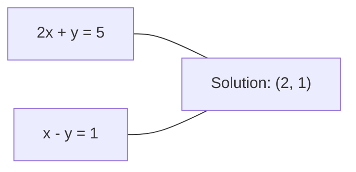
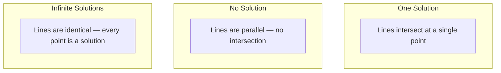

# 线性方程组

> 求解 Ax = b 是数学中最古老的问题，而它至今仍在驱动你的神经网络。

**Type:** Build
**Language:** Python
**Prerequisites:** 第 1 阶段，第 01 课（线性代数直觉）、02（向量与矩阵）、03（矩阵变换）
**Time:** 约 120 分钟

## 学习目标

- 使用带部分主元选取的高斯消元法和回代法求解 Ax = b
- 使用 LU、QR 和 Cholesky 分解对矩阵进行分解，并解释各自的适用场景
- 推导最小二乘的正规方程，并将其与线性回归和岭回归联系起来
- 使用条件数诊断病态方程组，并应用正则化使其稳定

## 问题

每次训练线性回归时，你都在求解一个线性方程组。每次计算最小二乘拟合时，你都在求解一个线性方程组。每当神经网络的一层计算 `y = Wx + b` 时，它就在计算线性方程组的一侧。当你加入正则化时，你修改了这个方程组。当你使用高斯过程时，你要对矩阵进行分解。当你为马氏距离求协方差矩阵的逆时，你在求解一个线性方程组。

方程 Ax = b 无处不在。A 是已知的系数矩阵。b 是已知的输出向量。x 是你要求解的未知量向量。在线性回归中，A 是你的数据矩阵，b 是你的目标向量，x 是权重向量。整个模型可归结为：求 x，使得 Ax 尽可能接近 b。

本课从零开始构建求解该方程的每一种主要方法。你将理解为什么有些方法快而另一些稳定，为什么有些只适用于方阵方程组而另一些能处理超定方程组，以及为什么矩阵的条件数决定了你的答案是否有意义。

## 概念

### Ax = b 在几何上意味着什么

线性方程组有几何解释。每个方程定义一个超平面。解就是所有超平面相交的点（或点集）。

```
2x + y = 5          Two lines in 2D.
x - y  = 1          They intersect at x=2, y=1.
```



可能出现三种情况：



用矩阵的语言来说，“唯一解”意味着 A 可逆。“无解”意味着方程组不相容。“无穷多解”意味着 A 有零空间。大多数机器学习问题属于“没有精确解”这一类，因为方程（数据点）的数量多于未知量（参数）的数量。这正是最小二乘法的用武之地。

### 列视角与行视角

阅读 Ax = b 有两种方式。

**行视角。** A 的每一行定义一个方程。每个方程是一个超平面。解就是它们全部相交的地方。

**列视角。** A 的每一列是一个向量。问题变成：A 的列的什么线性组合能产生 b？

```
A = | 2  1 |    b = | 5 |
    | 1 -1 |        | 1 |

Row picture: solve 2x + y = 5 and x - y = 1 simultaneously.

Column picture: find x1, x2 such that:
  x1 * [2, 1] + x2 * [1, -1] = [5, 1]
  2 * [2, 1] + 1 * [1, -1] = [4+1, 2-1] = [5, 1]   check.
```

列视角更为根本。如果 b 位于 A 的列空间中，方程组有解。如果不在，你就找列空间中离 b 最近的点。那个最近的点就是最小二乘解。

### 高斯消元

高斯消元把 Ax = b 变换为上三角方程组 Ux = c，然后用回代法求解。这是最直接的方法。

算法如下：

```
1. For each column k (the pivot column):
   a. Find the largest entry in column k at or below row k (partial pivoting).
   b. Swap that row with row k.
   c. For each row i below k:
      - Compute multiplier m = A[i][k] / A[k][k]
      - Subtract m times row k from row i.
2. Back substitute: solve from the last equation upward.
```

示例：

```
Original:
| 2  1  1 | 8 |       R2 = R2 - (2)R1     | 2  1   1 |  8 |
| 4  3  3 |20 |  -->  R3 = R3 - (1)R1 --> | 0  1   1 |  4 |
| 2  3  1 |12 |                            | 0  2   0 |  4 |

                       R3 = R3 - (2)R2     | 2  1   1 |  8 |
                                       --> | 0  1   1 |  4 |
                                           | 0  0  -2 | -4 |

Back substitute:
  -2 * x3 = -4    -->  x3 = 2
  x2 + 2  = 4     -->  x2 = 2
  2*x1 + 2 + 2 = 8 --> x1 = 2
```

高斯消元的代价是 O(n^3) 次运算。对一个 1000x1000 的方程组，这大约是十亿次浮点运算。很快，但如果你需要用同一个 A 求解多个方程组，可以做得更好。

### 部分主元选取：为什么重要

不选主元时，高斯消元可能失败或产生垃圾结果。如果主元元素为零，你会除以零。如果它很小，你会放大舍入误差。

```
Bad pivot:                       With partial pivoting:
| 0.001  1 | 1.001 |            Swap rows first:
| 1      1 | 2     |            | 1      1 | 2     |
                                 | 0.001  1 | 1.001 |
m = 1/0.001 = 1000              m = 0.001/1 = 0.001
R2 = R2 - 1000*R1               R2 = R2 - 0.001*R1
| 0.001  1     | 1.001   |      | 1      1     | 2     |
| 0     -999   | -999.0  |      | 0      0.999 | 0.999 |

x2 = 1.000 (correct)            x2 = 1.000 (correct)
x1 = (1.001 - 1)/0.001          x1 = (2 - 1)/1 = 1.000 (correct)
   = 0.001/0.001 = 1.000        Stable because the multiplier is small.
```

在精度有限的浮点运算中，不选主元的版本可能丢失有效数字。部分主元选取总是选择可用的最大主元，以最小化误差放大。

### LU 分解

LU 分解把 A 分解为下三角矩阵 L 和上三角矩阵 U：A = LU。矩阵 L 存储高斯消元中的乘数。矩阵 U 是消元的结果。

```
A = L @ U

| 2  1  1 |   | 1  0  0 |   | 2  1   1 |
| 4  3  3 | = | 2  1  0 | @ | 0  1   1 |
| 2  3  1 |   | 1  2  1 |   | 0  0  -2 |
```

为什么要分解而不是直接消元？因为一旦你有了 L 和 U，对任意新的 b 求解 Ax = b 只需 O(n^2)：

```
Ax = b
LUx = b
Let y = Ux:
  Ly = b    (forward substitution, O(n^2))
  Ux = y    (back substitution, O(n^2))
```

O(n^3) 的代价只在分解时支付一次。之后每次求解都是 O(n^2)。如果你需要用同一个 A 求解 1000 个不同 b 向量的方程组，LU 能把总工作量节省 1000/3 倍。

加上部分主元选取，你得到 PA = LU，其中 P 是记录行交换的置换矩阵。

### QR 分解

QR 分解把 A 分解为正交矩阵 Q 和上三角矩阵 R：A = QR。

正交矩阵满足 Q^T Q = I。它的列是标准正交向量。乘以 Q 保持长度和角度不变。

```
A = Q @ R

Q has orthonormal columns: Q^T Q = I
R is upper triangular

To solve Ax = b:
  QRx = b
  Rx = Q^T b    (just multiply by Q^T, no inversion needed)
  Back substitute to get x.
```

在求解最小二乘问题时，QR 在数值上比 LU 更稳定。Gram-Schmidt 过程逐列构造 Q：

```
Given columns a1, a2, ... of A:

q1 = a1 / ||a1||

q2 = a2 - (a2 . q1) * q1        (subtract projection onto q1)
q2 = q2 / ||q2||                (normalize)

q3 = a3 - (a3 . q1) * q1 - (a3 . q2) * q2
q3 = q3 / ||q3||

R[i][j] = qi . aj    for i <= j
```

每一步都去掉沿之前所有 q 向量的分量，只留下新的正交方向。

### Cholesky 分解

当 A 是对称矩阵（A = A^T）且正定（所有特征值均为正）时，可以把它分解为 A = L L^T，其中 L 是下三角矩阵。这就是 Cholesky 分解。

```
A = L @ L^T

| 4  2 |   | 2  0 |   | 2  1 |
| 2  5 | = | 1  2 | @ | 0  2 |

L[i][i] = sqrt(A[i][i] - sum(L[i][k]^2 for k < i))
L[i][j] = (A[i][j] - sum(L[i][k]*L[j][k] for k < j)) / L[j][j]    for i > j
```

Cholesky 的速度是 LU 的两倍，所需存储空间也是一半。它只适用于对称正定矩阵，但这类矩阵随处可见：

- 协方差矩阵是对称半正定的（加正则化后为正定）。
- 高斯过程中的核矩阵是对称正定的。
- 凸函数在极小值处的 Hessian 是对称正定的。
- A^T A 总是对称半正定的。

在高斯过程中，你用 Cholesky 分解核矩阵 K，然后求解 K alpha = y 得到预测均值。Cholesky 因子还给你边际似然所需的对数行列式：log det(K) = 2 * sum(log(diag(L)))。

### 最小二乘：当 Ax = b 没有精确解时

如果 A 是 m x n 且 m > n（方程多于未知量），方程组是超定的。不存在精确解。此时你转而最小化平方误差：

```
minimize ||Ax - b||^2

This is the sum of squared residuals:
  sum((A[i,:] @ x - b[i])^2 for i in range(m))
```

最小化点满足正规方程：

```
A^T A x = A^T b
```

推导：展开 ||Ax - b||^2 = (Ax - b)^T (Ax - b) = x^T A^T A x - 2 x^T A^T b + b^T b。对 x 求梯度并令其为零：2 A^T A x - 2 A^T b = 0。

```
Original system (overdetermined, 4 equations, 2 unknowns):
| 1  1 |         | 3 |
| 1  2 | x     = | 5 |       No exact x satisfies all 4 equations.
| 1  3 |         | 6 |
| 1  4 |         | 8 |

Normal equations:
A^T A = | 4  10 |    A^T b = | 22 |
        | 10 30 |            | 63 |

Solve: x = [1.5, 1.7]

This is linear regression. x[0] is the intercept, x[1] is the slope.
```

### 正规方程 = 线性回归

这二者的联系是精确的。在线性回归中，数据矩阵 X 每行一个样本、每列一个特征。目标向量 y 每个样本一个条目。权重向量 w 满足：

```
X^T X w = X^T y
w = (X^T X)^(-1) X^T y
```

这就是线性回归的闭式解。每次调用 `sklearn.linear_model.LinearRegression.fit()` 计算的都是它（或通过 QR 或 SVD 得到的等价结果）。

在矩阵中加上正则化项 lambda * I，就得到岭回归：

```
(X^T X + lambda * I) w = X^T y
w = (X^T X + lambda * I)^(-1) X^T y
```

正则化使矩阵的条件数更好（更容易精确求逆），并通过把权重向零收缩来防止过拟合。当 lambda > 0 时，矩阵 X^T X + lambda * I 总是对称正定的，因此可以用 Cholesky 求解。

### 伪逆（Moore-Penrose）

伪逆 A+ 把矩阵求逆推广到非方阵和奇异矩阵。对任意矩阵 A：

```
x = A+ b

where A+ = V Sigma+ U^T    (computed via SVD)
```

Sigma+ 的构造方法是取每个非零奇异值的倒数，然后转置结果。如果 A = U Sigma V^T，则 A+ = V Sigma+ U^T。

```
A = U Sigma V^T        (SVD)

Sigma = | 5  0 |       Sigma+ = | 1/5  0  0 |
        | 0  2 |                | 0  1/2  0 |
        | 0  0 |

A+ = V Sigma+ U^T
```

伪逆给出最小范数的最小二乘解。如果方程组：
- 有唯一解：A+ b 给出它。
- 无解：A+ b 给出最小二乘解。
- 有无穷多解：A+ b 给出范数 ||x|| 最小的那个解。

NumPy 的 `np.linalg.lstsq` 和 `np.linalg.pinv` 内部都使用 SVD。

### 条件数

条件数衡量解对输入微小变化的敏感程度。对矩阵 A，条件数为：

```
kappa(A) = ||A|| * ||A^(-1)|| = sigma_max / sigma_min
```

其中 sigma_max 和 sigma_min 分别是最大和最小奇异值。

```
Well-conditioned (kappa ~ 1):        Ill-conditioned (kappa ~ 10^15):
Small change in b -->                Small change in b -->
small change in x                    huge change in x

| 2  0 |   kappa = 2/1 = 2          | 1   1          |   kappa ~ 10^15
| 0  1 |   safe to solve            | 1   1+10^(-15) |   solution is garbage
```

经验法则：
- kappa < 100：安全，解是精确的。
- kappa ~ 10^k：你会因浮点运算而损失大约 k 位有效精度。
- kappa ~ 10^16（float64 情况下）：解毫无意义。矩阵实际上是奇异的。

在机器学习中，当特征近乎共线时会出现病态。正则化（加 lambda * I）把条件数从 sigma_max / sigma_min 改善为 (sigma_max + lambda) / (sigma_min + lambda)。

### 迭代方法：共轭梯度

对于非常大的稀疏方程组（数百万未知量），LU 或 Cholesky 之类的直接方法代价太高。迭代方法通过在多次迭代中不断改进一个猜测来逼近解。

共轭梯度法（CG）在 A 对称正定时求解 Ax = b。它最多在 n 次迭代中找到精确解（在精确算术下），但如果 A 的特征值聚集，通常收敛得快得多。

```
Algorithm sketch:
  x0 = initial guess (often zero)
  r0 = b - A x0           (residual)
  p0 = r0                 (search direction)

  For k = 0, 1, 2, ...:
    alpha = (rk . rk) / (pk . A pk)
    x_{k+1} = xk + alpha * pk
    r_{k+1} = rk - alpha * A pk
    beta = (r_{k+1} . r_{k+1}) / (rk . rk)
    p_{k+1} = r_{k+1} + beta * pk
    if ||r_{k+1}|| < tolerance: stop
```

CG 用于：
- 大规模优化（Newton-CG 方法）
- 求解 PDE 离散化
- 核矩阵大到无法分解的核方法
- 为其他迭代求解器做预条件

收敛速度取决于条件数。条件越好的系统收敛越快，这也是正则化有帮助的另一个原因。

### 全景：什么情况用什么方法

| 方法 | 条件 | 代价 | 使用场景 |
|--------|-------------|------|----------|
| 高斯消元 | 方阵，A 非奇异 | O(n^3) | 一次性求解方阵方程组 |
| LU 分解 | 方阵，A 非奇异 | O(n^3) 分解 + O(n^2) 求解 | 用同一个 A 多次求解 |
| QR 分解 | 任意 A（m >= n） | O(mn^2) | 最小二乘，数值稳定 |
| Cholesky | A 对称正定 | O(n^3/3) | 协方差矩阵、高斯过程、岭回归 |
| 正规方程 | 超定（m > n） | O(mn^2 + n^3) | 线性回归（n 较小时） |
| SVD / 伪逆 | 任意 A | O(mn^2) | 秩亏方程组、最小范数解 |
| 共轭梯度 | 对称正定，A 稀疏 | O(n * k * nnz) | 大型稀疏方程组，k = 迭代次数 |

### 与机器学习的联系

本课中的每一种方法都出现在生产级机器学习中：

**线性回归。** 闭式解求解正规方程 X^T X w = X^T y。做法可以是 Cholesky（n 较小时）、QR（数值稳定性重要时）或 SVD（矩阵可能秩亏时）。

**岭回归。** 在 X^T X 上加 lambda * I。正则化方程组 (X^T X + lambda * I) w = X^T y 总是可以通过 Cholesky 求解，因为当 lambda > 0 时 X^T X + lambda * I 是对称正定的。

**高斯过程。** 预测均值需要求解 K alpha = y，其中 K 是核矩阵。对 K 做 Cholesky 分解是标准做法。对数边际似然使用 log det(K) = 2 sum(log(diag(L)))。

**神经网络初始化。** 正交初始化使用 QR 分解来创建列标准正交的权重矩阵。这可以防止深度网络中的信号坍缩。

**预条件。** 大规模优化器使用不完全 Cholesky 或不完全 LU 作为共轭梯度求解器的预条件子。

**特征工程。** X^T X 的条件数告诉你特征是否共线。如果 kappa 很大，就删除特征或添加正则化。

```figure
linear-system-conditioning
```

## 动手实现

### 第 1 步：带部分主元选取的高斯消元

```python
import numpy as np

def gaussian_elimination(A, b):
    n = len(b)
    Ab = np.hstack([A.astype(float), b.reshape(-1, 1).astype(float)])

    for k in range(n):
        max_row = k + np.argmax(np.abs(Ab[k:, k]))
        Ab[[k, max_row]] = Ab[[max_row, k]]

        if abs(Ab[k, k]) < 1e-12:
            raise ValueError(f"Matrix is singular or nearly singular at pivot {k}")

        for i in range(k + 1, n):
            m = Ab[i, k] / Ab[k, k]
            Ab[i, k:] -= m * Ab[k, k:]

    x = np.zeros(n)
    for i in range(n - 1, -1, -1):
        x[i] = (Ab[i, -1] - Ab[i, i+1:n] @ x[i+1:n]) / Ab[i, i]

    return x
```

### 第 2 步：LU 分解

```python
def lu_decompose(A):
    n = A.shape[0]
    L = np.eye(n)
    U = A.astype(float).copy()
    P = np.eye(n)

    for k in range(n):
        max_row = k + np.argmax(np.abs(U[k:, k]))
        if max_row != k:
            U[[k, max_row]] = U[[max_row, k]]
            P[[k, max_row]] = P[[max_row, k]]
            if k > 0:
                L[[k, max_row], :k] = L[[max_row, k], :k]

        for i in range(k + 1, n):
            L[i, k] = U[i, k] / U[k, k]
            U[i, k:] -= L[i, k] * U[k, k:]

    return P, L, U

def lu_solve(P, L, U, b):
    n = len(b)
    Pb = P @ b.astype(float)

    y = np.zeros(n)
    for i in range(n):
        y[i] = Pb[i] - L[i, :i] @ y[:i]

    x = np.zeros(n)
    for i in range(n - 1, -1, -1):
        x[i] = (y[i] - U[i, i+1:] @ x[i+1:]) / U[i, i]

    return x
```

### 第 3 步：Cholesky 分解

```python
def cholesky(A):
    n = A.shape[0]
    L = np.zeros_like(A, dtype=float)

    for i in range(n):
        for j in range(i + 1):
            s = A[i, j] - L[i, :j] @ L[j, :j]
            if i == j:
                if s <= 0:
                    raise ValueError("Matrix is not positive definite")
                L[i, j] = np.sqrt(s)
            else:
                L[i, j] = s / L[j, j]

    return L
```

### 第 4 步：通过正规方程求解最小二乘

```python
def least_squares_normal(A, b):
    AtA = A.T @ A
    Atb = A.T @ b
    return gaussian_elimination(AtA, Atb)

def ridge_regression(A, b, lam):
    n = A.shape[1]
    AtA = A.T @ A + lam * np.eye(n)
    Atb = A.T @ b
    L = cholesky(AtA)
    y = np.zeros(n)
    for i in range(n):
        y[i] = (Atb[i] - L[i, :i] @ y[:i]) / L[i, i]
    x = np.zeros(n)
    for i in range(n - 1, -1, -1):
        x[i] = (y[i] - L.T[i, i+1:] @ x[i+1:]) / L.T[i, i]
    return x
```

### 第 5 步：条件数

```python
def condition_number(A):
    U, S, Vt = np.linalg.svd(A)
    return S[0] / S[-1]
```

## 使用它

将各部分组合起来，在真实数据上做线性回归和岭回归：

```python
np.random.seed(42)
X_raw = np.random.randn(100, 3)
w_true = np.array([2.0, -1.0, 0.5])
y = X_raw @ w_true + np.random.randn(100) * 0.1

X = np.column_stack([np.ones(100), X_raw])

w_ols = least_squares_normal(X, y)
print(f"OLS weights (ours):    {w_ols}")

w_np = np.linalg.lstsq(X, y, rcond=None)[0]
print(f"OLS weights (numpy):   {w_np}")
print(f"Max difference: {np.max(np.abs(w_ols - w_np)):.2e}")

w_ridge = ridge_regression(X, y, lam=1.0)
print(f"Ridge weights (ours):  {w_ridge}")

from sklearn.linear_model import Ridge
ridge_sk = Ridge(alpha=1.0, fit_intercept=False)
ridge_sk.fit(X, y)
print(f"Ridge weights (sklearn): {ridge_sk.coef_}")
```

## 发布它

本课产出：
- `code/linear_systems.py`，包含从零实现的高斯消元、LU 分解、Cholesky 分解、最小二乘和岭回归
- 一个可运行的演示，证明正规方程与 sklearn 的 LinearRegression 产生相同的权重

## 练习

1. 用你的高斯消元、你的 LU 求解器和 `np.linalg.solve` 求解方程组 `[[1,2,3],[4,5,6],[7,8,10]] x = [6, 15, 27]`。验证三者在浮点容差内给出相同答案。

2. 生成一个 50x5 的随机矩阵 X 和目标 y = X @ w_true + noise。分别用正规方程、QR（通过 `np.linalg.qr`）、SVD（通过 `np.linalg.svd`）和 `np.linalg.lstsq` 求解 w。比较全部四个解。测量 X^T X 的条件数，并解释它如何影响你信任哪种方法。

3. 通过让两列几乎相同（例如 column 2 = column 1 + 1e-10 * noise）构造一个近乎奇异的矩阵。计算它的条件数。分别在有正则化和没有正则化的情况下求解 Ax = b（加 0.01 * I）。比较解和残差。解释为什么正则化有帮助。

4. 对一个 100x100 的随机对称正定矩阵实现共轭梯度算法。统计收敛到容差 1e-8 需要多少次迭代。与理论上限 n 次迭代进行比较。

5. 对大小为 10、50、200、500 的对称正定矩阵，测量你的 Cholesky 求解器、LU 求解器和 `np.linalg.solve` 的运行时间。绘制结果。验证 Cholesky 大约比 LU 快 2 倍。

## 关键术语

| 术语 | 人们怎么说 | 它实际是什么意思 |
|------|----------------|----------------------|
| 线性方程组 | “解出 x” | 一组线性方程 Ax = b。求 x 就是求在变换 A 下产生输出 b 的输入。 |
| 高斯消元 | “行化简” | 用行变换系统地消去对角线以下的元素，得到一个可通过回代求解的上三角方程组。O(n^3)。 |
| 部分主元选取 | “为稳定性交换行” | 在第 k 列消元之前，把该列绝对值最大的行交换到主元位置。防止除以很小的数。 |
| LU 分解 | “分解成三角形” | 写成 A = LU，其中 L 是下三角（存储乘数），U 是上三角（消元后的矩阵）。把 O(n^3) 的代价摊销到多次求解上。 |
| QR 分解 | “正交分解” | 写成 A = QR，其中 Q 的列标准正交，R 是上三角。在最小二乘问题上比 LU 更稳定。 |
| Cholesky 分解 | “矩阵的平方根” | 对对称正定的 A，写成 A = LL^T。代价是 LU 的一半。用于协方差矩阵、核矩阵和岭回归。 |
| 最小二乘 | “无法精确时求最佳拟合” | 当方程组超定（方程多于未知量）时，最小化残差平方和 ||Ax - b||^2。 |
| 正规方程 | “微积分捷径” | A^T A x = A^T b。令 ||Ax - b||^2 的梯度为零。这正是线性回归的闭式解。 |
| 伪逆 | “非方阵的求逆” | 通过 SVD 得到 A+ = V Sigma+ U^T。对任意矩阵——方的或长的、奇异的或非奇异的——给出最小范数最小二乘解。 |
| 条件数 | “这个答案有多可信” | kappa = sigma_max / sigma_min。衡量对输入扰动的敏感性。大约会损失 log10(kappa) 位精度。 |
| 岭回归 | “正则化最小二乘” | 求解 (X^T X + lambda I) w = X^T y。加 lambda I 改善条件数并把权重向零收缩。防止过拟合。 |
| 共轭梯度 | “大矩阵的迭代 Ax=b” | 对称正定方程组的迭代求解器。最多 n 步收敛。适用于分解代价太高的大型稀疏方程组。 |
| 超定方程组 | “数据多于参数” | m x n 方程组中 m > n。不存在精确解。最小二乘找到最佳逼近。这就是所有的回归问题。 |
| 回代 | “从下往上求解” | 给定上三角方程组，先解最后一个方程，再向后代入。O(n^2)。 |
| 前代 | “从上往下求解” | 给定下三角方程组，先解第一个方程，再向前代入。O(n^2)。用于 LU 求解中的 L 步骤。 |

## 延伸阅读

- [MIT 18.06: Linear Algebra](https://ocw.mit.edu/courses/18-06-linear-algebra-spring-2010/)（Gilbert Strang）—— 关于线性方程组和矩阵分解的权威课程
- [Numerical Linear Algebra](https://people.maths.ox.ac.uk/trefethen/text.html)（Trefethen & Bau）—— 理解数值稳定性、条件数以及算法为何失败的标准参考
- [Matrix Computations](https://www.cs.cornell.edu/cv/GolubVanLoan4/golubandvanloan.htm)（Golub & Van Loan）—— 涵盖所有矩阵算法的百科全书式参考
- [3Blue1Brown: Inverse Matrices](https://www.3blue1brown.com/lessons/inverse-matrices) —— 从几何上理解求解 Ax = b 意味着什么的直观可视化