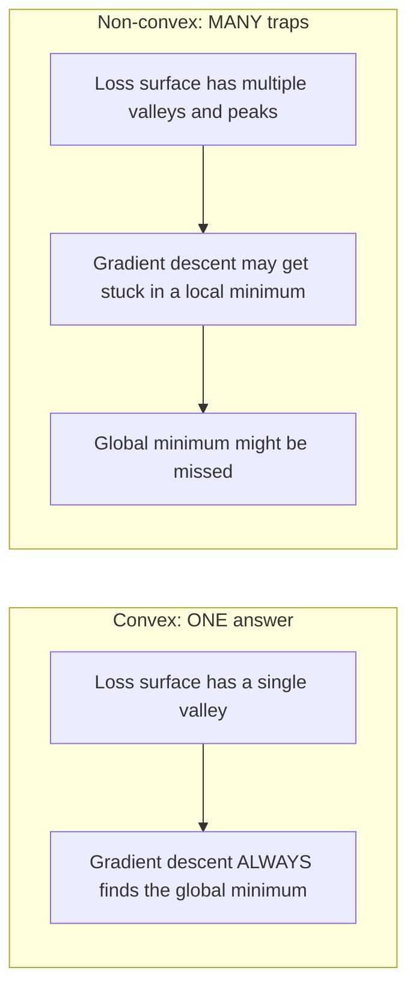
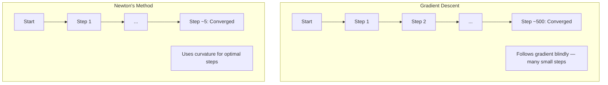
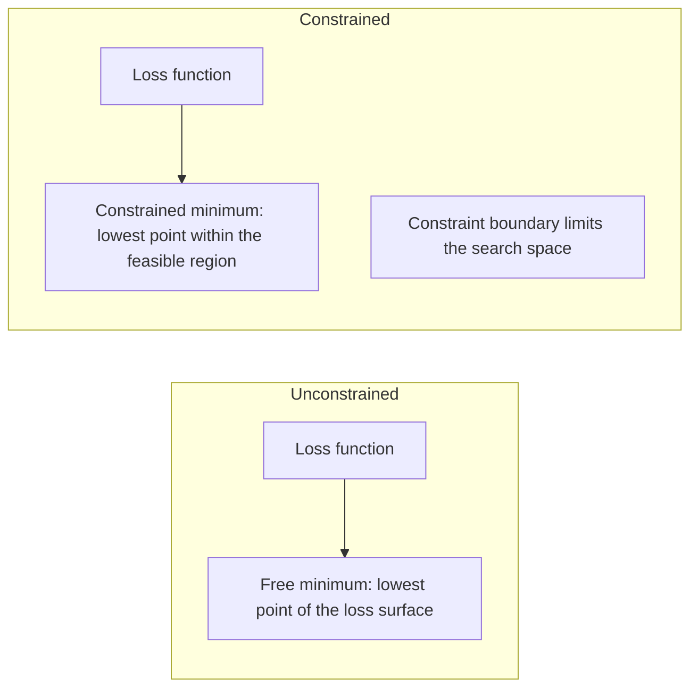
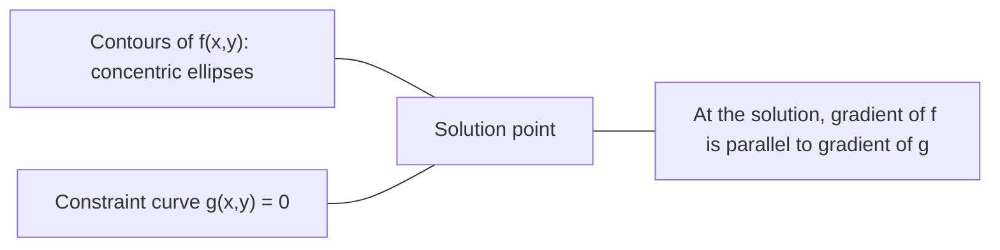

# 凸优化

> 凸问题只有一个山谷。神经网络有数百万个。了解两者的区别很重要。

**Type:** Build
**Language:** Python
**Prerequisites:** Phase 1, Lessons 04 (Calculus for ML), 08 (Optimization)
**Time:** ~90 minutes

## 学习目标

- 使用定义、二阶导数和 Hessian 判据检验函数是否为凸函数
- 实现 Newton 法，并将其二次收敛速度与梯度下降进行比较
- 使用拉格朗日乘子求解约束优化问题，并解释 KKT 条件
- 解释为什么神经网络损失曲面是非凸的，而 SGD 仍能找到好的解

## 问题

第 08 课教了你梯度下降、动量和 Adam。这些优化器可以在任何表面上向下行走。但它们没有任何保证。在非凸地形上的梯度下降可能落入糟糕的局部极小值、卡在鞍点，或永远振荡。你仍然使用它，因为神经网络是非凸的，而且别无选择。

但机器学习中的许多问题是凸的。线性回归、逻辑回归、SVM、LASSO、岭回归。对于这些问题，存在更强的工具：具有数学保证的优化。凸问题恰好只有一个山谷。任何向下行走的算法都会到达全局最小值。不需要重启。不需要学习率调度。不需要祈祷。

理解凸性有三点作用。第一，它告诉你问题何时是容易的（凸）还是困难的（非凸）。第二，它为你提供更快的工具，如针对凸问题的 Newton 法。第三，它解释了贯穿机器学习的概念：正则化作为约束、SVM 中的对偶性，以及为什么深度学习尽管违反了凸性赋予你的所有良好性质却依然有效。

## 概念

### 凸集

如果集合 S 中任意两点之间的线段也完全位于 S 内，则 S 是凸集。

| 凸集 | 非凸集 |
|---|---|
| **矩形**：内部任意两点可以用一条完全位于内部的线段连接 | **星形/月牙形**：两个内点之间的线段可能穿过集合外部 |
| **三角形**：所有内点都具有相同性质 | **圆环/环形**：孔洞使某些线段离开集合 |
| 任意两点之间的线段保持在集合内部 | 某些点对之间的线段离开集合 |

形式化判据：对 S 中任意点 x、y 以及任意 t ∈ [0, 1]，点 tx + (1-t)y 也在 S 中。

凸集的例子：
- 直线、平面、整个 R^n
- 球（圆、球面、超球面）
- 半空间：{x : a^T x <= b}
- 任意多个凸集的交集

非凸集的例子：
- 圆环（环形）
- 两个不相交圆的并集
- 任何有“凹陷”或“孔洞”的集合

### 凸函数

如果函数 f 的定义域是凸集，且对其定义域中任意两点 x、y 以及任意 t ∈ [0, 1]，都有：

```
f(tx + (1-t)y) <= t*f(x) + (1-t)*f(y)
```

几何解释：图上任意两点之间的线段位于图之上或图上。

| 性质 | 凸函数 | 非凸函数 |
|---|---|---|
| **线段检验** | 图上任意两点之间的连线位于曲线**之上或其上** | 图上某些点之间的连线**低于**曲线 |
| **形状** | 向上弯曲的单一碗状/山谷 | 多个峰谷，曲率混合 |
| **局部极小值** | 每个局部极小值都是全局最小值 | 可能存在高度不同的多个局部极小值 |

常见的凸函数：
- f(x) = x^2（抛物线）
- f(x) = |x|（绝对值）
- f(x) = e^x（指数函数）
- f(x) = max(0, x)（ReLU，虽然是分段线性的）
- f(x) = -log(x)（x > 0 时，负对数）
- 任何线性函数 f(x) = a^T x + b（既是凸的也是凹的）

### 凸性检验

三种实用检验方法，从最简单到最严格。

**检验 1：二阶导数检验（一维）。** 若对所有 x 有 f''(x) >= 0，则 f 是凸的。

- f(x) = x^2：f''(x) = 2 >= 0。凸。
- f(x) = x^3：f''(x) = 6x。当 x < 0 时为负。非凸。
- f(x) = e^x：f''(x) = e^x > 0。凸。

**检验 2：Hessian 检验（多元）。** 若 Hessian 矩阵 H(x) 对所有 x 都是半正定的，则 f 是凸的。Hessian 是二阶偏导数构成的矩阵。

**检验 3：定义检验。** 直接验证不等式 f(tx + (1-t)y) <= t*f(x) + (1-t)*f(y)。适用于导数难以计算的函数。

### 凸性为何重要

凸优化的核心定理：

**对于凸函数，每个局部极小值都是全局最小值。**

这意味着梯度下降不会被困住。任何下行路径都通向同一个答案。算法保证收敛到最优解。



推论：
- 不需要随机重启
- 不需要复杂的学习率调度
- 可以给出收敛性证明（收敛速度取决于函数性质）
- 解是唯一的（除了平坦区域）

### 机器学习中的凸与非凸

| 问题 | 凸？ | 原因 |
|---------|---------|-----|
| 线性回归（MSE） | 是 | 损失是权重的二次函数 |
| 逻辑回归 | 是 | 对数损失是权重的凸函数 |
| SVM（hinge loss） | 是 | 线性函数的最大值 |
| LASSO（L1 回归） | 是 | 凸函数之和是凸的 |
| 岭回归（L2） | 是 | 二次 + 二次 = 凸 |
| 神经网络（任意损失） | 否 | 非线性激活产生非凸地形 |
| k-means 聚类 | 否 | 离散分配步骤 |
| 矩阵分解 | 否 | 未知量的乘积 |

使用凸损失的线性模型是凸的。一旦加入带非线性激活的隐藏层，凸性就被破坏了。

### Hessian 矩阵

函数 f: R^n -> R 的 Hessian H 是由二阶偏导数构成的 n x n 矩阵。

```
H[i][j] = d^2 f / (dx_i dx_j)
```

对于 f(x, y) = x^2 + 3xy + y^2：

```
df/dx = 2x + 3y       d^2f/dx^2 = 2      d^2f/dxdy = 3
df/dy = 3x + 2y       d^2f/dydx = 3      d^2f/dy^2 = 2

H = [ 2  3 ]
    [ 3  2 ]
```

Hessian 告诉你曲率信息：
- 特征值全为正：函数在所有方向上向上弯曲（该点处是凸的）
- 特征值全为负：在所有方向上向下弯曲（凹，局部极大值）
- 符号混合：鞍点（某些方向向上弯曲，某些方向向下）
- 零特征值：该方向上是平坦的（退化）

对于凸性，Hessian 必须处处半正定（所有特征值 >= 0），而不仅在某一点。

### Newton 法

梯度下降使用一阶信息（梯度）。Newton 法使用二阶信息（Hessian）。它在当前点拟合一个二次近似，并直接跳到该二次函数的最小值。

```
Update rule:
  x_new = x - H^(-1) * gradient

Compare to gradient descent:
  x_new = x - lr * gradient
```

Newton 法用逆 Hessian 取代标量学习率。它会根据局部曲率自动调整步长和方向。



优点：
- 在极小值附近二次收敛（误差每步平方）
- 无需调节学习率
- 尺度不变（无论问题如何参数化都有效）

缺点：
- 计算 Hessian 需要 O(n^2) 内存，求逆需要 O(n^3)
- 对于有 100 万个权重的神经网络，这意味着 10^12 个元素和 10^18 次运算
- 对深度学习不实用

### 约束优化

无约束优化：在所有 x 上最小化 f(x)。
约束优化：在满足约束条件下最小化 f(x)。

现实问题都有约束。你想最小化成本，但预算有限。你想最小化误差，但模型复杂度有上限。



### 拉格朗日乘子

拉格朗日乘子法将约束问题转化为无约束问题。

问题：在约束 g(x) = 0 下最小化 f(x)。

解法：引入一个新变量（拉格朗日乘子 lambda），求解无约束问题：

```
L(x, lambda) = f(x) + lambda * g(x)
```

在解处，L 的梯度为零：

```
dL/dx = df/dx + lambda * dg/dx = 0
dL/dlambda = g(x) = 0
```

几何直觉：在约束极小值处，f 的梯度必须与约束 g 的梯度平行。如果不平行，你可以沿约束面移动并进一步降低 f。



例子：在约束 x + y = 1 下最小化 f(x,y) = x^2 + y^2。

```
L = x^2 + y^2 + lambda(x + y - 1)

dL/dx = 2x + lambda = 0  =>  x = -lambda/2
dL/dy = 2y + lambda = 0  =>  y = -lambda/2
dL/dlambda = x + y - 1 = 0

From first two: x = y
Substituting: 2x = 1, so x = y = 0.5, lambda = -1
```

直线 x + y = 1 上离原点最近的点是 (0.5, 0.5)。

### KKT 条件

Karush-Kuhn-Tucker 条件将拉格朗日乘子扩展到不等式约束。

问题：在约束 g_i(x) <= 0（i = 1, ..., m）下最小化 f(x)。

KKT 条件（最优性的必要条件）：

```
1. Stationarity:    df/dx + sum(lambda_i * dg_i/dx) = 0
2. Primal feasibility:  g_i(x) <= 0  for all i
3. Dual feasibility:    lambda_i >= 0  for all i
4. Complementary slackness:  lambda_i * g_i(x) = 0  for all i
```

互补松弛是关键洞察：要么约束是活跃的（g_i = 0，解位于边界上），要么乘子为零（约束不起作用）。不影响解的约束其 lambda = 0。

KKT 条件是 SVM 的核心。支持向量是约束活跃的数据点（lambda > 0）。所有其他数据点的 lambda = 0，不影响决策边界。

### 作为约束优化的正则化

L1 和 L2 正则化并非随意的技巧。它们是伪装起来的约束优化问题。

**L2 正则化（Ridge）：**

```
minimize  Loss(w)  subject to  ||w||^2 <= t

Equivalent unconstrained form:
minimize  Loss(w) + lambda * ||w||^2
```

约束 ||w||^2 <= t 定义了一个球（二维中是圆，三维中是球面）。解是损失等高线首次触及该球的位置。

**L1 正则化（LASSO）：**

```
minimize  Loss(w)  subject to  ||w||_1 <= t

Equivalent unconstrained form:
minimize  Loss(w) + lambda * ||w||_1
```

约束 ||w||_1 <= t 定义了一个菱形（二维中是旋转 45 度的正方形）。

| 性质 | L2 约束（圆） | L1 约束（菱形） |
|---|---|---|
| **约束形状** | 圆（高维中为球面） | 菱形（二维中为旋转的正方形） |
| **损失等高线触及处** | 光滑边界——圆上任意点 | 角点——与坐标轴对齐 |
| **解的行为** | 权重很小但不为零 | 某些权重恰好为零（稀疏） |
| **结果** | 权重收缩 | 特征选择 |

这解释了为什么 L1 产生稀疏模型（特征选择），而 L2 只是收缩权重。菱形有与坐标轴对齐的角点。损失等高线更容易触及角点，从而将一个或多个权重恰好设为零。

### 对偶性

每个约束优化问题（原问题）都有一个伴随问题（对偶问题）。对于凸问题，原问题和对偶问题具有相同的最优值。这就是强对偶性。

拉格朗日对偶函数：

```
Primal: minimize f(x) subject to g(x) <= 0
Lagrangian: L(x, lambda) = f(x) + lambda * g(x)
Dual function: d(lambda) = min_x L(x, lambda)
Dual problem: maximize d(lambda) subject to lambda >= 0
```

对偶性为何重要：
- 对偶问题有时比原问题更容易求解
- SVM 以其对偶形式求解，其中问题依赖于数据点之间的点积（从而启用核技巧）
- 对偶为原问题的最优值提供下界，可用于检验解的质量

对于 SVM 具体而言：

```
Primal: find w, b that maximize the margin 2/||w|| subject to
        y_i(w^T x_i + b) >= 1 for all i

Dual:   maximize sum(alpha_i) - 0.5 * sum_ij(alpha_i * alpha_j * y_i * y_j * x_i^T x_j)
        subject to alpha_i >= 0 and sum(alpha_i * y_i) = 0

The dual only involves dot products x_i^T x_j.
Replace x_i^T x_j with K(x_i, x_j) to get the kernel trick.
```

### 为什么深度学习在非凸性下仍然有效

神经网络损失函数极度非凸。按所有经典标准，优化它们都应该失败。然而随机梯度下降可靠地找到好的解。有几个因素解释了这一点。

**大多数局部极小值足够好。** 在高维空间中，随机临界点（梯度为零的点）绝大多数是鞍点，而非局部极小值。存在的少数局部极小值的损失值往往接近全局最小值。当参数空间有数百万维时，陷入糟糕局部极小值的可能性极低。

**真正的障碍是鞍点，而非局部极小值。** 在有 n 个参数的函数中，鞍点具有正负混合的曲率方向。对于高维中的随机临界点，所有 n 个特征值都为正（局部极小值）的概率约为 2^(-n)。几乎所有临界点都是鞍点。SGD 的噪声有助于逃离它们。

**过参数化使地形变得平滑。** 参数多于训练样本的网络具有更平滑、更连通的损失曲面。更宽的网络有更少的糟糕局部极小值。这有违直觉，但在经验上是一致的。

**损失地形结构：**

| 性质 | 低维空间 | 高维空间 |
|---|---|---|
| **地形** | 许多孤立的峰和谷 | 平滑连通的山谷 |
| **极小值** | 许多孤立的局部极小值 | 很少的糟糕局部极小值；大多数接近最优 |
| **导航** | 难以找到全局最小值 | 许多路径通向好的解 |
| **临界点** | 局部极小值和鞍点混合 | 绝大多数是鞍点，而非局部极小值 |

**随机噪声起到隐式正则化的作用。** 小批量 SGD 引入噪声，防止陷入尖锐极小值。尖锐极小值过拟合；平坦极小值泛化。噪声使优化偏向损失地形的平坦区域。

### 实践中的二阶方法

纯 Newton 法对大模型不实用。若干近似方法使二阶信息变得可用。

**L-BFGS（Limited-memory BFGS）：** 使用最近 m 次梯度差来近似逆 Hessian。只需 O(mn) 内存而非 O(n^2)。对最多约 10000 个参数的问题效果良好。用于经典机器学习（逻辑回归、CRF），但不用于深度学习。

**自然梯度：** 使用 Fisher 信息矩阵（对数似然的期望 Hessian）代替标准 Hessian。这考虑了概率分布的几何结构。K-FAC（Kronecker-Factored Approximate Curvature）将 Fisher 矩阵近似为 Kronecker 积，使其对神经网络变得实用。

**Hessian-free 优化：** 使用共轭梯度求解 Hx = g，而无需显式构造 H。只需要 Hessian-向量积，可通过自动微分在 O(n) 时间内计算。

**对角近似：** Adam 的二阶矩是 Hessian 对角线的一种对角近似。AdaHessian 通过 Hutchinson 估计器使用实际的 Hessian 对角元素对此进行扩展。

| 方法 | 内存 | 每步成本 | 适用场景 |
|--------|--------|--------------|-------------|
| 梯度下降 | O(n) | O(n) | 基线、大模型 |
| Newton 法 | O(n^2) | O(n^3) | 小型凸问题 |
| L-BFGS | O(mn) | O(mn) | 中型凸问题 |
| Adam | O(n) | O(n) | 深度学习默认 |
| K-FAC | O(n) | 每层 O(n) | 研究、大批量训练 |

```figure
convex-vs-nonconvex
```

## 动手实现

### 步骤 1：凸性检验器

构建一个通过采样点并根据定义进行检验的函数，以经验方式检验凸性。

```python
import random
import math

def check_convexity(f, dim, bounds=(-5, 5), samples=1000):
    violations = 0
    for _ in range(samples):
        x = [random.uniform(*bounds) for _ in range(dim)]
        y = [random.uniform(*bounds) for _ in range(dim)]
        t = random.uniform(0, 1)
        mid = [t * xi + (1 - t) * yi for xi, yi in zip(x, y)]
        lhs = f(mid)
        rhs = t * f(x) + (1 - t) * f(y)
        if lhs > rhs + 1e-10:
            violations += 1
    return violations == 0, violations
```

### 步骤 2：二维 Newton 法

使用显式 Hessian 实现 Newton 法。将其收敛速度与梯度下降进行比较。

```python
def newtons_method(f, grad_f, hessian_f, x0, steps=50, tol=1e-12):
    x = list(x0)
    history = [x[:]]
    for _ in range(steps):
        g = grad_f(x)
        H = hessian_f(x)
        det = H[0][0] * H[1][1] - H[0][1] * H[1][0]
        if abs(det) < 1e-15:
            break
        H_inv = [
            [H[1][1] / det, -H[0][1] / det],
            [-H[1][0] / det, H[0][0] / det],
        ]
        dx = [
            H_inv[0][0] * g[0] + H_inv[0][1] * g[1],
            H_inv[1][0] * g[0] + H_inv[1][1] * g[1],
        ]
        x = [x[0] - dx[0], x[1] - dx[1]]
        history.append(x[:])
        if sum(gi ** 2 for gi in g) < tol:
            break
    return history
```

### 步骤 3：拉格朗日乘子求解器

在拉格朗日函数上使用梯度下降求解约束优化。

```python
def lagrange_solve(f_grad, g_val, g_grad, x0, lr=0.01,
                   lr_lambda=0.01, steps=5000):
    x = list(x0)
    lam = 0.0
    history = []
    for _ in range(steps):
        fg = f_grad(x)
        gv = g_val(x)
        gg = g_grad(x)
        x = [
            xi - lr * (fgi + lam * ggi)
            for xi, fgi, ggi in zip(x, fg, gg)
        ]
        lam = lam + lr_lambda * gv
        history.append((x[:], lam, gv))
    return history
```

### 步骤 4：一阶与二阶方法比较

在同一个二次函数上运行梯度下降和 Newton 法。统计达到收敛所需的步数。

```python
def quadratic(x):
    return 5 * x[0] ** 2 + x[1] ** 2

def quadratic_grad(x):
    return [10 * x[0], 2 * x[1]]

def quadratic_hessian(x):
    return [[10, 0], [0, 2]]
```

Newton 法将在 1 步内收敛（它对二次函数是精确的）。梯度下降将需要数百步，因为 Hessian 的特征值相差 5 倍，形成了一个拉长的山谷。

## 使用

在选择机器学习模型和求解器时，凸性分析可以直接应用。

对于凸问题（逻辑回归、SVM、LASSO）：
- 使用专用求解器（liblinear、CVXPY、scipy.optimize.minimize with method='L-BFGS-B'）
- 期待唯一的全局解
- 二阶方法实用且快速

对于非凸问题（神经网络）：
- 使用一阶方法（SGD、Adam）
- 接受解依赖于初始化和随机性
- 将过参数化、噪声和学习率调度用作隐式正则化
- 不要浪费时间寻找全局最小值。一个好的局部极小值就足够了。

```python
from scipy.optimize import minimize

result = minimize(
    fun=lambda w: sum((y - X @ w) ** 2) + 0.1 * sum(w ** 2),
    x0=np.zeros(d),
    method='L-BFGS-B',
    jac=lambda w: -2 * X.T @ (y - X @ w) + 0.2 * w,
)
```

对于 SVM，对偶形式使你可以使用核技巧：

```python
from sklearn.svm import SVC

svm = SVC(kernel='rbf', C=1.0)
svm.fit(X_train, y_train)
print(f"Support vectors: {svm.n_support_}")
```

## 练习

1. **凸性画廊。** 使用检验器测试这些函数的凸性：f(x) = x^4、f(x) = sin(x)、f(x,y) = x^2 + y^2、f(x,y) = x*y、f(x) = max(x, 0)。解释为什么每个结果都合理。

2. **Newton 与梯度下降竞赛。** 从起点 (10, 10) 在 f(x,y) = 50*x^2 + y^2 上运行两种方法。每种方法需要多少步才能使损失 < 1e-10？当条件数（Hessian 最大与最小特征值之比）增大时，梯度下降会发生什么？

3. **拉格朗日乘子几何。** 在约束 x + 2y = 4 下最小化 f(x,y) = (x-3)^2 + (y-3)^2。通过检验 f 的梯度在解处是否与 g 的梯度平行来验证解。

4. **正则化约束。** 实现 L1 约束优化：在约束 |x| + |y| <= 1 下最小化 (x-3)^2 + (y-2)^2。证明解有一个坐标为零（来自菱形约束的稀疏性）。

5. **Hessian 特征值分析。** 计算 Rosenbrock 函数在 (1,1) 和 (-1,1) 处的 Hessian。计算两点处的特征值。这些特征值关于极小值处与远离极小值处的曲率告诉你什么？

## 关键术语

| 术语 | 含义 |
|------|---------------|
| 凸集 | 集合内任意两点之间的线段仍在集合内的集合 |
| 凸函数 | 图上任意两点之间的连线位于图之上或其上的函数。等价地，Hessian 处处半正定 |
| 局部极小值 | 比附近所有点都低的点。对于凸函数，每个局部极小值都是全局最小值 |
| 全局最小值 | 函数在整个定义域上的最低点 |
| Hessian 矩阵 | 所有二阶偏导数构成的矩阵。编码曲率信息 |
| 半正定 | 所有特征值均非负的矩阵。"二阶导数 >= 0"的多维类比 |
| 条件数 | Hessian 最大与最小特征值之比。高条件数意味着拉长的山谷和缓慢的梯度下降 |
| Newton 法 | 使用逆 Hessian 确定步长和方向的二阶优化器。在极小值附近二次收敛 |
| 拉格朗日乘子 | 为将约束优化问题转化为无约束问题而引入的变量 |
| KKT 条件 | 带不等式约束时最优性的必要条件。拉格朗日乘子的推广 |
| 互补松弛 | 在解处，要么约束活跃，要么其乘子为零。两者从不同时非零 |
| 对偶性 | 每个约束问题都有一个伴随对偶问题。对于凸问题，两者具有相同的最优值 |
| 强对偶性 | 原问题与对偶问题的最优值相等。对满足 Slater 条件的凸问题成立 |
| L-BFGS | 存储最近 m 次梯度差而非完整 Hessian 的近似二阶方法 |
| 鞍点 | 梯度为零，但在某些方向上是极小值、在另一些方向上是极大值的点 |
| 过参数化 | 使用多于训练样本数量的参数。平滑损失地形并减少糟糕的局部极小值 |

## 延伸阅读

- [Boyd & Vandenberghe: Convex Optimization](https://web.stanford.edu/~boyd/cvxbook/) - 标准教材，可在线免费获取
- [Bottou, Curtis, Nocedal: Optimization Methods for Large-Scale Machine Learning (2018)](https://arxiv.org/abs/1606.04838) - 连接凸优化理论与深度学习实践
- [Choromanska et al.: The Loss Surfaces of Multilayer Networks (2015)](https://arxiv.org/abs/1412.0233) - 为什么非凸的神经网络地形并没有看起来那么糟
- [Nocedal & Wright: Numerical Optimization](https://link.springer.com/book/10.1007/978-0-387-40065-5) - 关于 Newton 法、L-BFGS 和约束优化的全面参考