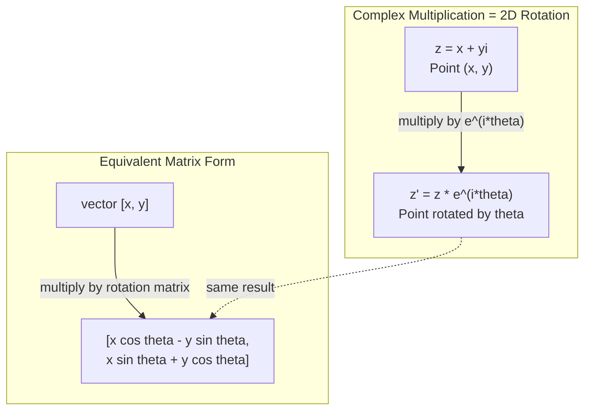
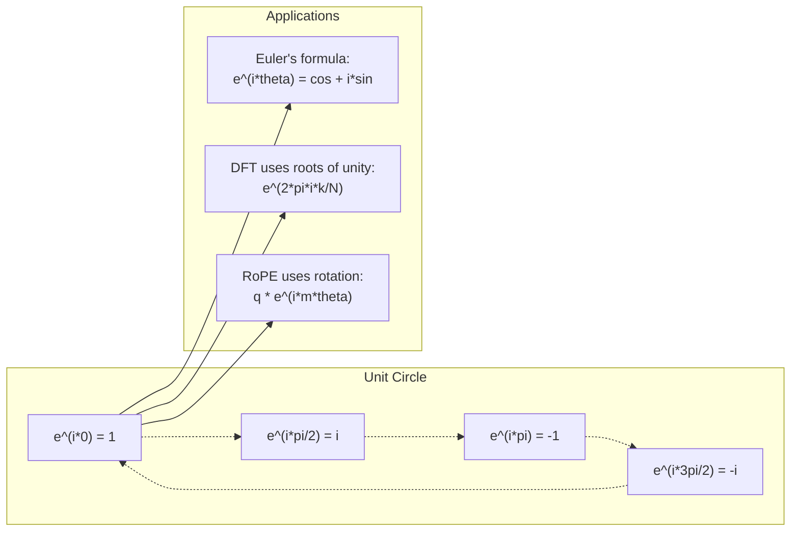

# 面向 AI 的复数

> -1 的平方根并不虚幻。它是旋转、频率以及半个信号处理领域的关键。

**Type:** Learn
**Language:** Python
**Prerequisites:** Phase 1, Lessons 01-04 (线性代数、微积分)
**Time:** 约 60 分钟

## 学习目标

- 在直角坐标形式和极坐标形式下进行复数运算(加、乘、除、共轭)
- 应用欧拉公式在复指数与三角函数之间进行转换
- 使用单位根实现离散傅里叶变换
- 解释复数旋转如何支撑 transformer 中的 RoPE 和正弦位置编码

## 问题背景

你打开一篇关于傅里叶变换的论文，到处都是 `i`。你查看 transformer 位置编码，看到不同频率下的 `sin` 和 `cos`——它们是复指数的实部和虚部。你阅读量子计算的内容，发现一切都用复向量空间表示。

复数看起来很抽象。一个建立在 -1 的平方根之上的数系像是一种数学戏法。但它不是戏法。它是旋转和振荡的自然语言。每当有东西在旋转、振动或振荡时，复数都是合适的工具。

不理解复数，你就无法理解离散傅里叶变换，无法理解 FFT,也无法理解 RoPE(Rotary Position Embedding)在现代语言模型中的工作原理，更无法理解原始 Transformer 论文中的正弦位置编码为何使用那些频率。

本课从零开始构建复数运算，将其与几何联系起来，并准确展示复数在机器学习中的出现位置。

## 核心概念

### 什么是复数？

复数由两部分组成：实部和虚部。

```
z = a + bi

where:
  a is the real part
  b is the imaginary part
  i is the imaginary unit, defined by i^2 = -1
```

就是这样。你把数轴扩展成一个平面。实数位于一条轴上，虚数位于另一条轴上。每个复数都是这个平面上的一个点。

### 复数运算

**加法。** 实部相加，虚部相加。

```
(a + bi) + (c + di) = (a + c) + (b + d)i

Example: (3 + 2i) + (1 + 4i) = 4 + 6i
```

**乘法。** 使用分配律，并记住 i^2 = -1。

```
(a + bi)(c + di) = ac + adi + bci + bdi^2
                 = ac + adi + bci - bd
                 = (ac - bd) + (ad + bc)i

Example: (3 + 2i)(1 + 4i) = 3 + 12i + 2i + 8i^2
                            = 3 + 14i - 8
                            = -5 + 14i
```

**共轭。** 改变虚部的符号。

```
conjugate of (a + bi) = a - bi
```

复数与其共轭的乘积总是实数：

```
(a + bi)(a - bi) = a^2 + b^2
```

**除法。** 分子和分母同时乘以分母的共轭。

```
(a + bi) / (c + di) = (a + bi)(c - di) / (c^2 + d^2)
```

这消除了分母中的虚部，得到一个干净的复数。

### 复平面

复平面把每个复数映射到一个二维点。水平轴是实轴，垂直轴是虚轴。

```
z = 3 + 2i  corresponds to the point (3, 2)
z = -1 + 0i corresponds to the point (-1, 0) on the real axis
z = 0 + 4i  corresponds to the point (0, 4) on the imaginary axis
```

一个复数同时是一个点和从原点出发的一个向量。这种双重解释正是复数在几何中有用的原因。

### 极坐标形式

平面上的任何点都可以用它与原点的距离以及它与正实轴的夹角来描述。

```
z = r * (cos(theta) + i*sin(theta))

where:
  r = |z| = sqrt(a^2 + b^2)     (magnitude, or modulus)
  theta = atan2(b, a)             (phase, or argument)
```

直角坐标形式(a + bi)适合加法。极坐标形式(r, theta)适合乘法。

**极坐标形式下的乘法。** 模相乘，辐角相加。

```
z1 = r1 * e^(i*theta1)
z2 = r2 * e^(i*theta2)

z1 * z2 = (r1 * r2) * e^(i*(theta1 + theta2))
```

这就是复数非常适合旋转的原因。乘以模为 1 的复数就是纯旋转。

### 欧拉公式

连接复指数与三角学的桥梁：

```
e^(i*theta) = cos(theta) + i*sin(theta)
```

这是本课中最重要的公式。当 theta = pi 时：

```
e^(i*pi) = cos(pi) + i*sin(pi) = -1 + 0i = -1

Therefore: e^(i*pi) + 1 = 0
```

五个基本常数(e、i、pi、1、0)联系在一个等式中。

### 为什么欧拉公式对机器学习很重要

欧拉公式表明，当 theta 变化时，`e^(i*theta)` 沿单位圆移动。theta = 0 时，你位于 (1, 0);theta = pi/2 时，你位于 (0, 1);theta = pi 时，你位于 (-1, 0);theta = 3*pi/2 时，你位于 (0, -1)。完整的一圈旋转是 theta = 2*pi。

这意味着复指数就是旋转。而旋转在信号处理和机器学习中无处不在。

### 与二维旋转的联系

把复数 (x + yi) 乘以 e^(i*theta) 会将点 (x, y) 绕原点旋转角度 theta。

```
Rotation via complex multiplication:
  (x + yi) * (cos(theta) + i*sin(theta))
  = (x*cos(theta) - y*sin(theta)) + (x*sin(theta) + y*cos(theta))i

Rotation via matrix multiplication:
  [cos(theta)  -sin(theta)] [x]   [x*cos(theta) - y*sin(theta)]
  [sin(theta)   cos(theta)] [y] = [x*sin(theta) + y*cos(theta)]
```

两者产生完全相同的结果。复数乘法就是二维旋转。旋转矩阵只是用矩阵记号书写的复数乘法。



### 相量与旋转信号

复指数 e^(i*omega*t) 是一个以角频率 omega 绕单位圆旋转的点。随着 t 增大，该点沿圆周运动。

这个旋转点的实部是 cos(omega*t),虚部是 sin(omega*t)。正弦信号就是一个旋转复数的投影。

```
e^(i*omega*t) = cos(omega*t) + i*sin(omega*t)

Real part:      cos(omega*t)    -- a cosine wave
Imaginary part: sin(omega*t)    -- a sine wave
```

这就是相量表示。你不再追踪一条摆动的正弦波，而是追踪一个平滑旋转的箭头。相位偏移变成角度偏移，幅度变化变成模的变化，信号的相加变成向量相加。

### 单位根

N 次单位根是单位圆上等间距分布的 N 个点：

```
w_k = e^(2*pi*i*k/N)    for k = 0, 1, 2, ..., N-1
```

当 N = 4 时，单位根为：1、i、-1、-i(四个罗盘方位点)。
当 N = 8 时，你会得到四个罗盘方位点加上四个对角点。

单位根是离散傅里叶变换的基础。DFT 将信号分解为处于这 N 个等间距频率上的分量。

### 与 DFT 的联系

信号 x[0], x[1], ..., x[N-1] 的离散傅里叶变换是：

```
X[k] = sum_{n=0}^{N-1} x[n] * e^(-2*pi*i*k*n/N)
```

每个 X[k] 度量信号与第 k 个单位根(频率为 k 的复正弦波)的相关程度。DFT 把信号分解为 N 个旋转相量，并告诉你每个相量的幅度和相位。

### 为什么 i 并不“虚幻”

“虚数”(imaginary)这个词是一个历史意外。笛卡尔用它来表达轻蔑。但 i 并不比当年被人们拒斥的负数更虚幻。负数回答的是“从 3 中减去多少得到 -5?”(即"5 减去多少等于 3"之类的问题)，而虚数单位回答的是“什么数的平方等于 -1?”

更有用的说法是：i 是一个 90 度旋转算子。把一个实数乘以 i 一次，你会旋转 90 度到达虚轴；再乘以 i(即 i^2),你又旋转 90 度——现在你指向负实轴方向。这就是为什么 i^2 = -1。它并不神秘。它是两次四分之一转构成的一次半转。

这就是复数在工程中无处不在的原因。任何旋转的东西——电磁波、量子态、信号振荡、位置编码——都天然地由复数描述。

### 复指数与三角函数

在欧拉公式之前，工程师把信号写成 A*cos(omega*t + phi)——幅度 A、频率 omega、相位 phi。这可行，但运算很痛苦。将两个不同相位的余弦相加需要三角恒等式。

使用复指数，同一个信号就是 A*e^(i*(omega*t + phi))。两个信号相加就是两个复数相加。相乘(调制)只是模相乘、辐角相加。相位偏移变成角度加法，频率偏移变成乘以相量。

整个信号处理领域转向了复指数记法，因为数学更简洁。“实信号”始终只是复表示的实部。虚部作为辅助量随身携带，使所有代数运算自然地成立。

### 与 transformer 的联系

**正弦位置编码**(原始 Transformer 论文)：

```
PE(pos, 2i) = sin(pos / 10000^(2i/d))
PE(pos, 2i+1) = cos(pos / 10000^(2i/d))
```

这些 sin 和 cos 对是不同频率下复指数的实部和虚部。每个频率为位置编码提供不同的“分辨率”。低频变化缓慢(粗粒度位置)，高频变化迅速(细粒度位置)。它们共同为每个位置提供一个唯一的频率指纹。

**RoPE(Rotary Position Embedding)** 在此基础上更进一步。它显式地将 query 和 key 向量乘以复旋转矩阵。两个 token 之间的相对位置变成一个旋转角度。注意力使用这些旋转后的向量计算，使模型通过复数乘法对相对位置敏感。

| 运算 | 代数形式 | 几何意义 |
|-----------|---------------|-------------------|
| 加法 | (a+c) + (b+d)i | 平面上的向量加法 |
| 乘法 | (ac-bd) + (ad+bc)i | 旋转并缩放 |
| 共轭 | a - bi | 关于实轴作镜像 |
| 模 | sqrt(a^2 + b^2) | 到原点的距离 |
| 相位 | atan2(b, a) | 与正实轴的夹角 |
| 除法 | 乘以共轭 | 反向旋转并重新缩放 |
| 幂 | r^n * e^(i*n*theta) | 旋转 n 次，缩放 r^n 倍 |



```figure
roots-of-unity
```

## 动手实现

### 第 1 步：Complex 类

构建一个支持算术运算、模、相位以及直角坐标与极坐标形式相互转换的 Complex 数类。

```python
import math

class Complex:
    def __init__(self, real, imag=0.0):
        self.real = real
        self.imag = imag

    def __add__(self, other):
        return Complex(self.real + other.real, self.imag + other.imag)

    def __mul__(self, other):
        r = self.real * other.real - self.imag * other.imag
        i = self.real * other.imag + self.imag * other.real
        return Complex(r, i)

    def __truediv__(self, other):
        denom = other.real ** 2 + other.imag ** 2
        r = (self.real * other.real + self.imag * other.imag) / denom
        i = (self.imag * other.real - self.real * other.imag) / denom
        return Complex(r, i)

    def magnitude(self):
        return math.sqrt(self.real ** 2 + self.imag ** 2)

    def phase(self):
        return math.atan2(self.imag, self.real)

    def conjugate(self):
        return Complex(self.real, -self.imag)
```

### 第 2 步：极坐标转换与欧拉公式

```python
def to_polar(z):
    return z.magnitude(), z.phase()

def from_polar(r, theta):
    return Complex(r * math.cos(theta), r * math.sin(theta))

def euler(theta):
    return Complex(math.cos(theta), math.sin(theta))
```

验证：`euler(theta).magnitude()` 应始终为 1.0。`euler(0)` 应给出 (1, 0)。`euler(pi)` 应给出 (-1, 0)。

### 第 3 步：旋转

将点 (x, y) 旋转角度 theta 只需一次复数乘法：

```python
point = Complex(3, 4)
rotated = point * euler(math.pi / 4)
```

模保持不变，只有角度改变。

### 第 4 步：用复数运算实现 DFT

```python
def dft(signal):
    N = len(signal)
    result = []
    for k in range(N):
        total = Complex(0, 0)
        for n in range(N):
            angle = -2 * math.pi * k * n / N
            total = total + Complex(signal[n], 0) * euler(angle)
        result.append(total)
    return result
```

这就是 O(N^2) 的 DFT。每个输出 X[k] 是信号样本与单位根相乘后的和。

### 第 5 步：逆 DFT

逆 DFT 从频谱重建原始信号。与正向 DFT 相比只有两处改动：指数取反，并除以 N。

```python
def idft(spectrum):
    N = len(spectrum)
    result = []
    for n in range(N):
        total = Complex(0, 0)
        for k in range(N):
            angle = 2 * math.pi * k * n / N
            total = total + spectrum[k] * euler(angle)
        result.append(Complex(total.real / N, total.imag / N))
    return result
```

这能实现完美重建。先做 DFT,再做 IDFT,你会以机器精度恢复原始信号。没有任何信息丢失。

### 第 6 步：单位根

```python
def roots_of_unity(N):
    return [euler(2 * math.pi * k / N) for k in range(N)]
```

验证两个性质：
- 每个根的模恰好为 1。
- 所有 N 个根之和为零(它们因对称性相互抵消)。

这些性质使 DFT 可逆。单位根构成了频域的一组正交基。

## 使用它

Python 内置了对复数的支持。字面量 `j` 表示虚数单位。

```python
z = 3 + 2j
w = 1 + 4j

print(z + w)
print(z * w)
print(abs(z))

import cmath
print(cmath.phase(z))
print(cmath.exp(1j * cmath.pi))
```

对于数组，numpy 原生支持复数：

```python
import numpy as np

z = np.array([1+2j, 3+4j, 5+6j])
print(np.abs(z))
print(np.angle(z))
print(np.conj(z))
print(np.real(z))
print(np.imag(z))

signal = np.sin(2 * np.pi * 5 * np.linspace(0, 1, 128))
spectrum = np.fft.fft(signal)
freqs = np.fft.fftfreq(128, d=1/128)
```

## 交付它

运行 `code/complex_numbers.py` 以生成 `outputs/skill-complex-arithmetic.md`。

## 练习

1. **手算复数运算。** 计算 (2 + 3i) * (4 - i),并用代码验证。然后计算 (5 + 2i) / (1 - 3i)。在复平面上画出两个结果，并检验乘法确实对第一个数进行了旋转和缩放。

2. **旋转序列。** 从点 (1, 0) 开始，连续乘以 e^(i*pi/6) 十二次。验证 12 次乘法后你回到 (1, 0)。打印每一步的坐标，确认它们描出一个正十二边形。

3. **已知信号的 DFT。** 创建一个信号，它是 sin(2*pi*3*t) 与 0.5*sin(2*pi*7*t) 之和，采样 32 个点。运行你的 DFT。验证幅度谱在频率 3 和 7 处出现峰值，且 7 处的峰值高度是 3 处峰值的一半。

4. **单位根可视化。** 计算 8 次单位根。验证它们之和为零。验证任一根乘以本原根 e^(2*pi*i/8) 都得到下一个根。

5. **旋转矩阵等价性。** 取 10 个随机角度和 10 个随机点，验证复数乘法与 2x2 旋转矩阵的矩阵-向量乘法给出相同结果。打印最大数值差异。

## 关键术语

| 术语 | 含义 |
|------|---------------|
| 复数 | 形如 a + bi 的数，其中 a 是实部，b 是虚部，且 i^2 = -1 |
| 虚数单位 | 数 i,由 i^2 = -1 定义。并非哲学意义上的“虚幻”——它是一个旋转算子 |
| 复平面 | 二维平面，x 轴为实轴，y 轴为虚轴。也称为 Argand 平面 |
| 模 | 到原点的距离：sqrt(a^2 + b^2)。记作 \|z\| |
| 相位(辐角) | 与正实轴的夹角：atan2(b, a)。记作 arg(z) |
| 共轭 | 关于实轴的镜像：a + bi 的共轭是 a - bi |
| 极坐标形式 | 把 z 表示为 r * e^(i*theta) 而非 a + bi。使乘法变得容易 |
| 欧拉公式 | e^(i*theta) = cos(theta) + i*sin(theta)。连接指数与三角学 |
| 相量 | 表示正弦信号的旋转复数 e^(i*omega*t) |
| 单位根 | N 个复数 e^(2*pi*i*k/N),k 取 0 到 N-1。单位圆上 N 个等间距的点 |
| DFT | 离散傅里叶变换。使用单位根将信号分解为复正弦分量 |
| RoPE | Rotary Position Embedding。使用复数乘法在 transformer 注意力中编码相对位置 |

## 延伸阅读

- [Euler's Formula 的可视化入门](https://betterexplained.com/articles/intuitive-understanding-of-eulers-formula/) - 在不用繁重记号的情况下建立几何直觉
- [Su et al.: RoFormer (2021)](https://arxiv.org/abs/2104.09864) - 提出使用复数旋转的 Rotary Position Embedding 的论文
- [Vaswani et al.: Attention Is All You Need (2017)](https://arxiv.org/abs/1706.03762) - 包含正弦位置编码的原始 Transformer 论文
- [3Blue1Brown: Euler's formula with introductory group theory](https://www.youtube.com/watch?v=mvmuCPvRoWQ) - 对为什么 e^(i*pi) = -1 的可视化解释
- [Needham: Visual Complex Analysis](https://global.oup.com/academic/product/visual-complex-analysis-9780198534464) - 对复数最好的可视化讲解，充满几何洞见
- [Strang: Introduction to Linear Algebra, Ch. 10](https://math.mit.edu/~gs/linearalgebra/) - 在线性代数和特征值语境下的复数