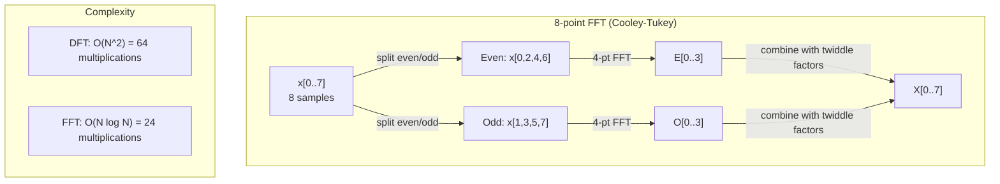
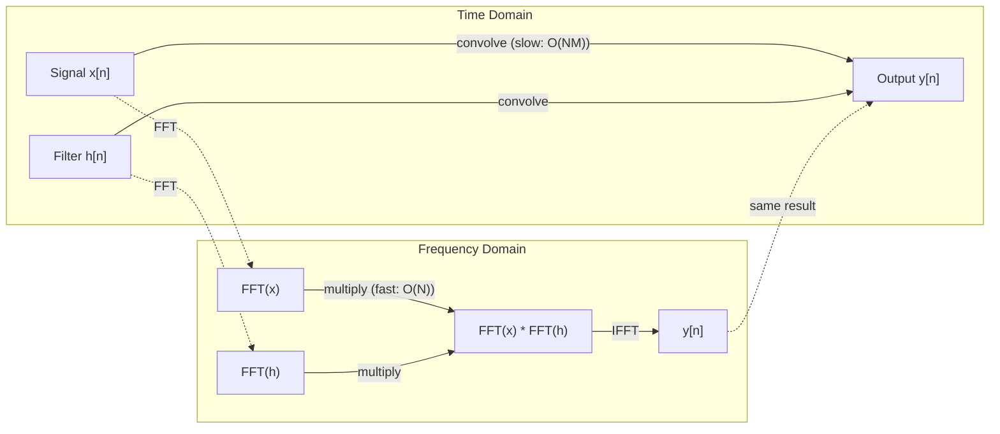

# 傅里叶变换

> 每个信号都是正弦波之和。傅里叶变换告诉你具体是哪些正弦波。

**Type:** Build
**Language:** Python
**Prerequisites:** Phase 1, Lessons 01-04, 19（复数）
**Time:** 约 90 分钟

## 学习目标

- 从零实现 DFT，并用 O(N log N) 的 Cooley-Tukey FFT 验证其正确性
- 解读频率系数：从信号中提取幅度、相位和功率谱
- 应用卷积定理，通过 FFT 乘法执行卷积
- 将傅里叶频率分解与 Transformer 位置编码和 CNN 卷积层联系起来

## 问题

一段录音是随时间变化的压力测量序列。股票价格是随天数变化的数值序列。图像是空间上的像素强度网格。这些都是时域（或空域）中的数据——你看到的是随某个索引变化的值。

但许多模式在时域中是不可见的。这段音频信号是纯音还是和弦？这只股票价格是否存在周周期？这张图像是否有重复纹理？这些问题都关于频率内容，而时域将其隐藏了。

傅里叶变换将数据从时域转换到频域。它接收一个信号，并将其分解为不同频率的正弦波。每个正弦波都有一个幅度（强度多大）和一个相位（从哪里开始）。傅里叶变换同时告诉你这两者。

这对机器学习很重要，因为频域思维无处不在。卷积神经网络执行卷积，而卷积在频域中就是乘法。Transformer 位置编码使用频率分解来表示位置。音频模型（语音识别、音乐生成）基于频谱图工作——即声音的频率表示。时间序列模型寻找周期性模式。理解傅里叶变换能让你具备处理所有这些任务的词汇。

## 概念

### DFT 的定义

给定 N 个样本 x[0], x[1], ..., x[N-1]，离散傅里叶变换产生 N 个频率系数 X[0], X[1], ..., X[N-1]：

```
X[k] = sum_{n=0}^{N-1} x[n] * e^(-2*pi*i*k*n/N)

for k = 0, 1, ..., N-1
```

每个 X[k] 是一个复数。其模 |X[k]| 告诉你频率 k 的幅度。其相位 angle(X[k]) 告诉你该频率的相位偏移。

关键洞察：`e^(-2*pi*i*k*n/N)` 是一个以频率 k 旋转的相量。DFT 计算信号与 N 个等间距频率中每一个的相关性。如果信号在频率 k 处含有能量，相关性就大；否则接近零。

### 每个系数的含义

**X[0]：直流分量。** 这是所有样本之和——与均值成比例。它表示信号的常数（零频率）偏移。

```
X[0] = sum_{n=0}^{N-1} x[n] * e^0 = sum of all samples
```

**X[k]，其中 1 <= k <= N/2：正频率。** X[k] 表示每 N 个样本 k 个周期的频率。k 越大，频率越高（振荡越快）。

**X[N/2]：奈奎斯特频率。** 这是 N 个样本所能表示的最高频率。超过此频率会出现混叠——高频伪装成低频。

**X[k]，其中 N/2 < k < N：负频率。** 对于实值信号，X[N-k] = conj(X[k])。负频率是正频率的镜像。这就是为什么有用信息位于前 N/2 + 1 个系数中。

### 逆 DFT

逆 DFT 从频率系数重建原始信号：

```
x[n] = (1/N) * sum_{k=0}^{N-1} X[k] * e^(2*pi*i*k*n/N)

for n = 0, 1, ..., N-1
```

与正向 DFT 的唯一区别：指数中的符号为正（而非负），且有一个 1/N 的归一化因子。

逆 DFT 是完美重建。没有任何信息丢失。你可以从时域到频域再回来，没有任何误差。DFT 是一次基变换——它用不同的坐标系重新表达同样的信息。

### FFT：让它变快

如上定义的 DFT 是 O(N^2) 的：对于 N 个输出系数中的每一个，都要对 N 个输入样本求和。当 N = 100 万时，那是 10^12 次运算。

快速傅里叶变换（FFT）以 O(N log N) 计算出相同的结果。当 N = 100 万时，那是约 2000 万次运算，而不是一万亿次。这正是频率分析得以实用的原因。

Cooley-Tukey 算法（最常见的 FFT）采用分治法：

1. 将信号拆分为偶数索引和奇数索引的样本。
2. 递归地计算每一半的 DFT。
3. 使用旋转因子 e^(-2*pi*i*k/N) 合并两个半尺寸的 DFT。

```
X[k] = E[k] + e^(-2*pi*i*k/N) * O[k]          for k = 0, ..., N/2 - 1
X[k + N/2] = E[k] - e^(-2*pi*i*k/N) * O[k]    for k = 0, ..., N/2 - 1

where E = DFT of even-indexed samples
      O = DFT of odd-indexed samples
```

这种对称性意味着每一层递归做 O(N) 的工作，共有 log2(N) 层。总计：O(N log N)。



FFT 要求信号长度为 2 的幂。实践中，信号会被零填充到下一个 2 的幂。

### 谱分析

**功率谱**是 |X[k]|^2——每个频率系数的模的平方。它显示每个频率处有多少能量。

**相位谱**是 angle(X[k])——每个频率的相位偏移。对于大多数分析任务，你只关心功率谱而忽略相位。

```
Power at frequency k:  P[k] = |X[k]|^2 = X[k].real^2 + X[k].imag^2
Phase at frequency k:  phi[k] = atan2(X[k].imag, X[k].real)
```

### 频率分辨率

DFT 的频率分辨率取决于样本数 N 和采样率 fs。

```
Frequency of bin k:      f_k = k * fs / N
Frequency resolution:    delta_f = fs / N
Maximum frequency:       f_max = fs / 2  (Nyquist)
```

要分辨两个相近的频率，需要更多样本。要捕获高频，需要更高的采样率。

### 卷积定理

这是信号处理中最重要的结果之一，并且与 CNN 直接相关。

**时域中的卷积等于频域中的逐点乘法。**

```
x * h = IFFT(FFT(x) . FFT(h))

where * is convolution and . is element-wise multiplication
```

这为什么重要：

- 对长度为 N 和 M 的两个信号做直接卷积需要 O(N*M) 次运算。
- 基于 FFT 的卷积只需 O(N log N)：变换两者，相乘，再逆变换回来。
- 对于大卷积核，FFT 卷积要快得多。
- 这正是具有大感受野的卷积层中发生的事情。

注意：DFT 计算的是循环卷积（信号环绕）。对于线性卷积（无环绕），在计算前将两个信号零填充到长度 N + M - 1。



### 加窗

DFT 假设信号是周期的——它将 N 个样本视为无限重复信号的一个周期。如果信号的首尾值不同，就会在边界处产生不连续，表现为虚假的高频内容。这被称为频谱泄漏。

加窗通过在计算 DFT 之前将信号两端渐变到零来减少泄漏。

常见窗函数：

| 窗函数 | 形状 | 主瓣宽度 | 旁瓣电平 | 使用场景 |
|--------|-------|----------------|-----------------|----------|
| 矩形窗 | 平坦（无窗） | 最窄 | 最高（-13 dB） | 信号在 N 个样本内恰好为周期时 |
| Hann 窗 | 升余弦 | 中等 | 低（-31 dB） | 通用谱分析 |
| Hamming 窗 | 改进余弦 | 中等 | 更低（-42 dB） | 音频处理、语音分析 |
| Blackman 窗 | 三阶余弦 | 宽 | 极低（-58 dB） | 旁瓣抑制至关重要时 |

```
Hann window:    w[n] = 0.5 * (1 - cos(2*pi*n / (N-1)))
Hamming window: w[n] = 0.54 - 0.46 * cos(2*pi*n / (N-1))
```

在 DFT 之前将窗函数与信号逐元素相乘来应用它：`X = DFT(x * w)`。

### DFT 的性质

| 性质 | 时域 | 频域 |
|----------|-------------|-----------------|
| 线性 | a*x + b*y | a*X + b*Y |
| 时移 | x[n - k] | X[f] * e^(-2*pi*i*f*k/N) |
| 频移 | x[n] * e^(2*pi*i*f0*n/N) | X[f - f0] |
| 卷积 | x * h | X * H（逐点） |
| 乘法 | x * h（逐点） | X * H（循环卷积，缩放 1/N） |
| Parseval 定理 | sum \|x[n]\|^2 | (1/N) * sum \|X[k]\|^2 |
| 共轭对称（实输入） | x[n] 实数 | X[k] = conj(X[N-k]) |

Parseval 定理表明总能量在两个域中相同。能量在变换中是守恒的。

### 与位置编码的联系

原始 Transformer 使用正弦位置编码：

```
PE(pos, 2i)   = sin(pos / 10000^(2i/d_model))
PE(pos, 2i+1) = cos(pos / 10000^(2i/d_model))
```

每一对维度 (2i, 2i+1) 以不同频率振荡。频率从高（维度 0,1）到低（最后几个维度）呈几何间隔。这使每个位置在所有频带上都有独特的模式——类似于傅里叶系数唯一地标识一个信号。

由此获得的关键性质：

- **唯一性：** 任意两个位置的编码都不同。
- **有界取值：** sin 和 cos 始终在 [-1, 1] 内。
- **相对位置：** 位置 p+k 的编码可以表示为位置 p 处编码的线性函数。模型可以学会关注相对位置。

### 与 CNN 的联系

卷积层通过在信号或图像上滑动一个学习到的滤波器（卷积核）来处理输入。数学上，这就是卷积操作。

根据卷积定理，这等价于：
1. 对输入做 FFT
2. 对卷积核做 FFT
3. 在频域中相乘
4. 对结果做 IFFT

标准 CNN 实现使用直接卷积（对于小的 3x3 卷积核更快）。但对于大卷积核或全局卷积，基于 FFT 的方法明显更快。一些架构（如 FNet）完全用 FFT 替代注意力，以 O(N log N) 而非 O(N^2) 的复杂度取得了有竞争力的准确率。

### 频谱图与短时傅里叶变换

单次 FFT 给你整个信号的频率内容，但不告诉你这些频率何时出现。线性调频信号（频率随时间增加的信号）和和弦（所有频率同时存在）可以有相同的幅度谱。

短时傅里叶变换（STFT）通过在信号的重叠窗口上计算 FFT 来解决这个问题。其结果是频谱图：一个二维表示，一个轴是时间，另一个轴是频率。每个点的强度显示该时刻该频率处的能量。

```
STFT procedure:
1. Choose a window size (e.g., 1024 samples)
2. Choose a hop size (e.g., 256 samples -- 75% overlap)
3. For each window position:
   a. Extract the windowed segment
   b. Apply a Hann/Hamming window
   c. Compute FFT
   d. Store the magnitude spectrum as one column of the spectrogram
```

频谱图是音频机器学习模型的标准输入表示。语音识别模型（Whisper、DeepSpeech）基于梅尔频谱图工作——即将频率映射到梅尔尺度（更符合人耳音高感知）的频谱图。

### 混叠

如果信号包含高于 fs/2（奈奎斯特频率）的频率，以 fs 的速率采样会产生混叠副本。一个 90 Hz 的信号以 100 Hz 采样后，看起来与一个 10 Hz 的信号完全相同。仅凭样本无法区分它们。

```
Example:
  True signal: 90 Hz sine wave
  Sampling rate: 100 Hz
  Apparent frequency: 100 - 90 = 10 Hz

  The samples from the 90 Hz signal at 100 Hz sampling rate
  are identical to the samples from a 10 Hz signal.
  No amount of math can recover the original 90 Hz.
```

这就是为什么模数转换器包含抗混叠滤波器，在采样之前去除高于奈奎斯特频率的成分。在机器学习中，当对特征图下采样而没有适当的低通滤波时会出现混叠——一些架构使用抗混叠池化层来解决这个问题。

### 零填充不会提高分辨率

一个常见误解：在 FFT 前对信号做零填充可以提高频率分辨率。事实并非如此。零填充是在现有的频率仓之间插值，让你得到看起来更平滑的频谱。但它无法揭示原始样本中不存在的频率细节。

真正的频率分辨率只取决于观测时间 T = N / fs。要分辨相距 delta_f 的两个频率，你至少需要 T = 1 / delta_f 秒的数据。再多的零填充也无法改变这一基本限制。

```figure
fourier-synthesis
```

## 动手实现

### 步骤 1：从零实现 DFT

O(N^2) 的 DFT 直接遵循定义。

```python
import math

class Complex:
    ...

def dft(x):
    N = len(x)
    result = []
    for k in range(N):
        total = Complex(0, 0)
        for n in range(N):
            angle = -2 * math.pi * k * n / N
            w = Complex(math.cos(angle), math.sin(angle))
            xn = x[n] if isinstance(x[n], Complex) else Complex(x[n])
            total = total + xn * w
        result.append(total)
    return result
```

### 步骤 2：逆 DFT

结构相同，指数为正，除以 N。

```python
def idft(X):
    N = len(X)
    result = []
    for n in range(N):
        total = Complex(0, 0)
        for k in range(N):
            angle = 2 * math.pi * k * n / N
            w = Complex(math.cos(angle), math.sin(angle))
            total = total + X[k] * w
        result.append(Complex(total.real / N, total.imag / N))
    return result
```

### 步骤 3：FFT（Cooley-Tukey）

递归 FFT 要求长度为 2 的幂。拆分为偶数和奇数部分，递归，再用旋转因子合并。

```python
def fft(x):
    N = len(x)
    if N <= 1:
        return [x[0] if isinstance(x[0], Complex) else Complex(x[0])]
    if N % 2 != 0:
        return dft(x)

    even = fft([x[i] for i in range(0, N, 2)])
    odd = fft([x[i] for i in range(1, N, 2)])

    result = [Complex(0)] * N
    for k in range(N // 2):
        angle = -2 * math.pi * k / N
        twiddle = Complex(math.cos(angle), math.sin(angle))
        t = twiddle * odd[k]
        result[k] = even[k] + t
        result[k + N // 2] = even[k] - t
    return result
```

### 步骤 4：谱分析辅助函数

```python
def power_spectrum(X):
    return [xk.real ** 2 + xk.imag ** 2 for xk in X]

def convolve_fft(x, h):
    N = len(x) + len(h) - 1
    padded_N = 1
    while padded_N < N:
        padded_N *= 2

    x_padded = x + [0.0] * (padded_N - len(x))
    h_padded = h + [0.0] * (padded_N - len(h))

    X = fft(x_padded)
    H = fft(h_padded)

    Y = [xk * hk for xk, hk in zip(X, H)]

    y = idft(Y)
    return [y[n].real for n in range(N)]
```

## 使用它

实际工作中，请使用 numpy 的 FFT，它由高度优化的 C 库支撑。

```python
import numpy as np

signal = np.sin(2 * np.pi * 5 * np.arange(256) / 256)
spectrum = np.fft.fft(signal)
freqs = np.fft.fftfreq(256, d=1/256)

power = np.abs(spectrum) ** 2

positive_freqs = freqs[:len(freqs)//2]
positive_power = power[:len(power)//2]
```

用于加窗和更高级的谱分析：

```python
from scipy.signal import windows, stft

window = windows.hann(256)
windowed = signal * window
spectrum = np.fft.fft(windowed)
```

用于卷积：

```python
from scipy.signal import fftconvolve

result = fftconvolve(signal, kernel, mode='full')
```

用于频谱图：

```python
from scipy.signal import stft

frequencies, times, Zxx = stft(signal, fs=sample_rate, nperseg=256)
spectrogram = np.abs(Zxx) ** 2
```

频谱图矩阵的形状为 (n_frequencies, n_time_frames)。每一列是一个时间窗口的功率谱。这正是音频机器学习模型作为输入所消费的内容。

## 交付

运行 `code/fourier.py` 以生成 `outputs/prompt-spectral-analyzer.md`。

## 练习

1. **纯音识别。** 创建一个包含未知频率（介于 1 到 50 Hz 之间）单个正弦波的信号，以 128 Hz 采样 1 秒。用你的 DFT 识别该频率，并验证答案一致。然后加入标准差为 0.5 的高斯噪声并重复。噪声如何影响频谱？

2. **FFT 与 DFT 验证。** 生成长度为 64 的随机信号。分别计算 DFT（O(N^2)）和 FFT。验证所有系数在 1e-10 内一致。在长度为 256、512、1024 和 2048 的信号上对两个函数计时。绘制 DFT 时间与 FFT 时间之比的曲线。

3. **用实例证明卷积定理。** 创建信号 x = [1, 2, 3, 4, 0, 0, 0, 0] 和滤波器 h = [1, 1, 1, 0, 0, 0, 0, 0]。直接用嵌套循环计算它们的循环卷积。然后通过 FFT（变换、相乘、逆变换）计算它。验证两个结果一致。然后通过适当的零填充做线性卷积。

4. **加窗效果。** 创建一个由 10 Hz 和 12 Hz（非常接近）两个正弦波之和组成的信号。以 128 Hz 采样 1 秒。分别不使用窗、使用 Hann 窗和 Hamming 窗计算功率谱。哪种窗最容易区分两个峰？为什么？

5. **位置编码分析。** 生成 d_model = 128、max_pos = 512 的正弦位置编码。对每一对位置 (p1, p2)，计算其编码的点积。证明点积只取决于 |p1 - p2|，而不取决于绝对位置。随着距离增大，点积会发生什么变化？

## 关键术语

| 术语 | 含义 |
|------|---------------|
| DFT（离散傅里叶变换） | 将 N 个时域样本转换为 N 个频域系数。每个系数是与该频率复正弦的相关性 |
| FFT（快速傅里叶变换） | 一种计算 DFT 的 O(N log N) 算法。Cooley-Tukey 算法递归地拆分偶数/奇数索引 |
| 逆 DFT | 从频率系数重建时域信号。公式与 DFT 相同，但指数符号相反并带 1/N 缩放 |
| 频率仓 | DFT 输出中的每个索引 k 表示频率 k*fs/N Hz。“仓”即离散的频率槽位 |
| 直流分量 | X[0]，零频率系数。与信号均值成比例 |
| 奈奎斯特频率 | fs/2，采样率 fs 下可表示的最高频率。高于此频率会发生混叠 |
| 功率谱 | \|X[k]\|^2，每个频率系数的模的平方。显示能量在各频率上的分布 |
| 相位谱 | angle(X[k])，每个频率分量的相位偏移。在分析中通常被忽略 |
| 频谱泄漏 | 将非周期信号视为周期信号导致的虚假频率内容。可通过加窗减少 |
| 窗函数 | 在 DFT 之前应用的渐变函数（Hann、Hamming、Blackman），用于减少频谱泄漏 |
| 旋转因子 | 用于在 FFT 蝶形运算中合并子 DFT 的复指数 e^(-2*pi*i*k/N) |
| 卷积定理 | 时域卷积等于频域逐点乘法。信号处理和 CNN 的基础 |
| 循环卷积 | 信号发生环绕的卷积。这是 DFT 自然计算的内容 |
| 线性卷积 | 无环绕的标准卷积。通过在 DFT 前做零填充实现 |
| Parseval 定理 | 总能量在傅里叶变换中保持不变。sum \|x[n]\|^2 = (1/N) sum \|X[k]\|^2 |
| 混叠 | 由于采样率不足，高于奈奎斯特频率的成分表现为较低的频率 |

## 延伸阅读

- [Cooley & Tukey: An Algorithm for the Machine Calculation of Complex Fourier Series (1965)](https://www.ams.org/journals/mcom/1965-19-090/S0025-5718-1965-0178586-1/) - 改变计算格局的原始 FFT 论文
- [3Blue1Brown: But what is the Fourier Transform?](https://www.youtube.com/watch?v=spUNpyF58BY) - 最佳的傅里叶变换可视化入门
- [Lee-Thorp et al.: FNet: Mixing Tokens with Fourier Transforms (2021)](https://arxiv.org/abs/2105.03824) - 在 Transformer 中用 FFT 替代自注意力
- [Smith: The Scientist and Engineer's Guide to Digital Signal Processing](http://www.dspguide.com/) - 免费在线教科书，深入讲解 FFT、加窗和谱分析
- [Vaswani et al.: Attention Is All You Need (2017)](https://arxiv.org/abs/1706.03762) - 源自傅里叶频率分解的正弦位置编码
- [Radford et al.: Whisper (2022)](https://arxiv.org/abs/2212.04356) - 使用梅尔频谱图作为输入表示的语音识别