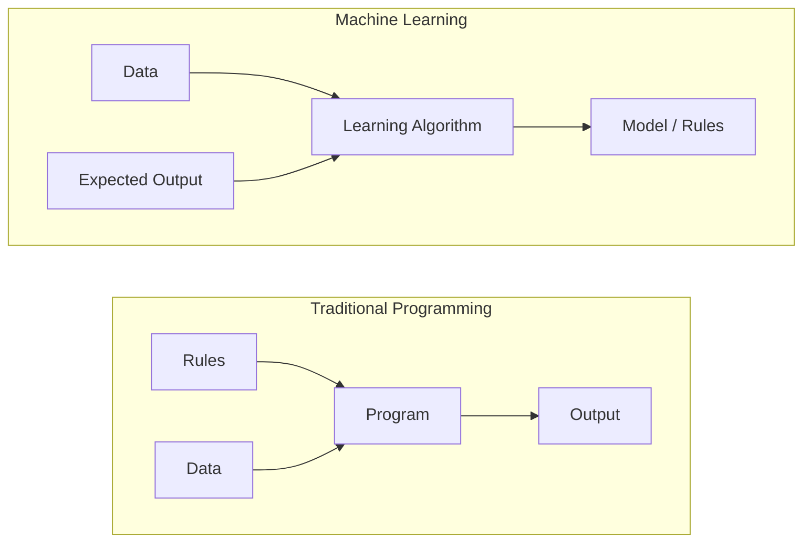
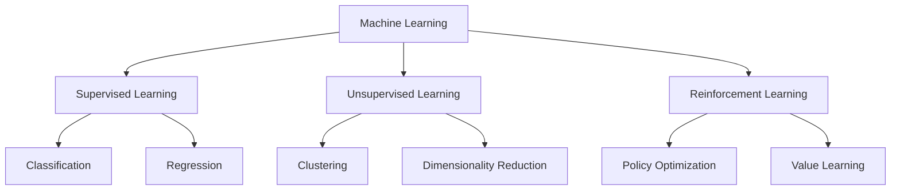
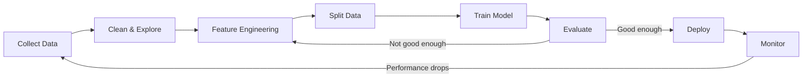
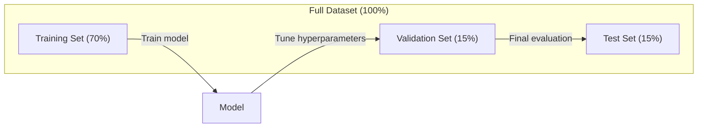
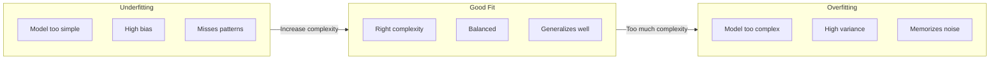
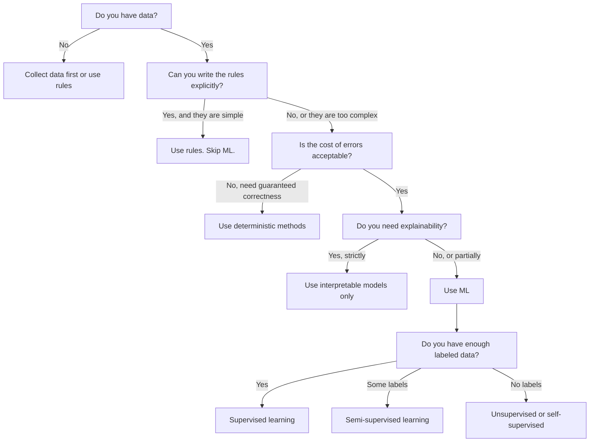

# 什么是机器学习

> 机器学习是让计算机从数据中发现模式，而不是手工编写规则。

**Type:** Learn
**Languages:** Python
**Prerequisites:** 阶段 1(数学基础)
**Time:** 约 45 分钟

## 学习目标

- 解释监督学习、无监督学习和强化学习之间的区别，并判断给定问题属于哪种类型
- 从零实现最近质心分类器，并将其与随机基线进行对比评估
- 区分分类任务和回归任务，并为每种任务选择合适的损失函数
- 评估某个业务问题是否适合用机器学习解决，还是用确定性规则更好

## 问题

假设你想构建一个垃圾邮件过滤器。传统做法是：坐下来编写数百条规则。“如果邮件包含 'FREE MONEY',标记为垃圾邮件。如果感叹号超过 3 个，标记为垃圾邮件。”你花几周时间编写规则。然后垃圾邮件发送者改变了措辞，你的规则失效了。你编写更多规则，这个循环永无止境。

机器学习颠覆了这一模式。你不再编写规则，而是给计算机成千上万封带标签的邮件(“垃圾邮件”或“非垃圾邮件”)，让它自己找出规则。计算机会发现你从未想过的模式。当垃圾邮件发送者改变策略时，你只需在新数据上重新训练，而不是重写代码。

这种从“编写规则”到“从数据中学习”的转变，正是机器学习的核心。每个推荐引擎、语音助手、自动驾驶汽车和语言模型都是这样工作的。

## 概念

### 从数据中学习，而非规则

传统编程和机器学习以相反的方向解决问题。



传统编程：你编写规则。程序将这些规则应用于数据以产生输出。

机器学习：你提供数据和预期输出。算法自己发现规则。

训练得到的“模型”就是规则本身，只不过以数字(权重、参数)的形式编码。它从见过的样本中泛化，对从未见过的数据做出预测。

### 机器学习的三大类型



**监督学习**：你拥有输入-输出对。模型学习将输入映射到输出。
- “这里有 10,000 张标注为猫或狗的照片。学会区分它们。”
- “这里有房屋特征和价格。学会预测价格。”

**无监督学习**：你只有输入，没有标签。模型自行发现结构。
- “这里有 10,000 条客户购买历史。找出自然分组。”
- “这里有 1,000 维的数据点。在保留结构的前提下降至 2 维。”

**强化学习**：智能体在环境中采取行动，并获得奖励或惩罚。它学习一种策略以最大化总奖励。
- “玩这个游戏。赢了 +1,输了 -1。想出策略。”
- “控制这个机械臂。抓取到物体 +1,每浪费一秒 -0.01。”

实践中你构建的大部分内容都使用监督学习。无监督学习常用于预处理和探索。强化学习支撑着游戏 AI、机器人技术以及语言模型的 RLHF。

### 三大类型之外

上述三个类别划分清晰，但现实中的机器学习常常模糊了这些界限。

**半监督学习**使用少量有标签数据和大量无标签数据。你可能只有 100 张有标签的医学图像和 100,000 张无标签图像。相关技术包括：

- **标签传播：** 构建一个连接相似数据点的图。标签通过图从有标签节点传播到无标签的邻居。
- **伪标签：** 在有标签数据上训练模型，用它为无标签数据预测标签，然后在全部数据上重新训练。模型自举出自己的训练集。
- **一致性正则化：** 模型对输入和其轻微扰动的版本应给出相同的预测。即使没有标签也能起作用。

**自监督学习**从数据本身创造监督信号，完全不需要人工标注。模型从数据结构中创建自己的预测任务。

- **掩码语言建模(BERT):** 遮住句子中 15% 的词，训练模型预测缺失的词。“标签”来自原始文本。
- **对比学习(SimCLR):** 取一张图像，创建两个增强版本。训练模型识别它们来自同一张图像，同时与其他图像的增强版本区分开。
- **下一词元预测(GPT):** 给定所有先前的词，预测下一个词。每篇文本文档都成为一个训练样本。

这些并不是独立于三大类型之外的类别，而是结合监督和无监督思想的策略。自监督学习在技术上属于监督学习(模型在预测某个东西)，但标签是自动生成的，而非人工标注。

### 分类 vs 回归

这是两种主要的监督学习任务。

| 方面 | 分类 | 回归 |
|--------|---------------|------------|
| 输出 | 离散类别 | 连续数值 |
| 例子 | “这封邮件是垃圾邮件吗？” | “房价会是多少？” |
| 输出空间 | {cat, dog, bird} | 任意实数 |
| 损失函数 | 交叉熵、准确率 | 均方误差、MAE |
| 决策 | 类别之间的边界 | 拟合数据的曲线 |

分类回答“属于哪个类别？",回归回答“是多少？"

有些问题可以用两种方式表述。预测股票涨跌是分类，预测精确价格是回归。

### 机器学习工作流

每个机器学习项目都遵循相同的流程，与算法无关。



**收集数据**：获取原始数据。数据越多几乎总是越好，但质量比数量更重要。

**清洗与探索**：处理缺失值、去除重复项、可视化分布、发现异常。这一步通常占总项目时间的 60-80%。

**特征工程**：将原始数据转换为模型可用的特征。把日期转换为星期几。对数值列归一化。对分类变量编码。好的特征比花哨的算法更重要。

**划分数据**：划分为训练集、验证集和测试集。模型在训练数据上训练，你在验证数据上调整超参数，并在测试数据上报告最终性能。

**训练模型**：将训练数据输入算法。算法调整内部参数以最小化损失函数。

**评估**：在验证/测试数据上衡量性能。如果性能不达标，回头尝试不同的特征、算法或超参数。

**部署**：将模型投入生产环境，对新数据进行预测。

**监控**：持续跟踪性能。数据分布会变化(数据漂移)，模型会退化。性能下降时重新训练。

### 训练集、验证集和测试集划分

这是初学者最容易搞错的重要概念。你必须在与训练时从未见过的数据上评估模型。否则你衡量的是记忆，而不是学习。



| 划分 | 用途 | 使用时机 | 典型比例 |
|-------|---------|-----------|-------------|
| 训练集 | 模型从此数据中学习 | 训练期间 | 60-80% |
| 验证集 | 调整超参数、比较模型 | 每次训练之后 | 10-20% |
| 测试集 | 最终无偏的性能估计 | 仅一次，在最后 | 10-20% |

测试集是神圣的。你只能看它一次。如果你不断根据测试集表现调整模型，实际上就是在测试集上训练，你报告的数字就毫无意义。

对于小数据集，使用 k 折交叉验证：将数据分成 k 份，在 k-1 份上训练，在剩余一份上验证，轮换进行，最后取平均结果。

### 过拟合 vs 欠拟合



**欠拟合**：模型过于简单，无法捕捉数据中的模式。就像用直线拟合曲线关系。训练误差高，测试误差高。

**过拟合**：模型过于复杂，记住了训练数据(包括其中的噪声)。就像一条穿过每个训练点但对新数据失效的扭曲曲线。训练误差低，测试误差高。

**良好拟合**：模型捕捉了真实模式而不记忆噪声。训练误差和测试误差都相当低。

过拟合的迹象：
- 训练准确率远高于验证准确率
- 模型在训练数据上表现良好，但在新数据上表现不佳
- 增加训练数据能提升性能(说明模型之前在记忆而非学习)

过拟合的解决方法：
- 获取更多训练数据
- 降低模型复杂度(更少的参数、更简单的架构)
- 正则化(对大权重施加惩罚)
- Dropout(训练期间随机将神经元置零)
- 早停(当验证误差开始上升时停止训练)

欠拟合的解决方法：
- 使用更复杂的模型
- 添加更多特征
- 减少正则化
- 训练更久

### 偏差-方差权衡

这是过拟合与欠拟合背后的数学框架。

**偏差**：来自模型错误假设的误差。当真实关系是非线性时，线性模型具有高偏差。高偏差导致欠拟合。

**方差**：来自对训练数据微小波动敏感性的误差。高方差的模型在不同数据子集上训练时会给出差异很大的预测。高方差导致过拟合。

| 模型复杂度 | 偏差 | 方差 | 结果 |
|-----------------|------|----------|--------|
| 过低(用线性模型拟合曲线数据) | 高 | 低 | 欠拟合 |
| 恰到好处 | 中 | 中 | 良好泛化 |
| 过高(用 20 次多项式拟合 10 个点) | 低 | 高 | 过拟合 |

总误差 = 偏差^2 + 方差 + 不可约噪声

你无法降低不可约噪声(它是数据本身的随机性)。你要找到偏差^2 + 方差最小化的最佳平衡点。

### 没有免费午餐定理

没有任何单一算法在所有问题上都表现最佳。在一类问题上表现好的算法，在另一类问题上会表现不佳。这就是为什么数据科学家会尝试多种算法并比较结果。

实践中，算法的选择取决于：
- 你有多少数据
- 特征有多少
- 关系是线性还是非线性
- 是否需要可解释性
- 你能负担多少计算资源

### 何时不该使用机器学习

机器学习很强大，但并非总是合适的工具。在求助于模型之前，先问问自己是否真的需要它。

**以下情况不要使用机器学习：**

- **规则简单且定义明确。** 税务计算、排序算法、单位换算。如果你能用几条 if 语句写出逻辑，引入模型只会增加复杂性而没有收益。
- **你没有数据或数据极少。** 机器学习需要样本才能学习。只有 10 个数据点，你无法训练出任何有意义的东西。先收集数据。
- **出错的代价是灾难性的，且需要保证正确性。** 医疗剂量计算、核反应堆控制、密码学验证。机器学习模型是概率性的，有时会出错。如果“偶尔出错”不可接受，请使用确定性方法。
- **查找表或启发式方法就能解决问题。** 如果一个简单阈值或表能覆盖 99% 的情况，加入机器学习只会增加维护成本而没有实质性改进。
- **决策无法解释，而可解释性是必需的。** 受监管的行业(信贷、保险、刑事司法)有时要求每个决策都完全可解释。有些机器学习模型是可解释的(线性回归、小型决策树)，大多数则不是。
- **问题变化的速度快于你的重新训练速度。** 如果规则每天变化而重新训练需要一周，模型永远都是过时的。

使用这个决策流程图：



```figure
f3-learning-boundary
```

## 动手实现

`code/ml_intro.py` 中的代码从零实现了一个最近质心分类器——这是最简单的机器学习算法。它演示了核心思想：从数据中学习，然后对新数据进行预测。

### 步骤 1:从零实现最近质心分类器

最近质心分类器计算训练数据中每个类别的中心(均值)。预测时，它将每个新点分配给中心最近的类别。

```python
class NearestCentroid:
    def fit(self, X, y):
        self.classes = np.unique(y)
        self.centroids = np.array([
            X[y == c].mean(axis=0) for c in self.classes
        ])

    def predict(self, X):
        distances = np.array([
            np.sqrt(((X - c) ** 2).sum(axis=1))
            for c in self.centroids
        ])
        return self.classes[distances.argmin(axis=0)]
```

这就是全部算法。Fit 计算两个均值。Predict 计算距离。没有梯度下降，没有迭代，没有超参数。

### 步骤 2:在合成数据上训练

我们生成一个包含两个略微重叠类别的二维分类数据集。质心分类器在类别中心之间画出一条线性决策边界。

```python
rng = np.random.RandomState(42)
X_class0 = rng.randn(100, 2) + np.array([1.0, 1.0])
X_class1 = rng.randn(100, 2) + np.array([-1.0, -1.0])
X = np.vstack([X_class0, X_class1])
y = np.array([0] * 100 + [1] * 100)
```

### 步骤 3:与基线比较

每个机器学习模型都应该与一个简单的基线比较。这里基线随机预测一个类别。如果你的机器学习模型打不过随机猜测，那就有问题了。

```python
baseline_preds = rng.choice([0, 1], size=len(y_test))
baseline_acc = np.mean(baseline_preds == y_test)
```

在这个干净的数据集上，质心分类器应该能达到约 90% 以上的准确率。随机基线约为 50%。

### 为什么这很重要

最近质心分类器简单至极。它没有超参数，没有迭代，没有梯度下降。然而它抓住了机器学习的基本模式：

1. 从训练数据中**学习**一个表示(质心)
2. 使用该表示对新数据进行**预测**(最近距离)
3. 与基线比较进行**评估**(随机猜测)

从逻辑回归到 Transformer 的每个机器学习算法都遵循同样的三步模式。表示会变得更复杂，但工作流保持不变。

### 步骤 4:质心分类器做不到的事

最近质心分类器假设每个类别形成一个单一的团块。它画出的是线性决策边界。它在以下情况下会失败：

- 类别有多个簇(例如，数字 "1" 有多种不同的写法)
- 决策边界是非线性的(例如，一个类别包围另一个类别)
- 特征的量纲差异很大(距离被量纲最大的特征主导)

这些局限性激发了你将要学习的所有其他算法。K 近邻能处理多个簇。决策树能处理非线性边界。特征缩放能解决量纲问题。每一课都建立在前一课的局限性之上。

## 使用它

sklearn 提供了 `NearestCentroid` 和合成数据生成器：

```python
from sklearn.neighbors import NearestCentroid
from sklearn.datasets import make_classification
from sklearn.model_selection import train_test_split

X, y = make_classification(
    n_samples=500, n_features=2, n_redundant=0,
    n_clusters_per_class=1, random_state=42
)
X_train, X_test, y_train, y_test = train_test_split(X, y, test_size=0.3)

clf = NearestCentroid()
clf.fit(X_train, y_train)
print(f"Accuracy: {clf.score(X_test, y_test):.3f}")
```

## 发布它

本课产出 `outputs/prompt-ml-problem-framer.md`——一个将模糊的业务问题转化为具体机器学习任务的提示词。给它一个问题描述(“我们想减少客户流失”或“预测下季度的需求”)，它会识别学习类型、定义预测目标、列出候选特征、选定成功指标、建立基线，并指出诸如数据泄露或类别不平衡之类的陷阱。在任何机器学习项目开始时使用它，以避免构建错误的东西。

## 关键术语

| 术语 | 人们怎么说 | 实际含义 |
|------|----------------|----------------------|
| 模型 | "那个 AI" | 一个带有可学习参数、将输入映射到输出的数学函数 |
| 训练 | "教 AI" | 运行优化算法来调整模型参数，使预测匹配已知输出 |
| 特征 | "一个输入列" | 数据的一个可测量属性，模型用它来做出预测 |
| 标签 | "答案" | 训练样本的已知输出，用于计算误差信号 |
| 超参数 | "你调节的设置" | 在训练前设置的参数，控制学习过程(学习率、层数) |
| 损失函数 | "模型错得有多离谱" | 衡量预测输出与实际输出之间差距的函数，训练过程力求将其最小化 |
| 过拟合 | "它把测试背下来了" | 模型学到了训练数据特有的噪声而非一般模式，因此在新数据上失效 |
| 欠拟合 | "它什么都没学到" | 模型过于简单，无法捕捉数据中的真实模式 |
| 泛化 | "它在没见过的数据上也行" | 模型在未参与训练的数据上做出准确预测的能力 |
| 交叉验证 | "在不同的数据块上测试" | 反复将数据划分为训练/测试折并取平均结果，从而得到更稳健的性能估计 |
| 正则化 | "让权重保持较小" | 在损失函数中加入惩罚项，抑制过于复杂的模型 |
| 数据漂移 | "世界变了" | 输入数据的统计分布随时间偏移，导致模型性能下降 |

## 练习

1. 取任意数据集(如 Iris、Titanic)。按 70/15/15 划分为训练/验证/测试集。解释为什么不应该在测试集上调整超参数。
2. 列出三个现实世界的问题。对每一个，判断它属于分类、回归还是聚类，以及属于监督学习还是无监督学习。
3. 一个模型在训练数据上获得 99% 的准确率，但在测试数据上只有 60%。诊断问题所在，并列出你会尝试的三种修复方法。

## 延伸阅读

- [An Introduction to Statistical Learning](https://www.statlearning.com/) - 免费教科书，涵盖所有经典机器学习方法并配有实际示例
- [Google 的机器学习速成课程](https://developers.google.com/machine-learning/crash-course) - 简明的机器学习概念可视化入门
- [Scikit-learn 用户指南](https://scikit-learn.org/stable/user_guide.html) - 在 Python 中实现机器学习的实用参考