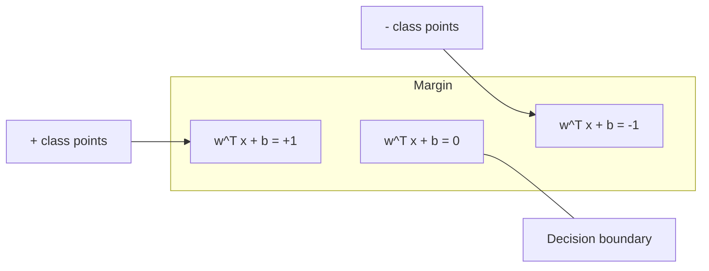
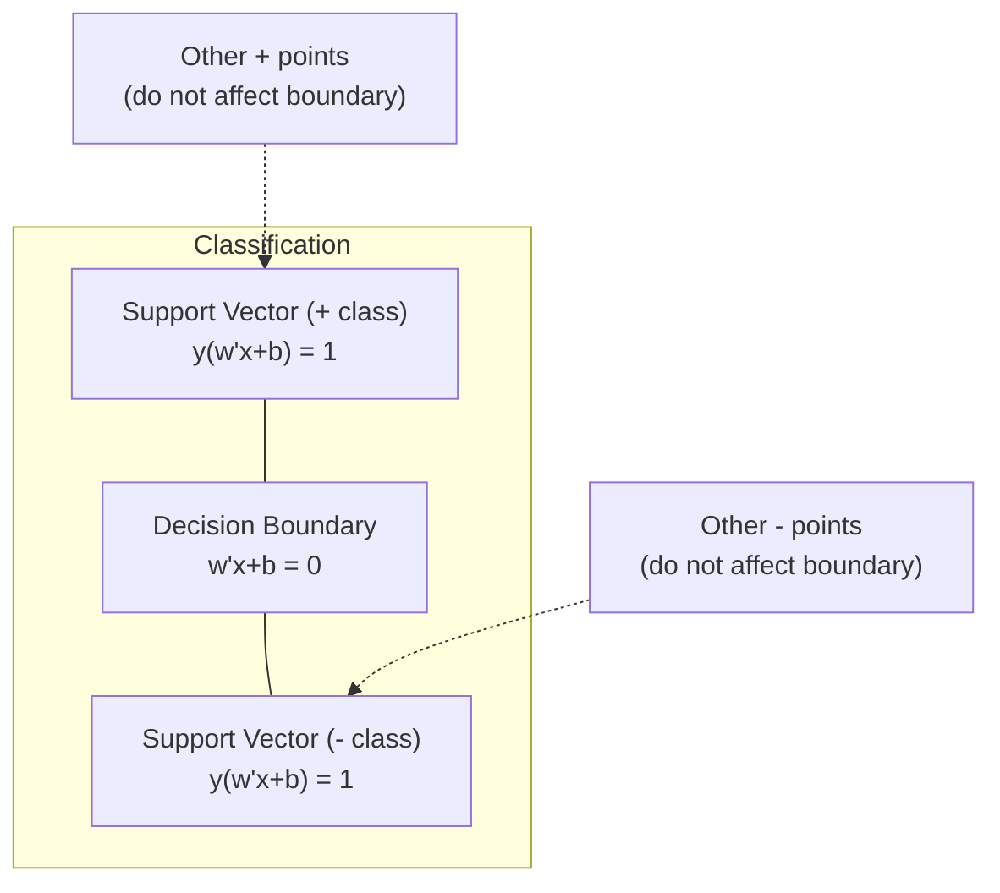
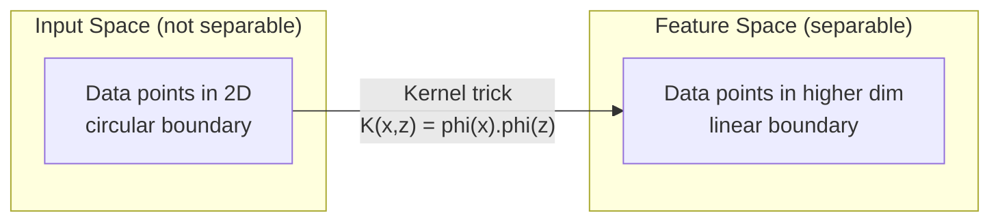

# 支持向量机

> 在两个类别之间找出最宽的街道。这就是全部思想。

**Type:** Build
**Language:** Python
**Prerequisites:** 阶段 1（第 08 课 优化、第 14 课 范数与距离、第 18 课 凸优化）
**Time:** 约 90 分钟

## 学习目标

- 从零实现线性 SVM，使用 hinge 损失和基于原始形式的梯度下降
- 解释最大间隔原理，并从训练好的模型中识别支持向量
- 比较线性、多项式和 RBF 核，解释核技巧如何避免显式的高维映射
- 评估 C 参数在间隔宽度与分类错误之间控制的权衡

## 问题

你有一份包含两个类别的数据点，需要画一条线（或超平面）将它们分开。可行的方式有无穷多种。你应该选哪一条？

间隔最大的那一条。间隔是决策边界与两侧最近数据点之间的距离。间隔越宽，分类器越有信心，对未见数据的泛化能力也越好。

这一直觉引出了支持向量机（SVM），它是机器学习中最具数学美感的算法之一。在深度学习兴起之前，SVM 曾是主流的分类方法，并且至今仍是小数据集、高维数据以及需要具有理论保证、原理清晰且易于理解的模型的问题的最佳选择。

SVM 与阶段 1 直接相关：其优化问题是凸的（第 18 课），间隔用范数来度量（第 14 课），而核技巧利用点积来处理非线性边界，而无需在高维空间中进行计算。

## 概念

### 最大间隔分类器

给定线性可分的数据，标签 y_i 属于 {-1, +1}，特征向量为 x_i，我们希望找到一个超平面 w^T x + b = 0 将两个类别分开。

点 x_i 到超平面的距离为：

```
distance = |w^T x_i + b| / ||w||
```

对于被正确分类的点：y_i * (w^T x_i + b) > 0。间隔是超平面到任一侧最近点距离的两倍。



优化问题：

```
maximize    2 / ||w||     (the margin width)
subject to  y_i * (w^T x_i + b) >= 1  for all i
```

等价形式（最小化 ||w||^2 更容易优化）：

```
minimize    (1/2) ||w||^2
subject to  y_i * (w^T x_i + b) >= 1  for all i
```

这是一个凸二次规划，具有唯一的全局解。恰好位于间隔边界上的数据点（即满足 y_i * (w^T x_i + b) = 1 的点）就是支持向量。只有它们决定了决策边界。移动或删除任何非支持向量的点，边界都不会改变。

### 支持向量：关键的少数



大多数训练点都是无关紧要的。只有支持向量才重要。这就是 SVM 在预测时内存高效的原因：你只需存储支持向量，而不需要存储整个训练集。

支持向量的数量也给出了泛化误差的一个界。相对于数据集大小，支持向量越少，泛化越好。

### 软间隔：用 C 参数处理噪声

真实数据很少是完全可分的。有些点可能位于边界的错误一侧，或落在间隔之内。软间隔形式通过引入松弛变量来允许违反。

```
minimize    (1/2) ||w||^2 + C * sum(xi_i)
subject to  y_i * (w^T x_i + b) >= 1 - xi_i
            xi_i >= 0  for all i
```

松弛变量 xi_i 度量点 i 违反间隔的程度。C 控制这一权衡：

| C 值 | 行为 |
|---------|----------|
| 大 C | 对违反施加重罚。间隔窄，误分类少。过拟合 |
| 小 C | 允许更多违反。间隔宽，误分类多。欠拟合 |

C 是反过来的正则化强度。大 C = 弱正则化。小 C = 强正则化。

### Hinge 损失：SVM 的损失函数

软间隔 SVM 可以重写为无约束优化：

```
minimize    (1/2) ||w||^2 + C * sum(max(0, 1 - y_i * (w^T x_i + b)))
```

项 max(0, 1 - y_i * f(x_i)) 就是 hinge 损失。当点被正确分类且超出间隔时，它为零。当点位于间隔之内或被误分类时，它是线性的。

```
Hinge loss for a single point:

loss
  |
  | \
  |  \
  |   \
  |    \
  |     \_______________
  |
  +-----|-----|-------->  y * f(x)
       0     1

Zero loss when y*f(x) >= 1 (correctly classified, outside margin).
Linear penalty when y*f(x) < 1.
```

与 logistic 损失（logistic 回归）对比：

```
Hinge:     max(0, 1 - y*f(x))          Hard cutoff at margin
Logistic:  log(1 + exp(-y*f(x)))        Smooth, never exactly zero
```

Hinge 损失产生稀疏解（只有支持向量有非零贡献）。Logistic 损失使用所有数据点。这使得 SVM 在预测时更节省内存。

### 用梯度下降训练线性 SVM

你可以在 hinge 损失加 L2 正则化上使用梯度下降来训练线性 SVM，而无需求解带约束的 QP：

```
L(w, b) = (lambda/2) * ||w||^2 + (1/n) * sum(max(0, 1 - y_i * (w^T x_i + b)))

Gradient with respect to w:
  If y_i * (w^T x_i + b) >= 1:  dL/dw = lambda * w
  If y_i * (w^T x_i + b) < 1:   dL/dw = lambda * w - y_i * x_i

Gradient with respect to b:
  If y_i * (w^T x_i + b) >= 1:  dL/db = 0
  If y_i * (w^T x_i + b) < 1:   dL/db = -y_i
```

这称为原始形式。每个 epoch 的复杂度为 O(n * d)，其中 n 是样本数，d 是特征数。对于大型、稀疏、高维数据（文本分类），这非常快。

### 对偶形式与核技巧

SVM 问题的拉格朗日对偶（来自阶段 1 第 18 课的 KKT 条件）为：

```
maximize    sum(alpha_i) - (1/2) * sum_ij(alpha_i * alpha_j * y_i * y_j * (x_i . x_j))
subject to  0 <= alpha_i <= C
            sum(alpha_i * y_i) = 0
```

对偶形式只涉及数据点之间的点积 x_i . x_j。这是关键的洞见。将每个点积替换为核函数 K(x_i, x_j)，SVM 就能学习非线性边界，而无需显式计算变换。

```
Linear kernel:      K(x, z) = x . z
Polynomial kernel:  K(x, z) = (x . z + c)^d
RBF (Gaussian):     K(x, z) = exp(-gamma * ||x - z||^2)
```

RBF 核将数据映射到无限维空间。在输入空间中接近的点，其核值接近 1。相距很远的点，其核值接近 0。它可以学习任意平滑的决策边界。



核技巧在高维空间中计算点积，而无须真正进入那个空间。对于 D 维空间中次数为 d 的多项式核，显式特征空间有 O(D^d) 维。但 K(x, z) 只需 O(D) 时间即可计算。

### 用于回归的 SVM（SVR）

支持向量回归在数据周围拟合一个宽度为 epsilon 的管道。管道内的点损失为零。管道外的点受到线性惩罚。

```
minimize    (1/2) ||w||^2 + C * sum(xi_i + xi_i*)
subject to  y_i - (w^T x_i + b) <= epsilon + xi_i
            (w^T x_i + b) - y_i <= epsilon + xi_i*
            xi_i, xi_i* >= 0
```

参数 epsilon 控制管道宽度。更宽的管道 = 更少支持向量 = 更平滑的拟合。更窄的管道 = 更多支持向量 = 更紧的拟合。

### 为什么 SVM 输给了深度学习（以及它们何时仍然胜出）

SVM 从 20 世纪 90 年代末到 2010 年代初一直主导着机器学习。深度学习超越它们有几个原因：

| 因素 | SVM | 深度学习 |
|--------|------|---------------|
| 特征工程 | 需要人工设计 | 自动学习特征 |
| 可扩展性 | 核方法为 O(n^2) 到 O(n^3) | 使用 SGD 时每 epoch 为 O(n) |
| 图像/文本/音频 | 需要手工特征 | 从原始数据中学习 |
| 大数据集（>100k） | 慢 | 扩展性良好 |
| GPU 加速 | 收益有限 | 大幅提速 |

SVM 在以下情况下仍然胜出：
- 小数据集（数百到数千个样本）
- 高维稀疏数据（使用 TF-IDF 特征的文本）
- 需要数学保证时（间隔界）
- 训练时间必须极短时（线性 SVM 非常快）
- 具有清晰间隔结构的二分类
- 异常检测（单类 SVM）

```figure
svm-margin
```

## 动手实现

### 步骤 1：Hinge 损失与梯度

基础部分。计算一个批次的 hinge 损失及其梯度。

```python
def hinge_loss(X, y, w, b):
    n = len(X)
    total_loss = 0.0
    for i in range(n):
        margin = y[i] * (dot(w, X[i]) + b)
        total_loss += max(0.0, 1.0 - margin)
    return total_loss / n
```

### 步骤 2：用梯度下降训练线性 SVM

通过最小化带正则化的 hinge 损失来训练。无需 QP 求解器。

```python
class LinearSVM:
    def __init__(self, lr=0.001, lambda_param=0.01, n_epochs=1000):
        self.lr = lr
        self.lambda_param = lambda_param
        self.n_epochs = n_epochs
        self.w = None
        self.b = 0.0

    def fit(self, X, y):
        n_features = len(X[0])
        self.w = [0.0] * n_features
        self.b = 0.0

        for epoch in range(self.n_epochs):
            for i in range(len(X)):
                margin = y[i] * (dot(self.w, X[i]) + self.b)
                if margin >= 1:
                    self.w = [wj - self.lr * self.lambda_param * wj
                              for wj in self.w]
                else:
                    self.w = [wj - self.lr * (self.lambda_param * wj - y[i] * X[i][j])
                              for j, wj in enumerate(self.w)]
                    self.b -= self.lr * (-y[i])

    def predict(self, X):
        return [1 if dot(self.w, x) + self.b >= 0 else -1 for x in X]
```

### 步骤 3：核函数

实现线性、多项式和 RBF 核。

```python
def linear_kernel(x, z):
    return dot(x, z)

def polynomial_kernel(x, z, degree=3, c=1.0):
    return (dot(x, z) + c) ** degree

def rbf_kernel(x, z, gamma=0.5):
    diff = [xi - zi for xi, zi in zip(x, z)]
    return math.exp(-gamma * dot(diff, diff))
```

### 步骤 4：间隔与支持向量识别

训练完成后，识别哪些点是支持向量，并计算间隔宽度。

```python
def find_support_vectors(X, y, w, b, tol=1e-3):
    support_vectors = []
    for i in range(len(X)):
        margin = y[i] * (dot(w, X[i]) + b)
        if abs(margin - 1.0) < tol:
            support_vectors.append(i)
    return support_vectors
```

完整实现及所有演示请见 `code/svm.py`。

## 使用它

使用 scikit-learn：

```python
from sklearn.svm import SVC, LinearSVC, SVR
from sklearn.preprocessing import StandardScaler
from sklearn.pipeline import Pipeline

clf = Pipeline([
    ("scaler", StandardScaler()),
    ("svm", SVC(kernel="rbf", C=1.0, gamma="scale")),
])
clf.fit(X_train, y_train)
print(f"Accuracy: {clf.score(X_test, y_test):.4f}")
print(f"Support vectors: {clf['svm'].n_support_}")
```

重要提示：在训练 SVM 之前，务必对特征进行缩放。SVM 对特征的量级很敏感，因为间隔取决于 ||w||，未缩放的特征会扭曲几何结构。

对于大型数据集，请使用 `LinearSVC`（原始形式，每 epoch 为 O(n)）而不是 `SVC`（对偶形式，O(n^2) 到 O(n^3)）：

```python
from sklearn.svm import LinearSVC

clf = Pipeline([
    ("scaler", StandardScaler()),
    ("svm", LinearSVC(C=1.0, max_iter=10000)),
])
```

## 练习

1. 生成一个二维线性可分数据集。训练你的 LinearSVM 并识别支持向量。验证支持向量正是离决策边界最近的点。

2. 在一个带噪声的数据集上，将 C 从 0.001 变化到 1000。绘制每个 C 值对应的决策边界。观察从宽间隔（欠拟合）到窄间隔（过拟合）的转变。

3. 创建一个类别边界呈圆形（而非线性）的数据集。展示线性 SVM 会失败。计算 RBF 核矩阵，并展示在核诱导的特征空间中类别变得可分。

4. 在同一数据集上比较 hinge 损失与 logistic 损失。训练一个线性 SVM 和一个 logistic 回归。统计每个模型的决策边界有多少训练点参与（支持向量 vs 全部点）。

5. 实现 SVR（epsilon 不敏感损失）。将其拟合到 y = sin(x) + 噪声。绘制预测周围的 epsilon 管道，并高亮支持向量（管道外的点）。

## 关键术语

| 术语 | 实际含义 |
|------|----------------------|
| 支持向量 | 离决策边界最近的训练点。唯一决定超平面的点 |
| 间隔 | 决策边界与最近支持向量之间的距离。SVM 最大化这一间隔 |
| Hinge 损失 | max(0, 1 - y*f(x))。当被正确分类且在间隔之外时为零。否则为线性惩罚 |
| C 参数 | 间隔宽度与分类错误之间的权衡。大 C = 窄间隔，小 C = 宽间隔 |
| 软间隔 | 通过松弛变量允许违反间隔的 SVM 形式。处理不可分数据 |
| 核技巧 | 在高维特征空间中计算点积，而无需显式映射到该空间 |
| 线性核 | K(x, z) = x . z。等价于标准点积。用于线性可分数据 |
| RBF 核 | K(x, z) = exp(-gamma * \|\|x-z\|\|^2)。映射到无限维。可学习任意平滑边界 |
| 多项式核 | K(x, z) = (x . z + c)^d。映射到多项式组合的特征空间 |
| 对偶形式 | SVM 问题的一种重写形式，只依赖于数据点之间的点积。使核方法成为可能 |
| SVR | 支持向量回归。在数据周围拟合一个 epsilon 管道。管道内的点损失为零 |
| 松弛变量 | xi_i：度量点违反间隔的程度。对被正确分类且在间隔之外的点为零 |
| 最大间隔 | 选择使到每类最近点距离最大化的超平面的原则 |

## 延伸阅读

- [Vapnik: The Nature of Statistical Learning Theory (1995)](https://link.springer.com/book/10.1007/978-1-4757-3264-1) - 关于 SVM 与统计学习的奠基性著作
- [Cortes & Vapnik: Support-vector networks (1995)](https://link.springer.com/article/10.1007/BF00994018) - SVM 的原始论文
- [Platt: Sequential Minimal Optimization (1998)](https://www.microsoft.com/en-us/research/publication/sequential-minimal-optimization-a-fast-algorithm-for-training-support-vector-machines/) - 使 SVM 训练变得实用的 SMO 算法
- [scikit-learn SVM 文档](https://scikit-learn.org/stable/modules/svm.html) - 包含实现细节的实用指南
- [LIBSVM: A Library for Support Vector Machines](https://www.csie.ntu.edu.tw/~cjlin/libsvm/) - 大多数 SVM 实现背后的 C++ 库