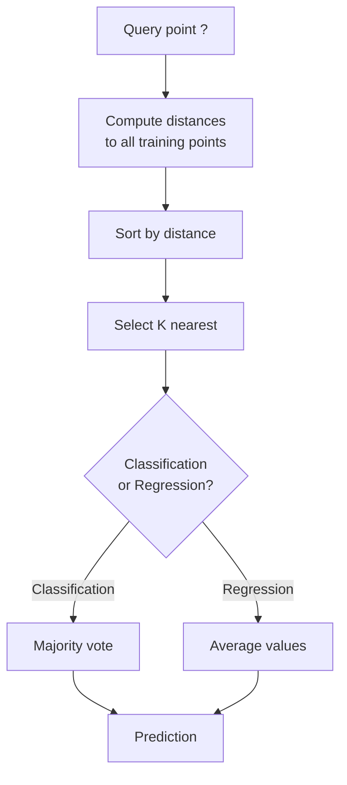
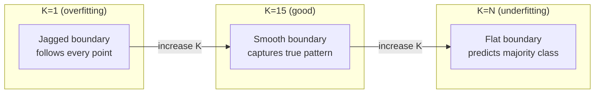
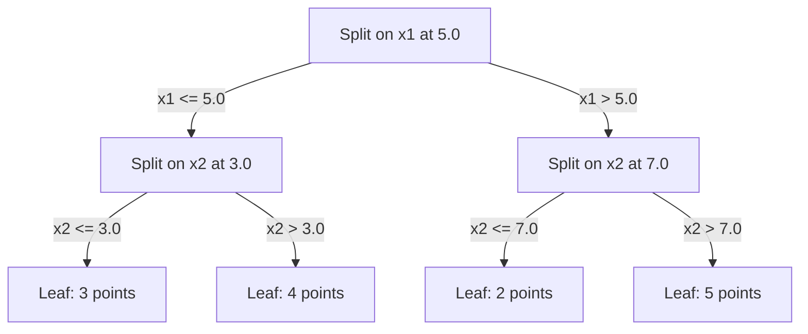

# K近邻与距离

> 存储所有数据。通过观察邻居来进行预测。这是真正有效的最简单算法。

**Type:** Build
**Language:** Python
**Prerequisites:** Phase 1(第14课 范数与距离)
**Time:** ~90分钟

## 学习目标

- 从零实现KNN分类与回归，支持可配置的K和距离加权投票
- 比较L1、L2、余弦和Minkowski距离度量，并针对给定数据类型选择合适的一种
- 解释维数灾难，并演示为什么KNN在高维空间中性能退化
- 构建用于高效最近邻搜索的KD树，并分析它何时优于暴力搜索

## 问题

你有一个数据集。一个新数据点到来。你需要对它进行分类或预测其值。不需要像线性回归或SVM那样从数据中学习参数，你只需找到距离新点最近的K个训练点，让它们投票。

这就是K近邻。没有训练阶段。没有需要学习的参数。没有需要最小化的损失函数。你存储整个训练集，并在预测时计算距离。

听起来简单得不像能奏效。但KNN在许多问题上出乎意料地有竞争力，尤其是中小规模数据集上，而且深入理解它会揭示一些基本概念：距离度量的选择(与Phase 1第14课相关)、维数灾难，以及惰性学习与急切学习之间的区别。

KNN在现代AI中也随处可见，只是名字不同。向量数据库对嵌入做KNN搜索。检索增强生成(RAG)查找K个最近的文档块。推荐系统查找相似的用户或物品。算法是一样的，只是规模和数据结构不同。

## 概念

### KNN如何工作

给定一个带标签的数据点数据集和一个新的查询点：

1. 计算查询点到数据集中每个点的距离
2. 按距离排序
3. 取距离最近的K个点
4. 分类：在K个邻居中进行多数投票
5. 回归：K个邻居值的平均(或加权平均)



这就是整个算法。没有拟合。没有梯度下降。没有迭代轮次。

### 选择K

K是唯一的超参数。它控制偏差-方差权衡：

| K | 行为 |
|---|----------|
| K = 1 | 决策边界跟随每个点。零训练误差。高方差。过拟合 |
| 小K(3-5) | 对局部结构敏感。可以捕获复杂边界 |
| 大K | 更平滑的边界。对噪声更鲁棒。可能欠拟合 |
| K = N | 对每个点都预测多数类。最大偏差 |

常见的起点是对于N个点的数据集取K = sqrt(N)。二分类使用奇数K以避免平票。



### 距离度量

距离函数定义了“近”的含义。不同的度量产生不同的邻居、不同的预测。

**L2(欧氏距离)** 是默认选择。直线距离。

```
d(a, b) = sqrt(sum((a_i - b_i)^2))
```

对特征尺度敏感。在KNN中使用L2之前务必先标准化特征。

**L1(曼哈顿距离)** 对绝对差求和。由于不对差值平方，比L2对离群点更鲁棒。

```
d(a, b) = sum(|a_i - b_i|)
```

**余弦距离** 度量向量之间的夹角，忽略幅值。对文本和嵌入数据至关重要。

```
d(a, b) = 1 - (a . b) / (||a|| * ||b||)
```

**Minkowski** 用参数p泛化了L1和L2。

```
d(a, b) = (sum(|a_i - b_i|^p))^(1/p)

p=1: Manhattan
p=2: Euclidean
p->inf: Chebyshev (max absolute difference)
```

使用哪种度量取决于数据：

| 数据类型 | 最佳度量 | 原因 |
|-----------|------------|-----|
| 数值特征，尺度相似 | L2(欧氏距离) | 默认选择，适用于空间数据 |
| 数值特征，存在离群点 | L1(曼哈顿距离) | 鲁棒，不会放大大的差异 |
| 文本嵌入 | 余弦 | 幅值是噪声，方向才是含义 |
| 高维稀疏 | 余弦或L1 | L2受维数灾难影响 |
| 混合类型 | 自定义距离 | 按特征类型组合度量 |

### 加权KNN

标准KNN对所有K个邻居赋予相同的权重。但距离为0.1的邻居应该比距离为5.0的邻居更重要。

**距离加权KNN** 按距离的倒数对每个邻居加权：

```
weight_i = 1 / (distance_i + epsilon)

For classification: weighted vote
For regression:     weighted average = sum(w_i * y_i) / sum(w_i)
```

epsilon防止当查询点与训练点完全一致时出现除以零的情况。

加权KNN对K的选择不那么敏感，因为无论K如何，远处的邻居贡献都非常小。

### 维数灾难

KNN的性能在高维中会退化。这不是模糊的担忧，而是数学事实。

**问题1:距离收敛。** 随着维度增加，最大距离与最小距离之比趋近于1。所有点与查询点的“距离”变得几乎相同。

```
In d dimensions, for random uniform points:

d=2:    max_dist / min_dist = varies widely
d=100:  max_dist / min_dist ~ 1.01
d=1000: max_dist / min_dist ~ 1.001

When all distances are nearly equal, "nearest" is meaningless.
```

**问题2:体积爆炸。** 要在数据的固定比例内捕获K个邻居，你需要将搜索半径扩大到覆盖特征空间中大得多的比例。高维中的“邻域”囊括了空间的大部分。

**问题3:角落主导。** 在d维的单位超立方体中，大部分体积集中在角落附近，而不是中心。随着d增大，内切于立方体的球体所包含的体积比例趋近于零。

实际后果：KNN在大约20-50个特征以内效果良好。超过这个范围，你需要先做降维(PCA、UMAP、t-SNE)再应用KNN,或者使用利用数据内在较低维度结构的基于树的搜索结构。

### KD树：快速最近邻搜索

暴力KNN计算查询点到每个训练点的距离。每次查询为O(n * d)。对于大型数据集，这太慢了。

KD树沿特征轴递归地划分空间。在每一层，它沿一个维度在中位数处分裂。



要找到最近邻，沿树遍历到包含查询点的叶子，然后回溯，仅当相邻划分可能包含更近的点时才检查它们。

平均查询时间：低维下为O(log n)。但KD树在高维(d > 20)中会退化到O(n),因为回溯能剪掉的分支越来越少。

### 球树：更适合中等维度

球树将数据划分为嵌套的超球面，而不是沿轴对齐的盒子。每个节点定义一个球(中心 + 半径)，包含该子树中的所有点。

相对于KD树的优势：
- 在中等维度(最高约50)下效果更好
- 能处理非轴对齐的结构
- 更紧的边界体积意味着搜索时可以剪掉更多分支

KD树和球树都是精确算法。对于真正的大规模搜索(数百万个点、数百个维度)，则使用近似最近邻方法(HNSW、IVF、乘积量化)。这些内容在Phase 1第14课中介绍。

### 惰性学习与急切学习

KNN是惰性学习器：它在训练时不做任何工作，所有工作都在预测时进行。大多数其他算法(线性回归、SVM、神经网络)是急切学习器：它们在训练时进行大量计算来构建一个紧凑的模型，然后预测很快。

| 方面 | 惰性(KNN) | 急切(SVM、神经网络) |
|--------|------------|------------------------|
| 训练时间 | O(1),仅存储数据 | O(n * epochs) |
| 预测时间 | 每次查询O(n * d) | O(d)或O(parameters) |
| 预测时的内存 | 存储整个训练集 | 仅存储模型参数 |
| 适应新数据 | 立即添加点 | 重新训练模型 |
| 决策边界 | 隐式的，即时计算 | 显式的，训练后固定 |

惰性学习适用于以下情况：
- 数据集频繁变化(添加/删除点而无需重新训练)
- 你只需对极少数查询进行预测
- 你希望训练时间为零
- 数据集足够小，暴力搜索足够快

### 用于回归的KNN

KNN回归不是多数投票，而是对K个邻居的目标值取平均。

```
prediction = (1/K) * sum(y_i for i in K nearest neighbors)

Or with distance weighting:
prediction = sum(w_i * y_i) / sum(w_i)
where w_i = 1 / distance_i
```

KNN回归产生分段常数(或使用加权时的分段平滑)预测。它无法外推到训练数据范围之外。如果训练目标都在0到100之间，KNN永远不会预测出200。

```figure
knn-smoothness
```

## 动手实现

### 步骤1:距离函数

实现L1、L2、余弦和Minkowski距离。这些直接与Phase 1第14课相关。

```python
import math

def l2_distance(a, b):
    return math.sqrt(sum((ai - bi) ** 2 for ai, bi in zip(a, b)))

def l1_distance(a, b):
    return sum(abs(ai - bi) for ai, bi in zip(a, b))

def cosine_distance(a, b):
    dot_val = sum(ai * bi for ai, bi in zip(a, b))
    norm_a = math.sqrt(sum(ai ** 2 for ai in a))
    norm_b = math.sqrt(sum(bi ** 2 for bi in b))
    if norm_a == 0 or norm_b == 0:
        return 1.0
    return 1.0 - dot_val / (norm_a * norm_b)

def minkowski_distance(a, b, p=2):
    if p == float('inf'):
        return max(abs(ai - bi) for ai, bi in zip(a, b))
    return sum(abs(ai - bi) ** p for ai, bi in zip(a, b)) ** (1 / p)
```

### 步骤2:KNN分类器与回归器

构建完整的KNN,支持可配置的K、距离度量和可选的距离加权。

```python
class KNN:
    def __init__(self, k=5, distance_fn=l2_distance, weighted=False,
                 task="classification"):
        self.k = k
        self.distance_fn = distance_fn
        self.weighted = weighted
        self.task = task
        self.X_train = None
        self.y_train = None

    def fit(self, X, y):
        self.X_train = X
        self.y_train = y

    def predict(self, X):
        return [self._predict_one(x) for x in X]
```

### 步骤3:用于高效搜索的KD树

从零构建一个KD树，在每个维度的中位数处递归分裂。

```python
class KDTree:
    def __init__(self, X, indices=None, depth=0):
        # Recursively partition the data
        self.axis = depth % len(X[0])
        # Split on median of the current axis
        ...

    def query(self, point, k=1):
        # Traverse to leaf, then backtrack
        ...
```

完整的实现(包含所有辅助方法和演示)见 `code/knn.py`。

### 步骤4:特征缩放

KNN需要特征缩放，因为距离对特征的幅值敏感。取值范围在0到1000的特征会主导取值范围在0到1的特征。

```python
def standardize(X):
    n = len(X)
    d = len(X[0])
    means = [sum(X[i][j] for i in range(n)) / n for j in range(d)]
    stds = [
        max(1e-10, (sum((X[i][j] - means[j]) ** 2 for i in range(n)) / n) ** 0.5)
        for j in range(d)
    ]
    return [[((X[i][j] - means[j]) / stds[j]) for j in range(d)] for i in range(n)], means, stds
```

## 使用它

使用scikit-learn:

```python
from sklearn.neighbors import KNeighborsClassifier
from sklearn.preprocessing import StandardScaler
from sklearn.pipeline import Pipeline

clf = Pipeline([
    ("scaler", StandardScaler()),
    ("knn", KNeighborsClassifier(n_neighbors=5, metric="euclidean")),
])
clf.fit(X_train, y_train)
print(f"Accuracy: {clf.score(X_test, y_test):.4f}")
```

当数据集足够大且维度足够低时，scikit-learn会自动使用KD树或球树。对于高维数据，它会回退到暴力搜索。你可以通过 `algorithm` 参数控制这一点。

对于大规模最近邻搜索(数百万个向量)，使用FAISS、Annoy或向量数据库：

```python
import faiss

index = faiss.IndexFlatL2(dimension)
index.add(embeddings)
distances, indices = index.search(query_vectors, k=5)
```

## 练习

1. 在一个包含3个类别的2D数据集上实现KNN分类。绘制K=1、K=5、K=15和K=N时的决策边界。观察从过拟合到欠拟合的转变。

2. 在2、5、10、50、100和500维中各生成1000个随机点。对每个维度，计算最大成对距离与最小成对距离之比。绘制比值随维数的变化，以可视化维数灾难。

3. 在一个文本分类问题上比较L1、L2和余弦距离的KNN(使用TF-IDF向量)。哪种度量的准确率最高？为什么余弦在文本上往往获胜？

4. 实现一个KD树,并在2D、10D和50D的1k、10k、100k点数据集上测量其与暴力搜索的查询时间对比。在什么维度下KD树不再比暴力搜索更快？

5. 为 y = sin(x) + noise 构建一个加权KNN回归器。与不加权KNN在K=3、10、30下进行比较。展示加权能产生更平滑的预测，尤其是对于较大的K。

## 关键术语

| 术语 | 实际含义 |
|------|----------------------|
| K近邻 | 非参数算法，通过查找距离查询点最近的K个训练点来进行预测 |
| 惰性学习 | 训练时不做计算。所有工作都在预测时进行。KNN是典型例子 |
| 急切学习 | 训练时进行大量计算来构建紧凑模型。大多数机器学习算法都是急切的 |
| 维数灾难 | 在高维中，距离收敛且邻域扩展到覆盖空间的大部分，使KNN失效 |
| KD树 | 沿特征轴递归划分空间的二叉树。低维下查询为O(log n) |
| 球树 | 嵌套超球面构成的树。在中等维度(最高约50)下比KD树效果更好 |
| 加权KNN | 邻居按距离倒数加权。更近的邻居对预测的影响更大 |
| 特征缩放 | 将特征归一化到可比的范围。KNN等基于距离的方法所必需 |
| 多数投票 | 通过统计K个邻居中最常见的类别进行分类 |
| 暴力搜索 | 计算到每个训练点的距离。每次查询O(n*d)。精确但对大n较慢 |
| 近似最近邻 | 比精确搜索快得多的算法(HNSW、LSH、IVF),找到近似最近的点 |
| Voronoi图 | 空间的一种划分，每个区域包含所有更接近某个训练点而非其他训练点的点。K=1的KNN产生Voronoi边界 |

## 延伸阅读

- [Cover & Hart: Nearest Neighbor Pattern Classification (1967)](https://ieeexplore.ieee.org/document/1053964) - KNN的奠基性论文，证明其错误率至多为贝叶斯最优的两倍
- [Friedman, Bentley, Finkel: An Algorithm for Finding Best Matches in Logarithmic Expected Time (1977)](https://dl.acm.org/doi/10.1145/355744.355745) - KD树的原始论文
- [Beyer et al.: When Is "Nearest Neighbor" Meaningful? (1999)](https://link.springer.com/chapter/10.1007/3-540-49257-7_15) - 对最近邻维数灾难的正式分析
- [scikit-learn Nearest Neighbors documentation](https://scikit-learn.org/stable/modules/neighbors.html) - 包含算法选择指南的实用文档
- [FAISS: A Library for Efficient Similarity Search](https://github.com/facebookresearch/faiss) - Meta的十亿规模近似最近邻搜索库