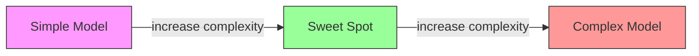
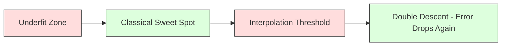
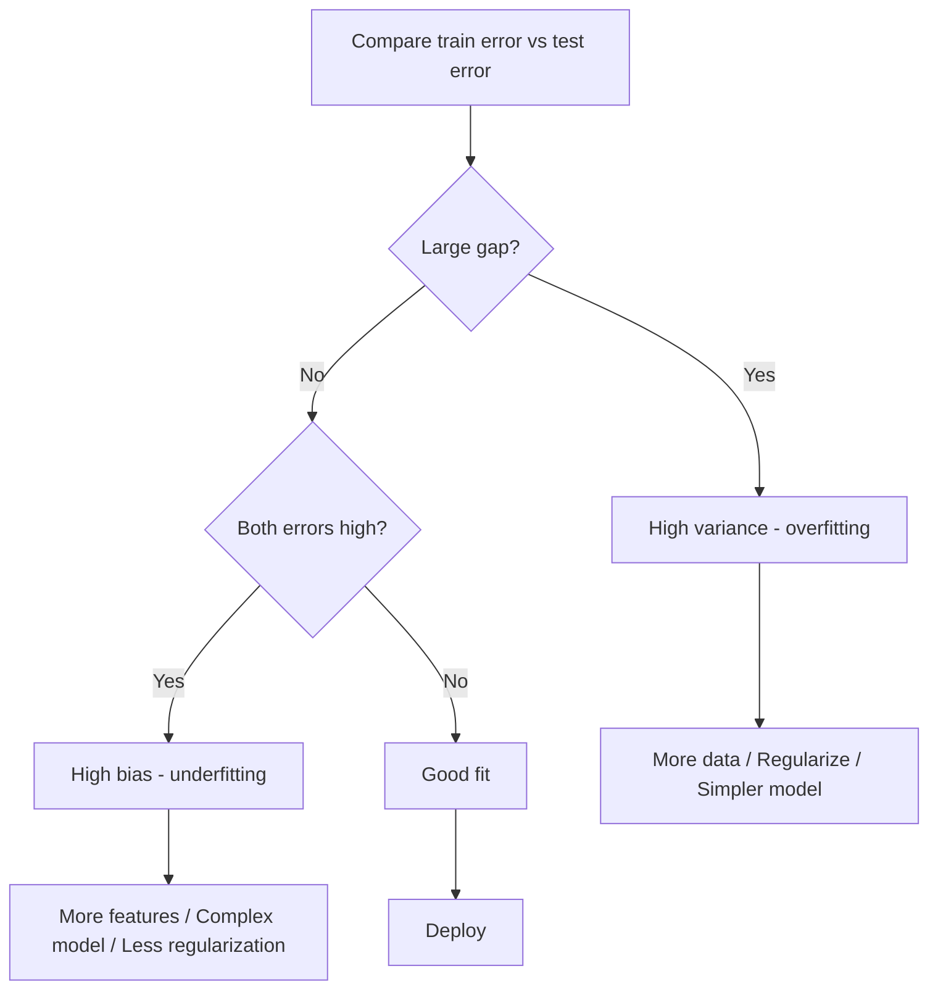
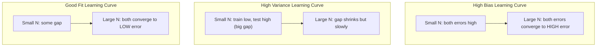
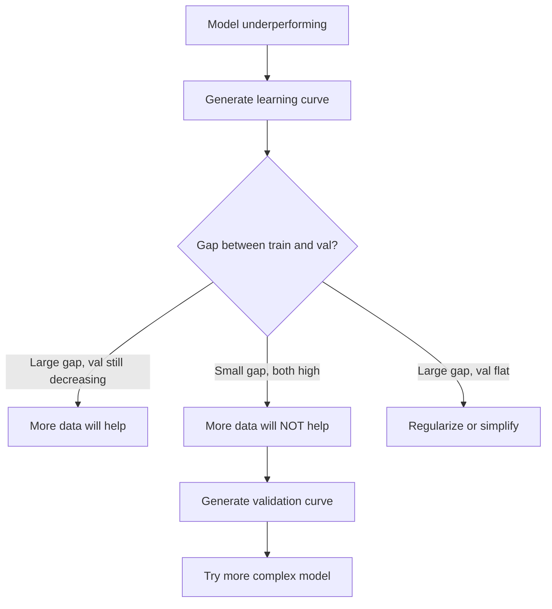

# 偏差-方差权衡

> 每个模型的误差都来自三个来源之一：偏差、方差或噪声。你只能控制前两者。

**Type:** Learn
**Language:** Python
**Prerequisites:** Phase 2, Lessons 01-09（机器学习基础、回归、分类、评估）
**Time:** ~75 minutes

## 学习目标

- 推导期望预测误差的偏差-方差分解，并解释不可约噪声的作用
- 利用训练误差和测试误差的模式，诊断模型是高偏差还是高方差
- 解释正则化技术（L1、L2、dropout、早停）如何以偏差换方差
- 实现可视化实验，展示模型复杂度递增时的偏差-方差权衡

## 问题所在

你训练了一个模型。它在测试数据上有一定误差。这些误差从何而来？

如果你的模型太简单（在弯曲数据上用线性回归），它会持续偏离真实模式。这就是偏差。如果你的模型太复杂（在 15 个数据点上用 20 次多项式），它会完美拟合训练数据，但在新数据上给出大相径庭的预测。这就是方差。

对于固定的模型容量，你无法同时最小化两者。压低偏差，方差就上升。压低方差，偏差就上升。理解这一权衡是机器学习中最有用的诊断技能。它告诉你该让模型更复杂还是更简单，该获取更多数据还是构造更好的特征，该加强还是减弱正则化。

## 核心概念

### 偏差：系统性误差

偏差衡量模型的平均预测与真实值之间的偏离程度。如果你在从同一分布抽取的许多不同训练集上训练同一个模型，并对预测取平均，偏差就是这个平均值与真实值之间的差距。

高偏差意味着模型过于僵化，无法捕捉真实模式。用直线拟合抛物线，无论给多少数据，都会偏离曲线。这就是欠拟合。

```
High bias (underfitting):
  Model always predicts roughly the same wrong thing.
  Training error: HIGH
  Test error: HIGH
  Gap between them: SMALL
```

### 方差：对训练数据的敏感性

方差衡量在不同数据子集上训练时预测的变化程度。如果训练集的微小变化导致模型的巨大变化，方差就高。

高方差意味着模型在拟合训练数据中的噪声，而非潜在的信号。20 次多项式会穿过每个训练点，但点与点之间剧烈振荡。这就是过拟合。

```
High variance (overfitting):
  Model fits training data perfectly but fails on new data.
  Training error: LOW
  Test error: HIGH
  Gap between them: LARGE
```

### 分解

对于任意点 x，平方损失下的期望预测误差可以精确分解为：

```
Expected Error = Bias^2 + Variance + Irreducible Noise

where:
  Bias^2   = (E[f_hat(x)] - f(x))^2
  Variance = E[(f_hat(x) - E[f_hat(x)])^2]
  Noise    = E[(y - f(x))^2]             (sigma^2)
```

- `f(x)` 是真实函数
- `f_hat(x)` 是模型的预测
- `E[...]` 是对不同训练集取的期望
- `y` 是观测标签（真实函数加噪声）

噪声项是不可约的。在含噪声数据上，任何模型都无法优于 sigma^2。你的任务是在 bias^2 与方差之间找到合适的平衡。

### 模型复杂度与误差



经典的 U 形曲线：

| 复杂度 | 偏差 | 方差 | 总误差 |
|-----------|------|----------|-------------|
| 过低 | 高 | 低 | 高（欠拟合） |
| 恰到好处 | 中等 | 中等 | 最低 |
| 过高 | 低 | 高 | 高（过拟合） |

### 正则化作为偏差-方差控制手段

正则化有意增加偏差以降低方差。它约束模型，使其无法追逐噪声。

- **L2（Ridge）：** 将所有权重向零收缩。保留所有特征但降低其影响。
- **L1（Lasso）：** 将部分权重精确压到零。执行特征选择。
- **Dropout:** 训练过程中随机禁用神经元。强制学习冗余表示。
- **早停：** 在模型完全拟合训练数据之前停止训练。

正则化强度（lambda、dropout 率、epoch 数）直接决定你在偏差-方差曲线上的位置。正则化越强，偏差越大，方差越小。

### 双下降：现代视角

经典理论认为：过了最优点之后，复杂度增加总是有害的。但 2019 年以来的研究揭示了意料之外的现象。如果你将模型容量远远增加到超过插值阈值（即模型拥有足以完美拟合训练数据的参数量），测试误差可能再次下降。



这种“双下降”现象解释了为什么大规模过参数化的神经网络（参数远多于训练样本）仍然泛化良好。经典偏差-方差权衡并非错误，但在现代情形下它并不完整。

关于双下降的关键观察：
- 它出现在线性模型、决策树和神经网络中
- 在插值区域，更多数据实际上可能有害（sample-wise double descent）
- 更多训练 epoch 也可能导致它（epoch-wise double descent）
- 正则化能平滑峰值但不能消除它

为什么会这样？在插值阈值处，模型刚好有足够的容量拟合所有训练点。它被迫采用一种穿过每个点的特定解，数据中的微小扰动会导致拟合的巨大变化。这正是方差的峰值。过了阈值之后，模型拥有许多能完美拟合数据的可能解，学习算法（例如带隐式正则化的梯度下降）倾向于从中选择最简单的解。这种对简单解的隐式偏好正是过参数化模型能够泛化的原因。

| 情形 | 参数 vs 样本 | 行为 |
|--------|----------------------|----------|
| 欠参数化 | p << n | 适用经典权衡 |
| 插值阈值 | p ~ n | 方差达到峰值，测试误差激增 |
| 过参数化 | p >> n | 隐式正则化起效，测试误差下降 |

从实用角度看：如果你使用神经网络或大型树集成，不要停在插值阈值处。要么远低于它（配合显式正则化），要么远超过它。最糟糕的位置恰恰在阈值处。

### 诊断你的模型



| 症状 | 诊断 | 修复 |
|---------|-----------|-----|
| 训练误差高，测试误差高 | 偏差 | 更多特征、更复杂的模型、减弱正则化 |
| 训练误差低，测试误差高 | 方差 | 更多数据、正则化、更简单的模型、dropout |
| 训练误差低，测试误差低 | 拟合良好 | 直接上线 |
| 训练误差下降，测试误差上升 | 正在过拟合 | 早停 |

### 实用策略

**当偏差是问题所在：**
- 添加多项式特征或交互特征
- 使用更灵活的模型（用树集成替代线性模型）
- 减弱正则化强度
- 训练更久（如果尚未收敛）

**当方差是问题所在：**
- 获取更多训练数据
- 使用 bagging（随机森林）
- 加强正则化（更大的 lambda、更多 dropout）
- 特征选择（去除噪声特征）
- 使用交叉验证及早发现问题

### 集成方法与方差削减

集成方法是对抗方差最实用的工具。

**Bagging（Bootstrap Aggregating）** 在训练数据的不同 bootstrap 样本上训练多个模型，然后对它们的预测取平均。每个单独的模型方差很高，但平均值方差低得多。随机森林就是应用于决策树的 bagging。

其数学原理：如果你对 N 个独立的预测取平均，每个预测的方差为 sigma^2，则平均值的方差为 sigma^2 / N。这些模型并非真正独立（它们看到的数据相似），因此削减幅度小于 1/N，但仍然可观。

**Boosting** 通过按顺序构建模型来降低偏差，每个新模型专注于当前集成的错误。代表性方法有梯度提升和 AdaBoost。加入过多模型时 boosting 会过拟合，因此需要早停或正则化。

| 方法 | 主要作用 | 偏差变化 | 方差变化 |
|--------|---------------|-------------|-----------------|
| Bagging | 降低方差 | 不变 | 下降 |
| Boosting | 降低偏差 | 下降 | 可能上升 |
| Stacking | 同时降低两者 | 取决于元学习器 | 取决于基模型 |
| Dropout | 隐式 bagging | 略有增加 | 下降 |

**实用规则：** 如果你的基模型方差高（深树、高次多项式），用 bagging。如果你的基模型偏差高（浅层树桩、简单线性模型），用 boosting。

### 学习曲线

学习曲线以训练集大小为自变量绘制训练误差和验证误差。它是你能拥有的最实用的诊断工具。与单次训练/测试对比不同，学习曲线展示模型的变化轨迹，并告诉你更多数据是否有帮助。



如何解读：

| 情形 | 训练误差 | 验证误差 | 差距 | 含义 | 对策 |
|----------|---------------|-----------------|-----|---------------|------------|
| 高偏差 | 高 | 高 | 小 | 模型无法捕捉模式 | 更多特征、更复杂的模型、减弱正则化 |
| 高方差 | 低 | 高 | 大 | 模型在记忆训练数据 | 更多数据、正则化、更简单的模型 |
| 拟合良好 | 中等 | 中等 | 小 | 模型泛化良好 | 直接上线 |
| 高方差，仍在改善 | 低 | 随数据增加而下降 | 缩小 | 数据可以解决的方差问题 | 收集更多数据 |
| 高偏差，平坦 | 高 | 高且平坦 | 小且平坦 | 更多数据不会有帮助 | 更换模型架构 |

关键洞察：如果两条曲线都已趋平，差距很小但两个误差都很高，那么更多数据毫无用处。你需要更好的模型。如果差距很大且仍在缩小，更多数据会有帮助。

### 如何生成学习曲线

有两种方法：

**方法 1：改变训练集大小，固定模型。** 保持模型和超参数不变。在越来越大的训练数据子集上训练，测量每个规模下的训练误差和验证误差。这是标准的学习曲线。

**方法 2：改变模型复杂度，固定数据。** 保持数据不变。扫描一个复杂度参数（多项式次数、树深度、层数），测量每个复杂度下的训练误差和验证误差。这是验证曲线，直接展示偏差-方差权衡。

两种方法互为补充。第一种告诉你更多数据是否有帮助，第二种告诉你换一个模型是否有帮助。在决定下一步之前，两者都应运行。



```figure
bias-variance
```

## 动手实现

`code/bias_variance.py` 中的代码运行完整的偏差-方差分解实验。以下是分步思路。

### 第 1 步：从已知函数生成合成数据

我们使用 `f(x) = sin(1.5x) + 0.5x` 并叠加高斯噪声。知道真实函数使我们能精确计算偏差和方差。

```python
def true_function(x):
    return np.sin(1.5 * x) + 0.5 * x

def generate_data(n_samples=30, noise_std=0.5, x_range=(-3, 3), seed=None):
    rng = np.random.RandomState(seed)
    x = rng.uniform(x_range[0], x_range[1], n_samples)
    y = true_function(x) + rng.normal(0, noise_std, n_samples)
    return x, y
```

### 第 2 步：Bootstrap 采样与多项式拟合

对每个多项式次数，我们抽取多个 bootstrap 训练集，拟合多项式，并记录在固定测试网格上的预测。这给出了每个测试点上的预测分布。

```python
def fit_polynomial(x_train, y_train, degree, lam=0.0):
    X = np.column_stack([x_train ** d for d in range(degree + 1)])
    if lam > 0:
        penalty = lam * np.eye(X.shape[1])
        penalty[0, 0] = 0
        w = np.linalg.solve(X.T @ X + penalty, X.T @ y_train)
    else:
        w = np.linalg.lstsq(X, y_train, rcond=None)[0]
    return w
```

我们在 200 个不同的 bootstrap 样本上进行拟合。每个 bootstrap 样本抽自同一底层分布，但包含不同的点。

### 第 3 步：计算 Bias^2 与方差分解

有了每个测试点上 200 组预测，我们可以直接按定义计算分解：

```python
mean_pred = predictions.mean(axis=0)
bias_sq = np.mean((mean_pred - y_true) ** 2)
variance = np.mean(predictions.var(axis=0))
total_error = np.mean(np.mean((predictions - y_true) ** 2, axis=1))
```

- `mean_pred` 是从 bootstrap 样本估计的 E[f_hat(x)]
- `bias_sq` 是平均预测与真实值之间的平方差距
- `variance` 是各 bootstrap 样本预测的平均离散程度
- `total_error` 应近似等于 bias^2 + 方差 + 噪声

### 第 4 步：学习曲线

学习曲线在保持模型复杂度不变的情况下扫描训练集大小。它们展示你的模型是受数据限制还是受容量限制。

```python
def demo_learning_curves():
    sizes = [10, 15, 20, 30, 50, 75, 100, 150, 200, 300]
    degree = 5

    for n in sizes:
        train_errors = []
        test_errors = []
        for seed in range(50):
            x_train, y_train = generate_data(n_samples=n, seed=seed * 100)
            w = fit_polynomial(x_train, y_train, degree)
            train_pred = predict_polynomial(x_train, w)
            train_mse = np.mean((train_pred - y_train) ** 2)
            test_pred = predict_polynomial(x_test, w)
            test_mse = np.mean((test_pred - y_test) ** 2)
            train_errors.append(train_mse)
            test_errors.append(test_mse)
        # Average over runs gives the learning curve point
```

对于高方差模型（小数据上的 5 次多项式），你会看到：
- 训练误差起始较低，随着数据增多、记忆变得困难而上升
- 测试误差起始较高，随着模型获得更多信号而下降
- 随着数据增多，差距缩小

对于高偏差模型（1 次多项式），两个误差很快收敛到同一个高值，更多数据也无济于事。

### 第 5 步：正则化扫描

代码还包括 `demo_regularization_sweep()`，它固定一个高次多项式（15 次），并将 Ridge 正则化强度从 0.001 扫到 100。这从另一个角度展示偏差-方差权衡：不变的是模型复杂度，变化的是约束强度。

```python
def demo_regularization_sweep():
    alphas = [0.001, 0.005, 0.01, 0.05, 0.1, 0.5, 1.0, 5.0, 10.0, 50.0, 100.0]
    for alpha in alphas:
        results = bias_variance_decomposition([15], lam=alpha)
        r = results[15]
        print(f"alpha={alpha:.3f}  bias={r['bias_sq']:.4f}  var={r['variance']:.4f}")
```

在低 alpha 时，15 次多项式几乎不受约束。方差占主导，因为模型追逐每个 bootstrap 样本中的噪声。在高 alpha 时，惩罚过强，模型实际上退化为接近常数的函数。偏差占主导。最优 alpha 位于这两个极端之间。

这与改变多项式次数时的 U 形曲线相同，只是由连续旋钮而非离散参数控制。在实践中，正则化是控制该权衡的首选方式，因为它允许在不改变特征集的情况下进行精细调节。

## 直接使用

sklearn 提供 `learning_curve` 和 `validation_curve`，无需手写 bootstrap 循环即可自动化这些诊断。

### 验证曲线：扫描模型复杂度

```python
from sklearn.model_selection import validation_curve
from sklearn.pipeline import make_pipeline
from sklearn.preprocessing import PolynomialFeatures
from sklearn.linear_model import Ridge

degrees = list(range(1, 16))
train_scores_all = []
val_scores_all = []

for d in degrees:
    pipe = make_pipeline(PolynomialFeatures(d), Ridge(alpha=0.01))
    train_scores, val_scores = validation_curve(
        pipe, X, y, param_name="polynomialfeatures__degree",
        param_range=[d], cv=5, scoring="neg_mean_squared_error"
    )
    train_scores_all.append(-train_scores.mean())
    val_scores_all.append(-val_scores.mean())
```

这直接给出偏差-方差权衡曲线。验证得分相对于训练得分最差之处，方差占主导。两者都很差之处，偏差占主导。

### 学习曲线：扫描训练集大小

```python
from sklearn.model_selection import learning_curve

pipe = make_pipeline(PolynomialFeatures(5), Ridge(alpha=0.01))
train_sizes, train_scores, val_scores = learning_curve(
    pipe, X, y, train_sizes=np.linspace(0.1, 1.0, 10),
    cv=5, scoring="neg_mean_squared_error"
)
train_mse = -train_scores.mean(axis=1)
val_mse = -val_scores.mean(axis=1)
```

将 `train_mse` 和 `val_mse` 对 `train_sizes` 作图。曲线的形状会告诉你关于模型的一切。

### 带正则化扫描的交叉验证

```python
from sklearn.model_selection import cross_val_score

alphas = [0.001, 0.01, 0.1, 1.0, 10.0, 100.0]
for alpha in alphas:
    pipe = make_pipeline(PolynomialFeatures(10), Ridge(alpha=alpha))
    scores = cross_val_score(pipe, X, y, cv=5, scoring="neg_mean_squared_error")
    print(f"alpha={alpha:>7.3f}  MSE={-scores.mean():.4f} +/- {scores.std():.4f}")
```

这在固定模型复杂度下扫描正则化强度。你会看到同样的偏差-方差权衡：低 alpha 意味着高方差，高 alpha 意味着高偏差。

### 综合运用：完整的诊断工作流

在实践中，你按顺序运行这些诊断：

1. 训练模型。计算训练误差和测试误差。
2. 如果两者都高：你有偏差问题。跳到第 4 步。
3. 如果训练误差低但测试误差高：你有方差问题。生成学习曲线看更多数据是否有帮助。如果没有，进行正则化。
4. 生成扫描主要复杂度参数的验证曲线。找到最优点。
5. 在最优点处，生成学习曲线。如果差距仍然很大，你需要更多数据或正则化。
6. 使用 `cross_val_score` 尝试不同 alpha 值的 Ridge/Lasso。选择交叉验证误差最低的 alpha。

对大多数表格数据集，这只需 10-15 分钟的计算，却能省去数小时的盲目猜测。

## 交付成果

本课产出：`outputs/prompt-model-diagnostics.md`

## 练习

1. 在 `noise_std=0`（无噪声）下运行分解。不可约误差项会怎样？最优复杂度会改变吗？

2. 将训练集大小从 30 增加到 300。这对方差分量有何影响？最优多项式次数会移动吗？

3. 在实验中加入 L2 正则化（Ridge 回归）。固定一个高次多项式（15 次），将 lambda 从 0 扫到 100。绘制 bias^2 和方差随 lambda 变化的曲线。

4. 将真实函数从多项式改为 `sin(x)`。偏差-方差分解如何变化？还存在明确的最优次数吗？

5. 实现一个简单的 bootstrap aggregating（bagging）封装：在 bootstrap 样本上训练 10 个模型并对预测取平均。证明这能降低方差而不明显增加偏差。

## 关键术语

| 术语 | 人们的说法 | 实际含义 |
|------|----------------|----------------------|
| 偏差 | “模型太简单” | 来自错误假设的系统性误差。平均模型预测与真实值之间的差距。 |
| 方差 | “模型过拟合了” | 来自对训练数据敏感性的误差。预测在不同训练集之间的变化程度。 |
| 不可约误差 | “数据里有噪声” | 来自真实数据生成过程中的随机性。任何模型都无法消除。 |
| 欠拟合 | “学得不够” | 模型偏差高。即使在训练数据上也偏离真实模式。 |
| 过拟合 | “在背数据” | 模型方差高。它拟合了训练数据中无法泛化的噪声。 |
| 正则化 | “约束模型” | 添加惩罚项以降低模型复杂度，用偏差换取更低的方差。 |
| 双下降 | “参数多一点也有好处” | 当模型容量远超插值阈值时，测试误差再次下降。 |
| 模型复杂度 | “模型有多灵活” | 模型拟合任意模式的能力。由架构、特征或正则化控制。 |

## 延伸阅读

- [Hastie, Tibshirani, Friedman: Elements of Statistical Learning, Ch. 7](https://hastie.su.domains/ElemStatLearn/) —— 偏差-方差分解的权威论述
- [Belkin et al., Reconciling modern machine learning practice and the bias-variance trade-off (2019)](https://arxiv.org/abs/1812.11118) —— 双下降论文
- [Nakkiran et al., Deep Double Descent (2019)](https://arxiv.org/abs/1912.02292) —— epoch-wise 与 sample-wise 双下降
- [Scott Fortmann-Roe: Understanding the Bias-Variance Tradeoff](http://scott.fortmann-roe.com/docs/BiasVariance.html) —— 清晰的可视化讲解