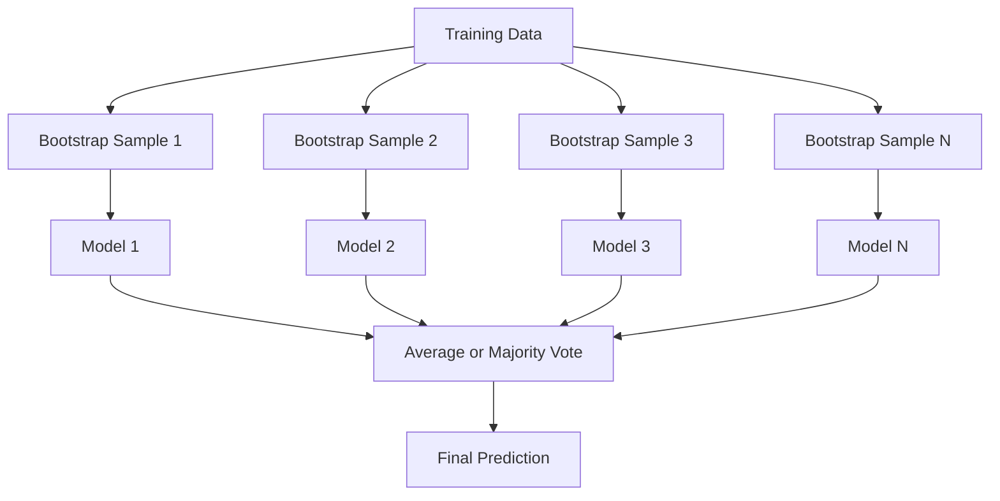
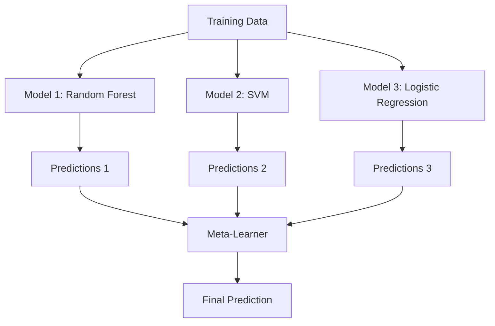

# 集成方法

> 一群弱学习器，只要组合得当，就会成为强学习器。这不是比喻，而是一个定理。

**Type:** Build
**Language:** Python
**Prerequisites:** Phase 2, Lesson 10 (Bias-Variance Tradeoff)
**Time:** ~120 minutes

## 学习目标

- 从零实现 AdaBoost 和梯度提升（gradient boosting），并解释 boosting 如何逐步降低偏差
- 构建一个 bagging 集成，并展示对去相关模型取平均如何在几乎不增加偏差的情况下降低方差
- 从各自针对的误差成分角度比较 bagging、boosting 和 stacking
- 评估集成多样性，并解释为什么多数投票的准确率会随着更多独立弱学习器而提升

## 问题所在

单棵决策树训练快、易于解释，但容易过拟合。单个线性模型在复杂边界上会欠拟合。你可以花几天时间设计完美的模型架构，或者把一堆不完美的模型组合起来，得到比其中任何一个都更好的结果。

集成方法做的正是这件事。它们是赢得 Kaggle 表格数据竞赛最可靠的技术，支撑着大多数生产环境中的机器学习系统，并且生动地展示了偏差-方差权衡。Bagging 降低方差。Boosting 降低偏差。Stacking 学习在哪些输入上信任哪些模型。

## 核心概念

### 为什么集成有效

假设你有 N 个相互独立的分类器，每个准确率为 p > 0.5。多数投票的准确率为：

```
P(majority correct) = sum over k > N/2 of C(N,k) * p^k * (1-p)^(N-k)
```

对于 21 个准确率各为 60% 的分类器，多数投票准确率约为 74%。有 101 个分类器时，会升至 84%。当模型犯的错误各不相同时，误差会相互抵消。

关键要求是**多样性**。如果所有模型犯同样的错误，组合它们毫无帮助。集成之所以有效，是因为它们通过以下方式产生多样化的模型：

- 不同的训练子集（bagging）
- 不同的特征子集（随机森林）
- 顺序纠错（boosting）
- 不同的模型族（stacking）

### Bagging（Bootstrap 聚合）

Bagging 通过在每个模型上使用训练数据的不同 bootstrap 样本来创造多样性。



bootstrap 样本是从原始数据中有放回地抽取的，大小与原始数据相同。每个 bootstrap 中大约出现 63.2% 的不重复样本。剩余的 36.8%（袋外样本）提供了一个免费的验证集。

Bagging 能降低方差而几乎不增加偏差。每棵树都会对自己的 bootstrap 样本过拟合，但过拟合的方式各不相同，因此取平均可以抵消噪声。

**随机森林**是带有一个额外技巧的 bagging：每次分裂时只考虑一个随机的特征子集。这迫使树之间产生更多的多样性。分类时候选特征数通常为 `sqrt(n_features)`，回归时为 `n_features / 3`。

### Boosting（顺序纠错）

Boosting 顺序地训练模型。每个新模型都关注之前模型做错的样本。


Boosting 降低偏差。每个新模型纠正到目前为止集成所犯的系统性错误。最终预测是所有模型的加权和，其中更好的模型获得更高的权重。

代价是：如果运行过多轮次，boosting 可能过拟合，因为它不断拟合更难的样本，而其中一些可能只是噪声。

### AdaBoost

AdaBoost（Adaptive Boosting）是第一个实用的 boosting 算法。它可以搭配任意基学习器，通常是决策树桩（深度为 1 的树）。

算法流程：

```
1. Initialize sample weights: w_i = 1/N for all i

2. For t = 1 to T:
   a. Train weak learner h_t on weighted data
   b. Compute weighted error:
      err_t = sum(w_i * I(h_t(x_i) != y_i)) / sum(w_i)
   c. Compute model weight:
      alpha_t = 0.5 * ln((1 - err_t) / err_t)
   d. Update sample weights:
      w_i = w_i * exp(-alpha_t * y_i * h_t(x_i))
   e. Normalize weights to sum to 1

3. Final prediction: H(x) = sign(sum(alpha_t * h_t(x)))
```

误差较低的模型获得较高的 alpha。被误分类的样本获得更高的权重，使下一个模型关注它们。

### 梯度提升（Gradient Boosting）

梯度提升将 boosting 推广到任意损失函数。它不再对样本重新加权，而是让每个新模型拟合当前集成的残差（损失的负梯度）。

```
1. Initialize: F_0(x) = argmin_c sum(L(y_i, c))

2. For t = 1 to T:
   a. Compute pseudo-residuals:
      r_i = -dL(y_i, F_{t-1}(x_i)) / dF_{t-1}(x_i)
   b. Fit a tree h_t to the residuals r_i
   c. Find optimal step size:
      gamma_t = argmin_gamma sum(L(y_i, F_{t-1}(x_i) + gamma * h_t(x_i)))
   d. Update:
      F_t(x) = F_{t-1}(x) + learning_rate * gamma_t * h_t(x)

3. Final prediction: F_T(x)
```

对于平方误差损失，伪残差就是实际的残差：`r_i = y_i - F_{t-1}(x_i)`。每棵树确实是在拟合前一个集成的误差。

学习率（shrinkage）控制每棵树的贡献程度。较小的学习率需要更多的树，但泛化能力更好。典型取值：0.01 到 0.3。

### XGBoost：为什么它称霸表格数据

XGBoost (eXtreme Gradient Boosting) 是经过工程优化的梯度提升，速度快、精度高、抗过拟合：

- **正则化目标函数：** 对叶子权重的 L1 和 L2 惩罚防止单棵树过于自信
- **二阶近似：** 同时使用损失的一阶和二阶导数，做出更好的分裂决策
- **稀疏感知分裂：** 原生处理缺失值，在每个分裂处学习缺失数据的最佳方向
- **列子采样：** 类似随机森林，在每次分裂时对特征采样以增加多样性
- **加权分位数草图：** 在分布式数据上高效查找连续特征的分裂点
- **缓存友好的块结构：** 针对 CPU 缓存行优化的内存布局

对于表格数据，XGBoost（及其后继者 LightGBM）持续优于神经网络。这在短期内不会改变。如果你的数据能放进一个有行列的表格，就从梯度提升开始。

### Stacking（元学习）

Stacking 将多个基模型的预测作为特征输入元学习器。



元学习器学习在哪些输入上信任哪个基模型。如果随机森林在某些区域表现更好而 SVM 在另一些区域更好，元学习器会学会相应地进行选择。

为避免数据泄漏，基模型的预测必须通过在训练集上做交叉验证来生成。绝不能在同一份数据上既训练基模型又生成元特征。

### 投票（Voting）

最简单的集成方式。直接组合预测结果。

- **硬投票：** 对类别标签进行多数投票。
- **软投票：** 对预测概率取平均，选择平均概率最高的类别。通常更好，因为它利用了置信度信息。

```figure
f3-ensemble-average
```

## 动手构建

### 第 1 步：决策树桩（基学习器）

`code/ensembles.py` 中的代码从零实现了所有内容。我们从一个决策树桩开始：只有一次分裂的树。

```python
class DecisionStump:
    def __init__(self):
        self.feature_idx = None
        self.threshold = None
        self.polarity = 1
        self.alpha = None

    def fit(self, X, y, weights):
        n_samples, n_features = X.shape
        best_error = float("inf")

        for f in range(n_features):
            thresholds = np.unique(X[:, f])
            for thresh in thresholds:
                for polarity in [1, -1]:
                    pred = np.ones(n_samples)
                    pred[polarity * X[:, f] < polarity * thresh] = -1
                    error = np.sum(weights[pred != y])
                    if error < best_error:
                        best_error = error
                        self.feature_idx = f
                        self.threshold = thresh
                        self.polarity = polarity

    def predict(self, X):
        n = X.shape[0]
        pred = np.ones(n)
        idx = self.polarity * X[:, self.feature_idx] < self.polarity * self.threshold
        pred[idx] = -1
        return pred
```

### 第 2 步：从零实现 AdaBoost

```python
class AdaBoostScratch:
    def __init__(self, n_estimators=50):
        self.n_estimators = n_estimators
        self.stumps = []
        self.alphas = []

    def fit(self, X, y):
        n = X.shape[0]
        weights = np.full(n, 1 / n)

        for _ in range(self.n_estimators):
            stump = DecisionStump()
            stump.fit(X, y, weights)
            pred = stump.predict(X)

            err = np.sum(weights[pred != y])
            err = np.clip(err, 1e-10, 1 - 1e-10)

            alpha = 0.5 * np.log((1 - err) / err)
            weights *= np.exp(-alpha * y * pred)
            weights /= weights.sum()

            stump.alpha = alpha
            self.stumps.append(stump)
            self.alphas.append(alpha)

    def predict(self, X):
        total = sum(a * s.predict(X) for a, s in zip(self.alphas, self.stumps))
        return np.sign(total)
```

### 第 3 步：从零实现梯度提升

```python
class GradientBoostingScratch:
    def __init__(self, n_estimators=100, learning_rate=0.1, max_depth=3):
        self.n_estimators = n_estimators
        self.lr = learning_rate
        self.max_depth = max_depth
        self.trees = []
        self.initial_pred = None

    def fit(self, X, y):
        self.initial_pred = np.mean(y)
        current_pred = np.full(len(y), self.initial_pred)

        for _ in range(self.n_estimators):
            residuals = y - current_pred
            tree = SimpleRegressionTree(max_depth=self.max_depth)
            tree.fit(X, residuals)
            update = tree.predict(X)
            current_pred += self.lr * update
            self.trees.append(tree)

    def predict(self, X):
        pred = np.full(X.shape[0], self.initial_pred)
        for tree in self.trees:
            pred += self.lr * tree.predict(X)
        return pred
```

### 第 4 步：与 sklearn 对比

代码验证我们的从零实现能否达到与 sklearn 的 `AdaBoostClassifier` 和 `GradientBoostingClassifier` 相近的准确率，并将所有方法放在一起比较。

## 实际应用

### 何时使用哪种方法

| 方法 | 降低 | 最适合 | 注意事项 |
|--------|---------|----------|---------------|
| Bagging / 随机森林 | 方差 | 噪声数据、特征多 | 对偏差无帮助 |
| AdaBoost | 偏差 | 干净的数据、简单的基学习器 | 对离群点和噪声敏感 |
| 梯度提升 | 偏差 | 表格数据、竞赛 | 训练慢，不调参容易过拟合 |
| XGBoost / LightGBM | 两者 | 生产环境的表格数据机器学习 | 超参数众多 |
| Stacking | 两者 | 追求最后 1-2% 的准确率 | 复杂，元学习器有过拟合风险 |
| 投票 | 方差 | 快速组合多样化模型 | 只有在模型多样化时才有帮助 |

### 表格数据的生产环境技术栈

对于大多数表格数据预测问题，按以下顺序尝试：

1. 使用默认参数的 **LightGBM 或 XGBoost**
2. 调整 n_estimators、learning_rate、max_depth、min_child_weight
3. 如果需要最后的 0.5%，用 3-5 个多样化的模型构建 stacking 集成
4. 全程使用交叉验证

在表格数据上，神经网络几乎总是不如梯度提升，尽管相关研究尝试从未停止。TabNet、NODE 及类似架构偶尔能持平，但很少能击败调参得当的 XGBoost。

## 上线交付

本课产出 `outputs/prompt-ensemble-selector.md` —— 一个帮助你为给定数据集选择正确集成方法的提示。描述你的数据（规模、特征类型、噪声水平、类别平衡）和你要解决的问题。该提示会引导你过一遍决策清单，推荐一种方法，给出起始超参数，并指出该方法的常见错误。同时还产出包含完整选择指南的 `outputs/skill-ensemble-builder.md`。

## 练习

1. 修改 AdaBoost 实现，跟踪每一轮之后的训练准确率。绘制准确率与估计器数量的关系图。它何时收敛？

2. 在回归树中加入随机特征子采样，从零实现一个随机森林。用 `max_features=sqrt(n_features)` 训练 100 棵树并对预测取平均。比较与单棵树相比的方差降低程度。

3. 在梯度提升实现中加入早停：跟踪每轮之后的验证损失，连续 10 轮未改善时停止。它实际上需要多少棵树？

4. 用三个基模型（逻辑回归、决策树、k 近邻）和一个逻辑回归元学习器构建 stacking 集成。使用 5 折交叉验证生成元特征。与每个单独的基模型进行比较。

5. 在同一数据集上用默认参数运行 XGBoost。将其准确率与你的从零实现的梯度提升进行比较。对两者计时。速度差异有多大？

## 关键术语

| 术语 | 人们怎么说 | 实际含义 |
|------|----------------|----------------------|
| Bagging | "在随机子集上训练" | Bootstrap 聚合：在 bootstrap 样本上训练模型，对预测取平均以降低方差 |
| Boosting | "关注难样本" | 顺序训练模型，每个模型纠正到目前为止集成的错误，以降低偏差 |
| AdaBoost | "重新加权数据" | 通过更新样本权重实现 boosting；被误分类的点在下一轮获得更高的权重 |
| 梯度提升 | "拟合残差" | 通过让每个新模型拟合损失函数的负梯度实现 boosting |
| XGBoost | "Kaggle 神器" | 带正则化、二阶优化和系统级速度优化的梯度提升 |
| Stacking | "模型之上再叠模型" | 将基模型的预测作为元学习器的输入特征 |
| 随机森林 | "很多随机化的树" | 决策树的 bagging，在每次分裂时加入随机特征子采样以增加多样性 |
| 集成多样性 | "犯不同的错误" | 模型之间的误差必须不相关，集成才能优于单个模型 |
| 袋外误差 | "免费的验证" | 未出现在某个 bootstrap 抽样中的样本（约 36.8%）可作为验证集，无需单独留出 |

## 延伸阅读

- [Schapire & Freund: Boosting: Foundations and Algorithms](https://mitpress.mit.edu/9780262526036/) —— AdaBoost 创造者所著的书
- [Friedman: Greedy Function Approximation: A Gradient Boosting Machine (2001)](https://statweb.stanford.edu/~jhf/ftp/trebst.pdf) —— 梯度提升的原始论文
- [Chen & Guestrin: XGBoost (2016)](https://arxiv.org/abs/1603.02754) —— XGBoost 论文
- [Wolpert: Stacked Generalization (1992)](https://www.sciencedirect.com/science/article/abs/pii/S0893608005800231) —— stacking 的原始论文
- [scikit-learn Ensemble Methods](https://scikit-learn.org/stable/modules/ensemble.html) —— 实用参考