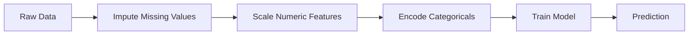
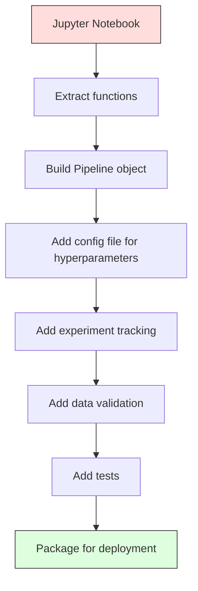

# 机器学习流水线

> 模型不是产品，流水线才是。流水线涵盖从原始数据到部署预测的一切，每一步都必须可复现。

**Type:** Build
**Language:** Python
**Prerequisites:** Phase 2, Lesson 12 (Hyperparameter Tuning)
**Time:** ~120 分钟

## 学习目标

- 从零构建一条 ML 流水线，将缺失值填补、缩放、编码和模型训练串联为一个可复现的对象
- 识别数据泄漏场景，并解释流水线如何通过仅在训练数据上拟合变换器来防止泄漏
- 构建一个 ColumnTransformer，对数值特征和类别特征应用不同的预处理
- 实现流水线序列化，并证明同一个已拟合的流水线在训练和生产环境中产生完全一致的结果

## 问题所在

你有一个 notebook，它加载数据、用中位数填充缺失值、缩放特征、训练模型并打印准确率。它能跑通，于是你发布了它。

一个月后，有人重新训练模型，却得到不同的结果。中位数是在包含测试数据的完整数据集上计算的（数据泄漏）。缩放参数没有被保存，推理时使用了不同的统计量。特征工程代码在训练和服务之间被复制粘贴，两份副本逐渐分歧。某个类别列在生产环境中出现了编码器从未见过的新取值。

这些都不是假设。它们是 ML 系统在生产环境失败的最常见原因。流水线把每一个变换步骤打包成一个单一的、有序的、可复现的对象，从而解决所有这些问题。

## 概念

### 流水线是什么

流水线是一个有序的数据变换序列，后接一个模型。每一步以前一步的输出作为输入。整条流水线在训练数据上拟合一次。推理时，同一个已拟合的流水线对新数据进行变换并产生预测。



流水线保证：
- 变换只在训练数据上拟合（无泄漏）
- 推理时应用相同的变换
- 整个对象可以被序列化并作为一个制品部署
- 交叉验证按折应用流水线，防止隐蔽的泄漏

### 数据泄漏：无声的杀手

当测试集或未来数据的信息污染训练过程时，就会发生数据泄漏。流水线可以防止最常见的几种形式。

**泄漏（错误）：**
```python
X = df.drop("target", axis=1)
y = df["target"]

scaler = StandardScaler()
X_scaled = scaler.fit_transform(X)

X_train, X_test = X_scaled[:800], X_scaled[800:]
y_train, y_test = y[:800], y[800:]
```

缩放器看到了测试数据。均值和标准差包含了测试样本。这会虚高准确率估计。

**正确：**
```python
X_train, X_test = X[:800], X[800:]

scaler = StandardScaler()
X_train_scaled = scaler.fit_transform(X_train)
X_test_scaled = scaler.transform(X_test)
```

使用流水线，你根本不需要操心这个问题。流水线会自动处理。

### sklearn Pipeline

sklearn 的 `Pipeline` 将变换器和一个估计器串联起来。它提供 `.fit()`、`.predict()` 和 `.score()`，按顺序应用所有步骤。

```python
from sklearn.pipeline import Pipeline
from sklearn.preprocessing import StandardScaler
from sklearn.linear_model import LogisticRegression

pipe = Pipeline([
    ("scaler", StandardScaler()),
    ("model", LogisticRegression()),
])

pipe.fit(X_train, y_train)
predictions = pipe.predict(X_test)
```

当你调用 `pipe.fit(X_train, y_train)` 时：
1. 缩放器在 X_train 上调用 `fit_transform`
2. 模型在缩放后的 X_train 上调用 `fit`

当你调用 `pipe.predict(X_test)` 时：
1. 缩放器在 X_test 上调用 `transform`（而非 fit_transform）
2. 模型在缩放后的 X_test 上调用 `predict`

缩放器在拟合时从未见过测试数据。这正是全部要点。

### ColumnTransformer：不同列用不同流水线

真实数据集包含需要不同预处理的数值列和类别列。`ColumnTransformer` 可以处理这种情况。

```python
from sklearn.compose import ColumnTransformer
from sklearn.preprocessing import StandardScaler, OneHotEncoder
from sklearn.impute import SimpleImputer

numeric_pipe = Pipeline([
    ("impute", SimpleImputer(strategy="median")),
    ("scale", StandardScaler()),
])

categorical_pipe = Pipeline([
    ("impute", SimpleImputer(strategy="most_frequent")),
    ("encode", OneHotEncoder(handle_unknown="ignore")),
])

preprocessor = ColumnTransformer([
    ("num", numeric_pipe, ["age", "income", "score"]),
    ("cat", categorical_pipe, ["city", "gender", "plan"]),
])

full_pipeline = Pipeline([
    ("preprocess", preprocessor),
    ("model", GradientBoostingClassifier()),
])
```

OneHotEncoder 中的 `handle_unknown="ignore"` 对生产环境至关重要。当出现新类别（模型从未见过的城市）时，它会生成零向量而不是崩溃。

### 实验追踪

流水线让训练可复现，但你还需要跨实验追踪发生了什么：使用了哪些超参数、哪个数据集版本、指标是多少、运行的是哪个版本的代码。

**MLflow** 是最常见的开源解决方案：

```python
import mlflow

with mlflow.start_run():
    mlflow.log_param("max_depth", 5)
    mlflow.log_param("n_estimators", 100)
    mlflow.log_param("learning_rate", 0.1)

    pipe.fit(X_train, y_train)
    accuracy = pipe.score(X_test, y_test)

    mlflow.log_metric("accuracy", accuracy)
    mlflow.sklearn.log_model(pipe, "model")
```

每次运行都会记录参数、指标、制品和完整模型。你可以比较各次运行、复现任何实验，并部署任意模型版本。

**Weights & Biases (wandb)** 通过托管仪表盘提供相同的功能：

```python
import wandb

wandb.init(project="my-pipeline")
wandb.config.update({"max_depth": 5, "n_estimators": 100})

pipe.fit(X_train, y_train)
accuracy = pipe.score(X_test, y_test)

wandb.log({"accuracy": accuracy})
```

### 模型版本管理

实验追踪之后，你还需要管理模型版本。哪个模型在生产环境？哪个在预发布（staging）？哪个是上周的？

MLflow 的 Model Registry 提供：
- **版本追踪：** 每个保存的模型都会获得一个版本号
- **阶段切换：** "Staging"、"Production"、"Archived"
- **审批流程：** 模型必须被显式提升才能进入生产环境
- **回滚：** 立即切换回之前的版本

### 使用 DVC 进行数据版本管理

代码用 git 做版本管理。数据也应该如此，但 git 无法处理大文件。DVC（Data Version Control）解决了这个问题。

```
dvc init
dvc add data/training.csv
git add data/training.csv.dvc data/.gitignore
git commit -m "Track training data"
dvc push
```

DVC 将实际数据存储在远程存储（S3、GCS、Azure）中，并在 git 中保留一个记录哈希的小型 `.dvc` 文件。当你 checkout 一个 git 提交时，`dvc checkout` 会恢复当时使用的确切数据。

这意味着每个 git 提交都同时固定了代码和数据。完全可复现。

### 可复现的实验

一个可复现的实验需要四样东西：

1. **固定随机种子：** 为 numpy、random 和框架（torch、sklearn）设置种子
2. **锁定依赖：** 包含精确版本的 requirements.txt 或 poetry.lock
3. **数据版本管理：** DVC 或类似工具
4. **配置文件：** 所有超参数放在配置中，而不是硬编码

```python
import numpy as np
import random

def set_seed(seed=42):
    random.seed(seed)
    np.random.seed(seed)
    try:
        import torch
        torch.manual_seed(seed)
        torch.cuda.manual_seed_all(seed)
        torch.backends.cudnn.deterministic = True
    except ImportError:
        pass
```

### 从 Notebook 到生产流水线



典型的演进路径：

1. **Notebook 探索：** 快速实验、可视化、特征想法
2. **抽取函数：** 将预处理、特征工程、评估移入模块
3. **构建流水线：** 将变换串联成 sklearn Pipeline 或自定义类
4. **配置管理：** 将所有超参数移入 YAML/JSON 配置
5. **实验追踪：** 添加 MLflow 或 wandb 日志
6. **数据验证：** 训练前检查模式、分布和缺失值模式
7. **测试：** 变换器的单元测试，完整流水线的集成测试
8. **部署：** 序列化流水线，用 API（FastAPI、Flask）包装，容器化

### 常见的流水线错误

| 错误 | 为什么有害 | 修复方法 |
|---------|-------------|-----|
| 切分前在完整数据上拟合 | 数据泄漏 | 在 cross_val_score 中使用 Pipeline |
| 在流水线外做特征工程 | 训练与服务时的变换不一致 | 把所有变换放进 Pipeline |
| 不处理未知类别 | 生产环境中遇到新值时崩溃 | OneHotEncoder(handle_unknown="ignore") |
| 硬编码列名 | 模式变化时出错 | 使用配置中的列名列表 |
| 不做数据验证 | 坏数据导致无声的错误预测 | 预测前添加模式检查 |
| 训练/服务偏斜 | 生产环境中模型看到的特征不同 | 训练和服务共用一个 Pipeline 对象 |

```figure
f3-pipeline-flow
```

## 动手构建

`code/pipeline.py` 中的代码从零构建一条完整的 ML 流水线：

### 步骤 1：自定义变换器

```python
class CustomTransformer:
    def __init__(self):
        self.means = None
        self.stds = None

    def fit(self, X):
        self.means = np.mean(X, axis=0)
        self.stds = np.std(X, axis=0)
        self.stds[self.stds == 0] = 1.0
        return self

    def transform(self, X):
        return (X - self.means) / self.stds

    def fit_transform(self, X):
        return self.fit(X).transform(X)
```

### 步骤 2：从零实现流水线

```python
class PipelineFromScratch:
    def __init__(self, steps):
        self.steps = steps

    def fit(self, X, y=None):
        X_current = X.copy()
        for name, step in self.steps[:-1]:
            X_current = step.fit_transform(X_current)
        name, model = self.steps[-1]
        model.fit(X_current, y)
        return self

    def predict(self, X):
        X_current = X.copy()
        for name, step in self.steps[:-1]:
            X_current = step.transform(X_current)
        name, model = self.steps[-1]
        return model.predict(X_current)
```

### 步骤 3：使用流水线做交叉验证

代码演示了如何通过流水线配合交叉验证防止数据泄漏：缩放器分别在每个折的训练数据上拟合。

### 步骤 4：基于 sklearn 的完整生产流水线

一条包含 `ColumnTransformer`、多条预处理路径和一个模型的完整流水线，并用规范的交叉验证和实验日志进行训练。

## 交付成果

本课产出：
- `outputs/prompt-ml-pipeline.md` -- 一项构建和调试 ML 流水线的技能
- `code/pipeline.py` -- 从零实现到 sklearn 的一条完整流水线

## 练习

1. 构建一条流水线，处理包含 3 个数值列和 2 个类别列的数据集。使用 `ColumnTransformer` 对数值列应用中位数填补 + 缩放，对类别列应用最频值填补 + one-hot 编码。用 5 折交叉验证训练。

2. 故意引入数据泄漏：在切分前对完整数据集拟合缩放器。比较（泄漏的）交叉验证分数与流水线（干净的）交叉验证分数。差异有多大？

3. 用 `joblib.dump` 序列化你的流水线。在另一个脚本中加载它并运行预测。验证预测结果完全一致。

4. 在流水线中添加一个自定义变换器，为两个最重要的数值列创建多项式特征（degree 2）。它应该放在流水线的哪个位置？

5. 为流水线配置 MLflow 追踪。用不同超参数运行 5 次实验。使用 MLflow UI（`mlflow ui`）比较各次运行并选出最佳模型。

## 关键术语

| 术语 | 人们怎么说 | 实际含义 |
|------|----------------|----------------------|
| Pipeline | "变换链 + 模型" | 一组有序的已拟合变换器和一个模型，作为一个整体应用以防止泄漏 |
| Data leakage | "测试信息泄漏进了训练" | 使用训练集之外的信息构建模型，虚高性能估计 |
| ColumnTransformer | "每列不同的预处理" | 对不同的列子集应用不同的流水线，并合并结果 |
| Experiment tracking | "记录你的运行" | 为每次训练运行记录参数、指标、制品和代码版本 |
| MLflow | "追踪和部署模型" | 用于实验追踪、模型注册和部署的开源平台 |
| DVC | "数据的 git" | 面向大型数据文件的版本控制系统，哈希存在 git 中，数据存在远程存储中 |
| Model registry | "模型版本目录" | 跟踪模型版本及其阶段标签（staging、production、archived）的系统 |
| Training/serving skew | "在 notebook 里能跑通" | 训练与推理时数据处理方式的差异，导致无声的错误 |
| Reproducibility | "同样的代码，同样的结果" | 用相同的代码、数据和配置获得完全一致结果的能力 |

## 延伸阅读

- [scikit-learn Pipeline 文档](https://scikit-learn.org/stable/modules/compose.html) -- 官方流水线参考
- [MLflow 文档](https://mlflow.org/docs/latest/index.html) -- 实验追踪与模型注册
- [DVC 文档](https://dvc.org/doc) -- 数据版本管理
- [Sculley 等人，Hidden Technical Debt in Machine Learning Systems (2015)](https://papers.nips.cc/paper/2015/hash/86df7dcfd896fcaf2674f757a2463eba-Abstract.html) -- 关于 ML 系统复杂性的奠基性论文
- [Google ML 最佳实践：Rules of ML](https://developers.google.com/machine-learning/guides/rules-of-ml) -- 实用的生产级 ML 建议