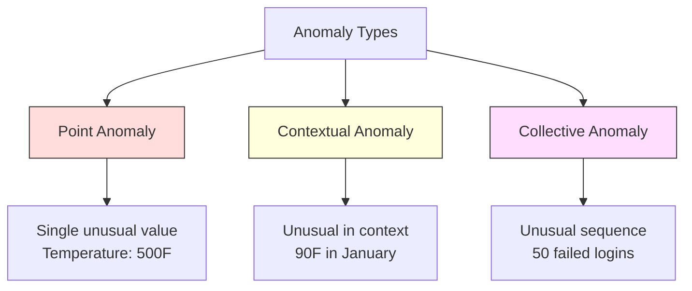
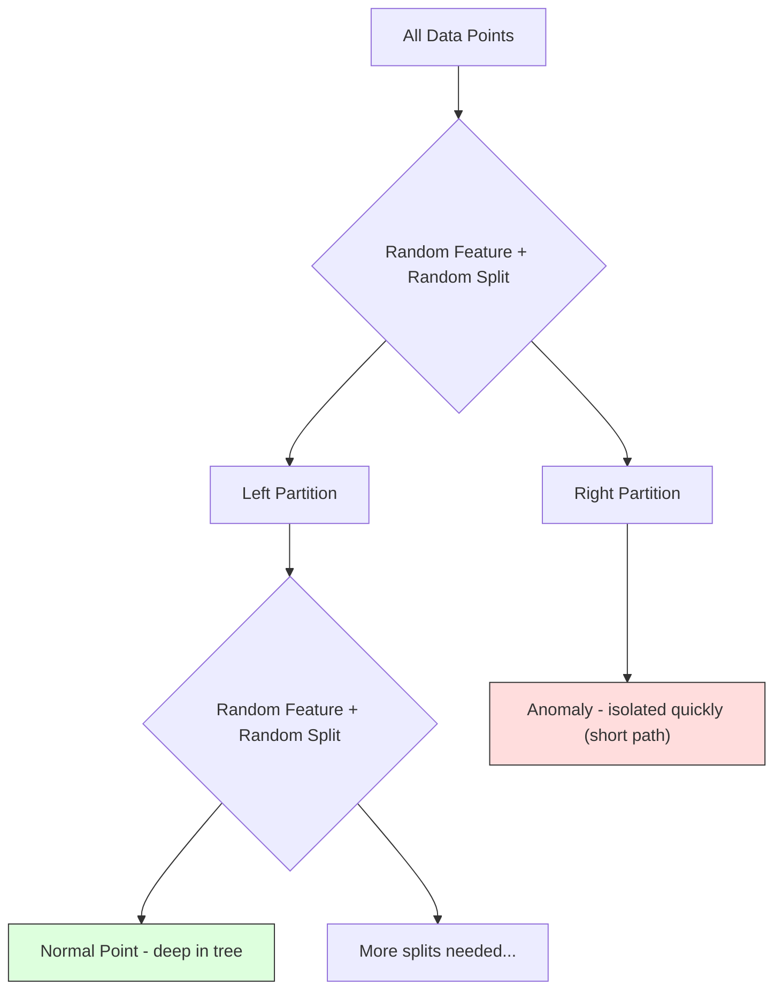
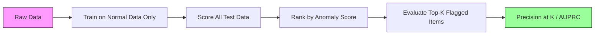

# 异常检测

> 正常很容易定义。异常就是不符合正常的一切。

**Type:** Build
**Language:** Python
**Prerequisites:** Phase 2, Lessons 01-09
**Time:** 约75分钟

## 学习目标

- 从零实现 Z-score、IQR 和 Isolation Forest 异常检测方法
- 区分点异常、上下文异常和集体异常，并为每种异常选择合适的检测方法
- 解释为什么异常检测被建模为对正常数据的建模，而不是对异常的分类
- 比较无监督异常检测与有监督分类，并权衡对新型异常的覆盖能力与精确率

## 问题

一张信用卡下午2点在纽约被使用，下午2:05却在东京被使用。一个工厂传感器读数为150度，而正常范围是80–120度。一台服务器每秒收到50,000个请求，而日均只有200个。

这些都是异常。发现它们很重要。欺诈造成数十亿美元的损失。设备故障导致停机。网络入侵导致数据泄露。

挑战在于：你很少有带标签的异常样本。欺诈交易只占全部交易的0.1%。设备故障一年只发生几次。你无法训练一个标准分类器，因为“异常”类中几乎没有可学习的样本。即使你有一些标签，你见过的异常类型也不是你将来会遇到的所有类型。明天的欺诈手段会和今天的不一样。

异常检测把问题反转了。不是学习什么是异常，而是学习什么是正常。任何偏离正常的东西都是可疑的。这种方法不需要标签，能适应新型异常，并且可以扩展到海量数据集。

## 核心概念

### 异常的类型

并非所有异常都相同：

- **点异常。** 无论上下文如何都显得异常的单个数据点。比如500度的温度读数。比如 $50,000 from an account that normally spends $50 的交易。
- **上下文异常。** 在特定上下文中才显得异常的数据点。90度的温度在夏天是正常的，在冬天是异常的。相同的数值，不同的上下文。
- **集体异常。** 作为整体显得异常的数据点序列，尽管其中每个点单独看可能都是正常的。五次登录失败是正常的。连续五十次则是暴力破解攻击。

大多数方法检测的是点异常。上下文异常需要时间或位置特征。集体异常需要具备序列感知能力的方法。



### 无监督的建模方式

在标准分类中，你拥有两个类别的标签。而在异常检测中，你通常面临以下三种情况之一：

1. **完全无监督。** 完全没有标签。你在全部数据上拟合检测器，并期望异常足够稀少，不会破坏“正常”模型。
2. **半监督。** 你有一个只包含正常数据的干净数据集。你在这份干净数据上拟合，然后对其余所有数据进行评分。这是最强有力的设置（如果可行）。
3. **弱监督。** 你有少量带标签的异常。将它们用于评估，而不是训练。先进行无监督训练，然后在带标签的子集上衡量精确率/召回率。

关键洞察：异常检测与分类有本质区别。你建模的是正常数据的分布，而不是两个类别之间的决策边界。

### 有监督 vs 无监督：权衡

如果你确实有带标签的异常，应该把它们用于训练（有监督分类），还是仅用于评估（无监督检测）？

**有监督（当作分类问题）：**
- 能捕获你以前见过的确切异常类型
- 对已知异常类型有更高的精确率
- 完全无法发现新型异常
- 出现新异常类型时需要重新训练
- 需要足够的异常样本（通常太少）

**无监督（建模正常，标记偏离）：**
- 能捕获任何对正常的偏离，包括新型异常
- 不需要带标签的异常
- 误报率更高（并非所有不寻常的东西都是坏事）
- 对分布漂移更鲁棒

在实践中，最好的系统会结合两者：用无监督检测实现广泛覆盖，用有监督模型处理已知的高优先级异常类型，再由人工审核处理模棱两可的情况。

### Z-Score 方法

最简单的方法。计算每个特征的均值和标准差，标记任何偏离均值超过k个标准差的点。

```text
z_score = (x - mean) / std
anomaly if |z_score| > threshold
```

默认阈值是3.0（对于高斯分布，99.7%的正常数据落在3个标准差以内）。

**优点：** 简单。快速。可解释（“这个值偏离正常4.5个标准差”）。

**缺点：** 假设数据服从正态分布。对训练数据中的离群点敏感（离群点会移动均值并膨胀标准差，使它们更难被检测）。在多峰分布上失效。

**适用场景：** 数据大致呈钟形分布的单特征监控。服务器响应时间、制造公差、基线稳定的传感器读数。

**失效场景：** 多簇数据（两个基线温度不同的办公地点）、偏态数据（1000美元的交易很少见但并非异常）、训练集中含离群点的数据。

### IQR 方法

比 Z-score 更鲁棒。使用四分位距代替均值和标准差。

```
Q1 = 25th percentile
Q3 = 75th percentile
IQR = Q3 - Q1
lower_bound = Q1 - factor * IQR
upper_bound = Q3 + factor * IQR
anomaly if x < lower_bound or x > upper_bound
```

默认系数是1.5。

**优点：** 对离群点鲁棒（百分位数不受极端值影响）。适用于偏态分布。不假设正态性。

**缺点：** 仅限单变量（对每个特征独立应用）。无法检测只有综合考虑多个特征时才显得异常的情况（一个点在每个特征上单独看都正常，但在联合空间中却是异常的）。

**实践提示：** IQR 中的1.5系数对应箱线图中的须。须之外的点是潜在的离群点。用3.0代替1.5会使检测器更保守（更少的标记，更少的误报）。合适的系数取决于你对误报的容忍度。

### Isolation Forest

关键洞察：异常既稀少又不同。在数据的随机划分中，异常更容易被隔离——它们只需要更少的随机切分就能与其余数据分开。



**工作原理：**
1. 构建许多随机树（一片 isolation forest）
2. 在每个节点，随机选择一个特征，并在该特征的最小值和最大值之间随机选择一个切分值
3. 持续切分，直到每个点都被隔离（位于自己的叶节点中）
4. 异常在所有树上的平均路径长度更短

**为什么有效：** 正常点位于密集区域。要把一个正常点与邻居隔离开，需要很多次随机切分。异常点位于稀疏区域。一两次随机切分就足以隔离它们。

异常得分基于所有树上的平均路径长度，并以随机二叉搜索树的期望路径长度进行归一化：

```
score(x) = 2^(-average_path_length(x) / c(n))
```

其中 `c(n)` 是 n 个样本的期望路径长度。得分接近1表示异常。得分接近0.5表示正常。得分接近0表示非常正常（深处于密集簇中）。

**优点：** 无分布假设。适用于高维数据。扩展性好（每棵树使用子样本，因此关于样本量是次线性的）。能处理混合特征类型。

**缺点：** 难以检测位于密集区域中的异常（掩蔽效应）。当许多特征无关时，随机切分的效率会降低。

**关键超参数：**
- `n_estimators`：树的数量。100通常足够。更多的树使得分更稳定，但计算更慢。
- `max_samples`：每棵树的样本数。原始论文中默认为256。更小的值会降低单棵树的准确性，但会增加多样性。子采样正是 Isolation Forest 快速的原因——每棵树只看到一小部分数据。
- `contamination`：预期的异常比例。仅用于设定阈值。不影响得分本身。

### 局部离群因子 (LOF)

LOF 将一个点周围的局部密度与其邻居周围的密度进行比较。位于稀疏区域、但被密集区域包围的点是异常的。

**工作原理：**
1. 对每个点，找出其 k 个最近邻
2. 计算局部可达密度（邻域有多密集）
3. 将每个点的密度与其邻居的密度进行比较
4. 如果一个点的密度远低于其邻居，它就是离群点

**LOF 得分：**
- LOF 接近1.0表示与邻居密度相似（正常）
- LOF 大于1.0表示密度低于邻居（可能异常）
- LOF 远大于1.0（例如2.0以上）表示密度显著更低（很可能是异常）

“局部”这一点至关重要。考虑一个包含两个簇的数据集：一个由1000个点组成的密集簇和一个由50个点组成的稀疏簇。稀疏簇边缘的一个点从全局来看并不异常——它有50个邻居。但如果它的直接邻居比它更密集，那么它在局部是异常的。LOF 能捕捉到全局方法所忽略的这种细微差别。

**优点：** 能检测局部异常（在其邻域内异常的点，即使它们在全局上并不异常）。适用于密度不同的簇。

**缺点：** 在大数据集上很慢（朴素实现为 O(n^2)）。对 k 的选择敏感。在极高维空间中效果不佳（维度灾难会影响距离计算）。

### 方法比较

| 方法 | 假设 | 速度 | 高维处理能力 | 检测局部异常 |
|--------|------------|-------|-------------------|------------------------|
| Z-score | 正态分布 | 非常快 | 是（逐特征） | 否 |
| IQR | 无（逐特征） | 非常快 | 是（逐特征） | 否 |
| Isolation Forest | 无 | 快 | 是 | 部分 |
| LOF | 距离有意义 | 慢 | 较差 | 是 |

### 评估的挑战

评估异常检测器比评估分类器更难：

- **极端的类别不平衡。** 当异常占0.1%时，把所有样本都预测为“正常”就能达到99.9%的准确率。准确率毫无用处。
- **AUROC 具有误导性。** 在严重不平衡的情况下，即使在实用阈值下模型漏掉了大部分异常，AUROC 看起来也可能不错。
- **更好的指标：** Precision@k（在被标记的前k个项目中，有多少是真正的异常）、AUPRC（精确率-召回率曲线下面积），以及固定误报率下的召回率。



### 异常检测流水线

在实践中，异常检测遵循以下工作流程：

1. **收集基线数据。** 理想情况下，是一段你知道没有（或极少）异常的时期。
2. **特征工程。** 原始特征加上派生特征（滚动统计、时间特征、比值）。
3. **训练检测器。** 在基线数据上拟合。模型学习“正常”是什么样子。
4. **对新数据评分。** 每个新观测都会得到一个异常得分。
5. **阈值选择。** 选择得分截断值。这是一个业务决策：更高的阈值意味着更少的误报，但也意味着更多漏掉的异常。
6. **告警与调查。** 被标记的点交给人工审核或自动响应。
7. **反馈收集。** 记录被标记的项目是真正的异常还是误报。利用这些数据评估检测器，并随时间调整阈值。

这条流水线永远不会“完成”。数据分布会漂移，新的异常类型会出现，阈值需要调整。要把异常检测当作一个持续运行的系统，而不是一次性的模型。

```figure
f3-anomaly-fence
```

## 动手实现

`code/anomaly_detection.py` 中的代码从零实现了 Z-score、IQR 和 Isolation Forest。

### Z-Score 检测器

```python
def zscore_detect(X, threshold=3.0):
    mean = X.mean(axis=0)
    std = X.std(axis=0)
    std[std == 0] = 1.0
    z = np.abs((X - mean) / std)
    return z.max(axis=1) > threshold
```

简单且向量化。只要任何一个特征超过阈值，就标记该点。

### IQR 检测器

```python
def iqr_detect(X, factor=1.5):
    q1 = np.percentile(X, 25, axis=0)
    q3 = np.percentile(X, 75, axis=0)
    iqr = q3 - q1
    iqr[iqr == 0] = 1.0
    lower = q1 - factor * iqr
    upper = q3 + factor * iqr
    outside = (X < lower) | (X > upper)
    return outside.any(axis=1)
```

### 从零实现 Isolation Forest

从零实现会构建随机划分特征空间的 isolation trees：

```python
class IsolationTree:
    def __init__(self, max_depth):
        self.max_depth = max_depth

    def fit(self, X, depth=0):
        n, p = X.shape
        if depth >= self.max_depth or n <= 1:
            self.is_leaf = True
            self.size = n
            return self
        self.is_leaf = False
        self.feature = np.random.randint(p)
        x_min = X[:, self.feature].min()
        x_max = X[:, self.feature].max()
        if x_min == x_max:
            self.is_leaf = True
            self.size = n
            return self
        self.threshold = np.random.uniform(x_min, x_max)
        left_mask = X[:, self.feature] < self.threshold
        self.left = IsolationTree(self.max_depth).fit(X[left_mask], depth + 1)
        self.right = IsolationTree(self.max_depth).fit(X[~left_mask], depth + 1)
        return self
```

隔离一个点所需的路径长度决定其异常得分。路径越短，越可能是异常。

`IsolationForest` 类封装了多棵树：

```python
class IsolationForest:
    def __init__(self, n_estimators=100, max_samples=256, seed=42):
        self.n_estimators = n_estimators
        self.max_samples = max_samples

    def fit(self, X):
        sample_size = min(self.max_samples, X.shape[0])
        max_depth = int(np.ceil(np.log2(sample_size)))
        for _ in range(self.n_estimators):
            idx = rng.choice(X.shape[0], size=sample_size, replace=False)
            tree = IsolationTree(max_depth=max_depth)
            tree.fit(X[idx])
            self.trees.append(tree)

    def anomaly_score(self, X):
        avg_path = average path length across all trees
        scores = 2.0 ** (-avg_path / c(max_samples))
        return scores
```

归一化因子 `c(n)` 是含 n 个元素的二叉搜索树中一次不成功搜索的期望路径长度。它等于 `2 * H(n-1) - 2*(n-1)/n`，其中 `H` 是调和数。这种归一化确保得分在不同大小的数据集之间具有可比性。

### 演示场景

代码生成了多个测试场景：

1. **单簇加离群点。** 一个二维高斯簇，异常点被注入到远离中心的位置。所有方法在这里都应该有效。
2. **多峰数据。** 三个大小和密度不同的簇。簇之间的点是异常的。Z-score 会遇到困难，因为逐特征的范围很宽。
3. **高维数据。** 50个特征，但异常只在其中5个特征上有所不同。测试各方法能否在特征子集中发现异常。

每个演示都使用 precision、recall、F1 和 Precision@k 对所有方法进行比较。

## 使用库

使用 sklearn（使用库实现，而非从零实现）：

```python
from sklearn.ensemble import IsolationForest
from sklearn.neighbors import LocalOutlierFactor

iso = IsolationForest(n_estimators=100, contamination=0.05, random_state=42)
iso.fit(X_train)
predictions = iso.predict(X_test)

lof = LocalOutlierFactor(n_neighbors=20, contamination=0.05, novelty=True)
lof.fit(X_train)
predictions = lof.predict(X_test)
```

注意 `contamination` 设置了预期的异常比例。正确设置它很重要——设得太低会漏掉异常，设得太高会产生误报。

`anomaly_detection.py` 中的代码在同一数据上将从零实现与 sklearn 进行比较。

### sklearn 的 contamination 参数

sklearn 中的 `contamination` 参数决定了将连续异常得分转换为二元预测的阈值。它不会改变底层的得分。

```python
iso_5 = IsolationForest(contamination=0.05)
iso_10 = IsolationForest(contamination=0.10)
```

两者产生相同的异常得分。但 `iso_5` 标记前5%，而 `iso_10` 标记前10%。如果你不知道真实的异常率（通常你不知道），就把 contamination 设为 "auto"，并直接使用原始得分。根据误报和漏报之间的成本权衡，自行设定阈值。

### One-Class SVM

另一种值得了解的无监督异常检测器。One-Class SVM 在高维特征空间中（使用核技巧）围绕正常数据拟合一个边界。

```python
from sklearn.svm import OneClassSVM

oc_svm = OneClassSVM(kernel="rbf", gamma="auto", nu=0.05)
oc_svm.fit(X_train)
predictions = oc_svm.predict(X_test)
```

`nu` 参数近似于异常的比例。One-Class SVM 在中小型数据集上效果很好，但无法扩展到非常大的数据（核矩阵呈二次增长）。

### 自编码器方法（预览）

自编码器是学习压缩和重建数据的神经网络。在正常数据上训练。在测试时，异常具有很高的重建误差，因为网络只学会了重建正常模式。

这将在 Phase 3（深度学习）中介绍，但原理是相同的：建模什么是正常的，标记偏离正常的东西。

### 集成异常检测

正如集成方法能改进分类（Lesson 11），组合多个异常检测器也能改进检测。最简单的方法：

1. 运行多个检测器（Z-score、IQR、Isolation Forest、LOF）
2. 将每个检测器的得分归一化到 [0, 1]
3. 对归一化后的得分取平均
4. 标记平均得分超过阈值的点

这可以减少误报，因为不同方法有不同的失效模式。被所有四种方法同时标记的点几乎肯定是异常的。只被一种方法标记的点可能是该方法特有的怪异行为。

更复杂的集成方法会根据每个检测器的估计可靠性（如有已知异常的验证集，可在其上测量）对它们进行加权。

### 生产环境考量

1. **阈值漂移。** 随着数据分布漂移，固定阈值会变得过时。监控异常得分的分布并定期调整。
2. **告警疲劳。** 太多误报会让运维人员不再关注。从高阈值开始（更少但更可靠的告警），随着信任的建立逐步降低。
3. **集成方法。** 在生产环境中，组合多个检测器。只有当多个方法一致认为某个点异常时才标记它。这能显著减少误报。
4. **特征工程。** 原始特征很少足够。添加滚动统计、比值、距上次事件的时间以及领域特定特征。好的特征集比检测器的选择更重要。
5. **反馈闭环。** 当运维人员调查被标记的项目并确认或驳回时，将这些信息反馈到系统中。随时间积累带标签的数据，以评估和改进检测器。

## 交付成果

本课产出：
- `outputs/skill-anomaly-detector.md` -- 选择合适检测器的决策技能
- `code/anomaly_detection.py` -- 从零实现的 Z-score、IQR 和 Isolation Forest，并与 sklearn 进行比较

### 阈值的选择

异常得分是连续的。你需要一个阈值来做二元决策。这是业务决策，而不是技术决策。

考虑两种场景：
- **欺诈检测。** 漏掉欺诈的代价很高（拒付、客户信任）。误报只消耗人工分析师5分钟的调查时间。把阈值设低以捕获更多欺诈，接受更多误报。
- **设备维护。** 一次误报意味着一次不必要的停机，损失 $50,000. A missed failure means a $500,000的修理费。把阈值设在这两种成本之间来平衡。

在这两种情况下，最优阈值都取决于误报和漏报之间的成本比。绘制不同阈值下的 precision 和 recall，叠加成本函数，选择成本最低的点。

### 扩展到生产环境

生产环境中的实时异常检测：

1. **批量训练，在线评分。** 定期（每天、每周）在最近的正常数据上训练模型。每条新观测到达时立即评分。
2. **特征计算必须匹配。** 如果你用30天的滚动统计进行训练，那么为一条新观测计算特征就需要30天的历史数据。缓冲所需的历史数据。
3. **得分分布监控。** 随时间追踪异常得分的分布。如果中位得分向上漂移，要么数据在变化，要么模型已经过时。
4. **可解释性。** 标记异常时，说明原因。Z-score：“特征X高于正常4.2个标准差。” Isolation Forest：“这个点平均只需3.1次切分就被隔离（正常点需要8.5次）。”

## 练习

1. **阈值调优。** 以1.0到5.0、步长0.5的阈值运行 Z-score 检测器。绘制每个阈值下的 precision 和 recall。你的数据的最佳平衡点在哪里？

2. **多变量异常。** 构造二维数据，使每个特征单独看都正常，但组合起来是异常的（例如远离主簇对角线的点）。展示按特征计算的 Z-score 会漏掉这些异常，而 Isolation Forest 能捕获它们。

3. **从零实现 LOF。** 使用 k 近邻实现 Local Outlier Factor。在同一数据上与 sklearn 的 LocalOutlierFactor 进行比较。分别使用 k=10 和 k=50——k 的选择如何影响结果？

4. **流式异常检测。** 修改 Z-score 检测器使其适用于流式场景：随着新点的到来更新运行中的均值和方差（Welford 在线算法）。在同一数据上与批量 Z-score 进行比较。

5. **真实世界评估。** 找一个包含已知异常的数据集（例如 Kaggle 上的信用卡欺诈数据）。使用 precision@100、precision@500 和 AUPRC 评估全部四种方法。哪种方法效果最好？为什么？

## 关键术语

| 术语 | 人们的说法 | 实际含义 |
|------|----------------|----------------------|
| 异常 | “离群点、不寻常的点” | 显著偏离正常数据预期模式的数据点 |
| 点异常 | “单个奇怪的值” | 无论上下文如何都显得异常的单个观测 |
| 上下文异常 | “数值正常，上下文错误” | 在其上下文（时间、位置等）中显得异常、但在其他上下文中可能正常的观测 |
| Isolation Forest | “用随机切分找离群点” | 由随机树组成的集成，用比正常点更少的切分来隔离异常 |
| Local Outlier Factor | “与邻居比较密度” | 标记局部密度远低于其邻居密度的点的方法 |
| Z-score | “距均值的标准差数” | (x - mean) / std，以标准差为单位衡量一个点离中心有多远 |
| IQR | “四分位距” | Q3 - Q1，衡量数据中间50%的离散程度，用于鲁棒的离群点检测 |
| Contamination | “预期的异常比例” | 一个超参数，告诉检测器应该将多大比例的数据标记为异常 |
| Precision@k | “前k个标记中有多少是真的” | 仅在最可疑的k个点上计算的精确率，适用于不平衡的异常检测 |
| AUPRC | “精确率-召回率曲线下面积” | 汇总所有阈值下精确率-召回率表现的指标，在数据不平衡时优于 AUROC |

## 延伸阅读

- [Liu et al., Isolation Forest (2008)](https://cs.nju.edu.cn/zhouzh/zhouzh.files/publication/icdm08b.pdf) -- Isolation Forest 原始论文
- [Breunig et al., LOF: Identifying Density-Based Local Outliers (2000)](https://dl.acm.org/doi/10.1145/342009.335388) -- LOF 原始论文
- [scikit-learn Outlier Detection docs](https://scikit-learn.org/stable/modules/outlier_detection.html) -- 所有 sklearn 异常检测器的概览
- [Chandola et al., Anomaly Detection: A Survey (2009)](https://dl.acm.org/doi/10.1145/1541880.1541882) -- 异常检测方法的全面综述
- [Goldstein and Uchida, A Comparative Evaluation of Unsupervised Anomaly Detection Algorithms (2016)](https://journals.plos.org/plosone/article?id=10.1371/journal.pone.0152173) -- 10种方法在真实数据集上的实证比较