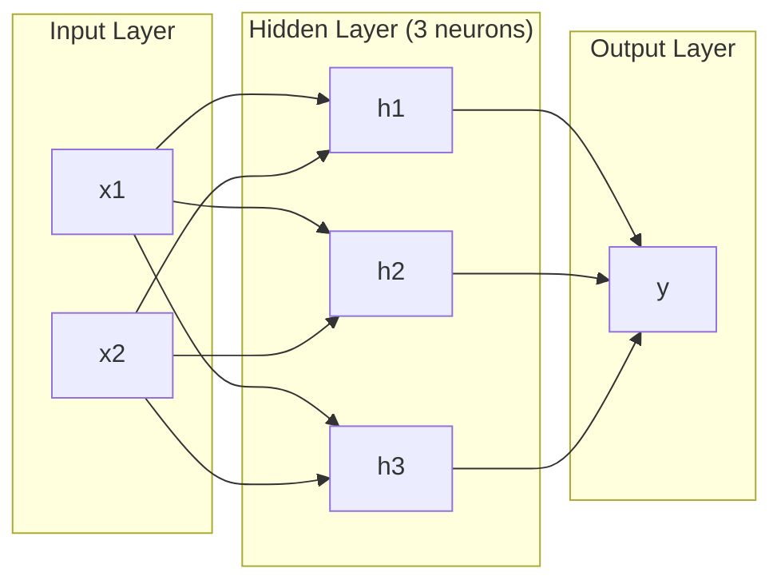
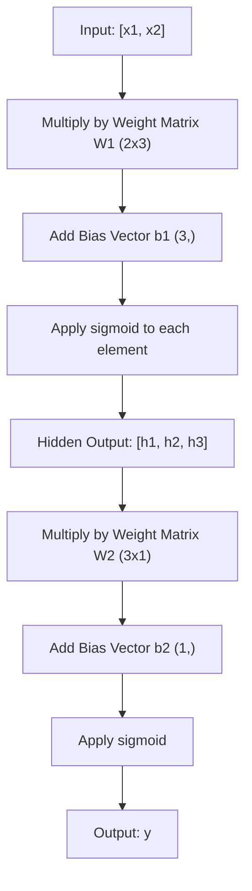
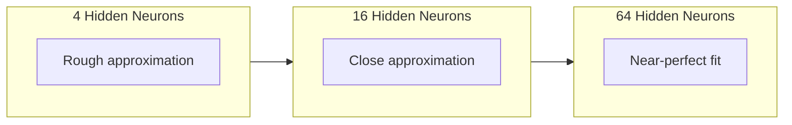

# 多层网络与前向传播

> 一个神经元画一条线。把它们堆叠起来，你就能画出任何东西。

**Type:** Build
**Languages:** Python
**Prerequisites:** 阶段 01(数学基础)，课程 03.01(感知机)
**Time:** 约 90 分钟

## 学习目标

- 使用 Layer 和 Network 类从零构建一个多层网络，并完成完整的 forward pass
- 追踪矩阵维度在网络各层之间的传递，识别形状不匹配的问题
- 解释堆叠非线性激活如何使网络能够学习弯曲的决策边界
- 使用 2-2-1 架构和手动调好的 sigmoid 权重解决 XOR 问题

## 问题所在

单个神经元就是一个画线器。仅此而已。它在你的数据中画一条直线。AI 中的每个真实问题——图像识别、语言理解、下围棋——都需要曲线。把神经元堆叠成层，就是你获得曲线的方式。

1969 年，Minsky 和 Papert 证明了这个局限是致命的：单层网络无法学习 XOR。不是“难以学习”——而是数学上不可能。XOR 真值表把 [0,1] 和 [1,0] 放在一侧，[0,0] 和 [1,1] 放在另一侧。没有任何一条直线能把它们分开。

这使得神经网络的研究经费枯竭了十多年。事后看来，解决办法显而易见：别只用一层。把神经元堆叠成层。让第一层把输入空间刻画成新的特征，让第二层把这些特征组合成单条直线无法做出的决策。

这个堆叠结构就是多层网络。它是当今生产环境中每一个深度学习模型的基础。forward pass——数据从输入流经隐藏层到达输出——是让其他一切工作之前你需要构建的第一件事。

## 核心概念

### 层：输入层、隐藏层、输出层

一个多层网络有三种类型的层：

**输入层**——并不是真正的层。它存放你的原始数据。两个特征意味着两个输入节点。这里不进行任何计算。

**隐藏层**——真正干活的地方。每个神经元接收上一层的所有输出，应用权重和偏置，然后把结果通过一个激活函数。之所以叫“隐藏”，是因为你在训练数据中永远看不到这些值。

**输出层**——最终答案。对于二分类，是一个带 sigmoid 的神经元。对于多分类，每个类别一个神经元。



这是一个 2-3-1 网络。两个输入，三个隐藏神经元，一个输出。每条连接都有一个权重。每个神经元(输入除外)都有一个偏置。

每层产出一个数字向量，称为 hidden state。对于文本，hidden state 增加维度——把一个词编码为 768 个数字以捕捉语义。对于图像，它们降低维度——把数百万像素压缩成可管理的表示。hidden state 就是学习发生的地方。

### 神经元与激活

每个神经元做三件事：

1. 把每个输入乘以对应的权重
2. 求所有乘积之和并加上偏置
3. 把总和通过一个激活函数

目前，激活函数是 sigmoid:

```
sigmoid(z) = 1 / (1 + e^(-z))
```

Sigmoid 把任何数字压缩到 (0, 1) 区间。大的正数输入推向 1。大的负数输入推向 0。零映射到 0.5。正是这条平滑曲线使学习成为可能——与感知机的硬阶跃不同，sigmoid 处处都有梯度。

### 前向传播：数据如何流动

forward pass 把输入数据逐层推过网络，直到到达输出。forward pass 期间没有任何学习发生。它是纯计算：相乘、相加、激活、重复。



在每一层，三个操作依次发生：

```
z = W * input + b       (linear transformation)
a = sigmoid(z)           (activation)
```

一层的输出成为下一层的输入。这就是 forward pass 的全部内容。

### 矩阵维度

追踪维度是深度学习中最重要的调试技能。以下是 2-3-1 网络：

| 步骤 | 操作 | 维度 | 结果形状 |
|------|-----------|------------|-------------|
| 输入 | x | -- | (2,) |
| 隐藏层线性 | W1 * x + b1 | W1: (3, 2), b1: (3,) | (3,) |
| 隐藏层激活 | sigmoid(z1) | -- | (3,) |
| 输出层线性 | W2 * h + b2 | W2: (1, 3), b2: (1,) | (1,) |
| 输出层激活 | sigmoid(z2) | -- | (1,) |

规则：第 k 层的权重矩阵 W 的形状为 (neurons_in_layer_k, neurons_in_layer_k_minus_1)。行对应当前层。列对应上一层。如果形状对不上，那就是有 bug。

### 通用近似定理

1989 年，George Cybenko 证明了一个了不起的结论：一个只有一个隐藏层但神经元足够多的神经网络，可以以任意精度近似任何连续函数。

这并不意味着一个隐藏层总是最优的。它只说明这种架构在理论上是可行的。在实践中，更深的网络(层数更多，每层神经元更少)能用比浅而宽的网络少得多的总参数学习相同的函数。这就是深度学习有效的原因。

直观理解：隐藏层中的每个神经元学习一个“隆起”或特征。在正确位置放置足够多的隆起，就能近似任何平滑曲线。神经元越多，隆起越多，近似越好。



### 可组合性

神经网络是可组合的。你可以堆叠它们、串联它们、并行运行它们。Whisper 模型使用一个 encoder 网络处理音频，并使用一个单独的 decoder 网络生成文本。现代 LLM 是 decoder-only 的。BERT 是 encoder-only 的。T5 是 encoder-decoder。架构的选择决定了模型能做什么。

```figure
mlp-forward
```

## 动手构建

纯 Python。不用 numpy。每个矩阵操作都从零开始编写。

### 第 1 步：Sigmoid 激活

```python
import math

def sigmoid(x):
    x = max(-500.0, min(500.0, x))
    return 1.0 / (1.0 + math.exp(-x))
```

限定在 [-500, 500] 范围内是为了防止溢出。`math.exp(500)` 很大但是有限的。`math.exp(1000)` 是无穷大。

### 第 2 步：Layer 类

深度学习中最核心的操作是矩阵乘法。每个层、每个注意力头、每个 forward pass——归根结底都是 matmul。一个 linear layer 接收输入向量，乘以一个权重矩阵，再加上一个偏置向量：y = Wx + b。这单个等式占了一个神经网络 90% 的计算量。

一个层持有一个权重矩阵和一个偏置向量。它的 forward 方法接收输入向量并返回激活后的输出。

```python
class Layer:
    def __init__(self, n_inputs, n_neurons, weights=None, biases=None):
        if weights is not None:
            self.weights = weights
        else:
            import random
            self.weights = [
                [random.uniform(-1, 1) for _ in range(n_inputs)]
                for _ in range(n_neurons)
            ]
        if biases is not None:
            self.biases = biases
        else:
            self.biases = [0.0] * n_neurons

    def forward(self, inputs):
        self.last_input = inputs
        self.last_output = []
        for neuron_idx in range(len(self.weights)):
            z = sum(
                w * x for w, x in zip(self.weights[neuron_idx], inputs)
            )
            z += self.biases[neuron_idx]
            self.last_output.append(sigmoid(z))
        return self.last_output
```

权重矩阵的形状是 (n_neurons, n_inputs)。每一行是一个神经元对应所有输入的权重。forward 方法遍历神经元，计算加权和加偏置，应用 sigmoid,并收集结果。

### 第 3 步：Network 类

一个网络就是层的列表。forward pass 把它们串联起来：第 k 层的输出送入第 k+1 层。

```python
class Network:
    def __init__(self, layers):
        self.layers = layers

    def forward(self, inputs):
        current = inputs
        for layer in self.layers:
            current = layer.forward(current)
        return current
```

这就是整个 forward pass。四行逻辑。数据进去，流过每一层，从另一端出来。

### 第 4 步：用手调权重解决 XOR

在课程 01 中，我们通过组合 OR、NAND 和 AND 感知机解决了 XOR。现在用我们的 Layer 和 Network 类做同样的事情。2-2-1 架构：两个输入，两个隐藏神经元，一个输出。

```python
hidden = Layer(
    n_inputs=2,
    n_neurons=2,
    weights=[[20.0, 20.0], [-20.0, -20.0]],
    biases=[-10.0, 30.0],
)

output = Layer(
    n_inputs=2,
    n_neurons=1,
    weights=[[20.0, 20.0]],
    biases=[-30.0],
)

xor_net = Network([hidden, output])

xor_data = [
    ([0, 0], 0),
    ([0, 1], 1),
    ([1, 0], 1),
    ([1, 1], 0),
]

for inputs, expected in xor_data:
    result = xor_net.forward(inputs)
    predicted = 1 if result[0] >= 0.5 else 0
    print(f"  {inputs} -> {result[0]:.6f} (rounded: {predicted}, expected: {expected})")
```

大的权重 (20, -20) 使 sigmoid 的行为像一个阶跃函数。第一个隐藏神经元近似 OR。第二个近似 NAND。输出神经元把它们组合成 AND,也就是 XOR。

### 第 5 步：圆形分类

一个更难的问题：把 2D 点分类为在半径 0.5、圆心在原点的圆内还是圆外。这需要一个弯曲的决策边界——单个感知机做不到。

```python
import random
import math

random.seed(42)

data = []
for _ in range(200):
    x = random.uniform(-1, 1)
    y = random.uniform(-1, 1)
    label = 1 if (x * x + y * y) < 0.25 else 0
    data.append(([x, y], label))

circle_net = Network([
    Layer(n_inputs=2, n_neurons=8),
    Layer(n_inputs=8, n_neurons=1),
])
```

使用随机权重，网络的分类效果不会好。但 forward pass 仍然可以运行。这正是重点——forward pass 只是计算。学习正确的权重是 backpropagation 的事，将在课程 03 中介绍。

```python
correct = 0
for inputs, expected in data:
    result = circle_net.forward(inputs)
    predicted = 1 if result[0] >= 0.5 else 0
    if predicted == expected:
        correct += 1

print(f"Accuracy with random weights: {correct}/{len(data)} ({100*correct/len(data):.1f}%)")
```

随机权重给出的准确率很差——通常比猜多数类还差。经过训练后(课程 03),同样这个带 8 个隐藏神经元的架构将画出一个弯曲的边界，把圆内和圆外分开。

## 使用它

PyTorch 用四行代码就能完成上面的所有事情：

```python
import torch
import torch.nn as nn

model = nn.Sequential(
    nn.Linear(2, 8),
    nn.Sigmoid(),
    nn.Linear(8, 1),
    nn.Sigmoid(),
)

x = torch.tensor([[0.0, 0.0], [0.0, 1.0], [1.0, 0.0], [1.0, 1.0]])
output = model(x)
print(output)
```

`nn.Linear(2, 8)` 就是你的 Layer 类：形状为 (8, 2) 的权重矩阵，形状为 (8,) 的偏置向量。`nn.Sigmoid()` 是逐元素应用的 sigmoid 函数。`nn.Sequential` 就是你的 Network 类：按顺序串联各层。

区别在于速度和规模。PyTorch 运行在 GPU 上，处理数百万样本的批次，并自动为 backpropagation 计算梯度。但 forward pass 的逻辑与你刚刚从零构建的完全相同。

## 发布它

本课程产出一个可复用的 prompt,用于设计网络架构：

- `outputs/prompt-network-architect.md`

当你需要为给定问题决定多少层、每层多少个神经元、以及使用哪些激活函数时，可以使用它。

## 练习

1. 构建一个 2-4-2-1 网络(两个隐藏层)，用随机权重在 XOR 数据上运行 forward pass。打印中间隐藏层的输出，观察表示在每一层如何变换。

2. 把圆形分类器的隐藏层大小从 8 改为 2,再改为 32。每次都用随机权重运行 forward pass。隐藏神经元的数量会改变输出的范围或分布吗？为什么？

3. 在 Network 类上实现一个 `count_parameters` 方法，返回可训练的权重和偏置的总数。在一个 784-256-128-10 网络(经典的 MNIST 架构)上测试它。它有多少个参数？

4. 为一个 3-4-4-2 网络构建 forward pass。输入 RGB 颜色值(归一化到 0-1),观察两个输出。这就是一个两分类的简单颜色分类器的架构。

5. 用一个 "leaky step" 函数替换 sigmoid:当 z < 0 时返回 0.01 * z,否则返回 1.0。在第 4 步中用相同的手调权重在 XOR 上运行 forward pass。它还能工作吗？为什么平滑的 sigmoid 比硬阈值更受青睐？

## 关键术语

| 术语 | 人们怎么说 | 它的实际含义 |
|------|----------------|----------------------|
| Forward pass | “运行模型” | 把输入推过每一层——乘以权重、加偏置、激活——以产生输出 |
| 隐藏层 | “中间那部分” | 输入和输出之间的任意层，其值在数据中不被直接观测 |
| 多层网络 | “一个深度神经网络” | 按顺序堆叠的神经元层，每层的输出作为下一层的输入 |
| 激活函数 | “非线性” | 在线性变换之后应用的函数，为决策边界引入曲线 |
| Sigmoid | “S 形曲线” | sigma(z) = 1/(1+e^(-z)),把任何实数压缩到 (0,1),平滑且处处可微 |
| 权重矩阵 | “参数” | 形状为 (current_layer_neurons, previous_layer_neurons) 的矩阵 W,包含可学习的连接强度 |
| 偏置向量 | “偏移量” | 在矩阵乘法之后相加的向量，使得即使所有输入为零神经元也能激活 |
| 通用近似 | “神经网络什么都能学” | 一个带足够多神经元的单隐藏层可以近似任何连续函数——但“足够”可能意味着数十亿 |
| 线性变换 | “矩阵乘法那一步” | z = W * x + b,激活之前的计算，把输入映射到一个新空间 |
| 决策边界 | “分类器切换的地方” | 输入空间中网络输出跨越分类阈值的面 |

## 延伸阅读

- Michael Nielsen, "Neural Networks and Deep Learning", 第 1-2 章 (http://neuralnetworksanddeeplearning.com/) —— 关于 forward pass 和网络结构最清晰的免费讲解，配有交互式可视化
- Cybenko, "Approximation by Superpositions of a Sigmoidal Function" (1989) —— 通用近似定理的原始论文，出奇地易读
- 3Blue1Brown, "But what is a neural network?" (https://www.youtube.com/watch?v=aircAruvnKk) —— 20 分钟的可视化讲解，涵盖层、权重和 forward pass,帮助你建立正确的思维模型
- Goodfellow, Bengio, Courville, "Deep Learning", 第 6 章 (https://www.deeplearningbook.org/) —— 多层网络的标准参考，可在线免费阅读