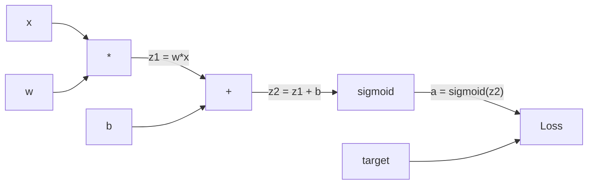
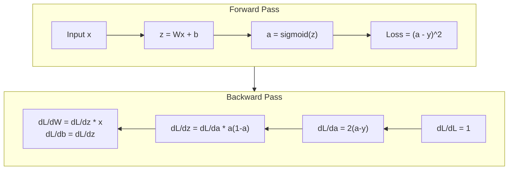
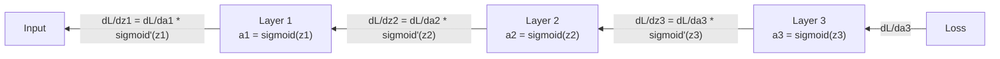

# 从零实现反向传播

> 反向传播是让学习成为可能的算法。没有它,神经网络只是昂贵的随机数生成器。

**Type:** Build
**Languages:** Python
**Prerequisites:** 第 03.02 课(多层网络)
**Time:** 约 120 分钟

## 学习目标

- 实现一个基于 Value 的 autograd 引擎,构建计算图并通过拓扑排序计算梯度
- 使用链式法则推导加法、乘法和 sigmoid 的反向传播过程
- 仅使用你自己从零实现的反向传播引擎,在 XOR 和圆形分类任务上训练多层网络
- 识别深层 sigmoid 网络中的梯度消失问题,并解释为什么梯度会指数级缩小

## 问题

你的网络有一个隐藏层,768 个输入、3072 个输出,也就是 2,359,296 个权重。它做出了一个错误的预测。是哪些权重导致的误差?逐个测试每个权重意味着 230 万次前向传播。而反向传播只需一次反向传播就能算出全部 230 万个梯度。这不是一种优化,而是"可训练"与"不可行"之间的区别。

朴素的做法:取一个权重,给它一个微小的扰动,重新运行前向传播,测量损失是上升还是下降。这就得到了该权重的梯度。然后对网络中的每个权重都这么做。再乘以数千次训练迭代和数百万个数据点。你需要地质纪元的时间才能训练出任何有用的东西。

反向传播解决了这个问题。一次前向传播,一次反向传播,所有梯度计算完毕。诀窍就是微积分中的链式法则,系统地应用于计算图。正是这个算法让深度学习变得实用。没有它,我们至今仍被困在玩具问题上。

## 概念

### 链式法则在网络中的应用

你在阶段 01 第 05 课见过链式法则。快速回顾:若 y = f(g(x)),则 dy/dx = f'(g(x)) * g'(x)。沿着链把导数相乘即可。

在神经网络中,"链"就是从输入到损失的操作序列。每一层应用权重、加上偏置、经过激活函数。损失函数将最终输出与目标进行比较。反向传播沿这条链反向追溯,计算每个操作对误差的贡献。

### 计算图

每次前向传播都会构建一个图。每个节点是一个操作(乘法、加法、sigmoid)。每条边向前传递一个值,向后传递一个梯度。



前向传播:值从左向右流动。x 和 w 产生 z1 = w*x。加上 b 得到 z2。sigmoid 给出激活值 a。用损失函数将 a 与目标 y 比较。

反向传播:梯度从右向左流动。从 dL/da 开始(损失如何随激活值变化)。乘以 da/dz2(sigmoid 的导数),得到 dL/dz2。再拆分为 dL/db(等于 dL/dz2,因为 z2 = z1 + b)和 dL/dz1。然后 dL/dw = dL/dz1 * x,dL/dx = dL/dz1 * w。

图中每个节点在反向传播中只做一件事:接收来自上游的梯度,乘以它的局部导数,再传递给下游。

### 前向与反向



前向传播存储每个中间值:z、a、每层的输入。反向传播需要这些存储的值来计算梯度。这就是反向传播核心的内存-计算权衡:用内存(存储激活值)换速度(一次传播代替数百万次)。

### 梯度在网格中的流动

对于一个 3 层网络,梯度穿过每一层时逐级相乘:



在每一层,梯度都会乘以 sigmoid 的导数。sigmoid 导数为 a * (1 - a),最大值为 0.25(当 a = 0.5 时)。三层深度,梯度最多已被乘以 0.25^3 = 0.0156。十层深度:0.25^10 = 0.000001。

### 梯度消失

这就是梯度消失问题。sigmoid 把输出压缩到 0 和 1 之间,其导数始终小于 0.25。堆叠足够多的 sigmoid 层,梯度就会缩小到零。早期的层几乎学不到东西,因为它们接收到的梯度接近于零。

```
sigmoid(z):     Output range [0, 1]
sigmoid'(z):    Max value 0.25 (at z = 0)

After 5 layers:   gradient * 0.25^5 = 0.001x original
After 10 layers:  gradient * 0.25^10 = 0.000001x original
```

这就是为什么深层 sigmoid 网络几乎无法训练。解决方案——ReLU 及其变体——是第 04 课的主题。现在要理解的是:反向传播本身工作得很好,问题在于它所穿越的对象。

### 推导 2 层网络的梯度

针对一个网络的完整数学推导:输入 x,隐藏层用 sigmoid,输出层用 sigmoid,损失为 MSE。

前向传播:
```
z1 = W1 * x + b1
a1 = sigmoid(z1)
z2 = W2 * a1 + b2
a2 = sigmoid(z2)
L = (a2 - y)^2
```

反向传播(逐步应用链式法则):
```
dL/da2 = 2(a2 - y)
da2/dz2 = a2 * (1 - a2)
dL/dz2 = dL/da2 * da2/dz2 = 2(a2 - y) * a2 * (1 - a2)

dL/dW2 = dL/dz2 * a1
dL/db2 = dL/dz2

dL/da1 = dL/dz2 * W2
da1/dz1 = a1 * (1 - a1)
dL/dz1 = dL/da1 * da1/dz1

dL/dW1 = dL/dz1 * x
dL/db1 = dL/dz1
```

每个梯度都是从损失出发回溯的局部导数的乘积。这就是反向传播的全部。

```figure
backprop-vanishing
```

## 动手构建

### 步骤 1:Value 节点

计算中的每个数字都变成一个 Value。它存储自己的数据、梯度,以及它是如何被创建的(这样它就知道如何反向计算梯度)。

```python
class Value:
    def __init__(self, data, children=(), op=''):
        self.data = data
        self.grad = 0.0
        self._backward = lambda: None
        self._children = set(children)
        self._op = op

    def __repr__(self):
        return f"Value(data={self.data:.4f}, grad={self.grad:.4f})"
```

还没有梯度(0.0),还没有反向函数(空操作)。`_children` 记录产生这个 Value 的其他 Value,以便稍后对图进行拓扑排序。

### 步骤 2:带反向函数的操作

每个操作创建一个新的 Value,并定义梯度如何通过它反向流动。

```python
def __add__(self, other):
    other = other if isinstance(other, Value) else Value(other)
    out = Value(self.data + other.data, (self, other), '+')

    def _backward():
        self.grad += out.grad
        other.grad += out.grad

    out._backward = _backward
    return out

def __mul__(self, other):
    other = other if isinstance(other, Value) else Value(other)
    out = Value(self.data * other.data, (self, other), '*')

    def _backward():
        self.grad += other.data * out.grad
        other.grad += self.data * out.grad

    out._backward = _backward
    return out
```

对于加法:d(a+b)/da = 1,d(a+b)/db = 1。所以两个输入都直接获得输出的梯度。

对于乘法:d(a*b)/da = b,d(a*b)/db = a。每个输入获得对方的值乘以输出梯度。

`+=` 至关重要。一个 Value 可能在多个操作中被使用,它的梯度是所有路径梯度的总和。

### 步骤 3:Sigmoid 与损失

```python
import math

def sigmoid(self):
    x = self.data
    x = max(-500, min(500, x))
    s = 1.0 / (1.0 + math.exp(-x))
    out = Value(s, (self,), 'sigmoid')

    def _backward():
        self.grad += (s * (1 - s)) * out.grad

    out._backward = _backward
    return out
```

sigmoid 的导数:sigmoid(x) * (1 - sigmoid(x))。我们在前向传播中已经算出 sigmoid(x) = s,直接复用,无需额外计算。

```python
def mse_loss(predicted, target):
    diff = predicted + Value(-target)
    return diff * diff
```

单个输出的 MSE:(predicted - target)^2。我们把减法表示为与一个取负的 Value 相加。

### 步骤 4:反向传播

拓扑排序确保我们以正确的顺序处理节点——每个节点的梯度在向外传播之前已被完整累加。

```python
def backward(self):
    topo = []
    visited = set()

    def build_topo(v):
        if v not in visited:
            visited.add(v)
            for child in v._children:
                build_topo(child)
            topo.append(v)

    build_topo(self)
    self.grad = 1.0
    for v in reversed(topo):
        v._backward()
```

从损失开始(梯度 = 1.0,因为 dL/dL = 1)。沿排序后的图反向遍历。每个节点的 `_backward` 将梯度传递给它的子节点。

### 步骤 5:层与网络

```python
import random

class Neuron:
    def __init__(self, n_inputs):
        scale = (2.0 / n_inputs) ** 0.5
        self.weights = [Value(random.uniform(-scale, scale)) for _ in range(n_inputs)]
        self.bias = Value(0.0)

    def __call__(self, x):
        act = sum((wi * xi for wi, xi in zip(self.weights, x)), self.bias)
        return act.sigmoid()

    def parameters(self):
        return self.weights + [self.bias]


class Layer:
    def __init__(self, n_inputs, n_outputs):
        self.neurons = [Neuron(n_inputs) for _ in range(n_outputs)]

    def __call__(self, x):
        out = [n(x) for n in self.neurons]
        return out[0] if len(out) == 1 else out

    def parameters(self):
        params = []
        for n in self.neurons:
            params.extend(n.parameters())
        return params


class Network:
    def __init__(self, sizes):
        self.layers = []
        for i in range(len(sizes) - 1):
            self.layers.append(Layer(sizes[i], sizes[i + 1]))

    def __call__(self, x):
        for layer in self.layers:
            x = layer(x)
            if not isinstance(x, list):
                x = [x]
        return x[0] if len(x) == 1 else x

    def parameters(self):
        params = []
        for layer in self.layers:
            params.extend(layer.parameters())
        return params

    def zero_grad(self):
        for p in self.parameters():
            p.grad = 0.0
```

Neuron 接收输入,计算加权和 + 偏置,然后应用 sigmoid。权重初始化按 sqrt(2/n_inputs) 缩放,以防止更深的网络中出现 sigmoid 饱和。Layer 是一组 Neuron,Network 是一组 Layer。`parameters()` 方法收集所有可学习的 Value,以便我们可以更新它们。

### 步骤 6:在 XOR 上训练

```python
random.seed(42)
net = Network([2, 4, 1])

xor_data = [
    ([0.0, 0.0], 0.0),
    ([0.0, 1.0], 1.0),
    ([1.0, 0.0], 1.0),
    ([1.0, 1.0], 0.0),
]

learning_rate = 1.0

for epoch in range(1000):
    total_loss = Value(0.0)
    for inputs, target in xor_data:
        x = [Value(i) for i in inputs]
        pred = net(x)
        loss = mse_loss(pred, target)
        total_loss = total_loss + loss

    net.zero_grad()
    total_loss.backward()

    for p in net.parameters():
        p.data -= learning_rate * p.grad

    if epoch % 100 == 0:
        print(f"Epoch {epoch:4d} | Loss: {total_loss.data:.6f}")

print("\nXOR Results:")
for inputs, target in xor_data:
    x = [Value(i) for i in inputs]
    pred = net(x)
    print(f"  {inputs} -> {pred.data:.4f} (expected {target})")
```

观察损失下降。从随机预测到正确的 XOR 输出,完全由反向传播计算梯度并将权重朝正确方向微调所驱动。

### 步骤 7:圆形分类

在第 02 课中,你手工调整了权重来解决圆形分类。现在让网络自己学习它们。

```python
random.seed(7)

def generate_circle_data(n=100):
    data = []
    for _ in range(n):
        x1 = random.uniform(-1.5, 1.5)
        x2 = random.uniform(-1.5, 1.5)
        label = 1.0 if x1 * x1 + x2 * x2 < 1.0 else 0.0
        data.append(([x1, x2], label))
    return data

circle_data = generate_circle_data(80)

circle_net = Network([2, 8, 1])
learning_rate = 0.5

for epoch in range(2000):
    random.shuffle(circle_data)
    total_loss_val = 0.0
    for inputs, target in circle_data:
        x = [Value(i) for i in inputs]
        pred = circle_net(x)
        loss = mse_loss(pred, target)
        circle_net.zero_grad()
        loss.backward()
        for p in circle_net.parameters():
            p.data -= learning_rate * p.grad
        total_loss_val += loss.data

    if epoch % 200 == 0:
        correct = 0
        for inputs, target in circle_data:
            x = [Value(i) for i in inputs]
            pred = circle_net(x)
            predicted_class = 1.0 if pred.data > 0.5 else 0.0
            if predicted_class == target:
                correct += 1
        accuracy = correct / len(circle_data) * 100
        print(f"Epoch {epoch:4d} | Loss: {total_loss_val:.4f} | Accuracy: {accuracy:.1f}%")
```

这里我们使用在线 SGD——每个样本之后立即更新权重,而不是累积整个批次。这能更快地打破对称性,并避免在整个损失面上陷入 sigmoid 饱和。每个 epoch 打乱数据顺序可以防止网络记住顺序。

无需手工调参。网络自己发现了圆形决策边界。这就是反向传播的力量:你定义架构、损失函数和数据,算法自己算出权重。

## 使用现成工具

PyTorch 用几行代码就能完成上面所有工作。核心思想完全相同——autograd 在前向传播时构建计算图,再反向遍历以计算梯度。

```python
import torch
import torch.nn as nn

model = nn.Sequential(
    nn.Linear(2, 4),
    nn.Sigmoid(),
    nn.Linear(4, 1),
    nn.Sigmoid(),
)
optimizer = torch.optim.SGD(model.parameters(), lr=1.0)
criterion = nn.MSELoss()

X = torch.tensor([[0,0],[0,1],[1,0],[1,1]], dtype=torch.float32)
y = torch.tensor([[0],[1],[1],[0]], dtype=torch.float32)

for epoch in range(1000):
    pred = model(X)
    loss = criterion(pred, y)
    optimizer.zero_grad()
    loss.backward()
    optimizer.step()

print("PyTorch XOR Results:")
with torch.no_grad():
    for i in range(4):
        pred = model(X[i])
        print(f"  {X[i].tolist()} -> {pred.item():.4f} (expected {y[i].item()})")
```

`loss.backward()` 就是你的 `total_loss.backward()`。`optimizer.step()` 就是你手写的 `p.data -= lr * p.grad`。`optimizer.zero_grad()` 就是你的 `net.zero_grad()`。同样的算法,工业级实现。PyTorch 处理 GPU 加速、混合精度、梯度检查点和数百种层类型。但反向传播依然是同样的链式法则应用于同样的计算图。

训练运行前向传播,然后反向传播,再更新权重。推理只运行前向传播:没有梯度,没有更新。这个区别很重要,因为生产环境中运行的是推理。当你调用像 Claude 或 GPT 这样的 API 时,你运行的是推理——你的提示词前向流过网络,token 从另一端输出,没有任何权重改变。理解反向传播很重要,因为它塑造了那个网络中的每一个权重。

## 发布成果

本课产出:
- `outputs/prompt-gradient-debugger.md` —— 一个可复用的提示词,用于诊断任何神经网络中的梯度问题(消失、爆炸、NaN)

## 练习

1. 为 Value 类添加一个 `__sub__` 方法(a - b = a + (-1 * b))。然后实现一个 `__neg__` 方法。对于像 (a - b)^2 这样的简单表达式,通过与手工计算比较来验证梯度是否正确。

2. 为 Value 添加一个 `relu` 方法(输出 max(0, x),导数在 x > 0 时为 1,否则为 0)。在隐藏层中用 relu 替换 sigmoid,再次在 XOR 上训练。比较收敛速度。你应该会看到训练更快——这是第 04 课的预告。

3. 在 Value 上实现一个 `__pow__` 方法以支持整数幂。用它将 `mse_loss` 替换为一个规范的 `(predicted - target) ** 2` 表达式。验证梯度与原实现一致。

4. 在训练循环中添加梯度裁剪:调用 `backward()` 之后,将所有梯度裁剪到 [-1, 1]。训练一个更深的网络(4 层及以上,使用 sigmoid),比较有无裁剪时的损失曲线。这是你对抗梯度爆炸的第一道防线。

5. 构建一个可视化:在 XOR 上训练后,打印网络中每个参数的梯度。找出哪一层的梯度最小。这演示了你在概念部分读到的梯度消失问题。

## 关键术语

| 术语 | 人们怎么说 | 实际含义 |
|------|----------------|----------------------|
| 反向传播 | "网络在学习" | 通过沿计算图反向应用链式法则,为每个权重计算 dL/dw 的算法 |
| 计算图 | "网络的结构" | 一个有向无环图,节点是操作,边向前传递值、向后传递梯度 |
| 链式法则 | "把导数乘起来" | 若 y = f(g(x)),则 dy/dx = f'(g(x)) * g'(x) —— 反向传播的数学基础 |
| 梯度 | "最陡上升的方向" | 损失对某个参数的偏导数——告诉你如何改变该参数以降低损失 |
| 梯度消失 | "深层网络学不会" | 梯度在穿过带有饱和激活函数(如 sigmoid)的层时指数级缩小 |
| 前向传播 | "运行网络" | 通过依次应用每层的操作并存储中间值,从输入计算输出 |
| 反向传播 | "计算梯度" | 逆向遍历计算图,使用链式法则在每个节点累加梯度 |
| 学习率 | "它学得多快" | 控制权重更新步长的标量:w_new = w_old - lr * gradient |
| 拓扑排序 | "正确的顺序" | 图节点的一种排序,每个节点出现在它依赖的所有节点之后——确保梯度在传播之前已被完整累加 |
| Autograd | "自动微分" | 在前向计算时构建计算图并自动计算梯度的系统——即 PyTorch 引擎所做的事情 |

## 延伸阅读

- Rumelhart, Hinton & Williams,"Learning representations by back-propagating errors"(1986)—— 让反向传播成为主流并解锁多层网络训练的论文
- 3Blue1Brown,"Neural Networks" 系列(https://www.youtube.com/playlist?list=PLZHQObOWTQDNU6R1_67000Dx_ZCJB-3pi)—— 关于反向传播和梯度在网络中流动的最佳可视化讲解