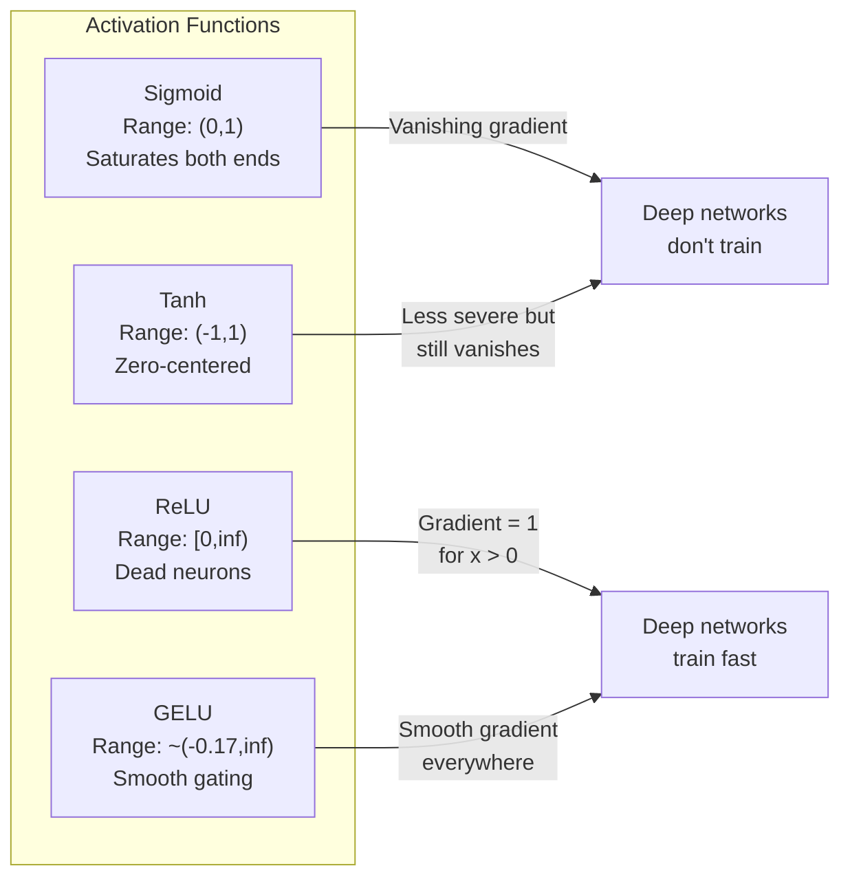
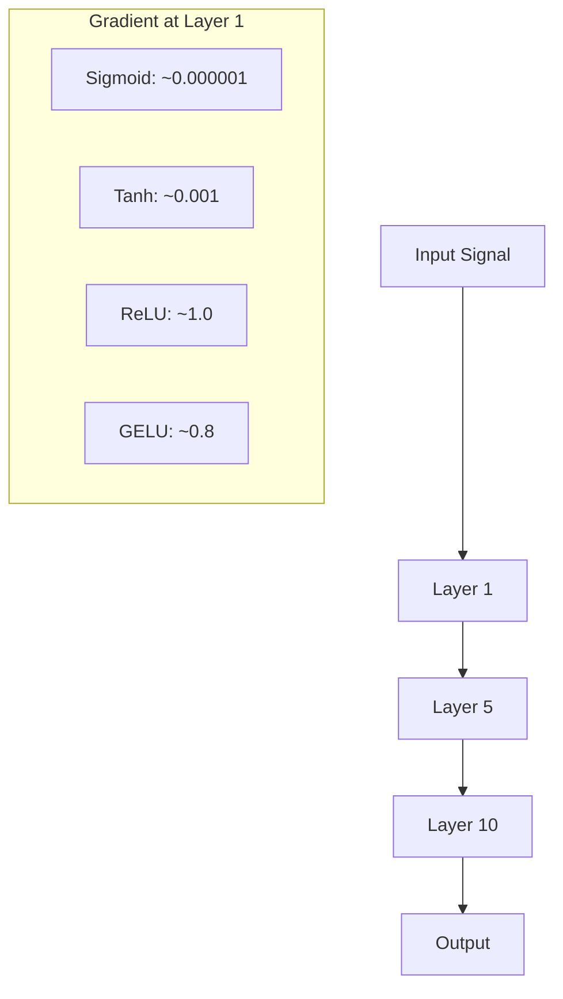
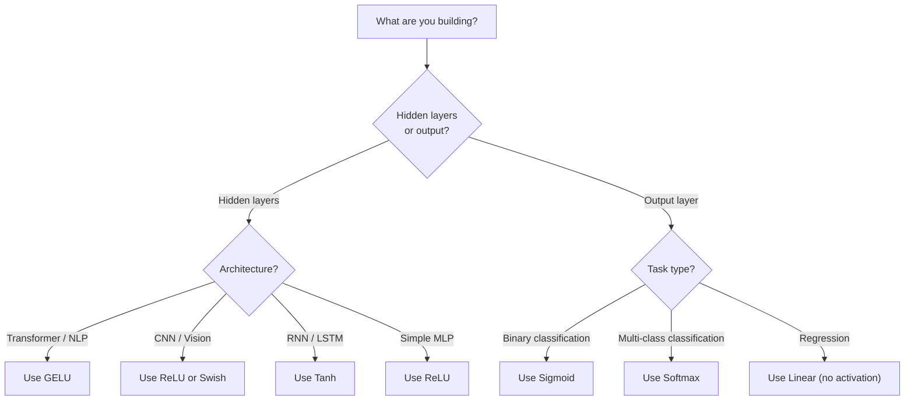

# 激活函数

> 没有非线性，你的 100 层网络不过是一次花哨的矩阵乘法。激活函数是让神经网络能够以曲线方式思考的闸门。

**Type:** Build
**Languages:** Python
**Prerequisites:** 第 03.03 课（反向传播）
**Time:** 约 75 分钟

## 学习目标

- 从零实现 sigmoid、tanh、ReLU、Leaky ReLU、GELU、Swish 和 softmax 及其导数
- 通过测量 10 层以上网络中不同激活函数的激活值大小，诊断梯度消失问题
- 检测 ReLU 网络中的死神经元，并解释 GELU 为何能避免这种失效模式
- 为给定架构（transformer、CNN、RNN、输出层）选择正确的激活函数

## 问题所在

堆叠两个线性变换：y = W2(W1x + b1) + b2。展开后：y = W2W1x + W2b1 + b2。这不过是 y = Ax + c——一个单一的线性变换。无论堆叠多少个线性层，结果都会坍缩为一次矩阵乘法。你的 100 层网络与单层网络的表达能力完全相同。

这并非理论上的奇闻。它意味着一个深度线性网络确实无法学习 XOR，无法对螺旋数据集进行分类，无法识别人脸。没有激活函数，深度只是一种幻觉。

激活函数打破了这种线性。它们通过非线性函数扭曲每一层的输出，使网络能够弯曲决策边界、逼近任意函数，从而真正地学习。但选错了激活函数，你的梯度可能会消失为零（深度网络中的 sigmoid）、爆炸到无穷大（未经精心初始化的无界激活），或者你的神经元会永久死亡（带有较大负偏置的 ReLU）。激活函数的选择直接决定了你的网络能否学习。

## 概念

### 为什么需要非线性

矩阵乘法是可组合的。向量先乘矩阵 A 再乘矩阵 B，等同于乘以 AB。这意味着堆叠十个线性层在数学上等价于一个拥有一个大矩阵的线性层。所有那些参数、所有那些深度——都浪费了。你需要某种东西来打破这个链条，这正是激活函数的作用。

下面是证明。线性层计算 f(x) = Wx + b。堆叠两层：

```
Layer 1: h = W1 * x + b1
Layer 2: y = W2 * h + b2
```

代入：

```
y = W2 * (W1 * x + b1) + b2
y = (W2 * W1) * x + (W2 * b1 + b2)
y = A * x + c
```

只有一层。在层之间插入非线性激活 g()：

```
h = g(W1 * x + b1)
y = W2 * h + b2
```

此时代入失效了。W2 * g(W1 * x + b1) + b2 无法再化简为单一的线性变换。网络可以表示非线性函数了。每个带有激活的额外层都会增加表达能力。

### Sigmoid

最早的神经网络激活函数。

```
sigmoid(x) = 1 / (1 + e^(-x))
```

输出范围：(0, 1)。平滑、可微，将任意实数映射为类似概率的值。

其导数：

```
sigmoid'(x) = sigmoid(x) * (1 - sigmoid(x))
```

该导数的最大值为 0.25，出现在 x = 0 处。在反向传播中，梯度会跨层相乘。十层 sigmoid 意味着梯度最多被 0.25 连乘十次：

```
0.25^10 = 0.000000953674
```

不到原始信号的百万分之一。这就是梯度消失问题。早期层中的梯度变得极小，权重几乎不更新。网络看似在学习——后面几层的损失在下降——但最前面的层被冻结了。深度 sigmoid 网络根本无法训练。

另一个问题：sigmoid 的输出始终为正（0 到 1），这意味着权重上的梯度始终是同一符号。这会导致梯度下降过程中出现之字形震荡。

### Tanh

以零为中心的 sigmoid 版本。

```
tanh(x) = (e^x - e^(-x)) / (e^x + e^(-x))
```

输出范围：(-1, 1)。零中心化，消除了之字形震荡问题。

其导数：

```
tanh'(x) = 1 - tanh(x)^2
```

最大导数为 1.0，出现在 x = 0 处——比 sigmoid 好四倍。但梯度消失问题依然存在。对于较大的正输入或负输入，导数趋近于零。十层仍会压缩梯度，只是程度较轻。

### ReLU：突破

修正线性单元。由 Nair 和 Hinton 于 2010 年在深度学习中推广（该函数本身可追溯到 Fukushima 1969 年的工作），它改变了一切。

```
relu(x) = max(0, x)
```

输出范围：[0, 无穷)。其导数极其简单：

```
relu'(x) = 1  if x > 0
            0  if x <= 0
```

对正输入没有梯度消失。梯度恰好为 1，直接通过。这就是深度网络变得可训练的原因——ReLU 在各层之间保持梯度大小。

但存在一种失效模式：死神经元问题。如果一个神经元的加权输入始终为负（由于较大的负偏置或不幸的权重初始化），它的输出就始终为零，梯度也始终为零，永远不会更新。它永久死亡。在实践中，ReLU 网络中 10-40% 的神经元可能在训练过程中死亡。

### Leaky ReLU

针对死神经元最简单的修复方案。

```
leaky_relu(x) = x        if x > 0
                alpha * x if x <= 0
```

其中 alpha 是一个小的常数，通常为 0.01。负侧有一个小斜率而不是零，因此死神经元仍然能获得梯度信号并可以恢复。

### GELU：现代默认选择

高斯误差线性单元。由 Hendrycks 和 Gimpel 于 2016 年提出。是 BERT、GPT 以及大多数现代 transformer 中的默认激活函数。

```
gelu(x) = x * Phi(x)
```

其中 Phi(x) 是标准正态分布的累积分布函数。实践中使用的近似形式：

```
gelu(x) ~= 0.5 * x * (1 + tanh(sqrt(2/pi) * (x + 0.044715 * x^3)))
```

GELU 处处平滑，允许较小的负值（不同于硬性截断为零的 ReLU），并且有概率解释：它根据每个输入在 Gaussian 分布下为正的可能性对其进行加权。这种平滑门控在 transformer 架构中优于 ReLU，因为它提供更好的梯度流动，并完全避免了死神经元问题。

### Swish / SiLU

由 Ramachandran 等人于 2017 年通过自动化搜索发现的自门控激活函数。

```
swish(x) = x * sigmoid(x)
```

Swish 的正式定义是 x * sigmoid(x)。Google 通过对激活函数空间的自动化搜索发现了它——一个神经网络在设计神经网络的部件。

与 GELU 一样，它平滑、非单调，并允许较小的负值。区别很微妙：Swish 使用 sigmoid 进行门控，而 GELU 使用 Gaussian CDF。在实践中，性能几乎相同。Swish 用于 EfficientNet 和一些视觉模型。GELU 在语言模型中占主导地位。

### Softmax：输出激活函数

不用于隐藏层。Softmax 将原始分数向量（logits）转换为概率分布。

```
softmax(x_i) = e^(x_i) / sum(e^(x_j) for all j)
```

每个输出都在 0 和 1 之间。所有输出之和为 1。这使它成为多分类的标准最终激活函数。最大的 logit 获得最高的概率，但与 argmax 不同，softmax 是可微的，并保留了关于相对置信度的信息。

### 形状对比



### 梯度流动对比



### 何时使用哪种激活函数



```figure
softmax-temperature
```

## 动手实现

### 步骤 1：实现所有激活函数及其导数

每个函数接受一个浮点数并返回一个浮点数。每个导数函数接受相同的输入并返回梯度。

```python
import math

def sigmoid(x):
    x = max(-500, min(500, x))
    return 1.0 / (1.0 + math.exp(-x))

def sigmoid_derivative(x):
    s = sigmoid(x)
    return s * (1 - s)

def tanh_act(x):
    return math.tanh(x)

def tanh_derivative(x):
    t = math.tanh(x)
    return 1 - t * t

def relu(x):
    return max(0.0, x)

def relu_derivative(x):
    return 1.0 if x > 0 else 0.0

def leaky_relu(x, alpha=0.01):
    return x if x > 0 else alpha * x

def leaky_relu_derivative(x, alpha=0.01):
    return 1.0 if x > 0 else alpha

def gelu(x):
    return 0.5 * x * (1 + math.tanh(math.sqrt(2 / math.pi) * (x + 0.044715 * x ** 3)))

def gelu_derivative(x):
    phi = 0.5 * (1 + math.erf(x / math.sqrt(2)))
    pdf = math.exp(-0.5 * x * x) / math.sqrt(2 * math.pi)
    return phi + x * pdf

def swish(x):
    return x * sigmoid(x)

def swish_derivative(x):
    s = sigmoid(x)
    return s + x * s * (1 - s)

def softmax(xs):
    max_x = max(xs)
    exps = [math.exp(x - max_x) for x in xs]
    total = sum(exps)
    return [e / total for e in exps]
```

### 步骤 2：可视化梯度死亡的区域

计算从 -5 到 5 之间 100 个等距点上的梯度。打印一个文本直方图，显示每个激活函数的梯度接近零的区域。

```python
def gradient_scan(name, derivative_fn, start=-5, end=5, n=100):
    step = (end - start) / n
    near_zero = 0
    healthy = 0
    for i in range(n):
        x = start + i * step
        g = derivative_fn(x)
        if abs(g) < 0.01:
            near_zero += 1
        else:
            healthy += 1
    pct_dead = near_zero / n * 100
    print(f"{name:15s}: {healthy:3d} healthy, {near_zero:3d} near-zero ({pct_dead:.0f}% dead zone)")

gradient_scan("Sigmoid", sigmoid_derivative)
gradient_scan("Tanh", tanh_derivative)
gradient_scan("ReLU", relu_derivative)
gradient_scan("Leaky ReLU", leaky_relu_derivative)
gradient_scan("GELU", gelu_derivative)
gradient_scan("Swish", swish_derivative)
```

### 步骤 3：梯度消失实验

将信号分别通过使用 sigmoid 和 ReLU 的 N 层网络进行前向传播。测量激活值大小如何变化。

```python
import random

def vanishing_gradient_experiment(activation_fn, name, n_layers=10, n_inputs=5):
    random.seed(42)
    values = [random.gauss(0, 1) for _ in range(n_inputs)]

    print(f"\n{name} through {n_layers} layers:")
    for layer in range(n_layers):
        weights = [random.gauss(0, 1) for _ in range(n_inputs)]
        z = sum(w * v for w, v in zip(weights, values))
        activated = activation_fn(z)
        magnitude = abs(activated)
        bar = "#" * int(magnitude * 20)
        print(f"  Layer {layer+1:2d}: magnitude = {magnitude:.6f} {bar}")
        values = [activated] * n_inputs

vanishing_gradient_experiment(sigmoid, "Sigmoid")
vanishing_gradient_experiment(relu, "ReLU")
vanishing_gradient_experiment(gelu, "GELU")
```

### 步骤 4：死神经元检测器

创建一个 ReLU 网络，将随机输入传入其中，统计有多少神经元从未激活。

```python
def dead_neuron_detector(n_inputs=5, hidden_size=20, n_samples=1000):
    random.seed(0)
    weights = [[random.gauss(0, 1) for _ in range(n_inputs)] for _ in range(hidden_size)]
    biases = [random.gauss(0, 1) for _ in range(hidden_size)]

    fire_counts = [0] * hidden_size

    for _ in range(n_samples):
        inputs = [random.gauss(0, 1) for _ in range(n_inputs)]
        for neuron_idx in range(hidden_size):
            z = sum(w * x for w, x in zip(weights[neuron_idx], inputs)) + biases[neuron_idx]
            if relu(z) > 0:
                fire_counts[neuron_idx] += 1

    dead = sum(1 for c in fire_counts if c == 0)
    rarely_fire = sum(1 for c in fire_counts if 0 < c < n_samples * 0.05)
    healthy = hidden_size - dead - rarely_fire

    print(f"\nDead Neuron Report ({hidden_size} neurons, {n_samples} samples):")
    print(f"  Dead (never fired):     {dead}")
    print(f"  Barely alive (<5%):     {rarely_fire}")
    print(f"  Healthy:                {healthy}")
    print(f"  Dead neuron rate:       {dead/hidden_size*100:.1f}%")

    for i, c in enumerate(fire_counts):
        status = "DEAD" if c == 0 else "WEAK" if c < n_samples * 0.05 else "OK"
        bar = "#" * (c * 40 // n_samples)
        print(f"  Neuron {i:2d}: {c:4d}/{n_samples} fires [{status:4s}] {bar}")

dead_neuron_detector()
```

### 步骤 5：训练对比——Sigmoid vs ReLU vs GELU

使用三种不同的激活函数，在圆形数据集（圆内点 = 类别 1，圆外 = 类别 0）上训练同一个两层网络。比较收敛速度。

```python
def make_circle_data(n=200, seed=42):
    random.seed(seed)
    data = []
    for _ in range(n):
        x = random.uniform(-2, 2)
        y = random.uniform(-2, 2)
        label = 1.0 if x * x + y * y < 1.5 else 0.0
        data.append(([x, y], label))
    return data


class ActivationNetwork:
    def __init__(self, activation_fn, activation_deriv, hidden_size=8, lr=0.1):
        random.seed(0)
        self.act = activation_fn
        self.act_d = activation_deriv
        self.lr = lr
        self.hidden_size = hidden_size

        self.w1 = [[random.gauss(0, 0.5) for _ in range(2)] for _ in range(hidden_size)]
        self.b1 = [0.0] * hidden_size
        self.w2 = [random.gauss(0, 0.5) for _ in range(hidden_size)]
        self.b2 = 0.0

    def forward(self, x):
        self.x = x
        self.z1 = []
        self.h = []
        for i in range(self.hidden_size):
            z = self.w1[i][0] * x[0] + self.w1[i][1] * x[1] + self.b1[i]
            self.z1.append(z)
            self.h.append(self.act(z))

        self.z2 = sum(self.w2[i] * self.h[i] for i in range(self.hidden_size)) + self.b2
        self.out = sigmoid(self.z2)
        return self.out

    def backward(self, target):
        error = self.out - target
        d_out = error * self.out * (1 - self.out)

        for i in range(self.hidden_size):
            d_h = d_out * self.w2[i] * self.act_d(self.z1[i])
            self.w2[i] -= self.lr * d_out * self.h[i]
            for j in range(2):
                self.w1[i][j] -= self.lr * d_h * self.x[j]
            self.b1[i] -= self.lr * d_h
        self.b2 -= self.lr * d_out

    def train(self, data, epochs=200):
        losses = []
        for epoch in range(epochs):
            total_loss = 0
            correct = 0
            for x, y in data:
                pred = self.forward(x)
                self.backward(y)
                total_loss += (pred - y) ** 2
                if (pred >= 0.5) == (y >= 0.5):
                    correct += 1
            avg_loss = total_loss / len(data)
            accuracy = correct / len(data) * 100
            losses.append(avg_loss)
            if epoch % 50 == 0 or epoch == epochs - 1:
                print(f"    Epoch {epoch:3d}: loss={avg_loss:.4f}, accuracy={accuracy:.1f}%")
        return losses


data = make_circle_data()

configs = [
    ("Sigmoid", sigmoid, sigmoid_derivative),
    ("ReLU", relu, relu_derivative),
    ("GELU", gelu, gelu_derivative),
]

results = {}
for name, act_fn, act_d_fn in configs:
    print(f"\n=== Training with {name} ===")
    net = ActivationNetwork(act_fn, act_d_fn, hidden_size=8, lr=0.1)
    losses = net.train(data, epochs=200)
    results[name] = losses

print("\n=== Final Loss Comparison ===")
for name, losses in results.items():
    print(f"  {name:10s}: start={losses[0]:.4f} -> end={losses[-1]:.4f} (improvement: {(1 - losses[-1]/losses[0])*100:.1f}%)")
```

## 使用它

PyTorch 以函数式和模块式两种形式提供所有这些激活函数：

```python
import torch
import torch.nn as nn
import torch.nn.functional as F

x = torch.randn(4, 10)

relu_out = F.relu(x)
gelu_out = F.gelu(x)
sigmoid_out = torch.sigmoid(x)
swish_out = F.silu(x)

logits = torch.randn(4, 5)
probs = F.softmax(logits, dim=1)

model = nn.Sequential(
    nn.Linear(10, 64),
    nn.GELU(),
    nn.Linear(64, 32),
    nn.GELU(),
    nn.Linear(32, 5),
)
```

transformer 中的隐藏层：GELU。CNN 中的隐藏层：ReLU。分类的输出层：softmax。回归的输出层：无（线性）。概率输出的层：sigmoid。就是这样。从这些默认选择开始，只有在有证据时才更换它们。

RNN 和 LSTM 在隐藏状态中使用 tanh，在门控中使用 sigmoid，但如果今天你从零开始构建，你可能不会使用 RNN。如果你的 ReLU 网络中神经元在死亡，请切换到 GELU。除非有特定理由，否则不要使用 Leaky ReLU——GELU 解决了死神经元问题，并提供更好的梯度流动。

## 发布它

本课产出：
- `outputs/prompt-activation-selector.md`——一个可复用的提示，帮助你为任何架构选择正确的激活函数

## 练习

1. 实现 Parametric ReLU（PReLU），其中负斜率 alpha 是一个可学习参数。在圆形数据集上训练它，并与固定的 Leaky ReLU 进行比较。

2. 用 50 层而不是 10 层运行梯度消失实验。绘制 sigmoid、tanh、ReLU 和 GELU 在每一层的数值大小。每个激活函数的信号在哪一层实际上达到零？

3. 实现 ELU（指数线性单元）：当 x > 0 时 elu(x) = x，当 x <= 0 时 elu(x) = alpha * (e^x - 1)。在相同网络上比较其死神经元率与 ReLU。

4. 构建一个在训练期间运行的“梯度健康监视器”：在每个 epoch，计算每一层的平均梯度大小。当任何一层的梯度低于 0.001 或超过 100 时打印警告。

5. 修改训练对比实验，使用第 01 课的 XOR 数据集代替圆形数据集。哪种激活函数在 XOR 上收敛最快？为什么这与圆形数据集的结果不同？

## 关键术语

| 术语 | 人们怎么说 | 实际含义 |
|------|----------------|----------------------|
| 激活函数 | “非线性的部分” | 应用于每个神经元输出的函数，打破线性，使网络能够学习非线性映射 |
| 梯度消失 | “梯度在深层网络中消失” | 当激活函数的导数小于 1 时，梯度在层间指数级缩小，使早期层无法训练 |
| 梯度爆炸 | “梯度爆掉了” | 当有效乘子超过 1 时，梯度在层间指数级增长，导致训练不稳定 |
| 死神经元 | “停止学习的神经元” | 输入永久为负的 ReLU 神经元，产生零输出和零梯度 |
| Sigmoid | “把值压到 0-1” | Logistic 函数 1/(1+e^-x)，历史上很重要，但在深度网络中会导致梯度消失 |
| ReLU | “把负数截断为零” | max(0, x)——通过保持梯度大小使深度学习变得实用的激活函数 |
| GELU | “transformer 的激活函数” | Gaussian Error Linear Unit，一种平滑的激活函数，根据输入为正的概率对其进行加权 |
| Swish/SiLU | “自门控的 ReLU” | x * sigmoid(x)，通过自动化搜索发现，用于 EfficientNet |
| Softmax | “把分数变成概率” | 将 logits 向量归一化为概率分布，所有值都在 (0,1) 内且总和为 1 |
| Leaky ReLU | “不会死的 ReLU” | max(alpha*x, x)，其中 alpha 很小（0.01），通过允许小的负梯度防止死神经元 |
| 饱和 | “sigmoid 的平坦部分” | 激活函数导数趋近于零的区域，阻碍梯度流动 |
| Logit | “softmax 之前的原始分数” | 最后一层在应用 softmax 或 sigmoid 之前的未归一化输出 |

## 延伸阅读

- Nair & Hinton, "Rectified Linear Units Improve Restricted Boltzmann Machines"（2010）——引入 ReLU 并使深度网络训练成为可能的论文
- Hendrycks & Gimpel, "Gaussian Error Linear Units (GELUs)"（2016）——介绍了后来成为 transformer 默认选择的激活函数
- Ramachandran 等人, "Searching for Activation Functions"（2017）——使用自动化搜索发现 Swish，表明激活函数设计可以自动化
- Glorot & Bengio, "Understanding the difficulty of training deep feedforward neural networks"（2010）——诊断梯度消失/爆炸并提出 Xavier 初始化的论文
- Goodfellow, Bengio, Courville, 《Deep Learning》第 6.3 章（https://www.deeplearningbook.org/）——对隐藏单元和激活函数的严谨论述