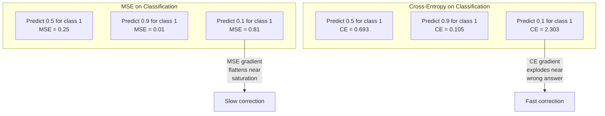
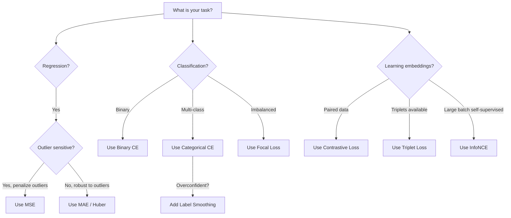
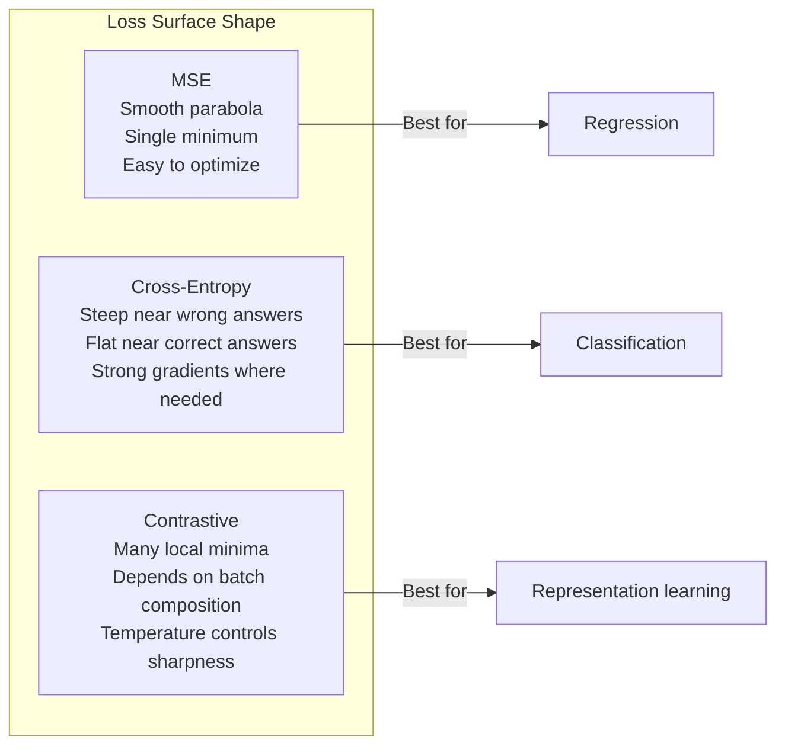

# 损失函数

> 你的网络做出了一个预测。真实标签却另有说法。错得有多离谱？那个数字就是损失。选错了损失函数，你的模型就会完全优化到错误的方向上去。

**Type:** Build
**Languages:** Python
**Prerequisites:** 第 03.04 课（激活函数）
**Time:** 约 75 分钟

## 学习目标

- 从零实现 MSE、二元交叉熵、类别交叉熵以及对比损失(InfoNCE),并推导其梯度
- 通过演示“对一切都预测 0.5”这一失败模式，解释为什么 MSE 不适用于分类任务
- 将标签平滑应用于交叉熵，并描述它如何防止过度自信的预测
- 为回归、二元分类、多分类和嵌入学习任务选择正确的损失函数

## 问题所在

在分类问题上最小化 MSE 的模型，会自信地对一切都预测 0.5。它在最小化损失。它也毫无用处。

损失函数是你的模型实际优化的唯一对象。不是准确率。不是 F1 分数。也不是你汇报给上级的任何指标。优化器取损失函数的梯度，并调整权重使这个数字变小。如果损失函数没有捕捉到你真正关心的东西，模型就会找到满足它的数学上最廉价的方式，而那种方式几乎从来不是你想要的。

举个具体的例子。你有一个二元分类任务，两类各占 50/50。你用 MSE 作为损失。模型对每个输入都预测 0.5。平均 MSE 是 0.25,这是在不真正学到任何东西的情况下的最小值。模型毫无判别能力，但它在技术上确实最小化了你的损失函数。换成交叉熵后，同一个模型就被迫把预测推向 0 或 1,因为 -log(0.5) = 0.693 是很糟的损失，而 -log(0.99) = 0.01 则奖励自信的正确预测。损失函数的选择，就是一个能学习的模型与一个钻指标空子的模型之间的区别。

更糟的情况也有。在自监督学习中，你甚至没有标签。对比损失完全定义了学习信号：什么算相似、什么算不同，以及模型应该以多大力气把它们推开。对比损失搞错了，你的嵌入就会坍缩到一个点——所有输入都映射到同一个向量。技术上损失为零，实际上毫无价值。

## 概念

### 均方误差(MSE)

回归的默认选择。计算预测与目标之间的平方差，再对所有样本取平均。

```
MSE = (1/n) * sum((y_pred - y_true)^2)
```

平方为什么重要：它以二次方惩罚大误差。误差为 2 的代价是误差为 1 的 4 倍。误差为 10 的代价是 100 倍。这使得 MSE 对离群值敏感——一个严重错误的预测会主导整个损失。

真实数字：如果你的模型预测房价，在某栋豪宅上偏差了 $10,000 on most houses but off by $200,000,MSE 会极力争先去修复那一栋，可能损害其他 99 套房子上的表现。

MSE 对预测的梯度是：

```
dMSE/dy_pred = (2/n) * (y_pred - y_true)
```

对误差是线性的。误差越大，梯度越大。这对回归是优点(大误差需要大修正)，对分类是缺陷(你想要指数级地惩罚自信的错误答案，而不是线性地)。

### 交叉熵损失

分类任务的损失函数。源于信息论——它衡量预测概率分布与真实分布之间的散度。

**二元交叉熵(BCE):**

```
BCE = -(y * log(p) + (1 - y) * log(1 - p))
```

其中 y 是真实标签(0 或 1),p 是预测概率。

为什么 -log(p) 有效：当真实标签为 1 而你预测 p = 0.99 时，损失为 -log(0.99) = 0.01。当你预测 p = 0.01 时，损失为 -log(0.01) = 4.6。这 460 倍的差距正是交叉熵有效的原因。它毫不留情地惩罚自信的错误预测，而对自信的正确预测几乎不罚。

梯度讲述着同样的故事：

```
dBCE/dp = -(y/p) + (1-y)/(1-p)
```

当 y = 1 而 p 接近零时，梯度为 -1/p,趋向负无穷。模型会收到一个巨大的信号去纠正错误。当 p 接近 1 时，梯度极小。已经正确，无需修正。

**类别交叉熵：**

用于带 one-hot 编码目标的多分类。

```
CCE = -sum(y_i * log(p_i))
```

只有真实类别对损失有贡献(因为其他所有 y_i 都是零)。如果有 10 个类别而正确类别得到概率 0.1(随机猜测)，损失为 -log(0.1) = 2.3。如果正确类别得到概率 0.9,损失为 -log(0.9) = 0.105。模型学会把概率质量集中到正确答案上。

### 为什么 MSE 在分类上失败



当预测接近 0 或 1 时，MSE 的梯度会变得平坦(由 sigmoid 饱和导致)。交叉熵的梯度补偿了这一点——-log 抵消了 sigmoid 的平坦区域，在最需要的地方给出强梯度。

### 标签平滑

标准的 one-hot 标签说“这是 100% 的类别 3,其他类别是 0%”。这是一个很强的断言。标签平滑将其软化：

```
smooth_label = (1 - alpha) * one_hot + alpha / num_classes
```

取 alpha = 0.1、10 个类别：目标不再是不列 [0, 0, 1, 0, ...],而是 [0.01, 0.01, 0.91, 0.01, ...]。模型的目标从 1.0 变成 0.91。

为什么有效：一个试图通过 softmax 精确输出 1.0 的模型，需要把 logits 推到无穷大。这会导致过度自信、损害泛化能力，并使模型对分布偏移变得脆弱。标签平滑把目标限制在 0.9(取 alpha=0.1 时)，使 logits 保持在合理范围内。GPT 和大多数现代模型都使用标签平滑或其等价物。

### 对比损失

没有标签。没有类别。只有成对的输入，以及一个问题：它们相似还是不同？

**SimCLR 风格的对比损失(NT-Xent / InfoNCE):**

取一张图像，创建它的两个增强视图(裁剪、旋转、色彩抖动)。这是一个“正样本对”——它们应该有相似的嵌入。批次中的所有其他图像构成“负样本对”——它们应该有不同的嵌入。

```
L = -log(exp(sim(z_i, z_j) / tau) / sum(exp(sim(z_i, z_k) / tau)))
```

其中 sim() 是余弦相似度，z_i 和 z_j 是正样本对，求和遍历所有负样本，tau(温度)控制分布的尖锐程度。温度越低 = 负样本越难 = 分离越激进。

真实数字：批次大小为 256 意味着每个正样本对有 255 个负样本。温度 tau = 0.07(SimCLR 默认值)。这个损失看起来像是相似度上的一个 softmax——它想让正样本对的相似度在全部 256 个选项中最高。

**三元组损失：**

取三个输入：锚点、正样本(同类)、负样本(不同类)。

```
L = max(0, d(anchor, positive) - d(anchor, negative) + margin)
```

间隔(通常为 0.2–1.0)强制正样本距离与负样本距离之间至少有一定的差距。如果负样本已经足够远，损失为零——没有梯度，没有更新。这使训练高效，但需要仔细的三元组挖掘(选择靠近锚点的困难负样本)。

### Focal Loss

用于不平衡数据集。标准交叉熵对所有被正确分类的样本一视同仁。Focal loss 降低简单样本的权重：

```
FL = -alpha * (1 - p_t)^gamma * log(p_t)
```

其中 p_t 是真实类别的预测概率，gamma 控制聚焦程度。gamma = 0 时，就是标准交叉熵。gamma = 2(默认值)时：

- 简单样本(p_t = 0.9):权重 = (0.1)^2 = 0.01。实际上被忽略。
- 困难样本(p_t = 0.1):权重 = (0.9)^2 = 0.81。完整的梯度信号。

Focal loss 由 Lin 等人为目标检测而提出，在目标检测中 99% 的候选区域都是背景(简单负样本)。没有 focal loss,模型会淹没在简单的背景样本中，永远学不会检测物体。有了它，模型就能把容量集中在那些重要的、困难的、模糊的案例上。

### 损失函数决策树



### 损失景观



```figure
cross-entropy-loss
```

## 动手构建

### 第 1 步：MSE 及其梯度

```python
def mse(predictions, targets):
    n = len(predictions)
    total = 0.0
    for p, t in zip(predictions, targets):
        total += (p - t) ** 2
    return total / n

def mse_gradient(predictions, targets):
    n = len(predictions)
    grads = []
    for p, t in zip(predictions, targets):
        grads.append(2.0 * (p - t) / n)
    return grads
```

### 第 2 步：二元交叉熵

log(0) 问题是真实存在的。如果模型对正样本恰好预测 0,log(0) = 负无穷。截断可以防止这一点。

```python
import math

def binary_cross_entropy(predictions, targets, eps=1e-15):
    n = len(predictions)
    total = 0.0
    for p, t in zip(predictions, targets):
        p_clipped = max(eps, min(1 - eps, p))
        total += -(t * math.log(p_clipped) + (1 - t) * math.log(1 - p_clipped))
    return total / n

def bce_gradient(predictions, targets, eps=1e-15):
    grads = []
    for p, t in zip(predictions, targets):
        p_clipped = max(eps, min(1 - eps, p))
        grads.append(-(t / p_clipped) + (1 - t) / (1 - p_clipped))
    return grads
```

### 第 3 步：带 Softmax 的类别交叉熵

Softmax 将原始 logits 转换为概率。然后我们针对 one-hot 目标计算交叉熵。

```python
def softmax(logits):
    max_val = max(logits)
    exps = [math.exp(x - max_val) for x in logits]
    total = sum(exps)
    return [e / total for e in exps]

def categorical_cross_entropy(logits, target_index, eps=1e-15):
    probs = softmax(logits)
    p = max(eps, probs[target_index])
    return -math.log(p)

def cce_gradient(logits, target_index):
    probs = softmax(logits)
    grads = list(probs)
    grads[target_index] -= 1.0
    return grads
```

softmax + 交叉熵的梯度化简得非常漂亮：对真实类别就是(预测概率 - 1),对所有其他类别就是(预测概率)。这个优雅的化简并非巧合——这正是 softmax 与交叉熵总是成对出现的原因。

### 第 4 步：标签平滑

```python
def label_smoothed_cce(logits, target_index, num_classes, alpha=0.1, eps=1e-15):
    probs = softmax(logits)
    loss = 0.0
    for i in range(num_classes):
        if i == target_index:
            smooth_target = 1.0 - alpha + alpha / num_classes
        else:
            smooth_target = alpha / num_classes
        p = max(eps, probs[i])
        loss += -smooth_target * math.log(p)
    return loss
```

### 第 5 步：对比损失(简化版 InfoNCE)

```python
def cosine_similarity(a, b):
    dot = sum(x * y for x, y in zip(a, b))
    norm_a = math.sqrt(sum(x * x for x in a))
    norm_b = math.sqrt(sum(x * x for x in b))
    if norm_a < 1e-10 or norm_b < 1e-10:
        return 0.0
    return dot / (norm_a * norm_b)

def contrastive_loss(anchor, positive, negatives, temperature=0.07):
    sim_pos = cosine_similarity(anchor, positive) / temperature
    sim_negs = [cosine_similarity(anchor, neg) / temperature for neg in negatives]

    max_sim = max(sim_pos, max(sim_negs)) if sim_negs else sim_pos
    exp_pos = math.exp(sim_pos - max_sim)
    exp_negs = [math.exp(s - max_sim) for s in sim_negs]
    total_exp = exp_pos + sum(exp_negs)

    return -math.log(max(1e-15, exp_pos / total_exp))
```

### 第 6 步：分类任务上的 MSE 与交叉熵对比

用两种损失函数训练第 04 课中的同一个网络(圆形数据集)。观察交叉熵收敛更快。

```python
import random

def sigmoid(x):
    x = max(-500, min(500, x))
    return 1.0 / (1.0 + math.exp(-x))

def make_circle_data(n=200, seed=42):
    random.seed(seed)
    data = []
    for _ in range(n):
        x = random.uniform(-2, 2)
        y = random.uniform(-2, 2)
        label = 1.0 if x * x + y * y < 1.5 else 0.0
        data.append(([x, y], label))
    return data


class LossComparisonNetwork:
    def __init__(self, loss_type="bce", hidden_size=8, lr=0.1):
        random.seed(0)
        self.loss_type = loss_type
        self.lr = lr
        self.hidden_size = hidden_size

        self.w1 = [[random.gauss(0, 0.5) for _ in range(2)] for _ in range(hidden_size)]
        self.b1 = [0.0] * hidden_size
        self.w2 = [random.gauss(0, 0.5) for _ in range(hidden_size)]
        self.b2 = 0.0

    def forward(self, x):
        self.x = x
        self.z1 = []
        self.h = []
        for i in range(self.hidden_size):
            z = self.w1[i][0] * x[0] + self.w1[i][1] * x[1] + self.b1[i]
            self.z1.append(z)
            self.h.append(max(0.0, z))

        self.z2 = sum(self.w2[i] * self.h[i] for i in range(self.hidden_size)) + self.b2
        self.out = sigmoid(self.z2)
        return self.out

    def backward(self, target):
        if self.loss_type == "mse":
            d_loss = 2.0 * (self.out - target)
        else:
            eps = 1e-15
            p = max(eps, min(1 - eps, self.out))
            d_loss = -(target / p) + (1 - target) / (1 - p)

        d_sigmoid = self.out * (1 - self.out)
        d_out = d_loss * d_sigmoid

        for i in range(self.hidden_size):
            d_relu = 1.0 if self.z1[i] > 0 else 0.0
            d_h = d_out * self.w2[i] * d_relu
            self.w2[i] -= self.lr * d_out * self.h[i]
            for j in range(2):
                self.w1[i][j] -= self.lr * d_h * self.x[j]
            self.b1[i] -= self.lr * d_h
        self.b2 -= self.lr * d_out

    def compute_loss(self, pred, target):
        if self.loss_type == "mse":
            return (pred - target) ** 2
        else:
            eps = 1e-15
            p = max(eps, min(1 - eps, pred))
            return -(target * math.log(p) + (1 - target) * math.log(1 - p))

    def train(self, data, epochs=200):
        losses = []
        for epoch in range(epochs):
            total_loss = 0.0
            correct = 0
            for x, y in data:
                pred = self.forward(x)
                self.backward(y)
                total_loss += self.compute_loss(pred, y)
                if (pred >= 0.5) == (y >= 0.5):
                    correct += 1
            avg_loss = total_loss / len(data)
            accuracy = correct / len(data) * 100
            losses.append((avg_loss, accuracy))
            if epoch % 50 == 0 or epoch == epochs - 1:
                print(f"    Epoch {epoch:3d}: loss={avg_loss:.4f}, accuracy={accuracy:.1f}%")
        return losses
```

## 使用它

PyTorch 提供了所有标准损失函数，并内置了数值稳定性：

```python
import torch
import torch.nn as nn
import torch.nn.functional as F

predictions = torch.tensor([0.9, 0.1, 0.7], requires_grad=True)
targets = torch.tensor([1.0, 0.0, 1.0])

mse_loss = F.mse_loss(predictions, targets)
bce_loss = F.binary_cross_entropy(predictions, targets)

logits = torch.randn(4, 10)
labels = torch.tensor([3, 7, 1, 9])
ce_loss = F.cross_entropy(logits, labels)
ce_smooth = F.cross_entropy(logits, labels, label_smoothing=0.1)
```

请使用 `F.cross_entropy`(而不是 `F.nll_loss` 加上手动 softmax)。它把 log-softmax 和负对数似然合并在一个数值稳定的操作中。先单独应用 softmax 再取 log 稳定性较差——在大的指数相减时你会丢失精度。

对于对比学习，大多数团队使用自定义实现或诸如 `lightly` 或 `pytorch-metric-learning` 的库。核心流程始终相同：计算成对相似度，在正负样本上构建 softmax,反向传播。

## 交付成果

本课产出：
- `outputs/prompt-loss-function-selector.md` —— 一个用于选择正确损失函数的可复用提示词
- `outputs/prompt-loss-debugger.md` —— 一个用于损失曲线看起来不对劲时的诊断提示词

## 练习

1. 实现 Huber 损失(平滑 L1 损失)，它对小误差是 MSE,对大误差是 MAE。当 5% 的训练目标加入随机噪声(离群值)时，分别用 MSE 和 Huber 训练一个预测 y = sin(x) 的回归网络。比较最终测试误差。

2. 在二元分类训练循环中加入 focal loss。构造一个不平衡数据集(90% 类别 0,10% 类别 1)。比较标准 BCE 与 focal loss(gamma=2)在 200 个 epoch 后对少数类别的召回率。

3. 实现带半困难负样本挖掘的三元组损失。为 5 个类别生成二维嵌入数据。对每个锚点，找出仍比正样本远的那个最困难的负样本(半困难)。比较其与随机三元组选择的收敛情况。

4. 运行 MSE 与交叉熵的对比实验，但在训练过程中跟踪每一层的梯度大小。绘制每个 epoch 的平均梯度范数。验证在模型最不确定的早期 epoch 中，交叉熵会产生更大的梯度。

5. 实现 KL 散度损失，并验证当真实分布为 one-hot 时，最小化 KL(true || predicted) 给出的梯度与交叉熵相同。然后尝试软目标(如知识蒸馏)，此时“真实”分布来自教师模型的 softmax 输出。

## 关键术语

| 术语 | 人们怎么说 | 实际含义 |
|------|----------------|----------------------|
| 损失函数 | “模型错得多离谱” | 一个可微函数，将预测与目标映射为优化器所要最小化的标量 |
| MSE | “平均平方误差” | 预测与目标之间平方差的均值；以二次方惩罚大误差 |
| 交叉熵 | “分类损失” | 使用 -log(p) 衡量预测概率分布与真实分布之间的散度 |
| 二元交叉熵 | "BCE" | 两类别的交叉熵:-(y*log(p) + (1-y)*log(1-p)) |
| 标签平滑 | “软化目标” | 用软值(如 0.1/0.9)替换硬性的 0/1 目标，以防止过度自信并改善泛化 |
| 对比损失 | “拉近，推远” | 一种通过使相似对在嵌入空间中靠近、不相似对远离来学习表示的损失 |
| InfoNCE | “CLIP/SimCLR 损失” | 在相似度分数上做温度缩放归一化的交叉熵；将对比学习当作分类任务处理 |
| Focal loss | “不平衡数据的救星” | 以 (1-p_t)^gamma 加权的交叉熵，降低简单样本的权重并聚焦于困难样本 |
| 三元组损失 | “锚点-正样本-负样本” | 在嵌入空间中使锚点到正样本的距离至少比到负样本的距离近一个间隔 |
| 温度 | “尖锐度旋钮” | 对 logits/相似度的标量除数，控制所得分布的尖锐程度；越低越尖锐 |

## 延伸阅读

- Lin et al., "Focal Loss for Dense Object Detection" (2017) —— 为处理目标检测中极端类别不平衡提出 focal loss(RetinaNet)
- Chen et al., "A Simple Framework for Contrastive Learning of Visual Representations" (SimCLR, 2020) —— 以 NT-Xent 损失定义了现代对比学习流程
- Szegedy et al., "Rethinking the Inception Architecture" (2016) —— 提出标签平滑作为正则化技术，现已成为大多数大型模型的标准做法
- Hinton et al., "Distilling the Knowledge in a Neural Network" (2015) —— 使用软目标和 KL 散度的知识蒸馏，是模型压缩的基础