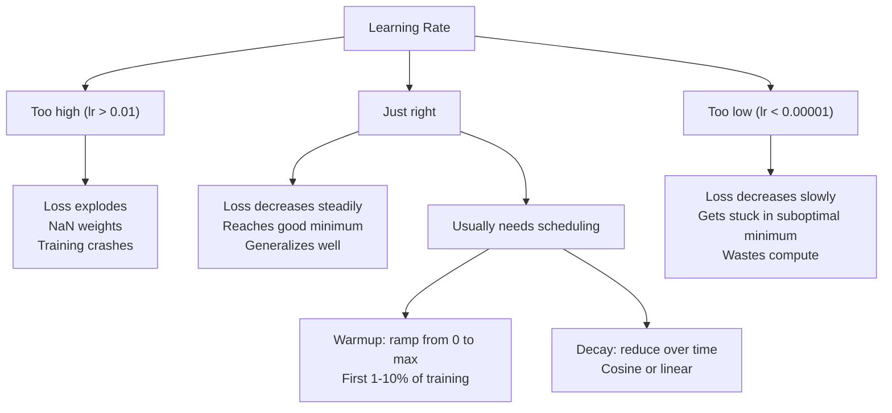
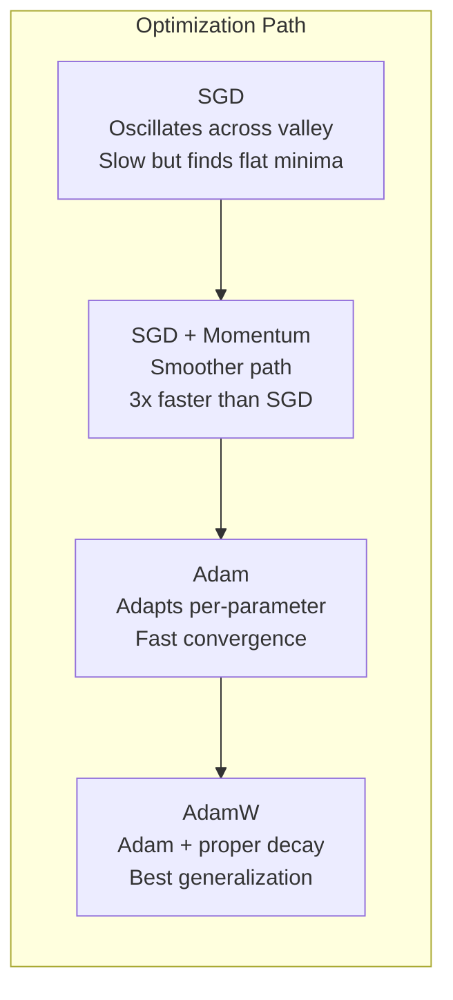
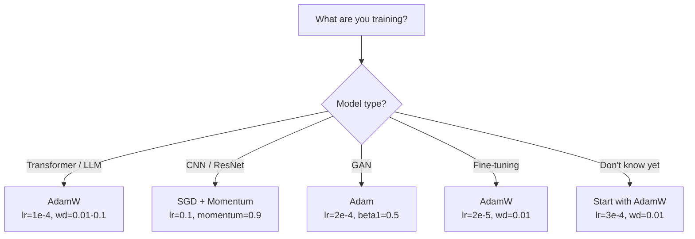

# 优化器

> 梯度下降告诉你往哪个方向移动，却不说明移动多远、多快。SGD 是指南针。Adam 是带实时路况的 GPS。

**Type:** Build
**Languages:** Python
**Prerequisites:** 第 03.05 课(损失函数)
**Time:** 约 75 分钟

## 学习目标

- 用 Python 从零实现 SGD、带动量的 SGD、Adam 和 AdamW 优化器
- 解释 Adam 的偏差修正如何在训练初期补偿零初始化的矩估计
- 说明为什么在相同任务上 AdamW 的泛化能力优于使用 L2 正则化的 Adam
- 为 Transformer、CNN、GAN 和微调任务选择合适的优化器及默认超参数

## 问题所在

你已经计算出了梯度。你知道第 4,721 个权重应该减小 0.003 来降低损失。但 0.003 是什么单位？按什么比例缩放？第 1 步和第 1,000 步应该移动相同的幅度吗？

朴素梯度下降在每一步对每个参数应用相同的学习率：w = w - lr * gradient。这带来了三个问题，使得在实践中训练神经网络十分痛苦。

第一，振荡。损失曲面很少是光滑的碗状，更像是狭长的山谷。梯度指向横穿山谷的方向(陡峭方向)，而不是沿谷底的方向(平缓方向)。梯度下降在窄维度上来回弹跳，而在有用的方向上进展缓慢。你见过这种现象：损失快速下降然后停滞，这不是模型收敛了，而是它在振荡。

第二，对所有参数使用同一个学习率是错误的。有些权重需要大幅更新(它们处于早期欠拟合阶段)，有些权重只需微小更新(它们已接近最优值)。适合前者的学习率会毁掉后者，反之亦然。

第三，鞍点。在高维空间中，损失曲面存在大片梯度接近零的平坦区域。朴素 SGD 以梯度的速度(实际上为零)在这些区域爬行。模型看起来卡住了，其实没有——它只是处于一片平坦区域，另一侧还有有用的下降方向。但 SGD 没有任何机制能推它过去。

Adam 解决了这三个问题。它为每个参数维护两个滑动平均——梯度均值(动量，处理振荡)和梯度平方均值(自适应速率，处理不同的尺度)。结合最初几步的偏差修正，它成了一个只需默认超参数就能解决 80% 问题的通用优化器。本课从零构建它，让你准确理解它在剩下 20% 的问题上何时、为何失效。

## 核心概念

### 随机梯度下降(SGD)

最简单的优化器。在一个 mini-batch 上计算梯度，然后朝相反方向移动。

```
w = w - lr * gradient
```

"随机"是指你用数据的一个随机子集(mini-batch)来估计梯度，而不是整个数据集。这种噪声其实是有用的——它有助于逃离尖锐的局部极小值。但噪声也会引起振荡。

学习率是唯一的旋钮。太高：损失发散。太低：训练慢得要命。最优值取决于架构、数据、批大小和当前训练阶段。对现代网络上的朴素 SGD,典型取值范围是 0.01 到 0.1。但即使在单次训练中，理想的学习率也会变化。

### 动量

球滚下坡的类比虽然被用滥了，但很准确。你不只按梯度迈步，而是维护一个会累积历史梯度的速度。

```
m_t = beta * m_{t-1} + gradient
w = w - lr * m_t
```

Beta(通常为 0.9)控制保留多少历史。当 beta = 0.9 时，动量约等于最近 10 个梯度的平均(1 / (1 - 0.9) = 10)。

为什么这能消除振荡：方向一致的梯度会累积，方向相反的梯度会抵消。在那个狭长的山谷里，"横穿"分量每步都变号而被衰减，"沿谷"分量保持一致而被放大。结果是在有用方向上的平滑加速。

具体数字：在病态的损失曲面上，单独的 SGD 可能需要 10,000 步。带动量的 SGD(beta=0.9)在同一问题上通常只需 3,000-5,000 步。这个加速并非微不足道。

### RMSProp

第一个真正有效的逐参数自适应学习率方法。由 Hinton 在一次 Coursera 讲座中提出(从未正式发表)。

```
s_t = beta * s_{t-1} + (1 - beta) * gradient^2
w = w - lr * gradient / (sqrt(s_t) + epsilon)
```

s_t 跟踪梯度平方的滑动平均。梯度持续偏大的参数会被除以一个大数(有效学习率更小)，梯度偏小的参数会被除以一个小数(有效学习率更大)。

这解决了“所有参数共用一个学习率”的问题。一个一直在获得大幅更新的权重，很可能已接近其目标——让它慢下来。一个一直在获得微小更新的权重，可能训练不足——让它加速。

Epsilon(通常为 1e-8)防止某个参数未被更新时除以零。

### Adam:动量 + RMSProp

Adam 结合了上述两种思想。它为每个参数维护两个指数滑动平均：

```
m_t = beta1 * m_{t-1} + (1 - beta1) * gradient        (first moment: mean)
v_t = beta2 * v_{t-1} + (1 - beta2) * gradient^2       (second moment: variance)
```

**偏差修正**是大多数讲解都会跳过的关键细节。在第 1 步，m_1 = (1 - beta1) * gradient。当 beta1 = 0.9 时，即 0.1 * gradient——比真实值小了十倍。滑动平均还没有“热身”。偏差修正补偿了这一点：

```
m_hat = m_t / (1 - beta1^t)
v_hat = v_t / (1 - beta2^t)
```

在第 1 步、beta1 = 0.9 时：m_hat = m_1 / (1 - 0.9) = m_1 / 0.1 = 实际梯度。到第 100 步时，(1 - 0.9^100) 约等于 1.0,修正就消失了。偏差修正只在前约 10 步重要，约 50 步之后就不相关了。

更新公式：

```
w = w - lr * m_hat / (sqrt(v_hat) + epsilon)
```

Adam 默认值：lr = 0.001,beta1 = 0.9,beta2 = 0.999,epsilon = 1e-8。这些默认值适用于 80% 的问题。当不奏效时，先改 lr,再改 beta2。几乎永远不要改 beta1 或 epsilon。

### AdamW:正确的权重衰减

L2 正则化在损失中加上 lambda * w^2。在朴素 SGD 中，这等价于权重衰减(每一步从权重中减去 lambda * w)。在 Adam 中，这种等价关系被打破了。

Loshchilov 与 Hutter 的洞见：当你把 L2 加到损失中、再由 Adam 处理梯度时，自适应学习率同样缩放了正则化项。梯度方差大的参数获得的正则化更少，方差小的参数获得的正则化更多。这不是你想要的——你希望无论梯度统计如何，正则化都是均匀的。

AdamW 通过在 Adam 更新之后直接对权重施加权重衰减来修复这个问题：

```
w = w - lr * m_hat / (sqrt(v_hat) + epsilon) - lr * lambda * w
```

权重衰减项(lr * lambda * w)不会被 Adam 的自适应因子缩放。每个参数都得到相同的等比例收缩。

这看起来是小细节，其实不然。在几乎所有任务上，AdamW 都能收敛到比 Adam + L2 正则化更好的解。它是 PyTorch 中训练 Transformer、扩散模型和大多数现代架构的默认优化器。BERT、GPT、LLaMA、Stable Diffusion——都是用 AdamW 训练的。

### 学习率：最重要的超参数



如果只调一个超参数，就调学习率。学习率 10 倍的变化，比你将做出的任何架构决策都重要。常见默认值：

- SGD:lr = 0.01 到 0.1
- Adam/AdamW:lr = 1e-4 到 3e-4
- 微调预训练模型：lr = 1e-5 到 5e-5
- 学习率预热：在最初 1-10% 的步数内线性上升

### 优化器对比



### 各优化器的适用场景



```figure
optimizer-trajectory
```

## 动手构建

### 第 1 步：朴素 SGD

```python
class SGD:
    def __init__(self, lr=0.01):
        self.lr = lr

    def step(self, params, grads):
        for i in range(len(params)):
            params[i] -= self.lr * grads[i]
```

### 第 2 步：带动量的 SGD

```python
class SGDMomentum:
    def __init__(self, lr=0.01, beta=0.9):
        self.lr = lr
        self.beta = beta
        self.velocities = None

    def step(self, params, grads):
        if self.velocities is None:
            self.velocities = [0.0] * len(params)
        for i in range(len(params)):
            self.velocities[i] = self.beta * self.velocities[i] + grads[i]
            params[i] -= self.lr * self.velocities[i]
```

### 第 3 步：Adam

```python
import math

class Adam:
    def __init__(self, lr=0.001, beta1=0.9, beta2=0.999, epsilon=1e-8):
        self.lr = lr
        self.beta1 = beta1
        self.beta2 = beta2
        self.epsilon = epsilon
        self.m = None
        self.v = None
        self.t = 0

    def step(self, params, grads):
        if self.m is None:
            self.m = [0.0] * len(params)
            self.v = [0.0] * len(params)

        self.t += 1

        for i in range(len(params)):
            self.m[i] = self.beta1 * self.m[i] + (1 - self.beta1) * grads[i]
            self.v[i] = self.beta2 * self.v[i] + (1 - self.beta2) * grads[i] ** 2

            m_hat = self.m[i] / (1 - self.beta1 ** self.t)
            v_hat = self.v[i] / (1 - self.beta2 ** self.t)

            params[i] -= self.lr * m_hat / (math.sqrt(v_hat) + self.epsilon)
```

### 第 4 步：AdamW

```python
class AdamW:
    def __init__(self, lr=0.001, beta1=0.9, beta2=0.999, epsilon=1e-8, weight_decay=0.01):
        self.lr = lr
        self.beta1 = beta1
        self.beta2 = beta2
        self.epsilon = epsilon
        self.weight_decay = weight_decay
        self.m = None
        self.v = None
        self.t = 0

    def step(self, params, grads):
        if self.m is None:
            self.m = [0.0] * len(params)
            self.v = [0.0] * len(params)

        self.t += 1

        for i in range(len(params)):
            self.m[i] = self.beta1 * self.m[i] + (1 - self.beta1) * grads[i]
            self.v[i] = self.beta2 * self.v[i] + (1 - self.beta2) * grads[i] ** 2

            m_hat = self.m[i] / (1 - self.beta1 ** self.t)
            v_hat = self.v[i] / (1 - self.beta2 ** self.t)

            params[i] -= self.lr * m_hat / (math.sqrt(v_hat) + self.epsilon)
            params[i] -= self.lr * self.weight_decay * params[i]
```

### 第 5 步：训练对比

用全部四种优化器在第 05 课的 circle 数据集上训练同一个两层网络，比较收敛情况。

```python
import random

def sigmoid(x):
    x = max(-500, min(500, x))
    return 1.0 / (1.0 + math.exp(-x))

def make_circle_data(n=200, seed=42):
    random.seed(seed)
    data = []
    for _ in range(n):
        x = random.uniform(-2, 2)
        y = random.uniform(-2, 2)
        label = 1.0 if x * x + y * y < 1.5 else 0.0
        data.append(([x, y], label))
    return data


class OptimizerTestNetwork:
    def __init__(self, optimizer, hidden_size=8):
        random.seed(0)
        self.hidden_size = hidden_size
        self.optimizer = optimizer

        self.w1 = [[random.gauss(0, 0.5) for _ in range(2)] for _ in range(hidden_size)]
        self.b1 = [0.0] * hidden_size
        self.w2 = [random.gauss(0, 0.5) for _ in range(hidden_size)]
        self.b2 = 0.0

    def get_params(self):
        params = []
        for row in self.w1:
            params.extend(row)
        params.extend(self.b1)
        params.extend(self.w2)
        params.append(self.b2)
        return params

    def set_params(self, params):
        idx = 0
        for i in range(self.hidden_size):
            for j in range(2):
                self.w1[i][j] = params[idx]
                idx += 1
        for i in range(self.hidden_size):
            self.b1[i] = params[idx]
            idx += 1
        for i in range(self.hidden_size):
            self.w2[i] = params[idx]
            idx += 1
        self.b2 = params[idx]

    def forward(self, x):
        self.x = x
        self.z1 = []
        self.h = []
        for i in range(self.hidden_size):
            z = self.w1[i][0] * x[0] + self.w1[i][1] * x[1] + self.b1[i]
            self.z1.append(z)
            self.h.append(max(0.0, z))

        self.z2 = sum(self.w2[i] * self.h[i] for i in range(self.hidden_size)) + self.b2
        self.out = sigmoid(self.z2)
        return self.out

    def compute_grads(self, target):
        eps = 1e-15
        p = max(eps, min(1 - eps, self.out))
        d_loss = -(target / p) + (1 - target) / (1 - p)
        d_sigmoid = self.out * (1 - self.out)
        d_out = d_loss * d_sigmoid

        grads = [0.0] * (self.hidden_size * 2 + self.hidden_size + self.hidden_size + 1)
        idx = 0
        for i in range(self.hidden_size):
            d_relu = 1.0 if self.z1[i] > 0 else 0.0
            d_h = d_out * self.w2[i] * d_relu
            grads[idx] = d_h * self.x[0]
            grads[idx + 1] = d_h * self.x[1]
            idx += 2

        for i in range(self.hidden_size):
            d_relu = 1.0 if self.z1[i] > 0 else 0.0
            grads[idx] = d_out * self.w2[i] * d_relu
            idx += 1

        for i in range(self.hidden_size):
            grads[idx] = d_out * self.h[i]
            idx += 1

        grads[idx] = d_out
        return grads

    def train(self, data, epochs=300):
        losses = []
        for epoch in range(epochs):
            total_loss = 0.0
            correct = 0
            for x, y in data:
                pred = self.forward(x)
                grads = self.compute_grads(y)
                params = self.get_params()
                self.optimizer.step(params, grads)
                self.set_params(params)

                eps = 1e-15
                p = max(eps, min(1 - eps, pred))
                total_loss += -(y * math.log(p) + (1 - y) * math.log(1 - p))
                if (pred >= 0.5) == (y >= 0.5):
                    correct += 1
            avg_loss = total_loss / len(data)
            accuracy = correct / len(data) * 100
            losses.append((avg_loss, accuracy))
            if epoch % 75 == 0 or epoch == epochs - 1:
                print(f"    Epoch {epoch:3d}: loss={avg_loss:.4f}, accuracy={accuracy:.1f}%")
        return losses
```

## 实际使用

PyTorch 优化器会处理参数组、梯度裁剪和学习率调度：

```python
import torch
import torch.optim as optim

model = torch.nn.Sequential(
    torch.nn.Linear(784, 256),
    torch.nn.ReLU(),
    torch.nn.Linear(256, 10),
)

optimizer = optim.AdamW(model.parameters(), lr=3e-4, weight_decay=0.01)

scheduler = optim.lr_scheduler.CosineAnnealingLR(optimizer, T_max=100)

for epoch in range(100):
    optimizer.zero_grad()
    output = model(torch.randn(32, 784))
    loss = torch.nn.functional.cross_entropy(output, torch.randint(0, 10, (32,)))
    loss.backward()
    torch.nn.utils.clip_grad_norm_(model.parameters(), max_norm=1.0)
    optimizer.step()
    scheduler.step()
```

模式永远是：zero_grad、forward、loss、backward、(clip)、step、(schedule)。记住这个顺序。搞错顺序(例如在 optimizer.step() 之前调用 scheduler.step())是细微 bug 的常见来源。

对于 CNN,许多从业者仍偏好 SGD + 动量(lr=0.1, momentum=0.9, weight_decay=1e-4)配合 step 或 cosine 调度。SGD 找到的极小值更平坦，通常泛化更好。对于 Transformer 和 LLM,带 warmup + cosine 衰减的 AdamW 是通用默认。没有实测依据，不要与共识作对。

## 交付成果

本课产出：
- `outputs/prompt-optimizer-selector.md` -- 一个用于为任何架构选择合适优化器和学习率的决策提示词

## 练习

1. 实现 Nesterov 动量：在"前瞻"位置 (w - lr * beta * v) 而不是当前位置计算梯度。在 circle 数据集上与标准动量比较收敛速度。

2. 实现学习率预热调度：在最初 10% 的训练步数内从 0 线性升至 max_lr,然后 cosine 衰减到 0。用 Adam + warmup 与不带 warmup 的 Adam 各训练一次，比较在 circle 数据集上达到 90% 准确率所需的 epoch 数。

3. 在 Adam 训练过程中跟踪每个参数的有效学习率。有效速率为 lr * m_hat / (sqrt(v_hat) + eps)。绘制第 10、50 和 200 步之后有效速率的分布。所有参数是否在以相同速度更新？

4. 实现梯度裁剪(按全局范数裁剪)，最大梯度范数设为 1.0。用高学习率(Adam 的 lr=0.01)分别在开启和关闭裁剪的情况下训练。在 10 个随机种子上统计两种情况下有多少次运行发散(损失变为 NaN)。

5. 在一个权重较大的网络上比较 Adam 与 AdamW。将所有权重初始化为 [-5, 5] 内的随机值(远大于常规取值)。用 weight_decay=0.1 训练 200 个 epoch,绘制两种优化器训练过程中权重的 L2 范数。AdamW 应表现出更快的权重收缩。

## 关键术语

| 术语 | 人们怎么说 | 实际含义 |
|------|----------------|----------------------|
| 学习率 | "步长" | 梯度更新上的标量乘子；训练中影响最大的单一超参数 |
| SGD | "基础梯度下降" | 随机梯度下降：在 mini-batch 上计算梯度，通过减去 lr * gradient 来更新权重 |
| 动量 | "滚球类比" | 历史梯度的指数滑动平均；抑制振荡并加速方向一致的更新 |
| RMSProp | "自适应学习率" | 将每个参数的梯度除以其近期梯度的滑动 RMS;使学习速率均衡 |
| Adam | "默认优化器" | 结合动量(一阶矩)和 RMSProp(二阶矩)，并对初始步进行偏差修正 |
| AdamW | "正确的 Adam" | 带解耦权重衰减的 Adam;将正则化直接施加于权重，而非通过梯度施加 |
| 偏差修正 | "滑动平均的预热" | 除以 (1 - beta^t),以补偿 Adam 矩估计的零初始化 |
| 权重衰减 | "收缩权重" | 每步减去权重值的一小部分；一种惩罚大权重的正则化手段 |
| 学习率调度 | "随时间改变 lr" | 在训练过程中调整学习率的函数；warmup + cosine 衰减是现代默认做法 |
| 梯度裁剪 | "限制梯度范数" | 当梯度向量的范数超过阈值时对其进行缩放；防止梯度更新爆炸 |

## 延伸阅读

- Kingma & Ba, "Adam: A Method for Stochastic Optimization" (2014)——Adam 原始论文，包含收敛性分析和偏差修正的推导
- Loshchilov & Hutter, "Decoupled Weight Decay Regularization" (2017)——证明了在 Adam 中 L2 正则化与权重衰减并不等价，并提出 AdamW
- Smith, "Cyclical Learning Rates for Training Neural Networks" (2017)——提出了 LR range test 和循环调度，免去了调节固定学习率的需要
- Ruder, "An Overview of Gradient Descent Optimization Algorithms" (2016)——对所有优化器变体最好的单篇综述，包含清晰的对比和直觉解释