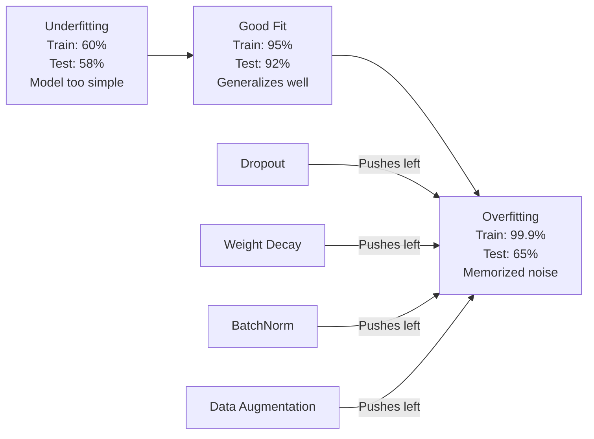
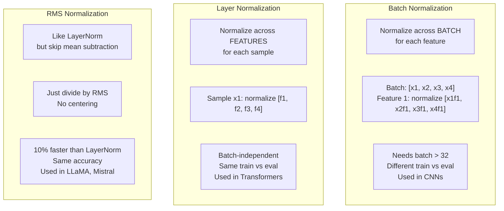
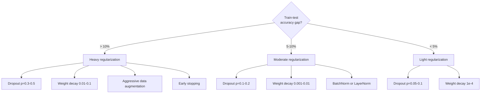

# 正则化

> 你的模型在训练数据上得到99%，在测试数据上只有60%。它记住了数据，而不是学会了规律。正则化是你对复杂度征收的税，以此迫使模型进行泛化。

**Type:** Build
**Languages:** Python
**Prerequisites:** 第03.06课（优化器）
**Time:** 约75分钟

## 学习目标

- 从零实现带反向缩放的 dropout、L2 权重衰减、批归一化、层归一化以及 RMSNorm
- 衡量训练-测试准确率差距，并通过正则化实验诊断过拟合
- 解释为什么 Transformer 使用 LayerNorm 而不是 BatchNorm，以及为什么现代 LLM 更青睐 RMSNorm
- 根据过拟合的严重程度，应用正确的正则化技术组合

## 问题所在

参数足够多的神经网络可以记住任何数据集。这不是假设——Zhang 等人（2017）通过在 ImageNet 上用随机标签训练标准网络证明了这一点。这些网络在完全随机的标签分配上达到了接近零的训练损失。它们记住了一百万对毫无规律可学的随机输入-输出对。训练损失完美无缺，测试准确率为零。

这就是过拟合问题，而且模型越大越严重。GPT-3 有 1750 亿个参数，训练集约 5000 亿个 token。拥有这么多参数，模型有足够的容量逐字记住训练数据的相当大一部分。如果没有正则化，它只会复述训练样本，而不是学习可泛化的模式。

训练性能与测试性能之间的差距就是过拟合差距。本课中的每种技术都从不同的角度攻击这个差距。Dropout 迫使网络不依赖任何单个神经元。权重衰减防止任何单个权重变得过大。批归一化平滑损失面，使优化器找到更平坦、更可泛化的极小值。层归一化做的是同样的事情，但在批归一化失效的场景下有效（小批量、变长序列）。RMSNorm 通过省去均值计算，速度快约10%。每种技术都很简单。它们组合在一起，就是"记住数据的模型"与"泛化的模型"之间的区别。

## 概念

### 过拟合光谱

每个模型都位于从欠拟合（太简单，无法捕捉规律）到过拟合（太复杂，把噪声也捕捉了）的光谱上的某个位置。最佳点在两者之间，而正则化从过拟合一侧把模型推向它。



### Dropout

这是最简单的正则化技术，却有着最优雅的解释。训练时，以概率 p 随机将每个神经元的输出置为零。

```
output = activation(z) * mask    where mask[i] ~ Bernoulli(1 - p)
```

当 p = 0.5 时，每次前向传播都有一半的神经元被置零。网络必须学习冗余的表示，因为它无法预测哪些神经元会可用。这防止了共适应——即神经元学会依赖特定其他神经元的存在。

集成解释：一个有 N 个神经元的网络加上 dropout 会产生 2^N 个可能的子网络（神经元开/关的每种组合）。用 dropout 训练近似于同时在不同的 mini-batch 上训练所有 2^N 个子网络。测试时，使用所有神经元（无 dropout），并将输出乘以 (1 - p) 以匹配训练时期的期望值。这等价于对 2^N 个子网络的预测取平均——来自单个模型的大规模集成。

实践中，缩放在训练阶段而非测试阶段进行（反向 dropout）：

```
During training:  output = activation(z) * mask / (1 - p)
During testing:   output = activation(z)   (no change needed)
```

这样更干净，因为测试代码完全不需要知道 dropout 的存在。

默认比率：Transformer 用 p = 0.1，MLP 用 p = 0.5，CNN 用 p = 0.2-0.3。更高的 dropout = 更强的正则化 = 更大的欠拟合风险。

### 权重衰减（L2 正则化）

将所有权重的平方和加入损失：

```
total_loss = task_loss + (lambda / 2) * sum(w_i^2)
```

正则化项的梯度是 lambda * w。这意味着每一步，每个权重都朝零缩小，缩小量与其大小成比例。大权重受到的惩罚更大。模型被推向没有任何单个权重占主导地位的解。

为什么这有助于泛化：过拟合的模型往往有大权重，会放大训练数据中的噪声。权重衰减保持权重较小，限制了模型的有效容量，迫使它依赖鲁棒、可泛化的特征，而不是记住的怪癖。

lambda 超参数控制强度。典型值：

- Transformer 上的 AdamW：0.01
- CNN 上的 SGD：1e-4
- 严重过拟合的模型：0.1

如第06课所讨论的：权重衰减与 L2 正则化在 SGD 中等价，但在 Adam 中不等价。用 Adam 训练时始终使用 AdamW（解耦的权重衰减）。

### 批归一化

在传递给下一层之前，对每一层的输出在 mini-batch 维度上做归一化。

对某一层的 mini-batch 激活值：

```
mu = (1/B) * sum(x_i)           (batch mean)
sigma^2 = (1/B) * sum((x_i - mu)^2)   (batch variance)
x_hat = (x_i - mu) / sqrt(sigma^2 + eps)   (normalize)
y = gamma * x_hat + beta        (scale and shift)
```

Gamma 和 beta 是可学习参数，允许网络在最优时撤销归一化。没有它们，你就强制每一层的输出都是零均值、单位方差，而这可能并非网络想要的。

**训练与推理的区分：** 训练时，mu 和 sigma 来自当前 mini-batch。推理时，使用训练期间积累的滑动平均（momentum = 0.1 的指数移动平均，即 90% 旧值 + 10% 新值）。

BatchNorm 为什么有效仍有争议。原论文声称它减少了"内部协变量偏移"（随着前层更新，层输入分布发生变化）。Santurkar 等人（2018）证明这一解释是错误的。真正的原因是：BatchNorm 使损失面更平滑。梯度更具预测性，Lipschitz 常数更小，优化器可以安全地迈出更大的步子。这就是 BatchNorm 让你能使用更高学习率并更快收敛的原因。

BatchNorm 有一个根本性的局限：它依赖批统计量。当 batch size 为 1 时，均值和方差毫无意义。当批量较小时（< 32），统计量带有噪声，损害性能。这对目标检测（内存限制批量大小）和语言建模（序列长度可变）等任务很重要。

### 层归一化

沿特征维度而非批量维度做归一化。对单个样本：

```
mu = (1/D) * sum(x_j)           (feature mean)
sigma^2 = (1/D) * sum((x_j - mu)^2)   (feature variance)
x_hat = (x_j - mu) / sqrt(sigma^2 + eps)
y = gamma * x_hat + beta
```

D 是特征维度。每个样本独立归一化——不依赖 batch size。这就是 Transformer 使用 LayerNorm 而非 BatchNorm 的原因。序列长度可变，批量大小通常很小（生成时可能为 1），且训练与推理的计算完全一致。

Transformer 中的 LayerNorm 在每个自注意力块和每个前馈块之后应用（Post-LN），或在它们之前应用（Pre-LN，训练时更稳定）。

### RMSNorm

去掉均值减法的 LayerNorm。由 Zhang & Sennrich（2019）提出。

```
rms = sqrt((1/D) * sum(x_j^2))
y = gamma * x / rms
```

就这么简单。没有均值计算，没有 beta 参数。其观察是：LayerNorm 中的重新中心化（均值减法）对模型性能的贡献微乎其微，却消耗计算。去掉它可以在开销减少约10%的情况下获得相同的准确率。

LLaMA、LLaMA 2、LLaMA 3、Mistral 以及大多数现代 LLM 使用 RMSNorm 而非 LayerNorm。在数十亿参数和数万亿 token 的规模下，这10%的节省非常可观。

### 归一化方法对比



### 数据增强作为正则化

这不是修改模型，而是修改数据。在保持标签不变的前提下变换训练输入：

- 图像：随机裁剪、翻转、旋转、颜色抖动、cutout
- 文本：同义词替换、回译、随机删除
- 音频：时间拉伸、音高偏移、添加噪声

其效果与正则化完全相同：它增加了训练集的有效规模，使模型更难记住具体样本。一个只见过每张图像原始形态的模型可以把它记住。一个见过每张图像 50 个增强版本的模型则被迫学习不变的结构。

### 早停

最简单的正则化器：当验证损失开始上升时停止训练。此时模型尚未过拟合。实践中，每个 epoch 跟踪验证损失，保存最佳模型，并继续训练一个"耐心"窗口（通常为 5-20 个 epoch）。如果验证损失在耐心窗口内没有改善，就停止训练并加载最佳保存的模型。

### 何时应用什么



```figure
l2-regularization
```

## 动手实现

### 第 1 步：Dropout（训练与评估模式）

```python
import random
import math


class Dropout:
    def __init__(self, p=0.5):
        self.p = p
        self.training = True
        self.mask = None

    def forward(self, x):
        if not self.training:
            return list(x)
        self.mask = []
        output = []
        for val in x:
            if random.random() < self.p:
                self.mask.append(0)
                output.append(0.0)
            else:
                self.mask.append(1)
                output.append(val / (1 - self.p))
        return output

    def backward(self, grad_output):
        grads = []
        for g, m in zip(grad_output, self.mask):
            if m == 0:
                grads.append(0.0)
            else:
                grads.append(g / (1 - self.p))
        return grads
```

### 第 2 步：L2 权重衰减

```python
def l2_regularization(weights, lambda_reg):
    penalty = 0.0
    for w in weights:
        penalty += w * w
    return lambda_reg * 0.5 * penalty

def l2_gradient(weights, lambda_reg):
    return [lambda_reg * w for w in weights]
```

### 第 3 步：批归一化

```python
class BatchNorm:
    def __init__(self, num_features, momentum=0.1, eps=1e-5):
        self.gamma = [1.0] * num_features
        self.beta = [0.0] * num_features
        self.eps = eps
        self.momentum = momentum
        self.running_mean = [0.0] * num_features
        self.running_var = [1.0] * num_features
        self.training = True
        self.num_features = num_features

    def forward(self, batch):
        batch_size = len(batch)
        if self.training:
            mean = [0.0] * self.num_features
            for sample in batch:
                for j in range(self.num_features):
                    mean[j] += sample[j]
            mean = [m / batch_size for m in mean]

            var = [0.0] * self.num_features
            for sample in batch:
                for j in range(self.num_features):
                    var[j] += (sample[j] - mean[j]) ** 2
            var = [v / batch_size for v in var]

            for j in range(self.num_features):
                self.running_mean[j] = (1 - self.momentum) * self.running_mean[j] + self.momentum * mean[j]
                self.running_var[j] = (1 - self.momentum) * self.running_var[j] + self.momentum * var[j]
        else:
            mean = list(self.running_mean)
            var = list(self.running_var)

        self.x_hat = []
        output = []
        for sample in batch:
            normalized = []
            out_sample = []
            for j in range(self.num_features):
                x_h = (sample[j] - mean[j]) / math.sqrt(var[j] + self.eps)
                normalized.append(x_h)
                out_sample.append(self.gamma[j] * x_h + self.beta[j])
            self.x_hat.append(normalized)
            output.append(out_sample)
        return output
```

### 第 4 步：层归一化

```python
class LayerNorm:
    def __init__(self, num_features, eps=1e-5):
        self.gamma = [1.0] * num_features
        self.beta = [0.0] * num_features
        self.eps = eps
        self.num_features = num_features

    def forward(self, x):
        mean = sum(x) / len(x)
        var = sum((xi - mean) ** 2 for xi in x) / len(x)

        self.x_hat = []
        output = []
        for j in range(self.num_features):
            x_h = (x[j] - mean) / math.sqrt(var + self.eps)
            self.x_hat.append(x_h)
            output.append(self.gamma[j] * x_h + self.beta[j])
        return output
```

### 第 5 步：RMSNorm

```python
class RMSNorm:
    def __init__(self, num_features, eps=1e-6):
        self.gamma = [1.0] * num_features
        self.eps = eps
        self.num_features = num_features

    def forward(self, x):
        rms = math.sqrt(sum(xi * xi for xi in x) / len(x) + self.eps)
        output = []
        for j in range(self.num_features):
            output.append(self.gamma[j] * x[j] / rms)
        return output
```

### 第 6 步：有无正则化的训练对比

```python
def sigmoid(x):
    x = max(-500, min(500, x))
    return 1.0 / (1.0 + math.exp(-x))


def make_circle_data(n=200, seed=42):
    random.seed(seed)
    data = []
    for _ in range(n):
        x = random.uniform(-2, 2)
        y = random.uniform(-2, 2)
        label = 1.0 if x * x + y * y < 1.5 else 0.0
        data.append(([x, y], label))
    return data


class RegularizedNetwork:
    def __init__(self, hidden_size=16, lr=0.05, dropout_p=0.0, weight_decay=0.0):
        random.seed(0)
        self.hidden_size = hidden_size
        self.lr = lr
        self.dropout_p = dropout_p
        self.weight_decay = weight_decay
        self.dropout = Dropout(p=dropout_p) if dropout_p > 0 else None

        self.w1 = [[random.gauss(0, 0.5) for _ in range(2)] for _ in range(hidden_size)]
        self.b1 = [0.0] * hidden_size
        self.w2 = [random.gauss(0, 0.5) for _ in range(hidden_size)]
        self.b2 = 0.0

    def forward(self, x, training=True):
        self.x = x
        self.z1 = []
        self.h = []
        for i in range(self.hidden_size):
            z = self.w1[i][0] * x[0] + self.w1[i][1] * x[1] + self.b1[i]
            self.z1.append(z)
            self.h.append(max(0.0, z))

        if self.dropout and training:
            self.dropout.training = True
            self.h = self.dropout.forward(self.h)
        elif self.dropout:
            self.dropout.training = False
            self.h = self.dropout.forward(self.h)

        self.z2 = sum(self.w2[i] * self.h[i] for i in range(self.hidden_size)) + self.b2
        self.out = sigmoid(self.z2)
        return self.out

    def backward(self, target):
        eps = 1e-15
        p = max(eps, min(1 - eps, self.out))
        d_loss = -(target / p) + (1 - target) / (1 - p)
        d_sigmoid = self.out * (1 - self.out)
        d_out = d_loss * d_sigmoid

        for i in range(self.hidden_size):
            d_relu = 1.0 if self.z1[i] > 0 else 0.0
            d_h = d_out * self.w2[i] * d_relu
            self.w2[i] -= self.lr * (d_out * self.h[i] + self.weight_decay * self.w2[i])
            for j in range(2):
                self.w1[i][j] -= self.lr * (d_h * self.x[j] + self.weight_decay * self.w1[i][j])
            self.b1[i] -= self.lr * d_h
        self.b2 -= self.lr * d_out

    def evaluate(self, data):
        correct = 0
        total_loss = 0.0
        for x, y in data:
            pred = self.forward(x, training=False)
            eps = 1e-15
            p = max(eps, min(1 - eps, pred))
            total_loss += -(y * math.log(p) + (1 - y) * math.log(1 - p))
            if (pred >= 0.5) == (y >= 0.5):
                correct += 1
        return total_loss / len(data), correct / len(data) * 100

    def train_model(self, train_data, test_data, epochs=300):
        history = []
        for epoch in range(epochs):
            total_loss = 0.0
            correct = 0
            for x, y in train_data:
                pred = self.forward(x, training=True)
                self.backward(y)
                eps = 1e-15
                p = max(eps, min(1 - eps, pred))
                total_loss += -(y * math.log(p) + (1 - y) * math.log(1 - p))
                if (pred >= 0.5) == (y >= 0.5):
                    correct += 1
            train_loss = total_loss / len(train_data)
            train_acc = correct / len(train_data) * 100
            test_loss, test_acc = self.evaluate(test_data)
            history.append((train_loss, train_acc, test_loss, test_acc))
            if epoch % 75 == 0 or epoch == epochs - 1:
                gap = train_acc - test_acc
                print(f"    Epoch {epoch:3d}: train_acc={train_acc:.1f}%, test_acc={test_acc:.1f}%, gap={gap:.1f}%")
        return history
```

## 使用它

PyTorch 以模块的形式提供了所有归一化和正则化方法：

```python
import torch
import torch.nn as nn

model = nn.Sequential(
    nn.Linear(784, 256),
    nn.BatchNorm1d(256),
    nn.ReLU(),
    nn.Dropout(0.3),
    nn.Linear(256, 128),
    nn.BatchNorm1d(128),
    nn.ReLU(),
    nn.Dropout(0.3),
    nn.Linear(128, 10),
)

model.train()
out_train = model(torch.randn(32, 784))

model.eval()
out_test = model(torch.randn(1, 784))
```

`model.train()` / `model.eval()` 的切换至关重要。它控制 dropout 的开/关，并告诉 BatchNorm 使用批统计量还是滑动统计量。推理前忘记调用 `model.eval()` 是深度学习中最常见的 bug 之一。你的测试准确率会随机波动，因为 dropout 仍然生效，而 BatchNorm 在使用 mini-batch 统计量。

对 Transformer 而言，模式有所不同：

```python
class TransformerBlock(nn.Module):
    def __init__(self, d_model=512, nhead=8, dropout=0.1):
        super().__init__()
        self.attention = nn.MultiheadAttention(d_model, nhead, dropout=dropout)
        self.norm1 = nn.LayerNorm(d_model)
        self.ff = nn.Sequential(
            nn.Linear(d_model, d_model * 4),
            nn.GELU(),
            nn.Linear(d_model * 4, d_model),
            nn.Dropout(dropout),
        )
        self.norm2 = nn.LayerNorm(d_model)
        self.dropout = nn.Dropout(dropout)

    def forward(self, x):
        attended, _ = self.attention(x, x, x)
        x = self.norm1(x + self.dropout(attended))
        x = self.norm2(x + self.ff(x))
        return x
```

LayerNorm，而非 BatchNorm。Dropout 用 p=0.1，而非 p=0.5。这些就是 Transformer 的默认设置。

## 交付成果

本课产出：
- `outputs/prompt-regularization-advisor.md` —— 一个诊断过拟合并推荐正确正则化策略的 prompt

## 练习

1. 为二维数据实现 spatial dropout：不是丢弃单个神经元，而是丢弃整个特征通道。通过将连续的特征组视为通道并丢弃整组来模拟。在 hidden_size=32 的 circle 数据集上，将训练-测试差距与标准 dropout 进行比较。

2. 将第05课的标签平滑与本课的 dropout 结合。用四种配置训练：都不用、只用 dropout、只用标签平滑、两者都用。测量每种配置的最终训练-测试准确率差距。哪种组合的差距最小？

3. 在你的 circle 数据集网络中，在隐藏层和激活函数之间添加一个 BatchNorm 层。在 0.01、0.05 和 0.1 的学习率下，分别在有和无 BatchNorm 的情况下训练。BatchNorm 应能在原始网络发散的更高学习率下实现稳定训练。

4. 实现早停：每个 epoch 跟踪测试损失，保存最佳权重，如果测试损失连续 20 个 epoch 没有改善则停止。运行正则化网络 1000 个 epoch。报告测试准确率最佳的 epoch 以及节省了多少个 epoch 的计算。

5. 在一个 4 层网络（不只是 2 层）上比较 LayerNorm 与 RMSNorm。用相同的权重初始化两者。训练 200 个 epoch，比较最终准确率、训练速度（每 epoch 耗时）以及第一层的梯度大小。验证 RMSNorm 在相同准确率下更快。

## 关键术语

| 术语 | 人们怎么说 | 实际含义 |
|------|----------------|----------------------|
| 过拟合 | "模型记住了数据" | 模型的训练性能显著超过其测试性能，表明它学到的是噪声而非信号 |
| 正则化 | "防止过拟合" | 任何约束模型复杂度以改善泛化的技术：dropout、权重衰减、归一化、增强 |
| Dropout | "随机删除神经元" | 训练时以概率 p 将随机神经元置零，迫使网络学习冗余表示；等价于训练一个集成模型 |
| 权重衰减 | "L2 惩罚" | 每步通过减去 lambda * w 将所有权重朝零缩小；通过权重大小惩罚复杂度 |
| 批归一化 | "按批次归一化" | 在训练时使用批统计量、推理时使用滑动平均，沿批量维度对层输出归一化 |
| 层归一化 | "按样本归一化" | 在每个样本内部沿特征维度归一化；与批量无关，用于批量大小可变的 Transformer |
| RMSNorm | "去掉均值的 LayerNorm" | 均方根归一化；去掉 LayerNorm 中的均值减法，以相等准确率获得约10%的速度提升 |
| 早停 | "在过拟合前停止" | 当验证损失不再改善时停止训练；最简单的正则化器，常与其他方法配合使用 |
| 数据增强 | "从少量数据生成更多数据" | 变换训练输入（翻转、裁剪、加噪）以增加数据集的有效规模并迫使模型学习不变性 |
| 泛化差距 | "训练-测试差距" | 训练性能与测试性能之间的差异；正则化的目标就是最小化这个差距 |

## 延伸阅读

- Srivastava 等人，"Dropout: A Simple Way to Prevent Neural Networks from Overfitting"（2014）—— dropout 的原始论文，包含集成解释和大量实验
- Ioffe & Szegedy，"Batch Normalization: Accelerating Deep Network Training by Reducing Internal Covariate Shift"（2015）—— 提出 BatchNorm 及其训练流程，是被引用最多的深度学习论文之一
- Zhang & Sennrich，"Root Mean Square Layer Normalization"（2019）—— 证明 RMSNorm 以更少的计算达到与 LayerNorm 相同的准确率；被 LLaMA 和 Mistral 采用
- Zhang 等人，"Understanding Deep Learning Requires Rethinking Generalization"（2017）—— 里程碑式论文，证明神经网络可以记住随机标签，挑战了传统的泛化观念