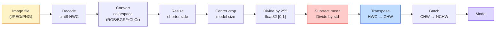
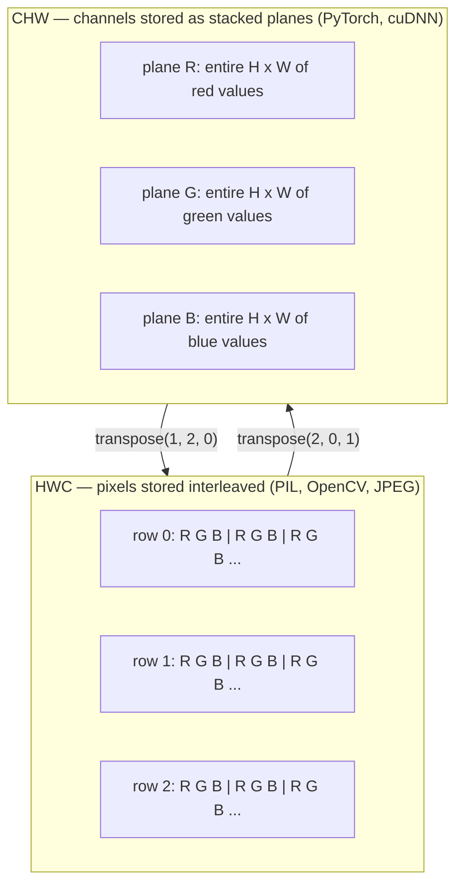

# 图像基础 — 像素、通道、色彩空间

> 图像是一个由光采样组成的张量。你将使用的每一个视觉模型都从这个事实出发。

**Type:** Build
**Languages:** Python
**Prerequisites:** Phase 1 Lesson 12 (Tensor Operations), Phase 3 Lesson 11 (Intro to PyTorch)
**Time:** ~45 分钟

## 学习目标

- 解释连续场景如何被离散化为像素，以及为什么采样/量化决策决定了所有下游模型的上限
- 将图像作为 NumPy 数组进行读取、切片和检查，并在 HWC 与 CHW 布局之间流畅切换
- 在 RGB、灰度、HSV 和 YCbCr 之间进行转换，并解释每种色彩空间存在的理由
- 按照 PyTorch 预训练视觉模型所期望的方式，精确执行像素级预处理（归一化、标准化、缩放、通道优先）

## 问题所在

你将读到的每一篇论文、下载的每一个预训练权重、调用的每一个视觉 API，都假设输入采用特定的编码方式。传入一张 `uint8` 图像而模型期望的是 `float32`，程序仍会运行——并且悄无声息地产生垃圾结果。给一个在 RGB 上训练的网络输入 BGR，准确率会下降十个百分点。当模型期望 channels-first 时输入 channels-last，第一个卷积层会把高度当作特征通道处理。以上这些都不会抛出错误，只会毁掉你的指标，然后你花一周时间去寻找一个存在于文件加载方式中的 bug。

一旦知道卷积在什么上面滑动，卷积本身并不复杂。难点在于“一张图像”对相机、JPEG 解码器、PIL、OpenCV、torchvision 和 CUDA kernel 意味着不同的事情。每个技术栈都有自己的轴顺序、字节范围和通道约定。分不清这些的视觉工程师交付的流水线必然是有缺陷的。

本课修复这一基础，让本阶段其余内容可以在此基础上构建。学完本课，你将知道像素是什么、为什么每个像素是三个数字而不是一个、“用 ImageNet 统计量归一化”究竟做了什么，以及如何在本阶段后续每节课都假设的两种或三种布局之间转换。

## 核心概念

### 完整预处理流水线一览

每个生产级视觉系统都是同一序列的可逆变换。弄错一步，模型看到的输入就与训练时不同。



红色和蓝色两个方框是 80% 静默故障的所在：缺少标准化和布局错误。

### 像素是采样点，不是方块

相机传感器统计落在微小探测器网格上的光子。每个探测器在几分之一秒内积分光线，并输出与命中光子数成正比的电压。传感器随后将该电压离散化为整数。一个探测器对应一个像素。

```
Continuous scene                 Sensor grid                     Digital image
(infinite detail)                (H x W detectors)               (H x W integers)

    ~~~~~                        +--+--+--+--+--+                 210 198 180 155 120
   ~   ~   ~                     |  |  |  |  |  |                 205 195 178 152 118
  ~ light ~      ---->           +--+--+--+--+--+     ---->       200 190 175 150 115
   ~~~~~                         |  |  |  |  |  |                 195 185 170 148 112
                                 +--+--+--+--+--+                 188 180 165 145 108
```

这一步有两个选择，它们决定了所有下游内容的上限：

- **空间采样**决定场景每度对应多少个探测器。太少，边缘会变得锯齿状（混叠）；太多，存储和计算量爆炸。
- **强度量化**决定电压被划分得多细。8 位提供 256 个级别，是显示的标准；10、12、16 位提供更平滑的渐变，在医学成像、HDR 和 raw 传感器流水线中很重要。

像素不是一块有面积的彩色方块，而是一次单独的测量。当你缩放或旋转时，是在对这个测量网格进行重采样。

### 为什么是三个通道

单个探测器统计整个可见光谱的光子——那就是灰度。为了获得颜色，传感器在网格上覆盖红、绿、蓝滤光片的马赛克。经过去马赛克处理后，每个空间位置都有三个整数：红滤光探测器的响应、绿滤光的，以及附近蓝滤光的。这三个整数就是像素的 RGB 三元组。

```
One pixel in memory:

    (R, G, B) = (210, 140, 30)   <- reddish-orange

An H x W RGB image:

    shape (H, W, 3)     stored as   H rows of W pixels of 3 values
                                    each in [0, 255] for uint8
```

三并不是什么魔法。深度相机会增加一个 Z 通道；卫星会增加红外和紫外波段；医学扫描通常有一个通道（X 光、CT）或许多通道（高光谱）。通道数是最后一个轴；卷积层学习在其上进行混合。

### 两种布局约定：HWC 和 CHW

同一个张量，两种排列。每个库选定其一。

```
HWC (height, width, channels)           CHW (channels, height, width)

   W ->                                    H ->
  +-----+-----+-----+                     +-----+-----+
H |R G B|R G B|R G B|                   C |R R R R R R|
| +-----+-----+-----+                   | +-----+-----+
v |R G B|R G B|R G B|                   v |G G G G G G|
  +-----+-----+-----+                     +-----+-----+
                                          |B B B B B B|
                                          +-----+-----+

   PIL, OpenCV, matplotlib,              PyTorch, most deep learning
   almost every image file on disk       frameworks, cuDNN kernels
```

CHW 存在的原因是卷积核在 H 和 W 上滑动。把通道轴放在最前意味着每个 kernel 看到的是每个通道一张连续的 2D 平面，可以高效地向量化。磁盘格式保留 HWC，因为这符合传感器逐行扫描输出的方式。

你将输入上千次的单行转换：

```
img_chw = img_hwc.transpose(2, 0, 1)      # NumPy
img_chw = img_hwc.permute(2, 0, 1)        # PyTorch tensor
```

内存布局可视化：



### 字节范围与 dtype

三种约定占主导：

| 约定 | dtype | 范围 | 出现场景 |
|------------|-------|-------|------------------|
| Raw | `uint8` | [0, 255] | 磁盘文件、PIL、OpenCV 输出 |
| 归一化 | `float32` | [0.0, 1.0] | 经过 `img.astype('float32') / 255` 之后 |
| 标准化 | `float32` | 大致 [-2, +2] | 减去均值并除以标准差之后 |

卷积网络是在标准化输入上训练的。ImageNet 统计量 `mean=[0.485, 0.456, 0.406]`、`std=[0.229, 0.224, 0.225]` 是整个 ImageNet 训练集上三个通道的算术均值和标准差，在 [0, 1] 归一化像素上计算。把 raw `uint8` 输入期望标准化浮点数的模型，是应用视觉中最常见的静默故障。

### 色彩空间及其存在理由

RGB 是采集格式，但对模型而言并不总是最有用的表示。

```
 RGB               HSV                       YCbCr / YUV

 R red             H hue (angle 0-360)       Y luminance (brightness)
 G green           S saturation (0-1)        Cb chroma blue-yellow
 B blue            V value/brightness (0-1)  Cr chroma red-green

 Linear to         Separates color from      Separates brightness from
 sensor output     brightness. Useful for    color. JPEG and most video
                   color thresholding, UI    codecs compress the chroma
                   sliders, simple filters   channels harder because the
                                             human eye is less sensitive
                                             to chroma detail than to Y.
```

对于大多数现代 CNN，你输入 RGB。在其他色彩空间相遇的场合：

- **HSV** — 传统 CV 代码、基于颜色的分割、白平衡。
- **YCbCr** — 阅读 JPEG 内部结构、视频流水线、仅在 Y 上运行的超分辨率模型。
- **灰度** — OCR、文档模型，以及任何颜色是干扰变量而非信号的场景。

从 RGB 转灰度是加权和而非平均，因为人眼对绿色比红色或蓝色更敏感：

```
Y = 0.299 R + 0.587 G + 0.114 B       (ITU-R BT.601, the classic weights)
```

### 宽高比、缩放与插值

每个模型都有固定的输入尺寸（大多数 ImageNet 分类器是 224x224，现代检测器是 384x384 或 512x512）。你的图像很少能直接匹配。三种重要的缩放选择：

- **缩放短边，再中心裁剪** — 标准 ImageNet 配方。保持宽高比，丢弃一圈边缘像素。
- **缩放并填充** — 保持宽高比和所有像素，加入黑边。检测和 OCR 的标准做法。
- **直接缩放到目标尺寸** — 拉伸图像。便宜，扭曲几何，对许多分类任务来说足够。

插值方法决定了当新网格与旧网格不对齐时中间像素如何计算：

```
Nearest neighbour     fastest, blocky, only choice for masks/labels
Bilinear              fast, smooth, default for most image resizing
Bicubic               slower, sharper on upscaling
Lanczos               slowest, best quality, used for final display
```

经验法则：训练用 bilinear，要查看的素材用 bicubic 或 lanczos，包含整数类别 ID 的任何内容用 nearest。

```figure
conv-output-size
```

## 动手实现

### 第 1 步：构建图像张量并检查其形状

从一个确定性的合成图像开始，这样第一个实验只依赖 NumPy 即可离线运行。文件解码是另一个独立的边界：一旦 JPEG 或 PNG 解码器返回 RGB 字节，下面的所有张量操作都是相同的。

```python
import numpy as np

def synthetic_rgb(h=128, w=192, seed=0):
    rng = np.random.default_rng(seed)
    yy, xx = np.meshgrid(np.linspace(0, 1, h), np.linspace(0, 1, w), indexing="ij")
    r = (np.sin(xx * 6) * 0.5 + 0.5) * 255
    g = yy * 255
    b = (1 - yy) * xx * 255
    rgb = np.stack([r, g, b], axis=-1) + rng.normal(0, 6, (h, w, 3))
    return np.clip(rgb, 0, 255).astype(np.uint8)

arr = synthetic_rgb()

print(f"type:   {type(arr).__name__}")
print(f"dtype:  {arr.dtype}")
print(f"shape:  {arr.shape}     # (H, W, C)")
print(f"min:    {arr.min()}")
print(f"max:    {arr.max()}")
print(f"pixel at (0, 0): {arr[0, 0]}")
```

预期输出：`shape: (H, W, 3)`、`dtype: uint8`，范围 `[0, 255]`。无论字节来自相机、图像解码器还是这个合成生成器，这都是标准的解码表示。

### 第 2 步：拆分通道并重排布局

分别取出 R、G、B，然后从 HWC 转换为 PyTorch 所需的 CHW。

```python
R = arr[:, :, 0]
G = arr[:, :, 1]
B = arr[:, :, 2]
print(f"R shape: {R.shape}, mean: {R.mean():.1f}")
print(f"G shape: {G.shape}, mean: {G.mean():.1f}")
print(f"B shape: {B.shape}, mean: {B.mean():.1f}")

arr_chw = arr.transpose(2, 0, 1)
print(f"\nHWC shape: {arr.shape}")
print(f"CHW shape: {arr_chw.shape}")
```

三张灰度平面，每通道一张。CHW 只是重排轴；在内存布局允许的情况下，并不严格需要数据复制。

### 第 3 步：灰度与 HSV 转换

加权求和转灰度，然后手动实现 RGB 到 HSV 的转换。

```python
def rgb_to_grayscale(rgb):
    weights = np.array([0.299, 0.587, 0.114], dtype=np.float32)
    return (rgb.astype(np.float32) @ weights).astype(np.uint8)

def rgb_to_hsv(rgb):
    rgb_f = rgb.astype(np.float32) / 255.0
    r, g, b = rgb_f[..., 0], rgb_f[..., 1], rgb_f[..., 2]
    cmax = np.max(rgb_f, axis=-1)
    cmin = np.min(rgb_f, axis=-1)
    delta = cmax - cmin

    h = np.zeros_like(cmax)
    mask = delta > 0
    argmax = np.argmax(rgb_f, axis=-1)
    rmax = mask & (argmax == 0)
    gmax = mask & (argmax == 1)
    bmax = mask & (argmax == 2)
    h[rmax] = ((g[rmax] - b[rmax]) / delta[rmax]) % 6
    h[gmax] = ((b[gmax] - r[gmax]) / delta[gmax]) + 2
    h[bmax] = ((r[bmax] - g[bmax]) / delta[bmax]) + 4
    h = h * 60.0

    s = np.divide(delta, cmax, out=np.zeros_like(delta), where=cmax > 0)
    v = cmax
    return np.stack([h, s, v], axis=-1)

gray = rgb_to_grayscale(arr)
hsv = rgb_to_hsv(arr)
print(f"gray shape: {gray.shape}, range: [{gray.min()}, {gray.max()}]")
print(f"hsv   shape: {hsv.shape}")
print(f"hue range: [{hsv[..., 0].min():.1f}, {hsv[..., 0].max():.1f}] degrees")
print(f"sat range: [{hsv[..., 1].min():.2f}, {hsv[..., 1].max():.2f}]")
print(f"val range: [{hsv[..., 2].min():.2f}, {hsv[..., 2].max():.2f}]")
```

色相以度为单位输出，饱和度和明度在 [0, 1] 范围内。这与 OpenCV 的 `hsv_full` 约定一致。

### 第 4 步：归一化、标准化及其逆操作

从 raw 字节得到预训练 ImageNet 模型所期望的确切张量，然后再转回去。

```python
mean = np.array([0.485, 0.456, 0.406], dtype=np.float32)
std = np.array([0.229, 0.224, 0.225], dtype=np.float32)

def preprocess_imagenet(rgb_uint8):
    x = rgb_uint8.astype(np.float32) / 255.0
    x = (x - mean) / std
    x = x.transpose(2, 0, 1)
    return x

def deprocess_imagenet(chw_float32):
    x = chw_float32.transpose(1, 2, 0)
    x = x * std + mean
    x = np.clip(x * 255.0, 0, 255).astype(np.uint8)
    return x

x = preprocess_imagenet(arr)
print(f"preprocessed shape: {x.shape}     # (C, H, W)")
print(f"preprocessed dtype: {x.dtype}")
print(f"preprocessed mean per channel:  {x.mean(axis=(1, 2)).round(3)}")
print(f"preprocessed std  per channel:  {x.std(axis=(1, 2)).round(3)}")

roundtrip = deprocess_imagenet(x)
max_diff = np.abs(roundtrip.astype(int) - arr.astype(int)).max()
print(f"roundtrip max pixel diff: {max_diff}    # should be 0 or 1")
```

每通道均值应接近零，标准差接近一。preprocess/deprocess 这对操作正是每个 torchvision `transforms.Normalize` 调用在底层做的事情。

### 第 5 步：从零实现缩放

最近邻将每个输出坐标四舍五入到单个源像素。双线性插值找到周围的四个像素并按距离加权混合。下面的两个实现都使用端点对齐坐标，因此第一个和最后一个源像素保持固定。

```python
def resize_coordinates(source_length, target_length):
    if target_length == 1:
        return np.zeros(1, dtype=np.float32)
    return np.linspace(0, source_length - 1, target_length, dtype=np.float32)

def nearest_resize(image, target_height, target_width):
    y = np.rint(resize_coordinates(image.shape[0], target_height)).astype(int)
    x = np.rint(resize_coordinates(image.shape[1], target_width)).astype(int)
    return image[y[:, None], x[None, :]]

def bilinear_resize(image, target_height, target_width):
    y = resize_coordinates(image.shape[0], target_height)
    x = resize_coordinates(image.shape[1], target_width)
    y0 = np.floor(y).astype(int)
    x0 = np.floor(x).astype(int)
    y1 = np.minimum(y0 + 1, image.shape[0] - 1)
    x1 = np.minimum(x0 + 1, image.shape[1] - 1)
    wy = (y - y0)[:, None, None]
    wx = (x - x0)[None, :, None]

    source = image.astype(np.float32)
    top = source[y0[:, None], x0[None, :]] * (1 - wx)
    top += source[y0[:, None], x1[None, :]] * wx
    bottom = source[y1[:, None], x0[None, :]] * (1 - wx)
    bottom += source[y1[:, None], x1[None, :]] * wx
    result = top * (1 - wy) + bottom * wy
    return np.clip(np.rint(result), 0, 255).astype(image.dtype)

target_height = arr.shape[0] * 3
target_width = arr.shape[1] * 3
nearest = nearest_resize(arr, target_height, target_width)
bilinear = bilinear_resize(arr, target_height, target_width)

def local_roughness(x):
    gy = np.diff(x.astype(float), axis=0)
    gx = np.diff(x.astype(float), axis=1)
    return float(np.abs(gy).mean() + np.abs(gx).mean())

for name, out in [("nearest", nearest), ("bilinear", bilinear)]:
    print(f"{name:>8}  shape={out.shape}  roughness={local_roughness(out):6.2f}")
```

nearest 在粗糙度上得分最高，因为它保留了硬边缘。bilinear 更平滑，因为每个新像素在每个轴上混合两个位置。可运行的配套代码将同样的可分离思想扩展到每轴四个邻居并使用 Catmull-Rom 三次核，然后在不借助图像库的情况下打印全部三个结果。

## 实际应用

PyTorch 在批量化、设备感知的张量上执行相同的操作。下面的代码缩放短边、进行中心裁剪、标准化每个通道，并生成预训练模型期望的 NCHW 张量。

```python
import torch
import torch.nn.functional as F

image_hwc = torch.from_numpy(synthetic_rgb(256, 320))
batch = image_hwc.permute(2, 0, 1).unsqueeze(0).float() / 255.0

height, width = batch.shape[-2:]
scale = 256 / min(height, width)
resized_height = round(height * scale)
resized_width = round(width * scale)
batch = F.interpolate(
    batch,
    size=(resized_height, resized_width),
    mode="bilinear",
    align_corners=False,
    antialias=True,
)

top = (resized_height - 224) // 2
left = (resized_width - 224) // 2
batch = batch[:, :, top:top + 224, left:left + 224]

mean = torch.tensor([0.485, 0.456, 0.406]).view(1, 3, 1, 1)
std = torch.tensor([0.229, 0.224, 0.225]).view(1, 3, 1, 1)
batch = (batch - mean) / std

print(f"tensor dtype: {batch.dtype}")
print(f"batched shape: {tuple(batch.shape)}")
print(f"per-channel mean: {batch.mean(dim=(0, 2, 3)).tolist()}")
print(f"per-channel std:  {batch.std(dim=(0, 2, 3)).tolist()}")
```

四个步骤，必须严格按此顺序：将字节转为浮点数并把 HWC 换为 NCHW，将短边缩放到 256，做 224x224 中心裁剪，然后减去 ImageNet 均值并除以其标准差。颠倒这个顺序会悄无声息地改变到达模型的内容。

## 交付成果

本课产出：

- `outputs/prompt-vision-preprocessing-audit.md` — 一个提示词，可将任何模型卡或数据集卡转化为团队必须遵守的确切预处理不变量清单。
- `outputs/skill-image-tensor-inspector.md` — 一个技能，给定任何图像形状的张量或数组，报告其 dtype、布局、范围，以及它看起来是 raw、归一化还是标准化。

## 练习

1. **（简单）** 创建一个 2x2 RGB `uint8` 数组，包含四种不同颜色。进行 HWC 到 CHW 的转换再转回来，打印两个形状，并证明往返转换保留了每个值。
2. **（中等）** 编写 `standardize(img, mean, std)` 及其逆函数，使二者一起通过任意 uint8 图像上的 `roundtrip_max_diff <= 1` 测试。你的函数必须以相同的调用同时适用于 HWC 的单张图像和 NCHW 的批量图像。
3. **（困难）** 取一个 3 通道 ImageNet 标准化张量，通过一个 1x1 卷积运行它，该卷积学习将 RGB 加权混合为单个灰度通道。将权重初始化为 `[0.299, 0.587, 0.114]`，冻结它们，并验证输出与你的手动 `rgb_to_grayscale` 在浮点误差范围内一致。还有哪些经典色彩空间变换可以写成 1x1 卷积？

## 关键术语

| 术语 | 人们的说法 | 实际含义 |
|------|----------------|----------------------|
| 像素 | “一个彩色方块” | 在某个网格位置上的一次光强度采样——彩色是三个数字，灰度是一个 |
| 通道 | “那个颜色” | 堆叠成图像张量的平行空间网格之一；HWC 中是最后一轴，CHW 中是第一轴 |
| HWC / CHW | “那个形状” | 图像张量的轴排列方式；磁盘和 PIL 使用 HWC，PyTorch 和 cuDNN 使用 CHW |
| 归一化 | “缩放图像” | 除以 255 使像素落在 [0, 1] ——必要但不充分 |
| 标准化 | “零中心化” | 按通道减去均值并除以标准差，使输入分布与模型训练时一致 |
| 灰度转换 | “对通道求平均” | 系数为 0.299/0.587/0.114 的加权和，符合人眼的亮度感知 |
| 插值 | “缩放如何选取像素” | 当新网格与旧网格不对齐时决定输出值的规则——标签用 nearest，训练用 bilinear，显示用 bicubic |
| 宽高比 | “宽除以高” | 区分“缩放并填充”与“缩放并拉伸”的比率 |

## 延伸阅读

- [Charles Poynton — A Guided Tour of Color Space](https://poynton.ca/PDFs/Guided_tour.pdf) — 关于为什么有这么多色彩空间以及何时各自重要的最清晰的技术阐述
- [PyTorch Vision Transforms Docs](https://pytorch.org/vision/stable/transforms.html) — 你在生产环境中实际组合使用的完整变换流水线
- [How JPEG Works (Colt McAnlis)](https://www.youtube.com/watch?v=F1kYBnY6mwg) — 关于色度子采样、DCT 以及 JPEG 为何编码 YCbCr 而非 RGB 的精彩可视化讲解
- [ImageNet Preprocessing Conventions (torchvision models)](https://pytorch.org/vision/stable/models.html) — 关于 `mean=[0.485, 0.456, 0.406]` 的权威来源，以及为什么模型库中的每个模型都期望它