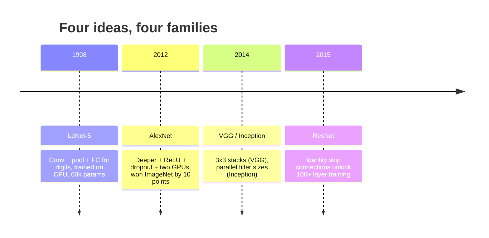
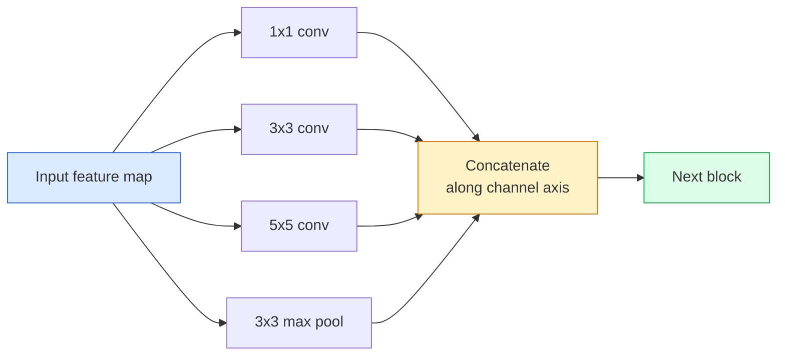
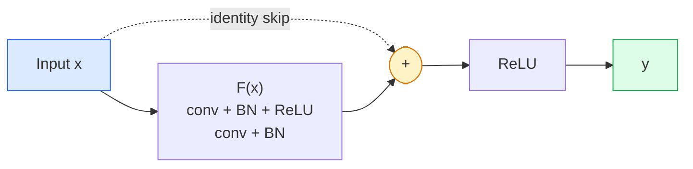

# CNN —— 从 LeNet 到 ResNet

> 过去三十年的每个主要 CNN 都是同一个“卷积–非线性–下采样”配方加上一个新想法。按顺序学习这些想法。

**Type:** Learn + Build
**Languages:** Python
**Prerequisites:** Phase 3 Lesson 11 (PyTorch), Phase 4 Lesson 01 (Image Fundamentals), Phase 4 Lesson 02 (Convolutions from Scratch)
**Time:** ~75 分钟

## 学习目标

- 梳理 LeNet-5 -> AlexNet -> VGG -> Inception -> ResNet 的架构谱系，并说出每个家族贡献的那一个新想法
- 在 PyTorch 中实现 LeNet-5、一个 VGG 风格的块和一个 ResNet BasicBlock，每个不超过 40 行
- 解释为什么残差连接能把一个 1000 层网络从无法训练变成最先进的水平
- 阅读一个现代主干网络(ResNet-18、ResNet-50),在查看源码之前预测其输出形状、感受野和参数量

## 问题所在

2011 年，最好的 ImageNet 分类器 top-5 准确率约为 74%。2012 年 AlexNet 达到 85%。2015 年 ResNet 达到 96%。没有新数据，没有新一代 GPU,提升全部来自架构想法。一个合格的视觉工程师必须知道哪个想法来自哪篇论文，因为你在 2026 年上线的每一个生产主干网络都是这些相同组件的重新组合——而且这些想法还在不断迁移：分组卷积从 CNN 传到了 transformer,残差连接从 ResNet 传到了现存的每一个 LLM,batch normalisation 存在于扩散模型之中。

按顺序研究这些网络还能让你免于一个常见错误：当一个 LeNet 规模的网络就能解决问题时，却伸手去拿最大的可用模型。MNIST 不需要 ResNet。了解每个家族的扩展曲线，才能知道该坐在曲线的哪个位置。

## 核心概念

### 改变视觉领域的四个想法



经典视觉领域中，没有其他东西能比这四个跃迁更重要。

### LeNet-5 (1998)

Yann LeCun 的数字识别器。60,000 个参数。两个卷积-池化块，两个全连接层，tanh 激活。它定义了每个 CNN 继承的模板：

```
input (1, 32, 32)
  conv 5x5 -> (6, 28, 28)
  avg pool 2x2 -> (6, 14, 14)
  conv 5x5 -> (16, 10, 10)
  avg pool 2x2 -> (16, 5, 5)
  flatten -> 400
  dense -> 120
  dense -> 84
  dense -> 10
```

现代世界所称的 CNN——交替的卷积与下采样，后面接一个小的分类头——就是层数更多、通道更宽、激活更好的 LeNet。

### AlexNet (2012)

三个变化共同突破了 ImageNet:

1. 用 **ReLU** 取代 tanh。梯度不再消失，训练速度提升六倍。
2. 全连接头中使用 **Dropout**。正则化变成一个层，而不是一个技巧。
3. **深度与宽度**。五个卷积层，三个全连接层，6000 万参数，模型拆分到两块 GPU 上训练。

论文的图 2 仍然把 GPU 拆分显示为两条并行流。那种并行是硬件上的权宜之计，不是架构洞见——但上述三个想法至今仍在你会用到的每个模型里。

### VGG (2014)

VGG 问的是：如果只用 3x3 卷积并且加深网络，会发生什么？

```
stack:   conv 3x3 -> conv 3x3 -> pool 2x2
repeat:  16 or 19 conv layers
```

两个 3x3 卷积看到与一个 5x5 卷积相同的 5x5 输入区域，但参数更少(2*9*C^2 = 18C^2 对比 25*C^2),且中间多了一层 ReLU。VGG 把这个观察变成了整个架构。这种简单性——一种块类型，不断重复——使它成为之后一切工作的参照点。

代价：1.38 亿参数，训练慢，推理开销大。

### Inception (2014，同年)

Google 对“我该用多大卷积核？”的回答是：全都用，并行地用。



每个分支各司其职——1x1 负责通道混合，3x3 负责局部纹理，5x5 负责更大的模式，池化负责平移不变特征——而拼接让下一层自行选择有用的分支。Inception v1 在每个分支内部使用 1x1 卷积作为瓶颈，以保持参数量在合理范围。

### 退化问题

到 2015 年，VGG-19 能训练，VGG-32 却不行。按理说深度应该有帮助，但超过约 20 层后，训练损失和测试损失都变得更差。这不是过拟合，而是优化器找不到有用的权重，因为梯度在每层都被乘性地缩小。

```
Plain deep network:
  y = f_L( f_{L-1}( ... f_1(x) ... ) )

Gradient wrt early layer:
  dL/dW_1 = dL/dy * df_L/df_{L-1} * ... * df_2/df_1 * df_1/dW_1

Each multiplicative term has magnitude roughly (weight magnitude) * (activation gain).
Stack 100 of them with gains < 1 and the gradient is effectively zero.
```

VGG 在 19 层时可行，是因为 batch norm(同期发表)让激活值保持良好的尺度。但即使是 batch norm 也无法拯救超过 30 层左右的深度。

### ResNet (2015)

He、Zhang、Ren、Sun 提出了一个解决所有问题的改动：

```
standard block:   y = F(x)
residual block:   y = F(x) + x
```

`+ x` 意味着该层总可以通过把 `F(x)` 驱动为零来选择什么都不做。一个 1000 层的 ResNet 现在最坏也不会比一个 1 层网络差，因为每个额外的块都有一个平凡的逃生通道。有了这个保证，优化器才愿意让每个块都*略微*有用——而略微有用，堆叠 100 次，就是最先进的水平。



块的两种变体无处不在：

- **BasicBlock** (ResNet-18, ResNet-34)：两个 3x3 卷积，跳跃连接绕过两者。
- **Bottleneck** (ResNet-50, -101, -152)：1x1 降维，3x3 中间，1x1 升维，跳跃连接绕过这三者。通道数很高时更省。

当跳跃连接必须跨越一个下采样(stride=2)时，恒等路径被替换为一个 stride=2 的 1x1 卷积以匹配形状。

### 为什么残差的意义超出视觉领域

这个想法其实并不真正关乎图像分类。它关乎把深度网络从“祈祷梯度能活下来”变成一个可靠、可扩展的工程工具。下一阶段你会读到的每个 transformer,其每个块中都有完全相同的跳跃连接。没有 ResNet,就没有 GPT。

```figure
pooling
```

## 动手构建

### 步骤 1：LeNet-5

一个极简、忠实的 LeNet。tanh 激活，平均池化。对现代性的唯一让步是我们下游使用 `nn.CrossEntropyLoss` 而不是原始的 Gaussian 连接。

```python
import torch
import torch.nn as nn
import torch.nn.functional as F

class LeNet5(nn.Module):
    def __init__(self, num_classes=10):
        super().__init__()
        self.conv1 = nn.Conv2d(1, 6, kernel_size=5)
        self.conv2 = nn.Conv2d(6, 16, kernel_size=5)
        self.pool = nn.AvgPool2d(2)
        self.fc1 = nn.Linear(16 * 5 * 5, 120)
        self.fc2 = nn.Linear(120, 84)
        self.fc3 = nn.Linear(84, num_classes)

    def forward(self, x):
        x = self.pool(torch.tanh(self.conv1(x)))
        x = self.pool(torch.tanh(self.conv2(x)))
        x = torch.flatten(x, 1)
        x = torch.tanh(self.fc1(x))
        x = torch.tanh(self.fc2(x))
        return self.fc3(x)

net = LeNet5()
x = torch.randn(1, 1, 32, 32)
print(f"output: {net(x).shape}")
print(f"params: {sum(p.numel() for p in net.parameters()):,}")
```

预期输出：`output: torch.Size([1, 10])`, `params: 61,706`。这就是开启现代视觉的整个数字分类器。

### 步骤 2：一个 VGG 块

一个可复用的块：两个 3x3 卷积、ReLU、batch norm、最大池化。

```python
class VGGBlock(nn.Module):
    def __init__(self, in_c, out_c):
        super().__init__()
        self.conv1 = nn.Conv2d(in_c, out_c, kernel_size=3, padding=1)
        self.bn1 = nn.BatchNorm2d(out_c)
        self.conv2 = nn.Conv2d(out_c, out_c, kernel_size=3, padding=1)
        self.bn2 = nn.BatchNorm2d(out_c)
        self.pool = nn.MaxPool2d(2)

    def forward(self, x):
        x = F.relu(self.bn1(self.conv1(x)))
        x = F.relu(self.bn2(self.conv2(x)))
        return self.pool(x)

class MiniVGG(nn.Module):
    def __init__(self, num_classes=10):
        super().__init__()
        self.stack = nn.Sequential(
            VGGBlock(3, 32),
            VGGBlock(32, 64),
            VGGBlock(64, 128),
        )
        self.head = nn.Sequential(
            nn.AdaptiveAvgPool2d(1),
            nn.Flatten(),
            nn.Linear(128, num_classes),
        )

    def forward(self, x):
        return self.head(self.stack(x))

net = MiniVGG()
x = torch.randn(1, 3, 32, 32)
print(f"output: {net(x).shape}")
print(f"params: {sum(p.numel() for p in net.parameters()):,}")
```

三个 VGG 块作用于 CIFAR 尺寸的输入，加一个自适应池化和一个线性层。约 29 万参数。对 CIFAR-10 来说足够了。

### 步骤 3：一个 ResNet BasicBlock

ResNet-18 和 ResNet-34 的核心构建块。

```python
class BasicBlock(nn.Module):
    def __init__(self, in_c, out_c, stride=1):
        super().__init__()
        self.conv1 = nn.Conv2d(in_c, out_c, kernel_size=3, stride=stride, padding=1, bias=False)
        self.bn1 = nn.BatchNorm2d(out_c)
        self.conv2 = nn.Conv2d(out_c, out_c, kernel_size=3, stride=1, padding=1, bias=False)
        self.bn2 = nn.BatchNorm2d(out_c)
        if stride != 1 or in_c != out_c:
            self.shortcut = nn.Sequential(
                nn.Conv2d(in_c, out_c, kernel_size=1, stride=stride, bias=False),
                nn.BatchNorm2d(out_c),
            )
        else:
            self.shortcut = nn.Identity()

    def forward(self, x):
        out = F.relu(self.bn1(self.conv1(x)))
        out = self.bn2(self.conv2(out))
        out = out + self.shortcut(x)
        return F.relu(out)
```

在卷积层上使用 `bias=False` 是 batch norm 的惯例——BN 的 beta 参数已经承担了偏置的角色，所以再携带卷积偏置就是浪费。`shortcut` 只有在 stride 或通道数变化时才需要一个真正的卷积；否则它就是一个无操作的恒等映射。

### 步骤 4：一个小型 ResNet

堆叠四组 BasicBlock,得到一个可用于 CIFAR 尺寸输入、能实际工作的 ResNet。

```python
class TinyResNet(nn.Module):
    def __init__(self, num_classes=10):
        super().__init__()
        self.stem = nn.Sequential(
            nn.Conv2d(3, 32, kernel_size=3, stride=1, padding=1, bias=False),
            nn.BatchNorm2d(32),
            nn.ReLU(inplace=True),
        )
        self.layer1 = self._make_group(32, 32, num_blocks=2, stride=1)
        self.layer2 = self._make_group(32, 64, num_blocks=2, stride=2)
        self.layer3 = self._make_group(64, 128, num_blocks=2, stride=2)
        self.layer4 = self._make_group(128, 256, num_blocks=2, stride=2)
        self.head = nn.Sequential(
            nn.AdaptiveAvgPool2d(1),
            nn.Flatten(),
            nn.Linear(256, num_classes),
        )

    def _make_group(self, in_c, out_c, num_blocks, stride):
        blocks = [BasicBlock(in_c, out_c, stride=stride)]
        for _ in range(num_blocks - 1):
            blocks.append(BasicBlock(out_c, out_c, stride=1))
        return nn.Sequential(*blocks)

    def forward(self, x):
        x = self.stem(x)
        x = self.layer1(x)
        x = self.layer2(x)
        x = self.layer3(x)
        x = self.layer4(x)
        return self.head(x)

net = TinyResNet()
x = torch.randn(1, 3, 32, 32)
print(f"output: {net(x).shape}")
print(f"params: {sum(p.numel() for p in net.parameters()):,}")
```

四组，每组两个块。第 2、3、4 组开头使用 stride 2。通道数在每个下采样处翻倍。约 280 万参数。这就是能干净地扩展到 ResNet-152 的标准配方。

### 步骤 5：比较参数-特征效率

用相同输入跑三个网络，比较参数量。

```python
def summary(name, net, x):
    y = net(x)
    params = sum(p.numel() for p in net.parameters())
    print(f"{name:12s}  input {tuple(x.shape)} -> output {tuple(y.shape)}  params {params:>10,}")

x = torch.randn(1, 3, 32, 32)
summary("LeNet5",     LeNet5(),       torch.randn(1, 1, 32, 32))
summary("MiniVGG",    MiniVGG(),      x)
summary("TinyResNet", TinyResNet(),   x)
```

三个模型，三个时代，三个数量级的参数差距。就 CIFAR-10 准确率而言，大致需要：LeNet 60%，MiniVGG 89%，TinyResNet 训练几个 epoch 后 93%。

## 实际使用

`torchvision.models` 提供了上述所有网络的预训练版本。调用签名在各家族之间完全一致，这正是主干网络抽象的意义所在。

```python
from torchvision.models import resnet18, ResNet18_Weights, vgg16, VGG16_Weights

r18 = resnet18(weights=ResNet18_Weights.IMAGENET1K_V1)
r18.eval()

print(f"ResNet-18 params: {sum(p.numel() for p in r18.parameters()):,}")
print(r18.layer1[0])
print()

v16 = vgg16(weights=VGG16_Weights.IMAGENET1K_V1)
v16.eval()
print(f"VGG-16   params: {sum(p.numel() for p in v16.parameters()):,}")
```

ResNet-18 有 1170 万参数。VGG-16 有 1.38 亿参数。ImageNet top-1 准确率相近(69.8% 对 71.6%)。残差连接为你带来 12 倍的参数效率优势。这就是为什么从 2016 年到 2021 年 ViT 出现之前，ResNet 变体一直占据主导——而且在算力受限的现实部署中至今仍是如此。

对于迁移学习，配方始终相同：加载预训练权重，冻结主干网络，替换分类头。

```python
for p in r18.parameters():
    p.requires_grad = False
r18.fc = nn.Linear(r18.fc.in_features, 10)
```

三行代码。你现在拥有一个 10 类的 CIFAR 分类器，继承了 ImageNet 付费换来的表示。

## 发布

本课产出：

- `outputs/prompt-backbone-selector.md` —— 一个提示词，根据任务、数据集规模和算力预算选择合适的 CNN 家族(LeNet/VGG/ResNet/MobileNet/ConvNeXt)。
- `outputs/skill-residual-block-reviewer.md` —— 一个技能，阅读 PyTorch 模块并标记跳跃连接的错误(stride 变化时缺少 shortcut、shortcut 激活顺序、BN 相对于加法的位置)。

## 练习

1. **(简单)** 手动逐层计算 `TinyResNet` 的参数量。与 `sum(p.numel() for p in net.parameters())` 对比。参数预算的大头去了哪里——卷积、BN,还是分类头？
2. **(中等)** 实现 Bottleneck 块(1x1 -> 3x3 -> 1x1,带跳跃连接)，并用它构建一个 ResNet-50 风格的 CIFAR 网络。与 `TinyResNet` 比较参数量。
3. **(困难)** 从 `BasicBlock` 中移除跳跃连接，分别在 CIFAR-10 上训练一个 34 块的“朴素”网络和一个 34 块的 ResNet 各 10 个 epoch。画出两者的训练损失随 epoch 的曲线。复现 He 等人图 1 的结果：朴素深网络收敛到比其较浅孪生网络更高的损失。

## 关键术语

| 术语 | 人们怎么说 | 实际含义 |
|------|----------------|----------------------|
| Backbone | "模型本身" | 产生特征图、供任务头使用的卷积块堆栈 |
| Residual connection | "跳跃连接" | `y = F(x) + x`；通过把 F 设为零让优化器可以学习恒等映射，从而使任意深度都可训练 |
| BasicBlock | "两个带跳跃连接的 3x3 卷积" | ResNet-18/34 的构建块：conv-BN-ReLU-conv-BN-add-ReLU |
| Bottleneck | "1x1 降维，3x3，1x1 升维" | ResNet-50/101/152 的块；在高通道数时很省，因为 3x3 在降低了的宽度上运行 |
| Degradation problem | "越深越差" | 超过约 20 层朴素卷积后，训练误差和测试误差都上升；解决方案是残差连接，不是更多数据 |
| Stem | "第一层" | 把 3 通道输入转换为基础特征宽度的初始卷积；ImageNet 上通常是 7x7 stride 2,CIFAR 上是 3x3 stride 1 |
| Head | "分类器" | 主干网络最后一个块之后的层：自适应池化、展平、若干线性层 |
| Transfer learning | "预训练权重" | 加载在 ImageNet 上训练的主干网络，只对你的任务微调头部 |

## 延伸阅读

- [Deep Residual Learning for Image Recognition (He et al., 2015)](https://arxiv.org/abs/1512.03385) —— ResNet 论文；每一张图都值得研究
- [Very Deep Convolutional Networks (Simonyan & Zisserman, 2014)](https://arxiv.org/abs/1409.1556) —— VGG 论文；仍是"为什么用 3x3"的最佳参考
- [ImageNet Classification with Deep CNNs (Krizhevsky et al., 2012)](https://papers.nips.cc/paper_files/paper/2012/hash/c399862d3b9d6b76c8436e924a68c45b-Abstract.html) —— AlexNet；终结手工特征时代的论文
- [Going Deeper with Convolutions (Szegedy et al., 2014)](https://arxiv.org/abs/1409.4842) —— Inception v1；至今仍出现在视觉 transformer 中的并行滤波器想法