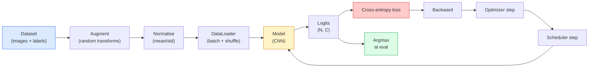

# 图像分类

> 分类器是一个从像素到类别概率分布的函数。其余一切都只是管道工程。

**Type:** Build
**Languages:** Python
**Prerequisites:** 阶段 2 第 09 课（模型评估）、阶段 3 第 10 课（迷你框架）、阶段 4 第 03 课（CNN）
**Time:** 约 75 分钟

## 学习目标

- 在 CIFAR-10 上构建一个端到端的图像分类管道：数据集、数据增强、模型、训练循环、评估
- 解释每个组件（dataloader、损失、优化器、调度器、数据增强）的作用，并预测破坏其中任何一个会在损失曲线上如何表现
- 从零实现 mixup、cutout 和 label smoothing，并论证何时值得引入每一种
- 通过阅读混淆矩阵和逐类 precision/recall 表，诊断超出总体准确率之外的数据集和模型故障

## 问题

任何实际落地的视觉任务，都在某种程度上归结为图像分类。检测是对区域分类，分割是对像素分类，检索是按与类别质心的相似度排序。把分类做对——数据集循环、增强策略、损失、评估——是能迁移到本阶段所有其他任务的核心技能。

大多数分类 bug 并不在模型里。它们藏在管道中：一个错误的归一化、一个未打乱的训练集、扭曲标签的数据增强、被训练数据污染的验证集划分、在第 30 个 epoch 之后悄然发散的学习率。一个在正确配置下能在 CIFAR-10 上达到 93% 的 CNN，配置错误时通常只能拿 70-75%，而且整个过程中损失曲线看起来都很正常。

本课亲手搭建整条管道，让每个部分都可检查。你不会使用 `torchvision.datasets` 中任何可能掩盖 bug 的东西。

## 概念

### 分类管道



这个循环中的每一行代码都可能是 bug 的藏身之处。交叉熵接收原始 logits 而不是 softmax 输出，因此在损失之前任何 `model(x).softmax()` 都会悄悄计算出错误的梯度。增强只作用于输入而不作用于标签——mixup 除外，它同时混合两者。`optimizer.zero_grad()` 必须每步执行一次；遗漏它会导致梯度累积，表现起来像学习率极不稳定。以上每个 bug 都会让学习曲线变平，且不抛出任何错误。

### 交叉熵、logits 与 softmax

分类器为每张图像输出 `C` 个数，称为 logits。应用 softmax 可将其转换为概率分布：

```
softmax(z)_i = exp(z_i) / sum_j exp(z_j)
```

交叉熵度量正确类别的负对数概率：

```
CE(z, y) = -log( softmax(z)_y )
        = -z_y + log( sum_j exp(z_j) )
```

右边这种形式是数值稳定的版本（log-sum-exp）。PyTorch 的 `nn.CrossEntropyLoss` 将 softmax + NLL 融合为一个操作，直接接收原始 logits。自己先做一次 softmax 几乎总是一个 bug——你计算的是 log(softmax(softmax(z)))，一个没有意义的量。

### 增强为什么有效

CNN 对平移（来自权重共享）有归纳偏置，但对裁剪、翻转、色彩抖动或遮挡没有内置的不变性。教会它这些不变性的唯一方法，就是给它看能体现这些不变性的像素。训练中每一个随机变换都是在说："这两张图有相同的标签；去学习那些忽略差异的特征。"

```
Original crop:  "dog facing left"
Flip:           "dog facing right"       <- same label, different pixels
Rotate(+15):    "dog, slight tilt"
Colour jitter:  "dog in warmer light"
RandomErasing:  "dog with patch missing"
```

规则：增强必须保持标签不变。对数字做 cutout 和旋转可能把"6"变成"9"；对那种数据集，应使用更小的旋转范围，并选择尊重数字特有不变性的增强方式。

### Mixup 与 cutmix

普通增强变换像素，但标签保持 one-hot。**Mixup** 和 **cutmix** 打破了这一点，对两者同时进行插值。

```
Mixup:
  lambda ~ Beta(a, a)
  x = lambda * x_i + (1 - lambda) * x_j
  y = lambda * y_i + (1 - lambda) * y_j

Cutmix:
  paste a random rectangle of x_j into x_i
  y = area-weighted mix of y_i and y_j
```

为什么有效：模型不再记忆尖锐的 one-hot 目标，而是学会在类别之间插值。训练损失上升，测试准确率也上升。这是任何分类器最便宜的单项鲁棒性升级。

### Label smoothing

Mixup 的近亲。不再针对 `[0, 0, 1, 0, 0]` 训练，而是针对 `[eps/C, eps/C, 1-eps, eps/C, eps/C]` 训练，用一个较小的 `eps`（如 0.1）。防止模型产生任意尖锐的 logits，几乎零成本地改善校准。自 PyTorch 1.10 起已内置于 `nn.CrossEntropyLoss(label_smoothing=0.1)`。

### 准确率之外的评估

总体准确率掩盖不平衡。一个永远预测多数类的 90-10 二分类器也能得 90%。真正能告诉你发生了什么的工具：

- **逐类准确率** —— 每个类别一个数字；立刻暴露表现不佳的类别。
- **混淆矩阵** —— C x C 网格，第 i 行第 j 列 = 真实类别 i 被预测为类别 j 的次数；对角线是正确的部分，非对角线才是你的模型真正的问题所在。
- **Top-1 / Top-5** —— 正确类别是否位于前 1 或前 5 个预测中；Top-5 对 ImageNet 很重要，因为像"Norwich terrier"与"Norfolk terrier"这样的类别确实难以区分。
- **校准（ECE）** —— 一个置信度为 0.8 的预测是否在 80% 的情况下正确？现代网络系统性地过度自信；用温度缩放或 label smoothing 修复。

```figure
receptive-field
```

## 动手构建

### 第 1 步：一个确定性的合成数据集

CIFAR-10 存放在磁盘上。为了让本课可复现且快速，我们构建一个看起来像 CIFAR 的合成数据集——32x32 RGB 图像，带有模型必须学习的类别特定结构。完全相同的管道无需修改即可用于真实的 CIFAR-10。

```python
import numpy as np
import torch
from torch.utils.data import Dataset


def synthetic_cifar(num_per_class=1000, num_classes=10, seed=0):
    rng = np.random.default_rng(seed)
    X = []
    Y = []
    for c in range(num_classes):
        centre = rng.uniform(0, 1, (3,))
        freq = 2 + c
        for _ in range(num_per_class):
            yy, xx = np.meshgrid(np.linspace(0, 1, 32), np.linspace(0, 1, 32), indexing="ij")
            r = np.sin(xx * freq) * 0.5 + centre[0]
            g = np.cos(yy * freq) * 0.5 + centre[1]
            b = (xx + yy) * 0.5 * centre[2]
            img = np.stack([r, g, b], axis=-1)
            img += rng.normal(0, 0.08, img.shape)
            img = np.clip(img, 0, 1)
            X.append(img.astype(np.float32))
            Y.append(c)
    X = np.stack(X)
    Y = np.array(Y)
    idx = rng.permutation(len(X))
    return X[idx], Y[idx]


class ArrayDataset(Dataset):
    def __init__(self, X, Y, transform=None):
        self.X = X
        self.Y = Y
        self.transform = transform

    def __len__(self):
        return len(self.X)

    def __getitem__(self, i):
        img = self.X[i]
        if self.transform is not None:
            img = self.transform(img)
        img = torch.from_numpy(img).permute(2, 0, 1)
        return img, int(self.Y[i])
```

每个类别有自己专属的调色板和频率模式，外加高斯噪声，迫使模型学习信号而不是记忆像素。十个类别，每个一千张图像，打乱排列。

### 第 2 步：归一化与增强

每个视觉管道都有的两个变换。

```python
def standardize(mean, std):
    mean = np.array(mean, dtype=np.float32)
    std = np.array(std, dtype=np.float32)
    def _fn(img):
        return (img - mean) / std
    return _fn


def random_hflip(p=0.5):
    def _fn(img):
        if np.random.random() < p:
            return img[:, ::-1, :].copy()
        return img
    return _fn


def random_crop(pad=4):
    def _fn(img):
        h, w = img.shape[:2]
        padded = np.pad(img, ((pad, pad), (pad, pad), (0, 0)), mode="reflect")
        y = np.random.randint(0, 2 * pad)
        x = np.random.randint(0, 2 * pad)
        return padded[y:y + h, x:x + w, :]
    return _fn


def compose(*fns):
    def _fn(img):
        for fn in fns:
            img = fn(img)
        return img
    return _fn
```

裁剪前用反射填充（reflect-pad）而非零填充，因为黑色边框是一种信号，模型会以无用方式学会忽略它。

### 第 3 步：Mixup

在训练步内部混合两张图像和两个标签。实现为一个批次变换，因此它位于前向传播旁边，而不是在数据集内部。

```python
def mixup_batch(x, y, num_classes, alpha=0.2):
    if alpha <= 0:
        return x, torch.nn.functional.one_hot(y, num_classes).float()
    lam = float(np.random.beta(alpha, alpha))
    idx = torch.randperm(x.size(0), device=x.device)
    x_mixed = lam * x + (1 - lam) * x[idx]
    y_onehot = torch.nn.functional.one_hot(y, num_classes).float()
    y_mixed = lam * y_onehot + (1 - lam) * y_onehot[idx]
    return x_mixed, y_mixed


def soft_cross_entropy(logits, soft_targets):
    log_probs = torch.log_softmax(logits, dim=-1)
    return -(soft_targets * log_probs).sum(dim=-1).mean()
```

`soft_cross_entropy` 是针对软标签分布的交叉熵。当目标恰好是 one-hot 时，它退化为通常的 one-hot 情形。

### 第 4 步：训练循环

完整配方：遍历数据一遍，每批次做一次梯度，调度器每 epoch 步进一次。

```python
import torch
import torch.nn as nn
from torch.utils.data import DataLoader
from torch.optim import SGD
from torch.optim.lr_scheduler import CosineAnnealingLR

def train_one_epoch(model, loader, optimizer, device, num_classes, use_mixup=True):
    model.train()
    total, correct, loss_sum = 0, 0, 0.0
    for x, y in loader:
        x, y = x.to(device), y.to(device)
        if use_mixup:
            x_m, y_soft = mixup_batch(x, y, num_classes)
            logits = model(x_m)
            loss = soft_cross_entropy(logits, y_soft)
        else:
            logits = model(x)
            loss = nn.functional.cross_entropy(logits, y, label_smoothing=0.1)
        optimizer.zero_grad()
        loss.backward()
        optimizer.step()
        loss_sum += loss.item() * x.size(0)
        total += x.size(0)
        # Training accuracy vs the un-mixed labels `y` is only an approximation
        # when mixup is on (the model saw soft targets, not y). Treat it as a
        # rough progress signal; rely on val accuracy for real performance.
        with torch.no_grad():
            pred = logits.argmax(dim=-1)
            correct += (pred == y).sum().item()
    return loss_sum / total, correct / total


@torch.no_grad()
def evaluate(model, loader, device, num_classes):
    model.eval()
    total, correct = 0, 0
    loss_sum = 0.0
    cm = torch.zeros(num_classes, num_classes, dtype=torch.long)
    for x, y in loader:
        x, y = x.to(device), y.to(device)
        logits = model(x)
        loss = nn.functional.cross_entropy(logits, y)
        pred = logits.argmax(dim=-1)
        for t, p in zip(y.cpu(), pred.cpu()):
            cm[t, p] += 1
        loss_sum += loss.item() * x.size(0)
        total += x.size(0)
        correct += (pred == y).sum().item()
    return loss_sum / total, correct / total, cm
```

每次编写训练循环时都要检查的五个不变量：

1. 训练前 `model.train()`，评估前 `model.eval()` —— 切换 dropout 和 batchnorm 的行为。
2. 在 `.backward()` 之前 `.zero_grad()`。
3. 累积指标时 `.item()`，以免任何东西让计算图保持存活。
4. 评估期间 `@torch.no_grad()` —— 节省内存和时间，防止微妙的意外。
5. 对原始 logits 做 argmax，而不是 softmax —— 结果相同，少一个操作。

### 第 5 步：组装起来

使用上一课的 `TinyResNet`，训练几个 epoch，然后评估。

```python
from main import synthetic_cifar, ArrayDataset
from main import standardize, random_hflip, random_crop, compose
from main import mixup_batch, soft_cross_entropy
from main import train_one_epoch, evaluate
# TinyResNet comes from the previous lesson (03-cnns-lenet-to-resnet).
# Adjust the import path to wherever you stored the previous lesson's code.
from cnns_lenet_to_resnet import TinyResNet  # example placeholder

X, Y = synthetic_cifar(num_per_class=500)
split = int(0.9 * len(X))
X_train, Y_train = X[:split], Y[:split]
X_val, Y_val = X[split:], Y[split:]

mean = [0.5, 0.5, 0.5]
std = [0.25, 0.25, 0.25]
train_tf = compose(random_hflip(), random_crop(pad=4), standardize(mean, std))
eval_tf = standardize(mean, std)

train_ds = ArrayDataset(X_train, Y_train, transform=train_tf)
val_ds = ArrayDataset(X_val, Y_val, transform=eval_tf)

train_loader = DataLoader(train_ds, batch_size=128, shuffle=True, num_workers=0)
val_loader = DataLoader(val_ds, batch_size=256, shuffle=False, num_workers=0)

device = "cuda" if torch.cuda.is_available() else "cpu"
model = TinyResNet(num_classes=10).to(device)
optimizer = SGD(model.parameters(), lr=0.1, momentum=0.9, weight_decay=5e-4, nesterov=True)
scheduler = CosineAnnealingLR(optimizer, T_max=10)

for epoch in range(10):
    tr_loss, tr_acc = train_one_epoch(model, train_loader, optimizer, device, 10, use_mixup=True)
    va_loss, va_acc, _ = evaluate(model, val_loader, device, 10)
    scheduler.step()
    print(f"epoch {epoch:2d}  lr {scheduler.get_last_lr()[0]:.4f}  "
          f"train {tr_loss:.3f}/{tr_acc:.3f}  val {va_loss:.3f}/{va_acc:.3f}")
```

在合成数据集上，五个 epoch 内就能达到接近完美的验证准确率，这正是重点：管道是正确的，模型能学到一切可学的东西。换成真实的 CIFAR-10，同一个循环无需修改即可训练到约 90%。

### 第 6 步：阅读混淆矩阵

仅凭准确率永远无法告诉你模型在哪里失败。混淆矩阵可以。

```python
def print_confusion(cm, labels=None):
    c = cm.shape[0]
    labels = labels or [str(i) for i in range(c)]
    print(f"{'':>6}" + "".join(f"{l:>5}" for l in labels))
    for i in range(c):
        row = cm[i].tolist()
        print(f"{labels[i]:>6}" + "".join(f"{v:>5}" for v in row))
    print()
    tp = cm.diag().float()
    fp = cm.sum(dim=0).float() - tp
    fn = cm.sum(dim=1).float() - tp
    prec = tp / (tp + fp).clamp_min(1)
    rec = tp / (tp + fn).clamp_min(1)
    f1 = 2 * prec * rec / (prec + rec).clamp_min(1e-9)
    for i in range(c):
        print(f"{labels[i]:>6}  prec {prec[i]:.3f}  rec {rec[i]:.3f}  f1 {f1[i]:.3f}")

_, _, cm = evaluate(model, val_loader, device, 10)
print_confusion(cm)
```

行是真实类别，列是预测。类别 3 和类别 5 之间聚集的非对角计数意味着模型混淆了这两类，并为你提供了针对性数据收集或类别专属增强的切入点。

## 实际应用

`torchvision` 将上述一切封装为符合惯例的组件。对于真实的 CIFAR-10，完整管道只需四行代码加一个训练循环。

```python
from torchvision.datasets import CIFAR10
from torchvision.transforms import Compose, RandomCrop, RandomHorizontalFlip, ToTensor, Normalize

mean = (0.4914, 0.4822, 0.4465)
std = (0.2470, 0.2435, 0.2616)
train_tf = Compose([
    RandomCrop(32, padding=4, padding_mode="reflect"),
    RandomHorizontalFlip(),
    ToTensor(),
    Normalize(mean, std),
])
eval_tf = Compose([ToTensor(), Normalize(mean, std)])

train_ds = CIFAR10(root="./data", train=True,  download=True, transform=train_tf)
val_ds   = CIFAR10(root="./data", train=False, download=True, transform=eval_tf)
```

有两点值得注意：均值/标准差是**数据集专属的**——在 CIFAR-10 训练集上计算，而不是 ImageNet——而反射填充是社区默认的裁剪策略。在这里照搬 ImageNet 统计量是一个约 1% 的准确率流失，直到有人对模型做性能剖析才会被发现。

## 交付

本课产出：

- `outputs/prompt-classifier-pipeline-auditor.md` —— 一个提示词，用于审查训练脚本是否符合上述五个不变量，并暴露第一个违规之处。
- `outputs/skill-classification-diagnostics.md` —— 一个技能，给定混淆矩阵和类别名称列表，总结逐类失败并提出单一最具影响力的修复方案。

## 练习

1. **（简单）** 在合成数据集上，用和不用 mixup 各训练同一模型五个 epoch。绘制两者的训练损失和验证损失。解释为什么使用 mixup 时训练损失更高，而验证准确率相近甚至更好。
2. **（中等）** 实现 Cutout——在每张训练图像中随机将一个 8x8 方块置零——并进行消融实验：无增强、hflip+crop、hflip+crop+cutout、hflip+crop+mixup。报告每种设置的验证准确率。
3. **（困难）** 构建一个 CIFAR-100 管道（100 个类别，相同输入尺寸），并复现 ResNet-34 训练，准确率与已发表结果相差在 1% 以内。附加任务：扫描三个学习率和两个权重衰减，记录到本地 CSV，生成最终的混淆矩阵-高频混淆表。

## 关键术语

| 术语 | 人们怎么说 | 实际含义 |
|------|----------------|----------------------|
| Logits | "原始输出" | 每张图像 softmax 前的 C 个数组成的向量；交叉熵期望的是这些，而不是 softmax 之后的值 |
| 交叉熵 | "那个损失" | 正确类别的负对数概率；将 log-softmax 和 NLL 合并为一个稳定的操作 |
| DataLoader | "分批器" | 用打乱、分批和（可选的）多进程加载包装数据集；一半的训练 bug 都被归咎于它 |
| 数据增强 | "随机变换" | 训练时任何保持标签不变的像素级变换；教给 CNN 原生不具备的不变性 |
| Mixup / Cutmix | "混合两张图像" | 同时混合输入和标签，使分类器学习平滑插值而非硬边界 |
| Label smoothing | "更软的目标" | 将 one-hot 替换为 (1-eps, eps/(C-1), ...)；改善校准并略微提升准确率 |
| Top-k 准确率 | "Top-5" | 正确类别位于概率最高的 k 个预测之中；用于确实难以区分的数据集 |
| 混淆矩阵 | "错误所在之处" | C x C 表，条目 (i, j) 统计真实类别 i 被预测为 j 的图像数；对角线是正确的，非对角线告诉你该修什么 |

## 延伸阅读

- [CS231n: Training Neural Networks](https://cs231n.github.io/neural-networks-3/) —— 单页篇幅内对训练管道最清晰的一次讲解
- [Bag of Tricks for Image Classification (He et al., 2019)](https://arxiv.org/abs/1812.01187) —— 所有小技巧的总和，为 ResNet 在 ImageNet 上的准确率带来 3-4% 的提升
- [mixup: Beyond Empirical Risk Minimization (Zhang et al., 2017)](https://arxiv.org/abs/1710.09412) —— mixup 原始论文；三页理论加上令人信服的实验
- [Why temperature scaling matters (Guo et al., 2017)](https://arxiv.org/abs/1706.04599) —— 证明了现代网络校准失调并用一个标量参数修复它的论文