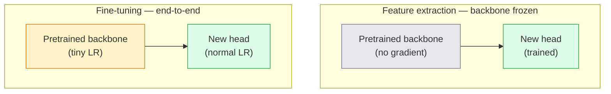

# 迁移学习与微调

> 别人已经花费了上百万 GPU 小时教会一个网络认识边缘、纹理和物体部件长什么样。在训练你自己的模型之前，你应该先借用这些特征。

**Type:** Build
**Languages:** Python
**Prerequisites:** Phase 4 Lesson 03（CNN）、Phase 4 Lesson 04（图像分类）
**Time:** 约 75 分钟

## 学习目标

- 区分特征提取与微调，并根据数据集规模、领域距离和算力预算选择合适的方法
- 加载预训练骨干网络，替换其分类头，在不到 20 行代码内只训练分类头并得到可用的基线
- 使用分层学习率渐进式解冻层，使早期的通用特征比后期的任务特定特征获得更小的更新
- 诊断三种常见失败：解冻块上学习率过高导致的特征漂移、小数据集上 BN 统计量崩坏，以及灾难性遗忘

## 问题所在

在 ImageNet 上训练一个 ResNet-50 大约需要 2,000 GPU 小时。几乎没有团队能为他们发布的每个任务都提供这样的预算。实际上几乎所有团队发布的都是一个预训练骨干网络，加上一个在几百或几千张任务相关图像上训练的新分类头。

这不是捷径。任何 ImageNet 训练的 CNN 的第一个卷积块学习的是边缘和类似 Gabor 的滤波器。接下来几个块学习纹理和简单图案。中间块学习物体部件。最后的块学习那些开始接近 1,000 个 ImageNet 类别的组合。这个层次结构的前 90% 几乎原封不动地迁移到医学影像、工业检测、卫星数据以及其他所有视觉任务——因为自然界中边缘和纹理的词汇量是有限的。你实际训练的只是最后那 10%。

正确执行迁移有三个坑在等着你：用过高的学习率破坏预训练特征、冻结过多导致模型信息不足，以及让 BatchNorm 的运行统计量漂移到一个网络其余部分从未见过的极小数据集上。本课会有意逐一讲解这些问题。

## 核心概念

### 特征提取 vs 微调

两种模式，取决于你对预训练特征的信任程度以及你拥有的数据量。



经验法则：

| 数据集规模 | 领域距离 | 配方 |
|--------------|-----------------|--------|
| < 1k 张图像 | 接近 ImageNet | 冻结骨干网络，只训练分类头 |
| 1k-10k | 接近 | 冻结前 2-3 个 stage，微调其余部分 |
| 10k-100k | 任意 | 使用分层学习率端到端微调 |
| 100k+ | 遥远 | 全部微调；若领域足够远，考虑从头训练 |

“接近 ImageNet”大致指包含类物体内容的自然 RGB 照片。医学 CT、卫星俯拍图像和显微图像属于远领域——特征仍有帮助，但你需要允许更多层进行调整。

### 冻结为何有效

CNN 学到的 ImageNet 特征并非针对那 1,000 个类别特化。它们是针对自然图像的统计特性特化的：特定方向的边缘、纹理、对比度模式、形状基元。这些统计特性在几乎所有人类能说出的视觉领域中都是稳定的。这就是为什么在 ImageNet 上训练的模型，仅用一个新的线性头在 CIFAR-10 上零样本评估（不微调骨干网络）就能达到 80% 以上的准确率。这个头学习的是如何为当前任务对已学到的特征加权。

### 分层学习率

当你解冻时，早期层应该比后期层训练得更慢。早期层编码的是你想保留的通用特征；后期层编码的是你需要大幅调整的任务特定结构。

```
Typical recipe:

  stage 0 (stem + first group): lr = base_lr / 100    (mostly fixed)
  stage 1:                       lr = base_lr / 10
  stage 2:                       lr = base_lr / 3
  stage 3 (last backbone group): lr = base_lr
  head:                          lr = base_lr  (or slightly higher)
```

在 PyTorch 中，这只是传给优化器的一组参数组。一个模型，五个学习率，零额外代码。

### BatchNorm 问题

BN 层保存着在 ImageNet 上计算得到的 `running_mean` 和 `running_var` 缓冲区。如果你的任务具有不同的像素分布——不同的光照、不同的传感器、不同的色彩空间——这些缓冲区就是错的。按优先顺序有三种选择：

1. **在训练模式下微调 BN。** 让 BN 与其他部分一起更新其运行统计量。当任务数据集规模中等（>= 5k 样本）时是默认选择。
2. **在评估模式下冻结 BN。** 保留 ImageNet 统计量，只训练权重。当你的数据集小到 BN 的滑动平均会产生噪声时这样做是正确的。
3. **用 GroupNorm 替换 BN。** 完全消除滑动平均问题。用于每个 GPU 的 batch size 极小的检测和分割骨干网络。

弄错这一点会在不知不觉中使准确率下降 5-15%。

### 分类头设计

分类头是 1-3 个线性层加上可选的 dropout。每个 torchvision 骨干网络都带有一个默认头，你可以将其替换：

```
backbone.fc = nn.Linear(backbone.fc.in_features, num_classes)          # ResNet
backbone.classifier[1] = nn.Linear(..., num_classes)                    # EfficientNet, MobileNet
backbone.heads.head = nn.Linear(..., num_classes)                       # torchvision ViT
```

对于小数据集，单个线性层通常就够了。当任务分布离骨干网络的训练分布较远时，添加一个隐藏层（Linear -> ReLU -> Dropout -> Linear）会有帮助。

### 逐层学习率衰减

现代微调（BEiT、DINOv2、ViT-B 微调）中使用的分层学习率的更平滑版本。不是把层分组为 stage，而是让每一层的学习率都比其上一层略小：

```
lr_layer_k = base_lr * decay^(L - k)
```

当 decay = 0.75 且 L = 12 个 transformer 块时，第一个块以分类头学习率的 `0.75^11 ≈ 0.04x` 进行训练。这对 transformer 微调比对 CNN 更重要，因为对 CNN 而言按 stage 分组的学习率通常就够了。

### 应该评估什么

迁移学习实验需要跟踪两个在从头训练时不会跟踪的数字：

- **仅预训练准确率** —— 骨干网络冻结时分类头的准确率。这是你的下限。
- **微调后准确率** —— 同一模型经过端到端训练后的准确率。这是你的上限。

如果微调后低于仅预训练，说明你存在学习率或 BN 的 bug。务必同时打印两者。

```figure
transfer-learning
```

## 动手构建

### 第 1 步：加载预训练骨干网络并检查它

```python
import torch
import torch.nn as nn
from torchvision.models import resnet18, ResNet18_Weights

backbone = resnet18(weights=ResNet18_Weights.IMAGENET1K_V1)
print(backbone)
print()
print("classifier head:", backbone.fc)
print("feature dim:", backbone.fc.in_features)
```

`ResNet18` 有四个 stage（`layer1..layer4`），外加一个 stem 和一个 `fc` 分类头。每个 torchvision 分类骨干网络都有类似的结构。

### 第 2 步：特征提取——冻结一切，替换分类头

```python
def make_feature_extractor(num_classes=10):
    model = resnet18(weights=ResNet18_Weights.IMAGENET1K_V1)
    for p in model.parameters():
        p.requires_grad = False
    model.fc = nn.Linear(model.fc.in_features, num_classes)
    return model

model = make_feature_extractor(num_classes=10)
trainable = sum(p.numel() for p in model.parameters() if p.requires_grad)
frozen = sum(p.numel() for p in model.parameters() if not p.requires_grad)
print(f"trainable: {trainable:>10,}")
print(f"frozen:    {frozen:>10,}")
```

只有 `model.fc` 是可训练的。骨干网络成了一个冻结的特征提取器。

### 第 3 步：分层微调

一个构建带 stage 特定学习率的参数组的工具函数。

```python
def discriminative_param_groups(model, base_lr=1e-3, decay=0.3):
    stages = [
        ["conv1", "bn1"],
        ["layer1"],
        ["layer2"],
        ["layer3"],
        ["layer4"],
        ["fc"],
    ]
    groups = []
    for i, names in enumerate(stages):
        lr = base_lr * (decay ** (len(stages) - 1 - i))
        params = [p for n, p in model.named_parameters()
                  if any(n.startswith(k) for k in names)]
        if params:
            groups.append({"params": params, "lr": lr, "name": "_".join(names)})
    return groups

model = resnet18(weights=ResNet18_Weights.IMAGENET1K_V1)
model.fc = nn.Linear(model.fc.in_features, 10)
for p in model.parameters():
    p.requires_grad = True

groups = discriminative_param_groups(model)
for g in groups:
    print(f"{g['name']:>10s}  lr={g['lr']:.2e}  params={sum(p.numel() for p in g['params']):>8,}")
```

`decay=0.3` 意味着每个 stage 的训练速率是下一个 stage 的 30%。`fc` 得到 `base_lr`，`layer4` 得到 `0.3 * base_lr`，`conv1` 得到 `0.3^5 * base_lr ≈ 0.00243 * base_lr`。听起来很极端；但经验上确实有效。

### 第 4 步：BatchNorm 处理

一个在不冻结 BN 权重的情况下冻结其运行统计量的辅助函数。

```python
def freeze_bn_stats(model):
    for m in model.modules():
        if isinstance(m, (nn.BatchNorm1d, nn.BatchNorm2d, nn.BatchNorm3d)):
            m.eval()
            for p in m.parameters():
                p.requires_grad = False
    return model
```

在每个 epoch 开始时设置 `model.train()` 之后调用它。`model.train()` 会把所有模块切换到训练模式；此函数只对 BN 层撤销这一操作。

### 第 5 步：一个极简的端到端微调循环

```python
from torch.optim import SGD
from torch.utils.data import DataLoader
from torch.optim.lr_scheduler import CosineAnnealingLR
import torch.nn.functional as F

def fine_tune(model, train_loader, val_loader, device, epochs=5, base_lr=1e-3, freeze_bn=False):
    model = model.to(device)
    groups = discriminative_param_groups(model, base_lr=base_lr)
    optimizer = SGD(groups, momentum=0.9, weight_decay=1e-4, nesterov=True)
    scheduler = CosineAnnealingLR(optimizer, T_max=epochs)

    for epoch in range(epochs):
        model.train()
        if freeze_bn:
            freeze_bn_stats(model)
        tr_loss, tr_correct, tr_total = 0.0, 0, 0
        for x, y in train_loader:
            x, y = x.to(device), y.to(device)
            logits = model(x)
            loss = F.cross_entropy(logits, y, label_smoothing=0.1)
            optimizer.zero_grad()
            loss.backward()
            optimizer.step()
            tr_loss += loss.item() * x.size(0)
            tr_total += x.size(0)
            tr_correct += (logits.argmax(-1) == y).sum().item()
        scheduler.step()

        model.eval()
        va_total, va_correct = 0, 0
        with torch.no_grad():
            for x, y in val_loader:
                x, y = x.to(device), y.to(device)
                pred = model(x).argmax(-1)
                va_total += x.size(0)
                va_correct += (pred == y).sum().item()
        print(f"epoch {epoch}  train {tr_loss/tr_total:.3f}/{tr_correct/tr_total:.3f}  "
              f"val {va_correct/va_total:.3f}")
    return model
```

用上述配方在 CIFAR-10 上训练五个 epoch，可将 `ResNet18-IMAGENET1K_V1` 从约 70% 的零样本线性探测准确率提升到约 93% 的微调后准确率。如果完全不碰骨干网络，仅靠分类头会在 86% 左右停滞。

### 第 6 步：渐进式解冻

一种从末端向前每个 epoch 解冻一个 stage 的调度方式。以额外的一些 epoch 为代价缓解特征漂移。

```python
def progressive_unfreeze_schedule(model):
    stages = ["layer4", "layer3", "layer2", "layer1"]
    yielded = set()

    def start():
        for p in model.parameters():
            p.requires_grad = False
        for p in model.fc.parameters():
            p.requires_grad = True

    def unfreeze(epoch):
        if epoch < len(stages):
            name = stages[epoch]
            yielded.add(name)
            for n, p in model.named_parameters():
                if n.startswith(name):
                    p.requires_grad = True
            return name
        return None

    return start, unfreeze
```

在第一个 epoch 之前调用一次 `start()`。在每个 epoch 开始时调用 `unfreeze(epoch)`。每当可训练参数集合发生变化时都要重建优化器，否则冻结参数仍持有缓存的动量，会干扰优化器。

## 实际使用

对于大多数真实任务，`torchvision.models` 加三行代码就够了。上面更重的机制只在遇到库默认设置无法解决的问题时才重要。

```python
from torchvision.models import resnet50, ResNet50_Weights

model = resnet50(weights=ResNet50_Weights.IMAGENET1K_V2)
model.fc = nn.Linear(model.fc.in_features, num_classes)
optimizer = torch.optim.AdamW(model.parameters(), lr=1e-4, weight_decay=1e-4)
```

另外两个生产级默认选择：

- `timm` 以统一的 API 提供约 800 个预训练视觉骨干网络（`timm.create_model("resnet50", pretrained=True, num_classes=10)`）。对于 torchvision 模型库之外的任何微调任务，它都是标准选择。
- 对于 transformer，`transformers.AutoModelForImageClassification.from_pretrained(name, num_labels=N)` 提供与文本模型相同加载语义的 ViT / BEiT / DeiT。

## 发布成果

本课产出：

- `outputs/prompt-fine-tune-planner.md` —— 一个提示词，根据数据集规模、领域距离和算力预算，在特征提取、渐进式和端到端微调之间做出选择。
- `outputs/skill-freeze-inspector.md` —— 一个技能，给定一个 PyTorch 模型，报告哪些参数可训练、哪些 BatchNorm 层处于 eval 模式，以及优化器是否确实在接收可训练参数。

## 练习

1. **（简单）** 将 `ResNet18` 作为线性探测（冻结骨干网络）和全量微调，在同一个合成 CIFAR 数据集上各训练一次。并列报告两个准确率。解释哪个差距说明特征迁移良好，哪个说明迁移不佳。
2. **（中等）** 有意引入一个 bug：在骨干网络的 stage 而不是分类头上设置 `base_lr = 1e-1`。展示训练损失爆炸，然后通过应用 `discriminative_param_groups` 辅助函数使其恢复。记录每个 stage 开始发散时的学习率。
3. **（困难）** 取一个医学影像数据集（例如 CheXpert-small、PatchCamelyon 或 HAM10000），比较三种模式：(a) ImageNet 预训练冻结骨干网络 + 线性头；(b) ImageNet 预训练端到端微调；(c) 从头训练。报告各自的准确率和计算成本。在多大的数据集规模下从头训练开始具有竞争力？

## 关键术语

| 术语 | 人们的说法 | 实际含义 |
|------|----------------|----------------------|
| 特征提取 | “冻结并训练分类头” | 骨干网络参数冻结，只有新的分类头接收梯度 |
| 微调 | “端到端重新训练” | 所有参数可训练，通常使用远小于从头训练的学习率 |
| 分层学习率 | “早期层用更小的学习率” | 优化器参数组，其中早期 stage 的学习率是后期 stage 学习率的一部分 |
| 逐层学习率衰减 | “平滑的学习率梯度” | 每层学习率乘以 decay^(L - k)；在 transformer 微调中常见 |
| 灾难性遗忘 | “模型忘记了 ImageNet” | 过高的学习率在新任务信号被学到之前就覆盖了预训练特征 |
| BN 统计量漂移 | “运行均值不对” | BatchNorm 的 running_mean/var 是在与当前任务不同的分布上计算的，悄无声息地损害准确率 |
| 线性探测 | “冻结骨干网络 + 线性头” | 对预训练特征的评估——在冻结表示之上最佳线性分类器的准确率 |
| 灾难性崩坏 | “所有样本都预测同一个类” | 发生在以足够高的学习率微调时，特征在来自分类头的梯度能够稳定之前就被破坏 |

## 延伸阅读

- [深度神经网络中特征的迁移性如何？(Yosinski et al., 2014)](https://arxiv.org/abs/1411.1792) —— 量化跨层特征迁移性的论文
- [通用语言模型微调 (ULMFiT, Howard & Ruder, 2018)](https://arxiv.org/abs/1801.06146) —— 分层学习率 / 渐进式解冻配方的原始出处；这些思想可直接迁移到视觉领域
- [timm 文档](https://huggingface.co/docs/timm) —— 现代视觉骨干网络及其实际训练所用微调默认参数的参考
- [一个简单的线性探测评估框架 (Kornblith et al., 2019)](https://arxiv.org/abs/1805.08974) —— 为什么线性探测准确率很重要以及如何正确报告它