# 目标检测 — 从零实现 YOLO

> 检测 = 分类加回归，在特征图的每个位置上运行，再用非极大值抑制进行清理。

**类型:** Build
**语言:** Python
**先修要求:** Phase 4 Lesson 03(CNN)、Phase 4 Lesson 04(图像分类)、Phase 4 Lesson 05(迁移学习)
**时长:** 约 75 分钟

## 学习目标

- 解释"网格加锚框"的设计如何将检测转化为密集预测问题,并说明输出张量中每个数字的含义
- 计算框之间的交并比(Intersection-over-Union),并从零实现非极大值抑制
- 在预训练 backbone 之上构建一个极简的 YOLO 风格检测头,包括分类损失、objectness 损失和框回归损失
- 读懂检测指标行(precision@0.5、recall、mAP@0.5、mAP@0.5:0.95),并决定下一步该调哪个旋钮

## 问题

分类回答"这张图里有一只狗"。检测回答"在像素 (112, 40, 280, 210) 处有一只狗,在 (400, 180, 560, 310) 处有一只猫,画面中没有其他东西"。这一个结构性变化——从每张图一个标签变为预测数量不定的带标签框——是每一个自动驾驶系统、每一个监控产品、每一个文档版面解析器、每一条工厂视觉流水线所依赖的核心。

检测也是视觉领域所有工程权衡同时显现的地方。你希望框准确(回归头),你希望每个框类别正确(分类头),你希望模型知道什么时候没有东西可检测(objectness 分数),你希望每个真实物体恰好对应一个预测(非极大值抑制)。缺了任何一环,流水线要么漏掉物体,要么报告幻觉框,要么在略微不同的位置上把同一个物体预测十五次。

YOLO(You Only Look Once,Redmon 等,2016)通过单次卷积网络前向传播让这一切实时运行,而这些相同的结构决策至今仍是现代检测器(YOLOv8、YOLOv9、YOLO-NAS、RT-DETR)的骨干。掌握核心之后,每个变体都只是相同部件的重新排列。

## 概念

### 检测即密集预测

分类器对每张图输出 C 个数字。YOLO 风格的检测器对每张图输出 `(S x S x (5 + C))` 个数字,其中 S 是空间网格大小。

```mermaid
flowchart LR
    IMG["Input 416x416 RGB"] --> BB["Backbone<br/>(ResNet, DarkNet, ...)"]
    BB --> FM["Feature map<br/>(C_feat, 13, 13)"]
    FM --> HEAD["Detection head<br/>(1x1 convs)"]
    HEAD --> OUT["Output tensor<br/>(13, 13, B * (5 + C))"]
    OUT --> DEC["Decode<br/>(grid + sigmoid + exp)"]
    DEC --> NMS["Non-max suppression"]
    NMS --> RESULT["Final boxes"]

    style IMG fill:#dbeafe,stroke:#2563eb
    style HEAD fill:#fef3c7,stroke:#d97706
    style NMS fill:#fecaca,stroke:#dc2626
    style RESULT fill:#dcfce7,stroke:#16a34a
```



每个 `S * S` 的网格单元预测 `B` 个框。对每个框:

- 4 个数字描述几何:`tx, ty, tw, th`。
- 1 个数字是 objectness 分数:"这个单元中心处有物体吗?"
- C 个数字是类别概率。

每单元总计:`B * (5 + C)`。对于 VOC,`S=13, B=2, C=20`,即每单元 50 个数字。

### 为什么用网格和锚框

朴素回归会把每个物体的 `(x, y, w, h)` 作为绝对坐标来预测。这对卷积网络很难,因为平移图像不应该把所有预测平移相同的量——每个物体在空间上是有锚定位置的。网格通过把每个真值框分配给其中心落入的网格单元来解决这个问题;只有那个单元对该物体负责。

锚框解决第二个问题。一个 3x3 卷积很难从 16 像素感受野的特征单元回归出一个 500 像素宽的框。作为替代,我们为每个单元预定义 `B` 个先验框形状(锚框),并预测相对每个锚框的小偏移量。模型学会选择正确的锚框并微调它,而不是从零开始回归。

```
Anchor box priors (example for 416x416 input):

  small:   (30,  60)
  medium:  (75,  170)
  large:   (200, 380)

At each grid cell, every anchor emits (tx, ty, tw, th, obj, c_1, ..., c_C).
```

现代检测器常使用 FPN,不同分辨率使用不同的锚框集合——浅层高分辨率图上用小锚框,深层低分辨率图上用大锚框。同一个思路,更多尺度。

### 解码预测

原始的 `tx, ty, tw, th` 不是框坐标;它们是回归目标,绘制前需要变换:

```
centre x  = (sigmoid(tx) + cell_x) * stride
centre y  = (sigmoid(ty) + cell_y) * stride
width     = anchor_w * exp(tw)
height    = anchor_h * exp(th)
```

`sigmoid` 把中心偏移限制在单元格内。`exp` 使宽度可以相对锚框自由缩放而不会出现符号翻转。`stride` 把网格坐标缩放回像素。这个解码步骤自 v2 以来在所有 YOLO 版本中都相同。

### IoU

检测领域通用的两个框之间的相似度度量:

```
IoU(A, B) = area(A intersect B) / area(A union B)
```

IoU = 1 表示完全相同;IoU = 0 表示无重叠。预测框与真值框之间的 IoU 决定一个预测是否算真正例(通常 IoU >= 0.5)。两个预测框之间的 IoU 是 NMS 去重所依据的量。

### 非极大值抑制

在相邻锚框上训练的卷积网络常常对同一物体预测出相互重叠的框。NMS 保留置信度最高的预测,删除任何 IoU 高于阈值的其余预测。

```
NMS(boxes, scores, iou_threshold):
    sort boxes by score descending
    keep = []
    while boxes not empty:
        pick the top-scoring box, add to keep
        remove every box with IoU > iou_threshold to the picked box
    return keep
```

典型阈值:目标检测用 0.45。近期检测器用 `soft-NMS`、`DIoU-NMS` 替代标准 NMS,或直接学习抑制过程(RT-DETR),但结构上的目的是一样的。

### 损失

YOLO 损失是三个损失加权相加:

```
L = lambda_coord * L_box(pred, target, where obj=1)
  + lambda_obj   * L_obj(pred, 1,     where obj=1)
  + lambda_noobj * L_obj(pred, 0,     where obj=0)
  + lambda_cls   * L_cls(pred, target, where obj=1)
```

只有包含物体的单元格才对框回归损失和分类损失有贡献。没有物体的单元格只对 objectness 损失有贡献(教模型保持沉默)。`lambda_noobj` 通常很小(约 0.5),因为绝大多数单元格是空的,否则它们会主导总损失。

现代变体把 MSE 框损失换成 CIoU / DIoU(直接优化 IoU),用 focal loss 处理类别不平衡,并用 quality focal loss 平衡 objectness。三分量结构不变。

### 检测指标

准确率(accuracy)不适用于检测。四个有用的数字:

- **Precision@IoU=0.5** — 被计为正例的预测中,有多少真正正确。
- **Recall@IoU=0.5** — 真实物体中,我们找到了多少。
- **AP@0.5** — IoU 阈值为 0.5 时的precision-recall曲线下面积;每个类别一个数字。
- **mAP@0.5:0.95** — AP 在 IoU 阈值 0.5、0.55、...、0.95 上的平均。COCO 指标;最严格、信息量最大。

四个都报。一个 mAP@0.5 强但 mAP@0.5:0.95 弱的检测器是定位粗糙但不紧致;用更好的框回归损失来修复。一个高 precision 低 recall 的检测器太保守;降低置信度阈值或提高 objectness 权重。

```figure
object-detection-nms
```

## 动手实现

### 步骤 1:IoU

整课的核心工具。作用于两个 `(x1, y1, x2, y2)` 格式的框数组。

```python
import numpy as np

def box_iou(boxes_a, boxes_b):
    ax1, ay1, ax2, ay2 = boxes_a[:, 0], boxes_a[:, 1], boxes_a[:, 2], boxes_a[:, 3]
    bx1, by1, bx2, by2 = boxes_b[:, 0], boxes_b[:, 1], boxes_b[:, 2], boxes_b[:, 3]

    inter_x1 = np.maximum(ax1[:, None], bx1[None, :])
    inter_y1 = np.maximum(ay1[:, None], by1[None, :])
    inter_x2 = np.minimum(ax2[:, None], bx2[None, :])
    inter_y2 = np.minimum(ay2[:, None], by2[None, :])

    inter_w = np.clip(inter_x2 - inter_x1, 0, None)
    inter_h = np.clip(inter_y2 - inter_y1, 0, None)
    inter = inter_w * inter_h

    area_a = (ax2 - ax1) * (ay2 - ay1)
    area_b = (bx2 - bx1) * (by2 - by1)
    union = area_a[:, None] + area_b[None, :] - inter
    return inter / np.clip(union, 1e-8, None)
```

返回一个 `(N_a, N_b)` 的两两 IoU 矩阵。把其中一个数组形状设为 `(1, 4)` 即可用于单个真值框。

### 步骤 2:非极大值抑制

```python
def nms(boxes, scores, iou_threshold=0.45):
    order = np.argsort(-scores)
    keep = []
    while len(order) > 0:
        i = order[0]
        keep.append(i)
        if len(order) == 1:
            break
        rest = order[1:]
        ious = box_iou(boxes[[i]], boxes[rest])[0]
        order = rest[ious <= iou_threshold]
    return np.array(keep, dtype=np.int64)
```

结果是确定性的,排序稳定(`O(N log N)`),且在相同输入下与 `torchvision.ops.nms` 的行为一致。

### 步骤 3:框的编码与解码

在像素坐标和网络实际回归的 `(tx, ty, tw, th)` 目标之间转换。

```python
def encode(box_xyxy, cell_x, cell_y, stride, anchor_wh):
    x1, y1, x2, y2 = box_xyxy
    cx = 0.5 * (x1 + x2)
    cy = 0.5 * (y1 + y2)
    w = x2 - x1
    h = y2 - y1
    tx = cx / stride - cell_x
    ty = cy / stride - cell_y
    tw = np.log(w / anchor_wh[0] + 1e-8)
    th = np.log(h / anchor_wh[1] + 1e-8)
    return np.array([tx, ty, tw, th])


def decode(tx_ty_tw_th, cell_x, cell_y, stride, anchor_wh):
    tx, ty, tw, th = tx_ty_tw_th
    cx = (sigmoid(tx) + cell_x) * stride
    cy = (sigmoid(ty) + cell_y) * stride
    w = anchor_wh[0] * np.exp(tw)
    h = anchor_wh[1] * np.exp(th)
    return np.array([cx - w / 2, cy - h / 2, cx + w / 2, cy + h / 2])


def sigmoid(x):
    return 1.0 / (1.0 + np.exp(-x))
```

测试:对一个框先编码再解码——你应该得到非常接近原框的结果(当 `tx` 不在 sigmoid 后的值域内时,sigmoid 的逆不完全可逆,会有细微偏差)。

### 步骤 4:极简 YOLO 检测头

在特征图上做一个 1x1 卷积,重塑为 `(B, S, S, num_anchors, 5 + C)`。

```python
import torch
import torch.nn as nn

class YOLOHead(nn.Module):
    def __init__(self, in_c, num_anchors, num_classes):
        super().__init__()
        self.num_anchors = num_anchors
        self.num_classes = num_classes
        self.conv = nn.Conv2d(in_c, num_anchors * (5 + num_classes), kernel_size=1)

    def forward(self, x):
        n, _, h, w = x.shape
        y = self.conv(x)
        y = y.view(n, self.num_anchors, 5 + self.num_classes, h, w)
        y = y.permute(0, 3, 4, 1, 2).contiguous()
        return y
```

输出形状:`(N, H, W, num_anchors, 5 + C)`。最后一个维度包含 `[tx, ty, tw, th, obj, cls_0, ..., cls_{C-1}]`。

### 步骤 5:真值分配

对每个真值框,决定哪个 `(cell, anchor)` 对它负责。

```python
def assign_targets(boxes_xyxy, classes, anchors, stride, grid_size, num_classes):
    num_anchors = len(anchors)
    target = np.zeros((grid_size, grid_size, num_anchors, 5 + num_classes), dtype=np.float32)
    has_obj = np.zeros((grid_size, grid_size, num_anchors), dtype=bool)

    for box, cls in zip(boxes_xyxy, classes):
        x1, y1, x2, y2 = box
        cx, cy = 0.5 * (x1 + x2), 0.5 * (y1 + y2)
        gx, gy = int(cx / stride), int(cy / stride)
        bw, bh = x2 - x1, y2 - y1

        ious = np.array([
            (min(bw, aw) * min(bh, ah)) / (bw * bh + aw * ah - min(bw, aw) * min(bh, ah))
            for aw, ah in anchors
        ])
        best = int(np.argmax(ious))
        aw, ah = anchors[best]

        target[gy, gx, best, 0] = cx / stride - gx
        target[gy, gx, best, 1] = cy / stride - gy
        target[gy, gx, best, 2] = np.log(bw / aw + 1e-8)
        target[gy, gx, best, 3] = np.log(bh / ah + 1e-8)
        target[gy, gx, best, 4] = 1.0
        target[gy, gx, best, 5 + cls] = 1.0
        has_obj[gy, gx, best] = True
    return target, has_obj
```

锚框选择规则是"与真值形状 IoU 最大的锚框"——一个廉价的代理,与 YOLOv2/v3 的分配方式一致。v5 及之后版本使用更复杂的策略(task-aligned matching、dynamic k),它们是对同一思想的精化。

### 步骤 6:三个损失

```python
def yolo_loss(pred, target, has_obj, lambda_coord=5.0, lambda_obj=1.0, lambda_noobj=0.5, lambda_cls=1.0):
    has_obj_t = torch.from_numpy(has_obj).bool()
    target_t = torch.from_numpy(target).float()

    # box-regression loss: only on cells with objects
    box_pred = pred[..., :4][has_obj_t]
    box_true = target_t[..., :4][has_obj_t]
    loss_box = torch.nn.functional.mse_loss(box_pred, box_true, reduction="sum")

    # objectness loss
    obj_pred = pred[..., 4]
    obj_true = target_t[..., 4]
    loss_obj_pos = torch.nn.functional.binary_cross_entropy_with_logits(
        obj_pred[has_obj_t], obj_true[has_obj_t], reduction="sum")
    loss_obj_neg = torch.nn.functional.binary_cross_entropy_with_logits(
        obj_pred[~has_obj_t], obj_true[~has_obj_t], reduction="sum")

    # classification loss on cells with objects
    cls_pred = pred[..., 5:][has_obj_t]
    cls_true = target_t[..., 5:][has_obj_t]
    loss_cls = torch.nn.functional.binary_cross_entropy_with_logits(
        cls_pred, cls_true, reduction="sum")

    total = (lambda_coord * loss_box
             + lambda_obj * loss_obj_pos
             + lambda_noobj * loss_obj_neg
             + lambda_cls * loss_cls)
    return total, {"box": loss_box.item(), "obj_pos": loss_obj_pos.item(),
                   "obj_neg": loss_obj_neg.item(), "cls": loss_cls.item()}
```

五个超参数,每个 YOLO 教程要么硬编码要么做扫描。比例很重要:`lambda_coord=5, lambda_noobj=0.5` 与最初的 YOLOv1 论文一致,至今仍是合理的默认值。

### 步骤 7:推理流水线

解码检测头的原始输出,应用 sigmoid/exp,对 objectness 做阈值过滤,再跑 NMS。

```python
def postprocess(pred_tensor, anchors, stride, img_size, conf_threshold=0.25, iou_threshold=0.45):
    pred = pred_tensor.detach().cpu().numpy()
    grid_h, grid_w = pred.shape[1], pred.shape[2]
    num_anchors = len(anchors)

    boxes, scores, classes = [], [], []
    for gy in range(grid_h):
        for gx in range(grid_w):
            for a in range(num_anchors):
                tx, ty, tw, th, obj, *cls = pred[0, gy, gx, a]
                score = sigmoid(obj) * sigmoid(np.array(cls)).max()
                if score < conf_threshold:
                    continue
                cls_idx = int(np.argmax(cls))
                cx = (sigmoid(tx) + gx) * stride
                cy = (sigmoid(ty) + gy) * stride
                w = anchors[a][0] * np.exp(tw)
                h = anchors[a][1] * np.exp(th)
                boxes.append([cx - w / 2, cy - h / 2, cx + w / 2, cy + h / 2])
                scores.append(float(score))
                classes.append(cls_idx)

    if not boxes:
        return np.zeros((0, 4)), np.zeros((0,)), np.zeros((0,), dtype=int)
    boxes = np.array(boxes)
    scores = np.array(scores)
    classes = np.array(classes)
    keep = nms(boxes, scores, iou_threshold)
    return boxes[keep], scores[keep], classes[keep]
```

这就是完整的评估路径:检测头 -> 解码 -> 阈值 -> NMS。

## 用起来

`torchvision.models.detection` 提供了具有相同概念结构的生产级检测器。加载预训练模型只需三行代码。

```python
import torch
from torchvision.models.detection import fasterrcnn_resnet50_fpn_v2

model = fasterrcnn_resnet50_fpn_v2(weights="DEFAULT")
model.eval()
with torch.no_grad():
    predictions = model([torch.randn(3, 400, 600)])
print(predictions[0].keys())
print(f"boxes:  {predictions[0]['boxes'].shape}")
print(f"scores: {predictions[0]['scores'].shape}")
print(f"labels: {predictions[0]['labels'].shape}")
```

对于实时推理流水线,`ultralytics`(YOLOv8/v9)是标准选择:`from ultralytics import YOLO; model = YOLO('yolov8n.pt'); model(img)`。模型在内部处理解码和 NMS,返回与你上面构建的相同的 `boxes / scores / labels` 三元组。

## 交付

本课产出:

- `outputs/prompt-detection-metric-reader.md` — 一个提示词,把一行 `precision, recall, AP, mAP@0.5:0.95` 指标变成一句话诊断和单个最有用的下一步实验。
- `outputs/skill-anchor-designer.md` — 一个技能,给定真值框数据集,对 `(w, h)` 运行 k-means,返回每个 FPN 层级的锚框集合以及选择正确锚框数量所需的覆盖率统计。

## 练习

1. **(简单)** 实现 `box_iou`,并在 1,000 个随机框对上与 `torchvision.ops.box_iou` 对比。验证最大绝对差小于 `1e-6`。
2. **(中等)** 把 `yolo_loss` 移植为使用 `CIoU` 框损失而非 MSE 的版本。在一个 100 张图的合成数据集上,证明在相同的 epoch 数下 CIoU 收敛到比 MSE 更好的最终 mAP@0.5:0.95。
3. **(困难)** 实现多尺度推理:将同一图像以三种分辨率输入模型,合并框预测,最后只运行一次 NMS。在留出集上测量相对单尺度推理的 mAP 提升。

## 关键术语

| 术语 | 人们的说法 | 实际含义 |
|------|----------------|----------------------|
| Anchor | "框先验" | 每个网格单元处预定义的框形状,网络预测相对它的偏移量而非绝对坐标 |
| IoU | "重叠" | 两个框的交并比;检测中通用的相似度度量 |
| NMS | "去重" | 贪心算法,保留得分最高的预测,删除重叠超过阈值的预测 |
| Objectness | "这里有没有东西" | 每个锚框、每个单元格的标量,预测是否有物体中心位于该单元格 |
| Grid stride | "下采样因子" | 每个网格单元对应的像素数;416 像素输入配 13 网格的检测头,stride 为 32 |
| mAP | "mean average precision" | precision-recall 曲线下面积的平均值,对类别以及(对 COCO)IoU 阈值取平均 |
| AP@0.5 | "PASCAL VOC AP" | IoU 阈值为 0.5 的 average precision;指标的宽松版本 |
| mAP@0.5:0.95 | "COCO AP" | IoU 阈值从 0.5 到 0.95、步长 0.05 的平均;严格版本,当前社区标准 |

## 延伸阅读

- [YOLOv1: You Only Look Once(Redmon 等,2016)](https://arxiv.org/abs/1506.02640) — 奠基论文;此后每个 YOLO 都是对这一结构的精化
- [YOLOv3(Redmon & Farhadi,2018)](https://arxiv.org/abs/1804.02767) — 引入多尺度 FPN 风格检测头的论文;图示至今仍最清晰
- [Ultralytics YOLOv8 文档](https://docs.ultralytics.com) — 当前的生产参考;涵盖数据集格式、数据增强、训练配方
- [The Illustrated Guide to Object Detection(Jonathan Hui)](https://jonathan-hui.medium.com/object-detection-series-24d03a12f904) — 对整个检测器大家族最好的通俗讲解;对理解 DETR、RetinaNet、FCOS 和 YOLO 之间的关系极有价值