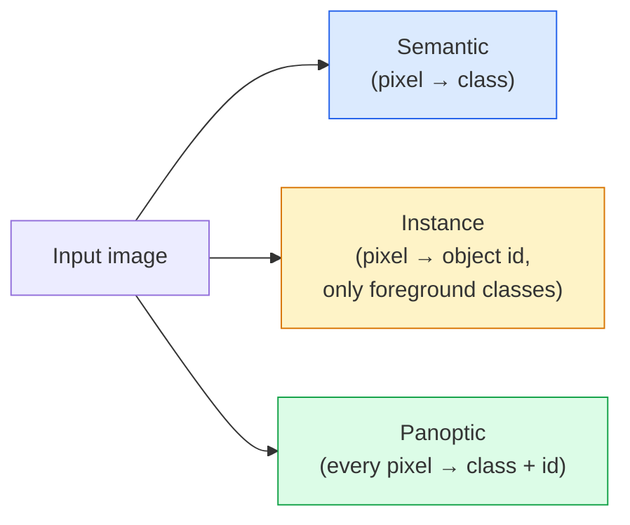
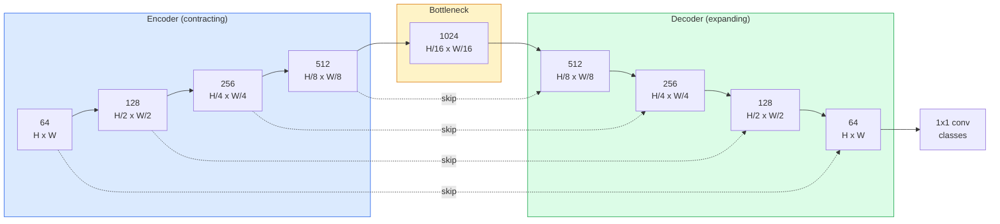

# 语义分割 — U-Net

> 分割是对每个像素进行分类。U-Net 通过将下采样编码器与上采样解码器配对，并在两者之间连接跳跃连接来实现这一目标。

**Type:** Build
**Languages:** Python
**Prerequisites:** 阶段 4 第 03 课（CNN），阶段 4 第 04 课（图像分类）
**Time:** 约 75 分钟

## 学习目标

- 区分语义分割、实例分割和全景分割，并针对给定问题选择合适的任务
- 在 PyTorch 中从零构建 U-Net，包含编码器块、瓶颈层、带转置卷积的解码器以及跳跃连接
- 实现逐像素交叉熵、Dice 损失，以及目前医疗与工业分割默认使用的组合损失
- 解读每类的 IoU 和 Dice 指标，并诊断糟糕的分数来自小目标召回率、边界精度还是类别不平衡

## 问题所在

分类对每张图像输出一个标签。检测对每张图像输出若干边界框。分割对每个像素输出一个标签。对于大小为 `H x W` 的输入，输出是形状为 `H x W`（语义）或 `H x W x N_instances`（实例）的张量。那是每张图像数百万个预测，而不是一个。

分割的结构性特点使其支撑了几乎所有的密集预测视觉产品：医学影像（肿瘤掩膜）、自动驾驶（道路、车道、障碍物）、卫星影像（建筑轮廓、作物边界）、文档解析（版面区域）、机器人（可抓取区域）。这些任务都无法通过在目标周围画框来解决；它们需要精确的轮廓。

架构上的问题说起来简单，解决起来却不简单：你需要网络同时看到图像的全局上下文（这是什么场景）和局部像素细节（确切地说哪个像素是马路、哪个是人行道）。标准 CNN 通过空间压缩获得上下文，但这会丢弃细节。U-Net 正是同时兼顾两者的设计。

## 概念

### 语义 vs 实例 vs 全景



- **语义**说“这个像素是马路，那个像素是汽车。”相邻的两辆车会合并成一个连通块。
- **实例**说“这个像素是 3 号车，那个像素是 5 号车。”忽略背景事物（"stuff" = 天空、马路、草地）。
- **全景**统一两者：每个像素获得一个类别标签，每个实例获得唯一 id，stuff 和 things 都被分割。

本课涵盖语义分割。下一课（Mask R-CNN）涵盖实例分割。

### U-Net 的形状



编码器将空间分辨率减半四次，同时将通道数翻倍。解码器反向操作：将空间分辨率翻倍四次，同时将通道数减半。跳跃连接在每个分辨率上将对应的编码器特征与解码器特征拼接。最后的 1x1 卷积在全分辨率上映射到 `64 -> num_classes`。

跳跃连接为什么是必要的：当解码器尝试输出像素级预测时，它只见过很小的特征图。没有跳跃连接，它无法准确定位边缘，因为那些信息在编码器中被压缩掉了。跳跃连接把编码器在下采样过程中计算出的高分辨率特征图递交给它。

### 转置卷积 vs 双线性上采样

解码器必须扩展空间维度。两种选择：

- **转置卷积**（`nn.ConvTranspose2d`）——可学习的上采样。历史上的 U-Net 默认选择。当步幅和核尺寸不能整除时，可能产生棋盘状伪影。
- **双线性上采样 + 3x3 卷积**——平滑上采样后接一个卷积。伪影更少、参数更少，是如今的现代默认选择。

两者在实践中都存在。对于第一个 U-Net，双线性更安全。

### 像素网格上的交叉熵

对于有 C 个类别的语义分割，模型输出是 `(N, C, H, W)`。目标是含整数类别 ID 的 `(N, H, W)`。交叉熵与分类情形完全相同，只是应用到每个空间位置：

```
Loss = mean over (n, h, w) of -log( softmax(logits[n, :, h, w])[target[n, h, w]] )
```

PyTorch 中的 `F.cross_entropy` 原生支持这种形状。无需 reshape。

### Dice 损失及其必要性

交叉熵平等对待每个像素。当某一类别主导画面时（医学影像：99% 背景，1% 肿瘤），这是错误的。网络可以通过处处预测背景获得 99% 的准确率，却毫无用处。

Dice 损失通过直接优化预测掩膜与真实掩膜之间的重叠来解决这个问题：

```
Dice(p, y) = 2 * sum(p * y) / (sum(p) + sum(y) + epsilon)
Dice_loss = 1 - Dice
```

其中 `p` 是某个类别的 sigmoid/softmax 概率图，`y` 是二值真值掩膜。只有当重叠完美时损失才为零。因为它是基于比率的，类别不平衡无关紧要。

实践中使用**组合损失**：

```
L = L_cross_entropy + lambda * L_dice       (lambda ~ 1)
```

交叉熵在训练早期提供稳定的梯度；Dice 让训练后期专注于真正匹配掩膜形状。这一组合是医学影像的默认选择，在任何类别不平衡的数据集上都难以超越。

### 评估指标

- **像素准确率** — 预测正确的像素百分比。便宜。在不平衡数据上失效，原因与分类中的准确率相同。
- **每类 IoU** — 每个类别掩膜的交并比；跨类平均 = mIoU。
- **Dice（像素上的 F1）** — 与 IoU 类似；`Dice = 2 * IoU / (1 + IoU)`。医学影像偏好 Dice，自动驾驶社区偏好 IoU；两者单调相关。
- **边界 F1** — 衡量预测边界与真值边界的接近程度，即使很小的偏移也会被惩罚。对半导体检测等高精度任务很重要。

报告每类 IoU，而不只是 mIoU。当九个类别在 85% 时，平均 IoU 会掩盖一个只有 15% 的类别。

### 输入分辨率的权衡

U-Net 的编码器将分辨率减半四次，因此输入必须能被 16 整除。医学图像常为 512x512 或 1024x1024。自动驾驶裁剪图为 2048x1024。U-Net 的内存开销随 `H * W * C_max` 增长，在 1024x1024 输入、1024 通道瓶颈下，前向传播已经消耗数 GB 显存。

两种标准变通方法：
1. 分块处理输入——以重叠方式处理 256x256 的图块再拼接。
2. 用膨胀卷积替换瓶颈层，保持较高空间分辨率同时扩大感受野（DeepLab 系列）。

对于第一个模型，256x256 输入加 64 通道基数的 U-Net 在 8 GB 显存上可以轻松训练。

```figure
segmentation-flood
```

## 动手构建

### 第 1 步：编码器块

两个带 batch norm 和 ReLU 的 3x3 卷积。第一个卷积改变通道数；第二个保持不变。

```python
import torch
import torch.nn as nn
import torch.nn.functional as F

class DoubleConv(nn.Module):
    def __init__(self, in_c, out_c):
        super().__init__()
        self.net = nn.Sequential(
            nn.Conv2d(in_c, out_c, kernel_size=3, padding=1, bias=False),
            nn.BatchNorm2d(out_c),
            nn.ReLU(inplace=True),
            nn.Conv2d(out_c, out_c, kernel_size=3, padding=1, bias=False),
            nn.BatchNorm2d(out_c),
            nn.ReLU(inplace=True),
        )

    def forward(self, x):
        return self.net(x)
```

这个块在整个网络中复用。使用 `bias=False`，因为 BN 的 beta 已经处理了偏置。

### 第 2 步：下采样与上采样块

```python
class Down(nn.Module):
    def __init__(self, in_c, out_c):
        super().__init__()
        self.net = nn.Sequential(
            nn.MaxPool2d(2),
            DoubleConv(in_c, out_c),
        )

    def forward(self, x):
        return self.net(x)


class Up(nn.Module):
    def __init__(self, in_c, out_c):
        super().__init__()
        self.up = nn.Upsample(scale_factor=2, mode="bilinear", align_corners=False)
        self.conv = DoubleConv(in_c, out_c)

    def forward(self, x, skip):
        x = self.up(x)
        if x.shape[-2:] != skip.shape[-2:]:
            x = F.interpolate(x, size=skip.shape[-2:], mode="bilinear", align_corners=False)
        x = torch.cat([skip, x], dim=1)
        return self.conv(x)
```

仅比较空间形状的检查（`shape[-2:]`）可以处理维度不能被 16 整除的输入；一个安全的 `F.interpolate` 在拼接前对齐张量。如果比较完整形状，通道数差异也会触发检查，而这应该是一个响亮的错误，而不是静默的插值。

### 第 3 步：U-Net

```python
class UNet(nn.Module):
    def __init__(self, in_channels=3, num_classes=2, base=64):
        super().__init__()
        self.inc = DoubleConv(in_channels, base)
        self.d1 = Down(base, base * 2)
        self.d2 = Down(base * 2, base * 4)
        self.d3 = Down(base * 4, base * 8)
        self.d4 = Down(base * 8, base * 16)
        self.u1 = Up(base * 16 + base * 8, base * 8)
        self.u2 = Up(base * 8 + base * 4, base * 4)
        self.u3 = Up(base * 4 + base * 2, base * 2)
        self.u4 = Up(base * 2 + base, base)
        self.outc = nn.Conv2d(base, num_classes, kernel_size=1)

    def forward(self, x):
        x1 = self.inc(x)
        x2 = self.d1(x1)
        x3 = self.d2(x2)
        x4 = self.d3(x3)
        x5 = self.d4(x4)
        x = self.u1(x5, x4)
        x = self.u2(x, x3)
        x = self.u3(x, x2)
        x = self.u4(x, x1)
        return self.outc(x)

net = UNet(in_channels=3, num_classes=2, base=32)
x = torch.randn(1, 3, 256, 256)
print(f"output: {net(x).shape}")
print(f"params: {sum(p.numel() for p in net.parameters()):,}")
```

输出形状 `(1, 2, 256, 256)` — 与输入相同的空间尺寸，`num_classes` 个通道。在 `base=32` 下约 770 万参数。

### 第 4 步：损失函数

```python
def dice_loss(logits, targets, num_classes, eps=1e-6):
    probs = F.softmax(logits, dim=1)
    targets_one_hot = F.one_hot(targets, num_classes).permute(0, 3, 1, 2).float()
    dims = (0, 2, 3)
    intersection = (probs * targets_one_hot).sum(dim=dims)
    denom = probs.sum(dim=dims) + targets_one_hot.sum(dim=dims)
    dice = (2 * intersection + eps) / (denom + eps)
    return 1 - dice.mean()


def combined_loss(logits, targets, num_classes, lam=1.0):
    ce = F.cross_entropy(logits, targets)
    dc = dice_loss(logits, targets, num_classes)
    return ce + lam * dc, {"ce": ce.item(), "dice": dc.item()}
```

Dice 按类别计算然后取平均（macro Dice）。`eps` 防止批次中不存在的类别导致除零。

### 第 5 步：IoU 指标

```python
@torch.no_grad()
def iou_per_class(logits, targets, num_classes):
    preds = logits.argmax(dim=1)
    ious = torch.zeros(num_classes)
    for c in range(num_classes):
        pred_c = (preds == c)
        true_c = (targets == c)
        inter = (pred_c & true_c).sum().float()
        union = (pred_c | true_c).sum().float()
        ious[c] = (inter / union) if union > 0 else torch.tensor(float("nan"))
    return ious
```

返回长度为 C 的向量。`nan` 标记批次中不存在的类别 — 计算 mIoU 时不要对这些类别取平均。

### 第 6 步：用于端到端验证的合成数据集

在彩色背景上生成形状，迫使网络学习形状而非像素颜色。

```python
import numpy as np
from torch.utils.data import Dataset, DataLoader

def synthetic_segmentation(num_samples=200, size=64, seed=0):
    rng = np.random.default_rng(seed)
    images = np.zeros((num_samples, size, size, 3), dtype=np.float32)
    masks = np.zeros((num_samples, size, size), dtype=np.int64)
    for i in range(num_samples):
        bg = rng.uniform(0, 1, (3,))
        images[i] = bg
        masks[i] = 0
        num_shapes = rng.integers(1, 4)
        for _ in range(num_shapes):
            cls = int(rng.integers(1, 3))
            color = rng.uniform(0, 1, (3,))
            cx, cy = rng.integers(10, size - 10, size=2)
            r = int(rng.integers(4, 12))
            yy, xx = np.meshgrid(np.arange(size), np.arange(size), indexing="ij")
            if cls == 1:
                mask = (xx - cx) ** 2 + (yy - cy) ** 2 < r ** 2
            else:
                mask = (np.abs(xx - cx) < r) & (np.abs(yy - cy) < r)
            images[i][mask] = color
            masks[i][mask] = cls
        images[i] += rng.normal(0, 0.02, images[i].shape)
        images[i] = np.clip(images[i], 0, 1)
    return images, masks


class SegDataset(Dataset):
    def __init__(self, images, masks):
        self.images = images
        self.masks = masks

    def __len__(self):
        return len(self.images)

    def __getitem__(self, i):
        img = torch.from_numpy(self.images[i]).permute(2, 0, 1).float()
        mask = torch.from_numpy(self.masks[i]).long()
        return img, mask
```

三个类别：背景（0）、圆形（1）、方形（2）。网络必须学会区分形状。

### 第 7 步：训练循环

```python
def train_one_epoch(model, loader, optimizer, device, num_classes):
    model.train()
    loss_sum, total = 0.0, 0
    iou_sum = torch.zeros(num_classes)
    for x, y in loader:
        x, y = x.to(device), y.to(device)
        logits = model(x)
        loss, _ = combined_loss(logits, y, num_classes)
        optimizer.zero_grad()
        loss.backward()
        optimizer.step()
        loss_sum += loss.item() * x.size(0)
        total += x.size(0)
        iou_sum += iou_per_class(logits, y, num_classes).nan_to_num(0)
    return loss_sum / total, iou_sum / len(loader)
```

在合成数据集上运行 10-30 个 epoch，观察形状类别的 mIoU 升至 0.9 以上。注意 `nan_to_num(0)` 会把批次中不存在的类别记为零；要获得准确的每类 IoU，应在评估时按类别是否出现进行掩膜，并跨批次使用 `torch.nanmean`，而不是在这里取平均。

## 使用它

在生产环境中，`segmentation_models_pytorch`（"smp"）将所有标准分割架构与任何 torchvision 或 timm 骨干网络组合起来。三行代码：

```python
import segmentation_models_pytorch as smp

model = smp.Unet(
    encoder_name="resnet34",
    encoder_weights="imagenet",
    in_channels=3,
    classes=3,
)
```

实际工作中还值得了解：
- **DeepLabV3+** 用膨胀卷积替换基于 max-pool 的下采样，使瓶颈层保留分辨率；在卫星和驾驶数据上边界更快更好。
- **SegFormer** 用层级化 Transformer 替换卷积编码器；在许多基准上是当前 SOTA。
- **Mask2Former** / **OneFormer** 在单一架构中统一语义、实例和全景分割。

在 `smp` 或 `transformers` 中，这三者都是即插即用的替代品，使用相同的数据加载器。

## 交付成果

本课产出：

- `outputs/prompt-segmentation-task-picker.md` — 一个提示，可在语义、实例和全景分割之间做出选择，并为给定任务指明架构。
- `outputs/skill-segmentation-mask-inspector.md` — 一个技能，报告类别分布、预测掩膜统计，以及哪些类别被欠预测或边界模糊。

## 练习

1. **（简单）** 为二分类分割任务（前景 vs 背景）实现 `bce_dice_loss`。在合成两类数据集上验证：当前景只占 5% 像素时，组合损失比单独的 BCE 收敛更快。
2. **（中等）** 将 `nn.Upsample + conv` 上采样块替换为 `nn.ConvTranspose2d` 上采样块。在合成数据集上训练两者并比较 mIoU。观察转置卷积版本中棋盘状伪影出现的位置。
3. **（困难）** 取一个真实分割数据集（Oxford-IIIT Pets、Cityscapes mini 划分或某个医学子集），训练 U-Net 使其 IoU 距离 `smp.Unet` 参考值在 2 个点以内。报告每类 IoU，并指出哪些类别从在损失中加入 Dice 中获益最多。

## 关键术语

| 术语 | 人们怎么说 | 实际含义 |
|------|----------------|----------------------|
| 语义分割 | "给每个像素打标签" | 逐像素分类到 C 个类别；同类别的实例合并 |
| 实例分割 | "给每个物体打标签" | 区分同类别中不同的实例；仅限前景 |
| 全景分割 | "语义 + 实例" | 每个像素获得类别；每个 thing 实例还获得唯一 id |
| 跳跃连接 | "U-Net 桥" | 将编码器特征拼接进对应分辨率的解码器特征；保留高频细节 |
| 转置卷积 | "反卷积" | 可学习的上采样；可能产生棋盘状伪影 |
| Dice 损失 | "重叠损失" | 1 - 2|A ∩ B| / (|A| + |B|)；直接优化掩膜重叠，对类别不平衡鲁棒 |
| mIoU | "平均交并比" | 跨类别平均 IoU；分割领域的社区标准指标 |
| 边界 F1 | "边界准确率" | 仅在边界像素上计算的 F1 分数；对精度关键的任务很重要 |

## 延伸阅读

- [U-Net: Convolutional Networks for Biomedical Image Segmentation (Ronneberger et al., 2015)](https://arxiv.org/abs/1505.04597) — 原始论文；人人都会复制的插图在第 2 页
- [Fully Convolutional Networks (Long et al., 2015)](https://arxiv.org/abs/1411.4038) — 首次将分割变成端到端卷积问题的论文
- [segmentation_models_pytorch](https://github.com/qubvel/segmentation_models.pytorch) — 生产级分割的参考实现；所有标准架构加所有标准损失
- [Lessons learned from training SOTA segmentation (kaggle.com competitions)](https://www.kaggle.com/code/iafoss/carvana-unet-pytorch) — 详解 TTA、伪标签和类别权重为何在真实数据上至关重要