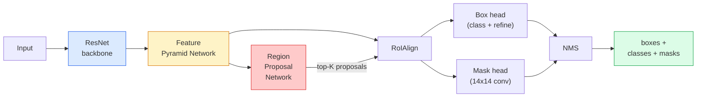

# 实例分割 — Mask R-CNN

> 在 Faster R-CNN 检测器上加一个很小的掩码分支，就得到了实例分割。难点在于 RoIAlign,它比看起来更难。

**Type:** Build + Learn
**Languages:** Python
**Prerequisites:** Phase 4 Lesson 06 (YOLO)、Phase 4 Lesson 07 (U-Net)
**Time:** 约 75 分钟

## 学习目标

- 端到端地梳理 Mask R-CNN 架构：backbone、FPN、RPN、RoIAlign、box head、mask head
- 从零实现 RoIAlign,并解释为什么 RoIPool 已不再使用
- 使用 torchvision 的 `maskrcnn_resnet50_fpn_v2` 预训练模型生成生产级实例掩码，并正确读取其输出格式
- 通过替换 box head 和 mask head、冻结 backbone,在小型自定义数据集上微调 Mask R-CNN

## 问题

语义分割为每个类别给出一个掩码。实例分割为每个物体给出一个掩码，即使两个物体属于同一类别。统计个体数量、跨帧跟踪、以及测量任务(墙中每块砖的边界框、显微镜图像中的每个细胞)都需要实例分割。

Mask R-CNN(He et al., 2017)通过将实例分割重新表述为“检测加掩码”解决了这个问题。其设计非常简洁，以至于在接下来的五年里，几乎所有实例分割论文都是 Mask R-CNN 的变体，而 torchvision 的实现至今仍是中小型数据集的生产默认选择。

困难的工程问题是采样：如何从一个角点不对齐像素边界的候选框中裁剪出固定大小的特征区域？这里出错会在处处损失零点几个 mAP 点。RoIAlign 就是答案。

## 概念

### 架构



需要理解五个部分：

1. **Backbone** — 在 ImageNet 上训练的 ResNet-50 或 ResNet-101。以 4、8、16、32 的步长产出层级化的特征图。
2. **FPN(Feature Pyramid Network)** — 自顶向下 + 横向连接，使每个层级都拥有 C 通道语义丰富的特征。检测会根据物体大小查询对应的 FPN 层级。
3. **RPN(Region Proposal Network)** — 一个小型卷积头，在每个 anchor 位置预测“这里有没有物体？”以及“如何微调这个框？”。每张图像产生约 1000 个候选框。
4. **RoIAlign** — 从任意 FPN 层级上的任意框中采样一个固定大小(如 7x7)的特征块。双线性采样，无量化。
5. **Heads** — 两层 box head 用于微调框并选择类别，外加一个小型卷积头，为每个候选框输出 `28x28` 的二值掩码。

### 为什么是 RoIAlign 而不是 RoIPool

最初的 Fast R-CNN 使用 RoIPool,它将候选框划分成网格，取每个单元格的最大特征值，并把所有坐标四舍五入为整数。这种取整会使特征图与输入像素坐标错位达整整一个特征图像素——在 224x224 图像上很小，而当特征图步长为 32 时则是灾难性的。

```
RoIPool:
  box (34.7, 51.3, 98.2, 142.9)
  round -> (34, 51, 98, 142)
  split grid -> round each cell boundary
  misalignment accumulates at every step

RoIAlign:
  box (34.7, 51.3, 98.2, 142.9)
  sample at exact float coordinates using bilinear interpolation
  no rounding anywhere
```

RoIAlign 在 COCO 上免费提升 3-4 个点的掩码 AP。如今所有在意定位精度的检测器都在用它——YOLOv7 seg、RT-DETR、Mask2Former 莫不如是。

### 一段话讲清 RPN

在特征图的每个位置，放置 K 个不同大小和形状的 anchor 框。为每个 anchor 预测一个 objectness 分数和一个回归偏移，将 anchor 变成更贴合的框。按分数保留前约 1,000 个框，以 IoU 0.7 应用 NMS,把幸存者交给 heads。RPN 用自己的小损失训练——结构与第 6 课的 YOLO 损失相同，只是只有两个类别(物体 / 无物体)。

### Mask head

对每个候选框(经 RoIAlign 之后)，mask head 是一个微型 FCN:四个 3x3 卷积、一个 2x 反卷积、以及一个最终的 1x1 卷积，在 `28x28` 分辨率下产生 `num_classes` 个输出通道。只保留对应预测类别的通道，其余忽略。这将掩码预测与分类解耦。

将 28x28 掩码上采样到候选框的原始像素大小，得到最终的二值掩码。

### 损失

Mask R-CNN 有四个损失相加：

```
L = L_rpn_cls + L_rpn_box + L_box_cls + L_box_reg + L_mask
```

- `L_rpn_cls`、`L_rpn_box` — RPN 候选框的 objectness + 框回归。
- `L_box_cls` — head 分类器在 (C+1) 个类别(含背景)上的交叉熵。
- `L_box_reg` — head 框微调的 smooth L1。
- `L_mask` — 28x28 掩码输出上的逐像素二值交叉熵。

每个损失都有各自的默认权重；torchvision 实现将其暴露为构造函数参数。

### 输出格式

`torchvision.models.detection.maskrcnn_resnet50_fpn_v2` 返回一个字典列表，每张图像一个：

```
{
    "boxes":  (N, 4) in (x1, y1, x2, y2) pixel coordinates,
    "labels": (N,) class IDs, 0 = background so indices are 1-based,
    "scores": (N,) confidence scores,
    "masks":  (N, 1, H, W) float masks in [0, 1] — threshold at 0.5 for binary,
}
```

掩码已经是全图像分辨率。28x28 的 head 输出已在内部上采样。

```figure
cv3-roialign-sampling
```

## 动手实现

### 第 1 步：从零实现 RoIAlign

这是 Mask R-CNN 中唯一一个读代码比读文字更容易理解的组件。

```python
import torch
import torch.nn.functional as F

def roi_align_single(feature, box, output_size=7, spatial_scale=1 / 16.0):
    """
    feature: (C, H, W) single-image feature map
    box: (x1, y1, x2, y2) in original image pixel coordinates
    output_size: side of the output grid (7 for box head, 14 for mask head)
    spatial_scale: reciprocal of the feature map stride
    """
    C, H, W = feature.shape
    x1, y1, x2, y2 = [c * spatial_scale - 0.5 for c in box]
    bin_w = (x2 - x1) / output_size
    bin_h = (y2 - y1) / output_size

    grid_y = torch.linspace(y1 + bin_h / 2, y2 - bin_h / 2, output_size)
    grid_x = torch.linspace(x1 + bin_w / 2, x2 - bin_w / 2, output_size)
    yy, xx = torch.meshgrid(grid_y, grid_x, indexing="ij")

    gx = 2 * (xx + 0.5) / W - 1
    gy = 2 * (yy + 0.5) / H - 1
    grid = torch.stack([gx, gy], dim=-1).unsqueeze(0)
    sampled = F.grid_sample(feature.unsqueeze(0), grid, mode="bilinear",
                            align_corners=False)
    return sampled.squeeze(0)
```

每个数值都在双线性采样的位置上。无取整、无量化、无梯度丢失。

### 第 2 步：与 torchvision 的 RoIAlign 对比

```python
from torchvision.ops import roi_align

feature = torch.randn(1, 16, 50, 50)
boxes = torch.tensor([[0, 10, 20, 100, 90]], dtype=torch.float32)  # (batch_idx, x1, y1, x2, y2)

ours = roi_align_single(feature[0], boxes[0, 1:].tolist(), output_size=7, spatial_scale=1/4)
theirs = roi_align(feature, boxes, output_size=(7, 7), spatial_scale=1/4, sampling_ratio=1, aligned=True)[0]

print(f"shape ours:   {tuple(ours.shape)}")
print(f"shape theirs: {tuple(theirs.shape)}")
print(f"max|diff|:    {(ours - theirs).abs().max().item():.3e}")
```

在 `sampling_ratio=1` 和 `aligned=True` 条件下，两者差异在 `1e-5` 之内。

### 第 3 步：加载预训练 Mask R-CNN

```python
import torch
from torchvision.models.detection import maskrcnn_resnet50_fpn_v2, MaskRCNN_ResNet50_FPN_V2_Weights

model = maskrcnn_resnet50_fpn_v2(weights=MaskRCNN_ResNet50_FPN_V2_Weights.DEFAULT)
model.eval()
print(f"params: {sum(p.numel() for p in model.parameters()):,}")
print(f"classes (including background): {len(model.roi_heads.box_predictor.cls_score.out_features * [0])}")
```

46M 参数，91 个类别(COCO)。第一个类别(id 0)是背景；模型实际检测到的类别从 id 1 开始。

### 第 4 步：运行推理

```python
with torch.no_grad():
    x = torch.randn(3, 400, 600)
    predictions = model([x])
p = predictions[0]
print(f"boxes:  {tuple(p['boxes'].shape)}")
print(f"labels: {tuple(p['labels'].shape)}")
print(f"scores: {tuple(p['scores'].shape)}")
print(f"masks:  {tuple(p['masks'].shape)}")
```

掩码张量形状为 `(N, 1, H, W)`。以 0.5 为阈值得到每个物体的二值掩码：

```python
binary_masks = (p['masks'] > 0.5).squeeze(1)  # (N, H, W) boolean
```

### 第 5 步：替换 heads 以适配自定义类别数

常见的微调方案：复用 backbone、FPN 和 RPN;替换两个分类头。

```python
from torchvision.models.detection.faster_rcnn import FastRCNNPredictor
from torchvision.models.detection.mask_rcnn import MaskRCNNPredictor

def build_custom_maskrcnn(num_classes):
    model = maskrcnn_resnet50_fpn_v2(weights=MaskRCNN_ResNet50_FPN_V2_Weights.DEFAULT)
    in_features = model.roi_heads.box_predictor.cls_score.in_features
    model.roi_heads.box_predictor = FastRCNNPredictor(in_features, num_classes)
    in_features_mask = model.roi_heads.mask_predictor.conv5_mask.in_channels
    hidden_layer = 256
    model.roi_heads.mask_predictor = MaskRCNNPredictor(in_features_mask, hidden_layer, num_classes)
    return model

custom = build_custom_maskrcnn(num_classes=5)
print(f"custom cls_score.out_features: {custom.roi_heads.box_predictor.cls_score.out_features}")
```

`num_classes` 必须包含背景类，因此有 4 个物体类别的数据集使用 `num_classes=5`。

### 第 6 步：冻结无需训练的部分

在小数据集上，冻结 backbone 和 FPN。只训练 RPN 的 objectness + 回归以及两个 heads。

```python
def freeze_backbone_and_fpn(model):
    # torchvision Mask R-CNN packs the FPN inside `model.backbone` (as
    # `model.backbone.fpn`), so iterating `model.backbone.parameters()` covers
    # both the ResNet feature layers and the FPN lateral/output convs.
    for p in model.backbone.parameters():
        p.requires_grad = False
    return model

custom = freeze_backbone_and_fpn(custom)
trainable = sum(p.numel() for p in custom.parameters() if p.requires_grad)
print(f"trainable after freeze: {trainable:,}")
```

在 500 张图像的数据集上，这是收敛与过拟合之间的区别。

## 使用它

torchvision 中 Mask R-CNN 的完整训练循环只有 40 行，且在不同任务之间没有实质变化——换数据集即可。

```python
def train_step(model, images, targets, optimizer):
    model.train()
    loss_dict = model(images, targets)
    losses = sum(loss for loss in loss_dict.values())
    optimizer.zero_grad()
    losses.backward()
    optimizer.step()
    return {k: v.item() for k, v in loss_dict.items()}
```

`targets` 列表必须包含每张图像的字典，其中有 `boxes`、`labels` 和 `masks`(作为 `(num_instances, H, W)` 二值张量)。模型在训练时返回一个包含四个损失的字典，在评估时返回预测列表，由 `model.training` 区分。

`pycocotools` 评估器同时为框和掩码计算 mAP@IoU=0.5:0.95;你需要两个数字才能判断瓶颈在 box head 还是 mask head。

## 交付

本课产出：

- `outputs/prompt-instance-vs-semantic-router.md` — 一个提示词，提出三个问题，并据此选择实例分割、语义分割还是全景分割，以及起步应使用的具体模型。
- `outputs/skill-mask-rcnn-head-swapper.md` — 一个技能，给定新的 `num_classes`,生成在任何 torchvision 检测模型上替换 heads 的 10 行代码。

## 练习

1. **(简单)** 在 100 个随机框上，将你的 RoIAlign 与 `torchvision.ops.roi_align` 对比验证。报告最大绝对差。同时运行 RoIPool(2017 年前的行为)，展示其在靠近边界的框上偏差约 1-2 个特征图像素。
2. **(中等)** 在 50 张图像的自定义数据集上微调 `maskrcnn_resnet50_fpn_v2`(任选两个类别：气球、鱼、坑洞、标志)。冻结 backbone,训练 20 个 epoch,报告 mask AP@0.5。
3. **(困难)** 将 Mask R-CNN 的 mask head 替换为在 56x56 而非 28x28 上预测的版本。测量前后的 mAP@IoU=0.75。解释为什么收益(或没有收益)符合预期的边界精度 / 内存权衡。

## 关键术语

| 术语 | 人们怎么说 | 实际含义 |
|------|----------------|----------------------|
| Mask R-CNN | “检测加掩码” | Faster R-CNN + 一个小型 FCN head,为每个候选框的每个类别预测 28x28 掩码 |
| FPN | “特征金字塔” | 自顶向下 + 横向连接，使每个步长层级都拥有 C 通道语义丰富的特征 |
| RPN | “区域提议器” | 一个小型卷积头，每张图像产生约 1000 个物体/非物体候选框 |
| RoIAlign | “无取整裁剪” | 从任意浮点坐标框中双线性采样固定大小的特征网格 |
| RoIPool | “2017 年前的裁剪” | 用途与 RoIAlign 相同，但会对框坐标取整；已过时 |
| Mask AP | “实例 mAP” | 用掩码 IoU 而非框 IoU 计算的平均精度；COCO 实例分割指标 |
| 二值掩码头 | “每类一个掩码” | 为每个候选框的每个类别预测一个二值掩码；只保留预测类别对应的通道 |
| 背景类别 | “类别 0” | 兜底的“无物体”类别；真实类别的索引从 1 开始 |

## 延伸阅读

- [Mask R-CNN (He et al., 2017)](https://arxiv.org/abs/1703.06870) — 原论文；第 3 节关于 RoIAlign 的内容是必读部分
- [FPN: Feature Pyramid Networks (Lin et al., 2017)](https://arxiv.org/abs/1612.03144) — FPN 论文；每个现代检测器都在使用它
- [torchvision Mask R-CNN 教程](https://pytorch.org/tutorials/intermediate/torchvision_tutorial.html) — 微调训练循环的权威参考
- [Detectron2 model zoo](https://github.com/facebookresearch/detectron2/blob/main/MODEL_ZOO.md) — 为几乎所有检测和分割变体提供带训练权重的生产级实现