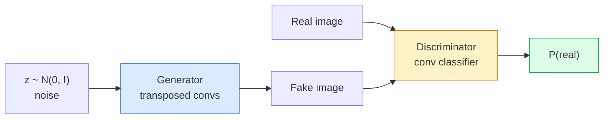
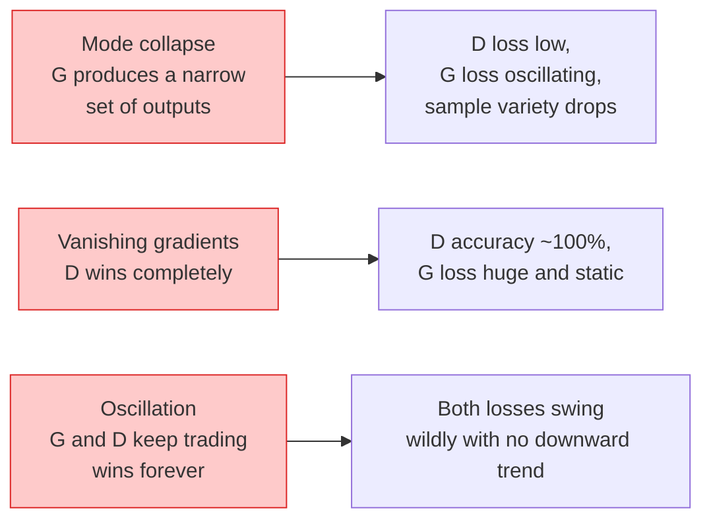

# 图像生成 — GAN

> GAN 是处于固定博弈中的两个神经网络。一个负责画图，一个负责评判。它们共同进步，直到画出的图能骗过评判者。

**Type:** Build
**Languages:** Python
**Prerequisites:** 第 4 阶段第 03 课（CNN）、第 3 阶段第 06 课（优化器）、第 3 阶段第 07 课（正则化）
**Time:** 约 75 分钟

## 学习目标

- 解释生成器与判别器之间的极小极大博弈，以及为什么均衡点对应于 p_model = p_data
- 在 PyTorch 中实现一个 DCGAN，并在不到 60 行代码内生成连贯的 32x32 合成图像
- 用三种标准技巧稳定 GAN 训练：非饱和损失、谱归一化、TTUR（双时间尺度更新规则）
- 读懂训练曲线，区分健康收敛与模式崩溃、震荡、判别器完全占优

## 问题

分类教网络把图像映射到标签。生成则反转了这个问题：采样出看起来像来自同一分布的新图像。没有可以对比的"正确"输出；只有一个你想要模仿的分布。

标准损失函数（MSE、交叉熵）无法度量"这个样本是否来自真实分布"。最小化逐像素误差会产生模糊的平均值，而非真实的样本。突破在于学习这个损失：训练第二个网络，其任务是分辨真假，并利用它的判断来推动生成器。

GAN（Goodfellow 等，2014）定义了这一框架。到 2018 年，StyleGAN 已能生成与照片难以区分的 1024x1024 人脸。此后扩散模型在质量和可控性上夺得了王座，但让扩散模型变得实用的每一个技巧——归一化选择、潜空间、特征损失——都最早是在 GAN 上被理解的。

## 概念

### 两个网络



**生成器** G 接收一个噪声向量 `z` 并输出一张图像。**判别器** D 接收一张图像并输出单个标量：图像为真的概率。

### 博弈

G 想让 D 出错。D 想让自己正确。形式化表示为：

```
min_G max_D  E_x[log D(x)] + E_z[log(1 - D(G(z)))]
```

从右往左读：D 在真实图像（`log D(real)`）和假图像（`log (1 - D(fake))`）上最大化准确率。G 在假图像上最小化 D 的准确率——它想让 `D(G(z))` 变高。

Goodfellow 证明了这个极小极大博弈存在一个全局均衡点，其中 `p_G = p_data`，D 处处输出 0.5，且生成分布与真实分布之间的 Jensen-Shannon 散度为零。难点在于如何到达那里。

### 非饱和损失

上式在数值上不稳定。训练早期，`D(G(z))` 对每个假样本都接近零，因此 `log(1 - D(G(z)))` 关于 G 的梯度会消失。解决办法：翻转 G 的损失。

```
L_D = -E_x[log D(x)] - E_z[log(1 - D(G(z)))]
L_G = -E_z[log D(G(z))]                          # non-saturating
```

现在当 `D(G(z))` 接近零时，G 的损失很大且其梯度富有信息量。每个现代 GAN 都用这个变体训练。

### DCGAN 架构规则

Radford、Metz、Chintala（2015）将多年失败的实验提炼为五条规则，使 GAN 训练变得稳定：

1. 用带步幅的卷积替换池化（两个网络皆是）。
2. 在生成器和判别器中都使用 batch norm，但 G 的输出层和 D 的输入层除外。
3. 在更深的架构中移除全连接层。
4. G 在除输出层外的所有层使用 ReLU（输出层用 tanh 映射到 [-1, 1]）。
5. D 在所有层使用 LeakyReLU（negative_slope=0.2）。

每个现代基于卷积的 GAN（StyleGAN、BigGAN、GigaGAN）仍然从这些规则出发，然后逐个替换组件。

### 失败模式及其特征



- **模式崩溃**：G 找到一张能骗过 D 的图像，然后只生成这一张。解决办法：加入 minibatch discrimination、谱归一化或标签条件化。
- **判别器获胜**：D 变得太强太快，G 的梯度消失。解决办法：缩小 D、降低 D 的学习率，或对真实标签应用标签平滑。
- **震荡**：两个网络交替获胜，永远无法接近均衡。解决办法：TTUR（D 的学习速度是 G 的 2-4 倍），或改用 Wasserstein 损失。

### 评估

GAN 没有真值，那么如何知道它们在正常工作？

- **样本检查** —— 每个 epoch 结束时直接看 64 个样本。不可省略。
- **FID（Fréchet Inception 距离）** —— 真实集与生成集的 Inception-v3 特征分布之间的距离。越低越好。社区标准。
- **Inception Score** —— 较旧、较脆弱；优先使用 FID。
- **生成模型的 Precision/Recall** —— 分别度量质量（precision）和覆盖度（recall）。比单独的 FID 更有信息量。

对于小规模合成数据实验，样本检查就足够了。

```figure
cv-gan-image
```

## 动手构建

### 第 1 步：生成器

一个小型 DCGAN 生成器，接收 64 维噪声并生成 32x32 图像。

```python
import torch
import torch.nn as nn

class Generator(nn.Module):
    def __init__(self, z_dim=64, img_channels=3, feat=64):
        super().__init__()
        self.net = nn.Sequential(
            nn.ConvTranspose2d(z_dim, feat * 4, kernel_size=4, stride=1, padding=0, bias=False),
            nn.BatchNorm2d(feat * 4),
            nn.ReLU(inplace=True),
            nn.ConvTranspose2d(feat * 4, feat * 2, kernel_size=4, stride=2, padding=1, bias=False),
            nn.BatchNorm2d(feat * 2),
            nn.ReLU(inplace=True),
            nn.ConvTranspose2d(feat * 2, feat, kernel_size=4, stride=2, padding=1, bias=False),
            nn.BatchNorm2d(feat),
            nn.ReLU(inplace=True),
            nn.ConvTranspose2d(feat, img_channels, kernel_size=4, stride=2, padding=1, bias=False),
            nn.Tanh(),
        )

    def forward(self, z):
        return self.net(z.view(z.size(0), -1, 1, 1))
```

四个转置卷积，每个都用 `kernel_size=4, stride=2, padding=1`，以便它们干净地将空间尺寸翻倍。输出激活经 tanh 映射到 [-1, 1]。

### 第 2 步：判别器

生成器的镜像。LeakyReLU、带步幅的卷积，以一个标量 logit 结尾。

```python
class Discriminator(nn.Module):
    def __init__(self, img_channels=3, feat=64):
        super().__init__()
        self.net = nn.Sequential(
            nn.Conv2d(img_channels, feat, kernel_size=4, stride=2, padding=1),
            nn.LeakyReLU(0.2, inplace=True),
            nn.Conv2d(feat, feat * 2, kernel_size=4, stride=2, padding=1, bias=False),
            nn.BatchNorm2d(feat * 2),
            nn.LeakyReLU(0.2, inplace=True),
            nn.Conv2d(feat * 2, feat * 4, kernel_size=4, stride=2, padding=1, bias=False),
            nn.BatchNorm2d(feat * 4),
            nn.LeakyReLU(0.2, inplace=True),
            nn.Conv2d(feat * 4, 1, kernel_size=4, stride=1, padding=0),
        )

    def forward(self, x):
        return self.net(x).view(-1)
```

最后一个卷积将 `4x4` 的特征图缩减到 `1x1`。输出是每张图像一个标量；仅在计算损失时才应用 sigmoid。

### 第 3 步：训练步骤

交替进行：每个 batch 先更新 D 一次，再更新 G 一次。

```python
import torch.nn.functional as F

def train_step(G, D, real, z, opt_g, opt_d, device):
    real = real.to(device)
    bs = real.size(0)

    # D step
    opt_d.zero_grad()
    d_real = D(real)
    d_fake = D(G(z).detach())
    loss_d = (F.binary_cross_entropy_with_logits(d_real, torch.ones_like(d_real))
              + F.binary_cross_entropy_with_logits(d_fake, torch.zeros_like(d_fake)))
    loss_d.backward()
    opt_d.step()

    # G step
    opt_g.zero_grad()
    d_fake = D(G(z))
    loss_g = F.binary_cross_entropy_with_logits(d_fake, torch.ones_like(d_fake))
    loss_g.backward()
    opt_g.step()

    return loss_d.item(), loss_g.item()
```

D 步骤中的 `G(z).detach()` 至关重要：我们不希望在更新 D 时梯度流入 G。忘记这一点是典型的初学者 bug。

### 第 4 步：在合成形状上的完整训练循环

```python
from torch.utils.data import DataLoader, TensorDataset
import numpy as np

def synthetic_images(num=2000, size=32, seed=0):
    rng = np.random.default_rng(seed)
    imgs = np.zeros((num, 3, size, size), dtype=np.float32) - 1.0
    for i in range(num):
        r = rng.uniform(6, 12)
        cx, cy = rng.uniform(r, size - r, size=2)
        yy, xx = np.meshgrid(np.arange(size), np.arange(size), indexing="ij")
        mask = (xx - cx) ** 2 + (yy - cy) ** 2 < r ** 2
        color = rng.uniform(-0.5, 1.0, size=3)
        for c in range(3):
            imgs[i, c][mask] = color[c]
    return torch.from_numpy(imgs)

device = "cuda" if torch.cuda.is_available() else "cpu"
data = synthetic_images()
loader = DataLoader(TensorDataset(data), batch_size=64, shuffle=True)

G = Generator(z_dim=64, img_channels=3, feat=32).to(device)
D = Discriminator(img_channels=3, feat=32).to(device)
opt_g = torch.optim.Adam(G.parameters(), lr=2e-4, betas=(0.5, 0.999))
opt_d = torch.optim.Adam(D.parameters(), lr=2e-4, betas=(0.5, 0.999))

for epoch in range(10):
    for (batch,) in loader:
        z = torch.randn(batch.size(0), 64, device=device)
        ld, lg = train_step(G, D, batch, z, opt_g, opt_d, device)
    print(f"epoch {epoch}  D {ld:.3f}  G {lg:.3f}")
```

`Adam(lr=2e-4, betas=(0.5, 0.999))` 是 DCGAN 的默认设置——较低的 beta1 可防止动量项过度稳定对抗博弈。

### 第 5 步：采样

```python
@torch.no_grad()
def sample(G, n=16, z_dim=64, device="cpu"):
    G.eval()
    z = torch.randn(n, z_dim, device=device)
    imgs = G(z)
    imgs = (imgs + 1) / 2
    return imgs.clamp(0, 1)
```

采样前务必切换到 eval 模式。对 DCGAN 而言这很重要，因为此时使用的是 batch norm 的滑动统计量而非当前 batch 的统计量。

### 第 6 步：谱归一化

判别器中 BN 的即插即用替代品，可保证网络是 1-Lipschitz 的。能修复大多数"D 赢得太容易"的失败。

```python
from torch.nn.utils import spectral_norm

def build_sn_discriminator(img_channels=3, feat=64):
    return nn.Sequential(
        spectral_norm(nn.Conv2d(img_channels, feat, 4, 2, 1)),
        nn.LeakyReLU(0.2, inplace=True),
        spectral_norm(nn.Conv2d(feat, feat * 2, 4, 2, 1)),
        nn.LeakyReLU(0.2, inplace=True),
        spectral_norm(nn.Conv2d(feat * 2, feat * 4, 4, 2, 1)),
        nn.LeakyReLU(0.2, inplace=True),
        spectral_norm(nn.Conv2d(feat * 4, 1, 4, 1, 0)),
    )
```

把 `Discriminator` 换成 `build_sn_discriminator()`，你往往就不再需要 TTUR 技巧了。谱归一化是你可以应用的最容易的单一鲁棒性升级。

## 使用它

对于严肃的生成任务，使用预训练权重或改用扩散模型。两个标准库：

- `torch_fidelity` 无需编写自定义评估代码即可在你的生成器上计算 FID / IS。
- `pytorch-gan-zoo`（遗留版）和 `StudioGAN` 提供经过测试的 DCGAN、WGAN-GP、SN-GAN、StyleGAN 和 BigGAN 实现。

到 2026 年，GAN 在以下场景仍是最佳选择：实时图像生成（延迟 <10 ms）、风格迁移、需要精确控制的图像到图像翻译（Pix2Pix、CycleGAN）。扩散模型在照片级真实感和文本条件化上更胜一筹。

## 发布它

本课产出：

- `outputs/prompt-gan-training-triage.md` —— 一个提示词，读取训练曲线描述并判断失败模式（模式崩溃、D 获胜、震荡）以及唯一的推荐修复方法。
- `outputs/skill-dcgan-scaffold.md` —— 一个技能，根据 `z_dim`、目标 `image_size` 和 `num_channels` 编写 DCGAN 脚手架，包含训练循环和样本保存器。

## 练习

1. **（简单）** 在合成圆形数据集上训练上述 DCGAN，并在每个 epoch 结束时保存 16 个样本的网格图。到第几个 epoch 时生成的圆形明显变圆？
2. **（中等）** 将判别器的 batch norm 替换为谱归一化。并行训练两个版本。哪个收敛更快？在三个随机种子下哪个方差更低？
3. **（困难）** 实现一个条件 DCGAN：将类别标签同时输入 G 和 D（在 G 中将 one-hot 拼接到噪声上，在 D 中拼接一个类别嵌入通道）。在第 7 课的合成"圆形 vs 方形"数据集上训练，并通过用特定标签采样来证明类别条件化有效。

## 关键术语

| 术语 | 人们怎么说 | 实际含义 |
|------|----------------|----------------------|
| 生成器（G） | "画图的网络" | 将噪声映射为图像；训练目标是骗过判别器 |
| 判别器（D） | "评判者" | 二分类器；训练目标是区分真实图像与生成图像 |
| Minimax | "那个博弈" | 对抗损失关于 G 取最小、关于 D 取最大；均衡点为 p_G = p_data |
| 非饱和损失 | "数值上更合理的版本" | G 的损失为 -log(D(G(z))) 而非 log(1 - D(G(z)))，以避免训练早期梯度消失 |
| 模式崩溃 | "生成器只会画一样东西" | G 只生成数据分布的一小部分；用谱归一化、minibatch discrimination 或更大 batch 修复 |
| TTUR | "两个学习率" | D 的学习速度快于 G，通常为 2-4 倍；可稳定训练 |
| 谱归一化 | "1-Lipschitz 层" | 一种权重归一化，约束每层的 Lipschitz 常数；防止 D 变得任意陡峭 |
| FID | "Fréchet Inception 距离" | 真实集与生成集的 Inception-v3 特征分布之间的距离；标准评估指标 |

## 延伸阅读

- [Generative Adversarial Networks (Goodfellow 等， 2014)](https://arxiv.org/abs/1406.2661) — 开创这一切的论文
- [DCGAN (Radford, Metz, Chintala, 2015)](https://arxiv.org/abs/1511.06434) — 让 GAN 可训练的架构规则
- [Spectral Normalization for GANs (Miyato 等， 2018)](https://arxiv.org/abs/1802.05957) — 最有用的单一稳定化技巧
- [StyleGAN3 (Karras 等， 2021)](https://arxiv.org/abs/2106.12423) — 最先进的 GAN；读起来像过去十年所有技巧的精选合集