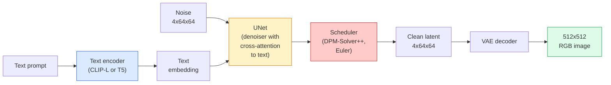

# Stable Diffusion — 架构与微调

> Stable Diffusion 是一种 DDPM，它在预训练 VAE 的潜在空间中运行，通过 cross-attention 以文本为条件，使用快速确定性 ODE 求解器进行采样，并由 classifier-free guidance 进行引导。

**Type:** Learn + Use
**Languages:** Python
**Prerequisites:** Phase 4 Lesson 10 (Diffusion)、Phase 7 Lesson 02 (Self-Attention)
**Time:** 约 75 分钟

## 学习目标

- 梳理 Stable Diffusion 流水线的五个组成部分：VAE、文本编码器、U-Net、调度器、安全检查器 —— 以及它们各自实际做什么
- 解释潜在扩散，以及为什么在 4x64x64 的潜在空间中训练（而非 3x512x512 的图像）能将计算量降低 48 倍且不损失质量
- 使用 `diffusers` 生成图像，运行 image-to-image、inpainting 和 ControlNet 引导的生成
- 在小型自定义数据集上用 LoRA 微调 Stable Diffusion，并在推理时加载 LoRA 适配器

## 问题所在

直接在 512x512 RGB 图像上训练 DDPM 代价高昂。每个训练步骤都要对一个处理 3x512x512 = 786,432 个输入值的 U-Net 进行反向传播，而采样需要对该 U-Net 进行 50 次以上的前向传播。以 Stable Diffusion 1.5（2022 年发布）的质量水平，像素空间扩散大约需要 256 个 GPU 月的训练时间，且在消费级 GPU 上每张图像需要 10-30 秒。

让开放权重文生图变得实用的技巧是**潜在扩散**（latent diffusion，Rombach et al., CVPR 2022）。训练一个将 3x512x512 图像映射到 4x64x64 潜在张量并还原的 VAE，然后在该潜在空间中做扩散。计算量下降 `(3*512*512)/(4*64*64) = 48x`。在同一块 GPU 上，采样时间从几十秒降到不到两秒。

几乎所有现代图像生成模型 —— SDXL、SD3、FLUX、HunyuanDiT、Wan-Video —— 都是潜在扩散模型，只在自编码器、去噪器（U-Net 或 DiT）和文本条件化方面有所变化。学会了 Stable Diffusion，你就掌握了模板。

## 核心概念

### 流水线



- **VAE** — 冻结的自编码器。编码器将图像转为潜变量（用于 img2img 和训练）。解码器将潜变量还原为图像。
- **文本编码器** — CLIP 文本编码器（SD 1.x/2.x）、CLIP-L + CLIP-G（SDXL）或 T5-XXL（SD3/FLUX）。生成一个 token 嵌入序列。
- **U-Net** — 去噪器。包含 cross-attention 层，在每个分辨率级别上从潜变量注意文本嵌入。
- **调度器** — 采样算法（DDIM、Euler、DPM-Solver++）。选择 sigma，将预测的噪声混合回潜变量。
- **安全检查器** — 对输出图像的可选 NSFW / 违规内容过滤器。

### Classifier-free guidance（CFG）

普通的文本条件化会为每个提示词 `c` 学习 `epsilon_theta(x_t, t, c)`。CFG 在训练时以 10% 的概率丢弃条件 `c`（替换为空嵌入），得到一个能同时预测有条件和无条件噪声的单一模型。推理时：

```
eps = eps_uncond + w * (eps_cond - eps_uncond)
```

`w` 是引导强度。`w=0` 为无条件，`w=1` 为普通有条件，`w>1` 则以牺牲多样性为代价，推动输出“更强地以提示词为条件”。SD 默认值为 `w=7.5`。

CFG 是文生图能达到生产级质量的原因。没有它，提示词只能微弱地偏置输出；有了它，提示词起主导作用。

### 潜在空间几何

VAE 的 4 通道潜变量不只是压缩的图像。它是一个流形，其上的算术运算大致对应语义编辑（提示词工程和插值都发生在这里），且扩散 U-Net 被训练为在此流形上投入其全部建模能力。解码一个随机的 4x64x64 潜变量不会产生看起来随机的图像 —— 而是产生垃圾，因为只有潜变量空间中的一个特定子流形才能解码为有效图像。

两个推论：

1. **Img2img** = 将图像编码为潜变量，加入部分噪声，运行去噪器，再解码。图像结构得以保留，因为编码接近可逆；内容则随提示词变化。
2. **Inpainting** = 与 img2img 相同，但去噪器只更新被遮罩的区域；未遮罩的区域保持编码后的潜变量不变。

### U-Net 架构

SD U-Net 是 Lesson 10 中 TinyUNet 的大规模版本，并增加了三样东西：

- 在每个空间分辨率上的 **Transformer 块**，包含 self-attention 和对文本嵌入的 cross-attention。
- 通过对正弦编码的 MLP 得到的**时间嵌入**。
- 编码器与解码器之间在对应分辨率上的**跳跃连接**。

SD 1.5 的总参数量约 860M。SDXL：约 2.6B。FLUX：约 12B。参数量的跃升主要来自 attention 层。

### LoRA 微调

完整微调 Stable Diffusion 需要 20+ GB 显存，并更新 860M 参数。LoRA（Low-Rank Adaptation）保持基础模型冻结，将小的秩分解矩阵注入 attention 层。SD 的 LoRA 适配器通常为 10-50 MB，在单张消费级 GPU 上 10-60 分钟即可训练完成，并在推理时作为即插即用的修改加载。

```
Original: W_q : (d_in, d_out)   frozen
LoRA:     W_q + alpha * (A @ B)   where A : (d_in, r), B : (r, d_out)

r is typically 4-32.
```

LoRA 是几乎所有社区微调模型的分发方式。CivitAI 和 Hugging Face 托管了数以百万计的 LoRA。

### 你会遇到的调度器

- **DDIM** — 确定性，约 50 步，简单。
- **Euler ancestral** — 随机性，30-50 步，采样结果略更有创意。
- **DPM-Solver++ 2M Karras** — 确定性，20-30 步，生产默认选择。
- **LCM / TCD / Turbo** — 一致性模型及蒸馏变体；1-4 步，以牺牲部分质量为代价。

更换调度器只需在 `diffusers` 中改一行代码，有时无需任何重训练即可修复采样问题。

```figure
cv3-latent-compression
```

## 动手构建

本课程端到端地使用 `diffusers`，而不是从零重建 Stable Diffusion。重建所需的各个组件（VAE、文本编码器、U-Net、调度器）本身就是独立课程的主题；这里的目标是熟练使用生产级 API。

### 第 1 步：文生图

```python
import torch
from diffusers import StableDiffusionPipeline

pipe = StableDiffusionPipeline.from_pretrained(
    "runwayml/stable-diffusion-v1-5",
    torch_dtype=torch.float16,
).to("cuda")

image = pipe(
    prompt="a dog riding a skateboard in tokyo, studio ghibli style",
    guidance_scale=7.5,
    num_inference_steps=25,
    generator=torch.Generator("cuda").manual_seed(42),
).images[0]
image.save("dog.png")
```

`float16` 可将显存占用减半且没有可见的质量损失。使用默认 DPM-Solver++ 的 `num_inference_steps=25` 与使用 DDIM 的 `num_inference_steps=50` 效果相当。

### 第 2 步：更换调度器

```python
from diffusers import DPMSolverMultistepScheduler, EulerAncestralDiscreteScheduler

pipe.scheduler = DPMSolverMultistepScheduler.from_config(pipe.scheduler.config)
pipe.scheduler = EulerAncestralDiscreteScheduler.from_config(pipe.scheduler.config)
```

调度器状态与 U-Net 权重解耦。你可以在 DDPM 上训练，并用任意调度器采样。

### 第 3 步：Image-to-image

```python
from diffusers import StableDiffusionImg2ImgPipeline
from PIL import Image

img2img = StableDiffusionImg2ImgPipeline.from_pretrained(
    "runwayml/stable-diffusion-v1-5",
    torch_dtype=torch.float16,
).to("cuda")

init_image = Image.open("dog.png").convert("RGB").resize((512, 512))
out = img2img(
    prompt="a dog riding a skateboard, oil painting",
    image=init_image,
    strength=0.6,
    guidance_scale=7.5,
).images[0]
```

`strength` 控制在去噪前加入多少噪声（0.0 = 不变，1.0 = 完全重新生成）。0.5-0.7 是风格迁移的标准范围。

### 第 4 步：Inpainting

```python
from diffusers import StableDiffusionInpaintPipeline

inpaint = StableDiffusionInpaintPipeline.from_pretrained(
    "runwayml/stable-diffusion-inpainting",
    torch_dtype=torch.float16,
).to("cuda")

image = Image.open("dog.png").convert("RGB").resize((512, 512))
mask = Image.open("dog_mask.png").convert("L").resize((512, 512))

out = inpaint(
    prompt="a cat",
    image=image,
    mask_image=mask,
    guidance_scale=7.5,
).images[0]
```

遮罩中的白色像素是要重新生成的区域。黑色像素被保留。

### 第 5 步：加载 LoRA

```python
pipe.load_lora_weights("sayakpaul/sd-lora-ghibli")
pipe.fuse_lora(lora_scale=0.8)

image = pipe(prompt="a village square in ghibli style").images[0]
```

`lora_scale` 控制强度；0.0 = 无效果，1.0 = 完全效果。`fuse_lora` 会将适配器就地烘焙进权重以提升速度，但会阻止后续切换。在加载不同适配器之前请调用 `pipe.unfuse_lora()`。

### 第 6 步：LoRA 训练（概要）

真实的 LoRA 训练在 `peft` 或 `diffusers.training` 中进行。大致流程：

```python
# Pseudocode
for step, batch in enumerate(dataloader):
    images, prompts = batch
    latents = vae.encode(images).latent_dist.sample() * 0.18215

    t = torch.randint(0, num_train_timesteps, (batch_size,))
    noise = torch.randn_like(latents)
    noisy_latents = scheduler.add_noise(latents, noise, t)

    text_emb = text_encoder(tokenizer(prompts))

    pred_noise = unet(noisy_latents, t, text_emb)  # LoRA weights injected here

    loss = F.mse_loss(pred_noise, noise)
    loss.backward()
    optimizer.step()
```

只有 LoRA 矩阵接收梯度；基础 U-Net、VAE 和文本编码器保持冻结。在 batch size 为 1 并开启梯度检查点的情况下，8 GB 显存即可容纳。

## 生产使用

在生产环境中，你实际要做的决策：

- **模型家族**：SD 1.5 适合开源社区微调模型，SDXL 用于更高保真度，SD3 / FLUX 用于最先进效果和严格的许可要求。
- **调度器**：DPM-Solver++ 2M Karras 用于 20-30 步，延迟需低于 1s 时使用 LCM-LoRA。
- **精度**：4080/4090 上用 `float16`，A100 及更新硬件上用 `bfloat16`，显存紧张时用 `int8`（通过 `bitsandbytes` 或 `compel`）。
- **条件化**：纯文本即可；需要更强控制时，在基础流水线之上添加 ControlNet（canny、depth、pose）。

批量生成可使用 `AUTO1111` / `ComfyUI` 等社区工具；生产级 API 可使用 `diffusers` + `accelerate`，或结合 TensorRT 编译的 `optimum-nvidia`。

## 交付成果

本课程产出：

- `outputs/prompt-sd-pipeline-planner.md` — 一段提示词：在给定延迟预算、保真度目标和许可约束的情况下，选择 SD 1.5 / SDXL / SD3 / FLUX 以及调度器和精度。
- `outputs/skill-lora-training-setup.md` — 一个技能：为自定义数据集编写完整的 LoRA 训练配置，包括标注文本、秩、batch size 和学习率。

## 练习

1. **(简单)** 在 `[1, 3, 5, 7.5, 10, 15]` 中用 `guidance_scale` 生成同一提示词。描述图像如何变化。引导强度达到多少时会出现伪影？
2. **(中等)** 取任意真实照片，在 `[0.2, 0.4, 0.6, 0.8, 1.0]` 中以 `strength` 的强度将其送入 `StableDiffusionImg2ImgPipeline`。哪个强度能在改变风格的同时保持构图？为什么 1.0 会完全忽略输入？
3. **(困难)** 用 10-20 张同一主体（宠物、logo、角色）的图像训练一个 LoRA，并生成包含该主体的新场景。报告在不向输入图像过拟合的前提下，能最好保留主体身份特征的 LoRA 秩和训练步数。

## 关键术语

| 术语 | 人们怎么说 | 实际含义 |
|------|----------------|----------------------|
| 潜在扩散 | “在潜变量中扩散” | 在 VAE 潜在空间（4x64x64）而非像素空间（3x512x512）中运行整个 DDPM；节省 48 倍计算量 |
| VAE 缩放因子 | “0.18215” | 将 VAE 的原始潜变量重新缩放到近似单位方差的常数；硬编码在每个 SD 流水线中 |
| Classifier-free guidance | “CFG” | 混合有条件和无条件的噪声预测；影响最大的单一推理旋钮 |
| 调度器 | “采样器” | 将噪声 + 模型预测转化为去噪潜变量轨迹的算法 |
| LoRA | “低秩适配器” | 在不触碰基础权重的情况下微调 attention 层的小型秩分解矩阵 |
| Cross-attention | “文本-图像注意力” | 从潜变量 token 到文本 token 的注意力；在每个 U-Net 级别注入提示词信息 |
| ControlNet | “结构条件化” | 一个单独训练的适配器，通过额外输入（canny、depth、pose、分割）引导 SD |
| DPM-Solver++ | “默认调度器” | 二阶确定性 ODE 求解器；2026 年在低步数（20-30 步）下质量最佳 |

## 延伸阅读

- [High-Resolution Image Synthesis with Latent Diffusion (Rombach et al., 2022)](https://arxiv.org/abs/2112.10752) — Stable Diffusion 论文；包含论证其设计合理性的所有消融实验
- [Classifier-Free Diffusion Guidance (Ho & Salimans, 2022)](https://arxiv.org/abs/2207.12598) — CFG 论文
- [LoRA: Low-Rank Adaptation of Large Language Models (Hu et al., 2021)](https://arxiv.org/abs/2106.09685) — LoRA 最初面向 NLP；它几乎不加修改地迁移到了 SD
- [diffusers 文档](https://huggingface.co/docs/diffusers) — 所有 SD / SDXL / SD3 / FLUX 流水线的参考文档