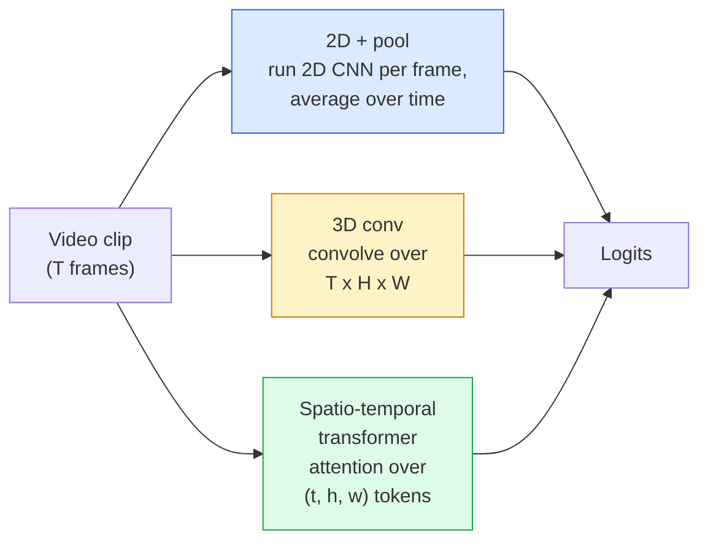

# 视频理解 — 时序建模

> 视频是图像序列加上连接它们的物理规律。每一种视频模型要么把时间当作一个额外的轴（3D 卷积）、当作一个可注意的序列（transformer）、要么当作一个只需提取一次再池化的特征（2D+pool）。

**Type:** Learn + Build
**Languages:** Python
**Prerequisites:** Phase 4 Lesson 03 (CNNs), Phase 4 Lesson 04 (Image Classification)
**Time:** ~45 分钟

## 学习目标

- 区分三种主要的视频建模方法（2D+pool、3D 卷积、时空 transformer），并预测它们在成本与精度上的权衡
- 在 PyTorch 中实现帧采样、时序池化，以及一个 2D+pool 基线分类器
- 解释为什么 I3D 的“膨胀”3D 卷积核能很好地从 ImageNet 权重迁移，以及因式分解的 (2+1)D 卷积有何不同
- 了解标准动作识别数据集与指标：Kinetics-400/600、UCF101、Something-Something V2；clip 级与视频级 top-1 准确率

## 问题所在

一段 30 秒、30 fps 的视频包含 900 张图像。朴素的视频分类就是把图像分类跑 900 次，再做某种聚合。当动作几乎在每一帧都可见时（体育、烹饪、健身视频）这可行，但当动作本身由运动定义时就会严重失效：“把某物从左推到右”在每一帧里看起来都只是两个静止的物体。

每一种视频架构的核心问题都是：时序结构在何时被建模，以及如何建模？答案决定了其余一切——计算成本、预训练策略、能否复用 ImageNet 权重、模型在哪些数据集上训练。

本节课刻意比静态图像课程短。核心图像机制已经就绪，视频理解主要是时序层面的事情：采样、建模和聚合。

## 概念

### 三种架构家族



### 2D + pool

取一个 2D CNN（ResNet、EfficientNet、ViT）。在每个采样帧上独立运行它。对各帧的嵌入做平均（或最大池化、注意力池化）。把池化后的向量送入分类器。

优点：
- ImageNet 预训练可直接迁移。
- 实现最简单。
- 便宜：T 帧 * 单张图像推理成本。

缺点：
- 无法建模运动。动作 = 外观的聚合。
- 时序池化与顺序无关；“开门”和“关门”看起来一样。

适用场景：外观主导的任务、小规模视频数据集上的迁移学习、初始基线。

### 3D 卷积

把 2D (H, W) 卷积核替换为 3D (T, H, W) 卷积核。网络同时在空间和时间上做卷积。早期家族：C3D、I3D、SlowFast。

I3D 技巧：取一个预训练的 2D ImageNet 模型，把每个 2D 卷积核沿新的时间轴复制来“膨胀”。一个 3x3 的 2D 卷积变成 3x3x3 的 3D 卷积。这让 3D 模型获得了强大的预训练权重，而不是从零训练。

优点：
- 直接建模运动。
- I3D 膨胀带来免费的迁移学习。

缺点：
- 比对应的 2D 模型多 T/8 的 FLOPs（时间核为 3 且堆叠 3 次时）。
- 时间核较小；长程运动需要金字塔或双流方法。

适用场景：以运动为信号的动作识别（Something-Something V2、含大量运动类别的 Kinetics）。

### 时空 transformer

把视频标记化为时空 patch 网格，并在所有 patch 之间做注意力。TimeSformer、ViViT、Video Swin、VideoMAE。

重要的注意力模式：
- **联合（Joint）** —— 对 (t, h, w) 做一次大注意力。关于 `T*H*W` 是二次方的；昂贵。
- **分离（Divided）** —— 每个块做两次注意力：一次在时间上，一次在空间上。接近线性的扩展。
- **因式分解（Factorised）** —— 时间注意力与空间注意力在各个块之间交替。

优点：
- 在所有主要基准上达到 SOTA 精度。
- 可通过 patch 膨胀从图像 transformer（ViT）迁移。
- 通过稀疏注意力支持长上下文视频。

缺点：
- 计算开销大。
- 需要谨慎选择注意力模式，否则运行时间会暴涨。

适用场景：大规模数据集、高保真视频理解、多模态视频+文本任务。

### 帧采样

一段 10 秒、30 fps 的视频有 300 帧；把全部 300 帧喂给任何模型都是浪费。标准策略：

- **均匀采样** —— 在整个片段中均匀选取 T 帧。2D+pool 的默认做法。
- **密集采样** —— 随机选取连续的 T 帧窗口。3D 卷积常用，因为运动需要相邻帧。
- **多片段（multi-clip）** —— 从同一视频采样多个 T 帧窗口，分别分类，在测试时平均预测。

T 通常是 8、16、32 或 64。T 越大 = 时序信号越多，计算也越多。

### 评估

两个层级：
- **Clip 级准确率** —— 模型只看一个 T 帧片段，报告 top-k。
- **视频级准确率** —— 对每个视频的多个片段的 clip 级预测取平均；更高且更稳定。

务必同时报告两者。一个 78% clip / 82% 视频的模型严重依赖测试时平均；一个 80% / 81% 的模型在每个 clip 上更稳健。

### 你会遇到的数据集

- **Kinetics-400 / 600 / 700** —— 通用动作数据集。40 万个片段；YouTube 链接（许多已失效）。
- **Something-Something V2** —— 由运动定义的动作（“把 X 从左移到右”）。2D+pool 无法解决。
- **UCF-101**、**HMDB-51** —— 较旧、较小，但仍被报告。
- **AVA** —— 空间和时间上的动作*定位*；比分类更难。

```figure
v4-video-temporal
```

## 动手构建

### 第 1 步：帧采样器

在帧列表（或视频张量）上工作的均匀采样器和密集采样器。

```python
import numpy as np

def sample_uniform(num_frames_total, T):
    if num_frames_total <= T:
        return list(range(num_frames_total)) + [num_frames_total - 1] * (T - num_frames_total)
    step = num_frames_total / T
    return [int(i * step) for i in range(T)]


def sample_dense(num_frames_total, T, rng=None):
    rng = rng or np.random.default_rng()
    if num_frames_total <= T:
        return list(range(num_frames_total)) + [num_frames_total - 1] * (T - num_frames_total)
    start = int(rng.integers(0, num_frames_total - T + 1))
    return list(range(start, start + T))
```

两者都返回 `T` 索引，用于对视频张量做切片。

### 第 2 步：2D+pool 基线

在每个帧上运行 2D ResNet-18，对特征做平均池化，再分类。

```python
import torch
import torch.nn as nn
from torchvision.models import resnet18, ResNet18_Weights

class FramePool(nn.Module):
    def __init__(self, num_classes=400, pretrained=True):
        super().__init__()
        weights = ResNet18_Weights.IMAGENET1K_V1 if pretrained else None
        backbone = resnet18(weights=weights)
        self.features = nn.Sequential(*(list(backbone.children())[:-1]))  # global avg pool kept
        self.head = nn.Linear(512, num_classes)

    def forward(self, x):
        # x: (N, T, 3, H, W)
        N, T = x.shape[:2]
        x = x.view(N * T, *x.shape[2:])
        feats = self.features(x).view(N, T, -1)
        pooled = feats.mean(dim=1)
        return self.head(pooled)

model = FramePool(num_classes=10)
x = torch.randn(2, 8, 3, 224, 224)
print(f"output: {model(x).shape}")
print(f"params: {sum(p.numel() for p in model.parameters()):,}")
```

一千一百万参数，ImageNet 预训练，逐帧运行、平均、分类。这个基线在外观主导的任务上常常与正规 3D 模型相差 5-10 个百分点以内——有时甚至更好，因为它复用了更强的 ImageNet 骨干。

### 第 3 步：I3D 风格的膨胀 3D 卷积

通过沿新的时间轴重复权重，把一个 2D 卷积变成 3D 卷积。

```python
def inflate_2d_to_3d(conv2d, time_kernel=3):
    out_c, in_c, kh, kw = conv2d.weight.shape
    weight_3d = conv2d.weight.data.unsqueeze(2)  # (out, in, 1, kh, kw)
    weight_3d = weight_3d.repeat(1, 1, time_kernel, 1, 1) / time_kernel
    conv3d = nn.Conv3d(in_c, out_c, kernel_size=(time_kernel, kh, kw),
                        padding=(time_kernel // 2, conv2d.padding[0], conv2d.padding[1]),
                        stride=(1, conv2d.stride[0], conv2d.stride[1]),
                        bias=False)
    conv3d.weight.data = weight_3d
    return conv3d

conv2d = nn.Conv2d(3, 64, kernel_size=3, padding=1, bias=False)
conv3d = inflate_2d_to_3d(conv2d, time_kernel=3)
print(f"2D weight shape:  {tuple(conv2d.weight.shape)}")
print(f"3D weight shape:  {tuple(conv3d.weight.shape)}")
x = torch.randn(1, 3, 8, 56, 56)
print(f"3D output shape:  {tuple(conv3d(x).shape)}")
```

除以 `time_kernel` 可以让激活幅值大致保持恒定——这很重要，可避免在第一遍就破坏 batch-norm 的统计量。

### 第 4 步：因式分解的 (2+1)D 卷积

把一个 3D 卷积拆成一个 2D（空间）卷积和一个 1D（时间）卷积。相同的感受野，更少的参数，在某些基准上精度更高。

```python
class Conv2Plus1D(nn.Module):
    def __init__(self, in_c, out_c, kernel_size=3):
        super().__init__()
        mid_c = (in_c * out_c * kernel_size * kernel_size * kernel_size) \
                // (in_c * kernel_size * kernel_size + out_c * kernel_size)
        self.spatial = nn.Conv3d(in_c, mid_c, kernel_size=(1, kernel_size, kernel_size),
                                 padding=(0, kernel_size // 2, kernel_size // 2), bias=False)
        self.bn = nn.BatchNorm3d(mid_c)
        self.act = nn.ReLU(inplace=True)
        self.temporal = nn.Conv3d(mid_c, out_c, kernel_size=(kernel_size, 1, 1),
                                  padding=(kernel_size // 2, 0, 0), bias=False)

    def forward(self, x):
        return self.temporal(self.act(self.bn(self.spatial(x))))

c = Conv2Plus1D(3, 64)
x = torch.randn(1, 3, 8, 56, 56)
print(f"(2+1)D output: {tuple(c(x).shape)}")
```

一个完整的 R(2+1)D 网络就是把 ResNet-18 中每个 3x3 卷积替换为 `Conv2Plus1D`。

## 使用它

两个库覆盖生产级视频工作：

- `torchvision.models.video` —— 带预训练 Kinetics 权重的 R(2+1)D、MViT、Swin3D。与图像模型相同的 API。
- `pytorchvideo`（Meta）—— 模型库、Kinetics / SSv2 / AVA 的数据加载器、标准变换。

对于视觉-语言视频模型（视频描述生成、视频问答），使用 `transformers`（`VideoMAE`、`VideoLLaMA`、`InternVideo`）。

## 交付它

本节课产出：

- `outputs/prompt-video-architecture-picker.md` —— 一个提示词，根据外观与运动的权衡、数据集规模和计算预算，在 2D+pool / I3D / (2+1)D / transformer 之间做出选择。
- `outputs/skill-frame-sampler-auditor.md` —— 一个技能，用于检查视频流水线的采样器并标记常见错误：索引差一错误、`num_frames < T` 时的不均匀采样、缺乏保持宽高比的裁剪等。

## 练习

1. **（简单）** 计算 T=8 时 FramePool 与 T=8 的 I3D 风格 3D ResNet 的 FLOPs（近似值）。论证为什么 2D+pool 便宜 3-5 倍。
2. **（中等）** 生成一个合成视频数据集：随机方向运动的随机小球，按运动方向标注（“左到右”、“右到左”、“斜向上”）。在其上训练 FramePool。证明它只能达到接近随机的准确率，从而证明仅凭外观不足以完成运动任务。
3. **（困难）** 通过把 ResNet-18 中每个 Conv2d 替换为 `Conv2Plus1D` 来构建 R(2+1)D-18。从 ImageNet 预训练的 ResNet-18 膨胀第一个卷积的权重。在练习 2 的运动数据集上训练并击败 FramePool。

## 关键术语

| 术语 | 人们怎么说 | 实际含义 |
|------|----------------|----------------------|
| 2D + pool | “逐帧分类器” | 在每个采样帧上运行 2D CNN，沿时间对特征做平均池化，再分类 |
| 3D 卷积 | “时空卷积核” | 在 (T, H, W) 上卷积的核；可原生建模运动 |
| 膨胀（Inflation） | “把 2D 权重提升到 3D” | 通过沿新时间轴重复 2D 卷积的权重来初始化 3D 卷积权重，再除以 kernel_T 以保持激活规模 |
| (2+1)D | “因式分解卷积” | 把 3D 拆成 2D 空间 + 1D 时间；参数更少，中间多一层非线性 |
| 分离注意力 | “先时间后空间” | 每层做两次注意力的 Transformer 块：一次对同一帧内的 token，一次对同一位置的 token |
| Clip | “T 帧窗口” | 采样得到的 T 帧子序列；视频模型消费的基本单元 |
| Clip 级 vs 视频级准确率 | “两种评估设置” | Clip = 每个视频一个样本，视频 = 对多个采样片段取平均 |
| Kinetics | “视频领域的 ImageNet” | 400-700 个动作类别、30 万+ YouTube 片段、标准的视频预训练语料库 |

## 延伸阅读

- [I3D: Quo Vadis, Action Recognition (Carreira & Zisserman, 2017)](https://arxiv.org/abs/1705.07750) —— 提出膨胀法和 Kinetics 数据集
- [R(2+1)D: A Closer Look at Spatiotemporal Convolutions (Tran et al., 2018)](https://arxiv.org/abs/1711.11248) —— 因式分解卷积，至今仍是强基线
- [TimeSformer: Is Space-Time Attention All You Need? (Bertasius et al., 2021)](https://arxiv.org/abs/2102.05095) —— 第一个强大的视频 transformer
- [VideoMAE (Tong et al., 2022)](https://arxiv.org/abs/2203.12602) —— 视频的掩码自编码器预训练；当前主流预训练方案