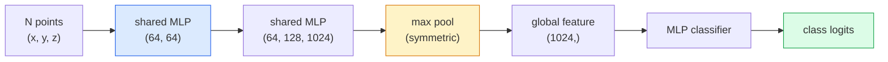

# 3D 视觉 — 点云与 NeRF

> 3D 视觉有两种形态。点云是传感器的原始输出。NeRF 是学习到的体积场。两者都回答“空间中什么在哪里”。

**Type:** Learn + Build
**Languages:** Python
**Prerequisites:** Phase 4 Lesson 03（CNN）、Phase 1 Lesson 12（张量运算）
**Time:** 约 45 分钟

## 学习目标

- 区分显式（点云、网格、体素）与隐式（符号距离场、NeRF）3D 表示，以及各自的使用场景
- 理解 PointNet 的对称函数技巧，它使神经网络对无序点集具有置换不变性
- 追踪 NeRF 前向传播：光线投射、体渲染、位置编码、输出密度+颜色的 MLP 头
- 使用 `nerfstudio` 或 `instant-ngp` 从少量带位姿的图像进行预训练的 3D 重建

## 问题

相机产生 2D 图像。LIDAR 产生一组无序的 3D 点。运动恢复结构（SfM）流水线产生稀疏的 3D 关键点云。NeRF 从少量带位姿的图像重建整个 3D 场景。这些都是“视觉”，但没有一个看起来像 CNN 所需要的稠密张量。

3D 视觉之所以重要，是因为几乎所有高价值的机器人任务都在 3D 中进行：抓取、避障、导航、AR 遮挡、3D 内容采集。只懂 2D 图像的视觉工程师会被挡在该领域增长最快的部分之外（AR/VR 内容、机器人、自动驾驶技术栈、面向房地产或建筑行业的基于 NeRF 的 3D 重建）。

这两种表示各自主导有不同原因。点云是传感器免费给你的东西。NeRF 及其后继者（3D Gaussian splatting、神经 SDF）是你让神经网络学习一个场景时得到的东西。

## 概念

### 点云

点云是 R^3 中 N 个点的无序集合，每个点可选地带特征（颜色、强度、法向量）。

```
cloud = [
  (x1, y1, z1, r1, g1, b1),
  (x2, y2, z2, r2, g2, b2),
  ...
  (xN, yN, zN, rN, gN, bN),
]
```

没有网格，没有连接关系。两个性质使这对神经网络来说很困难：

- **置换不变性** — 输出不能依赖于点的顺序。
- **可变的 N** — 同一个模型必须能处理不同大小的点云。

PointNet（Qi 等，2017）用一个想法解决了这两个问题：对每个点应用共享 MLP，然后用对称函数（最大池化）聚合。结果是一个与顺序无关的固定大小向量。

```
f(P) = max_{p in P} MLP(p)
```

这就是 PointNet 的全部核心。更深的变体（PointNet++、Point Transformer）增加了层次化采样和局部聚合，但对称函数技巧没有变。

### PointNet 架构



"共享 MLP" 意味着同一个 MLP 独立地运行在每个点上。为提高效率，实现为沿点维度的 1x1 卷积。

### 神经辐射场（NeRF）

NeRF（Mildenhall 等，2020）面对“能否从 N 张照片重建 3D 场景？”这一问题，给出了一个本身就是场景的神经网络作为答案。该网络将 `(x, y, z, viewing_direction)` 映射到 `(density, colour)`。渲染新视图就是对这个网络做光线投射循环。

```
NeRF MLP:  (x, y, z, theta, phi) -> (sigma, r, g, b)

To render a pixel (u, v) of a new view:
  1. Cast a ray from the camera through pixel (u, v)
  2. Sample points along the ray at distances t_1, t_2, ..., t_N
  3. Query the MLP at each point
  4. Composite the colours weighted by (1 - exp(-sigma * dt))
  5. The sum is the rendered pixel colour
```

损失函数将渲染像素与训练照片中的真实像素进行比较。通过渲染步骤反向传播来更新 MLP。没有 3D 真值，没有显式几何 — 场景存储在 MLP 的权重中。

### NeRF 中的位置编码

作用于 `(x, y, z)` 的普通 MLP 无法表示高频细节，因为 MLP 在频谱上偏向低频。NeRF 通过在 MLP 之前将每个坐标编码为傅里叶特征向量来解决这个问题：

```
gamma(p) = (sin(2^0 pi p), cos(2^0 pi p), sin(2^1 pi p), cos(2^1 pi p), ...)
```

频率层级最多到 L=10。这与 Transformer 用于位置编码的技巧相同，并且在扩散模型的时间调节中也再次出现（Lesson 10）。没有它，NeRF 的渲染结果会显得模糊。

### 体渲染

```
C(r) = sum_i T_i * (1 - exp(-sigma_i * delta_i)) * c_i

T_i  = exp(- sum_{j<i} sigma_j * delta_j)
delta_i = t_{i+1} - t_i
```

`T_i` 是透射率 — 有多少光存活到点 i。`(1 - exp(-sigma_i * delta_i))` 是点 i 处的不透明度。`c_i` 是颜色。最终像素是沿光线的加权和。

### 取代 NeRF 的技术

纯 NeRF 训练慢（数小时），渲染也慢（每张图数秒）。此后的演进路线：

- **Instant-NGP**（2022）— 用哈希网格编码取代 MLP 的位置输入；秒级训练。
- **Mip-NeRF 360** — 处理无界场景和抗锯齿。
- **3D Gaussian Splatting**（2023）— 用数百万个 3D 高斯基元取代体积场；分钟级训练，实时渲染。这是当前的生产默认选择。

2026 年几乎所有真实的 NeRF 产品实际上都是 3D Gaussian splatting。但心智模型仍然是 NeRF。

### 数据集与基准

- **ShapeNet** — 3D CAD 模型以点云形式进行分类和分割。
- **ScanNet** — 用于分割的真实室内扫描。
- **KITTI** — 用于自动驾驶的室外 LIDAR 点云。
- **NeRF Synthetic** / **Blended MVS** — 用于视图合成的带位姿图像数据集。
- **Mip-NeRF 360** 数据集 — 无界的真实场景。

```figure
nerf-rays
```

## 动手构建

### 第 1 步：PointNet 分类器

```python
import torch
import torch.nn as nn

class PointNet(nn.Module):
    def __init__(self, num_classes=10):
        super().__init__()
        self.mlp1 = nn.Sequential(
            nn.Conv1d(3, 64, 1),    nn.BatchNorm1d(64),   nn.ReLU(inplace=True),
            nn.Conv1d(64, 64, 1),   nn.BatchNorm1d(64),   nn.ReLU(inplace=True),
        )
        self.mlp2 = nn.Sequential(
            nn.Conv1d(64, 128, 1),  nn.BatchNorm1d(128),  nn.ReLU(inplace=True),
            nn.Conv1d(128, 1024, 1), nn.BatchNorm1d(1024), nn.ReLU(inplace=True),
        )
        self.head = nn.Sequential(
            nn.Linear(1024, 512),   nn.BatchNorm1d(512),  nn.ReLU(inplace=True),
            nn.Dropout(0.3),
            nn.Linear(512, 256),    nn.BatchNorm1d(256),  nn.ReLU(inplace=True),
            nn.Dropout(0.3),
            nn.Linear(256, num_classes),
        )

    def forward(self, x):
        # x: (N, 3, num_points) — transposed for Conv1d
        x = self.mlp1(x)
        x = self.mlp2(x)
        x = torch.max(x, dim=-1)[0]       # (N, 1024)
        return self.head(x)

pts = torch.randn(4, 3, 1024)
net = PointNet(num_classes=10)
print(f"output: {net(pts).shape}")
print(f"params: {sum(p.numel() for p in net.parameters()):,}")
```

约 160 万参数。每个点云 1,024 个点。

### 第 2 步：位置编码

```python
def positional_encoding(x, L=10):
    """
    x: (..., D) -> (..., D * 2 * L)
    """
    freqs = 2.0 ** torch.arange(L, dtype=x.dtype, device=x.device)
    args = x.unsqueeze(-1) * freqs * 3.141592653589793
    sinc = torch.cat([args.sin(), args.cos()], dim=-1)
    return sinc.reshape(*x.shape[:-1], -1)

x = torch.randn(5, 3)
y = positional_encoding(x, L=10)
print(f"input:  {x.shape}")
print(f"encoded: {y.shape}     # (5, 60)")
```

乘以 `2^l * pi` 得到逐步升高的频率。

### 第 3 步：Tiny NeRF MLP

```python
class TinyNeRF(nn.Module):
    def __init__(self, L_pos=10, L_dir=4, hidden=128):
        super().__init__()
        self.L_pos = L_pos
        self.L_dir = L_dir
        pos_dim = 3 * 2 * L_pos
        dir_dim = 3 * 2 * L_dir
        self.trunk = nn.Sequential(
            nn.Linear(pos_dim, hidden), nn.ReLU(inplace=True),
            nn.Linear(hidden, hidden),  nn.ReLU(inplace=True),
            nn.Linear(hidden, hidden),  nn.ReLU(inplace=True),
            nn.Linear(hidden, hidden),  nn.ReLU(inplace=True),
        )
        self.sigma = nn.Linear(hidden, 1)
        self.color = nn.Sequential(
            nn.Linear(hidden + dir_dim, hidden // 2), nn.ReLU(inplace=True),
            nn.Linear(hidden // 2, 3), nn.Sigmoid(),
        )

    def forward(self, x, d):
        x_enc = positional_encoding(x, self.L_pos)
        d_enc = positional_encoding(d, self.L_dir)
        h = self.trunk(x_enc)
        sigma = torch.relu(self.sigma(h)).squeeze(-1)
        rgb = self.color(torch.cat([h, d_enc], dim=-1))
        return sigma, rgb

nerf = TinyNeRF()
x = torch.randn(128, 3)
d = torch.randn(128, 3)
s, c = nerf(x, d)
print(f"sigma: {s.shape}   rgb: {c.shape}")
```

相比原始 NeRF（有两条深度为 8 的 MLP 主干）很小。足以演示该架构。

### 第 4 步：沿光线的体渲染

```python
def volumetric_render(sigma, rgb, t_vals):
    """
    sigma: (..., N_samples)
    rgb:   (..., N_samples, 3)
    t_vals: (N_samples,) distances along the ray
    """
    delta = torch.cat([t_vals[1:] - t_vals[:-1], torch.full_like(t_vals[:1], 1e10)])
    alpha = 1.0 - torch.exp(-sigma * delta)
    trans = torch.cumprod(torch.cat([torch.ones_like(alpha[..., :1]), 1.0 - alpha + 1e-10], dim=-1), dim=-1)[..., :-1]
    weights = alpha * trans
    rendered = (weights.unsqueeze(-1) * rgb).sum(dim=-2)
    depth = (weights * t_vals).sum(dim=-1)
    return rendered, depth, weights


N = 64
t_vals = torch.linspace(2.0, 6.0, N)
sigma = torch.rand(N) * 0.5
rgb = torch.rand(N, 3)
rendered, depth, weights = volumetric_render(sigma, rgb, t_vals)
print(f"rendered colour: {rendered.tolist()}")
print(f"depth:           {depth.item():.2f}")
```

一条光线，64 个采样点，合成为单个 RGB 像素和一个深度值。

## 实际使用

用于真实工作：

- `nerfstudio`（Tancik 等）— 目前用于 NeRF / Instant-NGP / Gaussian Splatting 的参考库。提供命令行工具和网页查看器。
- `pytorch3d`（Meta）— 可微渲染、点云工具、网格操作。
- `open3d` — 点云处理、配准、可视化。

在部署中，3D Gaussian splatting 已基本取代纯 NeRF，因为它渲染速度快 100 倍。重建质量相当。

## 交付

本课产出：

- `outputs/prompt-3d-task-router.md` — 一个提示词，根据任务和输入数据路由到正确的 3D 表示（点云、网格、体素、NeRF、Gaussian splat）。
- `outputs/skill-point-cloud-loader.md` — 一个技能，为 .ply / .pcd / .xyz 文件编写 PyTorch `Dataset`，包含正确的归一化、居中和点采样。

## 练习

1. **（简单）** 证明 PointNet 具有置换不变性：将同一个点云运行两次，其中一次打乱点的顺序。验证输出在浮点噪声范围内完全相同。
2. **（中等）** 实现一个最小化的光线生成函数：给定相机内参和位姿，为 H x W 图像的每个像素生成光线起点和方向。
3. **（困难）** 在一个由彩色立方体渲染视图组成的合成数据集上训练 TinyNeRF（通过可微渲染或简单的光线追踪器生成）。报告第 1、10、100 个 epoch 的渲染损失。模型在第几个 epoch 能生成可辨认的视图？

## 关键术语

| 术语 | 人们怎么说 | 实际含义 |
|------|----------------|----------------------|
| 点云 | “来自 LIDAR 的 3D 点” | 无序的 (x, y, z) 集合 + 每点可选特征 |
| PointNet | “首个用于点云的神经网络” | 每点共享 MLP + 对称（最大）池化；构造上即置换不变 |
| NeRF | “本身就是场景的 MLP” | 将 (x, y, z, dir) 映射到（密度，颜色）的网络；通过光线投射渲染 |
| 位置编码 | “傅里叶特征” | 将每个坐标在多个频率上编码为 sin/cos，以克服 MLP 的低频偏置 |
| 体渲染 | “光线积分” | 使用透射率和 alpha 将沿光线的采样合成为单个像素 |
| Instant-NGP | “哈希网格 NeRF” | 用多分辨率哈希网格取代 NeRF 的坐标 MLP；快 100–1000 倍 |
| 3D Gaussian splatting | “数百万个高斯” | 场景 = 3D 高斯的集合；实时渲染，分钟级训练 |
| SDF | “符号距离场” | 返回到最近表面的带符号距离的函数；另一种隐式表示 |

## 延伸阅读

- [PointNet（Qi 等，2017）](https://arxiv.org/abs/1612.00593) — 置换不变分类器
- [NeRF（Mildenhall 等，2020）](https://arxiv.org/abs/2003.08934) — 使从照片进行 3D 重建成为神经网络问题的论文
- [Instant-NGP（Müller 等，2022）](https://arxiv.org/abs/2201.05989) — 哈希网格，1000 倍加速
- [3D Gaussian Splatting（Kerbl 等，2023）](https://arxiv.org/abs/2308.04079) — 在生产中取代 NeRF 的架构