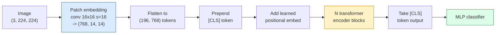

# Vision Transformer (ViT)

> 把图像切成小块，把每块当作一个词，跑一个标准 transformer。就这么简单，别无他法。

**Type:** Build
**Languages:** Python
**Prerequisites:** Phase 7 Lesson 02（自注意力）、Phase 4 Lesson 04（图像分类）
**Time:** ~45 分钟

## 学习目标

- 从零实现 patch embedding、可学习的位置编码、class token 以及 transformer encoder 块，构建一个最小化的 ViT
- 解释为什么 ViT 曾被认为需要海量预训练数据，直到 DeiT 和 MAE 证明并非如此
- 比较 ViT、Swin 和 ConvNeXt 在架构先验上的差异（无先验、局部窗口注意力、卷积主干）
- 使用 `timm` 和标准的 linear-probe / fine-tune 流程，在小数据集上微调一个预训练 ViT

## 问题所在

十年来，卷积就是计算机视觉的代名词。CNN 拥有强大的归纳偏置——局部性、平移等变性——没人认为这些可以被替代。然后 Dosovitskiy 等人（2020）证明，一个纯粹的 transformer 直接作用于展平的图像块，完全不用卷积结构，在大规模数据下就能匹敌甚至超越最好的 CNN。

但关键在“大规模”。ViT 在 ImageNet-1k 上输给了 ResNet。而先在 ImageNet-21k 或 JFT-300M 上预训练、再在 ImageNet-1k 上微调的 ViT 则胜出了。当时的结论是：transformer 缺乏有用的先验，但可以从足够多的数据中学到它们。后续工作（DeiT、MAE、DINO）表明，只要训练方法得当——强数据增强、自监督预训练、蒸馏——ViT 在小数据上也能训练好。

到 2026 年，纯 CNN 在边缘设备上仍然有竞争力（ConvNeXt 是最强的），但在其他所有领域 transformer 都占据主导：分割（Mask2Former、SegFormer）、检测（DETR、RT-DETR）、多模态（CLIP、SigLIP）、视频（VideoMAE、VJEPA）。ViT 块结构是必须掌握的。

## 核心概念

### 整体流程



七个步骤。Patches -> tokens -> attention -> 分类器。每个变体（DeiT、Swin、ConvNeXt、MAE 预训练）只改动其中一到两步，其余保持不变。

### Patch embedding

第一个卷积是关键。卷积核大小为 16、步长为 16，因此一张 224x224 的图像变成 14x14 的 16x16 patch 网格，每个 patch 被投影为 768 维嵌入。这一个卷积同时完成了分块和线性投影。

```
Input:  (3, 224, 224)
Conv (3 -> 768, k=16, s=16, no padding):
Output: (768, 14, 14)
Flatten spatial: (196, 768)
```

196 个 patch = 196 个 token。每个 token 的特征维度为 768（ViT-B）、1024（ViT-L）或 1280（ViT-H）。

### Class token

一个单独的可学习向量，被添加到序列最前面：

```
tokens = [CLS; patch_1; patch_2; ...; patch_196]   shape (197, 768)
```

经过 N 个 transformer 块后，`[CLS]` 的输出就是全局图像表示。分类头只读取这一个向量。

### 位置编码

transformer 本身没有空间位置的概念。给每个 token 加上一个可学习向量：

```
tokens = tokens + learned_pos_embedding   (also shape (197, 768))
```

这个嵌入是模型的一个参数；基于梯度的训练会让它适应二维图像结构。二维正弦位置编码也存在，但实践中很少使用。

### Transformer encoder 块

标准结构。多头自注意力、MLP、残差连接、pre-LayerNorm。

```
x = x + MSA(LN(x))
x = x + MLP(LN(x))

MLP is two-layer with GELU: Linear(d -> 4d) -> GELU -> Linear(4d -> d)
```

ViT-B/16 堆叠 12 个这样的块，每块 12 个注意力头，总参数量 86M。

### 为什么用 pre-LN

早期的 transformer 使用 post-LN（`x = LN(x + sublayer(x))`），不使用 warmup 很难训练超过 6-8 层。Pre-LN（`x = x + sublayer(LN(x))`）无需 warmup 即可稳定训练更深的网络。所有 ViT 和所有现代大语言模型都使用 pre-LN。

### Patch 大小的权衡

- 16x16 patch -> 196 个 token，标准配置。
- 32x32 patch -> 49 个 token，更快但分辨率更低。
- 8x8 patch -> 784 个 token，更精细，但 O(n^2) 的注意力代价增长很快。

更大的 patch = 更少的 token = 更快但空间细节更少。SwinV2 在分层窗口中使用 4x4 patch。

### DeiT 在 ImageNet-1k 上训练 ViT 的配方

原始 ViT 需要 JFT-300M 才能击败 CNN。DeiT（Touvron 等人，2020）仅用 ImageNet-1k 就把 ViT-B 训练到 81.8% top-1，方法只有四点改动：

1. 重度数据增强：RandAugment、Mixup、CutMix、Random Erasing。
2. Stochastic depth（训练时随机丢弃整块）。
3. Repeated augmentation（同一图像每个 batch 中采样 3 次）。
4. 从 CNN 教师模型蒸馏（可选，可进一步提升精度）。

现代所有 ViT 训练配方都源自 DeiT。

### Swin 与 ConvNeXt

- **Swin**（Liu 等人，2021）——基于窗口的注意力。每个块只在局部窗口内做注意力；交替的块会移动窗口以跨窗口混合信息。在保留注意力算子的同时，重新引入了类似 CNN 的局部性先验。
- **ConvNeXt**（Liu 等人，2022）——重新设计的 CNN，采用了与 Swin 相同的架构选择（深度卷积、LayerNorm、GELU、倒置瓶颈）。它证明差距不在于“注意力 vs 卷积”，而在于“现代训练配方 + 架构”。

到 2026 年，ConvNeXt-V2 和 Swin-V2 都是生产级模型；正确的选择取决于你的推理栈（ConvNeXt 在边缘端编译效果更好）和预训练语料。

### MAE 预训练

掩码自编码器（He 等人，2022）：随机遮掩 75% 的 patch，训练编码器只处理可见的 25%，再训练一个小型解码器从编码器的输出重建被遮掩的 patch。预训练完成后，丢弃解码器，微调编码器。

MAE 使 ViT 仅靠 ImageNet-1k 就能训练，达到 SOTA，是当前默认的自监督预训练配方。

```figure
batchnorm-inference
```

## 动手实现

### 第 1 步：Patch embedding

```python
import torch
import torch.nn as nn

class PatchEmbedding(nn.Module):
    def __init__(self, in_channels=3, patch_size=16, dim=192, image_size=64):
        super().__init__()
        assert image_size % patch_size == 0
        self.proj = nn.Conv2d(in_channels, dim, kernel_size=patch_size, stride=patch_size)
        num_patches = (image_size // patch_size) ** 2
        self.num_patches = num_patches

    def forward(self, x):
        x = self.proj(x)
        return x.flatten(2).transpose(1, 2)
```

一个卷积，一个展平，一个转置。这就是从图像到 token 的全部步骤。

### 第 2 步：Transformer 块

Pre-LN、多头自注意力、带 GELU 的 MLP、残差连接。

```python
class Block(nn.Module):
    def __init__(self, dim, num_heads, mlp_ratio=4, dropout=0.0):
        super().__init__()
        self.ln1 = nn.LayerNorm(dim)
        self.attn = nn.MultiheadAttention(dim, num_heads, dropout=dropout, batch_first=True)
        self.ln2 = nn.LayerNorm(dim)
        self.mlp = nn.Sequential(
            nn.Linear(dim, dim * mlp_ratio),
            nn.GELU(),
            nn.Dropout(dropout),
            nn.Linear(dim * mlp_ratio, dim),
            nn.Dropout(dropout),
        )

    def forward(self, x):
        a, _ = self.attn(self.ln1(x), self.ln1(x), self.ln1(x), need_weights=False)
        x = x + a
        x = x + self.mlp(self.ln2(x))
        return x
```

`nn.MultiheadAttention` 负责多头拆分、缩放点积和输出投影。`batch_first=True` 所以形状是 `(N, seq, dim)`。

### 第 3 步：ViT

```python
class ViT(nn.Module):
    def __init__(self, image_size=64, patch_size=16, in_channels=3,
                 num_classes=10, dim=192, depth=6, num_heads=3, mlp_ratio=4):
        super().__init__()
        self.patch = PatchEmbedding(in_channels, patch_size, dim, image_size)
        num_patches = self.patch.num_patches
        self.cls_token = nn.Parameter(torch.zeros(1, 1, dim))
        self.pos_embed = nn.Parameter(torch.zeros(1, num_patches + 1, dim))
        self.blocks = nn.ModuleList([
            Block(dim, num_heads, mlp_ratio) for _ in range(depth)
        ])
        self.ln = nn.LayerNorm(dim)
        self.head = nn.Linear(dim, num_classes)
        nn.init.trunc_normal_(self.pos_embed, std=0.02)
        nn.init.trunc_normal_(self.cls_token, std=0.02)

    def forward(self, x):
        x = self.patch(x)
        cls = self.cls_token.expand(x.size(0), -1, -1)
        x = torch.cat([cls, x], dim=1)
        x = x + self.pos_embed
        for blk in self.blocks:
            x = blk(x)
        x = self.ln(x[:, 0])
        return self.head(x)

vit = ViT(image_size=64, patch_size=16, num_classes=10, dim=192, depth=6, num_heads=3)
x = torch.randn(2, 3, 64, 64)
print(f"output: {vit(x).shape}")
print(f"params: {sum(p.numel() for p in vit.parameters()):,}")
```

大约 2.8M 参数——一个可以在 CPU 上运行的小型 ViT。真正的 ViT-B 是 86M；只需在同一个类定义中修改 `dim=768, depth=12, num_heads=12`。

### 第 4 步：健全性检查——单张图像推理

```python
logits = vit(torch.randn(1, 3, 64, 64))
print(f"logits: {logits}")
print(f"probs:  {logits.softmax(-1)}")
```

应当无错误运行，概率之和为 1。

## 使用它

`timm` 提供了所有带 ImageNet 预训练权重的 ViT 变体，只需一行代码：

```python
import timm

model = timm.create_model("vit_base_patch16_224", pretrained=True, num_classes=10)
```

`timm` 是 2026 年视觉 transformer 的生产默认选择。它以同一套 API 支持 ViT、DeiT、Swin、Swin-V2、ConvNeXt、ConvNeXt-V2、MaxViT、MViT、EfficientFormer 等数十种模型。

对于多模态工作（图像 + 文本），`transformers` 提供了 CLIP、SigLIP、BLIP-2、LLaVA。这些模型的图像编码器都是 ViT 的变体。

## 发布它

本课产出：

- `outputs/prompt-vit-vs-cnn-picker.md` —— 一个提示词，根据数据集规模、算力和推理栈，在 ViT、ConvNeXt 和 Swin 之间做出选择。
- `outputs/skill-vit-patch-and-pos-embed-inspector.md` —— 一个技能，验证 ViT 的 patch embedding 和位置编码形状是否与模型预期的序列长度匹配，以捕获最常见的移植错误。

## 练习

1. **（简单）** 打印上面小型 ViT 前向传播中所有中间张量的形状。确认：输入 `(N, 3, 64, 64)` -> patches `(N, 16, 192)` -> 加 CLS 后 `(N, 17, 192)` -> 分类器输入 `(N, 192)` -> 输出 `(N, num_classes)`。
2. **（中等）** 在 Lesson 4 的合成 CIFAR 数据集上微调一个预训练的 `timm` ViT-S/16。与在相同数据上微调 ResNet-18 进行比较。报告训练时间和最终精度。
3. **（困难）** 为小型 ViT 实现 MAE 预训练：遮掩 75% 的 patch，训练编码器 + 小型解码器来重建被遮掩的 patch。评估预训练前后在合成数据上的 linear-probe 精度。

## 关键术语

| 术语 | 人们的说法 | 实际含义 |
|------|----------------|----------------------|
| Patch embedding | “第一个卷积” | 一个 kernel size = stride = patch 大小的卷积；把图像变成 token 嵌入网格 |
| Class token | "[CLS]" | 一个添加到 token 序列最前面的可学习向量；其最终输出是全局图像表示 |
| 位置编码 | “可学习位置编码” | 一个加到每个 token 上的可学习向量，让 transformer 知道每个 patch 来自哪里 |
| Pre-LN | “子层之前的 LayerNorm” | 稳定的 transformer 变体：`x + sublayer(LN(x))` 而非 `LN(x + sublayer(x))` |
| 多头注意力 | “并行注意力” | 标准 transformer 注意力拆分为 num_heads 个独立子空间，之后再拼接 |
| ViT-B/16 | “Base，patch 16” | 标准规格：dim=768、depth=12、heads=12、patch_size=16、image=224；约 86M 参数 |
| DeiT | “数据高效的 ViT” | 仅用 ImageNet-1k 加上强数据增强训练的 ViT；证明了大型预训练数据集并非严格必需 |
| MAE | “掩码自编码器” | 自监督预训练：遮掩 75% 的 patch 再重建；当前占主导的 ViT 预训练配方 |

## 延伸阅读

- [An Image is Worth 16x16 Words（Dosovitskiy 等人，2020）](https://arxiv.org/abs/2010.11929)——ViT 论文
- [DeiT: Data-efficient Image Transformers（Touvron 等人，2020）](https://arxiv.org/abs/2012.12877)——如何仅用 ImageNet-1k 训练 ViT
- [Masked Autoencoders are Scalable Vision Learners（He 等人，2022）](https://arxiv.org/abs/2111.06377)——MAE 预训练
- [timm 文档](https://huggingface.co/docs/timm)——生产中会用到的所有视觉 transformer 的参考手册