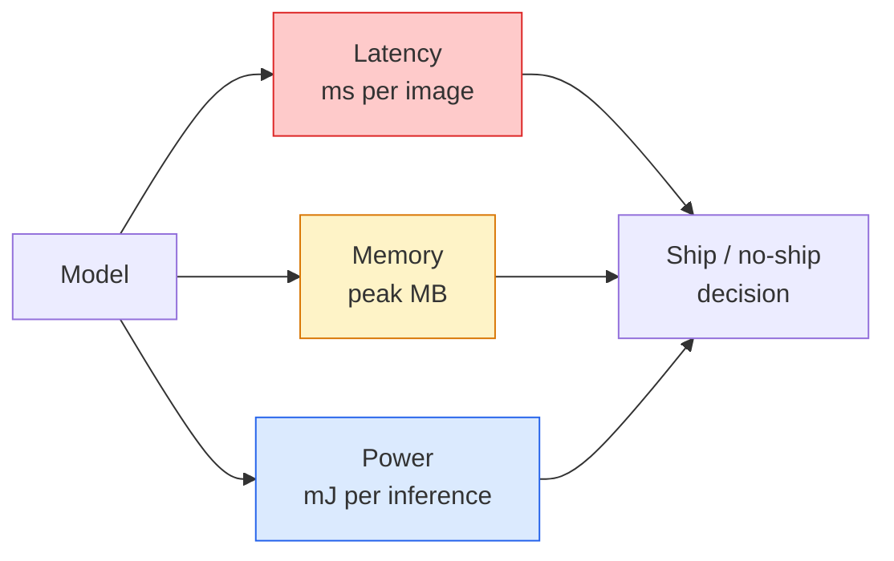

# 实时视觉 — 边缘部署

> 边缘推理是一门让准确率 90 的模型在 2 GB 内存的设备上跑到 30 fps 的学科。每一个百分点的准确率都要用毫秒级的延迟来交换。

**Type:** Learn + Build
**Languages:** Python
**Prerequisites:** 第 4 阶段第 04 课（图像分类）、第 10 阶段第 11 课（量化）
**Time:** 约 75 分钟

## 学习目标

- 测量任意 PyTorch 模型的推理延迟、峰值内存和吞吐量，并解读 FLOPs / 参数量 / 延迟之间的权衡
- 使用 PyTorch 的训练后量化将视觉模型量化为 INT8，并验证准确率损失 < 1%
- 导出为 ONNX 并用 ONNX Runtime 或 TensorRT 编译；说出三种最常见的导出失败及其修复方法
- 说明在边缘约束下何时选择 MobileNetV3、EfficientNet-Lite、ConvNeXt-Tiny 或 MobileViT

## 问题所在

训练阶段的视觉模型是一个浮点怪物：1 亿参数、每次前向传播 10 GFLOPs、2 GB 显存。这些没有一样能装进手机、车载信息娱乐系统、工业相机或无人机。交付视觉系统，意味着把同样的预测塞进一个小 100 倍的预算里。

有三个旋钮承担了大部分工作：模型选择（用更小的架构配合同样的配方）、量化（用 INT8 代替 FP32）、以及推理运行时（ONNX Runtime、TensorRT、Core ML、TFLite）。把它们调对，是在工作站上跑得动的 demo 和能装在 30 美元摄像头模组上交付的产品之间的分水岭。

本课先建立测量纪律（你无法优化无法测量的东西），然后逐一讲解三个旋钮。目标不是学会每一个边缘运行时，而是知道有哪些杠杆存在，以及如何验证每个杠杆确实起到了你预想的作用。

## 概念

### 三种预算



- **延迟**：p50、p95、p99。只看 p50 平均值会掩盖对实时系统至关重要的尾部行为。
- **峰值内存**：设备曾经达到的最大值，而非稳态平均值。这很重要，因为嵌入式设备上的 OOM 是致命的。
- **功耗 / 能耗**：电池供电设备上每次推理的毫焦数。通常用 CPU/GPU 利用率 * 时间来近似。

边缘决策正是依据一张（模型、延迟、内存、准确率）表做出的。每一个单元格都必须在目标设备上测量，而不是在 workstation 上。

### 测量纪律

每份边缘性能画像都应遵守的三条规则：

1. 测量前先用 5-10 次哑前向传播**预热**模型。冷缓存和 JIT 编译会产生不具代表性的首次数据。
2. 在计时块前后用 `torch.cuda.synchronize()` **同步** GPU 工作负载。否则你测到的是内核调度，而不是内核执行。
3. **固定输入尺寸**为生产分辨率。224x224 上的延迟不等于 512x512 上的延迟。

### FLOPs 作为代理指标

FLOPs（每次推理的浮点运算数）是一种廉价的、与设备无关的延迟代理。它适合用于架构比较，但作为绝对墙钟时间则有误导性。一个 FLOPs 多 10% 的模型在实践中可能快 2 倍，因为它使用了硬件友好的算子（depthwise 卷积编译效果好，大的 7x7 卷积则不行）。

规则：架构搜索用 FLOPs，部署决策用设备上的实测延迟。

### 一段话讲清量化

用 INT8 替换 FP32 权重和激活值。模型体积缩小 4 倍，内存带宽消耗减少 4 倍，在具备 INT8 内核的硬件上（所有现代移动 SoC、所有带 Tensor Cores 的 NVIDIA GPU）计算量减少 2-4 倍。在视觉任务上，训练后静态量化的准确率损失通常只有 0.1-1 个百分点。

类型：

- **动态量化** — 权重量化为 INT8，激活值以浮点计算。简单，加速有限。
- **静态（训练后）量化** — 量化权重 + 用小的校准集校准激活值范围。比动态量化快得多。
- **量化感知训练（QAT）** — 在训练期间模拟量化，让模型学会适应量化。准确率最好，但需要标注数据。

对视觉任务来说，训练后静态量化以 5% 的投入获得 95% 的收益。只有当 PTQ 的准确率损失不可接受时才使用 QAT。

### 剪枝与蒸馏

- **剪枝** — 移除不重要的权重（基于幅值）或通道（结构化）。在过参数化模型上效果好；对已经足够紧凑的架构用处不大。
- **蒸馏** — 训练一个小的学生模型去模仿大教师模型的 logits。通常能恢复模型缩小时丢失的大部分准确率。这是生产级边缘模型的标准做法。

### 推理运行时

- **PyTorch eager** — 慢，不适合部署。仅用于开发。
- **TorchScript** — 已过时，被 `torch.compile` 和 ONNX 导出取代。
- **ONNX Runtime** — 中立运行时。CPU、CUDA、CoreML、TensorRT、OpenVINO 都有对应的 ONNX provider。从这里开始。
- **TensorRT** — NVIDIA 的编译器。在 NVIDIA GPU（workstation 和 Jetson）上延迟最优。可与 ONNX Runtime 集成或独立使用。
- **Core ML** — Apple 的 iOS/macOS 运行时。需要 `.mlmodel` 或 `.mlpackage`。
- **TFLite** — Google 的 Android/ARM 运行时。需要 `.tflite`。
- **OpenVINO** — Intel 的 CPU/VPU 运行时。需要 `.xml` + `.bin`。

实践中：PyTorch -> ONNX 导出 -> 为目标平台选择运行时。ONNX 是通用语言。

### 边缘架构选择器

| 预算 | 模型 | 理由 |
|--------|-------|-----|
| < 3M 参数 | MobileNetV3-Small | 到处都能编译，良好的基线 |
| 3-10M | EfficientNet-Lite-B0 | TFLite 上单位参数准确率最高 |
| 10-20M | ConvNeXt-Tiny | 准确率/参数比最佳，CPU 友好 |
| 20-30M | MobileViT-S 或 EfficientViT | 具备 ImageNet 准确率的 Transformer |
| 30-80M | Swin-V2-Tiny | 如果技术栈支持窗口注意力 |

除非有特殊理由，否则将上述所有模型量化为 INT8。

```figure
cnn-param-count
```

## 动手实现

### 第 1 步：正确测量延迟

```python
import time
import torch

def measure_latency(model, input_shape, device="cpu", warmup=10, iters=50):
    model = model.to(device).eval()
    x = torch.randn(input_shape, device=device)
    with torch.no_grad():
        for _ in range(warmup):
            model(x)
        if device == "cuda":
            torch.cuda.synchronize()
        times = []
        for _ in range(iters):
            if device == "cuda":
                torch.cuda.synchronize()
            t0 = time.perf_counter()
            model(x)
            if device == "cuda":
                torch.cuda.synchronize()
            times.append((time.perf_counter() - t0) * 1000)
    times.sort()
    return {
        "p50_ms": times[len(times) // 2],
        "p95_ms": times[int(len(times) * 0.95)],
        "p99_ms": times[int(len(times) * 0.99)],
        "mean_ms": sum(times) / len(times),
    }
```

预热、同步、使用 `time.perf_counter()`。报告百分位数，而不只是均值。

### 第 2 步：参数量与 FLOP 计数

```python
def parameter_count(model):
    return sum(p.numel() for p in model.parameters())

def flops_estimate(model, input_shape):
    """
    Rough FLOP count for a conv/linear-only model. For production use `fvcore` or `ptflops`.
    """
    total = 0
    def conv_hook(m, inp, out):
        nonlocal total
        c_out, c_in, kh, kw = m.weight.shape
        h, w = out.shape[-2:]
        total += 2 * c_in * c_out * kh * kw * h * w
    def linear_hook(m, inp, out):
        nonlocal total
        total += 2 * m.in_features * m.out_features
    hooks = []
    for m in model.modules():
        if isinstance(m, torch.nn.Conv2d):
            hooks.append(m.register_forward_hook(conv_hook))
        elif isinstance(m, torch.nn.Linear):
            hooks.append(m.register_forward_hook(linear_hook))
    model.eval()
    with torch.no_grad():
        model(torch.randn(input_shape))
    for h in hooks:
        h.remove()
    return total
```

在真实项目中使用 `fvcore.nn.FlopCountAnalysis` 或 `ptflops`；它们能正确处理所有模块类型。

### 第 3 步：训练后静态量化

```python
def quantise_ptq(model, calibration_loader, backend="x86"):
    import torch.ao.quantization as tq
    model = model.eval().cpu()
    model.qconfig = tq.get_default_qconfig(backend)
    tq.prepare(model, inplace=True)
    with torch.no_grad():
        for x, _ in calibration_loader:
            model(x)
    tq.convert(model, inplace=True)
    return model
```

三步：配置、准备（插入观察器）、用真实数据校准、转换（融合 + 量化）。要求模型已融合（`Conv -> BN -> ReLU` -> `ConvBnReLU`），`torch.ao.quantization.fuse_modules` 会处理这一步。

### 第 4 步：导出为 ONNX

```python
def export_onnx(model, sample_input, path="model.onnx"):
    model = model.eval()
    torch.onnx.export(
        model,
        sample_input,
        path,
        input_names=["input"],
        output_names=["output"],
        dynamic_axes={"input": {0: "batch"}, "output": {0: "batch"}},
        opset_version=17,
    )
    return path
```

在 2026 年，`opset_version=17` 是安全默认值。`dynamic_axes` 允许你以任意 batch size 运行 ONNX 模型。

### 第 5 步：基准测试并对比不同模式

```python
import torch.nn as nn
from torchvision.models import mobilenet_v3_small

def compare_regimes():
    model = mobilenet_v3_small(weights=None, num_classes=10)
    params = parameter_count(model)
    flops = flops_estimate(model, (1, 3, 224, 224))
    lat_fp32 = measure_latency(model, (1, 3, 224, 224), device="cpu")
    print(f"FP32 MobileNetV3-Small: {params:,} params  {flops/1e9:.2f} GFLOPs  "
          f"p50={lat_fp32['p50_ms']:.2f}ms  p95={lat_fp32['p95_ms']:.2f}ms")
```

用同一函数分别跑 `resnet50`、`efficientnet_v2_s` 和 `convnext_tiny`，你就得到了部署决策所需的对比表。

## 实际应用

生产技术栈收敛于三条路径之一：

- **Web / 无服务器**：PyTorch -> ONNX -> ONNX Runtime（CPU 或 CUDA provider）。最简单，对大多数场景足够。
- **NVIDIA 边缘（Jetson、GPU 服务器）**：PyTorch -> ONNX -> TensorRT。延迟最优，工程投入最大。
- **移动端**：PyTorch -> ONNX -> Core ML（iOS）或 TFLite（Android）。导出前先量化。

测量方面，`torch-tb-profiler`、`nvprof` / `nsys` 以及 macOS 上的 Instruments 可以给出逐层分解。`benchmark_app`（OpenVINO）和 `trtexec`（TensorRT）提供独立的命令行数据。

## 交付成果

本课产出：

- `outputs/prompt-edge-deployment-planner.md` — 一个 prompt，根据目标设备和延迟 SLA 选择骨干网络、量化策略和运行时。
- `outputs/skill-latency-profiler.md` — 一个 skill，编写完整的延迟基准测试脚本，包含预热、同步、百分位数和内存追踪。

## 练习

1. **（简单）** 在 CPU 上以 224x224 分辨率测量 `resnet18`、`mobilenet_v3_small`、`efficientnet_v2_s` 和 `convnext_tiny` 的 p50 延迟。报告表格并指出哪个架构的单位毫秒准确率最高。
2. **（中等）** 对 `mobilenet_v3_small` 应用训练后静态量化。报告 FP32 与 INT8 的延迟对比，以及在 CIFAR-10 或类似数据集的留出子集上的准确率损失。
3. **（困难）** 将 `convnext_tiny` 导出为 ONNX，通过 `onnxruntime` 和 `CPUExecutionProvider` 运行，并与 PyTorch eager 基线比较延迟。找出 ONNX Runtime 开始变快的第一个层并解释原因。

## 关键术语

| 术语 | 人们怎么说 | 实际含义 |
|------|----------------|----------------------|
| 延迟 | “多快” | 从输入到输出的时间；p50/p95/p99 百分位数，而非均值 |
| FLOPs | “模型大小” | 每次前向传播的浮点运算数；计算成本的粗略代理 |
| INT8 量化 | “8 位” | 用 8 位整数替换 FP32 权重/激活值；约小 4 倍，快 2-4 倍 |
| PTQ | “训练后量化” | 无需重新训练即可量化已训练的模型；简单，通常够用 |
| QAT | “量化感知训练” | 训练期间模拟量化；准确率最佳，但需要标注数据 |
| ONNX | “中立格式” | 受所有主流推理运行时支持的模型交换格式 |
| TensorRT | “NVIDIA 编译器” | 将 ONNX 编译为针对 NVIDIA GPU 优化的引擎 |
| 蒸馏 | “教师 -> 学生” | 训练小模型模仿大模型的 logits；恢复大部分损失的准确率 |

## 延伸阅读

- [EfficientNet（Tan & Le，2019）](https://arxiv.org/abs/1905.11946) — 高效架构的复合缩放
- [MobileNetV3（Howard 等，2019）](https://arxiv.org/abs/1905.02244) — 采用 h-swish 和 squeeze-excite 的移动优先架构
- [TensorRT 优化实用指南（NVIDIA）](https://developer.nvidia.com/blog/accelerating-model-inference-with-tensorrt-tips-and-best-practices-for-pytorch-users/) — 如何真正跑出论文中的吞吐量数字
- [ONNX Runtime 文档](https://onnxruntime.ai/docs/) — 量化、图优化、provider 选择