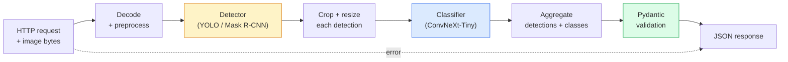

# 构建完整视觉流水线 — 毕业项目

> 生产级视觉系统是由数据契约串联起来的模型与规则链。各组件已在本阶段中备齐；毕业项目将它们端到端地连接起来。

**Type:** Build
**Languages:** Python
**Prerequisites:** Phase 4 Lessons 01-15
**Time:** ~120 分钟

## 学习目标

- 设计一个生产级视觉流水线，检测目标、分类并输出结构化 JSON——处理好每一条失败路径
- 将检测器（Mask R-CNN 或 YOLO）、分类器（ConvNeXt-Tiny）和数据契约（Pydantic）接入同一个服务
- 对端到端流水线进行基准测试，找出第一个瓶颈（通常是预处理，其次是检测器）
- 部署一个最小的 FastAPI 服务，接受图像上传、运行流水线并返回带分类结果的检测

## 问题所在

单个视觉模型有用；视觉产品则是它们的链条。零售货架审计 = 检测器 + 商品分类器 + 价格 OCR 流水线。自动驾驶 = 2D 检测器 + 3D 检测器 + 分割器 + 跟踪器 + 规划器。医学预筛 = 分割器 + 区域分类器 + 临床医生界面。

把这些链条连接起来，正是区分 ML 原型与产品的关键。模型之间的每个接口都是新的出 bug 之处。每一次坐标变换、每一次归一化、每一次掩码缩放，都是静默失败的候选点。流水线的强度取决于其最薄弱的接口。

这个毕业项目搭建的是最小可行流水线：检测 + 分类 + 结构化输出 + 一个服务层。第 4 阶段的其他内容都可以嵌入这个骨架：把 Mask R-CNN 换成 YOLOv8、加一个 OCR 头、加一个分割分支、加一个跟踪器。架构是稳定的；组件是可插拔的。

## 核心概念

### 流水线



七个阶段。两个模型阶段开销最大；其余五个阶段是 bug 的藏身之处。

### 用 Pydantic 做数据契约

每个模型边界都变成一个带类型的对象。这将静默失败转化为显式失败。

```
Detection(
    box: tuple[float, float, float, float],   # (x1, y1, x2, y2), absolute pixels
    score: float,                              # [0, 1]
    class_id: int,                             # from detector's label map
    mask: Optional[list[list[int]]],           # RLE-encoded if present
)

PipelineResult(
    image_id: str,
    detections: list[Detection],
    classifications: list[Classification],
    inference_ms: float,
)
```

当检测器返回的框是 `(cx, cy, w, h)` 而不是 `(x1, y1, x2, y2)` 时，Pydantic 的校验会在边界处失败，你能立即发现问题，而不是去调试一个静默返回空区域的下游裁剪。

### 延迟去向

几乎在每条视觉流水线中，以下三条规律都成立：

1. **预处理往往是最大的单项开销。** 解码 JPEG、转换色彩空间、缩放——这些是 CPU 密集型的，容易被忽视。
2. **检测器占据大部分 GPU 时间。** GPU 时间的 70-90% 花在检测前向传播上。
3. **后处理（NMS、RLE 编码/解码）在 GPU 上便宜，在 CPU 上昂贵。** 务必用实际目标硬件进行剖析。

知道时间分布，才能把优化变成一份按优先级排序的清单。

### 失败模式

- **空检测结果** — 返回空列表，不要崩溃。记录日志。
- **越界框** — 裁剪前钳制到图像尺寸。
- **过小的裁剪** — 对小于分类器最小输入尺寸的框跳过分类。
- **损坏的上传** — 返回 400 并附带具体错误码，而不是 500。
- **模型加载失败** — 在服务启动时失败，而不是在首个请求时。

生产级流水线处理每一种情况，而不写笼统的 `try/except` 掩盖失败。每个失败都有一个命名的错误码和响应。

### 批处理

生产服务要服务多个客户端。跨请求对检测和分类进行批处理可以成倍提高吞吐。代价：等待批次填满带来的额外延迟。典型设置：最多收集 20ms 的请求，合并成批，处理，分发响应。`torchserve` 和 `triton` 原生支持这一点；负载可预测的小型服务可以自己实现微批处理器。

```figure
v4-vision-pipeline
```

## 动手构建

### 步骤 1：数据契约

```python
from pydantic import BaseModel, Field
from typing import List, Optional, Tuple

class Detection(BaseModel):
    box: Tuple[float, float, float, float]
    score: float = Field(ge=0, le=1)
    class_id: int = Field(ge=0)
    mask_rle: Optional[str] = None


class Classification(BaseModel):
    detection_index: int
    class_id: int
    class_name: str
    score: float = Field(ge=0, le=1)


class PipelineResult(BaseModel):
    image_id: str
    detections: List[Detection]
    classifications: List[Classification]
    inference_ms: float
```

五秒钟的代码，省去任何严肃流水线上一个小时的调试。

### 步骤 2：一个最小的 Pipeline 类

```python
import time
import numpy as np
import torch
from PIL import Image

class VisionPipeline:
    def __init__(self, detector, classifier, class_names,
                 device="cpu", min_crop=32):
        self.detector = detector.to(device).eval()
        self.classifier = classifier.to(device).eval()
        self.class_names = class_names
        self.device = device
        self.min_crop = min_crop

    def preprocess(self, image):
        """
        image: PIL.Image or np.ndarray (H, W, 3) uint8
        returns: CHW float tensor on device
        """
        if isinstance(image, Image.Image):
            image = np.asarray(image.convert("RGB"))
        tensor = torch.from_numpy(image).permute(2, 0, 1).float() / 255.0
        return tensor.to(self.device)

    @torch.no_grad()
    def detect(self, image_tensor):
        return self.detector([image_tensor])[0]

    @torch.no_grad()
    def classify(self, crops):
        if len(crops) == 0:
            return []
        batch = torch.stack(crops).to(self.device)
        logits = self.classifier(batch)
        probs = logits.softmax(-1)
        scores, cls = probs.max(-1)
        return list(zip(cls.tolist(), scores.tolist()))

    def run(self, image, image_id="anonymous"):
        t0 = time.perf_counter()
        tensor = self.preprocess(image)
        det = self.detect(tensor)

        crops = []
        detections = []
        valid_indices = []
        for i, (box, score, cls) in enumerate(zip(det["boxes"], det["scores"], det["labels"])):
            x1, y1, x2, y2 = [max(0, int(b)) for b in box.tolist()]
            x2 = min(x2, tensor.shape[-1])
            y2 = min(y2, tensor.shape[-2])
            detections.append(Detection(
                box=(x1, y1, x2, y2),
                score=float(score),
                class_id=int(cls),
            ))
            if (x2 - x1) < self.min_crop or (y2 - y1) < self.min_crop:
                continue
            crop = tensor[:, y1:y2, x1:x2]
            crop = torch.nn.functional.interpolate(
                crop.unsqueeze(0),
                size=(224, 224),
                mode="bilinear",
                align_corners=False,
            )[0]
            crops.append(crop)
            valid_indices.append(i)

        class_preds = self.classify(crops)

        classifications = []
        for valid_idx, (cls_id, cls_score) in zip(valid_indices, class_preds):
            classifications.append(Classification(
                detection_index=valid_idx,
                class_id=int(cls_id),
                class_name=self.class_names[cls_id],
                score=float(cls_score),
            ))

        return PipelineResult(
            image_id=image_id,
            detections=detections,
            classifications=classifications,
            inference_ms=(time.perf_counter() - t0) * 1000,
        )
```

每个接口都有类型。每条失败路径都有具体的处理决策。

### 步骤 3：接入检测器和分类器

```python
from torchvision.models.detection import maskrcnn_resnet50_fpn_v2
from torchvision.models import convnext_tiny

# Use ImageNet-pretrained weights for a realistic pipeline without training
detector = maskrcnn_resnet50_fpn_v2(weights="DEFAULT")
classifier = convnext_tiny(weights="DEFAULT")
class_names = [f"imagenet_class_{i}" for i in range(1000)]

pipe = VisionPipeline(detector, classifier, class_names)

# Smoke test with a synthetic image
test_image = (np.random.rand(400, 600, 3) * 255).astype(np.uint8)
result = pipe.run(test_image, image_id="demo")
print(result.model_dump_json(indent=2)[:500])
```

### 步骤 4：FastAPI 服务

```python
from fastapi import FastAPI, UploadFile, HTTPException
from io import BytesIO

app = FastAPI()
pipe = None  # initialised on startup

@app.on_event("startup")
def load():
    global pipe
    detector = maskrcnn_resnet50_fpn_v2(weights="DEFAULT").eval()
    classifier = convnext_tiny(weights="DEFAULT").eval()
    pipe = VisionPipeline(detector, classifier, class_names=[f"c{i}" for i in range(1000)])

@app.post("/detect")
async def detect_endpoint(file: UploadFile):
    if file.content_type not in {"image/jpeg", "image/png", "image/webp"}:
        raise HTTPException(status_code=400, detail="unsupported image type")
    data = await file.read()
    try:
        img = Image.open(BytesIO(data)).convert("RGB")
    except Exception:
        raise HTTPException(status_code=400, detail="cannot decode image")
    result = pipe.run(img, image_id=file.filename or "upload")
    return result.model_dump()
```

用 `uvicorn main:app --host 0.0.0.0 --port 8000` 运行。用 `curl -F 'file=@dog.jpg' http://localhost:8000/detect` 测试。

### 步骤 5：流水线基准测试

```python
import time

def benchmark(pipe, num_runs=20, image_size=(400, 600)):
    img = (np.random.rand(*image_size, 3) * 255).astype(np.uint8)
    pipe.run(img)  # warm up

    stages = {"preprocess": [], "detect": [], "classify": [], "total": []}
    for _ in range(num_runs):
        t0 = time.perf_counter()
        tensor = pipe.preprocess(img)
        t1 = time.perf_counter()
        det = pipe.detect(tensor)
        t2 = time.perf_counter()
        crops = []
        for box in det["boxes"]:
            x1, y1, x2, y2 = [max(0, int(b)) for b in box.tolist()]
            x2 = min(x2, tensor.shape[-1])
            y2 = min(y2, tensor.shape[-2])
            if (x2 - x1) >= pipe.min_crop and (y2 - y1) >= pipe.min_crop:
                crop = tensor[:, y1:y2, x1:x2]
                crop = torch.nn.functional.interpolate(
                    crop.unsqueeze(0), size=(224, 224), mode="bilinear", align_corners=False
                )[0]
                crops.append(crop)
        pipe.classify(crops)
        t3 = time.perf_counter()
        stages["preprocess"].append((t1 - t0) * 1000)
        stages["detect"].append((t2 - t1) * 1000)
        stages["classify"].append((t3 - t2) * 1000)
        stages["total"].append((t3 - t0) * 1000)

    for stage, times in stages.items():
        times.sort()
        print(f"{stage:12s}  p50={times[len(times)//2]:7.1f} ms  p95={times[int(len(times)*0.95)]:7.1f} ms")
```

CPU 上的典型输出：预处理 ~3 ms，检测 300-500 ms，分类 20-40 ms，总计 350-550 ms。在 GPU 上，检测为 20-40 ms，预处理 + 分类在相对占比上开始变得更加重要。

## 实际使用

生产模板收敛到相同的结构，再加上：

- **模型版本控制** — 始终在响应中记录模型名称和权重哈希。
- **每请求的 trace ID** — 为每个请求记录每个阶段的耗时，以便将慢响应与阶段关联起来。
- **回退路径** — 如果分类器超时，返回不带分类的检测结果，而不是让整个请求失败。
- **安全过滤器** — NSFW / PII 过滤器在分类之后、响应离开服务之前运行。
- **批量端点** — 一个接受图像 URL 列表用于批量处理的 `/detect_batch`。

对于生产部署，`torchserve`、`Triton Inference Server` 和 `BentoML` 开箱即用地处理批处理、版本控制、指标和健康检查。直接运行 `FastAPI` 对原型和小规模产品来说也没问题。

## 发布成果

本课产出：

- `outputs/prompt-vision-service-shape-reviewer.md` — 一个提示词，审查视觉服务代码中的契约/响应结构违规，并指出第一个致命 bug。
- `outputs/skill-pipeline-budget-planner.md` — 一个技能，给定目标延迟和吞吐量，为每个流水线阶段分配时间预算，并标记哪个阶段会最先超出预算。

## 练习

1. **（简单）** 在任意开放数据集的 10 张图像上运行流水线。报告每个阶段的平均耗时以及每张图像检测数量的分布。
2. **（中等）** 给 `Detection` 添加一个掩码输出字段，并将其编码为 RLE。验证 JSON 即使对含 10 个目标的图像也保持在 1MB 以下。
3. **（困难）** 在分类器前加一个微批处理器：最多收集 10 ms 的裁剪区域，用一次 GPU 调用全部分类，再按请求返回结果。在每秒 5 个并发请求下测量吞吐量提升和新增延迟。

## 关键术语

| 术语 | 人们怎么说 | 实际含义 |
|------|----------------|----------------------|
| 流水线（Pipeline） | "系统" | 一条按顺序排列的预处理、推理和后处理步骤链，每对相邻步骤之间有带类型的接口 |
| 数据契约（Data contract） | "模式" | 每个阶段的输入和输出都必须符合的 Pydantic / dataclass 定义；在边界处捕获集成 bug |
| 预处理（Preprocessing） | "模型之前" | 解码、色彩转换、缩放、归一化；通常是最大的 CPU 时间消耗 |
| 后处理（Postprocessing） | "模型之后" | NMS、掩码缩放、阈值、RLE 编码；GPU 上便宜，CPU 上昂贵 |
| 微批处理器（Microbatcher） | "先收集再前向" | 在固定时间窗口内等待多个请求的聚合器，运行单次批量前向传播 |
| Trace ID | "请求 id" | 每个请求在每个阶段都记录的唯一标识符，以便端到端追踪慢请求 |
| 失败码（Failure code） | "命名错误" | 按失败类别给出具体错误码，而非笼统的 500；支持客户端重试逻辑 |
| 健康检查（Health check） | "就绪探针" | 一个开销很小的端点，报告服务是否能够响应；负载均衡器依赖它 |

## 延伸阅读

- [Full Stack Deep Learning — Deploying Models](https://fullstackdeeplearning.com/course/2022/lecture-5-deployment/) — 生产级 ML 部署的权威概览
- [BentoML docs](https://docs.bentoml.com) — 支持批处理、版本控制和指标的服务框架
- [torchserve docs](https://pytorch.org/serve/) — PyTorch 官方服务库
- [NVIDIA Triton Inference Server](https://developer.nvidia.com/triton-inference-server) — 支持批处理和多模型的高吞吐服务