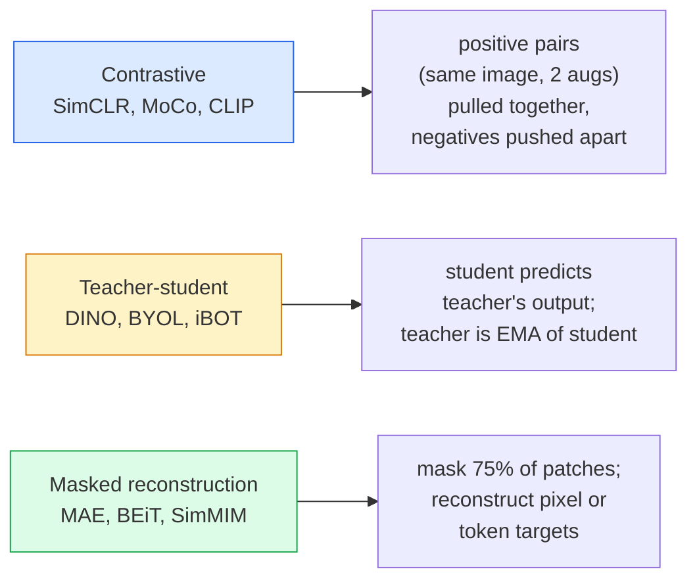

# 自监督视觉 — SimCLR、DINO、MAE

> 标注是监督式视觉的瓶颈。自监督预训练消除了这一瓶颈：从 1 亿张无标注图像中学习视觉特征，再在 1 万张有标注图像上微调。

**Type:** Learn + Build
**Languages:** Python
**Prerequisites:** Phase 4 Lesson 04 (Image Classification), Phase 4 Lesson 14 (ViT)
**Time:** 约 75 分钟

## 学习目标

- 梳理三大自监督家族 —— 对比学习（SimCLR）、师生网络（DINO）、掩码重建（MAE）—— 并说明各自优化的目标
- 从零实现 InfoNCE 损失，并解释为什么 batch size 为 512 可行而 32 会失败
- 解释 MAE 的 75% 掩码比例并非随意设定，以及它与 BERT 在文本上 15% 的区别
- 使用 DINOv2 或 MAE 的 ImageNet 检查点进行线性探测和零样本检索

## 问题所在

监督式 ImageNet 拥有 130 万张标注图像，标注成本估计约 1000 万美元。医疗和工业数据集规模更小，标注成本也更昂贵。每个视觉团队都在问：能否先在廉价的无标注数据上预训练 —— YouTube 视频帧、网络爬取数据、监控录像、卫星影像 —— 然后在小型标注集上微调？

自监督学习就是答案。在 LAION 或 JFT 上训练的现代自监督 ViT，经微调后可达到甚至超过监督式 ImageNet 的准确率。它的下游迁移能力（检测、分割、深度估计）也优于监督式预训练。DINOv2（Meta，2023）和 MAE（Meta，2022）是当前可迁移视觉特征在生产环境中的默认选择。

概念上的转变在于：预训练任务（pretext task，即模型被训练去做的事情）不必是下游任务。关键在于它迫使模型学到有用的特征。预测灰度图像的颜色、旋转图像并让模型分类旋转角度、掩码 patch 并重建 —— 这些方法都曾奏效。能够规模化的是三种方法：对比学习、师生蒸馏和掩码重建。

## 核心概念

### 三大家族



### 对比学习（SimCLR）

取一张图像，施加两次随机数据增强，得到两个视图。将两者输入同一个编码器加投影头。最小化一个损失，它要求"这两个嵌入应当接近"，同时"这个嵌入应当与 batch 中其他所有图像的嵌入保持远离"。

```
Loss for positive pair (z_i, z_j) among 2N views per batch:

   L_ij = -log( exp(sim(z_i, z_j) / tau) / sum_k in batch \ {i} exp(sim(z_i, z_k) / tau) )

sim = cosine similarity
tau = temperature (0.1 standard)
```

这就是 InfoNCE 损失。它需要每个正样本对应大量负样本，因此 batch size 很重要 —— SimCLR 需要 512-8192。MoCo 引入了过去 batch 的动量队列，将负样本数量与 batch size 解耦。

### 师生网络（DINO）

两个结构相同的网络：学生和教师。教师是学生权重的指数滑动平均（EMA）。两者都接收图像的增强视图。训练学生的输出去匹配教师的输出 —— 不使用显式的负样本。

```
loss = CE( student_output(view_1),  teacher_output(view_2) )
     + CE( student_output(view_2),  teacher_output(view_1) )

teacher_weights = m * teacher_weights + (1 - m) * student_weights   (m ≈ 0.996)
```

为什么不会坍缩为"预测一个常数"：教师的输出会做中心化（减去每个维度的均值）和锐化（除以一个较小的温度）。中心化防止单一维度主导，锐化防止输出坍缩为均匀分布。

DINO 就是 DINOv2 所放大的基础，在 1.42 亿张精选图像上训练。其产生的特征是当前零样本视觉检索和密集预测的 SOTA。

### 掩码重建（MAE）

掩掉 ViT 输入的 75% patch。仅将可见的 25% 送入编码器。一个小型解码器接收编码器的输出以及掩码位置上的掩码 token，并被训练来重建被掩 patch 的像素。

```
Encoder:  visible 25% of patches -> features
Decoder:  features + mask tokens at masked positions -> reconstructed pixels
Loss:     MSE between reconstructed and original pixels on masked patches only
```

让 MAE 生效的关键设计选择：

- **75% 掩码比例** —— 很高。迫使编码器学习语义特征；重建时若可见部分达 25% 则近乎轻而易举（相邻像素高度相关，CNN 就能轻松搞定）。
- **非对称编码器/解码器** —— 大型 ViT 编码器只看到可见 patch；小型解码器（8 层、512 维）负责重建。预训练速度比朴素的 BEiT 快 3 倍。
- **像素空间的重建目标** —— 比 BEiT 的 token 化目标更简单，在 ViT 上效果也更好。

预训练完成后，丢弃解码器。编码器就是特征提取器。

### 为什么是 75% 而不是 15%

BERT 掩掉 15% 的 token。MAE 掩掉 75%。差别在于信息密度。

- 自然语言每个 token 的熵很高。预测 15% 的 token 仍然困难，因为每个被掩位置都有许多合理的补全。
- 图像 patch 的熵很低 —— 未掩的邻域往往几乎能完全确定被掩 patch 的像素。要让预测需要语义理解，就必须激进地掩码。

75% 足够高，使简单的空间外推无法解决任务；编码器必须表示图像内容。

### 线性探测评估

自监督预训练之后，标准评估是**线性探测**（linear probe）：冻结编码器，在其之上针对 ImageNet 标签训练一个单一线性分类器，报告 top-1 准确率。

- SimCLR ResNet-50：约 71%（2020）
- DINO ViT-S/16：约 77%（2021）
- MAE ViT-L/16：约 76%（2022）
- DINOv2 ViT-g/14：约 86%（2023）

线性探测是对特征质量的纯粹度量；微调通常能再提升 2-5 个百分点，但也会混入头部重新训练的影响。

```figure
data-augmentation
```

## 动手构建

### 第 1 步：双视图增强流水线

```python
import torch
import torchvision.transforms as T

two_view_train = lambda: T.Compose([
    T.RandomResizedCrop(96, scale=(0.2, 1.0)),
    T.RandomHorizontalFlip(),
    T.ColorJitter(0.4, 0.4, 0.4, 0.1),
    T.RandomGrayscale(p=0.2),
    T.ToTensor(),
])


class TwoViewDataset(torch.utils.data.Dataset):
    def __init__(self, base):
        self.base = base
        self.aug = two_view_train()

    def __len__(self):
        return len(self.base)

    def __getitem__(self, i):
        img, _ = self.base[i]
        v1 = self.aug(img)
        v2 = self.aug(img)
        return v1, v2
```

每个 __getitem__ 返回同一图像的两个增强视图；不需要标签。

### 第 2 步：InfoNCE 损失

```python
import torch.nn.functional as F

def info_nce(z1, z2, tau=0.1):
    """
    z1, z2: (N, D) L2-normalised embeddings of paired views
    """
    N, D = z1.shape
    z = torch.cat([z1, z2], dim=0)  # (2N, D)
    sim = z @ z.T / tau              # (2N, 2N)

    mask = torch.eye(2 * N, dtype=torch.bool, device=z.device)
    sim = sim.masked_fill(mask, float("-inf"))

    targets = torch.cat([torch.arange(N, 2 * N), torch.arange(0, N)]).to(z.device)
    return F.cross_entropy(sim, targets)
```

调用前先对嵌入做 L2 归一化。`tau=0.1` 是 SimCLR 的默认值；更低的温度会使损失更尖锐，并需要更多负样本。

### 第 3 步：InfoNCE 合理性检查

```python
z1 = F.normalize(torch.randn(16, 32), dim=-1)
z2 = z1.clone()
loss_same = info_nce(z1, z2, tau=0.1).item()
z2_random = F.normalize(torch.randn(16, 32), dim=-1)
loss_random = info_nce(z1, z2_random, tau=0.1).item()
print(f"InfoNCE with identical pairs:  {loss_same:.3f}")
print(f"InfoNCE with random pairs:     {loss_random:.3f}")
```

相同配对应给出较低损失（大 batch 且低温时接近 0）。随机配对在 16 对的 batch 下应给出 log(2N-1) ≈ log(31) ≈ 3.4。

### 第 4 步：MAE 式掩码

```python
def random_mask_indices(num_patches, mask_ratio=0.75, seed=0):
    g = torch.Generator().manual_seed(seed)
    n_keep = int(num_patches * (1 - mask_ratio))
    perm = torch.randperm(num_patches, generator=g)
    visible = perm[:n_keep]
    masked = perm[n_keep:]
    return visible.sort().values, masked.sort().values


num_patches = 196
visible, masked = random_mask_indices(num_patches, mask_ratio=0.75)
print(f"visible: {len(visible)} / {num_patches}")
print(f"masked:  {len(masked)} / {num_patches}")
```

简单、快速，且对给定随机种子是确定性的。真实的 MAE 实现会按 batch 处理并保留每个样本的掩码。

## 应用它

DINOv2 是 2026 年的生产标准：

```python
import torch
from transformers import AutoImageProcessor, AutoModel

processor = AutoImageProcessor.from_pretrained("facebook/dinov2-base")
model = AutoModel.from_pretrained("facebook/dinov2-base")
model.eval()

# Per-image embeddings for zero-shot retrieval
with torch.no_grad():
    inputs = processor(images=[pil_image], return_tensors="pt")
    outputs = model(**inputs)
    embedding = outputs.last_hidden_state[:, 0]  # CLS token
```

得到的 768 维嵌入是现代图像检索、密集对应和零样本迁移流水线的骨干。在下游任务上微调很少需要超过一个线性头。

对于图文嵌入，对应的是 SigLIP 或 OpenCLIP；对于 MAE 式微调，`timm` 仓库提供了所有 MAE 检查点。

## 交付成果

本课产出：

- `outputs/prompt-ssl-pretraining-picker.md` —— 一个提示词，根据数据集规模、算力和下游任务在 SimCLR / MAE / DINOv2 之间做出选择。
- `outputs/skill-linear-probe-runner.md` —— 一个技能，为任意冻结编码器 + 标注数据集编写线性探测评估。

## 练习

1. **（简单）** 验证：对于对齐良好的嵌入，降低温度时 InfoNCE 损失下降；对于随机嵌入，降低温度时损失上升。绘制 `tau in [0.05, 0.1, 0.2, 0.5]` 与损失的关系图。
2. **（中等）** 实现 DINO 式的中心化缓冲区。展示在没有中心化的情况下，学生网络会在几个 epoch 内坍缩为一个常向量。
3. **（困难）** 在 CIFAR-100 上以 Lesson 10 的 TinyUNet 作为骨干训练 MAE。报告 10、50 和 200 epoch 时的线性探测准确率。展示在相同的 1000 张图像子集上，MAE 预训练的线性探测优于从零开始的监督式线性探测。

## 关键术语

| 术语 | 人们怎么说 | 实际含义 |
|------|----------------|----------------------|
| 自监督 | "无标注" | 一种从无标注数据中产生有用表示的预训练任务 |
| 预训练任务（pretext task） | "假任务" | SSL 中使用的目标（重建 patch、匹配视图）；预训练后被丢弃 |
| 线性探测 | "冻结编码器 + 线性头" | 标准 SSL 评估：在冻结特征之上只训练一个线性分类器 |
| InfoNCE | "对比损失" | 余弦相似度上的 softmax；正样本对是目标类别，其余均为负样本 |
| EMA 教师 | "滑动平均教师" | 其权重是学生权重的指数滑动平均的教师；BYOL、MoCo、DINO 均使用 |
| 掩码比例 | "被掩 patch 的百分比" | MAE 期间被掩的 patch 比例；视觉为 75%，文本为 15% |
| 表示坍缩 | "恒定输出" | SSL 失败情形：编码器对所有输入输出同一常向量；通过中心化、锐化或负样本防止 |
| DINOv2 | "生产级 SSL 骨干" | Meta 2023 年的自监督 ViT；2026 年最强的通用图像特征 |

## 延伸阅读

- [SimCLR (Chen et al., 2020)](https://arxiv.org/abs/2002.05709) — 对比学习参考文献
- [DINO (Caron et al., 2021)](https://arxiv.org/abs/2104.14294) — 带动量、中心化、锐化的师生网络
- [MAE (He et al., 2022)](https://arxiv.org/abs/2111.06377) — 面向 ViT 的掩码自编码器预训练
- [DINOv2 (Oquab et al., 2023)](https://arxiv.org/abs/2304.07193) — 将自监督 ViT 扩展到生产级特征