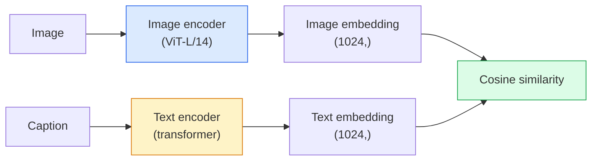

# 开放词汇视觉 — CLIP

> 同时训练图像编码器和文本编码器，使匹配的(图像, 说明文字)对落在共享空间中的同一点上。这就是全部诀窍。

**Type:** Build + Use
**Languages:** Python
**Prerequisites:** Phase 4 Lesson 14 (ViT), Phase 4 Lesson 17 (Self-Supervised)
**Time:** ~45 分钟

## 学习目标

- 解释 CLIP 的双塔架构和对比训练目标
- 使用预训练的 CLIP(或 SigLIP)进行零样本分类，无需任何任务特定训练
- 从零实现零样本分类：编码类别提示、计算余弦相似度、取 argmax
- 区分 CLIP、SigLIP、OpenCLIP 和 LLaVA/LLaMA-vision 模型 — 它们在 2026 年各自的用途

## 问题所在

传统分类器是封闭词汇的：一个 1000 类的 ImageNet 模型只能预测 1000 个标签。每个新类别都需要标注数据和重新训练的分类头。

CLIP(Radford 等人，OpenAI 2021)表明，在从网络上抓取的 4 亿(图像， 说明文字)对上训练，可以得到一个能在推理时分类到任意类别集合的模型，类别纯粹用自然语言描述。你只需写一个句子就能给出新类别。

这种能力 — 零样本迁移 — 就是为什么每个现代视觉系统都从 CLIP 系列的检查点开始。检测(Grounding DINO、OWL-ViT)、分割(CLIPSeg、SAM)、检索、内容审核、VLM 以及文生图都建立在 CLIP 式的联合嵌入之上。

## 概念

### 双塔



两个编码器最后都是一个线性投影，映射到相同的嵌入维度(CLIP-B/32 为 512,CLIP-L/14 为 1024)。做 L2 归一化并计算余弦相似度。

### 目标函数

给定一批 N 个(图像, 说明文字)对，构建一个 N×N 的相似度矩阵。训练两个编码器，使对角线(匹配对)具有高相似度，非对角线(非匹配对)具有低相似度。

```
sim_matrix = image_embeddings @ text_embeddings.T / tau

loss_i2t = cross_entropy(sim_matrix,       targets=arange(N))
loss_t2i = cross_entropy(sim_matrix.T,     targets=arange(N))
loss = (loss_i2t + loss_t2i) / 2
```

之所以是对称的，是因为图像到文本和文本到图像的检索都应该有效。`tau`(温度)通常作为一个标量参数学习，初始化为 0.07。

### SigLIP:更好的损失

SigLIP(Zhai 等人，2023)用逐对 sigmoid 替换了 softmax:

```
loss = mean over pairs of log(1 + exp(-y_ij * sim_ij))
y_ij = +1 if matching, -1 otherwise
```

逐对损失消除了 CLIP 所要求的批级别归一化。SigLIP 在小批量下训练效果更好，在相同数据量下达到或超过 CLIP。

### 零样本分类

给定一个训练好的 CLIP:

1. 为每个类别构造提示："a photo of a {class}"。
2. 用文本编码器编码所有类别提示 -> `T` 形状为 (C, d)。
3. 编码测试图像 -> `I` 形状为 (1, d)。
4. 相似度 = `I @ T.T` 形状为 (1, C)。
5. Argmax -> 预测类别。

提示工程很重要。OpenAI 为 ImageNet 发布了 80 个提示模板("a photo of a {}"、"a blurry photo of a {}"、"a sketch of a {}" 等)。对每个类别取所有模板嵌入的平均值，可额外提升 1-3% 的 top-1 准确率。

### 2026 年 CLIP 式模型的使用场景

- **零样本分类** — 直接使用。
- **图像检索** — 一次性编码所有图像，推理时嵌入查询。
- **文本条件检测** — Grounding DINO、OWL-ViT 在检测器外包裹一个 CLIP 文本塔。
- **文本条件分割** — CLIPSeg;SAM 通过 CLIP 使用文本提示输入。
- **VLM** — LLaVA、Qwen-VL、InternVL 将 CLIP 系列的视觉编码器接入 LLM。
- **文生图** — Stable Diffusion、DALL-E 3 以 CLIP 文本嵌入为条件。

一旦有了共享嵌入空间，每个视觉+语言任务都变成一个距离计算。

```figure
clip-contrastive
```

## 动手构建

### 步骤 1:一个微型双塔模型

真正的 CLIP 是 ViT + Transformer。本课中，双塔是在预先提取的特征之上的小型 MLP,以便在 CPU 上就能看到训练信号。

```python
import torch
import torch.nn as nn
import torch.nn.functional as F


class TwoTower(nn.Module):
    def __init__(self, img_in=128, txt_in=64, emb=64):
        super().__init__()
        self.image_proj = nn.Sequential(nn.Linear(img_in, 128), nn.ReLU(), nn.Linear(128, emb))
        self.text_proj = nn.Sequential(nn.Linear(txt_in, 128), nn.ReLU(), nn.Linear(128, emb))
        self.logit_scale = nn.Parameter(torch.ones([]) * 2.6592)  # ln(1/0.07)

    def forward(self, img_feats, txt_feats):
        i = F.normalize(self.image_proj(img_feats), dim=-1)
        t = F.normalize(self.text_proj(txt_feats), dim=-1)
        return i, t, self.logit_scale.exp()
```

两个投影、相同维度的输出、可学习的温度。与真实 CLIP API 的形状相同。

### 步骤 2:对比损失

```python
def clip_loss(image_emb, text_emb, logit_scale):
    N = image_emb.size(0)
    sim = logit_scale * image_emb @ text_emb.T
    targets = torch.arange(N, device=sim.device)
    l_i = F.cross_entropy(sim, targets)
    l_t = F.cross_entropy(sim.T, targets)
    return (l_i + l_t) / 2
```

对称的。更高的 logit_scale = 更尖锐的 softmax = 更自信但存在不稳定的风险。

### 步骤 3:零样本分类器

```python
@torch.no_grad()
def zero_shot_classify(model, image_feats, class_text_feats, class_names):
    """
    image_feats:      (N, img_in)
    class_text_feats: (C, txt_in)   one averaged embedding per class
    """
    i = F.normalize(model.image_proj(image_feats), dim=-1)
    t = F.normalize(model.text_proj(class_text_feats), dim=-1)
    sim = i @ t.T
    pred = sim.argmax(dim=-1)
    return [class_names[p] for p in pred.tolist()]
```

每步一行代码。这正是配合生产级 CLIP 检查点使用的精确零样本流程。

### 步骤 4:合理性检查

```python
torch.manual_seed(0)
model = TwoTower()

img = torch.randn(8, 128)
txt = torch.randn(8, 64)
i, t, scale = model(img, txt)
loss = clip_loss(i, t, scale)
print(f"batch size: {i.size(0)}   loss: {loss.item():.3f}")
```

对于随机初始化的模型，损失应接近 `log(N) = log(8) = 2.08` — 即尚未学到任何结构时的对称交叉熵目标。

## 使用它

OpenCLIP 是 2026 年社区默认的选择：

```python
import open_clip
import torch
from PIL import Image

model, _, preprocess = open_clip.create_model_and_transforms("ViT-B-32", pretrained="laion2b_s34b_b79k")
tokenizer = open_clip.get_tokenizer("ViT-B-32")

image = preprocess(Image.open("dog.jpg")).unsqueeze(0)
text = tokenizer(["a photo of a dog", "a photo of a cat", "a photo of a car"])

with torch.no_grad():
    image_features = model.encode_image(image)
    text_features = model.encode_text(text)
    image_features = image_features / image_features.norm(dim=-1, keepdim=True)
    text_features = text_features / text_features.norm(dim=-1, keepdim=True)
    probs = (100.0 * image_features @ text_features.T).softmax(dim=-1)

print(probs)
```

SigLIP 更新，在小规模下训练效果更好，是新工作的首选：`google/siglip-base-patch16-224`。Hugging Face 两者都有提供。

## 交付成果

本课产出：

- `outputs/prompt-zero-shot-class-picker.md` — 一个提示词，在给定类别列表和领域的情况下，为零样本 CLIP 设计类别模板。
- `outputs/skill-image-text-retriever.md` — 一个技能，使用任意 CLIP 检查点构建图像嵌入索引，支持按文本查询和按图像查询。

## 练习

1. **(简单)** 使用预训练的 OpenCLIP ViT-B/32,配合 80 模板提示集，在 CIFAR-10 上做零样本分类。报告 top-1 准确率；应约为 85-90%。
2. **(中等)** 在同一个 CIFAR-10 任务上，比较单模板("a photo of a {}")与 80 模板平均嵌入的效果。量化差距并解释为什么模板有帮助。
3. **(困难)** 构建一个零样本图像检索索引：用 CLIP 嵌入 1,000 张图像，构建 FAISS 索引，用自然语言描述进行查询。报告你手写的 20 个留出查询的检索 recall@5。

## 关键术语

| 术语 | 人们怎么说 | 实际含义 |
|------|----------------|----------------------|
| 双塔 | "双编码器" | 分离的图像和文本编码器，最后接一个共享维度的投影头 |
| 零样本 | "无需任务特定训练" | 推理时分类到仅用文本描述的类别；不接触任何标签 |
| 温度 / logit_scale | "tau" | 在 softmax 之前缩放相似度矩阵的可学习标量 |
| 提示模板 | "A photo of a {}" | 类别名称周围的自然语言包装；对多个模板取平均可提升零样本准确率 |
| CLIP | "图像+文本模型" | 2021 年的 OpenAI 模型；2026 年该领域的通用词汇 |
| SigLIP | "Sigmoid CLIP" | 用逐对 sigmoid 替换 softmax;在小批量下训练效果更好 |
| OpenCLIP | "开源复现" | 在 LAION 上由社区训练的 CLIP 变体；开源流程的生产默认选择 |
| VLM | "视觉语言模型" | CLIP 系列编码器加上一个 LLM,训练用于回答关于图像的问题 |

## 延伸阅读

- [CLIP: Learning Transferable Visual Models from Natural Language Supervision (Radford et al., 2021)](https://arxiv.org/abs/2103.00020)
- [SigLIP: Sigmoid Loss for Language-Image Pre-Training (Zhai et al., 2023)](https://arxiv.org/abs/2303.15343)
- [OpenCLIP](https://github.com/mlfoundations/open_clip) — 社区代码库
- [DINOv2 vs CLIP vs MAE: a features comparison](https://huggingface.co/blog/dinov2) — HF 指南，含并列使用场景对比