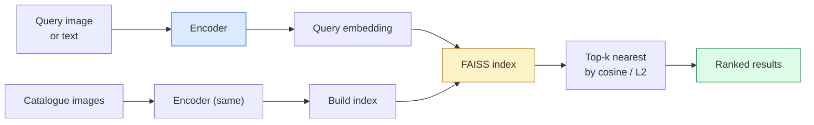

# 图像检索与度量学习

> 检索系统在嵌入空间中按距离对候选结果排序。度量学习就是塑造该空间的学科，使距离具有你所期望的含义。

**Type:** Build
**Languages:** Python
**Prerequisites:** Phase 4 Lesson 14 (ViT), Phase 4 Lesson 18 (CLIP)
**Time:** ~45 minutes

## 学习目标

- 解释三元组、对比和基于代理（proxy）的度量学习损失，并能为给定数据集选择合适的损失
- 正确实现 L2 归一化和余弦相似度，并审视“同一物品”与“同一类别”检索之间的差异
- 构建 FAISS 索引，用文本和图像进行查询，并在留出的查询集上报告 recall@K
- 将 DINOv2、CLIP 和 SigLIP 作为开箱即用的嵌入骨干网络，并了解各自何时占优

## 问题所在

检索在生产视觉系统中无处不在：重复检测、以图搜图、视觉搜索（“查找相似商品”）、人脸重识别、监控中的行人重识别、电商的实例级匹配。产品问题始终是同一个：“给定这张查询图像，对我的商品目录进行排序。”

两个设计决策决定整个系统的形态。嵌入——用什么模型生成向量。索引——如何在大规模下找到最近邻。在 2026 年，两者都已商品化（DINOv2 用于嵌入，FAISS 用于索引），这提高了门槛：难点在于为你的应用定义*什么算相似*，然后塑造嵌入空间使距离与之匹配。

这种塑造就是度量学习。它是一个小而杠杆效应极高的学科。

## 核心概念

### 检索概览



### 四类损失

| 损失 | 需要 | 优点 | 缺点 |
|------|----------|------|------|
| **Contrastive（对比）** | (anchor, positive) + 负样本 | 简单，适用于任意成对标签 | 缺少大量负样本时收敛慢 |
| **Triplet（三元组）** | (anchor, positive, negative) | 直观；直接控制间隔 | 困难三元组挖掘代价高 |
| **NT-Xent / InfoNCE** | 样本对 + 批内挖掘的负样本 | 可扩展到大 batch | 需要大 batch 或动量队列 |
| **Proxy-based（ProxyNCA）** | 仅需类别标签 | 快速、稳定、无需挖掘 | 在小数据集上可能对代理过拟合 |

对大多数生产场景，先用预训练骨干网络，只有当开箱即用的嵌入在你的测试集上表现不佳时，才添加度量学习微调。

### 三元组损失的正式定义

```
L = max(0, ||f(a) - f(p)||^2 - ||f(a) - f(n)||^2 + margin)
```

将 anchor `a` 拉近正样本 `p`，推离负样本 `n`，并用 `margin` 保证间隔。这一三图像结构可推广到任意相似性排序。

挖掘很重要：简单三元组（`n` 已经远离 `a`）贡献零损失；只有困难三元组才能教会网络。半困难挖掘（`n` 比 `p` 更远但在间隔内）是 2016 年 FaceNet 的配方，至今仍然占主导地位。

### 余弦相似度 vs L2

两种度量，两种约定：

- **余弦**：向量之间的夹角。要求 L2 归一化的嵌入。
- **L2**：欧氏距离。可用于原始或归一化的嵌入，但通常与 L2 归一化 + 平方 L2 搭配使用。

对大多数现代网络而言两者等价：当 `||a|| = ||b|| = 1` 时 `||a - b||^2 = 2 - 2 cos(a, b)`。选择与你的嵌入训练相匹配的约定；混用两者会悄然改变“最近邻”的含义。

### Recall@K

标准检索指标：

```
recall@K = fraction of queries where at least one correct match is in the top K results
```

将 recall@1、@5、@10 并排报告。recall@10 高于 0.95 而 recall@1 低于 0.5 意味着嵌入空间结构正确但排序有噪声——尝试更长的微调或重排序（re-ranking）步骤。

对重复检测而言，precision@K 更重要，因为每个误报都是用户可见的错误。对视觉搜索而言，recall@K 才是产品信号。

### 一段话讲完 FAISS

Facebook AI Similarity Search。事实上最近邻搜索的标准库。三种索引选择：

- `IndexFlatIP` / `IndexFlatL2` —— 暴力搜索，精确，无需训练。适用于约 100 万向量以内。
- `IndexIVFFlat` —— 划分为 K 个单元，只搜索最近的几个单元。近似、快速、需要训练数据。
- `IndexHNSW` —— 基于图，多查询时最快，索引体积大。

对 10 万向量，你可能想在余弦相似度上使用 `IndexFlatIP`。对 1000 万向量，用 `IndexIVFFlat`。对 1 亿以上向量，结合乘积量化（`IndexIVFPQ`）。

### 实例级 vs 类别级检索

名字相同的两个截然不同的问题：

- **类别级** —— “在我的商品目录中找猫。” 基于类别的相似性；开箱即用的 CLIP / DINOv2 嵌入效果很好。
- **实例级** —— “在我的商品目录中找到*这件确切商品*。” 需要在视觉上相似的同类物体之间进行细粒度判别；开箱即用的嵌入表现不佳；用度量学习微调至关重要。

选模型之前，先问清楚你在解决哪一个问题。

```figure
metric-embedding
```

## 动手构建

### 步骤 1：三元组损失

```python
import torch
import torch.nn.functional as F

def triplet_loss(anchor, positive, negative, margin=0.2):
    d_ap = F.pairwise_distance(anchor, positive, p=2)
    d_an = F.pairwise_distance(anchor, negative, p=2)
    return F.relu(d_ap - d_an + margin).mean()
```

一行代码。适用于 L2 归一化或原始嵌入。

### 步骤 2：半困难挖掘

给定一批嵌入和标签，为每个 anchor 找到最难的半困难负样本。

```python
def semi_hard_negatives(emb, labels, margin=0.2):
    dist = torch.cdist(emb, emb)
    same_class = labels[:, None] == labels[None, :]
    diff_class = ~same_class
    N = emb.size(0)

    positives = dist.clone()
    positives[~same_class] = float("-inf")
    positives.fill_diagonal_(float("-inf"))
    pos_idx = positives.argmax(dim=1)

    semi_hard = dist.clone()
    semi_hard[same_class] = float("inf")
    d_ap = dist[torch.arange(N), pos_idx].unsqueeze(1)
    semi_hard[dist <= d_ap] = float("inf")
    neg_idx = semi_hard.argmin(dim=1)

    fallback_mask = semi_hard[torch.arange(N), neg_idx] == float("inf")
    if fallback_mask.any():
        hardest = dist.clone()
        hardest[same_class] = float("inf")
        neg_idx = torch.where(fallback_mask, hardest.argmin(dim=1), neg_idx)
    return pos_idx, neg_idx
```

每个 anchor 得到类内最难的正样本，以及一个比正样本更远但在间隔内的半困难负样本。

### 步骤 3：Recall@K

```python
def recall_at_k(query_emb, gallery_emb, query_labels, gallery_labels, k=1):
    sim = query_emb @ gallery_emb.T
    _, top_k = sim.topk(k, dim=-1)
    matches = (gallery_labels[top_k] == query_labels[:, None]).any(dim=-1)
    return matches.float().mean().item()
```

在 L2 归一化嵌入上按内积取 top-k 等价于按余弦取 top-k。报告至少有一个正确邻居的查询比例的均值。

### 步骤 4：整合

```python
import torch
import torch.nn as nn
from torch.optim import Adam

class Encoder(nn.Module):
    def __init__(self, in_dim=128, emb_dim=64):
        super().__init__()
        self.net = nn.Sequential(
            nn.Linear(in_dim, 128), nn.ReLU(),
            nn.Linear(128, emb_dim),
        )

    def forward(self, x):
        return F.normalize(self.net(x), dim=-1)

torch.manual_seed(0)
num_classes = 6
protos = F.normalize(torch.randn(num_classes, 128), dim=-1)

def sample_batch(bs=32):
    labels = torch.randint(0, num_classes, (bs,))
    x = protos[labels] + 0.15 * torch.randn(bs, 128)
    return x, labels

enc = Encoder()
opt = Adam(enc.parameters(), lr=3e-3)

for step in range(200):
    x, y = sample_batch(32)
    emb = enc(x)
    pos_idx, neg_idx = semi_hard_negatives(emb, y)
    loss = triplet_loss(emb, emb[pos_idx], emb[neg_idx])
    opt.zero_grad(); loss.backward(); opt.step()
```

几百步之后，嵌入簇将形成每类一簇的结构。

## 实际应用

2026 年的生产技术栈：

- **DINOv2 + FAISS** —— 通用视觉检索。开箱即用。
- **CLIP + FAISS** —— 当查询是文本时。
- **微调后的 DINOv2 + FAISS** —— 实例级检索、人脸重识别、时尚、电商。
- **Milvus / Weaviate / Qdrant** —— 围绕 FAISS 或 HNSW 的托管向量数据库封装。

对于 SOTA 实例检索，配方是：DINOv2 骨干网络，加一个嵌入头，在实例标注的样本对上用三元组或 InfoNCE 损失微调，再在 FAISS 中建立索引。

## 上线交付

本课产出：

- `outputs/prompt-retrieval-loss-picker.md` —— 一个提示词，为给定的检索问题选择三元组 / InfoNCE / ProxyNCA。
- `outputs/skill-recall-at-k-runner.md` —— 一个技能，为 recall@K 编写干净的评估框架，包含 train/val/gallery 划分和规范的数据契约。

## 练习

1. **（简单）** 运行上面的玩具示例。用 PCA 在训练前后绘制嵌入，观察六个簇的形成。
2. **（中等）** 添加一个 ProxyNCA 损失实现：每类一个可学习的“代理”，在余弦相似度上做标准交叉熵。比较它与三元组损失在玩具数据上的收敛速度。
3. **（困难）** 取 1000 张 ImageNet 验证集图像，用 HuggingFace 的 DINOv2 生成嵌入，构建 FAISS flat 索引，并报告 recall@{1, 5, 10}：以相同图像作为查询（应为 1.0），以及以留出划分的 ImageNet 标签作为真值（ground truth）。

## 关键术语

| 术语 | 人们的说法 | 实际含义 |
|------|----------------|----------------------|
| 度量学习 | “塑造空间” | 训练一个编码器，使其输出空间中的距离反映目标相似性 |
| 三元组损失 | “拉近与推开” | L = max(0, d(a, p) - d(a, n) + margin)；最经典的度量学习损失 |
| 半困难挖掘 | “有用的负样本” | 比正样本离 anchor 更远但在间隔内的负样本；经验上信息量最大 |
| 基于代理的损失 | “类原型” | 每类一个可学习代理；在到各代理的相似度上做交叉熵；无需样本对挖掘 |
| Recall@K | “Top-K 命中率” | 在 top K 中至少有一个正确结果的查询比例 |
| 实例检索 | “找到这件确切的东西” | 细粒度匹配；开箱即用的特征通常表现不佳 |
| FAISS | “最近邻库” | Facebook 的最近邻库；支持精确和近似索引 |
| HNSW | “图索引” | 分层可导航小世界（Hierarchical Navigable Small World）；内存开销小的快速近似最近邻 |

## 延伸阅读

- [FaceNet: A Unified Embedding for Face Recognition (Schroff et al., 2015)](https://arxiv.org/abs/1503.03832) —— 三元组损失 / 半困难挖掘的原始论文
- [In Defense of the Triplet Loss for Person Re-Identification (Hermans et al., 2017)](https://arxiv.org/abs/1703.07737) —— 三元组微调的实践指南
- [FAISS documentation](https://github.com/facebookresearch/faiss/wiki) —— 每种索引、每种权衡
- [SMoT: Metric Learning Taxonomy (Kim et al., 2021)](https://arxiv.org/abs/2010.06927) —— 现代损失及其相互关系的综述