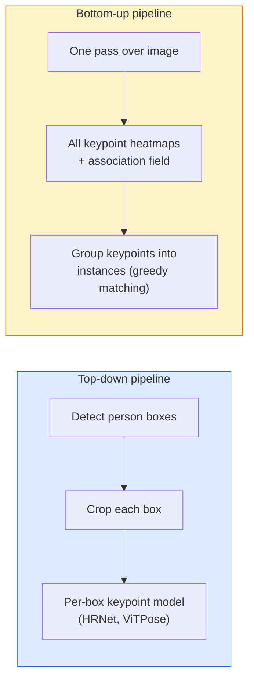

# 关键点检测与姿态估计

> 姿态是一组有序的关键点。关键点检测器是一个热图回归器。其余都是辅助工作。

**Type:** Build
**Languages:** Python
**Prerequisites:** Phase 4 Lesson 06(检测)、Phase 4 Lesson 07(U-Net)
**Time:** ~45 分钟

## 学习目标

- 区分自顶向下与自底向上的姿态估计,并说明各自的使用场景
- 以每个关键点一个高斯目标的方式回归 K 个关键点的热图,并在推理时提取关键点坐标
- 解释部件亲和场(PAF)以及自底向上流程如何将关键点关联成实例
- 使用 MediaPipe Pose 或 MMPose 进行生产级关键点估计,并理解其输出格式

## 问题所在

关键点任务以许多名字出现:人体姿态(17 个身体关节)、人脸关键点(68 或 478 个点)、手部(21 个点)、动物姿态、机器人物体位姿、医学解剖标志点。它们都共享同一结构:检测物体上的 K 个离散点并输出其 (x, y) 坐标。

姿态估计是动作捕捉、健身应用、体育分析、手势控制、动画、AR 试穿和机器人抓取的基础。2D 情形已经成熟;3D 姿态(从单个相机估计世界坐标系中的关节位置)是当前的研究前沿。

工程问题在于规模。单图单人姿态是一个 20ms 的问题。30 fps 下拥挤场景中的多人姿态则是一个不同的问题,需要不同的架构。

## 核心概念

### 自顶向下 vs 自底向上



- **自顶向下** — 先检测人,然后对每个裁剪区域运行逐人关键点模型。精度最高;随人数线性扩展。
- **自底向上** — 一次前向传播预测所有关键点加一个关联场;然后分组。耗时与人群规模无关,恒定不变。

自顶向下(HRNet、ViTPose)是精度领先者;自底向上(OpenPose、HigherHRNet)是拥挤场景的吞吐量领先者。

### 热图回归

不直接回归 `(x, y)`,而是为每个关键点预测一个 `H x W` 热图,以高斯斑点为中心置于真实位置。

```
target[k, y, x] = exp(-((x - cx_k)^2 + (y - cy_k)^2) / (2 sigma^2))
```

推理时,每个热图的 argmax 就是预测的关键点位置。

为什么热图比直接回归更好:网络的空间结构(卷积特征图)自然地与空间输出对齐。高斯目标还起到正则化作用——小的定位误差产生小的损失,而不是零。

### 亚像素定位

argmax 给出整数坐标。为了亚像素精度,可以通过对 argmax 及其邻近点拟合抛物线来细化,或使用著名的偏移方向 `(dx, dy) = 0.25 * (heatmap[y, x+1] - heatmap[y, x-1], ...)`。

### 部件亲和场(PAF)

OpenPose 用于自底向上关联的技巧。对每对相连的关键点(如左肩到左肘),预测一个 2 通道场,编码从一端指向另一端的单位向量。要将肩与肘关联,沿连接候选对的直线对 PAF 求积分;积分最高的对被匹配。

```
For each connection (limb):
  PAF channels: 2 (unit vector x, y)
  Line integral: sum over sample points of (PAF . line_direction)
  Higher integral = stronger match
```

优雅且可扩展到任意规模的人群,无需逐人裁剪。

### COCO 关键点

标准人体姿态数据集:每人 17 个关键点,以 PCK(正确关键点百分比)和 OKS(目标关键点相似度)为指标。OKS 是关键点版的 IoU,COCO mAP@OKS 报告的就是它。

### 2D vs 3D

- **2D 姿态** — 图像坐标;已达到生产级质量(MediaPipe、HRNet、ViTPose)。
- **3D 姿态** — 世界 / 相机坐标;仍是活跃的研究领域。常见方法:
  - 用小型 MLP 将 2D 预测提升到 3D(VideoPose3D)。
  - 从图像直接进行 3D 回归(PyMAF、MHFormer)。
  - 多视角设置(CMU Panoptic)用于获取真值。

```figure
cv3-pose-heatmap
```

## 动手实现

### 步骤 1:高斯热图目标

```python
import numpy as np
import torch

def gaussian_heatmap(size, cx, cy, sigma=2.0):
    yy, xx = np.meshgrid(np.arange(size), np.arange(size), indexing="ij")
    return np.exp(-((xx - cx) ** 2 + (yy - cy) ** 2) / (2 * sigma ** 2)).astype(np.float32)

hm = gaussian_heatmap(64, 32, 32, sigma=2.0)
print(f"peak: {hm.max():.3f} at ({hm.argmax() % 64}, {hm.argmax() // 64})")
```

沿通道轴堆叠每个关键点的热图,得到完整的目标张量。

### 步骤 2:小型关键点头

一个输出 K 个热图通道的 U-Net 风格模型。

```python
import torch.nn as nn
import torch.nn.functional as F

class TinyKeypointNet(nn.Module):
    def __init__(self, num_keypoints=4, base=16):
        super().__init__()
        self.down1 = nn.Sequential(nn.Conv2d(3, base, 3, 2, 1), nn.ReLU(inplace=True))
        self.down2 = nn.Sequential(nn.Conv2d(base, base * 2, 3, 2, 1), nn.ReLU(inplace=True))
        self.mid = nn.Sequential(nn.Conv2d(base * 2, base * 2, 3, 1, 1), nn.ReLU(inplace=True))
        self.up1 = nn.ConvTranspose2d(base * 2, base, 2, 2)
        self.up2 = nn.ConvTranspose2d(base, num_keypoints, 2, 2)

    def forward(self, x):
        h1 = self.down1(x)
        h2 = self.down2(h1)
        h3 = self.mid(h2)
        u1 = self.up1(h3)
        return self.up2(u1)
```

输入 `(N, 3, H, W)`,输出 `(N, K, H, W)`。损失是对高斯目标的逐像素 MSE。

### 步骤 3:推理 — 提取关键点坐标

```python
def heatmap_to_coords(heatmaps):
    """
    heatmaps: (N, K, H, W)
    returns:  (N, K, 2) float coordinates in image pixels
    """
    N, K, H, W = heatmaps.shape
    hm = heatmaps.reshape(N, K, -1)
    idx = hm.argmax(dim=-1)
    ys = (idx // W).float()
    xs = (idx % W).float()
    return torch.stack([xs, ys], dim=-1)

coords = heatmap_to_coords(torch.randn(2, 4, 32, 32))
print(f"coords: {coords.shape}")  # (2, 4, 2)
```

推理只需一行。要亚像素细化,可在 argmax 附近进行插值。

### 步骤 4:合成关键点数据集

简单方案:在白色画布上画四个点,学习预测它们。

```python
def make_synthetic_sample(size=64):
    img = np.ones((3, size, size), dtype=np.float32)
    rng = np.random.default_rng()
    kps = rng.integers(8, size - 8, size=(4, 2))
    for cx, cy in kps:
        img[:, cy - 2:cy + 2, cx - 2:cx + 2] = 0.0
    hms = np.stack([gaussian_heatmap(size, cx, cy) for cx, cy in kps])
    return img, hms, kps
```

足够简单,小型模型一分钟能学会。

### 步骤 5:训练

```python
model = TinyKeypointNet(num_keypoints=4)
opt = torch.optim.Adam(model.parameters(), lr=3e-3)

for step in range(200):
    batch = [make_synthetic_sample() for _ in range(16)]
    imgs = torch.from_numpy(np.stack([b[0] for b in batch]))
    hms = torch.from_numpy(np.stack([b[1] for b in batch]))
    pred = model(imgs)
    # Upsample pred to full resolution
    pred = F.interpolate(pred, size=hms.shape[-2:], mode="bilinear", align_corners=False)
    loss = F.mse_loss(pred, hms)
    opt.zero_grad(); loss.backward(); opt.step()
```

## 实际应用

- **MediaPipe Pose** — Google 的生产级姿态估计器;附带 WebGL 和移动端运行时,延迟低于 10ms。
- **MMPose**(OpenMMLab)— 全面的研究代码库;包含所有 SOTA 架构及预训练权重。
- **YOLOv8-pose** — 单次前向传播下最快的实时多人姿态估计。
- **transformers HumanDPT / PoseAnything** — 用于开放词表姿态(任意物体、任意关键点集合)的更新的视觉-语言方法。

## 上线部署

本课产出:

- `outputs/prompt-pose-stack-picker.md` — 一个提示词,根据延迟、人群规模和 2D vs 3D 需求在 MediaPipe / YOLOv8-pose / HRNet / ViTPose 之间做出选择。
- `outputs/skill-heatmap-to-coords.md` — 一个技能,编写每个生产级姿态模型都用到的亚像素热图转坐标例程。

## 练习

1. **(简单)** 在合成 4 点数据集上训练小型关键点模型。报告 200 步后预测关键点与真实关键点之间的平均 L2 误差。
2. **(中等)** 添加亚像素细化:给定 argmax 位置,从邻近像素沿 x 和 y 拟合 1D 抛物线。报告相对整数 argmax 的精度提升。
3. **(困难)** 构建一个两人合成数据集,每张图显示两个 4 关键点模式的实例。训练一个带 PAF 的自底向上流程,预测哪个关键点属于哪个实例,并用 OKS 评估。

## 关键术语

| 术语 | 人们怎么说 | 实际含义 |
|------|----------------------|------|
| 关键点 | "一个标志点" | 物体上特定的有序点(关节、角点、特征) |
| 姿态 | "骨架" | 属于同一实例的一组有序关键点 |
| 自顶向下 | "先检测再姿态" | 两阶段流程:行人检测器 + 逐裁剪关键点模型;精度最高 |
| 自底向上 | "先姿态后分组" | 单次传播预测全部关键点 + 分组;耗时与人群规模无关 |
| 热图 | "高斯目标" | 每个关键点一个 H x W 张量,峰值位于真实位置;首选的回归目标 |
| PAF | "部件亲和场" | 编码肢体方向的 2 通道单位向量场;用于将关键点分组为实例 |
| OKS | "关键点 IoU" | 目标关键点相似度;COCO 的姿态指标 |
| HRNet | "高分辨率网络" | 占主导地位的自顶向下关键点架构;全程保留高分辨率特征 |

## 延伸阅读

- [OpenPose (Cao et al., 2017)](https://arxiv.org/abs/1812.08008) — 带 PAF 的自底向上方法;仍是该方法最好的阐述
- [HRNet (Sun et al., 2019)](https://arxiv.org/abs/1902.09212) — 自顶向下的参考架构
- [ViTPose (Xu et al., 2022)](https://arxiv.org/abs/2204.12484) — 普通 ViT 作为姿态骨干;在许多基准上仍是 SOTA
- [MediaPipe Pose](https://developers.google.com/mediapipe/solutions/vision/pose_landmarker) — 生产级实时姿态;2026 年部署最快的栈