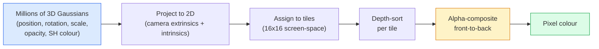

# 从零实现 3D Gaussian Splatting

> 一个场景是数百万个 3D 高斯函数构成的点云。每个高斯有位置、朝向、尺度、不透明度,以及随观察方向变化的颜色。对它们进行光栅化,对光栅化过程反向传播,就完成了。

**Type:** Build
**Languages:** Python
**Prerequisites:** Phase 4 Lesson 13(3D 视觉与 NeRF)、Phase 1 Lesson 12(张量运算)、Phase 4 Lesson 10(扩散模型基础,可选)
**Time:** ~90 分钟

## 学习目标

- 解释为什么到 2026 年,3D Gaussian Splatting 已取代 NeRF,成为照片级真实感 3D 重建的生产默认方案
- 说出每个高斯的六个参数(位置、旋转四元数、尺度、不透明度、球谐颜色、可选特征),以及每个参数贡献多少个浮点数
- 使用 `alpha` 合成从零实现一个 2D Gaussian splatting 光栅化器,然后展示 3D 情形如何投影到同样的循环
- 使用 `nerfstudio`、`gsplat` 或 `SuperSplat` 从 20-50 张照片重建场景,并导出为 `KHR_gaussian_splatting` glTF 扩展或 OpenUSD 26.03 的 `UsdVolParticleField3DGaussianSplat` schema

## 问题所在

NeRF 把一个场景存储为 MLP 的权重。每个渲染出来的像素需要沿一条光线进行数百次 MLP 查询。训练要花数小时,渲染要花数秒,而且权重无法编辑——如果你想移动场景里的一把椅子,就得重新训练。

3D Gaussian Splatting(Kerbl, Kopanas, Leimkühler, Drettakis,SIGGRAPH 2023)取代了这一切。一个场景是一组显式的 3D 高斯。渲染是在 GPU 上以 100+ fps 进行光栅化。训练只需几分钟。编辑是直接的:平移一部分高斯,椅子就被移动了。到 2026 年,Khronos Group 已批准了用于 Gaussian splats 的 glTF 扩展,OpenUSD 26.03 内置了 Gaussian splat schema,Zillow 和 Apartments.com 用它渲染房产,而且大多数新的 3D 重建研究论文都是核心 3DGS 思想的变体。

心智模型很简单,但数学中有很多环节,以至于大多数入门材料从光栅化讲起,跳过了投影和球谐函数。本课构建完整的系统——先做 2D 版本,再做 3D 扩展。

## 核心概念

### 一个高斯携带什么

一个 3D 高斯是空间中一个参数化的团块,具有以下属性:

```
position         mu         (3,)    centre in world coordinates
rotation         q          (4,)    unit quaternion encoding orientation
scale            s          (3,)    log-scales per axis (exponentiated at render time)
opacity          alpha      (1,)    post-sigmoid opacity [0, 1]
SH coefficients  c_lm       (3 * (L+1)^2,)   view-dependent colour
```

旋转 + 尺度构成一个 3x3 协方差矩阵:`Sigma = R S S^T R^T`。这就是高斯在 3D 中的形状。球谐函数使颜色随观察方向变化——镜面高光、细微光泽、视角相关的光晕——而无需存储每个视角的纹理。SH 阶数为 3 时,每个颜色通道有 16 个系数,每个高斯仅颜色就需要 48 个浮点数。

一个场景通常有 100 万到 500 万个高斯。每个高斯大约存储 60 个浮点数(3 + 4 + 3 + 1 + 48 + 杂项)。500 万个高斯的场景是 240 MB——远小于带逐点纹理的等效点云,也比以高分辨率重渲染的 NeRF MLP 权重小一个数量级。

### 光栅化,而非光线步进



五个步骤,全部对 GPU 友好。无需对每个像素做 MLP 查询。单块 RTX 3080 Ti 能以 147 fps 渲染 600 万个 splats。

### 投影步骤

位于世界坐标 `mu`、3D 协方差为 `Sigma` 的 3D 高斯,投影为屏幕位置 `mu'`、2D 协方差为 `Sigma'` 的 2D 高斯:

```
mu' = project(mu)
Sigma' = J W Sigma W^T J^T          (2 x 2)

W = viewing transform (rotation + translation of camera)
J = Jacobian of the perspective projection at mu'
```

2D 高斯的覆盖范围是一个椭圆,其轴是 `Sigma'` 的特征向量。椭圆内的每个像素都接收该高斯的贡献,权重为 `exp(-0.5 * (p - mu')^T Sigma'^-1 (p - mu'))`。

### Alpha 合成规则

对于一个像素,覆盖它的那些高斯按由后到前排序(或等价地由前到后,公式取逆)。颜色的合成与 20 世纪 80 年代以来所有半透明光栅化器使用的方程相同:

```
C_pixel = sum_i alpha_i * T_i * c_i

T_i = prod_{j < i} (1 - alpha_j)       transmittance up to i
alpha_i = opacity_i * exp(-0.5 * d^T Sigma'^-1 d)   local contribution
c_i = eval_SH(SH_i, view_direction)    view-dependent colour
```

这**与 NeRF 体渲染的方程相同**,只是作用在一组显式的稀疏高斯上,而不是沿光线的密集采样上。这一恒等性正是渲染质量能媲美 NeRF 的原因——两者都在对同一个辐射场方程做积分。

### 为什么这是可微的

每一步——投影、tile 分配、alpha 合成、SH 求值——都关于高斯参数可微。给定真值图像,计算渲染像素损失,对光栅化器反向传播,用梯度下降更新所有 `(mu, q, s, alpha, c_lm)`。经过约 30,000 次迭代,高斯会找到它们合适的位置、尺度和颜色。

### 致密化与剪枝

固定数量的高斯无法覆盖复杂场景。训练包含两个自适应机制:

- 当一个高斯的梯度幅值较高但尺度较小时,**克隆**它——此处重建需要更多细节。
- 当一个大尺度高斯的梯度较高时,将其**分裂**为两个更小的高斯——一个大的高斯太平滑,拟合不了该区域。
- **剪枝**不透明度低于阈值的高斯——它们没有贡献。

致密化每 N 次迭代运行一次。一个场景通常从约 10 万个初始高斯(由 SfM 点初始化)增长到训练结束时的 100 万-500 万个。

### 一段话讲清球谐函数

视角相关的颜色是单位球面上的函数 `c(direction)`。球谐函数是球面上的傅里叶基。在阶数 `L` 处截断,每个通道得到 `(L+1)^2` 个基函数。为新视角求颜色,就是把学到的 SH 系数与在观察方向处求值的基做点积。阶 0 = 一个系数 = 恒定颜色。阶 3 = 16 个系数 = 足以捕捉 Lambertian 着色、镜面高光和轻微反射。SD Gaussian Splatting 论文默认使用阶 3。

### 2026 年的生产技术栈

```
1. Capture         smartphone / DJI drone / handheld scanner
2. SfM / MVS       COLMAP or GLOMAP derives camera poses + sparse points
3. Train 3DGS      nerfstudio / gsplat / inria official / PostShot (~10-30 min on RTX 4090)
4. Edit            SuperSplat / SplatForge (clean floaters, segment)
5. Export          .ply -> glTF KHR_gaussian_splatting or .usd (OpenUSD 26.03)
6. View            Cesium / Unreal / Babylon.js / Three.js / Vision Pro
```

### 4D 与生成式变体

- **4D Gaussian Splatting** —— 高斯是时间的函数;用于体视频(Superman 2026,A$AP Rocky 的 "Helicopter")。
- **生成式 splats** —— 文本生成 splat 的模型(World Labs 的 Marble),可以凭空生成整个场景。
- **3D Gaussian Unscented Transform** —— NVIDIA NuRec 用于自动驾驶仿真的变体。

```figure
cv3-gaussian-splat
```

## 动手实现

### 第 1 步:一个 2D 高斯

我们先构建一个 2D 光栅化器。3D 情形在投影之后可归结为它。

```python
import torch
import torch.nn as nn
import torch.nn.functional as F


def eval_2d_gaussian(means, covs, points):
    """
    means:  (G, 2)      centres
    covs:   (G, 2, 2)   covariance matrices
    points: (H, W, 2)   pixel coordinates
    returns: (G, H, W)  density at every pixel for every Gaussian
    """
    G = means.size(0)
    H, W, _ = points.shape
    flat = points.view(-1, 2)
    inv = torch.linalg.inv(covs)
    diff = flat[None, :, :] - means[:, None, :]
    d = torch.einsum("gpi,gij,gpj->gp", diff, inv, diff)
    density = torch.exp(-0.5 * d)
    return density.view(G, H, W)
```

`einsum` 为每一对(高斯, 像素)计算二次型 `diff^T Sigma^-1 diff`。

### 第 2 步:2D splatting 光栅化器

由前到后的 alpha 合成。2D 中深度没有意义,所以我们用一个学到的逐高斯标量来决定顺序。

```python
def rasterise_2d(means, covs, colours, opacities, depths, image_size):
    """
    means:     (G, 2)
    covs:      (G, 2, 2)
    colours:   (G, 3)
    opacities: (G,)     in [0, 1]
    depths:    (G,)     per-Gaussian scalar used for ordering
    image_size: (H, W)
    returns:   (H, W, 3) rendered image
    """
    H, W = image_size
    yy, xx = torch.meshgrid(
        torch.arange(H, dtype=torch.float32, device=means.device),
        torch.arange(W, dtype=torch.float32, device=means.device),
        indexing="ij",
    )
    points = torch.stack([xx, yy], dim=-1)

    densities = eval_2d_gaussian(means, covs, points)
    alphas = opacities[:, None, None] * densities
    alphas = alphas.clamp(0.0, 0.99)

    order = torch.argsort(depths)
    alphas = alphas[order]
    colours_sorted = colours[order]

    T = torch.ones(H, W, device=means.device)
    out = torch.zeros(H, W, 3, device=means.device)
    for i in range(means.size(0)):
        a = alphas[i]
        out += (T * a)[..., None] * colours_sorted[i][None, None, :]
        T = T * (1.0 - a)
    return out
```

不快——真正的实现使用基于 tile 的 CUDA kernel——但数学完全正确,而且完全可微。

### 第 3 步:一个可训练的 2D splat 场景

```python
class Splats2D(nn.Module):
    def __init__(self, num_splats=128, image_size=64, seed=0):
        super().__init__()
        g = torch.Generator().manual_seed(seed)
        H, W = image_size, image_size
        self.means = nn.Parameter(torch.rand(num_splats, 2, generator=g) * torch.tensor([W, H]))
        self.log_scale = nn.Parameter(torch.ones(num_splats, 2) * math.log(2.0))
        self.rot = nn.Parameter(torch.zeros(num_splats))  # single angle in 2D
        self.colour_logits = nn.Parameter(torch.randn(num_splats, 3, generator=g) * 0.5)
        self.opacity_logit = nn.Parameter(torch.zeros(num_splats))
        self.depth = nn.Parameter(torch.rand(num_splats, generator=g))

    def covs(self):
        s = torch.exp(self.log_scale)
        c, si = torch.cos(self.rot), torch.sin(self.rot)
        R = torch.stack([
            torch.stack([c, -si], dim=-1),
            torch.stack([si, c], dim=-1),
        ], dim=-2)
        S = torch.diag_embed(s ** 2)
        return R @ S @ R.transpose(-1, -2)

    def forward(self, image_size):
        covs = self.covs()
        colours = torch.sigmoid(self.colour_logits)
        opacities = torch.sigmoid(self.opacity_logit)
        return rasterise_2d(self.means, covs, colours, opacities, self.depth, image_size)
```

`log_scale`、`opacity_logit` 和 `colour_logits` 都是无约束参数,在渲染时通过合适的激活函数映射。这是所有 3DGS 实现的标准模式。

### 第 4 步:把 2D 高斯拟合到目标图像

```python
import math
import numpy as np

def make_target(size=64):
    yy, xx = np.meshgrid(np.arange(size), np.arange(size), indexing="ij")
    img = np.zeros((size, size, 3), dtype=np.float32)
    # Red circle
    mask = (xx - 20) ** 2 + (yy - 20) ** 2 < 10 ** 2
    img[mask] = [1.0, 0.2, 0.2]
    # Blue square
    mask = (np.abs(xx - 45) < 8) & (np.abs(yy - 40) < 8)
    img[mask] = [0.2, 0.3, 1.0]
    return torch.from_numpy(img)


target = make_target(64)
model = Splats2D(num_splats=64, image_size=64)
opt = torch.optim.Adam(model.parameters(), lr=0.05)

for step in range(200):
    pred = model((64, 64))
    loss = F.mse_loss(pred, target)
    opt.zero_grad(); loss.backward(); opt.step()
    if step % 40 == 0:
        print(f"step {step:3d}  mse {loss.item():.4f}")
```

200 步之后,64 个高斯收敛到两个形状。这就是全部思想——对显式几何基元做梯度下降。

### 第 5 步:从 2D 到 3D

3D 扩展保持同样的循环。新增的内容:

1. 每个高斯的旋转是四元数,而非单个角度。
2. 协方差为 `R S S^T R^T`,其中 `R` 由四元数构成,`S = diag(exp(log_scale))` 为尺度。
3. 投影 `(mu, Sigma) -> (mu', Sigma')` 使用相机外参以及透视投影在 `mu` 处的雅可比矩阵。
4. 颜色变为球谐展开;在观察方向处求值。
5. 深度排序使用真实的相机空间 z,而非学到的标量。

每个生产实现(`gsplat`、`inria/gaussian-splatting`、`nerfstudio`)都在 GPU 上用基于 tile 的 CUDA kernel 做这些。

### 第 6 步:球谐函数求值

阶数不超过 3 的 SH 基在每个通道有 16 项。求值:

```python
def eval_sh_degree_3(sh_coeffs, dirs):
    """
    sh_coeffs: (..., 16, 3)   last dim is RGB channels
    dirs:      (..., 3)       unit vectors
    returns:   (..., 3)
    """
    C0 = 0.282094791773878
    C1 = 0.488602511902920
    C2 = [1.092548430592079, 1.092548430592079,
          0.315391565252520, 1.092548430592079,
          0.546274215296039]
    x, y, z = dirs[..., 0], dirs[..., 1], dirs[..., 2]
    x2, y2, z2 = x * x, y * y, z * z
    xy, yz, xz = x * y, y * z, x * z

    result = C0 * sh_coeffs[..., 0, :]
    result = result - C1 * y[..., None] * sh_coeffs[..., 1, :]
    result = result + C1 * z[..., None] * sh_coeffs[..., 2, :]
    result = result - C1 * x[..., None] * sh_coeffs[..., 3, :]

    result = result + C2[0] * xy[..., None] * sh_coeffs[..., 4, :]
    result = result + C2[1] * yz[..., None] * sh_coeffs[..., 5, :]
    result = result + C2[2] * (2.0 * z2 - x2 - y2)[..., None] * sh_coeffs[..., 6, :]
    result = result + C2[3] * xz[..., None] * sh_coeffs[..., 7, :]
    result = result + C2[4] * (x2 - y2)[..., None] * sh_coeffs[..., 8, :]

    # degree 3 terms omitted here for brevity; full 16-coefficient version in the code file
    return result
```

学到的 `sh_coeffs` 存储该高斯在"每个方向上的颜色"。渲染时,你针对当前观察方向求值,得到一个 3 维 RGB 向量。

## 使用它

做真正的 3DGS 工作时,使用 `gsplat`(Meta)或 `nerfstudio`:

```bash
pip install nerfstudio gsplat
ns-download-data example
ns-train splatfacto --data path/to/data
```

`splatfacto` 是 nerfstudio 的 3DGS 训练器。在 RTX 4090 上,一个典型场景的运行需要 10-30 分钟。

2026 年重要的导出选项:

- `.ply` —— 原始高斯点云(可移植,文件最大)。
- `.splat` —— PlayCanvas / SuperSplat 量化格式。
- glTF `KHR_gaussian_splatting` —— Khronos 标准,跨查看器可移植(2026 年 2 月 RC)。
- OpenUSD `UsdVolParticleField3DGaussianSplat` —— USD 原生,面向 NVIDIA Omniverse 和 Vision Pro 流水线。

对于 4D / 动态场景,`4DGS` 和 `Deformable-3DGS` 用随时间变化的均值和不透明度扩展了同一套机制。

## 发布它

本课产出:

- `outputs/prompt-3dgs-capture-planner.md` —— 一个针对给定场景类型规划采集流程(照片数量、相机路径、光照)的 prompt。
- `outputs/skill-3dgs-export-router.md` —— 一个根据下游查看器或引擎选择正确导出格式(`.ply` / `.splat` / glTF / USD)的 skill。

## 练习

1. **(简单)** 在另一张合成图像上运行上面的 2D splat 训练器。在 `[16, 64, 256]` 中改变 `num_splats`,并为每个取值绘制 MSE 随步数的变化曲线。找出收益递减的临界点。
2. **(中等)** 扩展 2D 光栅化器,使其支持通过 2 阶谐函数依赖标量"视角"的逐高斯 RGB 颜色。在一对目标图像上训练,并验证模型能同时重建两者。
3. **(困难)** 克隆 `nerfstudio`,并用你自己任意场景(桌面、植物、人脸、房间)的 20 张照片训练 `splatfacto`。导出为 glTF `KHR_gaussian_splatting`,并在查看器中打开(Three.js `GaussianSplats3D`、SuperSplat、Babylon.js V9)。报告训练时间、高斯数量和渲染 fps。

## 关键术语

| 术语 | 人们怎么说 | 实际含义 |
|------|----------------|----------------------|
| 3DGS | "Gaussian splats" | 以数百万个 3D 高斯表示的显式场景,每个高斯有位置、旋转、尺度、不透明度、SH 颜色 |
| 协方差 | "高斯的形状" | `Sigma = R S S^T R^T`;单个高斯的朝向与各向异性尺度 |
| Alpha 合成 | "由后到前的混合" | 与 NeRF 体渲染相同的方程,只是作用在显式稀疏集合上 |
| 致密化 | "克隆与分裂" | 在重建欠拟合之处自适应地添加新高斯 |
| 剪枝 | "删除低不透明度的" | 移除训练期间不透明度坍缩到接近零的高斯 |
| 球谐函数 | "视角相关的颜色" | 球面上的傅里叶基;将颜色存储为观察方向的函数 |
| Splatfacto | "nerfstudio 的 3DGS" | 2026 年训练 3DGS 最简单的途径 |
| `KHR_gaussian_splatting` | "glTF 标准" | Khronos 2026 扩展,使 3DGS 可跨查看器和引擎移植 |

## 延伸阅读

- [3D Gaussian Splatting for Real-Time Radiance Field Rendering(Kerbl 等,SIGGRAPH 2023)](https://repo-sam.inria.fr/fungraph/3d-gaussian-splatting/) —— 原始论文
- [gsplat(Meta/nerfstudio)](https://github.com/nerfstudio-project/gsplat) —— 生产级 CUDA 光栅化器
- [nerfstudio Splatfacto](https://docs.nerf.studio/nerfology/methods/splat.html) —— 参考训练配方
- [Khronos KHR_gaussian_splatting 扩展](https://github.com/KhronosGroup/glTF/blob/main/extensions/2.0/Khronos/KHR_gaussian_splatting/README.md) —— 2026 年的可移植格式
- [OpenUSD 26.03 发布说明](https://openusd.org/release/) —— `UsdVolParticleField3DGaussianSplat` schema
- [THE FUTURE 3D State of Gaussian Splatting 2026](https://www.thefuture3d.com/blog-0/2026/4/4/state-of-gaussian-splatting-2026) —— 行业综述