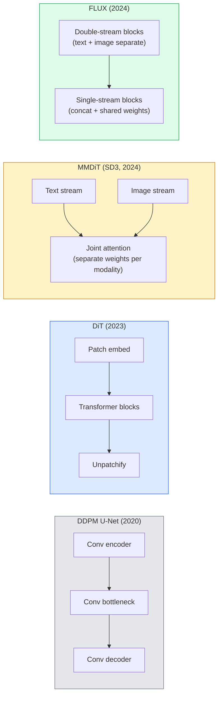

# 扩散 Transformer 与 Rectified Flow

> U-Net 并不是扩散模型的秘密。把它换成 Transformer,把噪声调度换成直线路径的流,你就突然得到了 SD3、FLUX 以及 2026 年所有的文生图模型。

**Type:** Learn + Build
**Languages:** Python
**Prerequisites:** Phase 4 Lesson 10 (Diffusion DDPM)、Phase 4 Lesson 14 (ViT)、Phase 7 Lesson 02 (Self-Attention)
**Time:** ~75 分钟

## 学习目标

- 梳理从 U-Net DDPM(Lesson 10)到 Diffusion Transformer(DiT)、MMDiT(SD3)以及单流+双流 DiT(FLUX)的演进
- 解释 rectified flow:为什么噪声与数据之间的直线路径能让模型用 20 步而不是 1000 步采样
- 实现一个微型 DiT 块和一个 rectified-flow 训练循环,两者都不超过 100 行
- 按架构、参数量和许可证区分模型变体(SD3、FLUX.1-dev、FLUX.1-schnell、Z-Image、Qwen-Image)

## 问题所在

Lesson 10 用 U-Net 去噪器构建了一个 DDPM。这一配方主导了 2020-2023 年:U-Net + beta 调度 + 噪声预测损失。它催生了 Stable Diffusion 1.5 和 2.1 以及 DALL-E 2。

2026 年每一个最先进的文生图模型都已经超越了它。Stable Diffusion 3、FLUX、SD4、Z-Image、Qwen-Image、Hunyuan-Image——没有一个使用 U-Net。它们使用 Diffusion Transformer(DiT)。SD3 和 FLUX 还把 DDPM 噪声调度换成了 rectified flow,它拉直了从噪声到数据的路径,并使一致性模型或蒸馏变体能够进行 1-4 步推理。

这一转变之所以重要,是因为它正是基于扩散的图像生成变得可控、提示词精确(SD3/SD4 解决了文字渲染)、且达到生产级速度的原因。理解 DiT + rectified flow,就是理解 2026 年的生成式图像技术栈。

## 核心概念

### 从 U-Net 到 Transformer



- **DiT**(Peebles & Xie, 2023)——用类似 ViT 的 Transformer 在 latent patch 上替代 U-Net。通过 adaptive layer norm(AdaLN)进行条件注入。
- **MMDiT**(SD3,Esser et al., 2024)——双流结构,文本与图像 token 使用独立权重,共享联合注意力。
- **FLUX**(Black Forest Labs, 2024)——前 N 个块像 SD3 一样采用双流,后面的块拼接并共享权重(单流),以便在更深层数下保持高效。
- **Z-Image**(2025)——一个 6B 参数的高效单流 DiT,挑战“不惜一切代价堆规模”的思路。

### 一段话讲清 Rectified Flow

DDPM 将前向过程定义为一个带噪 SDE,其中 `x_t` 被逐步腐蚀。学习到的反向过程是另一个 SDE,需要 1000 个小步求解。

Rectified flow 定义了干净数据与纯噪声之间的**直线**插值:

```
x_t = (1 - t) * x_0 + t * epsilon,     t in [0, 1]
```

训练一个网络来预测速度 `v_theta(x_t, t) = epsilon - x_0`——即沿从干净数据到噪声的直线路径的前向方向(`dx_t/dt`)。采样时,将这个速度反向积分,从噪声逐步走向数据。得到的 ODE 非常接近直线,因此采样所需的积分步数少得多。

SD3 将其称为 **Rectified Flow Matching**。FLUX、Z-Image 以及大多数 2026 年的模型都使用同一目标。典型推理:20-30 个 Euler 步(确定性)对比旧 DDPM 时代的 50+ 个 DDIM 步。蒸馏 / turbo / schnell / LCM 变体可以降到 1-4 步。

### AdaLN 条件注入

DiT 通过 **adaptive layer norm** 对时间步和类别/文本进行条件注入:从条件向量预测 `scale` 和 `shift`,并在 LayerNorm 之后应用。这比 U-Net 中 FiLM 式的调制干净得多,也是所有现代 DiT 的默认做法。

```
cond -> MLP -> (scale, shift, gate)
norm(x) * (1 + scale) + shift, then residual add * gate
```

### SD3 与 FLUX 中的文本编码器

- **SD3** 使用三个文本编码器:两个 CLIP 模型 + T5-XXL。嵌入拼接后作为文本条件输入图像流。
- **FLUX** 使用一个 CLIP-L + T5-XXL。
- **Qwen-Image / Z-Image** 变体使用与各自基础 LLM 对齐的自研文本编码器。

文本编码器是 SD3/FLUX 对提示词的推理能力远超 SD1.5 的重要原因。仅 T5-XXL 就有 4.7B 参数。

### Classifier-free guidance 依然适用

Rectified flow 改变的是采样器,而不是条件注入。Classifier-free guidance(训练时以 10% 概率丢弃文本,推理时混合条件与无条件预测)在 rectified flow 中完全同样有效。大多数 2026 年的模型使用 3.5-5 的 guidance scale——低于 SD1.5 的 7.5,因为 rectified-flow 模型默认就更紧地遵循提示词。

### Consistency、Turbo、Schnell、LCM

四个名字,同一个想法:把慢的多步模型蒸馏成快的少步模型。

- **LCM (Latent Consistency Model)**——训练一个学生模型,能从任意中间的 `x_t` 一步预测最终的 `x_0`。
- **SDXL Turbo / FLUX schnell**——通过对抗扩散蒸馏训练的 1-4 步模型。
- **SD Turbo**——OpenAI 风格的 Consistency Models 适配到 latent diffusion。

任何新模型的生产级服务都会同时提供“全质量”checkpoint 和“turbo / schnell”变体。Schnell(德语“快”,Black Forest Labs 的命名惯例)以 1-4 步运行,适合实时管线。

### 2026 年的模型版图

| 模型 | 规模 | 架构 | 许可证 |
|-------|------|--------------|---------|
| Stable Diffusion 3 Medium | 2B | MMDiT | SAI Community |
| Stable Diffusion 3.5 Large | 8B | MMDiT | SAI Community |
| FLUX.1-dev | 12B | 双流 + 单流 DiT | 非商用 |
| FLUX.1-schnell | 12B | 同上,已蒸馏 | Apache 2.0 |
| FLUX.2 | — | FLUX.1 的迭代 | 混合 |
| Z-Image | 6B | S3-DiT (Scalable Single-Stream) | 宽松 |
| Qwen-Image | ~20B | DiT + Qwen 文本塔 | Apache 2.0 |
| Hunyuan-Image-3.0 | ~80B | DiT | 研究用途 |
| SD4 Turbo | 3B | DiT + 蒸馏 | SAI Commercial |

FLUX.1-schnell 是 2026 年的开源默认选择。Z-Image 是效率标杆。FLUX.2 和 SD4 是当前的质量天花板。

### 为什么这一范式转变重要

DDPM + U-Net 有效。DiT + rectified flow **效果更好、速度更快、扩展更干净**。这一转变类似于 NLP 中从 RNN 到 Transformer 的转变:两种架构解决的是同一个问题,但 Transformer 能扩展,如今占据主导。2026 年每篇关于图像、视频或 3D 生成的论文都使用 DiT 形状的去噪器,通常还搭配 rectified flow 目标。U-Net DDPM 如今主要是教学用途(Lesson 10)。

```figure
cv3-rectified-flow
```

## 动手实现

### 第 1 步:带 AdaLN 的 DiT 块

```python
import torch
import torch.nn as nn


class AdaLNZero(nn.Module):
    """
    Adaptive LayerNorm with a gate. Predicts (scale, shift, gate) from the conditioning.
    Init such that the whole block starts as identity ("zero init").
    """

    def __init__(self, dim, cond_dim):
        super().__init__()
        self.norm = nn.LayerNorm(dim, elementwise_affine=False)
        self.mlp = nn.Linear(cond_dim, dim * 3)
        nn.init.zeros_(self.mlp.weight)
        nn.init.zeros_(self.mlp.bias)

    def forward(self, x, cond):
        scale, shift, gate = self.mlp(cond).chunk(3, dim=-1)
        h = self.norm(x) * (1 + scale.unsqueeze(1)) + shift.unsqueeze(1)
        return h, gate.unsqueeze(1)


class DiTBlock(nn.Module):
    def __init__(self, dim=192, heads=3, mlp_ratio=4, cond_dim=192):
        super().__init__()
        self.adaln1 = AdaLNZero(dim, cond_dim)
        self.attn = nn.MultiheadAttention(dim, heads, batch_first=True)
        self.adaln2 = AdaLNZero(dim, cond_dim)
        self.mlp = nn.Sequential(
            nn.Linear(dim, dim * mlp_ratio),
            nn.GELU(),
            nn.Linear(dim * mlp_ratio, dim),
        )

    def forward(self, x, cond):
        h, gate1 = self.adaln1(x, cond)
        a, _ = self.attn(h, h, h, need_weights=False)
        x = x + gate1 * a
        h, gate2 = self.adaln2(x, cond)
        x = x + gate2 * self.mlp(h)
        return x
```

`AdaLNZero` 初始为恒等映射,因为其 MLP 权重被初始化为零。训练会将该块从恒等映射推开;这能极大程度地稳定深层 Transformer 扩散模型。

### 第 2 步:微型 DiT

```python
def timestep_embedding(t, dim):
    import math
    half = dim // 2
    freqs = torch.exp(-math.log(10000) * torch.arange(half, device=t.device) / half)
    args = t[:, None].float() * freqs[None]
    return torch.cat([args.sin(), args.cos()], dim=-1)


class TinyDiT(nn.Module):
    def __init__(self, image_size=16, patch_size=2, in_channels=3, dim=96, depth=4, heads=3):
        super().__init__()
        self.patch_size = patch_size
        self.num_patches = (image_size // patch_size) ** 2
        self.patch = nn.Conv2d(in_channels, dim, kernel_size=patch_size, stride=patch_size)
        self.pos = nn.Parameter(torch.zeros(1, self.num_patches, dim))
        self.time_mlp = nn.Sequential(
            nn.Linear(dim, dim * 2),
            nn.SiLU(),
            nn.Linear(dim * 2, dim),
        )
        self.blocks = nn.ModuleList([DiTBlock(dim, heads, cond_dim=dim) for _ in range(depth)])
        self.norm_out = nn.LayerNorm(dim, elementwise_affine=False)
        self.head = nn.Linear(dim, patch_size * patch_size * in_channels)

    def forward(self, x, t):
        n = x.size(0)
        x = self.patch(x)
        x = x.flatten(2).transpose(1, 2) + self.pos
        t_emb = self.time_mlp(timestep_embedding(t, self.pos.size(-1)))
        for blk in self.blocks:
            x = blk(x, t_emb)
        x = self.norm_out(x)
        x = self.head(x)
        return self._unpatchify(x, n)

    def _unpatchify(self, x, n):
        p = self.patch_size
        h = w = int(self.num_patches ** 0.5)
        x = x.view(n, h, w, p, p, -1).permute(0, 5, 1, 3, 2, 4).reshape(n, -1, h * p, w * p)
        return x
```

### 第 3 步:Rectified flow 训练

```python
import torch.nn.functional as F

def rectified_flow_train_step(model, x0, optimizer, device):
    model.train()
    x0 = x0.to(device)
    n = x0.size(0)
    t = torch.rand(n, device=device)
    epsilon = torch.randn_like(x0)
    x_t = (1 - t[:, None, None, None]) * x0 + t[:, None, None, None] * epsilon

    target_velocity = epsilon - x0
    pred_velocity = model(x_t, t)

    loss = F.mse_loss(pred_velocity, target_velocity)
    optimizer.zero_grad()
    loss.backward()
    optimizer.step()
    return loss.item()
```

与 DDPM 的噪声预测损失(Lesson 10)对比:结构相同,目标不同。我们不再预测噪声 `epsilon`,而是预测**速度** `epsilon - x_0`,它沿直线插值从数据指向噪声。

### 第 4 步:Euler 采样器

Rectified flow 是一个 ODE。Euler 法是最简单的方法,而且对于训练良好的 rectified-flow 模型,在 20+ 步时其精度几乎不亚于高阶求解器。

```python
@torch.no_grad()
def rectified_flow_sample(model, shape, steps=20, device="cpu"):
    model.eval()
    x = torch.randn(shape, device=device)
    dt = 1.0 / steps
    t = torch.ones(shape[0], device=device)
    for _ in range(steps):
        v = model(x, t)
        x = x - dt * v
        t = t - dt
    return x
```

20 步。在训练好的模型上,这产生的样本可与 1000 步的 DDPM 相媲美。

### 第 5 步:端到端冒烟测试

```python
import numpy as np

def synthetic_blobs(num=200, size=16, seed=0):
    rng = np.random.default_rng(seed)
    out = np.zeros((num, 3, size, size), dtype=np.float32)
    yy, xx = np.meshgrid(np.arange(size), np.arange(size), indexing="ij")
    for i in range(num):
        cx, cy = rng.uniform(4, size - 4, size=2)
        r = rng.uniform(2, 4)
        mask = (xx - cx) ** 2 + (yy - cy) ** 2 < r ** 2
        colour = rng.uniform(-1, 1, size=3)
        for c in range(3):
            out[i, c][mask] = colour[c]
    return torch.from_numpy(out)
```

用 rectified flow 在其上训练一个 `TinyDiT`。500 步之后,采样输出应呈现为淡淡的色块。

## 使用它

要用 FLUX / SD3 / Z-Image 进行真实的图像生成,`diffusers` 以统一 API 提供所有模型:

```python
from diffusers import FluxPipeline, StableDiffusion3Pipeline
import torch

pipe = FluxPipeline.from_pretrained(
    "black-forest-labs/FLUX.1-schnell",
    torch_dtype=torch.bfloat16,
).to("cuda")

out = pipe(
    prompt="a golden retriever surfing a tsunami, hyperrealistic, studio lighting",
    guidance_scale=0.0,           # schnell was trained without CFG
    num_inference_steps=4,
    max_sequence_length=256,
).images[0]
out.save("surf.png")
```

三行代码。`FLUX.1-schnell` 用四步完成。把模型 id 换成 `black-forest-labs/FLUX.1-dev`,即可在 20-30 步配合 CFG 获得更高质量。

SD3:

```python
pipe = StableDiffusion3Pipeline.from_pretrained(
    "stabilityai/stable-diffusion-3.5-large",
    torch_dtype=torch.bfloat16,
).to("cuda")
out = pipe(prompt, guidance_scale=3.5, num_inference_steps=28).images[0]
```

## 发布它

本课产出:

- `outputs/prompt-dit-model-picker.md`——在质量、延迟和许可证约束下,在 SD3、FLUX.1-dev、FLUX.1-schnell、Z-Image、SD4 Turbo 之间做出选择。
- `outputs/skill-rectified-flow-trainer.md`——为带 AdaLN DiT 和 Euler 采样的 rectified flow 编写完整的训练循环。

## 练习

1. **(简单)** 用上面的 TinyDiT 在合成色块数据集上训练 500 步。对比用 10、20、50 个 Euler 步生成的样本。
2. **(中等)** 通过把可学习的类别嵌入拼接到时间嵌入上来添加文本条件(按颜色分 10 个色块“类别”)。用类别 0、5 和 9 采样,并验证颜色匹配。
3. **(困难)** 计算相同规模的网络在相同数据上训练相同步数后,rectified-flow 版本与 DDPM 版本生成样本之间的 Fréchet 距离(FID 代理)。报告哪个收敛更快。

## 关键术语

| 术语 | 人们的说法 | 实际含义 |
|------|----------------|----------------------|
| DiT | "Diffusion transformer" | 用作扩散去噪器、替代 U-Net 的 Transformer;作用于 patch 化的 latent |
| AdaLN | "Adaptive layer norm" | 通过在 LayerNorm 之后应用可学习的 scale、shift、gate 实现时间步/文本条件注入;所有现代 DiT 的标准做法 |
| MMDiT | "Multi-modal DiT (SD3)" | 文本与图像 token 使用独立权重流,共享联合 self-attention |
| Single-stream / double-stream | "FLUX 技巧" | 前 N 个块为双流(每个模态独立权重),后面的块为单流(拼接 + 共享权重)以提升效率 |
| Rectified flow | "直线噪声到数据" | 数据与噪声之间的线性插值;网络预测速度;推理所需 ODE 步数更少 |
| Velocity target | "epsilon - x_0" | rectified flow 中的回归目标;从干净数据指向噪声 |
| CFG guidance | "classifier-free guidance" | 混合条件与无条件预测;rectified-flow 模型中仍在使用 |
| Schnell / turbo / LCM | "1-4 步蒸馏" | 从全质量模型蒸馏出的少步变体;用于生产级实时场景 |

## 延伸阅读

- [Scalable Diffusion Models with Transformers (Peebles & Xie, 2023)](https://arxiv.org/abs/2212.09748)——DiT 论文
- [Scaling Rectified Flow Transformers (Esser et al., SD3 paper)](https://arxiv.org/abs/2403.03206)——规模化下的 MMDiT 与 rectified flow
- [FLUX.1 model card and technical report (Black Forest Labs)](https://huggingface.co/black-forest-labs/FLUX.1-dev)——双流 + 单流细节
- [Z-Image: Efficient Image Generation Foundation Model (2025)](https://arxiv.org/html/2511.22699v1)——6B 的单流 DiT
- [Elucidating the Design Space of Diffusion (Karras et al., 2022)](https://arxiv.org/abs/2206.00364)——所有扩散设计权衡的参考
- [Latent Consistency Models (Luo et al., 2023)](https://arxiv.org/abs/2310.04378)——LCM-LoRA 如何实现 4 步推理