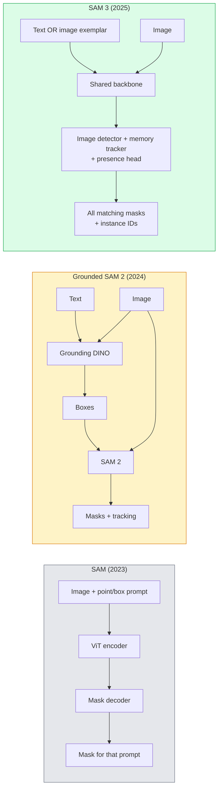

# SAM 3 与开放词汇分割

> 给模型一个文本提示和一张图像，就能得到每个匹配对象的掩码。SAM 3 将其变为一次前向传播。

**Type:** Use + Build
**Languages:** Python
**Prerequisites:** Phase 4 Lesson 07 (U-Net), Phase 4 Lesson 08 (Mask R-CNN), Phase 4 Lesson 18 (CLIP)
**Time:** ~60 分钟

## 学习目标

- 区分 SAM（仅视觉提示）、Grounded SAM / SAM 2（检测器 + SAM）和 SAM 3（通过可提示概念分割原生支持文本提示）
- 解释 SAM 3 的架构：共享主干 + 图像检测器 + 基于记忆的视频跟踪器 + 存在头 + 解耦的检测器-跟踪器设计
- 使用 Hugging Face `transformers` 的 SAM 3 集成进行文本提示检测、分割和视频跟踪
- 根据延迟、概念复杂度和部署目标，在 SAM 3、Grounded SAM 2、YOLO-World 和 SAM-MI 之间做出选择

## 问题

2023 年的 SAM 是一个仅支持视觉提示的模型：你点击一个点或画一个框，它返回一个掩码。对于"给我这张照片里所有的橙子"，你需要一个检测器（Grounding DINO）先生成框，再用 SAM 对每个框进行分割。Grounded SAM 把这个流程串了起来，但它是两个冻结模型的级联，不可避免地存在误差累积。

SAM 3（Meta，2025 年 11 月，ICLR 2026）消除了这个级联。它接受一个简短名词短语或图像示例作为提示，并在单次前向传播中返回所有匹配的掩码和实例 ID。这就是**可提示概念分割（PCS）**。结合 2026 年 3 月的 Object Multiplex 更新（SAM 3.1），它还能高效地在视频中跟踪同一概念的多个实例。

本节课关注的是这一结构性转变。2D 分割、检测和文本-图像对齐已合并为一个模型。生产环境的问题不再是"我该串联哪些流程"，而是"哪个可提示模型能端到端地处理我的用例"。

## 概念

### 三代模型



### 可提示概念分割

"概念提示"是一个简短的名词短语（`"yellow school bus"`、`"striped red umbrella"`、`"hand holding a mug"`）或图像示例。模型返回图像中与该概念匹配的每个实例的分割掩码，以及每个匹配的唯一实例 ID。

这与经典的视觉提示 SAM 有三点不同：

1. 无需逐实例提示 —— 一个文本提示返回所有匹配。
2. 开放词汇 —— 概念可以是任何可以用自然语言描述的内容。
3. 一次返回多个实例，而不是每个提示一个掩码。

### 关键架构组件

- **共享主干** —— 单个 ViT 处理图像。检测头和基于记忆的跟踪器都从它读取。
- **存在头** —— 预测概念是否存在于图像中。将"它在这里吗？"与"它在哪里？"解耦。减少对不存在概念的误报。
- **解耦的检测器-跟踪器** —— 图像级检测和视频级跟踪使用独立的头，互不干扰。
- **记忆库** —— 跨帧存储每个实例的特征以用于视频跟踪（SAM 2 使用的相同机制）。

### 大规模训练

SAM 3 在 **400 万个独特概念**上训练，这些概念由一个使用 AI + 人工审核迭代标注和纠错的数据引擎生成。新的 **SA-CO 基准**包含 27 万个独特概念，比以往基准大 50 倍。SAM 3 在 SA-CO 上达到人类表现的 75-80%，并在图像 + 视频 PCS 上使现有系统性能翻倍。

### SAM 3.1 Object Multiplex

2026 年 3 月的更新：**Object Multiplex** 引入了一种共享记忆机制，可同时联合跟踪同一概念的多个实例。此前，跟踪 N 个实例意味着 N 个独立的记忆库。Multiplex 将其合并为一个带每实例查询的共享记忆。结果：多目标跟踪速度大幅提升，且不牺牲精度。

### 2026 年 Grounded SAM 仍然重要的场景

- 当你需要换入特定的开放词汇检测器时（DINO-X、Florence-2）。
- 当 SAM 3 的许可证（HF 上需申请）成为障碍时。
- 当你需要比 SAM 3 暴露的检测器阈值更多的控制时。
- 用于检测器组件的研究 / 消融工作。

模块化流程仍有其位置。对于大多数生产工作，SAM 3 是更简单的答案。

### YOLO-World 与 SAM 3 对比

- **YOLO-World** —— 仅开放词汇检测器（无掩码）。实时。最适用于需要高帧率框输出的场景。
- **SAM 3** —— 完整的分割 + 跟踪。较慢但输出更丰富。

生产分工：YOLO-World 用于仅需快速检测的流程（机器人导航、快速仪表盘），SAM 3 用于任何需要掩码或跟踪的场景。

### SAM-MI 效率优化

SAM-MI（2025-2026）解决了 SAM 的解码器瓶颈。核心思想：

- **稀疏点提示** —— 使用少量精心选择的点而非密集提示；将解码器调用减少 96%。
- **浅层掩码聚合** —— 将粗糙的掩码预测合并为一个更清晰的掩码。
- **解耦掩码注入** —— 解码器接收预先计算的掩码特征，而非重新运行。

结果：在开放词汇基准上比 Grounded-SAM 快约 1.6 倍。

### 三个模型的输出格式

所有模型返回相同的大致结构（框 + 标签 + 分数 + 掩码 + ID），这一点很有帮助 —— 你的下游流水线不必根据运行的是哪个模型来分支。

```figure
cv3-open-vocab
```

## 动手构建

### 第 1 步：提示构造

构建一个辅助函数，将用户句子转换为 SAM 3 概念提示列表。这是"用户输入的内容"与"模型消费的内容"之间的边界。

```python
def split_concepts(sentence):
    """
    Heuristic splitter for multi-concept prompts.
    Returns list of short noun phrases.
    """
    for sep in [",", ";", "and", "or", "&"]:
        if sep in sentence:
            parts = [p.strip() for p in sentence.replace("and ", ",").split(",")]
            return [p for p in parts if p]
    return [sentence.strip()]

print(split_concepts("cats, dogs and balloons"))
```

SAM 3 每次前向传播接受一个概念；对于多概念查询，需要循环或批处理。

### 第 2 步：后处理辅助函数

将 SAM 3 的原始输出转换为符合我们 Phase 4 Lesson 16 流水线契约的干净检测结果列表。

```python
from dataclasses import dataclass
from typing import List

@dataclass
class ConceptDetection:
    concept: str
    instance_id: int
    box: tuple          # (x1, y1, x2, y2)
    score: float
    mask_rle: str       # run-length encoded


def rle_encode(binary_mask):
    flat = binary_mask.flatten().astype("uint8")
    runs = []
    prev, count = flat[0], 0
    for v in flat:
        if v == prev:
            count += 1
        else:
            runs.append((int(prev), count))
            prev, count = v, 1
    runs.append((int(prev), count))
    return ";".join(f"{v}x{c}" for v, c in runs)
```

即使有许多高分辨率掩码，RLE 也能保持响应负载较小。相同格式适用于 SAM 2、SAM 3、Grounded SAM 2。

### 第 3 步：统一的开放词汇分割接口

将你拥有的任何后端（SAM 3、Grounded SAM 2、YOLO-World + SAM 2）封装在同一个方法之后。后端更换时，你的下游代码无需更改。

```python
from abc import ABC, abstractmethod
import numpy as np

class OpenVocabSeg(ABC):
    @abstractmethod
    def detect(self, image: np.ndarray, concept: str) -> List[ConceptDetection]:
        ...


class StubOpenVocabSeg(OpenVocabSeg):
    """
    Deterministic stub used for pipeline testing when real models are not loaded.
    """
    def detect(self, image, concept):
        h, w = image.shape[:2]
        return [
            ConceptDetection(
                concept=concept,
                instance_id=0,
                box=(w * 0.2, h * 0.3, w * 0.5, h * 0.8),
                score=0.89,
                mask_rle="0x100;1x50;0x200",
            ),
            ConceptDetection(
                concept=concept,
                instance_id=1,
                box=(w * 0.55, h * 0.25, w * 0.85, h * 0.75),
                score=0.74,
                mask_rle="0x80;1x40;0x220",
            ),
        ]
```

实际的 `SAM3OpenVocabSeg` 子类会封装 `transformers.Sam3Model` 和 `Sam3Processor`。

### 第 4 步：Hugging Face SAM 3 用法（参考）

对于实际模型，使用 `transformers` 集成：

```python
from transformers import Sam3Processor, Sam3Model
import torch

processor = Sam3Processor.from_pretrained("facebook/sam3")
model = Sam3Model.from_pretrained("facebook/sam3").eval()

inputs = processor(images=pil_image, return_tensors="pt")
inputs = processor.set_text_prompt(inputs, "yellow school bus")

with torch.no_grad():
    outputs = model(**inputs)

masks = processor.post_process_masks(
    outputs.masks, inputs.original_sizes, inputs.reshaped_input_sizes
)
boxes = outputs.boxes
scores = outputs.scores
```

一个提示，一次调用返回所有匹配。

### 第 5 步：量化 Grounded SAM 2 免费给你的东西

一个诚实的基准：在真实流水线中用 SAM 3 替换 Grounded SAM 2 会发生什么？

- 延迟：SAM 3 省去一次前向传播（无需独立检测器），但模型本身更重；通常净中性或略有加速。
- 精度：SAM 3 在稀有或组合概念上明显更好（"红白条纹的雨伞"）。在常见的单词概念上相似。
- 灵活性：Grounded SAM 2 允许更换检测器（DINO-X、Florence-2、Grounding DINO 1.5）；SAM 3 是一体的。

结论：SAM 3 是 2026 年开放词汇分割的默认选择。当你需要检测器灵活性或不同许可条款时，Grounded SAM 2 仍是正确的答案。

## 使用它

生产部署模式：

- **实时标注** —— SAM 3 + CVAT 的标签即文本提示功能。标注员选择标签名；SAM 3 预标注每个匹配实例。然后审核和修正。
- **视频分析** —— SAM 3.1 Object Multiplex 用于多目标跟踪；将帧输入基于记忆的跟踪器。
- **机器人** —— SAM 3 用于开放词汇操作（"拿起红色的杯子"）；作为规划原语运行。
- **医学影像** —— 在医学概念上微调的 SAM 3；需要在 HF 上申请访问权限。

Ultralytics 在其 Python 包中封装了 SAM 3：

```python
from ultralytics import SAM

model = SAM("sam3.pt")
results = model(image_path, prompts="yellow school bus")
```

与 YOLO 和 SAM 2 相同的接口。

## 交付它

本节课产出：

- `outputs/prompt-open-vocab-stack-picker.md` —— 一个根据延迟、概念复杂度和许可情况选择 SAM 3 / Grounded SAM 2 / YOLO-World / SAM-MI 的提示。
- `outputs/skill-concept-prompt-designer.md` —— 一个将用户话语转换为格式良好的 SAM 3 概念提示的技能（拆分、消歧、回退）。

## 练习

1. **（简单）** 用你选择的概念提示在 10 张图像上运行 SAM 3。在相同图像上与 SAM 2 + Grounding DINO 1.5 对比。报告每个模型遗漏了哪些概念。
2. **（中等）** 在 SAM 3 之上构建一个"点击包含 / 点击排除"的 UI：文本提示返回候选实例；用户点击确定哪些算作正例。以 JSON 输出最终概念集。
3. **（困难）** 在自定义概念集（例如 5 种电子元件）上微调 SAM 3，每种概念 20 张标注图像。在同一测试集上与零样本 SAM 3 对比；测量掩码 IoU 的提升。

## 关键术语

| 术语 | 人们怎么说 | 实际含义 |
|------|----------------|----------------------|
| 开放词汇分割 | "按文本分割" | 为自然语言描述的对象生成掩码，而非固定标签集 |
| PCS | "可提示概念分割" | SAM 3 的核心任务 —— 给定名词短语或图像示例，分割所有匹配实例 |
| 概念提示 | "文本输入" | 简短名词短语或图像示例；不是完整句子 |
| 存在头 | "它在这里吗？" | SAM 3 模块，在定位之前判断概念是否存在于图像中 |
| SA-CO | "SAM 3 基准" | 27 万概念的开放词汇分割基准；比以往开放词汇基准大 50 倍 |
| Object Multiplex | "SAM 3.1 更新" | 共享记忆的多目标跟踪；快速联合跟踪多个实例 |
| Grounded SAM 2 | "模块化流水线" | 检测器 + SAM 2 级联；在需要更换检测器时仍然相关 |
| SAM-MI | "高效 SAM 变体" | 掩码注入，比 Grounded-SAM 快 1.6 倍 |

## 延伸阅读

- [SAM 3: Segment Anything with Concepts (arXiv 2511.16719)](https://arxiv.org/abs/2511.16719)
- [SAM 3.1 Object Multiplex (Meta AI, 2026 年 3 月)](https://ai.meta.com/blog/segment-anything-model-3/)
- [Hugging Face 上的 SAM 3 模型页面](https://huggingface.co/facebook/sam3)
- [Grounded SAM 2 教程 (PyImageSearch)](https://pyimagesearch.com/2026/01/19/grounded-sam-2-from-open-set-detection-to-segmentation-and-tracking/)
- [Ultralytics SAM 3 文档](https://docs.ultralytics.com/models/sam-3/)
- [SAM3-I: 指令感知的 SAM (arXiv 2512.04585)](https://arxiv.org/abs/2512.04585)