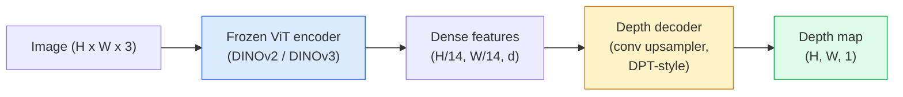

# 单目深度与几何估计

> 深度图是一种单通道图像，其中每个像素表示到相机的距离。过去在没有双目相机或 LiDAR 的情况下，从单个 RGB 帧预测深度图几乎不可能。到 2026 年，一个冻结的 ViT 编码器加上一个轻量级解码头，就能达到与真值相差几个百分点以内的精度。

**Type:** Build + Use
**Languages:** Python
**Prerequisites:** 阶段 4 第 14 课（ViT），阶段 4 第 17 课（自监督视觉），阶段 4 第 07 课（U-Net）
**Time:** 约 60 分钟

## 学习目标

- 区分相对深度与度量深度，并说明每个生产级模型（MiDaS、Marigold、Depth Anything V3、ZoeDepth）各自解决的是哪一种
- 使用 Depth Anything V3（DINOv2 backbone）对任意单张图像预测深度，无需标定
- 解释为什么单目深度估计仅凭一张图像就能奏效（透视线索、纹理梯度、学习到的先验），以及它无法恢复什么（绝对尺度、被遮挡的几何）
- 利用深度图和针孔相机内参，将 2D 检测结果提升为 3D 点

## 问题所在

深度是 2D 计算机视觉中缺失的那个维度。给定 RGB，你知道物体在图像平面上的位置，却不知道它们有多远。深度传感器（双目相机、LiDAR、飞行时间相机）可以直接解决这一问题，但价格昂贵、结构脆弱且量程有限。

单目深度估计——从单个 RGB 帧预测深度——过去只能产生模糊、不可靠的输出。到 2026 年，大规模预训练编码器改变了这一局面：Depth Anything V3 使用冻结的 DINOv2 backbone，其深度图能泛化到室内、室外、医学和卫星等领域。Marigold 将深度重新建模为条件扩散问题。ZoeDepth 则回归真实的度量距离。

深度也是连接 2D 检测与 3D 理解的桥梁：将检测框内的像素乘以深度，就能把 2D 物体提升为 3D 点云。这是所有 AR 遮挡系统、所有避障流水线以及每一个“拿起杯子”机器人的核心。

## 核心概念

### 相对深度与度量深度

- **相对深度（Relative depth）**——有序的 `z` 值，没有真实世界单位。“像素 A 比像素 B 更近，但距离之比不与米挂钩。”
- **度量深度（Metric depth）**——以米为单位的到相机的绝对距离。要求模型学习到图像线索与真实距离之间的统计关系。

MiDaS 和 Depth Anything V3 产生相对深度。Marigold 产生相对深度。ZoeDepth、UniDepth 和 Metric3D 产生度量深度。度量模型对相机内参敏感；相对模型则不敏感。

### 编码器-解码器模式



Depth Anything V3 冻结编码器，仅训练 DPT 风格的解码器。编码器提供丰富的特征；解码器将特征插值回图像分辨率并回归深度。

### 为什么单张图像能产生深度

一张 2D 图像包含许多与深度相关的单目线索：

- **透视**——3D 中的平行线在 2D 中汇聚。
- **纹理梯度**——远处的表面纹理更小、更密。
- **遮挡顺序**——较近的物体会遮挡较远的物体。
- **大小恒常性**——已知物体（汽车、人）能提供大致的尺度。
- **大气透视**——在室外场景中，远处的物体显得更朦胧、更偏蓝。

在数十亿张图像上训练的 ViT 会内化这些线索。只要有足够的数据和强大的 backbone，单目深度估计无需任何显式的 3D 监督就能达到合理的精度。

### 单目深度无法做到的事

- **绝对度量尺度**——在没有内参或场景中没有已知物体的情况下无法确定。网络可以预测“杯子是勺子两倍远”，却不知道杯子到底是 1 米还是 10 米远。
- **被遮挡的几何**——椅子的背面是看不到的，无法可靠地推断。
- **真正无纹理 / 反光的表面**——镜子、玻璃、均匀的墙面。网络会给出看似合理但错误的深度。

### 2026 年的 Depth Anything V3

- 使用原版 DINOv2 ViT-L/14 作为编码器（冻结）。
- DPT 解码器。
- 在来自多种来源的带位姿图像对上训练（除光度一致性外无需显式深度监督）。
- 能够从**任意数量的视觉输入、无论是否已知相机位姿**预测空间一致的几何。
- 在单目深度、任意视角几何、视觉渲染、相机位姿估计上均为 SOTA。

这是 2026 年需要深度时的即插即用模型。

### Marigold——用扩散模型做深度

Marigold（Ke 等，CVPR 2024）将深度估计重新建模为条件图像到图像的扩散过程。条件：RGB。目标：深度图。它以预训练的 Stable Diffusion 2 U-Net 作为 backbone。其输出深度图在物体边界处异常锐利。代价是推理比前馈模型慢（10-50 步去噪）。

### 内参与针孔相机

要将带深度 `d` 的像素 `(u, v)` 提升为相机坐标系下的 3D 点 `(X, Y, Z)`：

```
fx, fy, cx, cy = camera intrinsics
X = (u - cx) * d / fx
Y = (v - cy) * d / fy
Z = d
```

内参可来自 EXIF 元数据、标定板，或单目内参估计器（Perspective Fields、UniDepth）。在没有内参的情况下，你仍可以假设 60-70° 的 FOV 和中等分辨率的principal点来渲染点云——可用于可视化，但不能用于测量。

### 评估

两个标准指标：

- **AbsRel**（绝对相对误差）：`mean(|d_pred - d_gt| / d_gt)`。越低越好。生产级模型约为 0.05-0.1。
- **delta < 1.25**（阈值准确率）：满足 `max(d_pred/d_gt, d_gt/d_pred) < 1.25` 的像素比例。越高越好。SOTA 为 0.9 以上。

对于相对深度（Depth Anything V3、MiDaS），评估使用这两个指标的尺度和平移不变版本。

```figure
depth-sweep
```

## 动手构建

### 步骤 1：深度指标

```python
import torch

def abs_rel_error(pred, target, mask=None):
    if mask is not None:
        pred = pred[mask]
        target = target[mask]
    return (torch.abs(pred - target) / target.clamp(min=1e-6)).mean().item()


def delta_accuracy(pred, target, threshold=1.25, mask=None):
    if mask is not None:
        pred = pred[mask]
        target = target[mask]
    ratio = torch.maximum(pred / target.clamp(min=1e-6), target / pred.clamp(min=1e-6))
    return (ratio < threshold).float().mean().item()
```

评估前务必屏蔽无效深度像素（零、NaN、饱和值）。

### 步骤 2：尺度与平移对齐

对于相对深度模型，在计算指标之前需将预测与真值对齐。对 `a * pred + b = target` 做最小二乘拟合：

```python
def align_scale_shift(pred, target, mask=None):
    if mask is not None:
        p = pred[mask]
        t = target[mask]
    else:
        p = pred.flatten()
        t = target.flatten()
    A = torch.stack([p, torch.ones_like(p)], dim=1)
    coeffs, *_ = torch.linalg.lstsq(A, t.unsqueeze(-1))
    a, b = coeffs[:2, 0]
    return a * pred + b
```

在评估 MiDaS / Depth Anything 时，先运行 `align_scale_shift` 再运行 `abs_rel_error`。

### 步骤 3：将深度提升为点云

```python
import numpy as np

def depth_to_point_cloud(depth, intrinsics):
    H, W = depth.shape
    fx, fy, cx, cy = intrinsics
    v, u = np.meshgrid(np.arange(H), np.arange(W), indexing="ij")
    z = depth
    x = (u - cx) * z / fx
    y = (v - cy) * z / fy
    return np.stack([x, y, z], axis=-1)


depth = np.random.uniform(0.5, 4.0, (240, 320))
intr = (320.0, 320.0, 160.0, 120.0)
pc = depth_to_point_cloud(depth, intr)
print(f"point cloud shape: {pc.shape}  (H, W, 3)")
```

一个函数，覆盖所有需要 3D 提升的应用。将点云导出为 `.ply`，并在 MeshLab 或 CloudCompare 中打开。

### 步骤 4：用合成深度场景做冒烟测试

```python
def synthetic_depth(size=96):
    yy, xx = np.meshgrid(np.arange(size), np.arange(size), indexing="ij")
    # Floor: linear gradient from near (top) to far (bottom)
    depth = 1.0 + (yy / size) * 4.0
    # Box in the middle: closer
    mask = (np.abs(xx - size / 2) < size / 6) & (np.abs(yy - size * 0.6) < size / 6)
    depth[mask] = 2.0
    return depth.astype(np.float32)


gt = torch.from_numpy(synthetic_depth(96))
pred = gt + 0.3 * torch.randn_like(gt)  # simulated prediction
aligned = align_scale_shift(pred, gt)
print(f"before align  absRel = {abs_rel_error(pred, gt):.3f}")
print(f"after align   absRel = {abs_rel_error(aligned, gt):.3f}")
```

### 步骤 5：Depth Anything V3 的使用（参考）

```python
import torch
from transformers import pipeline
from PIL import Image

pipe = pipeline(task="depth-estimation", model="LiheYoung/depth-anything-v2-large")

image = Image.open("street.jpg").convert("RGB")
out = pipe(image)
depth_np = np.array(out["depth"])
```

只需三行代码。`out["depth"]` 是 PIL 灰度图；数学运算前需转换为 numpy。具体到 Depth Anything V3，模型发布后替换一次模型 id 即可；API 不变。

## 用起来

- **Depth Anything V3**（Meta AI / ByteDance，2024-2026）——相对深度的默认选择。生产中最快的 ViT-large backbone 模型。
- **Marigold**（ETH，2024）——视觉质量最高，推理较慢。
- **UniDepth**（ETH，2024）——带相机内参估计的度量深度。
- **ZoeDepth**（Intel，2023）——度量深度；较老但依然可靠。
- **MiDaS v3.1**——老牌但稳定；是很好的对比基线。

典型的集成模式：

1. RGB 帧到达。
2. 深度模型生成深度图。
3. 检测器生成检测框。
4. 通过深度将框的中心点提升到 3D；如有可用的点云则进行合并。
5. 下游应用：AR 遮挡、路径规划、物体尺寸估计、替代双目相机。

在实时场景中，Depth Anything V2 Small（INT8 量化）在消费级 GPU 上以 518x518 分辨率可达约 30 fps。

## 上线交付

本课产出：

- `outputs/prompt-depth-model-picker.md`——在给定延迟、度量 vs 相对深度需求和场景类型的情况下，在 Depth Anything V3、Marigold、UniDepth、MiDaS 之间做出选择。
- `outputs/skill-depth-to-pointcloud.md`——一个技能：从深度图构建点云，正确处理内参并导出为 `.ply`。

## 练习

1. **（简单）**在任意 10 张你书桌的图片上运行 Depth Anything V2。将深度保存为灰度 PNG 并检查。找出一个预测深度看起来不对的物体，并解释为什么单目线索失效了。
2. **（中等）**给定 Depth Anything V2 的 RGB + 深度，提升为点云并用 `open3d` 渲染。比较两个场景（室内 / 室外），指出哪个看起来更可信。
3. **（困难）**取五对图像，它们之间仅相差一个已知物体的位置（例如瓶子向前移动了 30 cm）。用 UniDepth 对两幅图像预测度量深度。报告预测的距离差与真实的 30 cm 的对比。

## 关键术语

| 术语 | 人们的说法 | 实际含义 |
|------|----------------|----------------------|
| 单目深度 | “单图像深度” | 从单个 RGB 帧估计深度，不用双目或 LiDAR |
| 相对深度 | “有序深度” | 无真实世界单位的有序 z 值 |
| 度量深度 | “绝对距离” | 以米为单位的深度；需要标定或用度量监督训练的模型 |
| AbsRel | “绝对相对误差” | |d_pred - d_gt| / d_gt 的均值；标准深度指标 |
| Delta 准确率 | “delta < 1.25” | 预测值与真值相差在 25% 以内的像素比例 |
| 针孔相机 | “fx, fy, cx, cy” | 用于将 (u, v, d) 提升为 (X, Y, Z) 的相机模型 |
| DPT | “Dense Prediction Transformer” | 在冻结 ViT 编码器之上用于深度的基于卷积的解码器 |
| DINOv2 backbone | “它有效的原因” | 无需深度标签即可跨域泛化的自监督特征 |

## 延伸阅读

- [Depth Anything V3 论文页面](https://depth-anything.github.io/)——基于 DINOv2 编码器的 SOTA 单目深度估计
- [Marigold（Ke 等，CVPR 2024）](https://marigoldmonodepth.github.io/)——基于扩散的深度估计
- [UniDepth（Piccinelli 等，2024）](https://arxiv.org/abs/2403.18913)——带内参的度量深度
- [MiDaS v3.1（Intel ISL）](https://github.com/isl-org/MiDaS)——经典的相对深度基线
- [DINOv3 博客文章（Meta）](https://ai.meta.com/blog/dinov3-self-supervised-vision-model/)——提升了深度精度的编码器家族